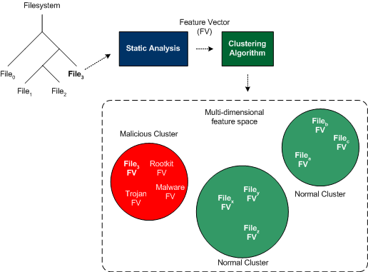
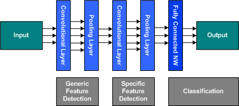
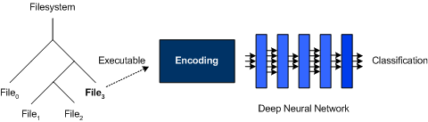
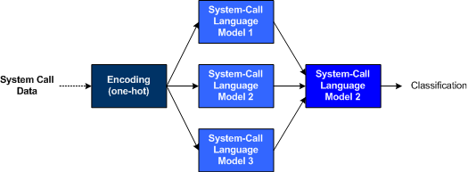
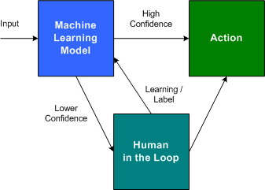

# AI 与安全性
探索如何在威胁检测与管理中使用机器学习算法

**标签:** 人工智能,机器学习,深度学习

[原文链接](https://developer.ibm.com/zh/articles/ai-and-security/)

M. Tim Jones

发布: 2019-09-12

* * *

网络犯罪日益猖獗，随着网络犯罪数量的不断增长，其管理成本会越来越高，管理工作也会越来越耗时。问题在于，威胁及其攻击方法和防御方法都在不断升级。在本文中，我们将探索如何在威胁检测与管理中使用机器学习算法。

随着数字化不断深入到我们的生活当中，关于我们自身的汇总数据正逐渐产生风险。无论是社交媒体、商务网站、IoT 设备还是来自智能手机和 Web 浏览器的跟踪数据，互联网上的实体对于我们的了解之彻底远远超出我们的想象。问题在于这些数据的价值，以及在大部分情况下这些数据的获取方式是如此的简单。

毋庸置疑，机器学习早已应用到计算机安全领域，可帮助保护计算机系统和网上数据。Accenture 于 2019 发现，仅有 28% 的组织部署了机器学习方法，但在因安全技术而实现的成本节省方面，机器学习却高居次席。在本文中，我们将探索各种安全技术，了解机器学习（和深度学习）是如何应用于这些技术的，以及在打击网络犯罪和数据盗窃方面的下一步有力举措。

## 早期非 AI 方法

早期的安全威胁出现在一些早期的个人计算机上（例如，1986 年有早期个人计算机感染了“大脑”病毒）。由于当时还没有网络，所以这种病毒并不是通过网络来传播，而是通过软盘来感染系统并进一步传播自身。在计算机可供多人访问（在多用户系统环境中或者通过联网）后，就开始出现大规模的安全威胁。

有一种沿用至今的早期方法称为 _加入阻止列表_（参阅图 1）。通过这种方法，病毒数据库可包含已知病毒的签名（例如，密码散列）并使用此信息来控制对系统的访问。

_图 1\. 通过密码签名加入阻止列表_

与加入阻止列表相对应的一种方法称为 _加入允许列表_。允许列表用于定义可访问系统或者可在系统上执行的可接受实体的列表。这两种方法都很实用，并且均可用于限制访问（使用允许列表）并在发现携带威胁时对威胁加以处理（使用阻止列表）。

防病毒应用程序使用签名来检测潜在威胁，其缺点在于它仅限于检测已知的病毒。

网络安全通常依靠防火墙和类似允许列表的配置来限制访问。防火墙是通过规则来配置的，此类规则可定义可能与网络进行通信的主机、应用程序和协议。

电子邮件已经成为安全威胁和不受欢迎的消息的常见传输途径。早期用于限制这种所谓垃圾邮件的方法包括通过关键字或发件人来阻止访问的原始过滤器。

## 早期 AI 方法

上述各种方法（从基于签名的扫描到防火墙和过滤）都依赖于已知晓威胁是什么。在未经更新的情况下，它们无法处理新的威胁。但是，机器学习可以帮助填补这一漏洞。

在防病毒机制的环境中，有一种很有趣的方法是忽略签名，转而关注于程序的潜在行为（参阅图 2）。通过所谓的 _静态分析_ 对程序进行二进制分析，可以将程序的意图显示为一组功能，例如，注册自动启动功能或者禁用安全控件。这些可能并不总是代表恶意，但通过根据发现的行为（编码为特征向量）对这些程序加以分析和分类，就有可能根据这些程序与其他恶意程序的关系来识别恶意软件程序。当程序与恶意程序分类在一起时，它就可能代表着一种威胁。

_图 2\. 基于行为的恶意软件检测_

网络安全也可以从机器学习中受益。根据 [网络攻击有效内容](https://github.com/foospidy/payloads) 对神经网络进行训练，可以将其应用于防火墙以识别潜在的恶意程序包，并阻止其进入网络。

最早在安全领域应用 AI 的一个例子是过滤垃圾邮件。它并非对电子邮件应用原始过滤器，而是使用贝叶斯过滤器来应用概率。通过这种方法，用户可以识别电子邮件是否属于垃圾邮件。该算法会根据邮件是否属于垃圾邮件来调整所有文字的优先级。随着时间的推移，该算法发现“再融资”一词与垃圾邮件存在关联的概率高于其他文字，并将其归为垃圾邮件。贝叶斯方法自 20 世纪 90 年代起就已成为电子邮件过滤的基准方法。

## 基于免疫的方法

基于免疫的方法采用受生物学启发的机制来保障安全。与我们的免疫系统使用 T 细胞来发现和识别感染的方式相似，人工免疫系统 (AIS) 会甄别哪些文件和应用程序应存在于主机中以及哪些文件和应用程序应予以移除。

AIS 中采用的一种方法是允许安全应用程序了解主机或设备上应用程序正常运行时的状态。此类训练可以让 AIS 模型了解主机正常运行时的状态。训练完成后，此模型便可以监控运行中的主机，在检测到异常行为后，它就会识别并隔离威胁。

AIS 自 20 世纪 90 年代创建以来，已经开展了广泛的研究，并生成了四种主要算法：阴性选择、人工免疫网络、克隆选择和树突状细胞。每一种算法都是受到其对应的生物学方法的启发，从而为复杂问题提供了解决方案。甚至对免疫系统中各元素的用途也进行了研究，例如，T 细胞用于检测和攻击，B 细胞用于免疫记忆，以防将来遇到类似攻击。

阴性选择机制可以为宿主中应存在的细胞提供耐受性。被选中销毁的细胞属于外来抗原。因此，阴性选择与允许列表方法存在相似之处。

但就像我们自身的免疫系统一样，较为复杂的攻击可以使这些基于 AIS 的系统对抗自己的主机，从而导致拒绝服务式的攻击。

## 应用的深度学习

深度学习是一种相对较新的机器学习模型，它是以早期神经网络研究为基础而构建的。深度学习正如其名，是由独立神经网络的深度管道组成的（参阅图 3）。最常见的一种网络类型是卷积神经网络 (CNN)，它已被证明能够有效识别图像中的对象。另外还有 Long Short Term Memory (LSTM) 网络，这是一种递归神经网络，适合解决时间序列问题。

_图 3\. 深度学习模型_

这些网络的早期阶段可以检测输入的一般特征，后期阶段可以检测与当前任务相关的更具体的特征。例如，早期图层捕获特征对于试图理解它们的人来说是不可识别的，但后期特征可以表示对象中出现的条纹，这可用于区别斑马与普通马。

在恶意软件分类环境中，深度学习已经被证明能够在这一领域内发挥作用。在此环境中，可执行应用程序由一系列字节组成，其中包含已定义的结构以及在给定处理器架构上运行的数字指令。这些指令并不直接使用可执行应用程序的数字指令，而是使用嵌入式编码方法进行编码（参阅图 4）。这需要提取数字指令并将其转换为更高维度的空间（类似于使用 word2vec 将文字编码为向量以供深度学习使用）。

_图 4\. 利用深度学习进行恶意软件检测_

随后，可通过卷积层和池化层将嵌入的编码应用于深度神经网络 (DNN) 以生成分类。已使用一组表示正常程序和恶意软件程序的可执行应用程序来训练了此 DNN。此 DNN 可以成功隔离构成恶意软件程序的特征与构成普通程序的特征。 [Fireeye](https://www.fireeye.com/blog/threat-research/2018/12/what-are-deep-neural-networks-learning-about-malware.html) 在网络中检测恶意软件的准确率高达 96%，从而证明了此方法的有效性。

深度学习应用于安全领域的另一个有趣例子是在入侵检测系统 (IDS) 领域。例如，构建了一个基于 LSTM 的 DNN，它使用系统调用跟踪来对异常入侵进行分类。但它并不是使用单个检测器对系统调用语言进行建模，而是使用一组检测器来最大程度降低误报率。每个检测器均表示一个 LSTM DNN，并将接受系统调用序列。这些检测器各有不同，它们使用不同的数据集进行训练，或者在训练过程中使用不同的参数。

_图 5\. 利用 LSTM 深度学习进行入侵检测_

此方法在 [首尔国立大学](http://www.covert.io/research-papers/deep-learning-security/LSTM-based%20System-call%20Language%20Modeling%20and%20Robust%20Ensemble%20Method%20for%20Designing%20Host-based%20Intrusion%20Detection%20Systems.pdf) 使用成功，其检测率高达 99.8%，误报率为 5.5%。此方法表明只需了解所执行的操作系统调用，而不必了解整个应用程序本身。

深度学习已应用到安全方面的众多领域当中，从恶意软件检测和入侵检测到恶意代码检测。DNN 已被证明在各种安全任务中都非常有效。但 DNN 有一个问题，那就是非常容易受到所谓的对抗样本的误导。在视觉 CNN 环境中，这些图像是专为诱导 DNN 而构建的，它们使 DNN 认为某个图像看上去像是干扰，而实际上被高精度地分类为其他内容。

## Adversarial Robustness Toolbox

虽然深度学习是应用于各种问题领域的最新技术，但它们也容易受到攻击。幸运的是，有多种方法可用于验证 DNN，以便了解在面临对抗样本时给定 DNN 实施的稳健性。 [Adversarial Robustness Toolbox](https://www.ibm.com/blogs/research/2018/04/ai-adversarial-robustness-toolbox/) (ART) 可用于抵御对抗样本并了解给定 DNN 实施的稳健性。

ART 是用 Python 编写的，包含许多用于攻击和防御 DNN 分类器的最先进方法的实现。它支持大多数的热门深度学习框架（例如，TensorFlow、Keras 和 PyTorch），虽然它主要关注于视觉分类器，但未来会涵盖语音、文本和时间序列应用程序。

## 人机回圈 AI

现如今在构建机器学习模型时，人类显然是其中不可或缺的一环。我们需要定义算法，收集和标记数据，并部署经过训练的模型。在这一背景下， _人机回圈_ 与在部署模型后为其提供支持的人有关，这有助于提升模型的有效性以及现场训练成果。如图 6 中所示，机器学习模型可以在对输入数据分类充满信心时采取行动。但是，当该模型对于输入表示的是无恶意内容还是威胁内容感到不确定时，它可以依靠人类的帮助来对输入进行检验。

_图 6\. 利用人机回圈提高准确性_

根据人类的决定，该模型在输入被标记为威胁时可以进行新的学习，以便将来可以快速自主地采取行动来处理此类威胁。如果存在误报问题，人类还可以随机检验自主行动，以便了解模型的高置信度行动。

机器擅长根据现有知识来识别模式，但并不擅长处理全新的场景。因此，人机回圈可以提供重要的反馈机制，帮助提高模型的有效性。

## 结束语

安全是典型的军备竞赛。它是通过抵御一系列已知和已发觉的威胁来保护系统和软件。由于可以通过创建漏洞利用程序来绕过这些保护措施，这就促使系统和软件供应商不断进行更新。随着新的系统漏洞利用程序（称为“零日漏洞”）根据感兴趣的设备、软件版本以及通过漏洞利用程序获取的能力来盗取大量资金，这种恶性循环仍在继续当中。

机器学习可帮助终止这种恶性循环，它不仅可以应对现有的威胁，还可以应对尚未被发觉的新威胁。这就是机器学习与安全领域产生交集的地方。机器学习社区通常会分享与机器学习相关的算法和技术，但助力机器学习发展和实现竞争优势的还是数据。

机器学习将从根本上改进安全解决方案，但它需要一种新的开放性和新的协作水平来扩展算法研究范围。深度学习展现了安全技术的未来前景，并且借助像 Adversarial Robustness Toolbox 这样的稳健性技术，使我们的在线交互变得更安全。

本文翻译自： [AI and security](https://developer.ibm.com/articles/ai-and-security/)（2019-08-19）