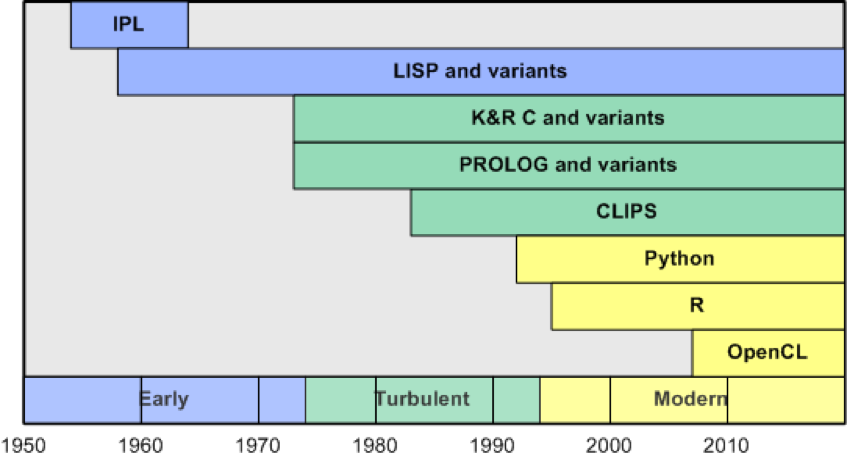

# AI 语言
了解人工智能的进化是如何随着可用于开发的语言的复杂性而增长的

**标签:** 人工智能

[原文链接](https://developer.ibm.com/zh/articles/cc-languages-artificial-intelligence/)

M. Tim Jones

发布: 2017-12-05

* * *

人工智能 (AI) 的演化速度随着可用于开发的语言复杂程度而增长。1959 年，IBM 的 Arthur Samuel 在 IBM® 701 计算机上，使用该机器的原生指令开发了一个自学西洋跳棋的程序（由于采用了搜索树和 alpha-beta 剪枝算法，该程序非常庞大）。但如今，人们使用各种各样的语言来开发 AI，从 Lisp 到 Python，再到 R。本文将探讨针对 AI 和机器学习发生了演化的语言。

用于构建 AI 和机器学习应用程序的编程语言各不相同。每个应用程序都有自己的局限和要求，而且在特定的问题领域，一些语言可能比其他语言更适合。根据 AI 应用程序的独特需求，不断有语言被创造出来并不断演化。

## 高级语言出现之前

在 AI 发展初期，唯一存在的语言就是机器本身的原生语言。这些称为机器语言或汇编语言的语言很难使用，因为仅存在简单的操作（比如将一个值从内存转移到寄存器，从累加器中减去一个内存地址的内容）。类似地，机器的数据类型是唯一可用的类型，而且它们受到了限制。但是，甚至在高级语言出现之前，人们就已经在开发复杂的 AI 应用程序。

1956 年，AI 的创始人之一 John McCarthy 创建了一种称为 alpha-beta 剪枝（alpha-beta pruning）的树搜索剪枝模式（tree search pruning scheme ）。在开展此工作时，许多 AI 问题都被视为搜索问题，同时人们开展了大量研究活动。内存和计算能力也受到限制，但此技术使开发人员能在资源有限的早期计算机系统上实现更复杂的问题。在早期的 AI 游戏应用程序中，就应用了 alpha-beta 剪枝算法技术。

同样，在 1956 年，Arthur Samuel 在 IBM 701 计算机上使用 McCarthy 的 alpha-beta 搜索算法开发了一个西洋跳棋程序。但是，Samuel 的游戏包含一个有益的元素：Samuel 不用亲自下西洋跳棋来教导该程序如何下棋，他引入了自学的概念，允许该程序自己玩跳棋。Samuel 的程序是用 IBM 701 系统的原生指令集开发的，由于他的应用程序很复杂，而且能使用的低级指令很少，所以该程序非常庞大。

## AI 语言演化的不同时代

AI 的发展历程充满着故事，其中一些非常详尽。我根据已发生的语言演化，将最近的 AI 历史分为 3 段。这 3 段包括初期 (1954-1973)、混乱时期 (1974-1993) 和近代时期（1994 年至今）。



### 初期 (1954-1973)

初期是一个发现的时代 — 引进新机器及其功能，开发高级语言，可以将这些机器的功能用于广泛的应用。

在 1958 年，人们为 IBM 704 计算机开发了一个国际象棋程序 NSS（以作者 Newell、Shaw 和 Simon 的名字命名）。该程序从搜索角度看待国际象棋，它也是 NSS 的作者使用 Information Processing Language (IPL) 开发的。IPL 是第一种为创建 AI 应用程序而开发的语言。IPL 是一种比机器语言更高级的语言，但只稍微高级了一点。不过，它允许开发人员在各种计算机系统上使用。

IPL 引入的大量特性如今仍在使用，比如列表、递归、高阶函数、符号，甚至能将元素列表映射到一个迭代并处理该列表的函数的生成器。第一版 IPL 从未实现，但后续版本 (2 – 6) 已被实现并用在各种系统上，比如 IBM 704、IBM 650 和 IBM 7090 等。用 IPL 开发的其他一些早期 AI 应用程序包括 Logic Theorist 和 General Problem Solver。

尽管 IPL 大获成功并广泛部署在当时的计算机架构上，但它很快被一种更高级的语言所取代，后者在几乎 60 年后仍在使用：LISP。IPL 晦涩难懂的语法被更简单、可扩展性更好的 LISP 所取代，但 IPL 的影响在之后类似的语言中仍能看到，尤其是它对作为核心语言特性的列表的重视。

LISP（即 LISt Processor）是 John McCarthy 在 1958 年创建的。在 1956 年的达特茅斯夏季 AI 研究项目之后，McCarthy 致力于为 AI 工作开发一种专注于 IBM 704 平台的语言。1957 年，在同一平台上引入了 FORTRAN，而 IBM 用一种称为 FORTRAN List Processing Language (FLPL) 的语言将 FORTRAN 扩展用于列表处理。此语言被成功用于 IBM 的平面几何学项目，但作为 FORTRAN 的扩展，FLPL 缺少一些关键特性。

LISP 是一种基础编程语言，实现了计算机科学中的许多核心概念，比如垃圾收集、树、动态类型、递归和高阶函数。LISP 不仅将数据表示为列表，甚至将源代码本身也定义为列表。此特性使 LISP 能够处理数据和 LISP 代码本身。LISP 也是可扩展的，它允许程序员创建新语法或者甚至新语言（称为特定于领域的语言）来嵌入到 LISP 中。

下面的示例演示了一个计算数字阶乘的 LISP 函数。在这段代码中，可以注意到使用了递归来计算阶乘（在阶乘函数中调用阶乘）。此函数可通过 `(factorial 9)` 调用。

```
(defun factorial (n)
(if (= n 0) 1
       (* n (factorial (- n 1)))))

```

Show moreShow more icon

1968 年，Terry Winograd 用 LISP 开发了一个开创性的程序，该程序名为 SHRDLU，能使用自然语言与用户进行交互。该程序代表着一个积木世界，用户可以与该世界进行交互，使用”拿起红色积木”或”一块积木能否支撑住一个角锥体？”等语句来告诉程序执行查询并与该世界交互。 这个简单实体积木世界中的自然语言理解和规划的演示，让人们对 AI 和 LISP 语言抱有极大希望。

### 混乱时期 (1974-1993)

混乱时期代表 AI 应用程序的开发和资助上的一个不稳定时期。这个时期始于第一个 AI 灰色时期，由于无法满足预期结果而导致资助消失。1980 年，专家系统重新点燃了对 AI 的激情并带来了资金（就像连接机制架构的进步一样），但到了 1987 年，AI 泡沫再次破灭，并引发了第二个 AI 灰色时期，尽管这段时间也取得了一些进步。

在这段时间，LISP 继续被用在一系列应用中，而且通过各种方言得到广泛传播。LISP 通过 Common LISP、Scheme、Clojure 和 Racket 生存了下来。LISP 背后的概念继续通过这些语言和其他语言而扩展到了函数领域之外。LISP 继续为最老的计算机代数系统 Macsyma（Project MAC 的 SYmbolic MAnipulator）提供支持。这个计算机代数环境是麻省理工学院的 AI 小组开发的，是许多程序的鼻祖，比如 Mathematica、Maple 等等。

在这个时间段，其他语言开始相继出现，它们不一定专注于 AI，但推动了 AI 的发展。`C` 语言是专为 UNIX 系统设计的的一种系统语言，但它很快发展为一种最流行的语言（具有各种变体，比如 `C++`），从系统到嵌入式设备开发都在使用它。

在这段时间，一种名为 Prolog (Programming in Logic) 的关键语言在法国开发出来。该语言实现了一个称为霍恩子句（Horn clauses）的逻辑子集，它允许使用事实和规则来表示信息，而且允许对这些关系执行查询。下面的简单 Prolog 示例演示了如何定义一个事实（苏格拉底是一个凡人）和一条规则（规定凡人终有一死）：

```
man( socrates ).                    // Fact: Socrates is a man.
mortal( X ) :- man( X ).            // Rule: All men are mortal.

```

Show moreShow more icon

Prolog 继续被用在各种领域，而且拥有许多变体，这些变体合并了诸多特性，比如面向对象、编译为原生机器码的能力，以及流行语言（比如 `C`）的接口。

Prolog 在这段时间的关键应用之一是开发专家系统（也称为生产系统）。这些系统支持将知识整理为事实，然后利用一些规则基于此信息进行推理。这些系统的问题在于，它们很脆弱，而且将知识保留在系统中既麻烦又容易出错。

一个示例专家系统是 eXpert CONfigurer (XCON)，它被用于配置计算系统。XCON 是在 1978 年使用 OPS5（一种使用 LISP 编写的生产系统语言）开发的，它使用了正向链接进行推理。到 1980 年，XCON 包含 2,500 条规则，但维护费用太高。

Prolog 和 LISP 不是唯一用于开发生产系统的语言。1985 年，C 语言集成生产系统 (CLIPS) 被开发出来，成为了构建专家系统使用最广泛的系统。CLIPS 在一个由规则和事实组成的知识系统上运行，但它是用 `C` 编写的，而且提供了一个 `C` 扩展接口来提高性能。

专家系统的失败是导致第二个 AI 灰色时期来临的一个因素。它们的前景和交付能力的缺乏导致 AI 研究资金显著减少。但是，这个灰色时期孕育出了新的方法，比如连接机制方法再次兴起，并让我们进入了近代时期。

### 近代时期（1994 至今）

AI 的近代时期开始从实用的角度考虑该领域，而且非常成功地将 AI 方法应用到实际问题上，包括一些来自 AI 历史发展初期的问题。AI 的语言也表现出了一个重要趋势。尽管新语言被应用来解决 AI 问题，但 AI 的主力（LISP 和 Prolog）继续得到应用并取得成功。在这个时代，连接机制和新的神经网络方法（比如深度学习）也再次兴起。

LISP 方言的激增导致 LISP 被统一成为一种名为 Common LISP 的新语言，该语言拥有当时的流行方言的共性。1994 年，Common LISP 被批准为美国国家标准协会的标准 X3.226-1994。

在这个时期，多样化的编程语言开始出现，一些基于计算机科学中的新概念，另一些基于关键特征（比如多泛型和容易学习）。Python 是属于后一种类别的一种关键语言。Python 是一种通用解释型语言，它包含来自许多语言的特性（比如面向对象特性和受 LISP 启发的函数特性）。Python 在智能应用程序开发中的实用之处在于，在该语言外有许多模块可用。这些模块涵盖了机器学习（scikit-learn、Numpy）、自然语言和文本处理 (NLTK)，以及包含广泛的拓扑结构的许多神经网络库。

R 语言（和使用它的软件环境）遵循 Python 模型。R 是一种用于统计编程和数据挖掘的开源环境，是使用 `C` 语言开发的。因为大量现代机器学习实质上是统计性的，所以 R 是一种非常有用的语言，自 2000 年发布稳定版本以来越来越受欢迎。R 包括大量的涵盖各种技术的库；它还包括使用新特性扩展该语言的能力。

在这一时期，`C` 语言继续发挥着作用。1996 年，IBM 开发了全球最智能、最快的国际象棋程序，名为 Deep Blue。Deep Blue 在一个运行 IBM AIX® 操作系统的 32 节点 IBM RS/6000 计算机上运行，而且是用 `C` 编写的。Deep Blue 每秒能计算 2 亿个落棋点。1997 年，Deep Blue 成为第一个打败国际象棋大师的国际象棋 AI。

在这个时期的后期，IBM 重回阵营，但这一次没有国际象棋那么结构化。IBM Watson® 问答系统（称为 DeepQA）能够回答用自然语言提出的问题。IBM Watson 知识库中填充了 2 亿页的信息，包括整个 Wikipedia 网站。为了将问题解析为 IBM Watson 能理解的形式，IBM 团队使用了 Prolog 将自然语言问题解析为能在 IBM Watson 管道中使用的新事实。2011 年，该系统参加了 _Jeopardy!_ 比赛，并击败了前比赛获胜者。

随着回归到连接机制架构，一些新应用应运而生，改变了图像和视频处理和识别的局面。深度学习（它将神经网络扩展到深度分层的架构中）被用于识别图像或视频中的物体，通过自然语言提供图像或视频的文本描述，甚至通过实时检测道路和物体为自动驾驶车辆铺平道路。这些深度学习网络可能非常庞大，以至于传统计算架构无法高效处理它们。但是，通过引入图形处理单元 (GPU)，现在可以应用这些网络。

要使用 GPU 作为神经网络加速器，需要使用新的语言将传统 CPU 和 GPU 结合起来。一种称为 Open Computing Language (OpenCL) 的开放标准语言允许在 GPU （其中包含数千个处理单元，比传统 CPU 更小）上执行类似 `C` 或 `C++` 的程序。OpenCL 允许通过 CPU 统筹安排 GPU 内的操作并行性。

## 结束语

过去 60 年，计算架构发生了巨大变化，AI 技术及其应用也取得了进步。这些年，各种语言不断演化，每种语言都有自己的特性和解决问题的方法。但是如今，随着包含 CPU 集群和 GPU 阵列的大数据技术与新处理架构的推出，AI 领域中的一批新创新和支持它们的语言正登上舞台。

本文翻译自： [The languages of AI](https://developer.ibm.com/articles/cc-languages-artificial-intelligence/)（2017-09-18）