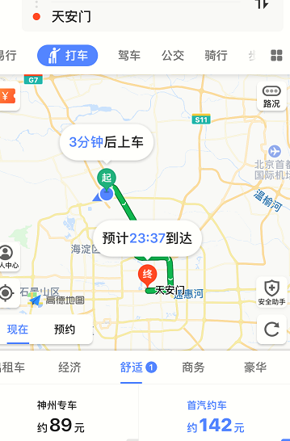
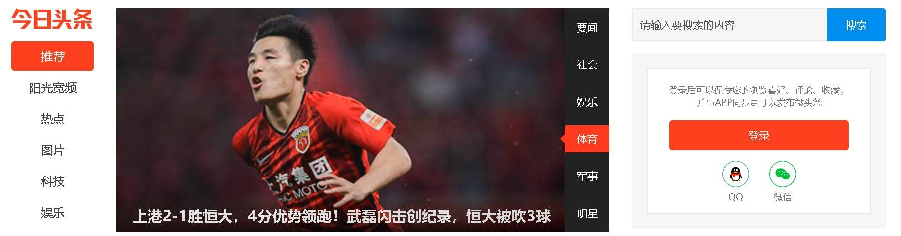
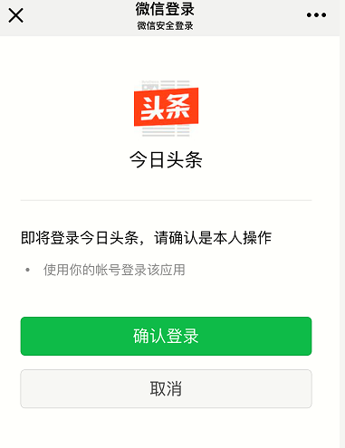
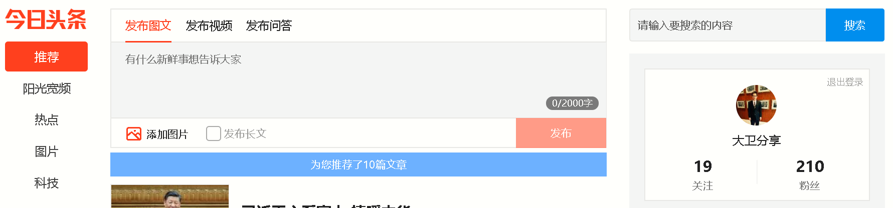

# API 经济与实现之路
从技术角度探讨 API 经济如何落地

**标签:** API 管理

[原文链接](https://developer.ibm.com/zh/articles/j-api-economy-and-its-implementation/)

魏 新宇

发布: 2018-10-16

* * *

## API 经济的兴起

在谈 API 经济之前，我们需要先了解 API 的概念。

API 的全称是 Application Programming Interface，即应用编程接口，它是软件系统不同组成部分衔接的约定标准。本质上，API 是对应用进行封装、对外开放访问接口，以便被其他应用或者客户端访问。

随着软件的种类越来越多、功能越来越丰富，软件在设计的时候，通常要将一个复杂的大系统划分成多个小的单元，而各个小的单元要相互协作，编程接口的设计就显得尤为重要。编程接口的设计，要能够提升单元内部的内聚性、降低单元之间的耦合程度，最终提升整个软件系统的健壮性和可扩展性。

在了解了 API（对应用进行封装，对外开放访问接口）的概念后，我们再看一下 API 经济这个课题。

API 经济是伴随着 Gartner 定义的第三平台（云计算、移动、大数据、社交）而产生的。

API 经济的热潮，在西方国家出现较早。早在 2012 年，国际互联网巨头如 Salesforce、Google、Twitter 等公司，就通过 API 为他们带来了巨大的的经济效益。

_API 经济_ ，听起来很缥缈，但其实离我们日常生活很近。举个例子：我们在经常使用的导航软件”高德地图”，在输入”我的位置”和”目的地”后，可以显示从原地址到目的地之间的距离和路线；接下来，选择”打车”标签，可以看到”神州专车”和”首汽约车”，并显示对应的价格，如下图所示。我们可以根据自己的需要，选择使用哪个网约车。

高德地图和首汽约车之间应用的调用，使用的就是 API 调用的方式。两个公司之间 API 的调用，可能产生一些计费、限流、流量管理的需求。

对于云厂商或者互联网公司而言，完全可以将自己的应用（如地图服务、字典服务、邮件服务等），以 API 的方式暴露到互联网，其他公司使用 API 的时候，可以进行一定程度的收费（据功能的多少、调用的次数、优先级等分为不同的费用模式），从而实现 API 创收、API 经济。

所以说，API 经济的本质，是企业之前通过将自己的 API 暴露出去、被其他公司或者最终用户调用，然后根据一定方式进行计费，从而企业实现创收的一种经济模式。

伴随着国内互联网的蓬勃发展，API 经济将会越来越受到关注。

## API 经济的实现

通过阅读上一小节，我们了解了 API 经济的概念。那么，对于企业客户 (非 IT、互联网公司)，API 经济如何实现呢？

从技术角度而言，需要对企业的 API 的有效管理，并对外暴露，供其他企业或者用户使用，从技术上应考虑以下几点（包括但不限于）：

- API 灵活的访问控制
- API 的身份认证与授权
- API 合同和费率限制
- API 访问分析和报告
- API 的计费

接下来，我们从以上五个方面，看一下 API 经济如何落地。

### API 的访问控制

对于企业而言，API 大致分为两类：

- 对内的 API：通常会将应用的 API 接口暴露给互联网，因此其访问控制和安全显得尤为重要。
- 对外的 API：通常不会直接产生经济效益，虽然在内部，但也需要访问控制。

传统上，API 的访问控制通常是通过在应用的源码中实现的。例如在 JavaEE 中，我们可以通过在源码中使用注释的方法，对特定的 URI 进行保护：

- @RolesAllowed：定义可以访问该方法的角色。
- @PermitAll：定义的所有角色都可以访问该方法。
- @DenyAll：拒绝访问该方法的所有角色。

这种问控制的实现，主要由应用开发人员来实现。对于内对的 API 而言，这种是没有问题的。

但是，如果 API 是对外的、产生经济效益的，那么开发人员在编写代码的时候，很难将后续 API 的所有被调用的场景考虑全；而如果根据后续出现的情况进行调整的话，则需要修改源码、进行编译。这显然不符合 API 经济的实际情况。

所以，针对 API 经济，我们需要将 API 中方法的权限控制，从源码中抽取出来，放到 API 管理方案中。通过 UI 的方式，可以对一个应用的 API（URI）进行灵活地访问控制。

### API 的身份认证与授权

API 的身份认证与授权本质上是为了保证 API 的安全。

在 API 经济的时代，API 的身份认证与授权，必须要兼顾安全性、可用性、可扩展性：

- 针对于 API 的身份认证，可以使用 OpenID。
- 针对于 API 授权，可以 OAuth2.0。

OpenID 是一种开放的身份验证标准。用户通过 OpenID 身份提供商获取 OpenID 帐户。然后，用户将使用该帐户登录任何接受 OpenID 身份验证的网站。

OpenID 建立在 OAuth 2.0 协议之上，允许客户端验证最终用户的身份并获取基本配置文件信息 RESTful HTTP API，使用 JSON 作为数据格式。

_开放授权_ （OAuth）是一个开放标准，允许用户让第三方应用访问该用户在某一网站上存储的私密的资源，而无需将用户名和密码提供给第三方应用。OAuth 2.0 是 OAuth 协议的下一版本，相比于 OAuth1.0，更关注客户端开发者的简易性；它为移动应用（手机、平板电脑、Web 等）提供了专门的认证流程。

OAuth 2.0+ OpenID 的方式，在互联网已经被大量使用。

举一个我们身边的例子：我们登录很多手机 app 或者网站，都可以通过微信认证，例如今日头条。

在这个认证和授权的过程中，微信就是 OpenID 身份提供方，而今日头条，就是 OpenID 身份依赖方。

下面用通过微信登录今日头条的例子来演示 API 的身份认证与授权过程。

1. 打开浏览器，登录今日头条网站，如图 2 所示。点击通过微信授权登录。这时候，相当于客户端向今日头条的服务器发起授权请求。

    

2. 今日头条响应一个重定向地址给客户端，这个地址指向微信授权登录。

3. 浏览器接到重定向地址，再次发起访问，这次是向微信授权服务器发起请求，屏幕出现二维码，如下图所示：

    

    在这个过程中，微信认证服务器也对用户进行了身份认证，只是因为用户在扫描的时候，微信已经在手机登录了（用户在微信认证服务器上，首先验证了自己的身份，然后用微信同意今日头条客户端发起的授权请求，也就是拿起手机用微信扫描二维码）。

4. 此时拿手机微信扫描电脑屏幕的二维码，并且在手机微信上点击同意授权登录，如下图所示：

    

5. 接下来，微信授权服务器会返回给浏览器一个 code。 浏览器通过获取到的 code，向认证服务器发起申请有效令牌 （token）的请求。认证服务器返回 token。

6. 浏览器拿到 token，向认证服务器获取用户信息。认证服务器返回用户信息。

    用户信息在浏览器展示出来。截至到目前，登录过程完毕。

7. 客户端通过 token 向资源服务器申请资源（例如今日头条只开放给会员看的一些文章或者视频）。

8. 今日头条的服务器，确认 token 无误，同意向客户端开放资源。

    

### API 合同和限速

在 API 经济下，相同的一个 API，可以配置成不同的”套餐”（合同）。不同的套餐，可以设置不同的限速。例如：

- 对于白金套餐，API 被调用次数不限。
- 对于金卡套餐，API 每个小时可以被调用 100 次。
- 对于普通套餐，API 每个小时可以被调用 15 次。

当 API 被调用的次数超过限速的设置，需要返回报错。

### API 访问分析和报告

在 API 经济下，我们需要对 API 的访问进行统计。

API 的种类，可以按照按照是否是 Web 类的分发。在第三平台中，互联网中以 Web API 居多，而 Web API 又大致分为两类：

- JAX-RS: 是用于创建轻量级 RESTful Web 服务的 Java API。
- JAX-WS: 是使用简单对象访问协议（SOAP）的基于 XML 的 Web 服务的 Java API。

JAX-RS 的一个很大的好处是支持 HTTP(s)协议，也就是可以响应四种 HTTP 的方法，具体而言：

- GET：检索数据。
- POST：创建一个新实体。
- DELETE：删除实体。
- PUT：更新实体。

在 API 经济下，API 访问和分析报告，应可以对一个 API 的某个 URI 的 HTTP 调用方法进行统计，如某个 URI 在一段时间内被 GET、POST 了多少次等。并且，可以形成分析报告。

### API 的计费

##### 免费试用 IBM Cloud

利用 [IBM Cloud Lite](https://cloud.ibm.com/registration?cm_sp=ibmdev-_-developer-articles-_-cloudreg) 快速轻松地构建您的下一个应用程序。您的免费帐户从不过期，而且您会获得 256 MB 的 Cloud Foundry 运行时内存和包含 Kubernetes 集群的 2 GB 存储空间。 [了解所有细节](https://www.ibm.com/cloud/free/) 并确定如何开始。

在云时代，计费是很重要的一个功能。而在 API 经济下，我们需要考虑 API 如何进行计费。

API 的计费方式，可以按照功能和流量收费：

- 所谓功能，主要指的就是同一个应用，通过 API 进行暴露出的不同的功能，主要是通过设置应用不同的 URI 访问权限来实现的。
- 而流量，主要是指 API 调用的次数。

在 API 经济模式下，API 的计费这两点都需要考虑到。

## API 网关与 API 管理的区别

API 网关是一个软件系统的唯一入口，它封装了软件系统内部体系结构、对外为客户端提供 API。客户端不必关注软件系统的内部结构。而 API 管理在是对 API 进行安全、授权、限速、计费进行丰富的高级策略管理的企业级解决方案。

API 网关的出现早于 API 管理。很多时候，这两个概念容易被混淆。API 管理包含 API 网关的功能，而 API 网关缺乏 API 管理的高级策略。二者具体对比如下：

##### 表 1\. API 网关与 API 管理的对比

**比较项****API 网关****API 管理**适用场景微服务内部调用，团队内快捷接入。跨系统、跨团队、企业级统一管控，对外接入控制。API 受管实现机制（API 提供方）由开发人员主导； 代码侵入式实现 API 受管。无需修改代码； 有必要暴露给外部使用的 API，通过 UI 界面手动注册到 API 管理平台。API 生命周期管理靠修改代码实现Web 界面操作管理与运行分离除了写在代码里的部分，网关还依赖 Eureka、Ribbon 才能运行。API 管理平台与 API 网关分离，各司其职。审批流程无API 从测试到生产的全过程，需要审批。支持多语言Java 等语言不限支持传统应用不支持支持

## 结束语

通过本文的介绍，相信您对于时下火热的 API 经济已经有了大致的了解。对于企业客户而言，若想将 API 经济落地，需要从本文提到的几个技术层面进行考量，然后选择适合自己的企业级 API 管理解决方案。