# APM 代理环境部署之 Hadoop 篇
精确发现并解决应用和 IT 基础架构中的性能问题

**标签:** DevOps

[原文链接](https://developer.ibm.com/zh/articles/d-apm-en-de-hadoop/)

牛凤枝, 陈泰成, 陈佳蕴

发布: 2018-05-02

* * *

面对企业中越来越复杂且相互依赖的 IT 环境和应用。IBM Cloud Application Performance Management (APM) 不仅是一个监控工具。更是可视化，可控性和自动化的解决方案。它是您身边的职能管家，全方位管理传统 IT、虚拟化、云和混合环境。可以精确地发现并解决应用和 IT 基础架构中的性能问题。APM 使用代理来收集监控主机的数据。

本文重点介绍 Hadoop 监控代理测试环境的搭建。

## APM 产品架构

关于 APM 产品架构请参照文章 [APM 代理环境部署之 Amazon EC2 篇](https://www.ibm.com/developerworks/cn/devops/d-proxy-environment-deployment-apm/index.html) 。

## Apache Hadoop 项目介绍

随着云时代的来临，大数据 (big data) 也越来越倍受关注。大数据包括结构化、半结构化和非结构化数据，非结构化数据越来越成为数据的主要部分。据 IDC 的调查报告显示：企业中 80%的数据都是非结构化数据，这些数据每年都按指数增长 60%。大数据技术的战略意义不在于掌握庞大的数据信息，而在于对这些含有意义的数据进行专业化的处理。而 Hadoop 的架构和技术因非常有利于进行分布处理”大数据”而备受重视。

本篇文章的重点不在于讨论 Hadoop，所以在此只对它进行简要介绍。

Apache Hadoop 软件库是一个框架，允许使用简单编程模型进行跨计算机集群的分布式的大数据的处理。它被设计成可以从单服务器扩展到几千台服务器，每台服务器都有自己的计算和存储。不是依赖硬件来实现高可用性，Hadoop 库被设计成在应用层来检测与处理故障，以在计算机集群上交付高可用性，而底层的每台计算机是很容易出现故障的。

##### 图 1\. Hadoop 体系结构图

Hadoop 是项目的总称，主要包括以下模块：

- Hadoop Common: 支持其他 Hadoop 模块的公用工具。
- Hadoop 分布文件系统（HDFS™ ）: 一个为访问应用数据提供高吞吐量的分布式文件系统。
- Hadoop YARN: 一个工作调度和集群资源管理的框架。
- Hadoop MapReduce: 一个基于 YARN 大数据集并行处理系统。

其他与 Hadoop 相关的项目包括：

- [Ambari™](http://incubator.apache.org/ambari/) ：基于 Web 的对 Hadoop 集群进行管理的工具。
- Avro™ ：数据序列化系统。
- Cassandra™: 管理大型分布式系统的数据采集系统，用于监控在 HDFS 和 MapReduce 上构建的大型分布式系统。
- HBase™: 支持对大表进行结构化数据存储的可扩展的，分布式数据库。
- Hive™: 提供数据汇总与特设查询的数据仓库基础设施。
- Mahout™: 可扩展的机器学习和数据挖掘库。
- Pig™: 高级数据流语言和并行计算执行框架。
- ZooKeeper™: 高性能的分布式应用协调服务。

## Hadoop 监控代理简介

Hadoop 监控代理提供对您的组织中 Hadoop 集群的功能。您可以使用该代理来收集和分析有关 Hadoop 集群的信息，例如数据节点和 Java™ 虚拟机的状态、内存堆和非堆信息，以及有关 Hadoop 节点、文件系统和队列的信息。

## Hadoop 测试环境部署

在此我们简单部署一个 Hadoop 测试环境，以便可以清晰的通过 Hadoop 代理监控到数据。

测试环境搭建步骤如下:

步骤 1：安装环境的先决条件

步骤 2：在一个节点上安装 Ambari 服务器（IBM-BI 服务器/主设备）

步骤 3：登录 Ambari 服务器创建 hadoop 集群（包括 Services Install 和启动）

### 步骤 1：安装环境的先决条件

##### 图 2\. 禁用 Selinux

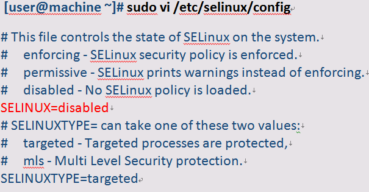

在主机文件中添加所有集群节点的 FQDN（完全限定的域名）。

##### 图 3\. 修改主机文件

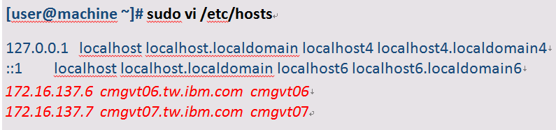

##### 图 4\. 停掉防火墙

接下来需要修改系统时钟。

首先需要停止 ntp 服务。

##### 图 5\. 停止 ntp

然后配置 ntp 服务器：

Open /etc/ntp.conf file in vi and add server entry as shown below

##### 图 6\. 配置 ntp

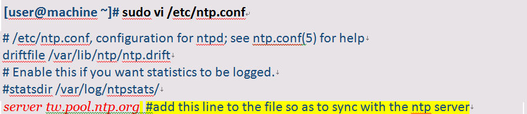

##### 图 7\. 启动 ntp

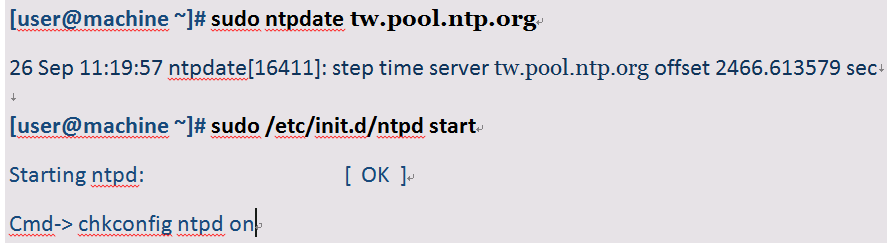

### 步骤 2：在一个节点上安装 Ambari 服务器（IBM-BI 服务器/主设备 master）

##### 图 8\. 添加 IOP.repo

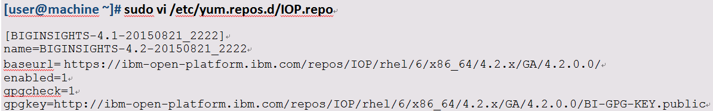

##### 图 9\. 添加 IOP-utils.repo

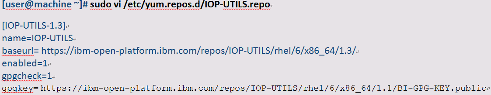

添加 ambari.repo。

##### 图 10\. 添加 ambari.repo

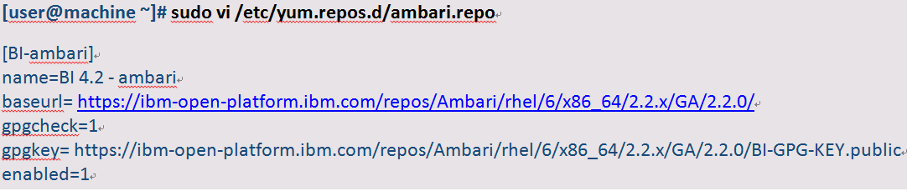

接下来需要安装 ambari-server。

##### 图 11\. 运行清理步骤并查看存储库

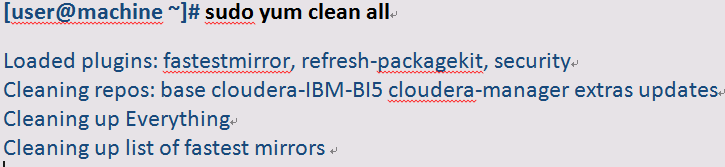

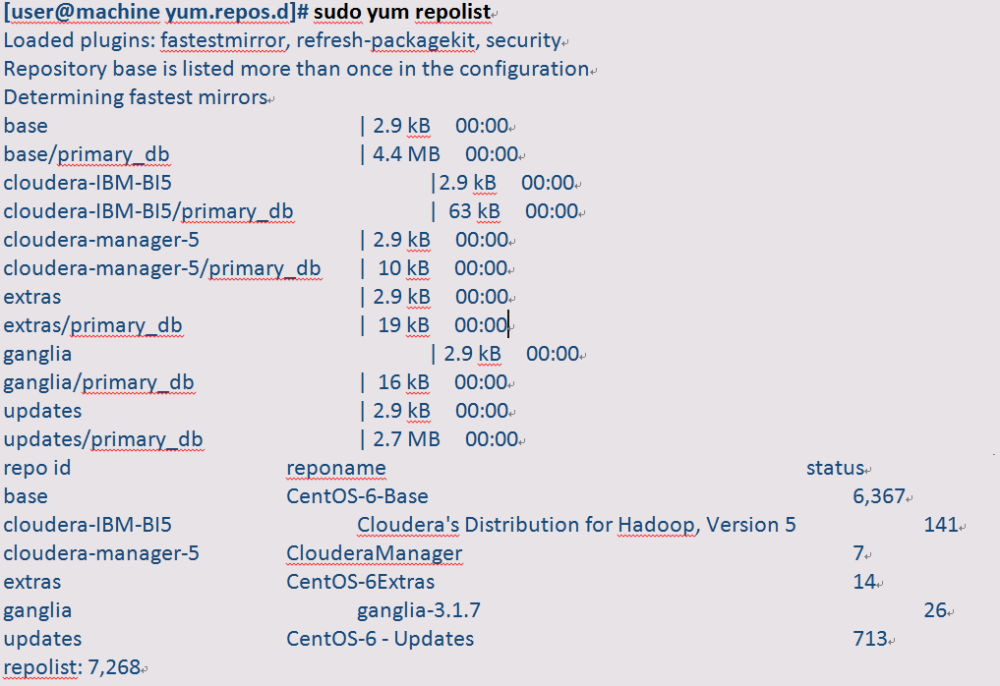

##### 图 12\. 安装 ambari-server

添加 jdk1.7.url in the ambari.properties file。

##### 图 13\. Add URL

重新启动 ambari 服务器。

##### 图 14\. 重启 ambari

从安装软件的 Web 访问 Ambari Web 用户界面，并访问端口 8080.例如，在浏览器中输入以下 URL: cmgvt07.tw.ibm.com:8080

默认凭证：admin / admin。

### 步骤 3：登录 Ambari 服务器创建 hadoop 集群（包括 Services Install 和启动）

登录并单击欢迎页面上的启动安装向导。

在”入门”页面上，输入要创建的群集的名称。点击下一步。

##### 图 15\. Create Hadoop Cluster-1

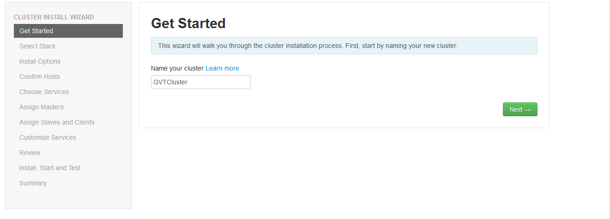

在”选择堆栈”页面上，单击要安装的堆栈版本（BigInsights™ 4.2）。点击下一步。

##### 图 16\. Create Hadoop Cluster-2

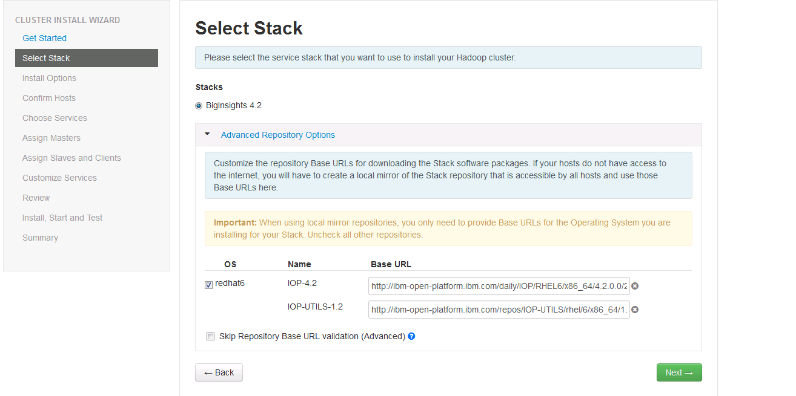

在”安装选项”页面上的”目标主机”中，添加 Ambari 服务器将要管理的主机列表，并且将部署带有 Apache Hadoop 软件的 IBM Open Platform，每行一个节点。

点击提供您的 SSH 私钥。私钥文件是/root/.ssh/id\_rsa，其中 root 用户安装了 Ambari 服务器。点击选择文件查找您以前安装的私钥文件。在设置无密码 SSH 时，您应该在本地目录中保留 SSH 私钥（.ssh / id\_rsa）的副本。手动将密钥复制并粘贴到文本框中,点击注册并确认。

##### 图 17\. Create Hadoop Cluster-3

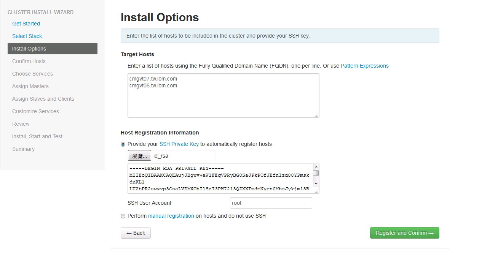

在”确认主机”页面上，检查群集的正确主机是否已找到，并且这些主机具有正确的目录，软件包和进程以继续安装。

##### 图 18\. Create Hadoop Cluster-4

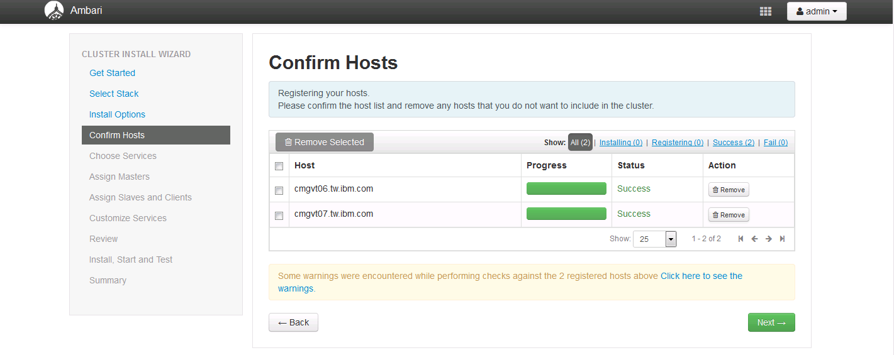

在”选择服务”页面上，选择要安装的服务。

##### 图 18\. Create Hadoop Cluster-5

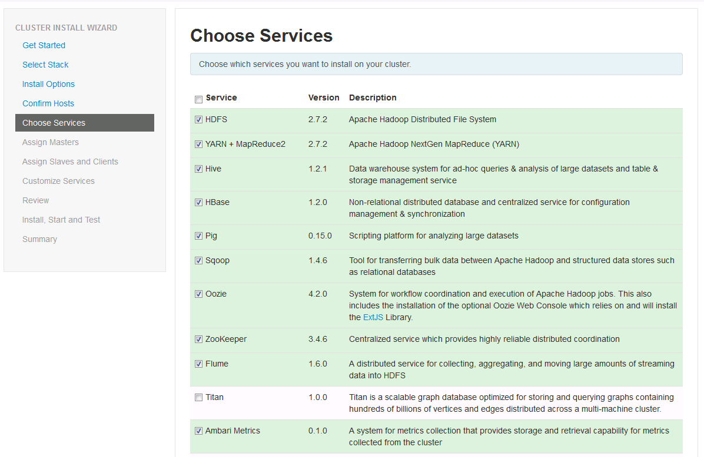

在”分配主文件”页面上，将主节点分配给群集中的主机，以获取所选服务。点击下一步。

##### 图 19\. Create Hadoop Cluster-6

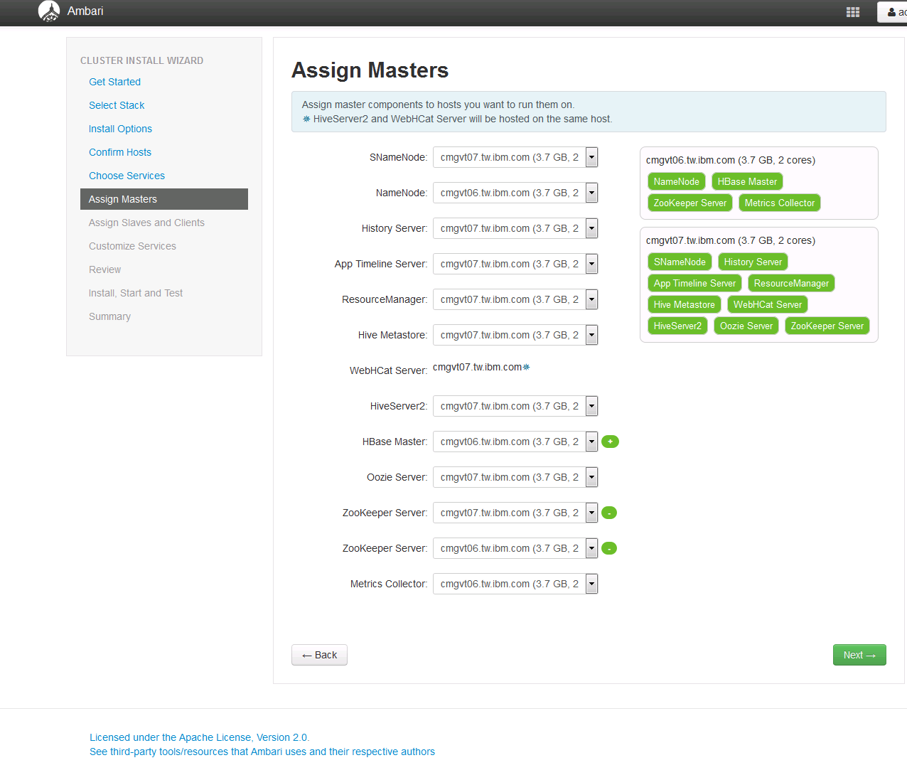

在”分配从站和客户端”页面上，将从站和客户端组件分配给群集中的主机。您可以接受默认分配。点击下一步。

##### 图 20\. Create Hadoop Cluster-7

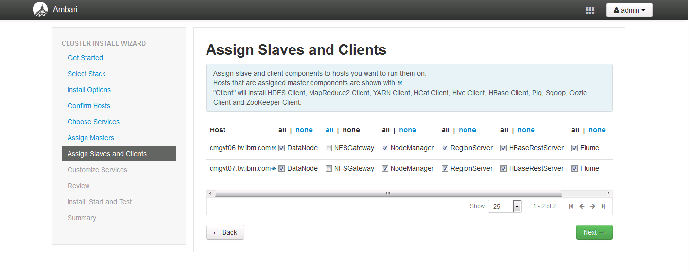

在”自定义服务”页面上，选择所选服务的配置设置。默认值在可用时自动填入，并且是推荐值。 完成服务配置后，单击下一步。

##### 图 21\. Create Hadoop Cluster-8

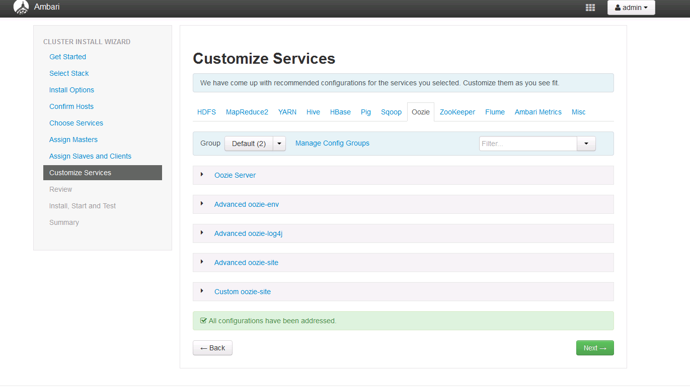

在 Review 页面上，验证您的设置是否正确。点击部署。

##### 图 22\. Create Hadoop Cluster-9

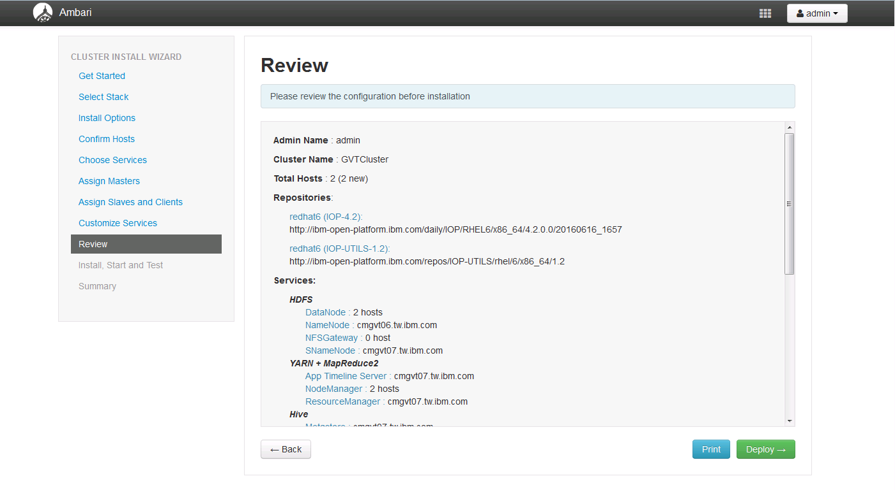

安装，启动和测试页面显示安装的进度。 页面顶部的进度条给出了整体状态，而页面的主要部分给出了每个主机的状态。 可以通过单击任务来显示特定任务的日志。 单击”消息”列中的链接以查明特定主机已完成哪些任务或查看遇到的警告。 出现消息”成功安装并启动服务”时，单击下一步。

##### 图 23\. Create Hadoop Cluster-10

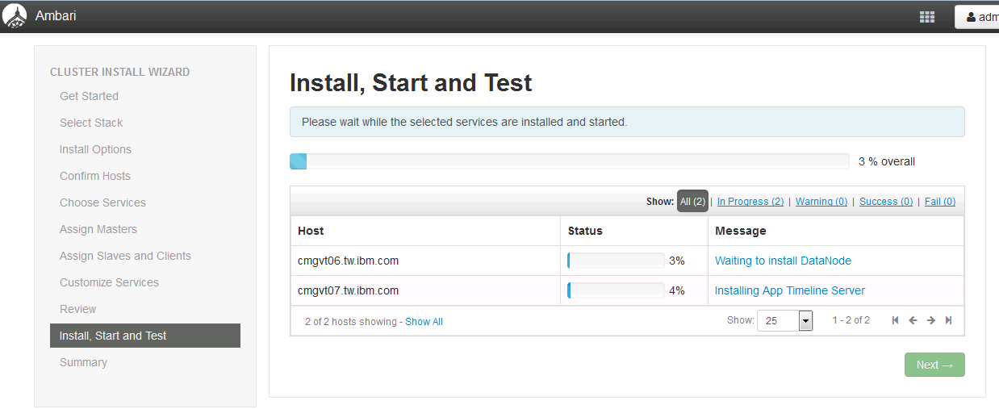

在”摘要”页面上，查看已完成的任务。单击”完成”转至带有 Apache Hadoop 仪表板的 IBM Open Platform。

##### 图 24\. Create Hadoop Cluster-11

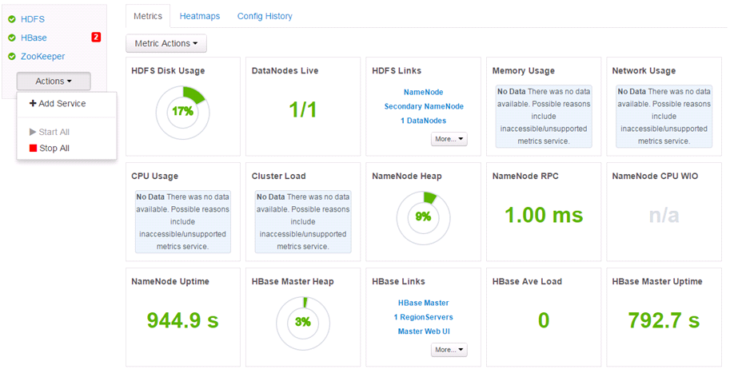

## Hadoop 代理环境部署

### 系统需求

请参照 [系统需求](https://www.ibm.com/support/knowledgecenter/SSHLNR_8.1.4/com.ibm.pm.doc/install/planning_requirements.htm) 来安排您的资源。Hadoop 代理支持远程监控。在此我们选择 Windows Sever 2012 R2 Enterprise 64bit 来安装我们的监控代理监控刚刚创建的 Hadoop 服务。

### 前提条件

在部署 Hadoop 代理环境前，我们需要先部署 Hadoop 测试环境(上述文章已经完成这部分的搭建)。

### 代理安装包的预配置

这部分在 APM Server 安装过程已经完成。我们只需要从 Server 上把安装包下载下来即可。也可以通过以下步骤重新配置：

登陆 APM Server 主机。

在/opt/ibm/ccm（默认安装目录）下运行” make\_configuration\_packages.sh”。

##### 图 25\. 创建配置包文件

然后在同一目录下运行”configure\_agent\_images.sh”。

##### 图 26\. 代理安装包预配置

### 代理的安装

经过上述步骤，经过预配置的安装包在/opt/ibm/ccm/depot 目录下。我们需要把这个安装包下载到 Windows 机器上并解压。

安装部分很简单，双击”installAPMAgents.bat”一步步往下装即可，此处不再赘述。

### 代理的配置

此处重点讲一下代理的配置。代理安装完成后，点击”开始->所有程序->IBM Monitoring agents”启动 Tivoli Enterprise Monitoring Services 管理面板。

##### 图 27\. TEMS 管理面板

右键点击”Monitoring Agent for Hadoop”。

##### 图 28\. Hadoop 配置步骤-1

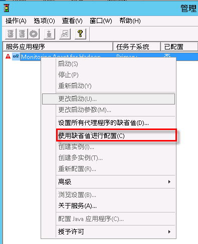

选择”使用预设值配置”。

##### 图 29\. Hadoop 配置步骤-2

##### 图 30\. Hadoop 配置步骤-3

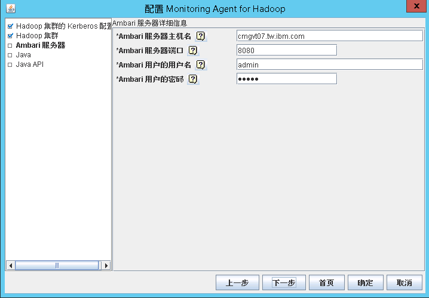

##### 图 31\. Hadoop 实例监控数据

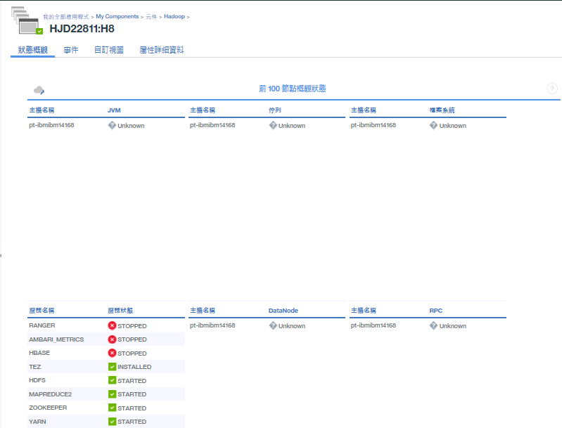

从这里我们可以查看例如：Java Virtual Machine 的状态、伫列处理程序的状态、档案系统状态、DataNode 的状态、服务的状态、Remote Procedure Call 的状态等监控数据。

## 结束语

至此，我们详细介绍了 Hadoop 测试环境及 APM Hadoop 代理的安装和配置。相信大家这部分已经有了初步的认识。

APM 有数以十计的代理帮助我们监控企业 IT 环境和应用的运行状态。后续我们也将推出系列文章讲述一些大家关心和时下比较流行的服务监控代理的安装、配置。希望这些文章对 APM 感兴趣的开发和测试人员有所帮助。

## 参考资源

- Hadoop 官网: [Hadoop Cluster Setup](http://hadoop.apache.org/docs/current/hadoop-project-dist/hadoop-common/ClusterSetup.html)
- User Guide： [APM 官方文档](https://www.ibm.com/support/knowledgecenter/SSHLNR_8.1.4/com.ibm.pm.doc/install/overview_product.htm)