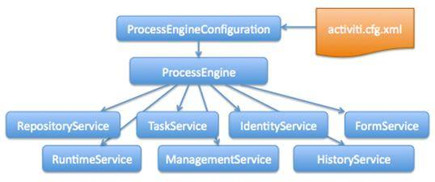
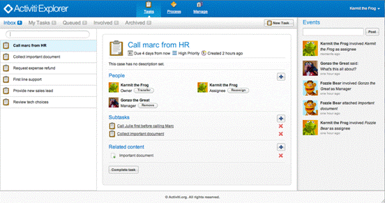
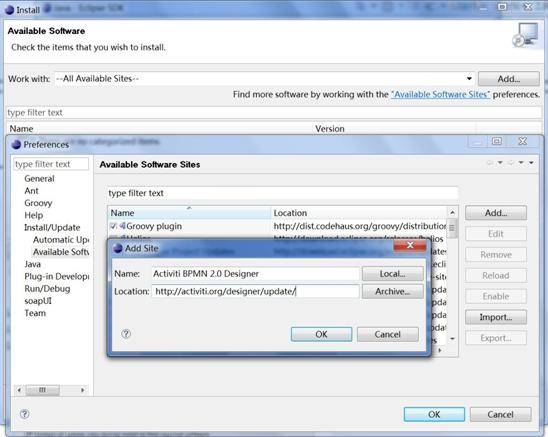
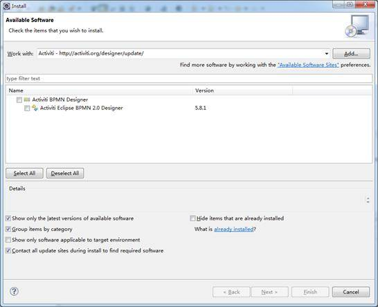
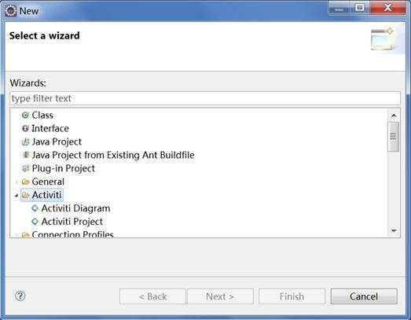

# Activiti – 新一代的开源 BPM 引擎
Activiti 背景简介、服务和功能介绍

**标签:** Java

[原文链接](https://developer.ibm.com/zh/articles/j-lo-activiti1/)

董娜, 狄浩, 张晓篱

发布: 2012-07-23

* * *

## 背景介绍

1. Activiti 其核心是 BPMN 2.0 的流程引擎。BPMN 是目前被各 BPM 厂商广泛接受的 BPM 标准，全称为 Business Process Model and Notation，由 OMG 组织进行维护，2011 年 1 月份发布了其 2.0 的正式版。BPMN 2.0 对比于第一个版本，其最重要的变化在于其定义了流程的元模型和执行语义，即它自己解决了存储、交换和执行的问题。这代表着 BPMN 2.0 流程定义模型不仅仅可以在任何兼容 BPMN 2.0 的引擎中执行，而且也可以在图形编辑器间交换。作为一个标准，BPMN 2.0 统一了工作流社区。
2. Activiti 是由 jBPM 的创建者 Tom Baeyens 离开 JBoss 之后建立的项目，构建在开发 jBPM 版本 1 到 4 时积累的多年经验的基础之上，旨在创建下一代的 BPM 解决方案。同时 Activiti 选择了 Apache 许可，一方面是希望 Activiti 能有更长久的生命力，因为它不受任何个人或是公司的控制而是属于整个社区，另一方面更是希望这个宽松的许可能够让 Activiti BPM 引擎和 BPMN2.0 被更广泛的采纳、使用和商业化。
3. 对于 Java 开发者来说，Activiti 的首席架构师 Tom Baeyens 曾提到，Activiti 的首个目标就是要获得开发者的青睐。首先它在使用时极为方便，只是个 jar 文件，使用时仅需要将其放在类路径中，当然，Activiti 也可以作为独立服务器的方式使用；同时 Activiti 提供了很多 BPM 高级工具，其中还包括开发了协作工具，使得开发人员、业务人员和运维人员能够更好的协同工作。
4. 本文将会介绍 Activiti 的基本概念，同时通过示例来介绍如何通过搭建 Activiti 开发环境和 Activiti API 使用，同时也会接触到 Activiti 的一些工具，希望通过阅读这篇文章，Activiti 能成为您在开发 BPM 系统时的一个选择。

## Activiti 基本架构和服务组件介绍

Activiti 流程引擎重点关注在系统开发的易用性和轻量性上。每一项 BPM 业务功能 Activiti 流程引擎都以服务的形式提供给开发人员。通过使用这些服务，开发人员能够构建出功能丰富、轻便且高效的 BPM 应用程序。

##### 图 1.Activiti 系统服务结构图



图 1 是 Activiti 引擎的系统服务结构图，该图显示了引擎提供的所有功能组件，以下为各个服务的功能简介：

- RepositoryService： Activiti 中每一个不同版本的业务流程的定义都需要使用一些定义文件，部署文件和支持数据 ( 例如 BPMN2.0 XML 文件，表单定义文件，流程定义图像文件等 )，这些文件都存储在 Activiti 内建的 Repository 中。Repository Service 提供了对 repository 的存取服务。
- RuntimeService：在 Activiti 中，每当一个流程定义被启动一次之后，都会生成一个相应的流程对象实例。Runtime Service 提供了启动流程、查询流程实例、设置获取流程实例变量等功能。此外它还提供了对流程部署，流程定义和流程实例的存取服务。
- TaskService：在 Activiti 中业务流程定义中的每一个执行节点被称为一个 Task，对流程中的数据存取，状态变更等操作均需要在 Task 中完成。Task Service 提供了对用户 Task 和 Form 相关的操作。它提供了运行时任务查询、领取、完成、删除以及变量设置等功能。
- IdentityService：Activiti 中内置了用户以及组管理的功能，必须使用这些用户和组的信息才能获取到相应的 Task。Identity Service 提供了对 Activiti 系统中的用户和组的管理功能。
- ManagementService：Management Service 提供了对 Activiti 流程引擎的管理和维护功能，这些功能不在工作流驱动的应用程序中使用，主要用于 Activiti 系统的日常维护。
- HistoryService: History Service 用于获取正在运行或已经完成的流程实例的信息，与 Runtime Service 中获取的流程信息不同，历史信息包含已经持久化存储的永久信息，并已经被针对查询优化。
- FormService: Activiti 中的流程和状态 Task 均可以关联业务相关的数据。通过使用 Form Service 可以存取启动和完成任务所需的表单数据并且根据需要来渲染表单。

## Activiti 开发环境搭建

Activiti 开发环境的搭建非常简单，主要分为 Activiti runtime 的安装以及 Eclipse 开发环境的配置。本文以 Windows 平台为例介绍 Activiti 5.8 版的开发环境的搭建配置过程。Activiti 的运行时程序可以从 [https://www.activiti.org/download.html](https://www.activiti.org/download.html) 下载，目前最新版本为 5.8。为了配置使用 Activiti 还需要使用 Apache Ant。请您在配置 Activiti 之前自行下载安装 Apache Ant。Ant 的最新版本为 1.8.2，可以从链接： [https://ant.apache.org/bindownload.cgi](https://ant.apache.org/bindownload.cgi) 处下载安装。

**Activiti 运行环境的安装**

当 Activiti 5.8 的下载完成后可以获得安装文件 activiti-5.8.zip，首先需要将这个文件解压到指定目录下，本文中以 D:/activiti-5.8 为例。解压完成后在该文件夹中将生成三个子目录和一些项目描述和许可证信息文件。子目录 docs 中包含 Activiti 的用户使用指南和 API Java doc。子目录 workspace 中包含 Activiti 开发示例的 Eclipse 项目，这些项目可以在 Eclipse 中直接导入使用。子目录 setup 中包含了系统配置和运行所需的 Ant 文件和其他配置文件以及数据文件。Setup 目录中的 build.xml 中提供了很多 Activiti 的配置管理 Ant 任务，以下为其中常用的几个任务 ( 可以在 D:/activiti-5.8/setup 目录中执行”ant – p”命令来获取所有可用命令的列表 )：

- demo.install：用来安装和设置 Activiti demo 示例程序的运行环境。当第一次执行这个任务时，Ant 会从网络下载 Apache Tomcat Web 应用服务器和 H2 内存数据库，并将它们安装在 apps 目录中。之后会在 Tomcat 中部署 Activiti demo 的 web application 并且在 H2 中创建数据库表，部署示例流程。
- demo.clean：在需要清除 demo 系统中的测试数据时使用，执行后它会除删除 setup/apps 目录中已经安装的 Tomcat 和 H2 的数据文件，清除已部署的流程定义和运行时产生的流程数据。
- demo.start：如果尚未安装 Tomcat 和 H2，这个任务会调用 demo.install 安装全部组件并且启动 Tomcat 和 H2 服务器。如果已经安装过 Tomcat 和 H2 则直接启动 demo 程序。
- demo.stop：停止 Tomcat 和 H2 服务器。

初次安装 Activiti 时只需要在 setup 目录中执行 ant demo.start 命令即可，Activiti 会自动创建 apps 目录，并在这个目录中下载安装 Tomcat 和 H2 服务器，安装 Activiti Web 应用程序。安装完成后可以在 [http://localhost:8080/activiti-explorer](http://localhost:8080/activiti-explorer) 处访问 Activiti Explorer web 应用程序，这个程序是流程引擎的用户接口，用户可以使用这个工具来执行启动新流程，分配用户任务，浏览或领取任务等操作。还可以用来执行 Activiti 引擎的管理工作。图 2 是这个应用程序的界面截图。

##### 图 2.Activiti Explorer 应用程序界面



如果可以在浏览器中正常的访问操作 Activiti Explorer 应用程序，则证明 Activiti Runtime 的安装已经顺利的完成。

**Activiti 开发环境的配置**

Activiti 提供了基于 Eclipse 插件的开发工具和流程设计工具 ( 需要 Eclipse 的版本为 Helios 或 Indigo，如果尚未安装 Eclipse，请从 [http://www.eclipse.org/downloads/](http://www.eclipse.org/downloads/) 下载安装最新版本的 Eclipse 集成开发环境。)。这些工具可以使用 Eclipse 的”Install new software”功能在线安装，安装方法如下：

在 Eclipse 的 Help 菜单中选择 Install New Software 选项，在弹出菜单中，点击 Add Repository 按钮添加新的远程 Software Repository，如图 3 所示，在 Location 中添加 [http://activiti.org/designer/update/](http://activiti.org/designer/update/) 作为 Repository 的远程地址。当新的 Repository 添加完成后，Eclipse 会自动获取 Repository 中的软件列表。如图 4 所示，Activiti BPMN2.0 Designer 的最新版本为 5.8.1，选择所有选项然后等待安装完成即可。

##### 图 3\. 添加 Activiti Eclipse Plugin repository



##### 图 4.Activiti Eclipse BPMN 2.0 Designer 安装列表



当 Eclipse 插件安装完成后，选择 File ->New project 选项新建一个项目，此时如果可以看到如图 5 所示的 Activiti 项目选项，证明 Activiti 的 Eclipse 开发环境的配置已经顺利完成。

##### 图 5.Activiti Eclipse 项目选项



## Activiti 功能示例

**使用 Activiti 内置 Eclipse 项目**

Activiti 可以和多种 Java 企业级开发技术 (Spring,JPA), 动态开发语言 (groovy) 以及 Web Service 开发工具 (CXF) 结合使用。在 Actitivi 的安装目录中的 workspace 文件夹中包含了 Activiti 自身特性和与这些开发技术结合使用的 Eclipse 项目示例 (activiti-engine-examples、activiti-spring-examples、activiti-groovy-examples、activiti-jpa-examples、activiti-cxf-examples 等 Eclipse 项目 )。要使用这些示例项目，只需在 Eclipse 中使用”Import->Existing Projects into Workspace”从文件系统中导入这些项目即可。

activiti-engine-examples 项目中包含了使用 Activiti 大部分主要功能的示例代码，这些代码使用的流程定义信息都已经部署在项目使用的 H2 内存数据库中。流程的执行中产生的信息也都会使用持久化 API 存储在该 H2 内存数据库中。

**使用 Activiti Eclipse 流程设计器设计 Activiti 流程定义**

Activiti 使用标准的 BPMN2.0 流程定义文件来描述工作流的定义。BPMN2.0 流程定义文件是一个符合行业标准的 XML 格式的文件。在这个文件中包含了流程的流转序列，步骤节点以及各个节点上相关的用户，变量信息等流程元素。在 BPMN2.0 XML 流程定义文件中还包含了各个流程元素在定义中的显示位置等信息，从而可以以图形化的方式来显示或编辑流程定义文件。目前已经有多种 BPMN2.0 流程定义文件的可视化编辑器。Activiti 中提供了 2 种定义文件的可视化编辑器：Web Application 形式的 Activiti Modeler 和 Eclipse 插件形式的流程编辑器。Activiti Modeler 必须部署在 Web 应用服务器中才能通过 Web 浏览器来使用而 Eclipse 插件形式的编辑器可以在 Eclipse 中直接使用，更好的结合了 Activiti 的流程设计和程序编码。在 Activiti5.6 版之后，Activiti Modeler 已经不再包含在 Activiti 的下载中。本文使用 Eclipse 插件的流程设计工具来介绍 BPMN2.0 流程定义文件的使用。

在 Eclipse 项目中可以直接通过创建 Activiti Diagram 的形式来创建一个流程定义文件并在可视化编辑器中编辑。如果项目中已经存在 BPMN2.0 流程定义 XML 文件，双击该文件 Eclipse 插件会自动生成一个后缀为 .activiti 的流程可视化编译文件。双击该文件可在可视化流程编辑器中打开该流程。图 6 是在可视化编辑器中打开一个流程定义文件的截图。

##### 图 6.Activiti 可视化流程编辑器


当流程定义文件设计完成后，可以使用以下的 API 代码获取 `RepositoryService` ，并使用该服务将流程定义文件部署到 Activiti 流程引擎中 ( 本代码示例中流程定义文件名称为 `FinancialReportProcess.bpmn20.xml`)：

**清单 1\. 部署 BPMN2.0 流程定义文件**

```
// 获取 RepositoryService
RepositoryService repositoryService = processEngine.getRepositoryService();
// 使用 RepositoryService 部署流程定义
repositoryService.createDeployment().addClasspathResource("
FinancialReportProcess.bpmn20.xml").deploy();

```

Show moreShow more icon

**Activiti 基本编程**

如图 1 所示 ,Activiti 的 Java 编程模型的核心是 ProcessEngine。所有其他 service 都必须从 ProcessEngine 对象获取 , 代码清单 2 展示了如何使用 Activiti Java API 获取 ProcessEngine 和其他 Service 对象。

##### 清单 2\. 使用 Activiti API 获得各种 Service 对象

```
// 使用默认配置文件获取 ProcessEngine 对象实例
ProcessEngine processEngine =
ProcessEngineConfiguration.createStandaloneProcessEngineConfiguration().\
buildProcessEngine();
// 通过 ProcessEngine 实例获得 RepositoryService
RepositoryService repositoryService = processEngine.getRepositoryService();
// 通过 ProcessEngine 实例获得 RuntimeService
RuntimeService runtimeService = processEngine.getRuntimeService();
// 通过 ProcessEngine 实例获得 TaskService
TaskService taskService = processEngine.getTaskService();
HistoryService historyService = processEngine.getHistoryService();
// 通过 ProcessEngine 实例获得 FormService
FormService formService = processEngine.getFormService();
// 通过 ProcessEngine 实例获得 ManagementService
ManagementService managementService = processEngine.getManagementService();
// 通过 ProcessEngine 实例获得 IdentityService
IdentityService identityService = processEngine.getIdentityService();

```

Show moreShow more icon

当获得了这些 Service 对象后，就可以使用这些 Service 对象来完成各种 Activiti 流程引擎的操作。在实际应用中需要综合使用各种服务来部署流程定义，启动流程实例，领取、查询完成用户任务以及查询流程运行历史纪录等 Activiti 流程引擎的主要功能。代码清单 3 展示了如何使用 API 代码来完成这一系列操作。该示例代码使用的 BPMN2.0 流程定义文件可以在 activiti-engine-examples 示例 Eclipse 工程中获取，使用到的用户和用户组也已经在 demo 系统初始化时写入了 Activiti 的后端 H2 数据库。

##### 清单 3\. 使用 Activiti 的各种 Service 对象完成流程引擎的业务功能

```
// 获取 RepositoryService 和 RuntimeService 实例
RepositoryService repositoryService = processEngine.getRepositoryService();
RuntimeService runtimeService = processEngine.getRuntimeService();

// 使用 RepositoryService 部署流程定义
repositoryService.createDeployment().addClasspathResource("
      FinancialReportProcess.bpmn20.xml").deploy();

// 使用 RuntimeService 创建一个流程的实例
String procId = runtimeService.startProcessInstanceByKey("financialReport").getId();

// 获取 TaskService 实例
TaskService taskService = processEngine.getTaskService();
// 使用 TaskService 获取指定用户组的 Task 列表并使用指定用户领取这些任务
List<Task> tasks = \
taskService.createTaskQuery().taskCandidateGroup("accountancy").list();
for (Task task : tasks) {
     System.out.println("\
     Following task is available for accountancy group: " + task.getName());
      // claim it
      taskService.claim(task.getId(), "fozzie");
}

// 使用 TaskService 获取指定用户的工作 Task 列表，并完成这些任务
tasks = taskService.createTaskQuery().taskAssignee("fozzie").list();
for (Task task : tasks) {
      System.out.println("Task for fozzie: " + task.getName());

      // Complete the task
      taskService.complete(task.getId());
}

System.out.println("Number of tasks for fozzie: " +
taskService.createTaskQuery().taskAssignee("fozzie").count());

// 使用 HistoryService 来查询指定流程实例的状态
HistoryService historyService = processEngine.getHistoryService();
HistoricProcessInstance historicProcessInstance =
historyService.createHistoricProcessInstanceQuery().processInstanceId(procId).\
singleResult();
System.out.println("Process instance end time: " + \
historicProcessInstance.getEndTime());

```

Show moreShow more icon

清单 3 代码首先将流程定义文件 FinancialReportProcess.bpmn20.xml 部署到了 Activiti 引擎中 ( 这个流程是 activiti-engine-examples 示例项目中内置的一个示例流程。共包含了 2 个顺序任务。第一个任务是 Write monthly financial report ，关联的用户组为 accountancy ，第二个任务为 Verify monthly financial report，关联的用户组为 management)。之后使用 RuntimeService 创建了一个流程的实例。实例创建完成后示例代码使用 TaskService 查询出该流程实例涉及到的 accountancy 组的任务 , 并使用 accountancy 组中的用户 fozzie 来领取并完成了该项任务。最后使用 HistoryService 来查询了该流程的运行状态。

## 结束语

Activiti 是一个新兴的基于 Apache 许可的支持 BPMN 2.0 标准的开源 BPM 产品。它是一个轻量级，可嵌入的 BPM 引擎，并且提供了功能丰富的开发和流程设计工具。本文简要介绍了 Activiti 的基本架构、开发环境的搭建以及基本的开发流程。通过阅读参考本文，BPM 系统开发人员可以快速的搭建 Activiti 的开发环境，了解 Activiti 的基本功能。从而为 BPM 应用系统的开发提供一个新的选择。