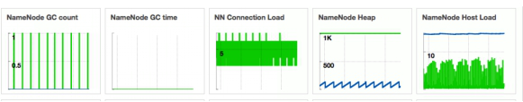
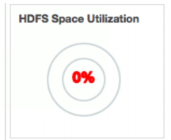
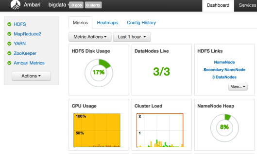
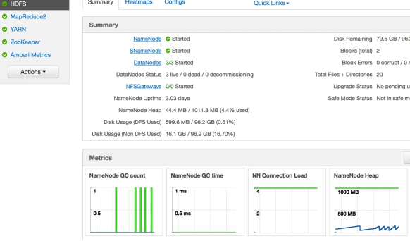
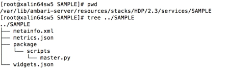
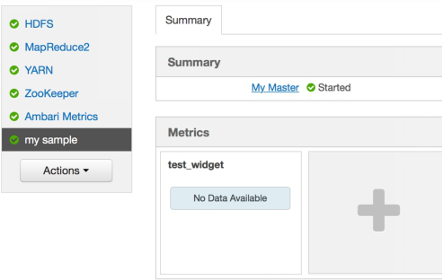
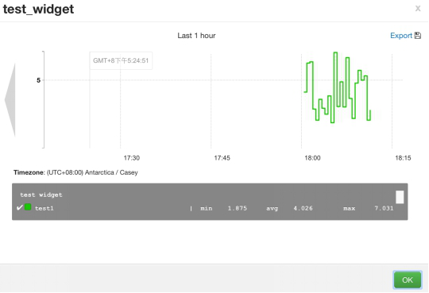
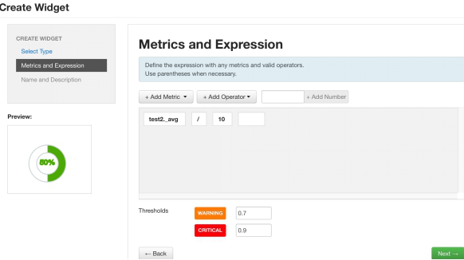
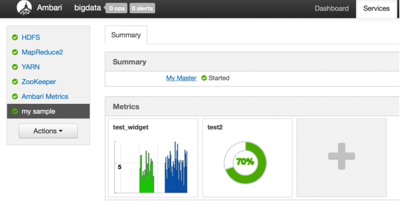
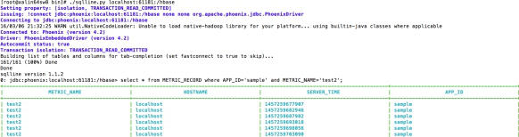

# Ambari Metrics 详解
了解 Ambari Metrics 详解

**标签:** 分析

[原文链接](https://developer.ibm.com/zh/articles/os-cn-ambari-metrics/)

沈钊伟

发布: 2016-03-15

* * *

## Ambari 现状

Ambari 最新的发行版已经到了 2.2.1 的版本，提供了更多的管理功能，例如在 2.2 的版本中支持了 Express Upgrade（AMBARI-13407）、User Timezones（Ambari-13293）以及 Export Metrics Widget Graph（AMBARI-13313）等功能。想要了解详细内容的读者，可以在 Apache Ambari 的 Feature 页面中查看。Ambari 从 2.1 的版本中支持了配置化扩展 Ambari Metrics 以及 Widget 的功能，这也是本文所要阐述的。

## Ambari Metrics 原理

Ambari Metrics System 简称为 AMS，它主要为系统管理员提供了集群性能的监察功能。Metrics 一般分为 Cluster、Host 以及 Service 三个层级。Cluster 和 Host 级主要负责监察集群机器相关的性能，而 Service 级别则负责 Host Component 的性能。AMS 涉及的模块如下图所示：

##### 图 1\. Ambari Metrics 原理图


对于 AMS 本身来说，涉及的主要模块有 Metrics Monitor、Hadoop Sinks 以及 Metrics Collector。AMS 也是一个 Master-Slave 结构的框架。Master 模块便是 Metrics Collector，Slave 则是 Metrics Monitor 和 Hadoop Sinks。Salve 模块负责收集信息，并发送给 Collector。当然 Metrics Monitor 和 Hadoop Sinks 也有不同的职责，前者主要负责收集机器本身相关的指标，例如 CPU、Mem、Disk 等；后者则负责收集 Hadoop 相关 Service 模块的性能数据，例如该模块占用了多少 Mem，以及该模块的 CPU 占用率等。在 Ambari 2.1 之后的版本中（包含 2.1）支持了配置化 Widget 的功能。Widget 也就是 Ambari Web 中呈现 Metrics 的图控件，它会根据 Metrics 的数值，做出一个简单的聚合运算，最终呈现在图控件中。

AMS 会不断的收集集群相关的性能数据，并最终由 Metrics Collector 中的 Timeline Server 保存到 Hbase 数据库中（通过 Phoenix）。随着时间的推移，Metrics 数据会变得非常庞大，因此 Metrics Collector 支持两种存储模式，Embedded Mode（嵌入模式）和 Distributed Mode（分布式模式）。简单来说，对于在嵌入模式中，Hbase 会以本地文件系统作为存储层，而在分布式模式中，Hbase 则以 HDFS 作为存储层。这样就可以充分利用整个集群的物理存储了。不过目前 AMS 并不支持自动化的数据迁移，也就是说当用户从嵌入模式迁向分布式模式的时候，无法自动的完成 HBase 的数据导出导入。庆幸的是，我们可以通过简单的 HDFS CLI 命令，将整个 Hbase 数据目录从本地拷贝到 HDFS 中，从而完成 Metrics 数据迁移。这里我们还需要注意，如果 AMS 要以分布式模式运行，那么 Metrics Collector 所在的机器必须部署一个 HDFS 的 Data Node 模块。

## Ambari Widget

Ambari Widget 的出现进一步提升了 Ambari 的易用性，以及可配置化。之前我们已经讲过 Widget 控件的用途，也就是显示 AMS 收集的 Metrics 属性。不过 Ambari 目前只支持在 Service Summary 页面定制化 Widget 组件。Ambari Widget 主要分为四类：Graph、Gauge、Number 以及 Template，其中前三者较为常用。

Graph 是一种线性或矩形图，它用于显示在某时间内 Service 的某个（可以是多个）Metrics 属性值。效果如下图（5 种 Graph 图）：

##### 图 2\. Graph 效果图



Gauge 一般用于显示百分比，其数值来源于一个（可以是多个）Metrics 经过计算后的值（小于 1）。其效果如下图：

##### 图 3\. Gauge 示例图



Number 则用于直接的显示一个数值，并可以为其配置一个单位，例如 MB 等。其所显示的数值也是来源于一个或多个 Metrics 属性。

由于 Widget 只支持对 Service Summary 的定制，也就是说 Widget 只支持对 Service Component Metrics 属性的定制。然而同一个 Service 的 Component 可以由多个 Host Component 组成，那么 Widget 就必须经过某一种聚合运算才可以得到一个数值。Ambari 为 Widget 组件提供了 4 中聚合方式，分别是 max、min、avg、sum。简单来说：max 就是 Host Component 收集的同个 metrics 属性的最大值；min 是最小值；avg 是平均值；sum 则是求和。Widget 组件会以 avg 为默认的聚合方式。用户可以在 widget 的配置文件中重写该方式。

## Ambari 中预定义的 Metrics 和 Widget

在详细介绍具体的预定义之前，我们先看下 Ambari Web 中相关的页面。首先便是 Cluster Dashboard 中所显示的 Metrics Widget 控件，这些便是所谓的 Cluster 级 Metrics，如图 4。

##### 图 4\. Cluster 级 Metrics



在机器的 Component 页面中，我们便可以看到该机器相关的 Metrics 信息。并且，用户可以在一部分 Service 的 Summary 页面中可以看到该 Service 相关的 Metrics 信息。目前，Ambari 只为 YARN、HDFS 以及 Ambari Metrics 等部分 Service 预定义了 Metrics 和 Widget 信息。这里我们就以 YARN 为例，看看如何为一个 Service 定义 Ambari 的 Metrics 和 Widgets。首先我们先看下 Ambari Server 上 HDFS 的目录结构，如图 5。

##### 图 5\. HDFS 的目录结构


在目录结构中，我们可以看到 metrics.json 和 widgets.json 这两个文件。在 Ambari 的 Web 上部署一个 Service 的时候，Ambari Server 就会读取这两个 JSON 文件中的定义。对于 HDFS 来说，其 Metrics 和 Widget 的配置相当丰富和繁杂，因而这里我们只简单的看下这两个文件中的一小段。

这里我们先在 Ambari Web 中打开 HDFS 的 Summary 页面，并观察名为 NameNode Heap 的控件，如图 6（这是一个摘要图，可以点击该图，进而查看详细图）。

##### 图 6\. NameNode Heap 摘要图



顾名思义，我们可以了解该图是为了记录 NameNode 进程堆内存的使用情况。那么在 AMS 系统中，就必然有一个模块负责收集该信息并发送给 Metrics Collector。最后便需要定义一个这样的图控件，来读取和显示收集到的 Metrics 信息。如下便是该 Widget 的定义内容：

##### 清单 1.NameNode Heap 的定义（widget.json)

```
{
"widget_name": "NameNode Heap",
"description": "Heap memory committed and Heap memory used with respect to time.",
"widget_type": "GRAPH",
"is_visible": true,
"metrics": [
{
"name": "jvm.JvmMetrics.MemHeapCommittedM",
"metric_path": "metrics/jvm/memHeapCommittedM",
"service_name": "HDFS",
"component_name": "NAMENODE",
"host_component_criteria": "host_components/metrics/dfs/FSNamesystem/HAState=active"
},
{
"name": "jvm.JvmMetrics.MemHeapUsedM",
"metric_path": "metrics/jvm/memHeapUsedM",
"service_name": "HDFS",
"component_name": "NAMENODE",
"host_component_criteria": "host_components/metrics/dfs/FSNamesystem/HAState=active"
}
],
"values": [
{
"name": "JVM heap committed",
"value": "${jvm.JvmMetrics.MemHeapCommittedM}"
},
{
"name": "JVM heap used",
"value": "${jvm.JvmMetrics.MemHeapUsedM}"
}
],
"properties": {
"display_unit": "MB",
"graph_type": "LINE",
"time_range": "1"
}
}

```

Show moreShow more icon

如上的配置代码主要由 4 部分组成，分别是 widget 控件的描述内容、metrics 的匹配关系、value 的计算以及控件图的显示属性。例如最开始的几行中配置了该 widget 的名称为”NameNode Heap”以及 Description 信息。widget\_type 则用于定义该图的类型，这里是 Graph。is\_visible 用于配置该图是否可见。metrics 段就是配置 widget 组件所绑定的 metrics 属性。在如上的代码中，widget 绑定了 jvm.JvmMetrics.MemHeapCommittedM 和 jvm.JvmMetrics.MemHeapUsedM 两个 metrics 属性。values 段则定义如何使用绑定的 metrics 属性值。Name 用于显示图中该属性的名称，value 则是一个数学表达式，定义如何使用（计算，例如加减乘除）metric 值。如上代码中的定义，表示直接使用 metric 值，并未经过计算。properties 段则定义了该 Graph 图的属性。display\_unit 定义了显示的单位（也可以用”%”等符号作为单位）。graph\_type 定义了 Graph 图的类型，可以是 LINE（线形图）或 STACK（矩形图）。time\_range 则为取样时间。下图则为 NameNode Heap 的示例图（详细图）。

##### 图 7\. NameNode Heap 详细图


在清单 1 中，我们讲解了 HDFS widget.json 的一段配置代码，下面来让我们再找到对应的 Metrics 配置代码。首先我们打开 HDFS 的 metrics.json，并分别搜索字符串”jvm.JvmMetrics.MemHeapUsedM”和”jvm.JvmMetrics.MemHeapCommittedM”找到如下的示例代码（我已将两段黏贴在一起）：

##### 清单 2.metrics.json

```
{
"NAMENODE": {
"Component": [
{
"type": "ganglia",
"metrics": {
"default": {
"metrics/jvm/memHeapUsedM": {
"metric": "jvm.JvmMetrics.MemHeapUsedM",
"unit": "MB",
"pointInTime": false,
"temporal": true
},
"metrics/jvm/memHeapCommittedM": {
"metric": "jvm.JvmMetrics.MemHeapCommittedM",
"unit": "MB",
"pointInTime": true,
"temporal": true
}
}
}
}]
}
}

```

Show moreShow more icon

我们可以从如上的代码中看到该 Metrics 的属性是为 HDFS 的 Namenode 配置的。在 type 一项，配置了该 metrics 请求的实现类型。了解过 ganglia 的读者，应该知道 ganglia 也是 Apache 下面的一个开源框架，其目的就是为了实现集群性能的监控，这里就不再赘述了。在 metrics 的字段中，则详细定义了每个 metrics 的属性。代码中”metrics/jvm/memHeapUsedM”和”metrics/jvm/memHeapCommittedM”都是 metrics 的 key，这个 key 对一个 service 来说是唯一的，用于唯一鉴别一个 metric 请求。metric 定义了名称，unit 则是单位。pointInTime 表示该 Metric 属性是否允许时间段的查询，如果为 false 则代表不允许，这样就会只取最后一次的值。Temporal 代表是否支持时间段的查询请求，这里一般都是 true。因为 Widget 配置有 time range 的属性，如果 temporal 是 false，widget 组件则无法显示任何数据。

## 如何为第三方 Service 增加 Metrics 和 Widgets

Ambari 现在已经支持高度的可配置化，对于 Metrics 和 Widget 来说，我们先需要简单的配置相关的 metrics.json 以及 widget.json。这里我以一个示例 Sample Service 作为讲解（Ambari 版本为 2.2，HDP Stack 为 2.3）。我们先看下 Sample 的目录结构，如下图。

##### 图 8\. 示例 Sample 目录结构



这里我为 Sample Service 增加了 metrics.json 以及 widgets.json。在控制脚本 master.py 中只简单的定义了相关的控制函数，并没有真实的逻辑代码。示例 Sample 的 metainfo.xml 代码如下：

##### 清单 3.Sample Service 的 metainfo.xml

```
<metainfo>
<schemaVersion>2.0</schemaVersion>
<services>
<service>
<name>SAMPLE</name>
<displayName>my sample</displayName>
<comment>Service definition for sample</comment>
<version>1.0</version>
<components>
<component>
<name>MY_MASTER</name>
<displayName>My Master</displayName>
<category>MASTER</category>
<cardinality>1</cardinality>
<timelineAppid>sample</timelineAppid>
<commandScript>
<script>scripts/master.py</script>
<scriptType>PYTHON</scriptType>
<timeout>600</timeout>
</commandScript>
</component>
</components>
<osSpecifics>
<osSpecific>
<osFamily>any</osFamily>
</osSpecific>
</osSpecifics>
</service>
</services>
</metainfo>

```

Show moreShow more icon

这里需要注意字段 timelineAppId，该值是唯一的，一般用 Service Name 即可，并且不区分大小写。Metrics Collector 中的 Tmeline Server 会通过 timelineAppid 区分各个模块的 Metrics 信息。Sample 中，我就使用 sample 作为 app id 即可。具体的 Metrics 定义如下：

##### 清单 4.Sample 的 metrics.json

```
{
"MY_MASTER": {
"Component": [{
"type": "ganglia",
"metrics": {
"default": {
"metrics/test1": {
"metric": "test1",
"pointInTime": true,
"temporal": true
},
"metrics/test2": {
"metric": "test2",
"pointInTime": true,
"temporal": true
},
"metrics/test3": {
"metric": "test3",
"pointInTime": true,
"temporal": true
},
"metrics/test4": {
"metric": "test4",
"pointInTime": true,
"temporal": true
}
}
}
}]
}
}

```

Show moreShow more icon

如上的代码为 Sample 的 Master 模块配置了 4 项 metric 属性：test1、test2、test3 以及 test4。然后又通过如下的 widget.json，预定义了一个 Graph 类型的的线性图。具体代码如下：

##### 清单 5.Sample 的 widget.json

```
{
"layouts": [
{
"layout_name": "default_sample_dashboard",
"display_name": "Standard TEST Dashboard",
"section_name": "SAMPLE_SUMMARY",
"widgetLayoutInfo": [
{
"widget_name": "test_widget",
"description": "test widget",
"widget_type": "GRAPH",
"is_visible": true,
"metrics": [
{
"name": "test1",
"metric_path": "metrics/test1",
"service_name": "SAMPLE",
"component_name": "MY_MASTER"
}
],
"values": [
{
"name": "test1",
"value": "${test1}"
}
],
"properties": {
"graph_type": "LINE",
"time_range": "1"
}
}
]
}
]
}

```

Show moreShow more icon

从以上的代码中，我们看到该 Widget 绑定了 Metrics 中的 test1，并直接使用 test1 的值作为其 value 属性。之后我们可以从 Ambari Web 中部署这个 Sample Service 到 Ambari 集群。安装完成之后，我们便可以看到如下的 Service Summary 界面：

##### 图 9\. Sample Service Summary 界面



到此，我们就已经看到了预定义的 test\_widget 控件。或许大家会好奇，为什么控件会显示没有可用的数据。很简单，因为我们并没有为该 Sample Service 实现收集与发送 Metrics 数据的模块。第一小节中我们已经介绍过，AMS 中有 Metrics Monitor 以及 Hadoop Sinks 收集相关的 Metrics 数据，但这些并不会服务于第三方服务。HDFS Service 之所以可以看到相关的 Widget 数据，也是因为 Ambari 为其实现了对应 Hadoop Sinks。简单点说，Hadoop Sink 就是一个 jar 包，其 Java 代码中会实现一个 HTPP Client 的线程，定期的收集和发送相关的数据。而 Metrics Monitor 也是 Ambari 在后台通过 Shell 脚本启动的一个 Python 进程，其通过 url 类库实现了 HTPP 的 Client，定期向 Collector 发送数据。这里我用一个简单的 Shell 脚本完成类似的功能，示例代码如下。

##### 清单 6\. 发送 Metrics 数据的脚本 (metric\_sender.sh)

```
#!/bin/sh
url=http://$1:6188/ws/v1/timeline/metrics
while [ 1 ]
do
millon_time=$(( $(date +%s%N) / 1000000 ))
random=`expr $RANDOM % 10`
json="{
\"metrics\": [
{
\"metricname\": \"$2\",
\"appid\": \"$3\",
\"hostname\": \"localhost\",
\"timestamp\": ${millon_time},
\"starttime\": ${millon_time},
\"metrics\": {
\"${millon_time}\": ${random}
}
}
]
}"

echo $json |tee -a /root/my_metric.log
curl -i -X POST -H "Content-Type: application/json" -d "${json}" ${url}
sleep 5
done

```

Show moreShow more icon

运行如下命令（这里一定要注意参数 1 是 Metrics Collector 的所在机器，并不是 Ambari Server）：

./metric\_sender.sh ambari\_collector\_host test1 sample

上面的代码以 5 秒为间隔，向 Metrics Collector 发送一个随机数作为 test1 的 metrics 属性值，命令的发送是由 curl 实现的。另外读者也可以使用 Firefox 的 Poster 工具进行测试。如果使用 curl 命令完成该功能，需要注意-H 参数的使用。当该命令运行一段时间之后，我们就可以在 Summary 页面看到 Widget 的图样，点开详细的数据图如下：

##### 图 10\. Test\_widget 示例图



通过以上的努力，我们就成功的为 Sample Service 定制了 test1 的 metrics 属性，并由 test\_widget 动态的显示该属性的变化情况，从而可以很大程度的方便系统管理员完成相关的监测工作。我们可以回头再看下 Sample Service 的 metrics.json，其中我们定义了 4 个 metrics 属性，然而我们只有一个 widget 组件调用了一个 Metrics 属性。可能有的读者会觉得不合理，我之所以这么定义，是想举例在现实的环境中，第三方服务可以详尽的定义更多的 Metrics 属性，而系统管理员可以有选择的监测一些关键属性。操作也很简单（前提是该 Service 已经定义过 widget.json），只需要在 Service 的 Summary 页面中选择 Action -> Create Widget，然后选择对应的 Metrics 属性，并定义相关的数学表达式。如下图，定义了一个 Gauge 类的百分比图，其用途是显示 Test2（小于 10 的随机数）除以 10 的数值（结果小与 1）。并且 Warning 的阀值为 0.7，Error 的阀值为 0.9，也就是说当百分比大于 70%小于 90%，图的颜色会变成黄色，大与 90%则会为红色，绿色为正常色。

##### 图 11\. 显示 Test2 属性的 Gauge 图



##### 图 12\. Summary 页面效果图



## 如何做 AMS 集成的 Trouble-shooting

### 通过 Log 机制

AMS 的系统并不复杂，与其集成的核心便在 Metrics Collector。如果遇到相关的问题，首先我们可以查看 Metrics Collector 和 Ambari Server 的日志。在配置完 metrics.json 以及 widget.json 之后，成功部署 Service 之前，如果出现问题则大多只需要查看 Ambari Server 的 log 即可，大多问题都是两个 json 的格式问题引起的。成功部署之后，则大多只需查看 Metrics Collector 的日志。这里最好打开 Metrics Collector 的 DEBUG 级别 log。这个需要在 AMS Service 的 Config 页面找到 ams-log4j 段，并更改其中的 log4j.rootLogger 为 DEBUG 即可。这里再次提醒下，Metrics Collector 不是 Ambari Server，它们可能不在一台机器上，有很多人一直在 Ambari Server 的机器查找 Metrics Collector 的日志。

### Metrics Collector 的 Rest API

另外我们可以通过 Metrics Collector 的 Rest API 测试其是否正常。其 API 很简单，且只支持 POST 和 GET 两种请求。POST 方法可以参考上小节脚本中的 curl 命令。GET 方法如下所示，我们可以获取上小节 Sample 中的 test2 属性值（这里也需要提醒下，Collector 上 Timeline Server 的 Web 端口默认为 6188，但有时候也会是 6189。因此需要在 AMS 的 Config 页面中找到 ams-site 配置栏，确认其端口）。

执行如下的命令：

`curl -X GET http://xalin64sw8:6188/ws/v1/timeline/metrics?metricNames=test2&appid=sample]`

获得如下输出（最近一次的 Metrics 属性值）：

`{"metrics":[{"timestamp":1457263674650,"metricname":"test2","appid":"sample","starttime":1457263674650,"metrics":{"1457263674650":7.875}}]}`

### 通过 Phoenix 查询 Hbase 数据库

Phoenix 也是 Apache 下面一个知名的项目，其主要功能就是用于支持 Hbase 之上的 SQL 操作。有兴趣的读者也可以在 Phoenix 的官方网站了解其具体的内容。AMS 通过 Phoenix 在 Hbase 中创建了如下的八张表：

##### 表 1\. AMS 通过 Phoenix 创建的 Hbase 表格

表名描述清理的时间间隔METRIC\_RECORD用于记录每个机器上收集的每个 Metrics 属性，时间精度为 10 妙。1 天METRIC\_RECORD\_MINUTE同上，时间精度为 5 分钟。1 周METRIC\_RECORD\_HOURLY同上，时间精度为 1 小时30 天METRIC\_RECORD\_DAILY同上，时间精度为为 1 天1 年METRIC\_AGGREGATE集群级别的 Metrics 属性（聚和计算每个机器的 Metrics），取样精度为 30 妙1 周METRIC\_AGGREGATE\_MINUTE同上，精度为 5 分钟30 天METRIC\_AGGREGATE\_HOURLY同上，精度为 1 小时1 年METRIC\_AGGREGATE\_DAILY同上，精度为 1 天2 年

如上，我们已经知道了相关的表格名称，接着便可以通过 Phoenix 查询对应的表格内容。下面的示例图中使用是 phoenix 4.2.2 版本中的 sqlline 方式访问 Hbase。通过查询 Hbase 数据库，我们可以知晓发送 Metrics 属性的模块是否正常。

##### 图 13\. Phoenix 使用示例



## 结束语

Ambari 一直致力于服务 Hadoop 生态圈的相关组件，然而随着其社区的成长，必然会将 Ambari 变得更加平台化以及可配置化，这样才易与更多的框架融合。在之前的文章中，我也介绍过 Ambari Alert 相关的集成方法，加上本文的介绍，就可以清楚的看到 Ambari 的发展方向——可配置化、平台化。我们只需要简单一些 json 配置，以及一些脚本化的代码，就可以轻松的将一个服务托管于 Ambari 的集群中，从而大大的减少维护工程师以及系统管理员的相关工作。随着大数据生态圈的发展与壮大，甚至于云上的相关集成部署，必然会出现更多的集成交叉，也就必须面对庞大的集成维护和监管工作。终端用户不会感知到其中的痛点，但是相关的维护人员则必须面对这样的痛点，只有当 Ambari 这种通用性框架更加成熟时，这些痛点才能大大的缓解。

最后也介绍下两个即将实现的小功能, AMBARI-11268 和 AMBARI-11974。前者实现了第三方服务 Quick Link 的可配置化，也就是说有了 11268 之后，我们只需要在 metainfo.xml 中增加部分配置，就可以在 Service Summary 页面中产生对应的 Quick Link，而不再需要更改 Ambari Web 相关的 code。后者实现了 Custom Action 的命令标签，也就说我们可以通过配置更改 Service Action 中那些自定义的 Action 名称。然而之前要实现这两个功能，则都需要更改 Ambari 的 Web code，因此在做一些第三方集成项目时，会增加 Ambari 与第三方服务的 code 耦合度。而今 Ambari 2.3 已经提交了如上两个功能的 code，相信今年 Ambari 2.3 的版本发布之后（预计到下半年才会发布），我们便可以体会到更多丰富的功能。