# Ambari——大数据平台的搭建利器
了解 Ambari

**标签:** 分析

[原文链接](https://developer.ibm.com/zh/articles/os-cn-bigdata-ambari/)

沈 钊伟

发布: 2015-06-23

* * *

## Ambari 是什么

Ambari 跟 Hadoop 等开源软件一样，也是 Apache Software Foundation 中的一个项目，并且是顶级项目。目前最新的发布版本是 2.0.1，未来不久将发布 2.1 版本。就 Ambari 的作用来说，就是创建、管理、监视 Hadoop 的集群，但是这里的 Hadoop 是广义，指的是 Hadoop 整个生态圈（例如 Hive，Hbase，Sqoop，Zookeeper 等），而并不仅是特指 Hadoop。用一句话来说，Ambari 就是为了让 Hadoop 以及相关的大数据软件更容易使用的一个工具。

说到这里，大家就应该明白什么人最需要 Ambari 了。那些苦苦花费好几天去安装、调试 Hadoop 的初学者是最能体会到 Ambari 的方便之处的。而且，Ambari 现在所支持的平台组件也越来越多，例如流行的 Spark，Storm 等计算框架，以及资源调度平台 YARN 等，我们都能轻松地通过 Ambari 来进行部署。

Ambari 自身也是一个分布式架构的软件，主要由两部分组成：Ambari Server 和 Ambari Agent。简单来说，用户通过 Ambari Server 通知 Ambari Agent 安装对应的软件；Agent 会定时地发送各个机器每个软件模块的状态给 Ambari Server，最终这些状态信息会呈现在 Ambari 的 GUI，方便用户了解到集群的各种状态，并进行相应的维护。详细的操作和介绍会在后续章节介绍。

## Ambari 的安装

### 安装准备

关于 Ambari 的安装，目前网上能找到两个发行版，一个是 Apache 的 Ambari，另一个是 Hortonworks 的，两者区别不大。这里就以 Apache 的 Ambari 2.0.1 作为示例。本文使用三台 Redhat 6.6 作为安装环境（目前测试验证结果为 Ambari 在 Redhat 6.6 的版本上运行比较稳定），三台机器分别为 zwshen37.example.com、zwshen38.example.com、zwshen39.example.com。zwshen37 计划安装为 Ambari 的 Server，另外两台为 Ambari Agent。

安装 Ambari 最方便的方式就是使用公共的库源（public repository）。有兴趣的朋友可以自己研究一下搭建一个本地库（local repository）进行安装。这个不是重点，所以不在此赘述。在进行具体的安装之前，需要做几个准备工作。

1. SSH 的无密码登录；

    Ambari 的 Server 会 SSH 到 Agent 的机器，拷贝并执行一些命令。因此我们需要配置 Ambari Server 到 Agent 的 SSH 无密码登录。在这个例子里，zwshen37 可以 SSH 无密码登录 zwshen38 和 zwshen39。

2. 确保 Yum 可以正常工作；

    通过公共库（public repository），安装 Hadoop 这些软件，背后其实就是应用 Yum 在安装公共库里面的 rpm 包。所以这里需要您的机器都能访问 Internet。

3. 确保 home 目录的写权限。

    Ambari 会创建一些 OS 用户。

4. 确保机器的 Python 版本大于或等于 2.6.（Redhat6.6，默认就是 2.6 的）。

以上的准备工作完成后，便可以真正的开始安装 Ambari 了。

### 安装过程

首先需要获取 Ambari 的公共库文件（public repository）。登录到 Linux 主机并执行下面的命令（也可以自己手工下载）：

```
wget http://public-repo-1.hortonworks.com/ambari/centos6/2.x/updates/2.0.1/ambari.repo

```

Show moreShow more icon

将下载的 ambari.repo 文件拷贝到 Linux 的系统目录/etc/yum.repos.d/。拷贝完后，我们需要获取该公共库的所有的源文件列表。依次执行以下命令。

```
yum clean all
yum list|grep ambari

```

Show moreShow more icon

如图 1 所示：

##### 图 1\. 获取公共库源文件列表

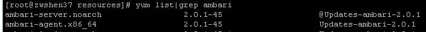

如果可以看到 Ambari 的对应版本的安装包列表，说明公共库已配置成功。然后就可以安装 Ambari 的 package 了。执行下面的命令安装 Ambari Server 到该机器。

```
yum install ambari-server

```

Show moreShow more icon

待安装完成后，便需要对 Ambari Server 做一个简单的配置。执行下面的命令。

```
amari-server setup

```

Show moreShow more icon

在这个交互式的设置中，采用默认配置即可。Ambari 会使用 Postgres 数据库，默认会安装并使用 Oracle 的 JDK。默认设置了 Ambari GUI 的登录用户为 admin/admin。并且指定 Ambari Server 的运行用户为 root。

简单的 setup 配置完成后。就可以启动 Ambari 了。运行下面的命令。

```
ambari-server start

```

Show moreShow more icon

当成功启动 Ambari Server 之后，便可以从浏览器登录，默认的端口为 8080。以本文环境为例，在浏览器的地址栏输入 `http://zwshen37.example.com:8080`，登录密码为 `admin/admin`。登入 Ambari 之后的页面如下图。

##### 图 2\. Ambari 的 welcome 页面

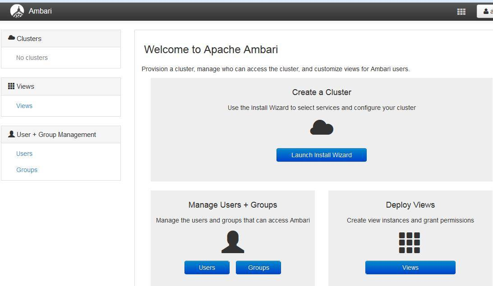

至此，Ambari Server 就安装完成了。

## 部署一个 Hadoop2.x 集群

到这一节，我们将可以真正地体验到 Ambari 的用武之地，以及它所能带来的方便之处。

登录 Ambari 之后，点击按钮”Launch Install Wizard”，就可以开始创建属于自己的大数据平台。

**第一步** ，命名集群的名字。本环境为 bigdata。

**第二步** ，选择一个 Stack，这个 Stack 相当于一个 Hadoop 生态圈软件的集合。Stack 的版本越高，里面的软件版本也就越高。这里我们选择 HDP2.2，里面的对应的 Hadoop 版本为 2.6.x。

**第三步** ，指定 Agent 机器（如果配置了域，必须包含完整域名，例如本文环境的域为 example.com），这些机器会被安装 Hadoop 等软件包。还记得在安装章节中提到的 SSH 无密码登陆吗，这里需要指定当时在 Ambari Server 机器生成的私钥（ssh-keygen 生成的，公钥已经拷贝到 Ambari Agent 的机器，具体的 SSH 无密码登录配置，可以在网上很容易找到配置方法，不在此赘述）。另外不要选择 “Perform [manual registration](javascript:void(null)) on hosts and do not use SSH”。因为我们需要 Ambari Server 自动去安装 Ambari Agent。具体参见下图示例。

##### 图 3\. 安装配置页面

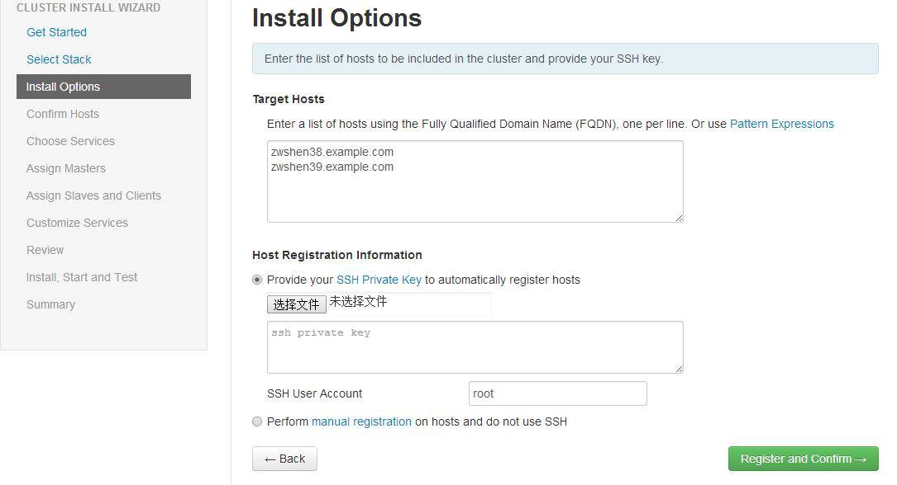

**第四步** ，Ambari Server 会自动安装 Ambari Agent 到刚才指定的机器列表。安装完成后，Agent 会向 Ambari Server 注册。成功注册后，就可以继续 Next 到下一步。

**第五步** ，这里我们终于看到跟 Hadoop 有关的名词了。在这一步，我们需要选择要安装的软件名称。本文环境选择了 HDFS，YARN + MapReduce2，Zoopkeeper，Storm 以及 Spark。选的越多，就会需要越多的机器内存。选择之后就可以继续下一步了。这里需要注意某些 Service 是有依赖关系的。如果您选了一个需要依赖其他 Service 的一个 Service，Ambari 会提醒安装对应依赖的 Service。参见下图。

##### 图 4\. Service 选择页面

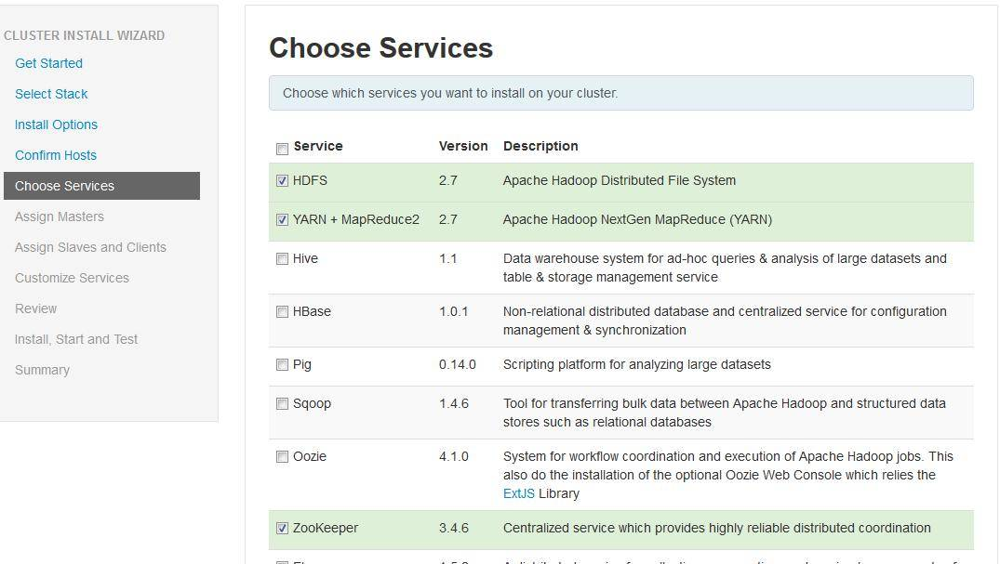

**第六步和第七步** ，分别是选择安装软件所指定的 Master 机器和 Slave 机器，以及 Client 机器。这里使用默认选择即可（真正在生产环境中，需要根据具体的机器配置选择）。

**第八步** ，就是 Service 的配置。绝大部分配置已经有默认值，不需要修改。初学者，如果不需要进行调优是可以直接使用默认配置的。有些 Service 会有一些必须的手工配置项，则必须手动输入，才可以下一步。本文环境直接使用默认配置。

**第九步** ，Ambari 会总结一个安装列表，供用户审阅。这里没问题，就直接下一步。

**第十步** ，Ambari 会开始安装选择的 Service 到 Ambari Agent 的机器（如下图）。这里可能需要等好一会，因为都是在线安装。安装完成之后，Ambari 就会启动这些 Service。

##### 图 5\. Service 的安装进度

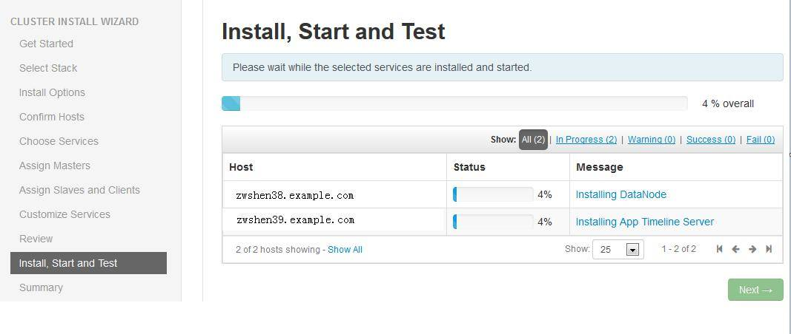

安装完成之后，就可以查看 Ambari 的 Dashboard 了。例如下图。

##### 图 6\. Ambari 的 Dashboard 页面

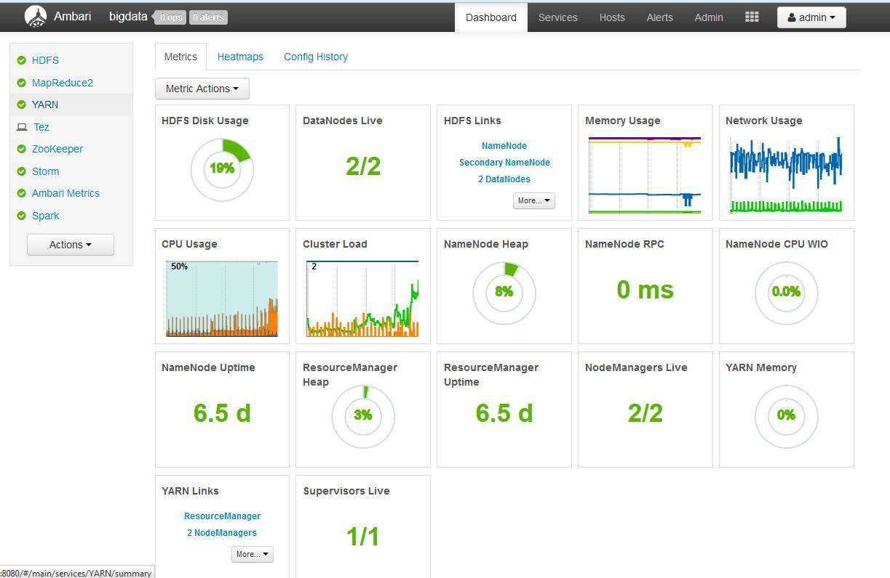

至此，您专属的 bigdata 集群已经安装完成。

## 利用 Ambari 管理 Hadoop 集群

在上一章节中，我们已经体验到 Ambari 为 Hadoop 生态圈的安装提供的便利。这已经省去了很多的人力成本。尤其是对大数据圈子的测试人员来说，自动化就容易了很多。下面我们看看如何通过 Ambari 管理 Hadoop 的集群。

### Service Level Action（服务级别的操作）

首先我们进到 Ambari 的 GUI 页面，并查看 Dashboard。在左侧的 Service 列表中，我们可以点击任何一个您想要操作的 Service。以 MapReduce2 为例（Hadoop 这里的版本为 2.6.x，也就是 YARN+HDFS+MapReduce），当点击 MapReduce2 后，就会看到该 Service 的相关信息，如下图。

##### 图 7\. MapRduce2 的 Service 页面


中间部分是 Service 的模块（Component）信息，也就是该 Service 有哪些模块及其数目。右上角有个 Service Action 的按钮，当点击该按钮后就可以看到很多 Service 的控制命令。也就是通过这些 Service Action 命令，对 Service 进行管理的。

可能有的人会说，装完 Hadoop 的集群后，并不知道这个集群是不是可用。这时候我们就可以运行一个 “Run Service Check”。点击这个命令后，就会出现下图的进度显示。

##### 图 8\. MapReduce Service Check

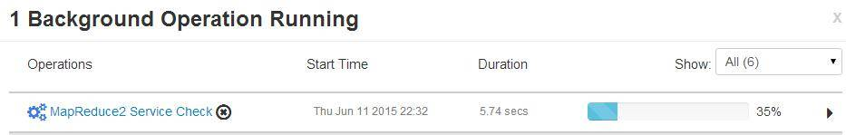

其实这里就是通过运行一个经典的 MapReduce Wordcount 实例，来检查 MapReduce 是不是正常。对于 Service Action 里面的 Start、Stop 的含义就是，启停整个集群所有该 Service 的模块（也就是 Service level）。当执行进度页面弹出来的时候，我们可以点击 Operations 的名字，进而查看每个机器的进度和运行 log。如下图 Stop 的操作。

##### 图 9\. 命令执行进度 1

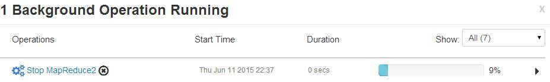

##### 图 10\. 命令执行进度 2

维护模式（Maintenance Mode）以及如何添加一个自定义的命令到 Service Action，我会在后续的连载中进行介绍。

### Host Level Action（机器级别的操作）

首先，我们回到 Ambari 的 Dashboard 页面。页面最上面中间的地方有个 Hosts，点击这个标签，我们就可以看到 Ambari 所管理的机器列表。如下图。

##### 图 11\. Ambari 的机器列表

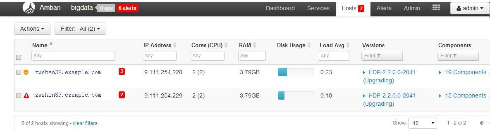

图片中红色的数字是警告信息（Ambari Alert），这里我们先略过它，后续文章再做介绍。先看左上角的 Actions，点击这个按钮，就可以看到 Host level Action 的选项了，其实和 Service Level 是类似的，只是执行的范围不一样。如下图。当用户选择 All Hosts -> Hosts -> Start All Components，Ambari 就会将所有 Service 的所有模块启动。

##### 图 12\. 启动所有 Service 的所有模块

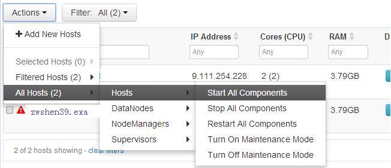

如果用户选择 All Hosts-> DataNodes -> Stop，Ambari 就会把所有机器的 DataNode 这个模块关闭。如下图。

##### 图 13\. 关闭所有的 DataNode 模块

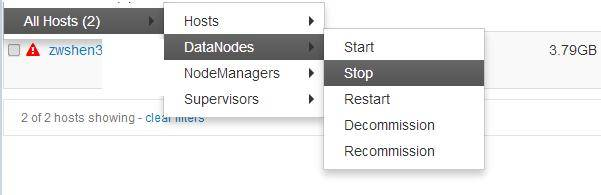

### Component Level Action（模块级别的操作）

上面的图中，我们可以看到 Decommisson、Recommission。这些命令其实是自定义的模块级别的操作（Component Level Action）。不过上图中命令一旦执行，就是对多个机器的同个模块执行。

我们现在尝试只对单个机器的一个模块（Component）执行。首先我们回到 Hosts 的页面。这时候点击机器名，我们就会进入到该机器的 Component 页面。如下图。

##### 图 14\. Component 页面

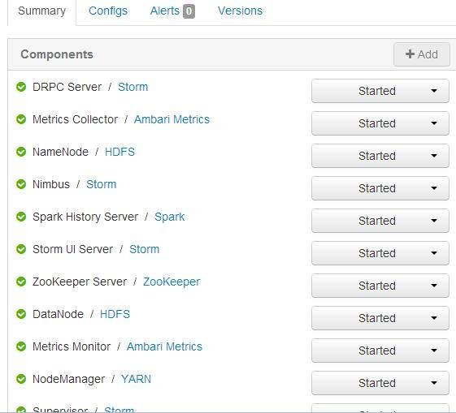

这时候只要点击每个 Component（模块）后面的按钮，就可以看到该模块的操作命令了。例如，我们可以停掉这台机器的 DataNode 模块。

##### 图 15\. 停止 DataNode 模块 1

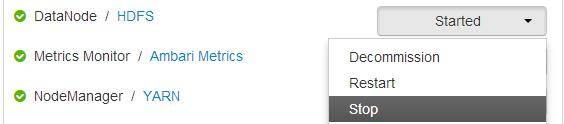

##### 图 16\. 停止 DataNode 模块 2

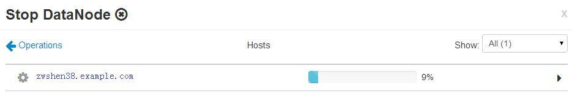

关于如何给一个模块添加自定义的命令，也会在后续的连载中做介绍。

这一章节中，主要介绍了如何通过三种级别的 Action（操作）管理 Hadoop 的集群。在 Ambari 中已经加入了很多自定义的 Action 去做一些特殊的操作。如果对 Hadoop 生态圈的软件足够熟悉，就可以尝试更多的 Action。可能有的人会问，Ambari 可不可以扩容集群。答案当然是可以的。Ambari 可以给自身的集群添加机器（也就是添加 Ambari Agent），然后将 Service 的模块安装在新的机器，也可以把某些模块安装到已有的其他的机器。篇幅有限，将在后续的连载中介绍更多的内容。

## Ambari 的架构和工作原理

Ambari 基本的架构和工作原理如下图 17 所示。

##### 图 17\. Ambari 的基本架构


Ambari Server 会读取 Stack 和 Service 的配置文件。当用 Ambari 创建集群的时候，Ambari Server 传送 Stack 和 Service 的配置文件以及 Service 生命周期的控制脚本到 Ambari Agent。Agent 拿到配置文件后，会下载安装公共源里软件包（Redhat，就是使用 yum 服务）。安装完成后，Ambari Server 会通知 Agent 去启动 Service。之后 Ambari Server 会定期发送命令到 Agent 检查 Service 的状态，Agent 上报给 Server，并呈现在 Ambari 的 GUI 上。

Ambari Server 支持 Rest API，这样可以很容易的扩展和定制化 Ambari。甚至于不用登陆 Ambari 的 GUI，只需要在命令行通过 curl 就可以控制 Ambari，以及控制 Hadoop 的 cluster。具体的 API 可以参见 Apache Ambari 的官方网页 API reference。

对于安全方面要求比较苛刻的环境来说，Ambari 可以支持 Kerberos 认证的 Hadoop 集群。

## 扩展 Ambari 管理一个自定义的 Service

首先，我们需要规划自定义的 Service 属于哪个 Stack（当然 Stack 也是可以自定义的）。这里为了快速创建一个新的 Service，而且我们已经安装了 HDP 2.2 的 Stack，所以就将自定义的 Service 放在 HDP 2.2 之下。

**第一步**，首先在 Ambari Service 机器上找到 HDP 2.2 Stack 的目录，如下图所示。

##### 图 18\. HDP 2.2 的目录


**第二步**，需要创建一个 Service 目录，我们这里用”SAMPLE”作为目录名。并在 SAMPLE 底下创建 metainfo.xml。示例代码如下。主要解释下 xml 代码中的两个字段 category 和 cardinality。category 指定了该模块（Component）的类别，可以是 MASTER、SLAVE、CLIENT。Cardinality 指的是所要安装的机器数，可以是固定数字 1，可以是一个范围比如 1-2，也可以是 1+，或者 ALL。如果是一个范围的时候，安装的时候会让用户选择机器。另外这里有关 Service 和 Component 的 name 配置要用大写，小写有时候会有问题。Displayname 可以随意设置。

```
<?xml version="1.0"?>
<metainfo>
<schemaVersion>2.0</schemaVersion>
<services>
<service>
<name>SAMPLE</name>
<displayName>My Sample</displayName>
<comment>My v1 Sample</comment>
<version>1.0</version>
<components>
<component>
<name>MYMASTER</name>
<displayName>My Master</displayName>
<category>MASTER</category>
<cardinality>1</cardinality>
<commandScript>
<script>scripts/master.py</script>
<scriptType>PYTHON</scriptType>
<timeout>5000</timeout>
</commandScript>
</component>
<component>
<name>MYSALVE</name>
<displayName>My Slave</displayName>
<category>SLAVE</category>
<cardinality>1+</cardinality>
<commandScript>
<script>scripts/slave.py</script>
<scriptType>PYTHON</scriptType>
<timeout>5000</timeout>
</commandScript>
</component>
</components>
<osSpecifics>
<osSpecific>
<osFamily>any</osFamily>
</osSpecific>
</osSpecifics>
</service>
</services>
</metainfo>

```

Show moreShow more icon

**第三步**，需要创建 Service 的控制脚本。这里我们需要在 SAMPLE 底下创建一个 package 目录，然后在 package 底下创建目录 scripts ，进而创建 master.py 和 slave.py。这里需要保证脚本路径和上一步中 metainfo.xml 中的配置路径是一致的。这两个 Python 脚本是用来控制 Master 和 Slave 模块的生命周期。脚本中函数的含义也如其名字一样：install 就是安装调用的接口；start、stop 分别就是启停的调用；Status 是定期检查 component 状态的调用；Configure 是安装完成配置该模块的调用。示例目录结构如下图。

##### 图 19\. Sample Service 的目录结构

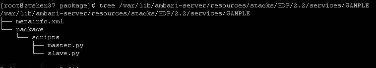

Python 脚本的示例代码：

Master.py：

```
import sys, os
from resource_management import *
from resource_management.core.exceptions import ComponentIsNotRunning
from resource_management.core.environment import Environment
from resource_management.core.logger import Logger

class Master(Script):
def install(self, env):
print "Install My Master"

def configure(self, env):
print "Configure My Master"

def start(self, env):
print "Start My Master"

def stop(self, env):
print "Stop My Master"

def status(self, env):
print "Status..."

if __name__ == "__main__":
Master().execute()

```

Show moreShow more icon

Slave.py:

```
import sys, os
from resource_management import *
from resource_management.core.exceptions import ComponentIsNotRunning
from resource_management.core.environment import Environment
from resource_management.core.logger import Logger

class Slave(Script):
def install(self, env):
print "Install My Slave"

def configure(self, env):
print "Configure My Slave"

def start(self, env):
print "Start My Slave"

def stop(self, env):
print "Stop My Slave"
def status(self, env):
print "Status..."

if __name__ == "__main__":
Slave().execute()

```

Show moreShow more icon

**第四步**，需要重启 Ambari Server。因为 Ambari Server 只有在重启的时候才会读取 Service 和 Stack 的配置。命令行执行：

```
ambari-server restart

```

Show moreShow more icon

**第五步**，登录 Ambari 的 GUI，点击左下角的 Action，选择 Add Service。如下图：

##### 图 20\. Add Service 按钮

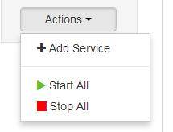

这时候就可以看到我们自定义的 Service：SAMPLE。如下图：

##### 图 21\. Sample Service 列表

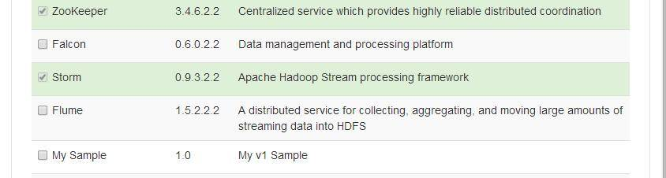

选择左侧 My Sample 后，就可以一路 Next 了，这个过程其实和我们在搭建 Hadoop2.x 集群的时候是类似的。由于这个 Service 没有真的安装包，所以安装过程会非常的快，启动命令也没有真正的逻辑，所以启动过程也是很快的。等最后点击完 Complete，整个安装过程也就结束了。再回到 Ambari 的 Dashboard 的时候，我们就可以看到这个 My Sample 了，如下图：

##### 图 22\. My Sample 的 Service 页面

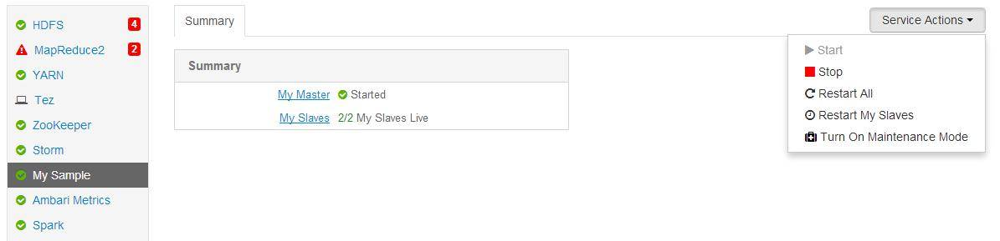

到此就可以和第四节中管理 Hadoop 集群一样管理我们的 My Sample。例如下图，Stop 我们的 My Sample。

##### 图 23\. Stop Sample 页面 1

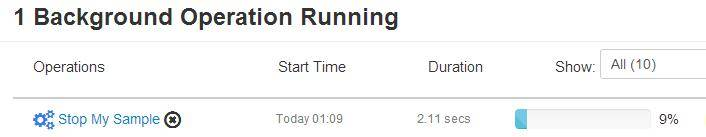

##### 图 24\. Stop Sample 页面 2

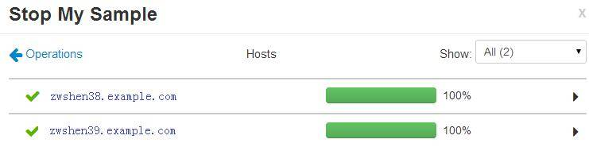

##### 图 25\. Stop Sample 页面 3

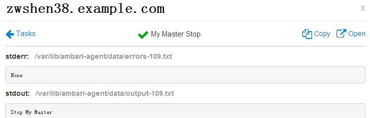

进阶的篇幅中，将会探讨如何给我们的 My Sample 自定义一些 Actions，以及 Action 之间的依赖关系如何定义。篇幅有限，这里就先到此为止。希望以上的介绍能够燃起大家对 Ambari 的热情。

## 结束语

大数据与云计算可谓是如今数据中心中最火的两项技术领域，几乎所有的 IT 服务商都想在这两项技术中有所建树。相信 Ambari 可以帮助一些 Hadoop 的初学者。长远看来，大数据的发展离不开云计算，云计算中 IaaS 可谓已经很成熟，并且价格低廉。这时候许多公司将目光聚集在了 PaaS。大数据的流行更是加速了相关 PaaS 产品的发展，而 Ambari 的出现必然可以拉近 IaaS 和 PaaS 的距离。也就是说有了 Ambari，或许再加上 Docker，那么快速从 IaaS 演进到 PaaS 就显得不是那么困难了。

当然这里 Ambari 要跟 IaaS 更好的切合，还有个对手那就是 Sahara。它是另一个土生土长的 OpenStack 的子项目，其目的也是为了在 Openstack 上面快速搭建 Hadoop 等集群。期望着这些项目能够快速成长，将来对大家都有所帮助。