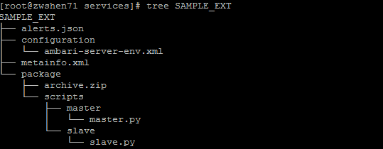
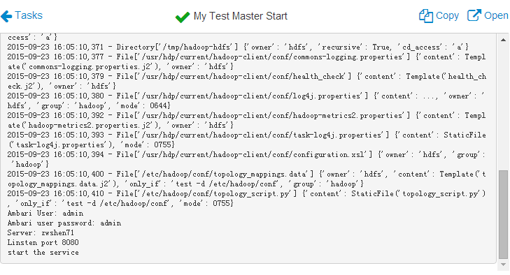
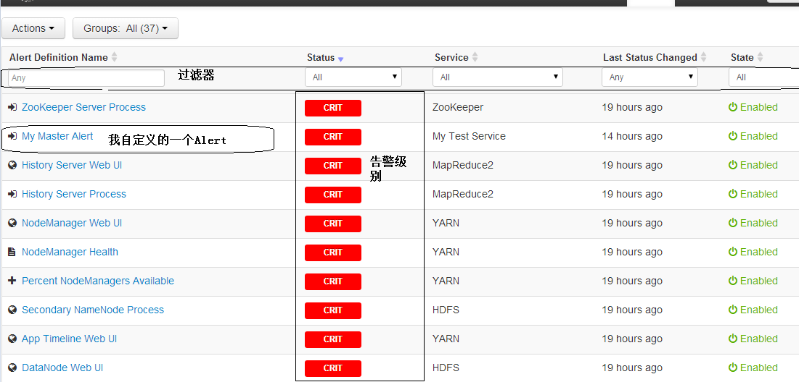
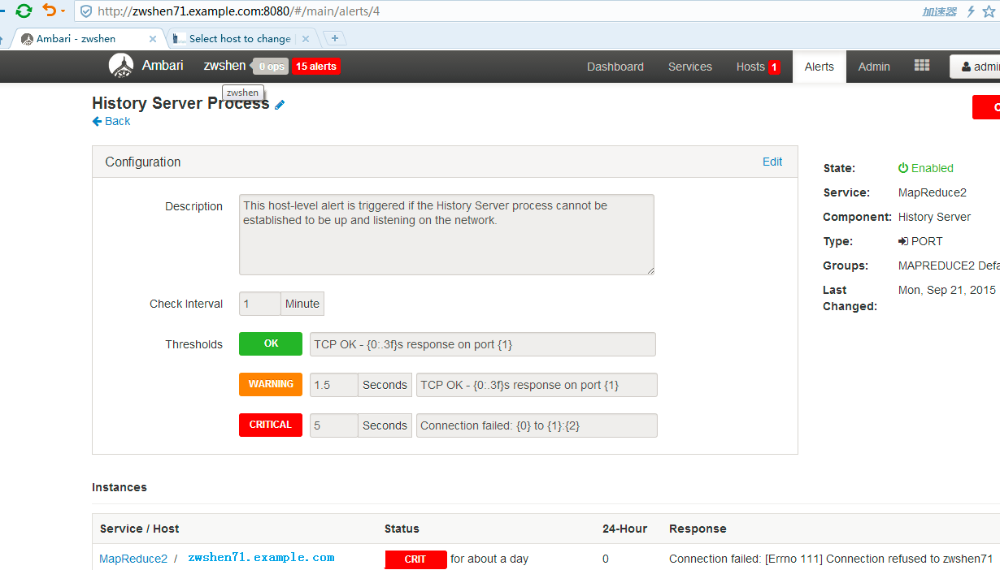
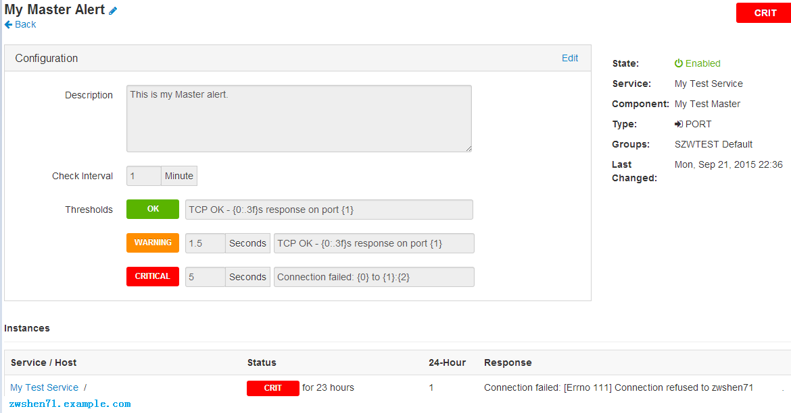
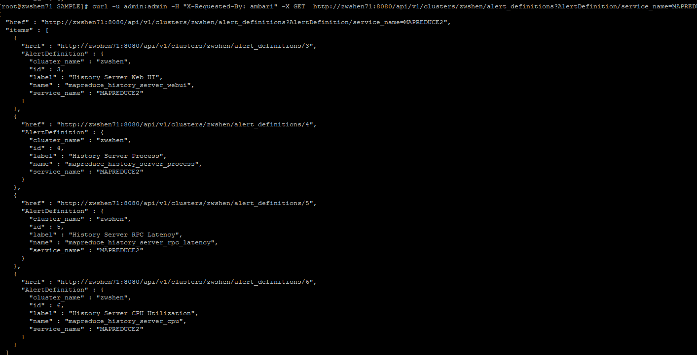
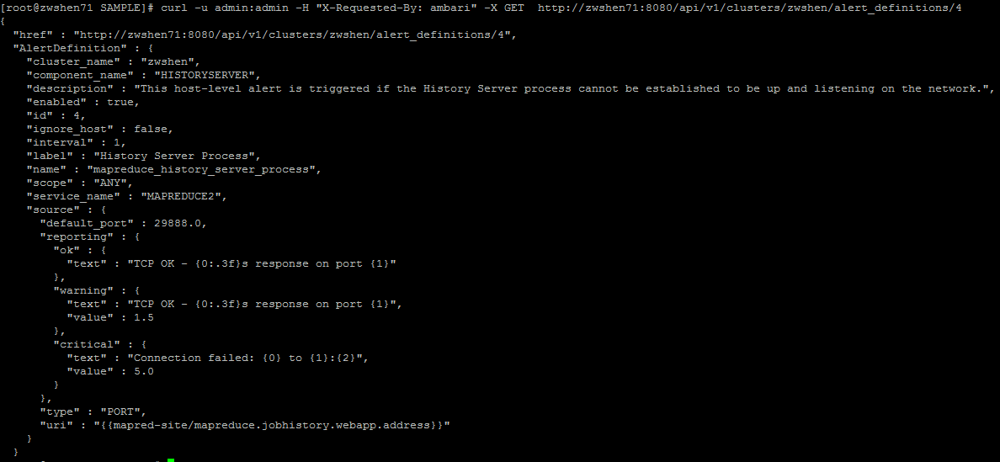
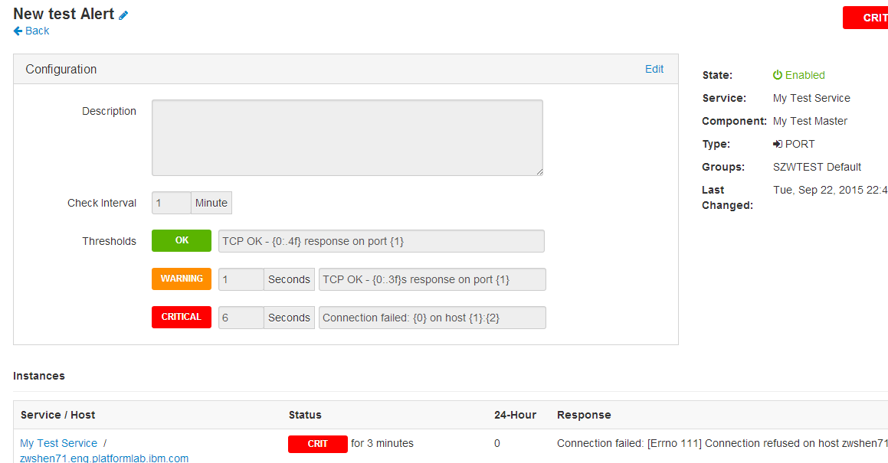

# Ambari 服务配置以及 Alert 详解
学习 Ambari 服务配置以及 Alert

**标签:** 分析

[原文链接](https://developer.ibm.com/zh/articles/os-cn-bigdata-ambari3/)

沈钊伟

发布: 2015-10-13

* * *

## Ambari 最新动态

2015 年，Ambari 发展的比较快，最新的发布版本已经是 2.1.1，而且马上将要发布 2.1.2 版本。与之前版本相比较，Ambari 增加了对一些最新版本操作系统的支持，同时也不再支持一些过时版本的操作系统。例如不再支持 RHEL/CentOS/OEL 5，增加了对 RHEL/CentOS/OEL 7 的支持。Ambari 在 2.1 中也更新了 JDK 的支持版本。目前已经支持了 OpenJDK 和 Oracle JDK 的 1.8 版本，去掉了对 Oracle JDK 1.6 的支持。相信在众多越来越多贡献者的推动下，Ambari 可以变得更加稳定和健壮。

## Ambari 自定义 Service 的配置

Ambari 在每次启动的时候，会扫描 resource 目录下 Stack 下面的 service 配置。也就是每个 Service 的 metainfo.xml，同时会将这些配置信息放在自己的数据库中。当用户在 WEB 上面点击 “Add Service”的时候，WEB 就会加载这些配置信息到具体的页面里。

关于最基本的自定义 Service 配置项，以及如何在 Ambari 中增加一个自定义的 Service，已经在 [《Ambari——大数据平台的搭建利器》](http://www.ibm.com/developerworks/cn/opensource/os-cn-bigdata-ambari/index.html) 中有过介绍。这里我只做一些补充的配置说明。

### 增加 Service Check 逻辑

在 Service 的 metainfo.xml 中，commandScript 字段就是用来配置 service check 脚本入口。如果一个 Service 的 metainfo.xml 有该字段，那么在 Service 的 Action 列表中就会出现”Run Service Check”这个命令。相比较之前文章介绍的自定义命令（Customcommand），Service Check 是没有 name 属性的，所以它才是固定的”Run Service Check”。不过关于 Ambari 如何分发执行自定义命令和 Service Check 是一样的。

commandScript 段示例代码（完整的示例代码，可以在任一个 Ambari 的 common Service 目录中找到）：

```
<commandScript>
<script>scripts/master/my_check.py</script>
<scriptType>PYTHON</scriptType> <timeout>300</timeout>
</commandScript>

```

Show moreShow more icon

当用户在 WEB 中点击”Run Service Check”时，Ambari Server 会随机通知一个该 Service 所在机器上的 Agent 进程，然后由 Agent 执行该 Service check 脚本。

### 增加 Service 的配置项

在 Ambari 上安装过 Service 的用户，肯定经历过 Custom Service 这一步。在这一步中，用户必须输入很多必要的输入项，才可以继续下一步。当一个 Service 安装完成后，在 Dashboard 上点击该 Service，可以看到一个 config 页面。这个页面是为了给用户提供一个更新 Service 配置的入口。如果更新了相关数据，Ambari 就会存入它的数据库（postgres）中。

对于自定义的 Service，默认是没有这些配置项的。如果一个自定义的 Service 需要某些必须的参数时，就必须创建 Service 的配置目录（configuration）和对应的配置文件，让用户安装的时候输入。

这里需要在 Service 的 metainfo.xml 中增加字段。该字段就是用来关联一个 Service 与配置项文件入口。Ambari 支持 xml 和 json 格式的配置文件。

示例代码如下：

```
<configuration-dependencies>
<config-type>ambari-server-env</config-type> </configuration-dependencies>

```

Show moreShow more icon

示例代码中每一行字段，用来指定一个配置文件。一个 Service 可以同时指定多个配置文件。不过所有的配置文件必须放在 Service 的 configuration 目录中。

##### 图 1\. 示例 Service 目录结构图



示例配置文件：

```
[root@zwshen71 configuration]# cat ambari-server-env.xml <?xml
version="1.0"?> <?xml-stylesheet type="text/xsl" href="configuration.xsl"?>
<configuration> <property> <name>AMBARI_USER</name>
<value>admin</value> <description>Ambari Server user
name</description> </property> <property>
<name>AMBARI_USER_PASSWORD</name> <value></value>
<description>Ambari Server user password</description>
<property-type>PASSWORD</property-type> </property> <property>
<name>AMBARI_CLUSTER_NAME</name> <value></value>
<description>Ambari Cluster name</description> </property>
<property> <name>AMBARI_SERVER_HOST</name> <value></value>
<description>Ambari Server host name. Symphony will communicate with this host for
integration</description> </property> <property>
<name>AMBARI_WEB_LISTEN_PORT</name> <value>8080</value>
<description>Ambari WEB Server listen port. Symphony uses this port for communication
with Ambari</description> </property> </configuration>

```

Show moreShow more icon

配置文件中，其实就是指定了一些键值对的属性，以及一个描述。当在 Ambari 的 WEB 中增加这个 Service 时，Ambari Server 会读取这些信息，并显示到该 service 的配置页面中（Customize Service 和 config 页面）。默认情况下，如果一个配置项没有配置默认值，用户则必须输入。如果一个项允许为空，则需要在中增加 require-input=”false”的属性。例如下面的配置项。

require-input 示例配置：

```
<property require-input="false">
<name>AMBARI_CLUSTER_NAME</name> <value></value>
<description>Ambari Cluster name</description> </property>

```

Show moreShow more icon

Ambari 会在安装这个 service 的时候，将用户的输入项存入 Ambari 的数据库中。当 Agent 方需要访问这些数据的时候，Server 会读取数据库并以 Json 格式传送给 Agent。

##### 图 2\. 自定义 Service 的配置页面


### 如何在 Agent 方读取 WEB 中的输入参数

对 Service 添加了参数项之后，就是读的问题了。Ambari 的 Server 会以 Json 格式将数据传送给 Ambari Agent。在 Agent 的实现中，其实已经提供了访问配置数据的接口。因此很容易就可以获取这些输入项了。

在 Ambari 的 Agent 中有实现了叫做 Script 的类，每个 Service 的生命周期脚本都必须继承这个 Script 类。Script 提供了很多简单易用的函数供 Service 使用，其中 def get\_config() 这个函数就是用于获取该 Service 配置信息。由于 Service 的配置文件可以是多个，get\_config 返回的也就是一个合集，需要 Service 对应的脚本代码去解析。这里直接给一个简单的示例代码。

Service Master 模块的示例代码：

```
import sys, os import json import logging import platform from
resource_management import * from resource_management.core.exceptions import
ComponentIsNotRunning from resource_management.core.environment import Environment from
resource_management.core.logger import Logger class Master(Script): def install(self, env):
print "install my master" def configure(self, env): print "configure this service here" def
start(self, env): # 解析 service 的配置参数 config = Script.get_config() AMBARI_USER =
config['configurations']['ambari-server-env']['AMBARI_USER'] AMBARI_USER_PWD =
config['configurations']['ambari-server-env']['AMBARI_USER_PASSWORD'] AMBARI_SERVER_HOST =
config['configurations']['ambari-server-env']['AMBARI_SERVER_HOST'] AMBARI_WEB_LISTEN_PORT =
config['configurations']['ambari-server-env']['AMBARI_WEB_LISTEN_PORT'] print "Ambari User:
" + AMBARI_USER + " \nAmbari user password: " + AMBARI_USER_PWD + "\nServer: " +
AMBARI_SERVER_HOST + "\nLinsten port " + str(AMBARI_WEB_LISTEN_PORT) cmd = "mkdir -p
/var/run/shenzhaowei" os.system(cmd) print "start the service" def stop(self, env): cmd =
"rm -rf /var/run/shenzhaowei" os.system(cmd) print "stop the service" def status(self, env):
cmd = "echo 'check one time' > /tmp/my.log" os.system(cmd) cmd = "ls
/var/run/shenzhaowei" result = os.system(cmd) if result != 0: raise ComponentIsNotRunning()
if __name__ == "__main__": Master().execute()

```

Show moreShow more icon

##### 图 3\. 参数解析代码执行结果



在上面的示例代码中，start 的控制函数中引入了简要的输入参数解析逻辑。读者可以参考实现。这里需要延伸多说下 Script 这个类。在 Ambari 的环境中可以在路径”/usr/lib/python2.6/site-packages/resource\_management/libraries/script”中找到 Script.py（有兴趣的读者也可以在 Ambari 的 git 库中找到最新的代码），也就是 Script 类的实现。在 Service 的控制脚本中 install、start、stop 等控制函数，其实都继承于 Script 类，并被重新实现。Script 提供很多常用的功能，因为当需要在控制脚本中实现一个相关的控制函数时，可以先看看 Script 是否已经有实现。有的话，直接用就好了。例如需要执行一个 shell 脚本的时候，可以用 os.system()，也可以用 Script 的 Execute 函数，而且更加简单。

## Ambari Alert（告警）简介

### Ambari 告警的基础概念

Ambari 为了帮助用户鉴别以及定位集群的问题，实现了告警（Alert）机制。在 Ambari 中预定了很多的告警，这些告警被用于监测集群的各个模块以及机器的状态。对于告警来说，主要有两个概念，一个是 Alert Definition，一个是 Alert Instance。顾名思义，Alert Definition 就是告警的定义，其中会定告警的检测时间间隔（interval）、类型（type）、以及阈值（threshold）等。Ambari 会读取告警的定义，然后创建对应的实例（instance）去定期执行这个告警。例如 MapReduce2 这个 Service 就定义了两个告警”History Server WEB UI”和”History Server Process”来定期检查 History Server 模块的状态。

终端用户可以在 WEB 中 Alert 的页面，浏览以及组织管理这些告警。如果告警名称太多，用户可以用过滤器筛选想要查找的告警。其实这些 WEB 中的显示，都是 Alert Definition，也就是告警的定义。用户可以点击具体的 Alert name 去查看或者修改 Alert 属性（例如 interval 和阈值）。在详细的告警页面里，可以看到该告警所有的 instance。每个 instance 都会严格的报告该 instance 的检查结果。Alert 的检查结果会以五种级别呈现，分别是 OK、WARNING，CRITICAL、UNKNOW 和 NONE。其中最常见的是前三种。

### Ambari 中 Alert 的类型

Ambari 中的 Alert 分为 5 种类型，分为 WEB、Port、Metric、Aggregate 和 Script。具体的区别见下面的表格。

##### 表 1\. Ambari 中的 Alert 类型对比

类型用途告警级别阀值是否可配单位PORT用来监测机器上的一个端口是否可用OK, WARN, CRIT是秒METRIC用来监测 Metric 相关的配置属性OK, WARN, CRIT是变量AGGREGATE用于收集其他某些 Alert 的状态OK, WARN, CRIT是百分比WEB用于监测一个 WEB UI（URL）地址是否可用OK, WARN, CRIT否无SCRIPTAlert 的监测逻辑由一个自定义的 python 脚本执行OK, CRIT否无

## 如何在 WEB 中管理修改 Alert

当用户登录到 Ambari WEB 中，便可以直接跳转到 Alert 的页面。然后可以操作过滤器筛选 Alert 信息。也可以直接点击最右侧的 Enable 关闭一个开启状态的 Alert（也可以点击 Disable 直接开启一个关闭的 Alert）。

##### 图 4\. 告警示例图



如果用户需要更新一个 Alert 的相关配置，则需要点击 Alert 的名字，进入到 Alert 的定义页面去操作。在这个页面中，当用户点击 Edit 之后，便可以修改 Alert 显示名称，监测时间间隔（interval），以及对应的阀值（图 5 中的 1.5 和 5 秒），以及描述信息。这里用户也可以通过 Enable/Disable 去启停该 Alert。这里注意下地址栏中最后一个数字，这个其实就是每个 Alert 唯一的 id 标识。后面介绍 Rest API 会用到。

##### 图 5\. 定义页面



## 为自定义的 Service 增加 Alert 配置

随着 Ambari 的流行，越来越多的公司想利用 Ambari 管理自己的 Service。这里简单介绍下如何给第三方的 Service 增加 Alert 的相关配置。

在 Ambari 5 种类型的告警中，Port 类型是最容易理解的。如果定义了一个 Port 类型的告警，Ambari 便会监测这个端口。然后依赖这个端口的响应时间，报告对应的 Alert 级别。这里我便以 Port 类型为示例。

首先需要在对应的 Service 目录下创建 alerts.json。Ambari Server 会在启动的时候加载这个配置。当在 Ambari 中安装了这个 Service 之后，Ambari 会将 alert.json 中的定义存到数据库中。然后根据其中的定义（Alert Definition），创建对应的 Alert Instance。最终这些实例就会按照 interval 的配置定期检查。

Alert.json 示例代码如下：

```
[root@zwshen71 SAMPLE]# cat alerts.json { "SZWTEST": { "service": [],
"SZW_MASTER": [ { "name": "shenzhaowei_master", "label": "My Master Alert", "description":
"This is my Master alert.", "interval": 1, "scope": "ANY", "enabled": true, "source": {
"type": "PORT", "uri": "{{zwshen71.example.com:29888}}", "default_port": 29888, "reporting":
{ "ok": { "text": "TCP OK - {0:.3f}s response on port {1}" }, "warning": { "text": "TCP OK -
{0:.3f}s response on port {1}", "value": 1.5 }, "critical": { "text": "Connection failed:
{0} to {1}:{2}", "value": 5.0 } } } } ] } }

```

Show moreShow more icon

根据上面的代码，其中”SZWTEST”是 Service 的名字， “SZW\_MASTER”是 component 名字（名字要与 metainfo.xml 的配置相匹配）。这两个配置就是用来定义这个 Alert 属于哪个 Service 的哪个模块。下面则是对 Alert 本身属性的定义。Name 是 Alert 的名字，这个用来唯一标识一个 alert。Label 会作为告警的名字显示在 WEB 中的列表（这个配置类似于 metainfo 中的 displayname）。Description 用来描述一个 alert 的用途，是一个显示的内容配置。Interval 用来配置 Alert 监测的间隔时间，单位是秒。Scope 一般都是 any，代表不区分机器。Enable 用来控制 Alert 的开启状态。如果是 false，就代表不启用这个 alert。Source 段用来配置 alert 的类型、阀值以及提示的消息。ok\\warning\ critical 就是三种级别的配置。Text 是显示的消息，value 就是阀值。上面代码的配置意思是，如果端口在 5 秒不响应，就会提示连接失败；如果大于 1.5 秒小于 5 秒，则会提示 warning。

上面的示例代码中，我只定义了一个 Alert。如果想同时定义多种（多个）Alert，在增加一个段就可以了。并且可以在一个 alert.json 中同时定义多个 Service 的 alert。这个和一个 metainfo 中定义多个 service 是类似的（这两个本身就是匹配在一起的）。可以参考 Ambari 中 YARN 的配置。

这里需要注意，当 Service 安装完成之后，再修改 Alert.json 是没有用的。Ambari 已经将 Service 相关的告警存入到数据库中了。这时候如果更新 Alert.json，Ambari 便不会再读取里面的配置，即使重启也不行。

##### 图 6\. 新增的告警示例



## Alert 的 Rest API 介绍

WEB 中虽然已经提供了修改 Alert 的接口，但是与 Rest API 相比较的话，页面可以修改的东西就显得有点太少了。如果要将第三方的 Service 更好的与 Ambari 做集成，也不可能让终端用户手动修改 WEB 中的内容，那样的体验是不友好的。Rest API 可以更灵活，更大权限的去修改一个 Alert 配置。

在 Rest API 中会涉及很多 Alert 属性值。对于多种类型 Alert 来说，有一些属性是每种都有的，也就是通用属性。例如 id、name、label、cluster\_name、service\_name、component\_name、source。Source 是一个子字段，包含很多子属性。每种不同类型 Alert，source 是不同的，而且差异很大。Port 和 Script 类型的 source 可能很简单，Metric 和 WEB 可能会比较复杂。Port、Metric 和 WEB 的 source 字段中都会有 reporting 和 uri 属性。Port 会额外多一个 default port 属性。Reporting 属性，用于定义 Alert 的告警级别和相应的告警内容文本以及阀值。Uri 属性，用于定义一个 Alert 要检测的内容（可以是端口，可以 URL，也可以是一些变量）。Script 类型的 Alert 把权利都交给了 Python 脚本，所以没有这些属性。大概的属性就是这些，下面来一一介绍和练习一下 Alert 的 Rest API。

### Alert 的查询

GET api/v1/clusters//alert\_definitions

这里需要注意，如果 alert\_definitions 后面没有 Alert 的 id，就会查询到 Ambari 所有的 Alert 定义。如果指定了一个 id，就代表查询一个指定的 Alert。这里也可以使用 Alert 的属性来模糊匹配查询某一个 Service 或者某一个模块的 Alert 定义。

#### 示例 1，查询所有 Alert 的定义（最好进行重定向，因为太多会刷屏）

curl 示例代码：

```
curl -u admin:admin -H "X-Requested-By: ambari" -X GET
http://zwshen71:8080/api/v1/clusters/zwshen/alert_definitions

```

Show moreShow more icon

#### 示例 2，查询 MapReduce2 的所有 Alert

curl 示例代码：

```
curl -u admin:admin -H "X-Requested-By: ambari" -X GET
http://zwshen71:8080/api/v1/clusters/zwshen/alert_definitions?AlertDefinition/service_name=MAPREDUCE2

```

Show moreShow more icon

##### 图 7\. 查询 MapReduce2 的所有告警



#### 示例 3，查询 id 为 4 的 Alert

curl 示例代码：

```
curl -u admin:admin -H "X-Requested-By: ambari" -X GET
http://zwshen71:8080/api/v1/clusters/zwshen/alert_definitions/4

```

Show moreShow more icon

##### 图 8\. 查询 ID 为 4 的告警



可以看到批量查询的结果，与用 id 查询是有区别的。id 查询会得到一个 Alert 更完整的属性。

### Alert 的创建

POST api/v1/clusters//alert\_definitions

#### 示例 4，为自定义 Service 的 Master 模块再增加一个 port 类型的 Alert

curl 示例代码：

```
curl -u admin:admin -H "X-Requested-By: ambari" -X POST
http://zwshen71:8080/api/v1/clusters/zwshen/alert_definitions -d ' { "AlertDefinition" : {
"service_name" : "SZWTEST", "component_name" : "SZW_MASTER", "enabled" : true, "interval" :
1, "label" : "New test Alert", "name" : "example_test_alert", "scope" : "ANY", "source" : {
"default_port" : 4000, "reporting" : { "ok" : { "text" : "TCP OK - {0:.4f} response on port
{1}" }, "warning" : { "text" : "TCP OK - {0:.3f}s response on port {1}", "value" : 1.0 },
"critical" : { "text" : "Connection failed: {0} on host {1}:{2}", "value" : 6.0 } }, "type"
: "PORT", "uri" : "{{zwshen71:4000}}" } } }'

```

Show moreShow more icon

这时候可以直接在 Ambari 的 WEB 中看到这个新的 Alert（不用重启 Ambari Server）。

##### 图 9\. 新增的 Port 类型告警



### Alert 的更新

PUT api/v1/clusters//alert\_definitions/

#### 示例 5，更新示例 4 中增加的 Alert 信息

增加描述信息，更新 interval 为 2 秒，更新阀值为 2 和 7 秒，并且同时暂时关闭这个 Alert。操作之前，需要先拿到这个 Alert 的 id，可以从 WEB 页面的地址栏直接看到，也可以通过示例 1 和 2 中介绍的 Rest API。在指定的 Json 段中，不用给出完整的 Alert 定义属性。缺失的属性，Ambari 会认为没有变化。

Curl 示例代码：

```
curl -u admin:admin -H "X-Requested-By: ambari" -X PUT
http://zwshen71:8080/api/v1/clusters/zwshen/alert_definitions/151 -d ' { "AlertDefinition" :
{ "enabled": false, "interval" : 2, "description": "This is a new Master alert.", "source" :
{ "default_port" : 4000, "reporting" : { "ok" : { "text" : "TCP OK - {0:.4f} response on
port {1}" }, "warning" : { "text" : "TCP OK - {0:.3f}s response on port {1}", "value" : 2.0
}, "critical" : { "text" : "Connection failed: {0} on host {1}:{2}", "value" : 7.0 } } } }
}'

```

Show moreShow more icon

执行完成后可以再看看 WEB 中该告警的信息。

### Alert 的删除

DELETE api/v1/clusters//alert\_definitions/

#### 示例 6，删除示例 4 中新增的 Alert

curl 示例代码：

```
curl -u admin:admin -H "X-Requested-By: ambari" -X DELETE
http://zwshen71:8080/api/v1/clusters/zwshen/alert_definitions/151

```

Show moreShow more icon

### Alert 的立即执行

有一些 Alert 的执行间隔时间设置的非常大，有时候用户需要在某个时间点手工触发立即执行。这时候就需要这个 API 了（WEB 中没有这个接口）。

PUT api/v1/clusters//alert\_definitions/?run\_now=true

curl 示例代码：

```
curl -u admin:admin -H "X-Requested-By: ambari" -X DELETE
http://zwshen71:8080/api/v1/clusters/zwshen/alert_definitions/4?run_now=true

```

Show moreShow more icon

## 结束语

由于大数据技术的持续火热，Ambar 的发展速度也在不断提升。相信不久将会覆盖所有大数据生态圈的框架，这也是 Ambari 的着力点。Ambari 的的确确极大的方便了用户创建、管理以及维护各自的大数据平台。现在的 Ambari 也越来越稳定，与各个 Service 之间的集成也越来越平滑。在作者本人看来，Ambari 的发展方向有两个，一个是提供更广阔更平滑的支持大数据生态圈的框架；另一个是更加开放化，可定制化，成为一个更通用的服务管理平台。这样 Ambari 未来的路会更广，受益者和贡献者也会更多。例如社区正在 2.1.3 的代码中做的多语言支持（全球化）以及 Alert WEB 定制化等，都是在 Ambari 的宽度上的发展。相信这样的 Ambari 也将会走的更远更广。