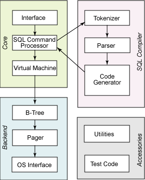
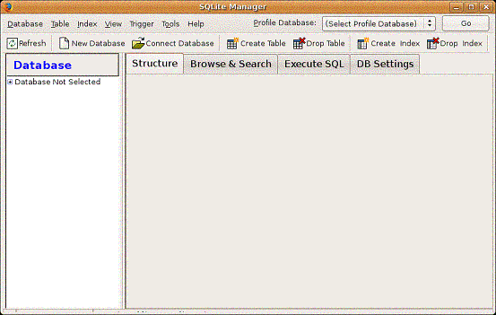

# Android 开发中使用 SQLite 数据库
SQLite 在 Android 环境中的基本使用

**标签:** Android,数据库,移动开发

[原文链接](https://developer.ibm.com/zh/articles/os-cn-sqlite/)

谢亚力

发布: 2010-08-19

* * *

## SQLite 介绍

SQLite 一个非常流行的嵌入式数据库，它支持 SQL 语言，并且只利用很少的内存就有很好的性能。此外它还是开源的，任何人都可以使用它。许多开源项目（(Mozilla, PHP, Python）都使用了 SQLite.

SQLite 由以下几个组件组成：SQL 编译器、内核、后端以及附件。SQLite 通过利用虚拟机和虚拟数据库引擎（VDBE），使调试、修改和扩展 SQLite 的内核变得更加方便。

##### 图 1\. SQLite 内部结构



SQLite 基本上符合 SQL-92 标准，和其他的主要 SQL 数据库没什么区别。它的优点就是高效，Android 运行时环境包含了完整的 SQLite。

SQLite 和其他数据库最大的不同就是对数据类型的支持，创建一个表时，可以在 CREATE TABLE 语句中指定某列的数据类型，但是你可以把任何数据类型放入任何列中。当某个值插入数据库时，SQLite 将检查它的类型。如果该类型与关联的列不匹配，则 SQLite 会尝试将该值转换成该列的类型。如果不能转换，则该值将作为其本身具有的类型存储。比如可以把一个字符串（String）放入 INTEGER 列。SQLite 称这为”弱类型”（manifest typing.）。

此外，SQLite 不支持一些标准的 SQL 功能，特别是外键约束（FOREIGN KEY constrains），嵌套 transcaction 和 RIGHT OUTER JOIN 和 FULL OUTER JOIN, 还有一些 ALTER TABLE 功能。

除了上述功能外，SQLite 是一个完整的 SQL 系统，拥有完整的触发器，交易等等。

## Android 集成了 SQLite 数据库

Android 在运行时（run-time）集成了 SQLite，所以每个 Android 应用程序都可以使用 SQLite 数据库。对于熟悉 SQL 的开发人员来时，在 Android 开发中使用 SQLite 相当简单。但是，由于 JDBC 会消耗太多的系统资源，所以 JDBC 对于手机这种内存受限设备来说并不合适。因此，Android 提供了一些新的 API 来使用 SQLite 数据库，Android 开发中，程序员需要学使用这些 API。

数据库存储在 data/< 项目文件夹 >/databases/ 下。

## Android 开发中使用 SQLite 数据库

Activites 可以通过 Content Provider 或者 Service 访问一个数据库。下面会详细讲解如果创建数据库，添加数据和查询数据库。

### 创建数据库

Android 不自动提供数据库。在 Android 应用程序中使用 SQLite，必须自己创建数据库，然后创建表、索引，填充数据。Android 提供了 SQLiteOpenHelper 帮助你创建一个数据库，你只要继承 SQLiteOpenHelper 类，就可以轻松的创建数据库。SQLiteOpenHelper 类根据开发应用程序的需要，封装了创建和更新数据库使用的逻辑。SQLiteOpenHelper 的子类，至少需要实现三个方法：

- 构造函数，调用父类 SQLiteOpenHelper 的构造函数。这个方法需要四个参数：上下文环境（例如，一个 Activity），数据库名字，一个可选的游标工厂（通常是 Null），一个代表你正在使用的数据库模型版本的整数。
- onCreate（）方法，它需要一个 SQLiteDatabase 对象作为参数，根据需要对这个对象填充表和初始化数据。
- onUpgrage() 方法，它需要三个参数，一个 SQLiteDatabase 对象，一个旧的版本号和一个新的版本号，这样你就可以清楚如何把一个数据库从旧的模型转变到新的模型。

下面示例代码展示了如何继承 SQLiteOpenHelper 创建数据库：

```
public class DatabaseHelper extends SQLiteOpenHelper {
DatabaseHelper(Context context, String name, CursorFactory cursorFactory, int version)
{
    super(context, name, cursorFactory, version);
     }

     @Override
     public void onCreate(SQLiteDatabase db) {
         // TODO 创建数据库后，对数据库的操作
     }

     @Override
public void onUpgrade(SQLiteDatabase db, int oldVersion, int newVersion) {
         // TODO 更改数据库版本的操作
     }

@Override
public void onOpen(SQLiteDatabase db) {
         super.onOpen(db);
         // TODO 每次成功打开数据库后首先被执行
     }
}

```

Show moreShow more icon

接下来讨论具体如何创建表、插入数据、删除表等等。调用 getReadableDatabase() 或 getWriteableDatabase() 方法，你可以得到 SQLiteDatabase 实例，具体调用那个方法，取决于你是否需要改变数据库的内容：

```
db=(new DatabaseHelper(getContext())).getWritableDatabase();
return (db == null) ? false : true;

```

Show moreShow more icon

上面这段代码会返回一个 SQLiteDatabase 类的实例，使用这个对象，你就可以查询或者修改数据库。

当你完成了对数据库的操作（例如你的 Activity 已经关闭），需要调用 SQLiteDatabase 的 Close() 方法来释放掉数据库连接。

### 创建表和索引

为了创建表和索引，需要调用 SQLiteDatabase 的 execSQL() 方法来执行 DDL 语句。如果没有异常，这个方法没有返回值。

例如，你可以执行如下代码：

```
db.execSQL("CREATE TABLE mytable (_id INTEGER PRIMARY KEY
        AUTOINCREMENT, title TEXT, value REAL);");

```

Show moreShow more icon

这条语句会创建一个名为 mytable 的表，表有一个列名为 \_id，并且是主键，这列的值是会自动增长的整数（例如，当你插入一行时，SQLite 会给这列自动赋值），另外还有两列：title( 字符 ) 和 value( 浮点数 )。 SQLite 会自动为主键列创建索引。

通常情况下，第一次创建数据库时创建了表和索引。如果你不需要改变表的 schema，不需要删除表和索引 . 删除表和索引，需要使用 execSQL() 方法调用 DROP INDEX 和 DROP TABLE 语句。

### 给表添加数据

上面的代码，已经创建了数据库和表，现在需要给表添加数据。有两种方法可以给表添加数据。

像上面创建表一样，你可以使用 execSQL() 方法执行 INSERT, UPDATE, DELETE 等语句来更新表的数据。execSQL() 方法适用于所有不返回结果的 SQL 语句。例如：

```
db.execSQL("INSERT INTO widgets (name, inventory)"+
"VALUES ('Sprocket', 5)");

```

Show moreShow more icon

另一种方法是使用 SQLiteDatabase 对象的 insert(), update(), delete() 方法。这些方法把 SQL 语句的一部分作为参数。示例如下：

```
ContentValues cv=new ContentValues();
cv.put(Constants.TITLE, "example title");
cv.put(Constants.VALUE, SensorManager.GRAVITY_DEATH_STAR_I);
db.insert("mytable", getNullColumnHack(), cv);

```

Show moreShow more icon

update（）方法有四个参数，分别是表名，表示列名和值的 ContentValues 对象，可选的 WHERE 条件和可选的填充 WHERE 语句的字符串，这些字符串会替换 WHERE 条件中的”？”标记。update() 根据条件，更新指定列的值，所以用 execSQL() 方法可以达到同样的目的。

WHERE 条件和其参数和用过的其他 SQL APIs 类似。例如：

```
String[] parms=new String[] {"this is a string"};
db.update("widgets", replacements, "name=?", parms);

```

Show moreShow more icon

delete() 方法的使用和 update() 类似，使用表名，可选的 WHERE 条件和相应的填充 WHERE 条件的字符串。

### 查询数据库

类似 INSERT, UPDATE, DELETE，有两种方法使用 SELECT 从 SQLite 数据库检索数据。

使用 rawQuery() 直接调用 SELECT 语句；

使用 query() 方法构建一个查询。

- **Raw Queries**

    正如 API 名字，rawQuery() 是最简单的解决方法。通过这个方法你就可以调用 SQL SELECT 语句。例如：


    ```
    Cursor c=db.rawQuery(
         "SELECT name FROM sqlite_master WHERE type='table' AND name='mytable'", null);

    ```


    Show moreShow more icon

    在上面例子中，我们查询 SQLite 系统表（sqlite\_master）检查 table 表是否存在。返回值是一个 cursor 对象，这个对象的方法可以迭代查询结果。

    如果查询是动态的，使用这个方法就会非常复杂。例如，当你需要查询的列在程序编译的时候不能确定，这时候使用 query() 方法会方便很多。

- **Regular Queries**

    query() 方法用 SELECT 语句段构建查询。SELECT 语句内容作为 query() 方法的参数，比如：要查询的表名，要获取的字段名，WHERE 条件，包含可选的位置参数，去替代 WHERE 条件中位置参数的值，GROUP BY 条件，HAVING 条件。

    除了表名，其他参数可以是 null。所以，以前的代码段可以可写成：


    ```
    String[] columns={"ID", "inventory"};
    String[] parms={"snicklefritz"};
    Cursor result=db.query("widgets", columns, "name=?",parms, null, null, null);

    ```


    Show moreShow more icon


### 使用游标

不管你如何执行查询，都会返回一个 Cursor，这是 Android 的 SQLite 数据库游标，使用游标，你可以：

- 通过使用 getCount() 方法得到结果集中有多少记录；
- 通过 moveToFirst(), moveToNext(), 和 isAfterLast() 方法遍历所有记录；
- 通过 getColumnNames() 得到字段名；
- 通过 getColumnIndex() 转换成字段号；
- 通过 getString()，getInt() 等方法得到给定字段当前记录的值；
- 通过 requery() 方法重新执行查询得到游标；
- 通过 close() 方法释放游标资源；

例如，下面代码遍历 mytable 表

```
Cursor result=db.rawQuery("SELECT ID, name, inventory FROM mytable");
    result.moveToFirst();
    while (!result.isAfterLast()) {
        int id=result.getInt(0);
        String name=result.getString(1);
        int inventory=result.getInt(2);
        // do something useful with these
        result.moveToNext();
      }
      result.close();

```

Show moreShow more icon

## 在 Android 中使用 SQLite 数据库管理工具

在其他数据库上作开发，一般都使用工具来检查和处理数据库的内容，而不是仅仅使用数据库的 API。使用 Android 模拟器，有两种可供选择的方法来管理数据库。

首先，模拟器绑定了 sqlite3 控制台程序，可以使用 adb shell 命令来调用他。只要你进入了模拟器的 shell，在数据库的路径执行 sqlite3 命令就可以了。数据库文件一般存放在：

`/data/data/your.app.package/databases/your-db-name`

如果你喜欢使用更友好的工具，你可以把数据库拷贝到你的开发机上，使用 SQLite-aware 客户端来操作它。这样的话，你在一个数据库的拷贝上操作，如果你想要你的修改能反映到设备上，你需要把数据库备份回去。

把数据库从设备上考出来，你可以使用 adb pull 命令（或者在 IDE 上做相应操作）。存储一个修改过的数据库到设备上，使用 adb push 命令。

一个最方便的 SQLite 客户端是 FireFox SQLite Manager 扩展，它可以跨所有平台使用。

##### 图 2\. SQLite Manager



## 结束语

如果你想要开发 Android 应用程序，一定需要在 Android 上存储数据，使用 SQLite 数据库是一种非常好的选择。本文介绍了如何在 Android 应用程序中使用 SQLite 数据库 ，主要介绍了在 Android 应用程序中使用 SQLite 创建数据库和表、添加数据、更新和检索数据，还介绍了比较常用的 SQLite 管理工具，通过阅读本文，你可以在 Android 中轻松操作 SQLite 数据库。