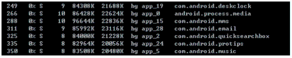

# Android 操作系统的内存回收机制
了解 Android 操作系统的内存回收机制

**标签:** 移动开发

[原文链接](https://developer.ibm.com/zh/articles/os-cn-android-mmry-rcycl/)

高松, 纪晨, 黄义春

发布: 2012-08-10

* * *

## Android APP 的运行环境

Android 是一款基于 Linux 内核，面向移动终端的操作系统。为适应其作为移动平台操作系统的特殊需要，谷歌对其做了特别的设计与优化，使得其进程调度与资源管理与其他平台的 Linux 有明显的区别。主要包含下面几个层次：

1. Application Framework

    Application Framework 将整个操作系统分隔成两个部分。对应用开发者而言，所有 APP 都是运行在 Application Framework 之上，而并不需要关心系统底层的情况。Application Framework 层为应用开发者提供了丰富的应用编程接口，如 Activity Manager，Content Provider，Notification Manager，以及各种窗口 Widget 资源等。在 Application Framework 层，Activity 是一个 APP 最基本的组成部分。一般每个 Activity 对应于屏幕上的一个视图（或者说一屏），一个 APP 可以有一个或者多个 Activity。应用程序被打包成 .apk 格式的文件，由 Dalvik VM 解释执行。

2. Dalvik VM

    Dalvik 虚拟机采用寄存器架构，而不是 JVM 的栈结构。Java 程序编译后的 .class 文件并不能在 Dalvik 中解释执行。因此 Google 提供了一个 dx 工具，用于将 .class 文件转换成 Dalivk 能够识别的 .dex 格式。具体 Dalvik VM 的细节不是本文重点，以下不再讨论。

3. Linux kernel

    由上所述，所有的 APP 都是由 Java 代码编写并在 Dalvik VM 中得到解释执行。在 Android 操作系统中，每个 Dalvik VM 的每个 Instance 都对应于 Linux 内核中的一个进程。可以使用 adb shell 工具查看系统中的当前进程。如下图所示，Android2.3.3 启动后内核中的进程列表。


##### 图 1\. Android 2.3 中的进程列表（部分）



图 1 中，UID 标识为 app\_xx 的每一项都是一个 app 所占用的进程，可见 Android 设计使得每个应用程序由一个独立的 Dalvik 实例解释执行，而每个 Linux 内核进程加载一个 Dalvik 实例，通过这种方式提供 app 的运行环境。如此，每个 APP 的资源被完全屏蔽，互不干扰。虽然同时引入了进程间通信的困难，但也带来了更强的安全性。

## Android 内存回收原则

下面将从 Application Framework 和 Linux kernel 两个层次分析 Android 操作系统的资源管理机制。

Android 之所以采用特殊的资源管理机制，原因在于其设计之初就是面向移动终端，所有可用的内存仅限于系统 RAM，必须针对这种限制设计相应的优化方案。当 Android 应用程序退出时，并不清理其所占用的内存，Linux 内核进程也相应的继续存在，所谓”退出但不关闭”。从而使得用户调用程序时能够在第一时间得到响应。当系统内存不足时，系统将激活内存回收过程。为了不因内存回收影响用户体验（如杀死当前的活动进程），Android 基于进程中运行的组件及其状态规定了默认的五个回收优先级：

IMPORTANCE\_FOREGROUND:

IMPORTANCE\_VISIBLE:

IMPORTANCE\_SERVICE:

IMPORTANCE\_BACKGROUND:

IMPORTANCE\_EMPTY:

这几种优先级的回收顺序是 Empty process、Background process、Service process、Visible process、Foreground process。关于划分原则参见 [http://developer.android.com/guide/topics/fundamentals/processes-and-threads.html](http://developer.android.com/guide/topics/fundamentals/processes-and-threads.html) 文件中。

ActivityManagerService 集中管理所有进程的内存资源分配。所有进程需要申请或释放内存之前必须调用 ActivityManagerService 对象，获得其”许可”之后才能进行下一步操作，或者 ActivityManagerService 将直接”代劳”。类 ActivityManagerService 中涉及到内存回收的几个重要的成员方法如下：trimApplications()，updateOomAdjLocked()，activityIdleInternal() 。这几个成员方法主要负责 Android 默认的内存回收机制，若 Linux 内核中的内存回收机制没有被禁用，则跳过默认回收。

## 默认回收过程

Android 操作系统中的内存回收可分为两个层次，即默认内存回收与内核级内存回收，本章重点对默认内存回收机制进行研究，Linux 内核层次的内存回收机制将在下一张介绍。 本章所有代码可参见 ActivityManagerService.java。

### 回收动作入口：activityIdleInternal()

Android 系统中内存回收的触发点大致可分为三种情况。第一，用户程序调用 StartActivity(), 使当前活动的 Activity 被覆盖；第二，用户按 back 键，退出当前应用程序；第三，启动一个新的应用程序。这些能够触发内存回收的事件最终调用的函数接口就是 activityIdleInternal()。当 ActivityManagerService 接收到异步消息 IDLE\_TIMEOUT\_MSG 或者 IDLE\_NOW\_MSG 时，activityIdleInternal() 将会被调用。代码如下：

##### 清单 1\. IDLE\_NOW\_MSG 的处理方式

```
case IDLE_NOW_MSG:{
IBinder token = (Ibinder)msg.obj;
    activityIdle(token, null);
}
break;

```

Show moreShow more icon

##### 清单 2\. IDLE\_TIMEOUT\_MSG 的处理方式

```
case IDLE_TIMEOUT_MSG: {
if (mDidDexOpt) {
        mDidDexOpt = false;
        Message nmsg = mHandler.obtainMessage(IDLE_TIMEOUT_MSG);
        nmsg.obj = msg.obj;
        mHandler.sendMessageDelayed(nmsg, IDLE_TIMEOUT);
        return;
    }
    IBinder token = (IBinder)msg.obj;
    Slog.w(TAG, "Activity idle timeout for " + token);
    activityIdleInternal(token, true, null);
}
break;

```

Show moreShow more icon

IDLE\_NOW\_MSG 由 Activity 的切换以及 Activiy 焦点的改变等事件引发，IDLE\_TIMEOUT\_MSG 在 Activity 启动超时的情况下引发，一般这个超时时间设为 10s，如果 10s 之内一个 Activity 依然没有成功启动，那么将发送异步消息 IDLE\_TIMEOUT\_MSG 进行资源回收。activityIdleInternal() 的主要任务是改变系统中 Activity 的状态信息，并将其添加到不同状态列表中。其主要工作如下：

首先，调用 scheduleAppGcsLocked() 方法通知所有进行中的任务进行垃圾回收。scheduleAppGcsLocked() 将进行调度 JVM 的 garbage collect，回收一部分内存空间，这里仅仅是通知每个进程自行进程垃圾检查并调度回收时间，而非同步回收。然后，取出 mStoppingActivities 和 mFinishigActivities 列表中的所有内容，暂存在临时变量中。这两个列表分别存储了当前状态为 stop 和 finishi 的 activity 对象。对于 stop 列表，如果其中的 activity 的 finish 状态为 true，判断是不是要立即停止，如果要立即停止则调用 destroyActivityLocked() 通知目标进程调用 onDestroy() 方法，否则，先调用 resumeTopActivity() 运行下一个 Activity。如果 finish 状态为 false，则调用 stopActivityLocked() 通知客户进程停止该 Activity，这种情况一般发生在调用 startActivity() 后。对于 finish 列表，直接调用 destroyActivityLocked() 通知客户进程销毁目标 Activity。

这里的 destroyActivityLocked 等函数并没有真正意义上改变内存的使用，只是将其状态改变为”允许回收”，真正的回收在下面即将调用的 trimApplications() 函数中。

### 回收过程函数 trimApplications()

trimApplications() 函数的结构如下 :

##### 清单 3\. trimApplications 函数

```
private final void trimApplications() {
synchronized (this) {
        // First remove any unused application processes whose package
        // has been removed.
        for (i=mRemovedProcesses.size()-1; i>=0; i--) {
           (1)//kill process;
        }
          if (!updateOomAdjLocked()) {
           (2)//do something default
        }
        // Finally, if there are too many activities now running, try to
        // finish as many as we can to get back down to the limit.
           (3)do something
    }
}

```

Show moreShow more icon

清单 3 中的三个标序号的位置分别负责如下工作：

1. 当程序执行到 trimApplications() 之后，首先检查 mRemovedProcesses 列表中的进程。mRemovedProcesses 列表中主要包含了 crash 的进程、5 秒内没有响应并被用户选在强制关闭的进程、以及应用开发这调用 killBackgroundProcess 想要杀死的进程。调用 Process.killProcess 将所有此类进程全部杀死。

2. 调用 updateOomAdjLocked() 函数，若成功返回，说明 Linux 内核支持 setOomAdj() 接口，updateOomAdjLocked 将修改 adj 的值并通知 linux 内核，内核根据 adj 值以及内存使用情况动态管理进程资源（lowmemorykiller 和 oom\_killer）。若 updateOomAdjLocked() 返回为假，则表示当前系统不支持 setOomAdj() 接口，将在本地进行默认的资源回收。

3. 最后，如果当前依然运行了过多的 Activity，对多余的 Activity 进行回收。 trimApplications() 的大多数的代码都在处理 Oom\_killer 不存在情况下的默认资源回收，下面对其默认回收过程（即代码清单中标记（2）的位置）进行进一步分析。其回收过程可大致描述如下。


步骤一，获取当前所有运行的进程 mLruProcesses，mLruProcesses 中的排序规则是按最近使用时间。对 mLruProcesses 中不能被关闭的进程进行计数，这些不能被关闭的进程包括运行 service 的进程，运行 broadcast receiver 的进程等，见如下代码。

##### 清单 4\. 计数不能被关闭的进程

```
if (app.persistent || app.services.size() != 0
            || app.curReceiver != null
            || app.persistentActivities > 0) {
// Don't count processes holding services against our
    // maximum process count.
        numServiceProcs++;
}

```

Show moreShow more icon

步骤二， 设当前最大运行进程数 curMaxProcs = curMaxProcs + numServiceProcs（即默认最大进程数与运行 Service 的进程数之和），如果当前进程的数量 mRemovedProcesses.size() 大于这个值，则遍历所有当前运行的进程，杀死符合条件的那些进程并释放内存。清理过程见清单 5（部分代码省略）。从清单 5 的代码中可以看出，进程被杀死的条件是：

- 必须是非 persistent 进程，即非系统进程；
- 必须是空进程，即进程中没有任何 activity 存在。如果杀死存在 Activity 的进程，有可能关闭用户正在使用的程序，或者使应用程序恢复的时延变大，从而影响用户体验；
- 必须无 broadcast receiver。运行 broadcast receiver 一般都在等待一个事件的发生，用户并不希望此类程序被系统强制关闭；
- 进程中 service 的数量必须为 0。存在 service 的进程很有可能在为一个或者多个程序提供某种服务，如 GPS 定位服务。杀死此类进程将使其他进程无法正常服务。

以上条件缺一不可。

##### 清单 5\. 清理过程

```
if (!app.persistent && app.activities.size() == 0
            && app.curReceiver == null && app.services.size() == 0) {
        if (app.pid > 0 && app.pid != MY_PID) {
            Process.killProcess(app.pid);
        } else {
            try {
                app.thread.scheduleExit();
            } catch (Exception e) {
                // Ignore exceptions.
            }
        }
        // todo: For now we assume the application is not buggy
        // or evil, and will quit as a result of our request.
        // Eventually we need to drive this off of the death
        // notification, and kill the process if it takes too long.
        cleanUpApplicationRecordLocked(app, false, i);
        i--;
}

```

Show moreShow more icon

步骤三，再次检查当前运行的进程，如果 mRemovedProcesses.size() 仍然大于 curMaxProcs，则放宽条件再次进行回收。判断条件见代码清单 6（部分代码省略）。下面代码中，布尔变量 canQuit 的值为真时，那么这个进程可以被回收。canQuit 的取值分两个步骤，首先是根据进程的属性赋值。 1. 必须是非 persistent 进程，即非系统进程；2. 必须无 broadcast receiver；3. 进程中 service 的数量必须为 0；4. persistent 类型的 activity 数量为 0。与步骤二唯一的不同在第 4 条，这里不要求进程是空进程，只要进程中没有 persistent 类型的 Activity 就可以（Activity 是否是 persistent 类型在开发阶段指定）。这些条件都满足时，再检查进程中每个 Activity 的属性，当该进程中所有的 Activity 都还必须满足三个条件：Activity 的状态已经保存，当前处在不可见状态并且 Activity 已经 Stop。这时杀掉进程只会降低下次调用程序时的加载速度，下次启动时将恢复到关闭之前的状态，并不会在用户体验上造成致命的影响，所以，canQuit 置位为真。这种情况与步骤二的回收方式也有所不同，由于进程中 Activity 的数量不是 0，下一步需要对每个 activity 执行 destroyActivityLocked() 销毁，最后才杀死进程。

##### 清单 6\. 执行 destroyActivityLocked() 销毁

```
boolean canQuit = !app.persistent && app.curReceiver == null
&& app.services.size() == 0
    && app.persistentActivities == 0;
int NUMA = app.activities.size();
for (j=0; j<NUMA && canQuit; j++) {
    HistoryRecord r = (HistoryRecord)app.activities.get(j);
    canQuit = (r.haveState || !r.stateNotNeeded)
            && !r.visible && r.stopped;
}
if (canQuit) {
    // Finish all of the activities, and then the app itself.
    for (j=0; j<NUMA; j++) {
        HistoryRecord r = (HistoryRecord)app.activities.get(j);
        if (!r.finishing) {
            destroyActivityLocked(r, false);
        }
        r.resultTo = null;
    }
    if (app.pid > 0 && app.pid != MY_PID) {
        Process.killProcess(app.pid);
    }
    cleanUpApplicationRecordLocked(app, false, i);
    i--;
    //dump();
}

```

Show moreShow more icon

步骤四，上面 3 个过程都是针对整个 process 进行的资源回收。在以上过程执行完毕之后，将在更小的粒度上对 Activity 的资源进行回收。与上面所述类似，列表 mLRUActivities 存储了当前所有运行中的 Activity，排序规则同样为最少访问原则。mLRUActivities.size() 返回系统中运行的 Activity 的数量，当其大于 MAX\_ACTIVITIES（MAX\_ACTIVITIES 是一个常量，一般值为 20，代表系统中最大允许同时存在的 Activity）时。将回收部分满足条件的 Activity 以减少内存的使用。回收条件代码清单 7 所示：

##### 清单 7\. 回收条件代码

```
//Finally, if there are too many activities now running, try to
// finish as many as we can to get back down to the limit.
for (   i=0;
        i<mLRUActivities.size()
            && mLRUActivities.size()  > curMaxActivities;
        i++) {
final HistoryRecord r
        = (HistoryRecord)mLRUActivities.get(i);

    // We can finish this one if we have its icicle saved and
    // it is not persistent.
    if ((r.haveState || !r.stateNotNeeded) && !r.visible
            && r.stopped && !r.persistent && !r.finishing) {
        final int origSize = mLRUActivities.size();
        destroyActivityLocked(r, true);
        if (origSize  > mLRUActivities.size()) {
            i--;
        }
    }
}

```

Show moreShow more icon

这里回收的只是 Activity 的内存资源，并不会杀死进程，也不会影响进程的运行。当进程需要调用被杀掉的 Activity 时，可以从保存的状态中回复，当然可能需要相对长一点的时延。

## Linux 内核中的内存回收

### lowmemorykiller

上面提到，trimApplications() 函数中会执行一个叫做 updateOomAdjLocked() 的函数，如果返回 false，则执行默认回收，若返回 true 则不执行默认内存回收。updateOomAdjLocked 将针对每一个进程更新一个名为 adj 的变量，并将其告知 Linux 内核，内核维护一个包含 adj 的数据结构（即进程表），并通过 lowmemorykiller 检查系统内存的使用情况，在内存不足的情况下杀死一些进程并释放内存。下面将对这种 Android Framework 与 Linux 内核相配合的内存回收机制进行研究。

由于 Android 操作系统中的所有应用程序都运行在独立的 Dalvik 虚拟机环境中，Linux 内核无法获知每个进程的运行状态，也就无法为每个进程维护一个合适的 adj 值，因此，Android Application Framework 中必须提供一套机制以动态的更新每个进程的 adj。这就是 updateOomAdjLocked()。

updateOomAdjLocked() 位于 ActivityManagerService 中，其主要作用是为进程选择一个合适的 adj 值，并通知 Linux 内核更新这个值。updateOomAdjLocked 首先调用 computeOomAdjLocked() 初步计算 adj 的值，然后回到 updateOomAdjLocked() 对其值进行进一步修正。估算流程可参见代码。

关于 adj，其定义在 task\_struct->signal\_struct->adj, 文件 /kernel/include/linux/sched.h 中。实质为进程数据结构中的一个变量，用来表示发生 Out of Memory 时杀死进程的优先级顺序。lowmemorykiller 利用这个变量对进程的重要程度进行判断，并在内存不足时释放部分空间，其实现在文件 /kernel/drivers/staging/android/lowmemorykiller.c 中。lowmemorykiller 定义了两个数组：lowmem\_adj 和 lowmem\_minfree。其中 lowmen\_adj 定义了一系列 adj 键值，而 lowmem\_minfree 的每个元素代表一个内存阈值。如下代码中四个阈值分别是 6MB，8MB，16MB 和 64MB，分别代表当内存小于 64MB 时，adj 大于或等于 12 的那些进程将被杀死并回收，内存小于 16MB 时，adj 大于等于 6 的那些进程将被杀死并回收，内存小于 8MB 时，adj 大于等于 1 的那些进程将被杀死并回收，内存小于 6MB 时，adj 大于等于 0 的所有进程将被杀死并回收。内核中的每个进程都持有一个 adj，取值范围 -17 到 15，值越小代表进程的重要性越高，回收优先级越低，其中 -17 代表禁用自动回收。Android 系统中，只有 0-15 被使用。

##### 清单 8\. 每个进程都持有一个 adj

```
static int lowmem_adj[6] = {
        0,
        1,
        6,
        12,
};
static int lowmem_adj_size = 4;
static size_t lowmem_minfree[6] = {
        3 * 512,      /* 6MB */
        2 * 1024,     /* 8MB */
        4 * 1024,     /* 16MB */
        16 * 1024,    /* 64MB */
};
static int lowmem_minfree_size = 4;

```

Show moreShow more icon

lowmemorykiller 注册一个 lowmem\_shrinker，lowmem\_shrinker 利用了标准 Linux 内核中的 Cache Shrinker 来实现，当空闲内存页面不足时，内核线程 kswapd 将用已注册的 lowmem\_shrinker 来回收内存页面。

##### 清单 9\. 用已注册的 lowmem\_shrinker 来回收内存页面

```
static struct shrinker lowmem_shrinker = {
                    .shrink = lowmem_shrink,
        .seeks = DEFAULT_SEEKS * 16
};

static int __init lowmem_init(void)
{
        task_free_register(&task_nb);
        register_shrinker(&lowmem_shrinker);
        return 0;
}

```

Show moreShow more icon

lowmem\_shrink 的代码在函数 lowmem\_shrink 中，下面给出该函数的主要结构。lowmem\_shrink 根据上述规则遍历所有进程，选出需要结束的进程，通过发送一个无法忽略的信号 SIGKILL 强制结束这些进程

##### 清单 10\. 强制结束进程

```
static int lowmem_shrink(struct shrinker *s, int nr_to_scan, gfp_t gfp_mask)
{
        for_each_process(p) {
           //Select processes to be forced
        }
        if (selected) {
               force_sig(SIGKILL, selected);
               rem -= selected_tasksize;
        } else
        rem = -1;
        return rem;
}

```

Show moreShow more icon

### Oom\_killer.

如果上述各种方法都无法释放出足够的内存空间，那么当为新的进程分配应用程序时将发生 Out of Memory 异常，OOM\_killer 将尽最后的努力杀掉一些进程来释放空间。Android 中的 OOM\_killer 继承自标准 Linux 2.6 内核，用于分配内存时 Out of Memory 的处理。Android 并没有对其实现方式进行修改。其位置在 linux/mm/oom\_kill.c。 oom\_killer 遍历进程，并计算所有进程的 badness 值，选择 badness 最大的那个进程将其杀掉。函数 badness 的声明如下：

unsigned long badness(struct task\_struct \*p, unsigned long uptime) 函数 select\_bad\_process 返回将要杀掉的那个进程。

##### 清单 11\. 返回将要杀掉的进程

```
static struct task_struct *select_bad_process(unsigned long *ppoints,
                                            struct mem_cgroup *mem)
{
        for_each_process(p) {
               points = badness(p, uptime.tv_sec);
               if (points > *ppoints || !chosen) {
                       chosen = p;
                       *ppoints = points;
               }
        }
        return chosen;
}

```

Show moreShow more icon

最后，和 lowmemorykiller 一样，通过发送 SIGKILL 结束选中的进程。由于 oom\_killer 与标准 Linux 内核并无不同，这里不再详细研究。

## 结束语

本文研究了 Android 操作系统上的内存回收机制。主要包括 Application Framework 层的默认回收以及 Linux 内核中的 lowmemorykiller、OOM\_killer。一般来说应用开发者并不需要控制或者修改系统的内存管理以及回收，但是深入理解这些系统级的管理机制还是必要的，尤其有助于更加合理地设计应用程序，使应用程序的进程在其生命周期内高效地运行。而系统级开发者如果想要对内存管理机制进行优化，对原有机制的理解则是必不可少的重要前提。