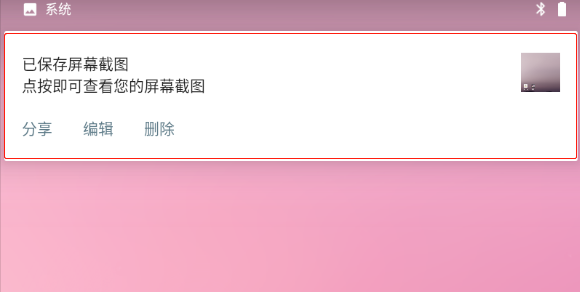
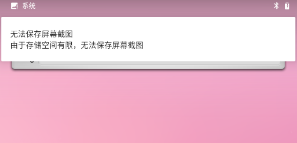

# Android 系统截屏事件流程
Android 手机如何实现截屏操作

**标签:** Android,移动开发

[原文链接](https://developer.ibm.com/zh/articles/os-android-screen-capture-event-flow/)

刘 治才

发布: 2019-09-23

* * *

## 前言

Android 手机系统中的截屏功能是大家经常用到的一项功能，使用截屏功能能便捷且快速地把手机当前屏幕显示的信息，以图片的方式保存在手机中以便我们日后的查阅，这大大方便了需要我们在很短的时间记忆屏幕中的显示信息。

使用过 Android 手机系统截屏功能的人都知道，截屏操作一般有两种途径:

- 下拉手机屏幕上方状态栏点击快捷功能面板中的截屏（部分手机品牌中支持此功能）。
- 同时按住手机侧方的电源键+音量减键来实现截屏。

第一种途径的部分功能不是 Google 的 Android 系统自带功能，由各个手机品牌商主开发添加的功能项，而各个手机品牌对此项功能的实现源码，我们是无法获取的，故无法就此操作实现原理展开讲解，但可以肯定第一种途径与第二种途径的截屏实现最后都是调用了系统的同一个实现原理，只是他们的截屏触发不同而已，所以本文只针对第二种途径的实现以源码解析的方式进行讲解，使用的 Android 源码版本是 8.0.0。

## 截屏事件中涉及到的知识点

该事件中涉及的 Android 知识点并不多，但为更清晰的了解事件完整过程，在此简要说明以下两个具有代表性的重要知识点。

### Messenger 与 Service 进程间的双向通信

Messenger 在 Service 中的双向通信过程可以简单分为下面三个步骤:

1. 首先由客户端通过 `bindService` 方式启动服务端的 Service，服务端 Service 执行其自身生命周期并在 `onBind` 回调方法中获取 Service 自身 Messenger 所对应的 `IBinder` ，并再将其发送客户端。
2. IBinder 对象会传入客户端 `ServiceConnection` 对象的 `onServiceConnected` 回调方法中，然后用得到远程 Messenger 对象（服务端内的 Messenger）给服务端发送消息，因此远程 Messenger 对象内部有指向服务端的 handler, 所以服务端 handler 在得到消息后会在自身的 `handleMessage` 方法中处理消息，其中包括获取客户端的 Messenger 对象。
3. 在服务端处理完事务后，会用客户端 Messenger 对象在客户端发送反馈消息。

### 异步线程处理耗时操作

Android 中多线程的实现有多种方式，截屏的实现过程中用到了其中 AsyncTask 与 Runnable 接口两种方法。

- AsyncTask 是 Android 已封装好了一个轻量级异步类，它是对 Handler 与线程池的封装后的抽象类，在使用的时候必须实现它，且必须实现其中的 `onPreExecute()` ， `doInBackground()` ， `onPostExecute()` 这三个方法，AsyncTask 的用作主要是可以将耗时的工作移出应用的主线程（也叫 UI 线程），并将处理结果返回给 UI 线程更新界面
- 实现 Runnable 接口创建多线程是 Java 编程语言中常用的方法，即实现此接口并创建该实例的对象，在此不多解释。

## 截屏功能实现的流程

Android 截屏流程先是按手机物理按键触发截屏功能请求，在 `system_Server` 进程中对物理按键的判断请求条件其是否满足截屏要求，如满足后则设置截屏方式是全屏或区域屏幕截屏，再调用 SystemUI 应用进一步判断屏截请求条件，并初始化一些前置准备工作，通过 JNI 获取截屏图片成功后，最后保存图片并用通知提示用户保存是否异常等工作。下面将按此事件的时间顺序分步讲解 Android 截屏事件。

### 截屏按键处理

手机截屏功能如何被触发，Android 系统又是如何实现截屏功能以及截屏图片的保存等，带着这些疑问开始我们 Android 源码的遨游。

在 Android 中一般会有 Back（返回）、Home（主键）、Menu（菜单）、Power（电源键）、-Volume（音量减）、+ Volume（音量加）等物理按键或虚拟按键，而 Android 系统中对各类物理与虚拟按键的处理都是在 Framework 层中的 `PhoneWindowManager.java` 内实现，如需对部分按键实现特定功能即可在 PhoneWindowManager.interceptKeyBeforeQueueing 方法内中客制功能。该 `PhoneWindowManager` 运行于 `system_server` 进程中属系统进程，而非某一个 APP 进程中。

##### 清单 1\. 对电源键的处理

```
case KeyEvent.KEYCODE_POWER: {//匹配电源键
     // Any activity on the power button stops the accessibility shortcut
cancelPendingAccessibilityShortcutAction();
     result &= ~ACTION_PASS_TO_USER;
isWakeKey = false; // wake-up will be handled separately
     if (down) {//当电源键被按下状态时
interceptPowerKeyDown(event, interactive);
      } else {
interceptPowerKeyUp(event, interactive, canceled);
      }
      break;
}

```

Show moreShow more icon

清单 1 代码为 Power 键被按下时触发，这里只看 `down` 部分代码，进入 `interceptPowerKeyDown` 方法中，将 Power 键的触发状态属性赋值 `true` ，然后获取 Power 触发的时间。

##### 清单 2\. interceptPowerKeyDown 方法体

```
private void interceptPowerKeyDown(KeyEvent event, boolean interactive) {
//....省略部分代码
// Latch power key state to detect screenshot chord.
        if (interactive && !mScreenshotChordPowerKeyTriggered
&& (event.getFlags() &KeyEvent.FLAG_FALLBACK) == 0) {
mScreenshotChordPowerKeyTriggered = true;              //Power 键被触发的标示符
mScreenshotChordPowerKeyTime = event.getDownTime();   //获取 Power 键的触发时间
interceptScreenshotChord();
        }
}

```

Show moreShow more icon

接着进入 `interceptScreenshotChord ()` 方法中。

##### 清单 3\. interceptScreenshotChord 方法实现

```
private void interceptScreenshotChord() {
        if (mScreenshotChordEnabled  //系统是否开启截屏功能
&&mScreenshotChordVolumeDownKeyTriggered  //音量减键已被按下
&&mScreenshotChordPowerKeyTriggered  //电源减键已被按下
&& !mA11yShortcutChordVolumeUpKeyTriggered) { //音量减键未被按下
               final long now = SystemClock.uptimeMillis();  //获取当前的时间
                //当前时间要小于或等于音量减键被按下时间+150S
               if (now < = mScreenshotChordVolumeDownKeyTime + SCREENSHOT_CHORD_DEBOUNCE_DELAY_MILLIS
// 当前时间要小于或等于电源键被按下时间+150S
&& now < = mScreenshotChordPowerKeyTime + SCREENSHOT_CHORD_DEBOUNCE_DELAY_MILLIS) {
mScreenshotChordVolumeDownKeyConsumed = true;
cancelPendingPowerKeyAction();
                mScreenshotRunnable.setScreenshotType(TAKE_SCREENSHOT_FULLSCREEN);
mHandler.postDelayed(mScreenshotRunnable, getScreenshotChordLongPressDelay());
            }
        }
    }

```

Show moreShow more icon

在 `interceptScreenshotChord` 方法中有一个 `mScreenshotChordVolumeDownKeyTriggered` 变量，我们来看看此变量是在何处何时赋值为 `true` 。

##### 清单 4\. 音量键按键的处理

```
if (keyCode == KeyEvent.KEYCODE_VOLUME_DOWN) {
     if (down) {//VOLOME_DOWN 状态为按下状态
         if (interactive & &  !mScreenshotChordVolumeDownKeyTriggered
& &  (event.getFlags() & KeyEvent.FLAG_FALLBACK) == 0) {
mScreenshotChordVolumeDownKeyTriggered = true;//音量减键被触发的标示符
mScreenshotChordVolumeDownKeyTime = event.getDownTime();
mScreenshotChordVolumeDownKeyConsumed = false;
cancelPendingPowerKeyAction();
interceptScreenshotChord();
interceptAccessibilityShortcutChord();
           }
     } else {
mScreenshotChordVolumeDownKeyTriggered = false;
cancelPendingScreenshotChordAction();
cancelPendingAccessibilityShortcutAction();
}

```

Show moreShow more icon

对比清单 4 与清单 2 代码可以发现两处代码实现基本一致，都有获取操作时间，给状态变量赋值和执行 `interceptScreenshotChord` 方法，而在 `interceptScreenshotChord` 方法中判断属性 `mScreenshotChordVolumeDownKeyTriggered` 与 `mScreenshotChordPowerKeyTriggered` 都必须为 `true` 才满足执行条件，就是说两个按键状态必须已被触发，且音量加键的触发状态为 `false` ，接着是获取当前的时间并判断它是否小于或等于两键触发时间加系统规格的延时时间 150 秒，这些条件满足后将 `mScreenshotChordVolumeDownKeyConsumed` 赋值 `false` ，该属性为了防止截屏的时候音量下键生效出现调节音量的 dialog 状态值，再执行防止触发 Power 键长按功能，最后延时开启截屏线程 `ScreenshotRunnable` ，且设置截屏方式是全屏截取。

### 设置截屏的方式

我们来看看 `ScreenshotRunnable` 线程，该线程较为简单，只是一个设置截屏方式的方法与 `run` 方法，截屏方式分 **全屏截屏** 与 **区域性截屏** ，系统默认为全屏截屏，如要区域性截屏则需要在构建该线程对象时指定截屏方式。

##### 清单 5\. ScreenshotRunnable 线程实现

```
private class ScreenshotRunnable implements Runnable {
        private int mScreenshotType = TAKE_SCREENSHOT_FULLSCREEN;//默认截屏方式是全屏截取
        public void setScreenshotType(int screenshotType) {
mScreenshotType = screenshotType;
        }
        @Override
        public void run() {
takeScreenshot(mScreenshotType);//执行 takeScreenshot 方法
        }
    }

```

Show moreShow more icon

在 `ScreenshotRunnable` 线程的 `run` 方法中就一条执行语句，从形参的字意大概可以看出此方法指定截屏方式。我们继续看 `takeScreenshot` 方法。

##### 清单 6\. takeScreenshot 方法体

```
private void takeScreenshot(final int screenshotType) {
        synchronized (mScreenshotLock) {
            if (mScreenshotConnection != null) {
                return;
            }
            final ComponentNameserviceComponent = new ComponentName(SYSUI_PACKAGE,
                    SYSUI_SCREENSHOT_SERVICE);
            final Intent serviceIntent = new Intent();
serviceIntent.setComponent(serviceComponent);
ServiceConnection conn = new ServiceConnection() {
           //....省略部分代码
           if (mContext.bindServiceAsUser(serviceIntent, conn,
Context.BIND_AUTO_CREATE | Context.BIND_FOREGROUND_SERVICE_WHILE_AWAKE,
UserHandle.CURRENT)) {
mScreenshotConnection = conn;
mHandler.postDelayed(mScreenshotTimeout, 10000);
            }
}

```

Show moreShow more icon

先看 `SYSUI_PACKAGE, SYSUI_SCREENSHOT_SERVICE` 两属性的定义：

- `private static final String SYSUI_PACKAGE = "com.android.systemui";`
- `private static final String SYSUI_SCREENSHOT_SERVICE = "com.android.systemui.screenshot.TakeScreenshotService";`

后面又有执行 `bindServiceAsUser` 方法，它与 `bindService` 两者都在 `ContextImpl` 类中定义，且他们方法内部都是调用同样的 `bindServiceCommon` 方法，区别就是两方法的参数个数不同，前者是系统内部隐藏方法，非 SDK 开发 API 接口。

##### 清单 7\. Context 类中 bindService 与 bindServiceAsUser 两方法的实现

```
    @Override
    public booleanbindService(Intent service, ServiceConnection conn,
            int flags) {
warnIfCallingFromSystemProcess();
        return bindServiceCommon(service, conn, flags, mMainThread.getHandler(), getUser());
    }

    /** @hide */
    @Override
    public booleanbindServiceAsUser(Intent service, ServiceConnection conn, int flags,
UserHandle user) {
        return bindServiceCommon(service, conn, flags, mMainThread.getHandler(), user);
    }

```

Show moreShow more icon

您可能已经熟悉 `bindService` 的使用， `bindService` 是 Android 启动 Servicer 方式之一，使用 `bindService` 则表明调用者和绑定者绑在一起，调用者一旦退出也就终止服务了，且 `bindService` 能跨进程启动另一个 APP 应用中的 Service，在之前定义的 `serviceComponent` 中的 `TakeScreenshotService` ，该 Service 是定义在 SystemUI 模块(状态栏应用)中，运行在 SystemUI 进程内。而 `PhoneWindowManager` 是运行在 `System_server` 进程中的，两者是运行在不同的进程中.而在 Android 系统中其已为我们提供了多种跨进程通信的方式，其中 IPC 是较常用的一种跨进程通信方式，如我们常用的 AIDL 就是 IPC 通信方式，在清单 7 的实现中用到的 Messenger 也是 IPC 通信方式（参见前文” [Messenger 与 Service 进程间的双向通信](#messenger-与-service-进程间的双向通信)“）。

##### 清单 8\. mHandr 中对截屏范围参数处理

```
msg.replyTo = new Messenger(h);
msg.arg1 = msg.arg2 = 0;
if (mStatusBar != null & & mStatusBar.isVisibleLw())
       msg.arg1 = 1; //截屏范围状态栏
if (mNavigationBar != null & & mNavigationBar.isVisibleLw())
      msg.arg2 = 1;  //截屏范围导航栏
try {
messenger.send(msg);
    } catch (RemoteException e) {
}

```

Show moreShow more icon

启动 Service 连接成功后对 Message 的 `replyTo` ， `arg1` ， `arg2` 参数赋值，并通过 Messenger 实现跨进程的通信。

### 响应截屏请求

至此我们已进入了 `TakeScreenshotService` 类中，它是 Service 的子类，在此 Service 中通过 IPC 跨进程通信方式响应截屏请求。

##### 清单 9\. TakeScreenshotService 返回 Ibinder 对象

```
@Override
    public IBinderonBind(Intent intent) {
        return new Messenger(mHandler).getBinder(); //返回 IBinder 对象给客户端
    }

```

Show moreShow more icon

在返回给客户端的 Ibinger 对象内部有指向服务端的 handler, 所以服务端 handler 会接收来自客户端的消息，

##### 清单 10\. TakeScreenshotService 中 mHandler 的构建

```
private Handler mHandler = new Handler() {
        @Override
        public void handleMessage(Message msg) {
            final Messenger callback = msg.replyTo;//获取客户端传过来的 Messenger 对象
            Runnable finisher = new Runnable() {
                @Override
                public void run() {
                    Message reply = Message.obtain(null, 1);
                    try {
    //Messenger 双向通信，在服务端用远程客户端的 Messenger 对象给客户端发送信息
callback.send(reply);
                    } catch (RemoteException e) {
                    }
                }
            };

            // If the storage for this user is locked, we have no place to store
            // the screenshot, so skip taking it instead of showing a misleading
            // animation and error notification.
            //判断用户是否已解锁设备。
            if (!getSystemService(UserManager.class).isUserUnlocked()) {
Log.w(TAG, "Skipping screenshot because storage is locked!");
                post(finisher);
                return;
            }

            if (mScreenshot == null) {
mScreenshot = new GlobalScreenshot(TakeScreenshotService.this);
            }
    //根据信息类型匹配执行不同的任务，
            switch (msg.what) {
                case WindowManager.TAKE_SCREENSHOT_FULLSCREEN://全屏截屏
mScreenshot.takeScreenshot(finisher, msg.arg1 > 0, msg.arg2 > 0);
                    break;
                case WindowManager.TAKE_SCREENSHOT_SELECTED_REGION://屏幕区域性截屏
mScreenshot.takeScreenshotPartial(finisher, msg.arg1 > 0, msg.arg2 > 0);
                    break;
                default:
Log.d(TAG, "Invalid screenshot option: " + msg.what);
            }
        }
    }

```

Show moreShow more icon

上面的代码中的 `finisher` 是截屏之后的回调，谁发起的截屏就在截屏完成之后运行此 Runnable 接口的匿名实现，通过 Messenger 向截屏发起者发送消息。

我们再进 `GlobalScreenshot` 类，在 `GlobalScreenshot.java` 文件中的可以看到该类有多个内部类，其中 `SaveImageInBackgroundTask` 为 `AsyncTask` 的继承子类，是为截屏新创建的一个异步处理线程，清单 11 开始处定义大量的动画常量属性值，不一一介绍。

##### 清单 11\. GlobalScreenshot

```
private static final int SCREENSHOT_FLASH_TO_PEAK_DURATION = 130;
private static final int SCREENSHOT_DROP_IN_DURATION = 430;
private static final int SCREENSHOT_DROP_OUT_DELAY = 500;
private static final int SCREENSHOT_DROP_OUT_DURATION = 430;
private static final int SCREENSHOT_DROP_OUT_SCALE_DURATION = 370;
private static final int SCREENSHOT_FAST_DROP_OUT_DURATION = 320;
private static final float BACKGROUND_ALPHA = 0.5f;
private static final float SCREENSHOT_SCALE = 1f;
// 预览图的宽和高
private final int mPreviewWidth;
private final int mPreviewHeight;
// 异步保存截图的 AsyncTask
private AsyncTask清单 12.GlobalScreenshot 的构造方法Void, Void, Void>mSaveInBgTask;
// 截屏时发出模拟快门的声音
private MediaActionSoundmCameraSound;
// 截屏的屏幕动画
private AnimatorSetmScreenshotAnimation;
// 截图的 Bitmap
private Bitmap mScreenBitmap;

```

Show moreShow more icon

我们接着看构造方法中又实现了哪些功能。

##### 清单 12\. GlobalScreenshot 的构造方法

```
//载加截屏布局文件
mScreenshotLayout = layoutInflater.inflate(R.layout.global_screenshot, null);
mScreenshotLayout.setOnTouchListener(new View.OnTouchListener() {
            @Override
            public booleanonTouch(View v, MotionEvent event) {
                //拦截和消耗掉所有触摸事件，
                return true;
            }
        });
    //截屏后通知图标的大小
mNotificationIconSize =
r.getDimensionPixelSize(android.R.dimen.notification_large_icon_height);

    // 截屏背景的边距
mBgPadding = (float) r.getDimensionPixelSize(R.dimen.global_screenshot_bg_padding);
mBgPaddingScale = mBgPadding / mDisplayMetrics.widthPixels;
    // 加载截屏时发出的声音
mCameraSound = new MediaActionSound();
mCameraSound.load(MediaActionSound.SHUTTER_CLICK);

```

Show moreShow more icon

## 获取截屏图片及保存

前文我们一起查看了截屏动作前的条件初始化，接着我们来看一下系统如何截屏并保存截屏后的图片，这里以全屏截屏方式为讲解示例，我们先看如何获取截屏图片:

##### 清单 13\. 系统获取截屏图片的实现方法

```
// GlobalScreenshot::takeScreenshot
//省略部分代码...
//执行 SurfaceControl.screenshot 方法并返回截屏图片，
mScreenBitmap = SurfaceControl.screenshot(crop, width, height, rot);
if (mScreenBitmap == null) {
notifyScreenshotError(mContext, mNotificationManager,
R.string.screenshot_failed_to_capture_text);
finisher.run();
      return;
}

//接着再进入 SurfaceControl::screenshot 方法中
public static void screenshot(IBinder display, Surface consumer,int width, int height) {
       //执行 screenshot 方法
screenshot(display, consumer, new Rect(), width, height, 0, 0, true, false);
}

// SurfaceControl::screenshot 重截方法，
@UnsupportedAppUsage
private static void screenshot(IBinder display, Surface consumer, RectsourceCrop,
            int width, int height, int minLayer, int maxLayer, booleanallLayers,
booleanuseIdentityTransform) {
if (display == null) {
       throw new IllegalArgumentException("displayToken must not be null");
}
if (consumer == null) {
       throw new IllegalArgumentException("consumer must not be null");
}
nativeScreenshot(display, consumer, sourceCrop, width, height,
minLayer, maxLayer, allLayers, useIdentityTransform);
}
//  一步步跟进执行方法，最后到 SurfaceControl 的本地方法 nativeScreenshot
private static native void nativeScreenshot(IBinderdisplayToken, Surface consumer,
RectsourceCrop, int width, int height, int minLayer, int maxLayer,
booleanallLayers, booleanuseIdentityTransform);

```

Show moreShow more icon

跟进 `SurfaceControl.screenshot(..)` 会发现此方法的返回是通过一个本地方法 `nativeScreenshot` 获取截屏图片，也就是说其截图的实现的通过 JNI 由底层来实现的，并不是在 Java 层实现的，至于 native 层具体的实现这里

再细究，您只需要知道 Java 层传了截屏的截屏区域、宽、高、旋转的度数。如果未成功获取图片 `mScreentBitmap==null` 则直接 notify 错误信息，再运行 Messenger 跨进程通信将截屏结果告诉截屏请求者；如果成功获取截屏图片，则其会开始截屏播放截屏声明与动画，在动画的结尾处调用了 `saveScreenshotInWorkerThread（` 来保存截图。

##### 清单 14\. 截屏成功的动画配置

```
//构建动画
ValueAnimatorscreenshotDropInAnim = createScreenshotDropInAnimation();
ValueAnimatorscreenshotFadeOutAnim = createScreenshotDropOutAnimation(w, h,
statusBarVisible, navBarVisible);
mScreenshotAnimation = new AnimatorSet();
      //整合动画
mScreenshotAnimation.playSequentially(screenshotDropInAnim, screenshotFadeOutAnim);
       //添加截屏动画的监听事件
mScreenshotAnimation.addListener(new AnimatorListenerAdapter() {
            @Override
            public void onAnimationEnd(Animator animation) {
saveScreenshotInWorkerThread(finisher); //在异步线程中保存截屏图片
mScreenBitmap = null;//保存图片文件后清除释放截屏位图
                //省略部分代码
            }
        });
mScreenshotLayout.post(new Runnable() {
            @Override
            public void run() {
                // Play the shutter sound to notify that we've taken a screenshot
mCameraSound.play(MediaActionSound.SHUTTER_CLICK);//播放截屏快门声音
mScreenshotView.setLayerType(View.LAYER_TYPE_HARDWARE, null);
mScreenshotView.buildLayer();
mScreenshotAnimation.start();//开始播放动画
            }
        });

```

Show moreShow more icon

接着会进入异步线程来执行保存截图。在 `saveScreenshotInWorkerThread` 方法中首先获取 `SaveImageInBackgroundData` 对象，并对其属性变量赋值，从此类名可以看出它是截屏图片的参数信息类。

##### 清单 15\. saveScreenshotInWorkerThread 方法

```
private void saveScreenshotInWorkerThread(Runnable finisher) {
SaveImageInBackgroundData data = new SaveImageInBackgroundData();
data.context = mContext;
data.image = mScreenBitmap;//native 层返回的截屏位图
data.iconSize = mNotificationIconSize;//系统提示中 icon 尺寸
data.finisher = finisher;
data.previewWidth = mPreviewWidth;//图片预览宽
data.previewheight = mPreviewHeight;//图片预览高
        if (mSaveInBgTask != null) {
mSaveInBgTask.cancel(false);
        }
mSaveInBgTask = new SaveImageInBackgroundTask(mContext, data, mNotificationManager).execute();//执行异步线程
}

```

Show moreShow more icon

`SaveImageInBackgroundTask` 是 AsyncTask 的子类，用来处理耗时工作的异步任务类，先来看该类的构造方法功能实现。

##### 清单 16\. SaveImageInBackgroundTask 构造方法

```
//省略部分代码
mImageTime = System.currentTimeMillis();//截屏时间戳
String imageDate = new SimpleDateFormat("yyyyMMdd-HHmmss").format(new Date(mImageTime));//转换时间格式
mImageFileName = String.format(SCREENSHOT_FILE_NAME_TEMPLATE, imageDate);// 图片的文件名称
mScreenshotDir = new File(Environment.getExternalStoragePublicDirectory(
Environment.DIRECTORY_PICTURES), SCREENSHOTS_DIR_NAME);//保存图片的文件目录名称
mImageFilePath = new File(mScreenshotDir, mImageFileName).getAbsolutePath();//保存图片的路径
mImageWidth = data.image.getWidth();//图片宽
mImageHeight = data.image.getHeight();//图片高
i//省略部分代码

```

Show moreShow more icon

构造方法中大量此类变量的赋值，包括截屏图片参数、系统提示正在生成图片 notification 等，在此不一一说明。

按 AsyncTask 类的执行顺序在构造方法执行之后会进入到此类 `SaveImageInBackgroundTask` 的 `doInBackground()` 方法中，该方法主要用于保存图片到本地及生成具有分享、删除、编辑的 Intent 意图操作的提示 notification。

##### 清单 17\. doInBackground 方法

```
//创建图片保存文件目录
mScreenshotDir.mkdirs();
//应用输出流 FileOutputStream 把数据流写入本地文件。
OutputStream out = new FileOutputStream(mImageFilePath);
image.compress(Bitmap.CompressFormat.PNG, 100, out);
out.flush();
out.close();
// 将图片信息以 Uri 方式保存入系统媒体库
ContentValues values = new ContentValues();
ContentResolver resolver = context.getContentResolver();
values.put(MediaStore.Images.ImageColumns.DATA, mImageFilePath);
values.put(MediaStore.Images.ImageColumns.TITLE, mImageFileName);
values.put(MediaStore.Images.ImageColumns.DISPLAY_NAME, mImageFileName);
values.put(MediaStore.Images.ImageColumns.DATE_TAKEN, mImageTime);
values.put(MediaStore.Images.ImageColumns.DATE_ADDED, dateSeconds);
values.put(MediaStore.Images.ImageColumns.DATE_MODIFIED, dateSeconds);
values.put(MediaStore.Images.ImageColumns.MIME_TYPE, "image/png");
values.put(MediaStore.Images.ImageColumns.WIDTH, mImageWidth);
values.put(MediaStore.Images.ImageColumns.HEIGHT, mImageHeight);
values.put(MediaStore.Images.ImageColumns.SIZE, new File(mImageFilePath).length());
Uri uri = resolver.insert(MediaStore.Images.Media.EXTERNAL_CONTENT_URI, values);

```

Show moreShow more icon

##### 清单 18\. 创建删除 PendingIntent

```
PendingIntentdeleteAction = PendingIntent.getBroadcast(context, 0,
new Intent(context, GlobalScreenshot.DeleteScreenshotReceiver.class)
.putExtra(GlobalScreenshot.SCREENSHOT_URI_ID, uri.toString()),
PendingIntent.FLAG_CANCEL_CURRENT | PendingIntent.FLAG_ONE_SHOT);

```

Show moreShow more icon

##### 清单 19\. 创建分享 PendingIntent

```
PendingIntentshareAction = PendingIntent.getBroadcast(context, 0,
      new Intent(context, GlobalScreenshot.ScreenshotActionReceiver.class)
.putExtra(SHARING_INTENT, sharingIntent),
PendingIntent.FLAG_CANCEL_CURRENT);

```

Show moreShow more icon

##### 清单 20\. 创建编辑 PengdingIntent

```
PendingIntenteditAction = PendingIntent.getBroadcast(context, 1,
      new Intent(context, GlobalScreenshot.ScreenshotActionReceiver.class)
.putExtra(SHARING_INTENT, editIntent),
PendingIntent.FLAG_CANCEL_CURRENT);

```

Show moreShow more icon

如果截屏图保存成功则会对属性 `mParams.errorMsgResId` 赋值为 `0` ；如果保存失败则对属性 `mParams.errorMsgResId` 赋值为失败提示语资源 ID 值。在 `doInBackground` 方法中任务执行完成后需要将执行结果反馈给主线程，以便主线程更新相应界面，此工作就需要在 AsyncTask 的 `onPostExecute` 方法完成，此时进入该方法截屏图片保存到本地的结果已明确，所以就先对图片保存结果做判断，并对不同结果弹出相应的提示通知 notification，最后执行 finisher 的 `run` 方法向客户端反馈截屏结果。

##### 清单 21\. onPostExecute 方法

```
if (mParams.errorMsgResId != 0) {
// 存储截屏图片失败，弹出通知提示用户
GlobalScreenshot.notifyScreenshotError(mParams.context, mNotificationManager,
mParams.errorMsgResId);
} else {

//创建图片浏览Intent
Intent launchIntent = new Intent(Intent.ACTION_VIEW);
launchIntent.setDataAndType(mParams.imageUri, "image/png");
launchIntent.setFlags(
Intent.FLAG_ACTIVITY_NEW_TASK | Intent.FLAG_GRANT_READ_URI_PERMISSION);
//.....省略后面代码

//弹出之都创建的notification,
mNotificationManager.notify(SystemMessage.NOTE_GLOBAL_SCREENSHOT,
NotificationBuilder.build());
}
//最后运行finisher实例的run方法向截屏请求者返回操作结果
mParams.finisher.run();
mParams.clearContext();
}

```

Show moreShow more icon

实现效果如图 1 和图 2，两个图片均由平板系统上截取。

##### 图 1\. 截屏成功后的系统提示



##### 图 2\. 截屏失败后的系统提示



此至 Android 手机的截屏事件的全过程已分析完毕。

## 源码文件

本文涉及文件的 Android 源码文件路径如下：

- **`TakeScreenshotService.java` 文件路径**:

    `aosp\frameworks\base\packages\SystemUI\src\com\android\systemui\screenshot\ TakeScreenshotService.java`

- **`GlobalScreenshot.java` 文件路径:**

    `aosp\frameworks\base\packages\SystemUI\src\com\android\systemui\screenshot\ GlobalScreenshot.java`

- **`ScreenshotServiceErrorReceiver.java` 文件路径:**

    `aosp\frameworks\base\packages\SystemUI\src\com\android\systemui\screenshot\ ScreenshotServiceErrorReceiver.java`

- **`PhoneWindowManager.java` 文件路径:**

    `aosp\frameworks\base\services\core\java\com\android\server\policy\PhoneWindowManager.java`


未下载的 Android 源码的可通过 [此网站](https://www.androidos.net.cn/sourcecode) 查询对应文件。

## 结束语

通过本文希望大家能大概了解 Android 手机截屏的实现流程以及截屏操作保存图片和对应的提示消息其背后的实现原理。而截屏的整个事件中涉及到对物理按键，跨进程能信，多线程工作，提示通知等知识点，大家可以自行展开进一步学习。