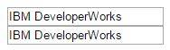
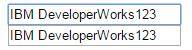
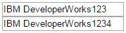

# AngularJS 作用域与数据绑定机制
了解 AngularJS 作用域与数据绑定机制

**标签:** Web 开发

[原文链接](https://developer.ibm.com/zh/articles/os-cn-angularjs/)

朱 盛浩, 盛 浩, 宋 剑飞

发布: 2015-04-22

* * *

## AngularJS 简介

AngularJS 是由 Google 发起的一款开源的前端 MVC 脚本框架，既适合做普通 WEB 应用也可以做 SPA（单页面应用，所有的用户操作都在一个页面中完成）。与同为 MVC 框架的 Dojo 的定位不同，AngularJS 在功能上更加轻量，而相比于 jQuery，AngularJS 又帮您省去了许多机械的绑定工作。在一些对开发速度要求高，功能模块不需要太丰富的非企业级 WEB 应用上，AngularJS 是一个非常好的选择。AngularJS 最为复杂同时也是最强大的部分就是它的数据绑定机制，这个机制帮助我们能更好的将注意力集中在数据的模型建立和传递上，而不是对底层的 DOM 进行低级的操作。

## AngularJS 作用域

基于 jQuery 的传统 WEB 应用中，为了监听用户的输入等行为，需要为每一个 DOM 元素设置一个监听方法，也即是监听 DOM 上发生的各类事件，然后由 jQuery 做出回应并展示在页面上。这种方法简便直观，但是一旦 WEB 应用变得庞大而且复杂，那么监听代码就显得非常的机械而且冗余，更可怕的是，如果对于 DOM 的事件监听没有做好管理，那么很容易出现浏览器资源的泄露。

针对以上所暴露的问题，AngularJS 用一系列指令来代替 jQuery 的事件绑定代码。为了能够组织好各类指令之间的协调工作而不出现数据混乱，AngularJS 在模型层上引申出作用域的概念，以配合控制器来实现对视图层的展现工作。

### 作用域（Scope）

AngularJS 中，作用域是一个指向应用模型的对象，它是表达式的执行环境。作用域有层次结构，这个层次和相应的 DOM 几乎是一样的。作用域能监控表达式和传递事件。

在 HTML 代码中，一旦一个 ng-app 指令被定义，那么一个作用域就产生了，由 ng-app 所生成的作用域比较特殊，它是一个根作用域（$rootScope），它是其他所有$Scope 的最顶层。

##### 清单 1\. 生成根作用域

```
<html>
<head><script src="angular.min.js"></script></head>
<body data-ng-app="app">...</body>
</html>

```

Show moreShow more icon

除了用 ng-app 指令可以产生一个作用域之外，其他的指令如 ng-controller，ng-repeat 等都会产生一个或者多个作用域。此外，还可以通过 AngularJS 提供的创建作用域的工厂方法来创建一个作用域。这些作用域都拥有自己的继承上下文，并且根作用域都为$rootScope。

在生成一个作用域之后，在编写 AngularJS 代码时，$scope 对象就代表了这个作用域的数据实体，我们可以在$scope 内定义各种数据类型，之后可以直接在 HTML 中以 {{变量名}} 方式来让 HTML 访问到这个变量，代码如下：

##### 清单 2\. 简单的数据绑定

```
<script>
angular.module('app', [])
.controller("ctrl", function ($scope) {
$scope.btns = {
ibm : 'ibm'
};
});
</script>
</head>
<body data-ng-app="app" >
<div data-ng-controller="ctrl">
<button>{{btns.ibm}}</button>
</div>
</body>

```

Show moreShow more icon

这就是 AngularJS 中最简单的数据绑定方式，同时也是应用最为广泛的数据绑定方式。

### 继承作用域（Inherited Scope）

AngularJS 在创建一个作用域时，会检索上下文，如果上下文中已经存在一个作用域，那么这个新创建的作用域就会以 JavaScript 原型继承机制继承其父作用域的属性和方法（有个例外是孤立作用域，下文讨论）。

一些 AngularJS 指令会创建新的子作用域，并且进行原型继承： ng-repeat、ng-include、ng-switch、ng-view、ng-controller, 用 scope: true 和 transclude: true 创建的 directive。

以下 HTML 中定义了三个作用域，分别是由 ng-app 指令所创建的$rootScope，parentCtrl 和 childCtrl 所创建的子作用域，这其中 childCtrl 生成的作用域又是 parentCtrl 的子作用域。

##### 清单 3\. 作用域的继承实例

```
<body data-ng-app="app">
<div data-ng-controller="parentCtrl">
<input data-ng-model="args">
<div data-ng-controller="childCtrl">
<input data-ng-model="args">
</div>
</div>
</body>

```

Show moreShow more icon

继承作用域符合 JavaScript 的原型继承机制，这意味着如果我们在子作用域中访问一个父作用域中定义的属性，JavaScript 首先在子作用域中寻找该属性，没找到再从原型链上的父作用域中寻找，如果还没找到会再往上一级原型链的父作用域寻找。在 AngularJS 中，作用域原型链的顶端是$rootScope，AnguarJS 将会寻找到$rootScope 为止，如果还是找不到，则会返回 undefined。

我们用实例代码说明下这个机制。首先，我们探讨下对于原型数据类型的作用域继承机制：

##### 清单 4\. 作用域继承实例-原始类型数据继承

```
<script type="text/javascript">
angular.module('app', [])
.controller('parentCtrl', ['$scope', function($scope) {
$scope.args = 'IBM DeveloperWorks';
}])
.controller('childCtrl', ['$scope', function($scope) {
}]);
</script>
<body data-ng-app="app">
<div data-ng-controller="parentCtrl">
<input data-ng-model="args">
<div data-ng-controller="childCtrl">
<input data-ng-model="args">
</div>
</div>
</body>

```

Show moreShow more icon

运行页面，我们得到以下的结果：

##### 图 1\. 页面运行结果。



这个结果我们非常好理解，虽然在 childCtrl 中没有定义具体的 args 属性，但是因为 childCtrl 的作用域继承自 parentCtrl 的作用域，因此，AngularJS 会找到父作用域中的 args 属性并设置到输入框中。而且，如果我们在第一个输入框中改变内容，内容将会同步的反应到第二个输入框：

##### 图 2\. 改变第一个输入框的内容后页面运行结果



假如我们修改第二个输入框的内容，此时会发生什么事情呢？答案是第二个输入框的内容从此将不再和第一个输入框的内容保持同步。在改变第二个输入框的内容时，因为 HTML 代码中 model 明确绑定在 childCtrl 的作用域中，因此 AngularJS 会为 childCtrl 生成一个 args 原始类型属性。这样，根据 AngularJS 作用域继承原型机制，childCtrl 在自己的作用域找得到 args 这个属性，从而也不再会去寻找 parentCtrl 的 args 属性。从此，两个输入框的内容所绑定的属性已经是两份不同的实例，因此不会再保持同步。

##### 图 3\. 改变第二个输入框的内容后页面运行结果



假如我们将代码做如下修改，结合以上两个场景，思考下会出现怎样的结果？

##### 清单 5\. 作用域继承实例-对象数据继承

```
<script type="text/javascript">
angular.module('app', [])
.controller('parentCtrl', ['$scope', function($scope) {
$scope.args = {};
$scope.args.content = 'IBM DeveloperWorks';
}])
.controller('childCtrl', ['$scope', function($scope) {
}]);
</script>
<body data-ng-app="app">
<div data-ng-controller="parentCtrl">
<input data-ng-model="args.content">
<div data-ng-controller="childCtrl">
<input data-ng-model="args.content">
</div>
</div>
</body>

```

Show moreShow more icon

答案是无论改变任何一个输入框的内容，两者的内容始终同步。

根据 AngularJS 的原型继承机制，如果 ng-model 绑定的是一个对象数据，那么 AngularJS 将不会为 childCtrl 创建一个 args 的对象，自然也不会有 args.content 属性。这样，childCtrl 作用域中将始终不会存在 args.content 属性，只能从父作用域中寻找，也即是两个输入框的的变化其实只是在改变 parentCtrl 作用域中的 args.content 属性。因此，两者的内容始终保持同步。

我们再看一个例子，这次请读者自行分析结果。

##### 清单 6\. 作用域继承实例-不再访问父作用域的数据对象。

```
<script type="text/javascript">
angular.module('app', [])
.controller('parentCtrl', ['$scope', function($scope) {
$scope.args = {};
$scope.args.content = 'IBM DeveloperWorks';
}])
.controller('childCtrl', ['$scope', function($scope) {
$scope.args = {};
$scope.args.content = 'IBM DeveloperWorks';
}]);
</script>
<body data-ng-app="app">
<div data-ng-controller="parentCtrl">
<input data-ng-model="args.content">
<div data-ng-controller="childCtrl">
<input data-ng-model="args.content">
</div>
</div>
</body>

```

Show moreShow more icon

答案是两个输入框的内容永远不会同步。

### 孤立作用域（Isolate Scope）

孤立作用域是 AngularJS 中一个非常特殊的作用域，它只在 directive 中出现。在对 directive 的定义中，我们添加上一个 scope:{} 属性，就为这个 directive 创建出了一个隔离作用域。

##### 清单 7\. directive 创建出一个孤立作用域

```
angular.module('isolate', []).directive("isolate", function () {
return {
scope : {},
};
})

```

Show moreShow more icon

孤立作用域最大的特点是不会原型继承其父作用域，对外界的父作用域保持相对的独立。因此，如果在定义了孤立作用域的 AngularJS directive 中想要访问其父作用域的属性，则得到的值为 undefined。代码如下：

##### 清单 8\. 孤立作用域的隔离性

```
<script type="text/javascript">
angular.module('app', [])
.controller('ctrl', ['$scope', function($scope) {
$scope.args = {};
}])
.directive("isolateDirective", function () {
return {
scope : {},
link : function($scope, $element, $attr) {
console.log($scope.$args); //输出 undefined
}
};
});
</script>
<body data-ng-app="app">
<div data-ng-controller="ctrl">
<div data-isolate-directive></div>
</div>
</body>

```

Show moreShow more icon

上面的代码中通过在 directive 中声明了 scope 属性从而创建了一个作用域，其父作用域为 ctrl 所属的作用域。但是，这个作用域是孤立的，因此，它访问不到父作用域的中的任何属性。存在这样设计机制的好处是：能够创建出一些列可复用的 directive，这些 directive 不会相互在拥有的属性值上产生串扰，也不会产生任何副作用。

## AngularJS 孤立作用域的数据绑定

在继承作用域中，我们可以选择子作用域直接操作父作用域数据来实现父子作用域的通信，而在孤立作用域中，子作用域不能直接访问和修改父作用域的属性和值。为了能够使孤立作用域也能和外界通信，AngularJS 提供了三种方式用来打破孤立作用域”孤立”这一限制。

### 单向绑定（@ 或者 @attr）

这是 AngularJS 孤立作用域与外界父作用域进行数据通信中最简单的一种，绑定的对象只能是父作用域中的字符串值，并且为单向只读引用，无法对父作用域中的字符串值进行修改，此外，这个字符串还必须在父作用域的 HTML 节点中以 attr（属性）的方式声明。

使用这种绑定方式时，需要在 directive 的 scope 属性中明确指定引用父作用域中的 HTML 字符串属性，否则会抛异常。示例代码如下：

##### 清单 9\. 单向绑定示例

```
<script>
angular.module('isolateScope', [])
.directive("isolateDirective", function () {
return {
replace : true,
template: '<button>{{isolates}}</button>',
scope : {
isolates : '@',
},
link : function($scope, $element, $attr) {
$scope.isolates = "DeveloperWorks";
}
};
})
.controller("ctrl", function ($scope) {
$scope.btns = 'IBM';
});
</script>
<body data-ng-app="isolateScope" >
<div data-ng-controller="ctrl">
<button>{{btns}}</button>
<div data-isolate-directive data-isolates="{{btns}}"></div>
</div>
</body>

```

Show moreShow more icon

简单分析下上面的代码，通过在 directive 中声明了 scope:{isolates:’@’} 使得 directive 拥有了父作用域中 data-isolates 这个 HTML 属性所拥有的值，这个值在控制器 ctrl 中被赋值为’IBM’。所以，代码的运行结果是页面上有两个名为 IBM 的按钮。

我们还注意到 link 函数中对 isolates 进行了修改，但是最终不会在运行结果中体现。这是因为 isolates 始终绑定为父作用域中的 btns 字符串，如果父作用域中的 btns 不改变，那么在孤立作用域中无论怎么修改 isolates 都不会起作用。

### 引用绑定（&或者&attr）

通过这种形式的绑定，孤立作用域将有能力访问到父作用域中的函数对象，从而能够执行父作用域中的函数来获取某些结果。这种方式的绑定跟单向绑定一样，只能以只读的方式访问父作用函数，并且这个函数的定义必须写在父作用域 HTML 中的 attr（属性）节点上。

这种方式的绑定虽然无法修改父作用域的 attr 所设定的函数对象，但是却可以通过执行函数来改变父作用域中某些属性的值，来达到一些预期的效果。示例代码如下：

##### 清单 10\. 引用绑定示例

```
<script>
angular.module('isolateScope', [])
.directive("isolateDirective", function () {
return {
replace : true,
scope : {
isolates : '&',
},
link : function($scope, $element, $attr) {
var func = $scope.isolates();
func();
}
};
})
.controller("ctrl", function ($scope) {
$scope.func = function () {
console.log("IBM DeveloperWorks");
}
});
</script>
<body data-ng-app="isolateScope" >
<div data-ng-controller="ctrl">
<div data-isolate-directive data-isolates="func"></div>
</div>
</body>

```

Show moreShow more icon

这个例子中，浏览器的控制台将会输出一段 “IBM DeveloperWorks” 文字。

上面的代码中我们在父作用域中指定了一个函数对象$scope.func，在孤立作用域中通过对 HTML 属性的绑定从而引用了 func。需要注意的是 link 函数中对 func 对象的使用方法，$scope.isolates 获得的仅仅是函数对象，而不是调用这个对象，因此我们需要在调用完 $scope.isolates 之后再调用这个函数，才能得到真正的执行结果。

### 双向绑定（=或者=attr）

双向绑定赋予 AngularJS 孤立作用域与外界最为自由的双向数据通信功能。在双向绑定模式下，孤立作用域能够直接读写父作用域中的属性和数据。和以上两种孤立作用域定义数据绑定一样，双向绑定也必须在父作用域的 HTML 中设定属性节点来绑定。

双向绑定非常适用于一些子 directive 需要频繁和父作用域进行数据交互，并且数据比较复杂的场景。不过，由于可以自由的读写父作用域中的属性和对象，所以在一些多个 directive 共享父作用域数据的场景下需要小心使用，很容易引起数据上的混乱。

示例代码如下：

##### 清单 11\. 双向绑定示例

```
<script>
angular.module('isolateScope', [])
.directive("isolateDirective", function () {
return {
replace : true,
template: '<button>{{isolates}}</button>',
scope : {
isolates : '=',
},
link : function($scope, $element, $attr) {
$scope.isolates.ibm = "IBM";
}
};
})
.controller("ctrl", function ($scope) {
$scope.btns = {
ibm : 'ibm',
dw : 'DeveloperWorks'
};
});
</script>
<body data-ng-app="isolateScope" >
<div data-ng-controller="ctrl">
<button>{{btns.dw}}</button>
<button>{{btns.ibm}}</button>
<div data-isolate-directive data-isolates="btns"></div>
</div>
</body>

```

Show moreShow more icon

上面的代码运行的结果是浏览器页面上出现三个按钮，其中第一个按钮标题为 “DeveloperWorks”，第二和第三个按钮的标题为 “IBM”。

初始时父作用域中的 $scope.btns.ibm 为小写的 “ibm”，通过双向绑定，孤立作用域中将父作用域的 ibm 改写成为大写的 “IBM” 并且直接生效，父作用域的值被更改。

## 结束语

由于 AngularJS 框架的轻量性和其清晰的 MVC 特点使得其在推出之后就大受欢迎，实践中也很容易上手。AngularJS 比较难以掌握和理解的就是其作用域和绑定机制，本文重点将作用域和绑定机制做了分析与讨论，希望读者能够理解并熟练掌握这块内容。