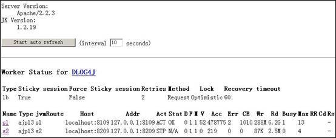
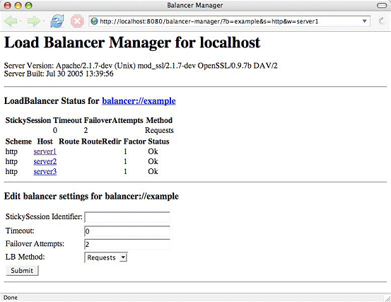

# Apache HTTP Server 与 Tomcat 的三种连接方式介绍
提升对静态文件的处理性能、利用 Web 服务器来做负载均衡以及容错、无缝的升级应用程序

**标签:** Web 开发

[原文链接](https://developer.ibm.com/zh/articles/os-lo-apache-tomcat/)

刘冬

发布: 2007-01-15

* * *

首先我们先介绍一下为什么要让 Apache 与 Tomcat 之间进行连接。事实上 Tomcat 本身已经提供了 HTTP 服务，该服务默认的端口是 8080，装好 tomcat 后通过 8080 端口可以直接使用 Tomcat 所运行的应用程序，你也可以将该端口改为 80。

既然 Tomcat 本身已经可以提供这样的服务，我们为什么还要引入 Apache 或者其他的一些专门的 HTTP 服务器呢？原因有下面几个：

1. 提升对静态文件的处理性能
2. 利用 Web 服务器来做负载均衡以及容错
3. 无缝的升级应用程序

这三点对一个 web 网站来说是非常之重要的，我们希望我们的网站不仅是速度快，而且要稳定，不能因为某个 Tomcat 宕机或者是升级程序导致用户访问不了，而能完成这几个功能的、最好的 HTTP 服务器也就只有 apache 的 http server 了，它跟 tomcat 的结合是最紧密和可靠的。

接下来我们介绍三种方法将 apache 和 tomcat 整合在一起。

## JK

这是最常见的方式，你可以在网上找到很多关于配置JK的网页，当然最全的还是其官方所提供的文档。JK 本身有两个版本分别是 1 和 2，目前 1 最新的版本是 1.2.19，而版本 2 早已经废弃了，以后不再有新版本的推出了，所以建议你采用版本 1。

JK 是通过 AJP 协议与 Tomcat 服务器进行通讯的，Tomcat 默认的 AJP Connector 的端口是 8009。JK 本身提供了一个监控以及管理的页面 jkstatus，通过 jkstatus 可以监控 JK 目前的工作状态以及对到 tomcat 的连接进行设置，如下图所示：

##### 图 1\. 监控以及管理的页面 jkstatus



在这个图中我们可以看到当前JK配了两个连接分别到 8109 和 8209 端口上，目前 s2 这个连接是停止状态，而 s1 这个连接自上次重启后已经处理了 47 万多个请求，流量达到 6.2 个 G，最大的并发数有 13 等等。我们也可以利用 jkstatus 的管理功能来切换 JK 到不同的 Tomcat 上，例如将 s2 启用，并停用 s1，这个在更新应用程序的时候非常有用，而且整个切换过程对用户来说是透明的，也就达到了无缝升级的目的。关于 JK 的配置文章网上已经非常多了，这里我们不再详细的介绍整个配置过程，但我要讲一下配置的思路，只要明白了配置的思路，JK 就是一个非常灵活的组件。

JK 的配置最关键的有三个文件，分别是

- **httpd.conf**

    Apache 服务器的配置文件，用来加载 JK 模块以及指定 JK 配置文件信息

- **workers.properties**

    到 Tomcat 服务器的连接定义文件

- **uriworkermap.properties**

    URI 映射文件，用来指定哪些 URL 由 Tomcat 处理，你也可以直接在 httpd.conf 中配置这些 URI，但是独立这些配置的好处是 JK 模块会定期更新该文件的内容，使得我们修改配置的时候无需重新启动 Apache 服务器。


其中第二、三个配置文件名都可以自定义。下面是一个典型的 httpd.conf 对 JK 的配置

```
# (httpd.conf)
# 加载 mod_jk 模块
LoadModule jk_module modules/mod_jk.so

#
# Configure mod_jk
#

JkWorkersFile conf/workers.properties
JkMountFile conf/uriworkermap.properties
JkLogFile logs/mod_jk.log
JkLogLevel warn

```

Show moreShow more icon

接下来我们在 Apache 的 conf 目录下新建两个文件分别是 workers.properties、uriworkermap.properties。这两个文件的内容大概如下

```
#
# workers.properties
#

# list the workers by name

worker.list=DLOG4J, status

# localhost server 1
# ------------------------
worker.s1.port=8109
worker.s1.host=localhost
worker.s1.type=ajp13

# localhost server 2
# ------------------------
worker.s2.port=8209
worker.s2.host=localhost
worker.s2.type=ajp13
worker.s2.stopped=1

worker.DLOG4J.type=lb
worker.retries=3
worker.DLOG4J.balanced_workers=s1, s2
worker.DLOG4J.sticky_session=1

worker.status.type=status

```

Show moreShow more icon

以上的 workers.properties 配置就是我们前面那个屏幕抓图的页面所用的配置。首先我们配置了两个类型为 ajp13 的 worker 分别是 s1 和 s2，它们指向同一台服务器上运行在两个不同端口 8109 和 8209 的 Tomcat 上。接下来我们配置了一个类型为 lb（也就是负载均衡的意思）的 worker，它的名字是 DLOG4J，这是一个逻辑的 worker，它用来管理前面配置的两个物理连接 s1 和 s2。最后还配置了一个类型为 status 的 worker，这是用来监控 JK 本身的模块。有了这三个 worker 还不够，我们还需要告诉 JK，哪些 worker 是可用的，所以就有 **worker.list = DLOG4J, status** 这行配置。

接下来便是 URI 的映射配置了，我们需要指定哪些链接是由 Tomcat 处理的，哪些是由 Apache 直接处理的，看看下面这个文件你就能明白其中配置的意义

```
/*=DLOG4J
/jkstatus=status

!/*.gif=DLOG4J
!/*.jpg=DLOG4J
!/*.png=DLOG4J
!/*.css=DLOG4J
!/*.js=DLOG4J
!/*.htm=DLOG4J
!/*.html=DLOG4J

```

Show moreShow more icon

相信你已经明白了一大半了：所有的请求都由 DLOG4J 这个 worker 进行处理，但是有几个例外，/jkstatus 请求由 status 这个 worker 处理。另外这个配置中每一行数据前面的感叹号是什么意思呢？感叹号表示接下来的 URI 不要由 JK 进行处理，也就是 Apache 直接处理所有的图片、css 文件、js 文件以及静态 html 文本文件。

通过对 workers.properties 和 uriworkermap.properties 的配置，可以有各种各样的组合来满足我们前面提出对一个 web 网站的要求。您不妨动手试试！

## http\_proxy

这是利用 Apache 自带的 mod\_proxy 模块使用代理技术来连接 Tomcat。在配置之前请确保是否使用的是 2.2.x 版本的 Apache 服务器。因为 2.2.x 版本对这个模块进行了重写，大大的增强了其功能和稳定性。

http\_proxy 模式是基于 HTTP 协议的代理，因此它要求 Tomcat 必须提供 HTTP 服务，也就是说必须启用 Tomcat 的 HTTP Connector。一个最简单的配置如下

```
ProxyPass /images !
ProxyPass /css !
ProxyPass /js !
ProxyPass / http://localhost:8080/

```

Show moreShow more icon

在这个配置中，我们把所有 [http://localhost](http://localhost) 的请求代理到 [http://localhost:8080/](http://localhost:8080/) ，这也就是 Tomcat 的访问地址，除了 images、css、js 几个目录除外。我们同样可以利用 mod\_proxy 来做负载均衡，再看看下面这个配置

```
ProxyPass /images !
ProxyPass /css !
ProxyPass /js !

ProxyPass / balancer://example/
<Proxy balancer://example/>
BalancerMember http://server1:8080/
BalancerMember http://server2:8080/
BalancerMember http://server3:8080/
</Proxy>

```

Show moreShow more icon

配置比 JK 简单多了，而且它也可以通过一个页面来监控集群运行的状态，并做一些简单的维护设置。

##### 图 2\. 监控集群运行状态



## ajp\_proxy

ajp\_proxy 连接方式其实跟 http\_proxy 方式一样，都是由 mod\_proxy 所提供的功能。配置也是一样，只需要把 http:// 换成 ajp:// ，同时连接的是 Tomcat 的 AJP Connector 所在的端口。上面例子的配置可以改为：

```
ProxyPass /images !
ProxyPass /css !
ProxyPass /js !

ProxyPass / balancer://example/
<Proxy balancer://example/>
BalancerMember ajp://server1:8080/
BalancerMember ajp://server2:8080/
BalancerMember ajp://server3:8080/
</Proxy>

```

Show moreShow more icon

采用 proxy 的连接方式，需要在 Apache 上加载所需的模块，mod\_proxy 相关的模块有 mod\_proxy.so、mod\_proxy\_connect.so、mod\_proxy\_http.so、mod\_proxy\_ftp.so、mod\_proxy\_ajp.so， 其中 mod\_proxy\_ajp.so 只在 Apache 2.2.x 中才有。如果是采用 http\_proxy 方式则需要加载 mod\_proxy.so 和 mod\_proxy\_http.so；如果是 ajp\_proxy 则需要加载 mod\_proxy.so 和 mod\_proxy\_ajp.so这两个模块。

## 三者比较

相对于 JK 的连接方式，后两种在配置上是比较简单的，灵活性方面也一点都不逊色。但就稳定性而言就不像 JK 这样久经考验，毕竟 Apache 2.2.3 推出的时间并不长，采用这种连接方式的网站还不多，因此，如果是应用于关键的互联网网站，还是建议采用 JK 的连接方式。