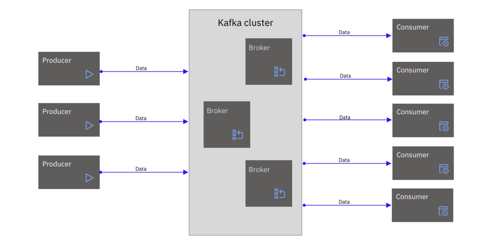

# Apache Kafka 简介
了解用于实时数据流的开源软件平台

**标签:** Apache Kafka,IBM Event Streams,消息传递

[原文链接](https://developer.ibm.com/zh/articles/an-introduction-to-apache-kafka/)

Gabor Tangelmayer, Kate Stanley, Bernard Kufluk

发布: 2020-06-17

* * *

Apache Kafka 是一个事件流软件平台，可用于处理实时数据流。它基于发布-订阅消息传递模型，旨在实现容错、可扩展、高吞吐量和低延迟。Kafka 最初是 LinkedIn 中的一个项目，后来为了促进企业采用而开源。它是用 Scala 和 Java 编写的，是开源 [Apache 软件基金会](https://kafka.apache.org/) 的一部分。

处理任何数据类型（日志、事件等）并要求传输数据的任何应用程序都可以受益于 Kafka。

如果您的数据由多个系统生成，并且您需要将这些数据快速传送到其他系统，那么 Kafka 非常适合。如果您需要处理大量数据并需要实时处理以使这些数据可供其他人使用，那么 Kafka 这一解决方案尤其能够满足您的需求。

## 发布-订阅消息传递

发布-订阅消息传递意味着生成数据的系统（生产者或发布者）不是直接将数据发送给接收方（消费者或订阅者），而是将数据发送到 Kafka（称为 _代理_）。

通过将发布和消费步骤分离，发布者可以使其数据可用，而不需要知道其他人将如何使用（消费）数据。例如，发布者发布了一个用于表示对预订系统的更改的数据流。消费者可以立即订阅并使用该信息来更新另一个预订系统中的记录。稍后，另一个消费者可以订阅相同的数据，并使用该信息向客户提供警报，而无需与发布者有任何进一步的交互。

## Kafka 架构

Kafka 作为一个或多个 Kafka 代理的集群来运行。数据将写入到 Kafka，并按顺序存储在分区中，这样就可以直接由消费者读取。

##### Apache Kafka 高级别概述

在发布-订阅消息传递模型的基础上，Kafka 通过在代理之间复制数据来提供内置的快速恢复能力，因此即使在一个 Kafka 集群中，也有高可用性和容错性。此外，您还可以将 Kafka 设置配置为分布式，这将针对故障提供进一步的防护。

Kafka 将维护事件的历史记录，允许消费者回到某个给定的记录或时间点，并重放截至最近事件的各个事件。这一事件历史记录通常用于分析系统，其中用户可以根据自己的日程安排来重放数据并构建数据的新视图，与数据创建时间无关。

可扩展性也是一个重要的特性，可以让您动态扩展 Kafka 以提高性能。例如，您可以在正常操作期间根据需要添加或删除代理，从而扩大或缩小您的 Kafka 集群，而不需要进行任何中断。

## 后续步骤

对 Apache Kafka 有一个基本理解后，现在您已经准备好深入了解 [其工作原理（YouTube 视频）](https://developer.ibm.com/videos/an-introduction-to-apache-kafka/) 以及您可以使用 Kafka 的各种方式。

本文翻译自： [What is Apache Kafka?](https://developer.ibm.com/articles/an-introduction-to-apache-kafka/) （2020-04-09）