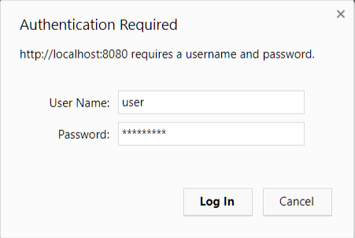
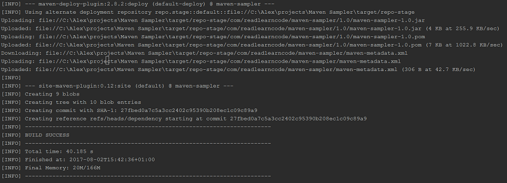
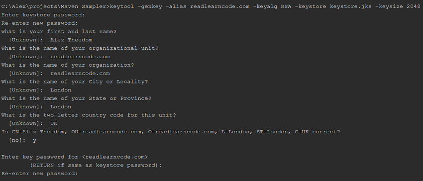

# Apache Maven 插件
掌握现代 Maven 插件的技巧

**标签:** Java

[原文链接](https://developer.ibm.com/zh/articles/j-5things16/)

Alex Theedom

发布: 2017-10-18

* * *

## 您是否知道 Maven？

Maven 是一个面向 Java™ 开发人员的领先的依赖管理和构建工具，而且名副其实！它通过阐述项目的构造来标准化软件构建流程，将它部署为应用程序，然后与其他项目共享它。

**关于本系列**

您觉得自己了解 Java 编程？事实是，大多数开发人员只是了解 Java 平台的皮毛，所学知识也仅够应付工作。在这个 [连载系列](https://developer.ibm.com/zh/series/5-things-you-didnt-know-about/) 中，Java 技术侦探们将深度挖掘 Java 平台的核心功能，揭示一些可帮助您解决最棘手的编程挑战的技巧和诀窍。

Maven 采用了一组可靠的插件来提供它的所有功能。在 Maven 中，插件拥有 _目标_ ，在幕后，该目标就是 Java 方法。目标执行构建任务，比如编译项目，打包它，并将它部署到本地或远程服务器。这些活动可完美地映射到构建生命周期的各个阶段。

Maven 提供了自己的构建插件，这些插件已打包且可立即使用，而且预先配置了默认值。通过”约定高于配置”原则，可以确保能够针对给定任务的复杂性来扩展配置。大部分构建任务都只需极少的配置。

您还可以自定义 Maven 插件的行为。使用 Maven 的 `<configuration>` 元素，很容易重写插件默认值并定义新值。毫无疑问，大部分重写的默认值是 [compiler 插件](https://maven.apache.org/plugins/maven-compiler-plugin/) 的 `<source>` 和 `<target>` 值。

需要证据？您有多少次将清单 1 中的 XML 添加到 POM 中，以设置正确的 JVM 版本？

##### 清单 1.compiler 插件中的 Java 版本配置

```
<plugin>
<groupId>org.apache.maven.plugins</groupId>
<artifactId>maven-compiler-plugin</artifactId>
<version>3.6.1</version>
<configuration>
       <source>1.8</source>
       <target>1.8</target>
</configuration>
</plugin>

```

Show moreShow more icon

## 执行 Maven 生命周期

每个插件目标都映射到一个 Maven [生命周期阶段](https://maven.apache.org/guides/introduction/introduction-to-the-lifecycle.html) 。发出 `mvn compile` 命令会告诉 `mvn` 实用程序调用绑定到 `compile` 生命周期阶段的所有目标。 `compiler` 插件的 `compile` 目标被绑定到这个生命周期阶段。

阶段与目标之间是一对多的关系。多个插件目标可以绑定到同一个阶段，以形成相关任务集合。阶段也是分层的，这意味着执行一个阶段会导致执行它 [前面的所有阶段](http://maven.apache.org/ref/3.5.0/maven-core/lifecycles.html) 。

在本例中，发出 `mvn compile` 命令会启动 `validate` 阶段（Maven 的 [默认构建生命周期](https://maven.apache.org/guides/introduction/introduction-to-the-lifecycle.html) 的第一个阶段），并调用绑定到该阶段的所有目标。

[Maven](http://maven.apache.org/plugins/) 和 [Google Code](https://code.google.com/archive/search?q=maven%20plugin) 网站维护着一个 Maven 插件列表。这些插件提供了各种各样有用且省时的功能，您可以将它们整合到构建流程中。我将介绍我发现的一些最有用的插件，并展示如何最充分地利用它们。

## 1.对 JAR 或 WAR 执行数字签名

单击下面的按钮，下载本示例的代码。它包含一个简单的应用程序和一个包含已配置好的 `Jarsigner` 插件的 POM 文件。

[获得代码](https://github.com/atheedom/MavenSampler/tree/jarsigner)

对 JAR 或 WAR 执行数字签名是一项重要任务，尤其是在您想分发您的应用程序的时候。幸运的是，Java 平台提供了一个名为 [jarsigner](http://docs.oracle.com/javase/8/docs/technotes/tools/windows/jarsigner.html) 的存档签名实用程序。它是一个命令行工具，可通过向它传递存档文件的位置和各种参数（比如包含您的加密密钥的密钥库）对存档文件执行签名。

可以在 JDK 安装的 `<%JAVA_HOME%>/bin` 目录中找到 `jarsigner` 。清单 2 展示了如何使用此实用程序对 JAR 执行签名。

##### 清单 2\. 使用 jarsigner 实用程序对存档文件执行签名

```
jarsigner
    -keystore /path/to/keystore.jks
    -storepass <password>
    -keypass <key password>
    YourArchive.jar
    alias

```

Show moreShow more icon

`jarsigner` 是一个易于使用的命令行工具，而且开箱即用。 如果能自动化签名流程，在构建周期的 `package` 阶段对存档文件执行签名岂不是更好？ 得益于包含 `jarsigner` 实用程序的 [Maven Jarsigner 插件](http://maven.apache.org/plugins/maven-jarsigner-plugin/) ，您可以实现此目标。您只需要将该插件的 `sign` 目标绑定到您的构建周期的 `package` 阶段。

首先需要一个密钥库。如果没有，可以使用 Java 平台的 [keytool](https://docs.oracle.com/javase/8/docs/technotes/tools/windows/keytool.html) 实用程序创建它，该实用程序可在 JDK 安装的 `<%JAVA_HOME%>/bin` 目录中找到。

### 创建一个密钥库

要创建一个密钥库，请导航到您想要放置它的位置并执行清单 3 中的命令。一定要将 `KeyAlias` 替换为合适的值，比如您的域名。 [官方 Oracle 文档](https://docs.oracle.com/javase/8/docs/technotes/tools/windows/keytool.html) 详细介绍了该工具接受的更多配置选项。

##### 清单 3\. 为 jarsigner 实用程序创建一个密钥库

```
keytool -genkey -alias <KeyAlias> -keyalg RSA -keystore keystore.jks -keysize 2048

```

Show moreShow more icon

创建密钥库的过程要求您回答一系列有关您自己和您的组织的问题，并提供一个安全密码。配置 Maven Jarsigner 插件时（接下来就会这么做）将需要此密码。

### 将 Jarsigner 添加到您的构建流程中

现在将 Maven Jarsigner 插件添加到您的构建生命周期中，然后配置它来对 `package` 阶段中生成的 JAR 执行数字签名。关联到此阶段是合理的，因为已构造 JAR 并将它存储在您项目的默认输出目录中，该目录通常是 `target` 目录。在 POM 文件的 `<plugins>` 部分，添加清单 4 中所示的代码。

##### 清单 4\. 添加 Jarsigner 插件

```
<plugin>
<groupId>org.apache.maven.plugins</groupId>
<artifactId>maven-jarsigner-plugin</artifactId>
<version>1.4</version>
</plugin>

```

Show moreShow more icon

您想要在构建 JAR 后对它执行签名，所以需要将签名过程（包装在 `sign` 目标中）连接到 `package` 生命周期阶段。为此，请将清单 5 中的代码添加到该插件中。

##### 清单 5\. 将 sign 目标连接到 package 阶段

```
<executions>
    <execution>
        <id>sign</id>
        <phase>package</phase>
        <goals>
            <goal>sign</goal>
        </goals>
    </execution>
</executions>

```

Show moreShow more icon

`sign` 目标需要一些配置细节才能对 JAR 执行数字签名。所以应该在 `<configuration>` 元素之间添加密钥库位置、您想要使用的凭证的别名、密钥库密码和凭证的密码，如清单 6 所示。

##### 清单 6\. 指定安全凭证

```
<configuration>
<keystore>/location/of/keystore.jks</keystore>
<alias>KeyAlias</alias>
<storepass>password</storepass>
<keypass>password</keypass>
</configuration>

```

Show moreShow more icon

这是实现 JAR 签名特性所需的最低配置。请注意，该插件提供了大量额外的 [配置选项](http://maven.apache.org/plugins/maven-jarsigner-plugin/sign-mojo.html) 供选择。

最后一步是构建 JAR 并验证已对它正确执行签名。从命令行执行 `package` 目标，如下所示： `mvn clean package` 。在控制台输出中，会看到 JAR 正在构建，然后被签名。图 1 展示了您可能看到的结果

##### 图 1\. 输出显示已对存档执行签名


将 JAR 构建到 `target` 输出目录中，这是 Jarsigner 插件期望找到它的位置。该插件将使用您提供的凭证对 JAR 执行签名，然后向 `META-INF` 目录添加两个额外的文件：一个具有 `.SF` 扩展名的签名文件，以及一个具有 `.RSA` 扩展名的签名块文件。

现在已有一个经过数字签名的 JAR 可供分类。

### 验证数字签名

在分类 JAR 之前，让我们验证已对它进行正确签名。可以使用 Maven Jarsigner 的 `verify` 目标，或者使用 `jarsigner` 工具通过命令行来实现此操作。在清单 7 中，我使用了命令行工具并向它传递我想要验证的存档文件。

##### 清单 7\. 使用 jarsigner 实用程序验证已签名的 JAR

```
jarsigner -verify target/YourJavaArchive.jar

```

Show moreShow more icon

如果成功，则会收到以下消息： `jar verified` 。

### 对 WAR 文件执行签名

对 JAR 执行签名不是 Jarsigner 的唯一功能。该插件可对任何 Java 存档文件执行签名，包括 WAR 文件。要查看此操作是如何实现的，可以将 POM 的打包类型从 JAR 更改为 WAR，添加 [Maven WAR 插件](https://maven.apache.org/plugins/maven-war-plugin/) （如清单 8 所示）并执行命令： `mvn clean package` 。

##### 清单 8\. 添加 Maven WAR 插件

```
<plugin>
<groupId>org.apache.maven.plugins</groupId>
<artifactId>maven-war-plugin</artifactId>
<version>3.1.0</version>
</plugin>

```

Show moreShow more icon

检查 `target` 目录，您会找到已签名的 WAR 文件。

### 对多个存档文件执行签名

如果有多个存档文件要签名，Jarsigner 也能应对这种情况。清单 9 中的代码将 JAR 的签名位置指定为 `target/all` ，并且将对此目录中的所有 JAR 执行签名。

##### 清单 9\. 指定一个存档目录

```
<archiveDirectory>target/all</archiveDirectory>

```

Show moreShow more icon

如果需要更精确地控制要签名的存档文件，可以使用通配符来显式包含和排除文件，如清单 10 所示。

##### 清单 10\. 包含和排除选定的存档文件

```
<includes>
<include>*1.0.jar</include>
</includes>
<excludes>
<exclude>*SNAPSHOT.jar</exclude>
</excludes>

```

Show moreShow more icon

## 2.使用 Maven Cargo 部署一个受保护的 Web 应用程序

单击下面的按钮，下载本示例的代码。它包含一个简单的 Web 应用程序和一个包含已配置好的 Cargo 插件的 POM 文件。

[获得代码](https://github.com/atheedom/MavenSampler/tree/cargo-liberty-profile)

来自 Codehaus 的 [Cargo 插件](https://codehaus-cargo.github.io/cargo/Maven2+plugin.html) 是 Cargo API 的一个包装器。该 API 旨在配置、启动、停止应用程序并将它部署到各种 [受支持的容器](https://codehaus-cargo.github.io/cargo/Containers.html) 中，并解析、创建和合并 Java EE 模块。

一个特别重要的特性是，Cargo 能够采用容器不可知的方式来指定服务器属性。这些属性包括端口、远程安全凭证、JVM 参数，以及（我们最感兴趣的）您想部署的应用程序的用户登录细节。该插件支持 [14](https://codehaus-cargo.github.io/cargo/Container.html) 种最流行的服务器的最新版本。

Cargo 插件最好关联到 Maven 生命周期的 `package` 阶段中。也可以直接引用 `run` 目标来独立执行它： `mvn cargo:run` 。独立执行会假设该项目已打包且准备好部署。

我们首先将 Cargo 的 `run` 目标关联到 `package` 阶段中，如清单 11 所示。

##### 清单 11\. 将 Cargo 的 run 目标关联到 package 阶段

```
<plugin>
<groupId>org.codehaus.cargo</groupId>
<artifactId>cargo-maven2-plugin</artifactId>
<version>1.6.4</version>
<executions>
       <execution>
           <phase>package</phase>
           <goals>
               <goal>run</goal>
           </goals>
       </execution>
</executions>
</plugin>

```

Show moreShow more icon

完成 Maven 集成后，现在需要对您希望 Cargo 部署应用程序的目标容器进行配置。Cargo 支持各种各样的容器场景，包括部署到已在运行的本地或远程服务器（这包括在需要时启动该服务器）。或者，可以配置 Cargo 来下载、安装、部署并启动它支持的 14 种服务器中的任意一种。

对于本示例，我将使用 [IBM® WebSphere® Liberty](https://developer.ibm.com/wasdev/downloads/) ，我已下载它并解压到一个名为 `servers` 的目录中。

[容器配置](https://codehaus-cargo.github.io/cargo/WebSphere+Liberty.html) 至少需要容器 ID 和所安装服务器的主目录位置。清单 12 给出了位于我的 `servers/wlp` 目录中的 Liberty 服务器的配置。

##### 清单 12\. 容器配置

```
<configuration>
<container>
       <containerId>liberty</containerId>
       <home>\path\to\servers\wlp</home>
</container>
</configuration>

```

Show moreShow more icon

### 下载容器 ZIP 文件

另一个选项是指定 IBM 网站上的 Liberty ZIP 文件的 URL，在这种情况下，Cargo 插件会下载并安装该服务器。清单 13 显示了执行此操作的代码。

##### 清单 13\. 从网络安装容器

```
<container>
<containerId>liberty</containerId>
<zipUrlInstaller>
       <url>
              https://public.dhe.ibm.com/ibmdl/export/pub/
              software/websphere/wasdev/downloads/wlp/17.0.0.2/
              wlp-webProfile7-17.0.0.2.zip
       </url>
       <downloadDir>/path/to/downloadDir</downloadDir>
       <extractDir>/path/to/extractDir</extractDir>
</zipUrlInstaller>
</container>

```

Show moreShow more icon

第一次执行 `run` 目标时，会下载和解压 ZIP 文件。在后续执行时，Maven 会检测到该文件已下载和安装，并跳过该任务。

您现在拥有最少的配置，可以将该应用程序部署到您的服务器中来测试该配置。通过调用 `package` 阶段 (`mvn package`) 来启动该流程。将应用程序编译、打包并部署到服务器中，而且可通过以下 URL 访问它：`http://localhost:8080/{artifactid}/index.html` 。

### 自定义上下文根目录

默认情况下，使用 `artifactid` 来命名 Web 应用程序的上下文根目录。在某些情况下，您需要指定一个自定义上下文根目录。在清单 14 中，我将上下文根目录定义为 `home` 。

##### 清单 14\. 自定义上下文根目录

```
<deployables>
<deployable>
       <properties>
           <context>home</context>
       </properties>
</deployable>
</deployables>

```

Show moreShow more icon

部署应用程序后，可通过以下地址访问该 Web 应用程序：`localhost:8080/home/index.html` 。

### 指定用户登录信息

您现在已有一个非常可靠的部署流程，它会下载并安装一个服务器，将您的应用程序部署到一个自定义上下文根目录中。对于 Cargo 插件的功能而言，这才刚刚开始。

在我们开始定义 [配置属性](https://codehaus-cargo.github.io/cargo/Configuration+properties.html) 时，Cargo 才真正发挥出它的实力。正如我之前提到的，这些配置属性是容器的属性，比如端口、协议，最重要的是用户登录细节。

让我们向示例应用程序添加一个用户，并强制登录到该站点。为了保持简单，我们将使用基本身份验证方法，只需要应用程序的 `web.xml` 文件中的极少配置。清单 15 显示了 `user-role` 的规范和对 `WelcomeServlet` Web 资源的限制。

##### 清单 15\. 声明用户角色

```
<web-app version="3.1"...>

<security-constraint>
       <web-resource-collection>
           <web-resource-name>Welcome Servlet</web-resource-name>
           <url-pattern>/WelcomeServlet/*</url-pattern>
           <http-method>GET</http-method>
       </web-resource-collection>

       <auth-constraint>
           <role-name>user-role</role-name>
       </auth-constraint>
</security-constraint>

<login-config>
       <auth-method>BASIC</auth-method>
       <realm-name>file</realm-name>
</login-config>

<security-role>
       <role-name>user-role</role-name>
</security-role>

</web-app>

```

Show moreShow more icon

可以配置 Cargo 插件来为 `user-role` 创建一个用户，这可以在部署时动态完成。清单 16 给出了为 `user-role` 定义的用户名和密码。用户名为 `user` ，密码为 `user123!` 。

##### 清单 16\. 定义用户名和密码

```
<configuration>
<properties>
      <cargo.servlet.users>
         user:user1234!:user-role
      </cargo.servlet.users>
</properties>
</configuration>

```

Show moreShow more icon

`<cargo.servlet.users>` 属性的格式为 `username:password:role` 。通过使用竖线符号分隔属性集合，可以在一个属性中为同一个和不同的角色声明多个用户：

```
username1:password1:role11,...,role1N|username2:password2:role21,...,role2N|...

```

Show moreShow more icon

将用户名和密码分配给用户角色后，现在可以打包和部署应用程序了。只需使用一个命令 (`mvn clean package`)，就会将您的 Web 应用程序编译、打包并部署到 Liberty 容器。该服务器也会启动。

如果导航到 URL `http://localhost:8080/home/WelcomeServlet`，将会看到一个登录框，如图 2 所示。输入在 Cargo 插件中配置的用户名和密码，单击 **Log In** 进入该应用程序。

##### 图 2\. 登录框



## 3.将一个自定义 JAR 安装到您的本地存储库中

将 JAR 包含在项目中的传统方式是，在项目中创建一个目录并确保它位于类路径上。借助 Maven，您不需要这样做。不需要将 JAR 和项目放在一起，Maven 将它们存储在一个隔离的本地存储库中。然后，您的项目必须指定对这些 JAR 的依赖关系。

该本地存储库中填充了从 [中央 Maven 存储库](https://search.maven.org/) 下载的依赖项。这就像一艘 Maven 航母，包含数千个流行和通用的 JAR。但是如果您想要使用的 JAR 不在 Maven 中央存储库中，该怎么办？当然，您可以依靠传统解决方案，将 JAR 直接包含在项目中，但您将无法从 Maven 的依赖管理中获益。

可以使用 `maven install plugin` 将 JAR 安装到本地 Maven 存储库中。首先，您需要 [下载该插件](http://maven.apache.org/plugins/maven-install-plugin/) ，然后可以执行它的 [install-file](http://maven.apache.org/plugins/maven-install-plugin/install-file-mojo.html) 目标。这个示例与前面的示例稍有不同，因为您不会将该目标与一个 Maven 生命周期阶段关联。您会在 Maven 命令行工具中指定该目标。

`install-file` 目标需要 5 个参数来指定 JAR 文件的位置、 `group` 、 `artifactid` 、它的版本号和包类型。清单 17 给出了该 Maven 命令的结构。

##### 清单 17\. 将 JAR 安装在本地 Maven 存储库中

```
mvn install:install-file
    -Dfile=PATH/TO/YOUR-JAR.jar
    -DgroupId=GROUP-ID
    -DartifactId=ARTIFACT-ID
    -Dversion=VERSION
    -Dpackaging=jar

```

Show moreShow more icon

对于您希望安装的 JAR，需要指定上面所显示参数的值。您可以将它们指定为您想要的任何值。执行该操作后，您可以亲眼看到新文件存储在本地 Maven 存储库中。导航到存储库目录 `/.m2/repository` ，找到名为 `GROUP-ID` 的文件夹。如果 `groupId` 值是一个反向域名，比如 `com.readlearncode` ，可以搜索 `com` 目录，然后导航到 `readlearncode` 目录。您可以在这里找到一个文件夹，其中包含已安装在该文件夹中的工件和 JAR 的版本号。JAR 的位置可能类似于： `/.m2/repository/com/readlearncode/4.0/MyJar.jar` 。

您的 JAR 现在可供您的所有项目使用。您可以像平常一样将它作为依赖项添加到您的 POM 中，如清单 18 所示。

##### 清单 18\. 将您的 JAR 指定为依赖项

```
<dependency>
<groupId>GROUP-ID</groupId>
<artifactId>ARTIFACT-ID</artifactId>
<version>VERSION</version>
</dependency>

```

Show moreShow more icon

## 4.创建基于 GitHub 的 Maven 存储库

单击下面的按钮，下载本示例的代码。它包含一个简单的应用程序和一个已配置好 `site-maven-plugin` 的 POM 文件。

[获得代码](https://github.com/atheedom/MavenSampler/tree/github-maven-repo)

将 Maven 存储库托管在 GitHub 上有许多理由，包括许可问题、隐私和商业托管成本。无论您为什么选择托管基于 GitHub 的 Maven 存储库，设置一个存储库都很容易。

首先，在现有 GitHub 存储库中创建一个分支，将项目的工件直接安装到该分支中。这将绑定到 Maven 生命周期的 `deploy` 阶段，以便在部署项目时，可以自动刷新远程存储库。

### 添加 GitHub 凭证

在 GitHub 存储库中创建 Maven 分支后，需要将您的 GitHub 存储库凭证添加到 Maven 的 `settings.xml` 文件中。此文件通常可在 `.m2` 目录中找到。在 `settings.xml` 的 `<servers>` 元素之间，需要定义一个新服务器并指定您的用户名和密码。清单 19 演示了此过程（请注意，我将我的新服务器命名为 `github` ）。

##### 清单 19\. 将一个 github 存储库配置为服务器

```
<servers>
    <server>
        <id>github</id>
          <username>USERNAME_OR_EMAIL</username>
        <password>PASSWORD</password>
    </server>
</servers>

```

Show moreShow more icon

### 双因素身份验证

如果启用了双因素身份验证，则需要通过 **GitHub Settings** 创建一个 [Personal Access Token](https://github.com/settings/tokens) 。将该令牌直接复制并粘贴到 `<password>` 元素中。要实现额外的安全保护，可按照 [Maven 网站](https://maven.apache.org/guides/mini/guide-encryption.html) 上的说明来加密密码。

### Maven site 插件

在 Maven POM 中，您将使用 GitHub 的 [site-maven-plugin](https://github.github.com/maven-plugins/site-plugin/) 。您需要做的第一件事是设置一个从中提交文件的基本目录。首先创建一个临时目录，并将它放在项目的 `target` 目录中，如清单 20 所示。对于本示例，我将该目录命名为 `repo-stage` 。

接下来，因为您想将此插件关联到 `deploy` 阶段，所以必须在 `maven-deploy-plugin` 的 `<altDeploymentRepository>` 中指定存储库位置。清单 20 中的代码片段展示了如何指定存储库位置。

##### 清单 20\. 指定备选的本地存储库

```
<plugin>
<artifactId>maven-deploy-plugin</artifactId>
<version>2.8.2</version>
<configuration>
       <altDeploymentRepository>
              Repo.stage::default::file://
              ${project.build.directory}/repo-stage
       </altDeploymentRepository>
</configuration>
</plugin>

```

Show moreShow more icon

最后，需要配置 `site-maven-plugin` 并将它关联到 `deploy` 阶段。为此，请向该插件传递之前创建的 GitHub 服务器的 `id` 。还需要向它传递存储库名称和所有者、您将项目工件提交到的分支，以及针对该提交的注释。您还需要关闭 Jekyll，让它不会认为自己需要生成 GitHub 页面。

清单 21 给出了 `site-maven-plugin` 的完整配置。请注意，存储库名称是 `dependency` （如果该分支不存在，GitHub 将创建它）。

##### 清单 21\. 配置 site 插件

```
<plugin>
<groupId>com.github.github</groupId>
<artifactId>site-maven-plugin</artifactId>
<version>0.12</version>
<configuration>
       <!-- Github settings -->
       <server>github</server>
       <repositoryName>MavenSampler</repositoryName>
       <repositoryOwner>atheedom</repositoryOwner>
       <branch>refs/heads/dependency</branch>
       <message>
         Artifacts for
         ${project.name}/${project.artifactId}/${project.version}
       </message>
       <noJekyll>true</noJekyll>
       <!-- Deployment values -->
       <outputDirectory>
              ${project.build.directory}/repo-stage
       </outputDirectory>
       <includes>
           <include>**/*</include>
       </includes>
</configuration>
<executions>
       <execution>
           <phase>deploy</phase>
           <goals>
               <goal>site</goal>
           </goals>
       </execution>
</executions>
</plugin>

```

Show moreShow more icon

现在只剩下运行命令 `mvn clean deploy` 了。在控制台中，您会看到该插件将存储库文件上传到您的 GitHub 帐户，创建提交，并将该提交推送到依赖项分支。控制台输出应类似于图 3。

##### 图 3\. 一次成功提交的控制台输出



要验证所有步骤都按预期进行，请访问您的 GitHub 存储库并选择 `dependency` 分支。您会看到项目的所有工件，如图 4 所示。

##### 图 4\. GitHub 中的 Maven 存储库的屏幕截图



确认您的工件已安全提交到您的 GitHub Maven 存储库后，您可能想与希望依靠您项目的其他人共享新的存储库。

### 添加 GitHub 作为存储库

要将 GitHub Maven 存储库指定为他们自己的项目的远程存储库，订阅者需要在他们的 POM 中声明该存储库，如清单 22 所示。然后，将按正常方式指定您的项目的工件，如清单 23 所示。

##### 清单 22\. 将 GitHub 指定为远程存储库

```
<repositories>
<repository>
       <id>PROJECT_NAME-dependency</id>
       <url>
              https://raw.github.com/
              GITHUB_USERNAME/PROJECT_NAME/dependency
       </url>
       <snapshots>
           <enabled>true</enabled>
           <updatePolicy>always</updatePolicy>
       </snapshots>
</repository>
</repositories>

```

Show moreShow more icon

##### 清单 23\. 项目依赖项

```
<dependency>
<groupId>com.readlearncode</groupId>
<artifactId>maven-sampler</artifactId>
<version>1.0</version>
</dependency>

```

Show moreShow more icon

现在，您拥有一个简单的公共 Maven 存储库，用于部署您的依赖项并与全世界共享它们。

## 5.更多省时技巧和诀窍

Apache Maven 的应用如此广泛，以至于查找未知的技巧和诀窍就像勘探金矿一样。所以我决定最后提供一些我发现非常有用的消息。在其中，您能找到一些节省时间和避免受挫的宝贵技巧。

<h3 id=”未使用依赖项的” roomba”>未使用依赖项的”Roomba”

开发工作既有趣又令人兴奋，尤其是在您使用新 API 和技术时。Maven 也能快速、轻松地引入新技术：您只需要将依赖项复制并粘贴到您的 POM 文件中，然后就大功告成了。但是，作为开发人员，我们有时会被激情冲昏了头脑，忘记删除未使用的依赖项；或者我们懒得这么做。随着时间的推移，这种坏习惯可能让您的 POM 不断变大并减缓您的部署。

所以我的第一条技巧是，Maven 就像机器人真空吸尘器 [Roomba](https://www.irobot.com/roomba) 。只需运行清单 24 中的命令，Maven 就会分析您的项目代码，查找未使用的依赖项并确认它们。

##### 清单 24\. 确认未使用的依赖项

```
dependency:analyze

```

Show moreShow more icon

### 清洁本地存储库

您需要时常清洁您的 Maven 存储库 — 也许是因为误用，或者因为您的 IDE 索引速度非常慢。无论何种原因，都可以执行清单 25 中的代码来删除所有污染物。

##### 清单 25\. 清洁本地存储库

```
mvn dependency:purge-local-repository

```

Show moreShow more icon

这将清洁当前项目，然后自动下载其所有依赖项。您的项目将获得重生，并准备好再次超越自我。

### 添加时间戳！

向构建周期添加时间戳可能非常有用。Maven 2 引入了构建变量 `maven.build.timestamp` ，它表示构建的开始时间。可通过变量 `${maven.build.timestamp}` ，在 POM 中的任何地方使用此变量。

可以使用 Java [SimpleDateFormat](http://java.sun.com/javase/6/docs/api/java/text/SimpleDateFormat.html) 类来格式化时间戳，并使用属性 `<maven.build.timestamp.format>` 来声明它。清单 26 给出了一个实现此过程的示例。

##### 清单 26\. 时间戳格式

```
<properties>
    <maven.build.timestamp.format>
        yyyy-MM-dd'T'HH:mm:ss'Z'
    </maven.build.timestamp.format>
</properties>

```

Show moreShow more icon

### 回显属性

您是否曾经想知道某个 Maven 属性值？不用猜测，您可以使用 [maven-antrun-plugin](http://maven.apache.org/plugins/maven-antrun-plugin/) 获得明确的答案。这个小巧的工具会将您传递给它的任何属性回显到控制台。

在清单 27 中，将 `antrun` 的 `run` 目标关联到 Maven 的 `validate` 阶段中（第一个默认生命周期阶段），使用 configuration 部分的 `<echo>` 元素来输出属性值。

##### 清单 27\. 将属性回显到控制台

```
<plugin>
<groupId>org.apache.maven.plugins</groupId>
<artifactId>maven-antrun-plugin</artifactId>
<version>1.1</version>
<executions>
       <execution>
           <phase>validate</phase>
           <goals>
               <goal>run</goal>
           </goals>
           <configuration>
               <tasks>
                   <echo>
                        settings.localRepository = ${settings.localRepository}
                   </echo>
                   <echo>
                        project.build.directory = ${project.build.directory}
                   </echo>
               </tasks>
           </configuration>
       </execution>
</executions>
</plugin>

```

Show moreShow more icon

现在可以使用 `mvn validate` 执行 `validate` 阶段，并查看输出到控制台的属性值。

## 结束语

Maven 不仅仅是一个构建工具，这要感谢那些简化和自动化大量开发任务的插件。在本文中，我介绍了一些插件，并提供了使用它们实现更有效、更富有成效的开发生命周期的技巧。要获得关于 Maven 和它的项目生命周期的更多信息，请参阅” [您不知道的 5 件事…Apache Maven](https://developer.ibm.com/zh/articles/j-5things13/) ”，我最近已针对 Maven 3 更新了这篇文章。

本文翻译自： [Apache Maven plugins](https://developer.ibm.com/articles/j-5things16/)（2017-09-11）