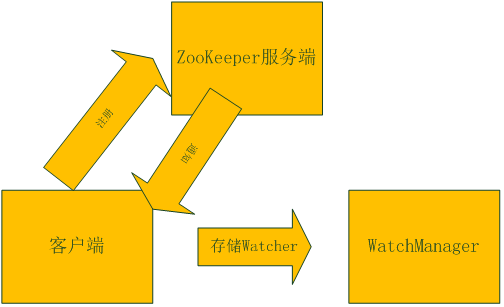
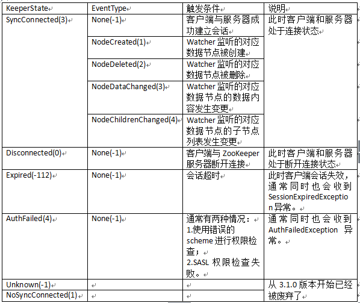
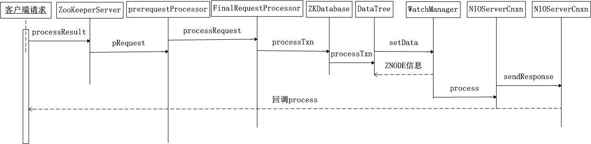

# Apache ZooKeeper Watcher 机制源码解释
深入理解 Apache ZooKeeper Watcher 机制源码

**标签:** 分析,消息传递

[原文链接](https://developer.ibm.com/zh/articles/os-cn-apache-zookeeper-watcher/)

周明耀

发布: 2016-06-27

* * *

分布式系统从根本上来说就是不同节点上的进程并发执行，并且相互之间对进程的行为进行协调处理的过程。不同节点上的进程互相协调行为的过程叫做分布式同步。许多分布式系统需要一个进程作为任务的协调者，执行一些其他进程并不执行的特殊的操作，一般情况下哪个进程担当任务的协调者都无所谓，但是必须有一个进程作为协调者，自动选举出一个协调者的过程就是分布式选举。ZooKeeper 正是为了解决这一系列问题而生的。上一篇我们介绍了 [ZooKeeper 服务启动原理和源代码剖析](https://www.ibm.com/developerworks/cn/opensource/os-cn-zookeeper-code/) ，这一讲我们来谈谈 Watcher 机制，首先介绍一个监控示例，然后我们再来聊聊 Watcher 机制原理。

## ZooKeeper Watcher 机制

### 集群状态监控示例

为了确保集群能够正常运行，ZooKeeper 可以被用来监视集群状态，这样就可以提供集群高可用性。使用 ZooKeeper 的瞬时（ephemeral）节点概念可以设计一个集群机器状态检测机制：

1. 每一个运行了 ZooKeeper 客户端的生产环境机器都是一个终端进程，我们可以在它们连接到 ZooKeeper 服务端后在 ZooKeeper 服务端创建一系列对应的瞬时节点，可以用/hostname 来进行区分。

2. 这里还是采用监听（Watcher）方式来完成对节点状态的监视，通过对/hostname 节点的 NodeChildrenChanged 事件的监听来完成这一目标。监听进程是作为一个独立的服务或者进程运行的，它覆盖了 process 方法来实现应急措施。

3. 由于是一个瞬时节点，所以每次客户端断开时 znode 会立即消失，这样我们就可以监听到集群节点异常。


4.NodeChildrenChanged 事件触发后我们可以调用 getChildren 方法来知道哪台机器发生了异常。

##### 清单 1\. ClusterMonitor 类

```
import java.io.IOException;
import java.util.List;
import org.apache.zookeeper.CreateMode;
import org.apache.zookeeper.KeeperException;
import org.apache.zookeeper.WatchedEvent;
import org.apache.zookeeper.Watcher;
import org.apache.zookeeper.ZooDefs.Ids;
import org.apache.zookeeper.ZooKeeper;

public class ClusterMonitor implements Runnable{
private static String membershipRoot = "/Members";
private final Watcher connectionWatcher;
private final Watcher childrenWatcher;
private ZooKeeper zk;
boolean alive = true;
public ClusterMonitor(String HostPort) throws IOException,InterruptedException,KeeperException{
connectionWatcher = new Watcher(){
@Override
public void process(WatchedEvent event) {
// TODO Auto-generated method stub
if(event.getType() == Watcher.Event.EventType.None &&
event.getState() == Watcher.Event.KeeperState.SyncConnected){
System.out.println("\nconnectionWatcher Event Received:%s"+event.toString());
}
}
};

childrenWatcher = new Watcher(){
@Override
public void process(WatchedEvent event) {
// TODO Auto-generated method stub
System.out.println("\nchildrenWatcher Event Received:%s"+event.toString());
if(event.getType()==Event.EventType.NodeChildrenChanged){
try{
//Get current list of child znode and reset the watch
List<String> children = zk.getChildren(membershipRoot, this);
System.out.println("Cluster Membership change,Members: "+children);
}catch(KeeperException ex){
throw new RuntimeException(ex);
}catch(InterruptedException ex){
Thread.currentThread().interrupt();
alive = false;
throw new RuntimeException(ex);
}
}
}
};

zk = new ZooKeeper(HostPort,2000,connectionWatcher);
//Ensure the parent znode exists
if(zk.exists(membershipRoot, false) == null){
zk.create(membershipRoot, "ClusterMonitorRoot".getBytes(),
Ids.OPEN_ACL_UNSAFE, CreateMode.PERSISTENT);
}
//Set a watch on the parent znode
List<String> children = zk.getChildren(membershipRoot, childrenWatcher);
System.err.println("Members:"+children);
}

public synchronized void close(){
try{
zk.close();
}catch(InterruptedException ex){
ex.printStackTrace();
}
}

@Override
public void run() {
// TODO Auto-generated method stub
try{
synchronized(this){
while(alive){
wait();
}
}
}catch(InterruptedException ex){
ex.printStackTrace();
Thread.currentThread().interrupt();
}finally{
this.close();
}
}

public static void main(String[] args) throws IOException,InterruptedException,KeeperException{
if(args.length != 1){
System.err.println("Usage:ClusterMonitor<Host:Port>");
System.exit(0);
}
String hostPort = args[0];
new ClusterMonitor(hostPort).run();
}

}

```

Show moreShow more icon

##### 清单 2\. ClusterClient 类

```
import java.io.IOException;
import java.lang.management.ManagementFactory;
import org.apache.zookeeper.CreateMode;
import org.apache.zookeeper.KeeperException;
import org.apache.zookeeper.WatchedEvent;
import org.apache.zookeeper.Watcher;
import org.apache.zookeeper.ZooDefs.Ids;
import org.apache.zookeeper.ZooKeeper;

public class ClusterClient implements Watcher,Runnable{
private static String membershipRoot = "/Members";
ZooKeeper zk;
public ClusterClient(String hostPort,Long pid){
String processId = pid.toString();
try{
zk = new ZooKeeper(hostPort,2000,this);
}catch(IOException ex){
ex.printStackTrace();
}
if(zk!=null){
try{
zk.create(membershipRoot+'/'+processId, processId.getBytes(),
Ids.OPEN_ACL_UNSAFE, CreateMode.EPHEMERAL);
}catch(KeeperException | InterruptedException ex){
ex.printStackTrace();
}
}
}

public synchronized void close(){
try{
zk.close();
}catch(InterruptedException ex){
ex.printStackTrace();
}
}

@Override
public void process(WatchedEvent event) {
// TODO Auto-generated method stub
System.out.println("\nEvent Received:%s"+event.toString());
}

@Override
public void run() {
// TODO Auto-generated method stub
try{
synchronized(this){
while(true){
wait();
}
}
}catch(InterruptedException ex){
ex.printStackTrace();
Thread.currentThread().interrupt();
}finally{
this.close();
}
}

public static void main(String[] args){
if(args.length!=1){
System.err.println("Usage:ClusterClient<Host:Port>");
System.exit(0);
}

String hostPort=args[0];
//Get the process id
String name = ManagementFactory.getRuntimeMXBean().getName();
int index = name.indexOf('@');
Long processId = Long.parseLong(name.substring(0,index));
new ClusterClient(hostPort,processId).run();
}

}

```

Show moreShow more icon

##### 清单 3\. Eclipse 运行输出

```
childrenWatcher Event Received:%sWatchedEvent state:SyncConnected type:NodeChildrenChanged path:/Members
Cluster Membership change,Members: [dweref0000000009, test100000000003, dsdawqeqw0000000008,
test111110000000004, test22220000000005, dsda32130000000007, dsda0000000006, test10000000002]

```

Show moreShow more icon

我们通过 zkCli 方式对被监听的/Members 这个 ZNODE 操作，增加一个子节点，您会在 zkCli 里看到如清单 4 所示输出。

##### 清单 4\. ZKCli 创建 ZNode 子节点

```
[zk: localhost:2181(CONNECTED) 0] create -s /Members/dweref rew23rf
Created /Members/dweref0000000009 [zk: localhost:2181(CONNECTED) 4]

```

Show moreShow more icon

上面的示例我们演示了如何发起对于一个 ZNODE 的监听，当该 ZNODE 被改变后，我们会触发对应的方法进行处理，这类方式可以被用在数据监听、集群状态监听等用途。

### 回调函数

由于 Watcher 机制涉及到回调函数，所以我们先来介绍一下回调函数的基础知识。

打个比方，有一家旅馆提供叫醒服务，但是要求旅客自己决定叫醒的方法。可以是打客房电话，也可以是派服务员去敲门，睡得死怕耽误事的，还可以要求往自己头上浇盆水。这里，”叫醒”这个行为是旅馆提供的，相当于库函数，但是叫醒的方式是由旅客决定并告诉旅馆的，也就是回调函数。而旅客告诉旅馆怎么叫醒自己的动作，也就是把回调函数传入库函数的动作，称为登记回调函数（to register a callback function）。

乍看起来，回调似乎只是函数间的调用，但仔细一琢磨，可以发现两者之间的一个关键的不同：在回调中，我们利用某种方式，把回调函数像参数一样传入中间函数。可以这么理解，在传入一个回调函数之前，中间函数是不完整的。换句话说，程序可以在运行时，通过登记不同的回调函数，来决定、改变中间函数的行为。这就比简单的函数调用要灵活太多了。

回调实际上有两种：阻塞式回调和延迟式回调。两者的区别在于：阻塞式回调里，回调函数的调用一定发生在起始函数返回之前；而延迟式回调里，回调函数的调用有可能是在起始函数返回之后。我们来看一个简单的示例。

##### 清单 5\. Caller 类

```
public class Caller
{
public MyCallInterface mc;

public void setCallfuc(MyCallInterface mc)
{
this.mc= mc;
}

public void call(){
this.mc.method();
}
}

```

Show moreShow more icon

##### 清单 6\. MyCallInterface 接口

```
public interface MyCallInterface {
public void method();
}

```

Show moreShow more icon

##### 清单 7\. CallbackClass 类

```
public class CallbackClass implements MyCallInterface{
public void method()
{
System.out.println("回调函数");
}

public static void main(String args[])
{
Caller call = new Caller();
call.setCallfuc(new CallbackClass());
call.call();
}
}

```

Show moreShow more icon

##### 清单 8\. 运行结果

```
回调函数

```

Show moreShow more icon

### 原理及源代码解释

#### 实现原理

ZooKeeper 允许客户端向服务端注册一个 Watcher 监听，当服务端的一些指定事件触发了这个 Watcher，那么就会向指定客户端发送一个事件通知来实现分布式的通知功能。

ZooKeeper 的 Watcher 机制主要包括客户端线程、客户端 WatchManager 和 ZooKeeper 服务器三部分。在具体工作流程上，简单地讲，客户端在向 ZooKeeper 服务器注册 Watcher 的同时，会将 Watcher 对象存储在客户端的 WatchManager 中。当 ZooKeeper 服务器端触发 Watcher 事件后，会向客户端发送通知，客户端线程从 WatchManager 中取出对应的 Watcher 对象来执行回调逻辑。如清单 9 所示，WatchManager 创建了一个 HashMap，这个 HashMap 被用来存放 Watcher 对象。

##### 清单 9\. WatchManager 类

```
private final HashMap<String, HashSet<Watcher>> watchTable =
new HashMap<String, HashSet<Watcher>>();
public synchronized void addWatch(String path, Watcher watcher) {
HashSet<Watcher> list = watchTable.get(path);
if (list == null) {
// don't waste memory if there are few watches on a node
// rehash when the 4th entry is added, doubling size thereafter
// seems like a good compromise
list = new HashSet<Watcher>(4);
watchTable.put(path, list);
}
list.add(watcher);

HashSet<String> paths = watch2Paths.get(watcher);
if (paths == null) {
// cnxns typically have many watches, so use default cap here
paths = new HashSet<String>();
watch2Paths.put(watcher, paths);
}
paths.add(path);
}

```

Show moreShow more icon

整个 Watcher 注册和通知流程如图 1 所示。

##### 图 1\. Watcher 注册和通知流程图



#### Watcher 接口

Watcher 的理念是启动一个客户端去接收从 ZooKeeper 服务端发过来的消息并且同步地处理这些信息。ZooKeeper 的 Java API 提供了公共接口 Watcher，具体操作类通过实现这个接口相关的方法来实现从所连接的 ZooKeeper 服务端接收数据。如果要处理这个消息，需要为客户端注册一个 CallBack（回调）对象。Watcher 接口定义在 org.apache.zookeeper 包里面，代码如清单 10 所示。

##### 清单 10\. Watcher 接口

```
public interface Watcher {
abstract public void process(WatchedEvent event);
}

```

Show moreShow more icon

在 Watcher 接口里面，除了回调函数 process 以外，还包含 KeeperState 和 EventType 两个枚举类，分别代表了通知状态和事件类型，如图 2 所示。

##### 图 2\. Watcher通知状态和事件类型表



process 方法是 Watcher 接口中的一个回调方法，当 ZooKeeper 向客户端发送一个 Watcher 事件通知时，客户端就会对相应的 process 方法进行回调，从而实现对事件的处理。

process 方法包含 WatcherEvent 类型的参数，WatchedEvent 包含了每一个事件的三个基本属性：通知状态（KeeperState）、事件类型（EventType）和节点路径（Path），ZooKeeper 使用 WatchedEvent 对象来封装服务端事件并传递给 Watcher，从而方便回调方法 process 对服务端事件进行处理。

WatchedEvent 和 WatcherEvent 都表示的是同一个事物，都是对一个服务端事件的封装。不同的是，WatchedEvent 是一个逻辑事件，用于服务端和客户端程序执行过程中所需的逻辑对象，而 WatcherEvent 因为实现了序列化接口，因此可以用于网络传输。

服务端在线程 WatchedEvent 事件之后，会调用 getWrapper 方法将自己包装成一个可序列化的 WatcherEvent 事件，如清单 7 所示，以便通过网络传输到客户端。客户端在接收到服务端的这个事件对象后，首先会将 WatcherEvent 事件还原成一个 WatchedEvent 事件，并传递给 process 方法处理，回调方法 process 根据入参就能够解析出完整的服务端事件了。

##### 清单 11\. 可序列化的事件

```
public WatcherEvent getWrapper() {
return new WatcherEvent(eventType.getIntValue(),
keeperState.getIntValue(),
path);
}

```

Show moreShow more icon

#### 客户端注册 Watcher 流程

清单 1 所示代码中采用了 ZooKeeper 构造函数来传入一个 Watcher，如代码 zk = new ZooKeeper(HostPort,2000,connectionWatcher);在这行代码里，第三个参数是连接到 ZooKeeper 服务端的 connectionWatcher 事件监听，这个 Watcher 将作为整个 ZooKeeper 会话期间的默认 Watcher，会一直被保存在客户端 ZKWatchManager 的 defaultWatcher 里面。

客户端的请求基本都是在 ClientCnxn 里面进行操作，当收到请求后，客户端会对当前客户端请求进行标记，将其设置为使用 Watcher 监听，同时会封装一个 Watcher 的注册信息 WatchRegistration 对象，用于暂时保存数据节点的路径和 Watcher 的对应关系。

##### 清单 12\. getChildren 方法添加 watch 事件

```
public byte[] getData(final String path, Watcher watcher, Stat stat)
throws KeeperException, InterruptedException
{
final String clientPath = path;
PathUtils.validatePath(clientPath);

// the watch contains the un-chroot path
WatchRegistration wcb = null;
if (watcher != null) {
wcb = new DataWatchRegistration(watcher, clientPath);
}

final String serverPath = prependChroot(clientPath);

RequestHeader h = new RequestHeader();
h.setType(ZooDefs.OpCode.getData);
GetDataRequest request = new GetDataRequest();
request.setPath(serverPath);
request.setWatch(watcher != null);
GetDataResponse response = new GetDataResponse();
ReplyHeader r = cnxn.submitRequest(h, request, response, wcb);
if (r.getErr() != 0) {
throw KeeperException.create(KeeperException.Code.get(r.getErr()),
clientPath);
}
if (stat != null) {
DataTree.copyStat(response.getStat(), stat);
}
return response.getData();
}

```

Show moreShow more icon

在 ZooKeeper 中，Packet 是一个最小的通信协议单元，即数据包。Pakcet 用于进行客户端与服务端之间的网络传输，任何需要传输的对象都需要包装成一个 Packet 对象。在 ClientCnxn 中 WatchRegistration 也会被封装到 Pakcet 中，然后由 SendThread 线程调用 queuePacke 方法把 Packet 放入发送队列中等待客户端发送，这又是一个异步过程，分布式系统采用异步通信是一个普遍认同的观念。随后，SendThread 线程会通过 readResponse 方法接收来自服务端的响应，异步地调用 finishPacket 方法从 Packet 中取出对应的 Watcher 并注册到 ZKWatchManager 中去，如清单 13 所示。

##### 清单 13\. getChildren 方法添加 watch 事件

```
private void finishPacket(Packet p) {
if (p.watchRegistration != null) {
p.watchRegistration.register(p.replyHeader.getErr());
}

if (p.cb == null) {
synchronized (p) {
p.finished = true;
p.notifyAll();
}
} else {
p.finished = true;
eventThread.queuePacket(p);
}
}

```

Show moreShow more icon

除了上面介绍的方式以外，ZooKeeper 客户端也可以通过 getData、getChildren 和 exist 三个接口来向 ZooKeeper 服务器注册 Watcher，无论使用哪种方式，注册 Watcher 的工作原理是一致的。如清单 14 所示，getChildren 方法调用了 WatchManager 类的 addWatch 方法添加了 watcher 事件。

##### 清单 14\. getChildren 方法添加 watcher 事件

```
public ArrayList<String> getChildren(String path, Stat stat,
                    Watcher watcher) throws KeeperException.NoNodeException {
DataNodeV1 n = nodes.get(path);
if (n == null) {
throw new KeeperException.NoNodeException();
}
synchronized (n) {
ArrayList<String> children = new ArrayList<String>();
children.addAll(n.children);
if (watcher != null) {
childWatches.addWatch(path, watcher);
}
return children;
}
}

```

Show moreShow more icon

如清单 15 所示，现在需要从这个封装对象中再次提取出 Watcher 对象来，在 register 方法里面，客户端将 Watcher 对象转交给 ZKWatchManager，并最终保存在一个 Map 类型的数据结构 dataWatches 里面，用于将数据节点的路径和 Watcher 对象进行一一映射后管理起来。

注意，WatcherRegistation 除了 Header 和 request 两个属性被传递到了服务端，其他都没有到服务端，否则服务端就容易出现内存紧张甚至溢出的危险，因为数据量太大了。这就是 ZooKeeper 为什么适用于分布式环境的原因，它在网络中传输的是消息，而不是数据包实体。

##### 清单 15\. processRequest 代码

```
public void register(int rc) {
if (shouldAddWatch(rc)) {
Map<String, Set<Watcher>> watches = getWatches(rc);
synchronized(watches) {
Set<Watcher> watchers = watches.get(clientPath);
if (watchers == null) {
watchers = new HashSet<Watcher>();
watches.put(clientPath, watchers);
}
watchers.add(watcher);
}
}
}

```

Show moreShow more icon

#### 服务端处理 Watcher 流程

如图 3 所示是服务端处理 Watcher 的一个完整序列图。

##### 图 3\. 服务端处理 Watcher 序列图



注意，以下所有代码均为精简版，去除了日志、判断分支，只在源码上保留了主线代码。

FinalRequestProcessor 类接收到客户端请求后，会调用 processRequest 方法进行处理，会进一步转向 ZooKeeperServer 的 processRequest 进行进一步处理，处理结由 ZKDatabase 类返回，如清单 16-18 所示。

##### 清单 16\. processRequest 代码

```
public void processRequest(Request request) {
if (request.hdr != null) {
TxnHeader hdr = request.hdr;
Record txn = request.txn;

rc = zks.processTxn(hdr, txn);
}

```

Show moreShow more icon

##### 清单 17\. ZooKeeperServer 代码

```
public ProcessTxnResult processTxn(TxnHeader hdr, Record txn) {
ProcessTxnResult rc;
int opCode = hdr.getType();
long sessionId = hdr.getClientId();
rc = getZKDatabase().processTxn(hdr, txn);
if (opCode == OpCode.createSession) {
if (txn instanceof CreateSessionTxn) {
CreateSessionTxn cst = (CreateSessionTxn) txn;
sessionTracker.addSession(sessionId, cst
.getTimeOut());
} else {
LOG.warn("*****>>>>> Got "
+ txn.getClass() + " "
+ txn.toString());
}
} else if (opCode == OpCode.closeSession) {
sessionTracker.removeSession(sessionId);
}
return rc;
}

```

Show moreShow more icon

##### 清单 18\. ZKDatabase 代码

```
public ProcessTxnResult processTxn(TxnHeader header, Record txn)
{
switch (header.getType()) {
case OpCode.setData:
SetDataTxn setDataTxn = (SetDataTxn) txn;
rc.path = setDataTxn.getPath();
rc.stat = setData(setDataTxn.getPath(), setDataTxn
.getData(), setDataTxn.getVersion(), header
.getZxid(), header.getTime());
break;

```

Show moreShow more icon

对于注册 Watcher 请求，FinalRequestProcessor 的 ProcessRequest 方法会判断当前请求是否需要注册 Watcher，如果为 true，就会将当前的 ServerCnxn 对象和数据节点路径传入 getData 方法中去。ServerCnxn 是一个 ZooKeeper 客户端和服务器之间的连接接口，代表了一个客户端和服务器的连接，我们后面讲到的 process 回调方法，实际上也是从这里回调的，所以可以把 ServerCnxn 看作是一个 Watcher 对象。数据节点的节点路径和 ServerCnxn 最终会被存储在 WatchManager 的 watchTable 和 watch2Paths 中。

##### 清单 19\. 判断是否注册 Watcher 代码

```
case OpCode.getData: {
lastOp = "GETD";
GetDataRequest getDataRequest = new GetDataRequest();
ByteBufferInputStream.byteBuffer2Record(request.request,
getDataRequest);
DataNode n = zks.getZKDatabase().getNode(getDataRequest.getPath());
if (n == null) {
throw new KeeperException.NoNodeException();
}
Long aclL;
synchronized(n) {
aclL = n.acl;
}
PrepRequestProcessor.checkACL(zks, zks.getZKDatabase().convertLong(aclL),
ZooDefs.Perms.READ,
request.authInfo);
Stat stat = new Stat();
byte b[] = zks.getZKDatabase().getData(getDataRequest.getPath(), stat,
getDataRequest.getWatch() ? cnxn : null);
rsp = new GetDataResponse(b, stat);
break;
}

```

Show moreShow more icon

如前所述，WatchManager 负责 Watcher 事件的触发，它是一个统称，在服务端 DataTree 会托管两个 WatchManager，分别是 dataWatches 和 childWatches，分别对应数据变更 Watcher 和子节点变更 Watcher。

##### 清单 20\. WatchManger 两个队列

```
private final HashMap<String, HashSet<Watcher>> watchTable =
new HashMap<String, HashSet<Watcher>>();

private final HashMap<Watcher, HashSet<String>> watch2Paths =
new HashMap<Watcher, HashSet<String>>();

```

Show moreShow more icon

回到主题，如清单 21 到 23 所示，当发生 Create、Delete、NodeChange（数据变更）这样的事件后，DataTree 会调用相应方法去触发 WatchManager 的 triggerWatch 方法，该方法返回 ZNODE 的信息，自此进入到回调本地 process 的序列。

##### 清单 21\. processTxn 代码

```
public ProcessTxnResult processTxn(TxnHeader header, Record txn)
{
ProcessTxnResult rc = new ProcessTxnResult();

try {
switch (header.getType()) {
case OpCode.setData:
SetDataTxn setDataTxn = (SetDataTxn) txn;
rc.path = setDataTxn.getPath();
rc.stat = setData(setDataTxn.getPath(), setDataTxn
.getData(), setDataTxn.getVersion(), header
.getZxid(), header.getTime());
break;

```

Show moreShow more icon

##### 清单 22\. setData 代码

```
public Stat setData(String path, byte data[], int version, long zxid,
long time) throws KeeperException.NoNodeException {
Stat s = new Stat();
DataNodeV1 n = nodes.get(path);
if (n == null) {
throw new KeeperException.NoNodeException();
}
synchronized (n) {
n.data = data;
n.stat.setMtime(time);
n.stat.setMzxid(zxid);
n.stat.setVersion(version);
n.copyStat(s);
}
dataWatches.triggerWatch(path, EventType.NodeDataChanged);
return s;
}

```

Show moreShow more icon

##### 清单 23\. triggerWatch 代码

```
public Set<Watcher> triggerWatch(String path, EventType type, Set<Watcher> supress) {
WatchedEvent e = new WatchedEvent(type,
KeeperState.SyncConnected, path);
//将事件类型（EventType）、通知状态（WatchedEvent）、节点路径封装成一个 WatchedEvent 对象
HashSet<Watcher> watchers;
synchronized (this) {
//根据数据节点的节点路径从 watchTable 里面取出对应的 Watcher。如果没有找到 Watcher 对象，
说明没有任何客户端在该数据节点上注册过 Watcher，直接退出。如果找打了 Watcher 就将其提取出来，
同时会直接从 watchTable 和 watch2Paths 里删除 Watcher，即 Watcher 是一次性的，触发一次就失效了。
watchers = watchTable.remove(path);
for (Watcher w : watchers) {
HashSet<String> paths = watch2Paths.get(w);
}
}
for (Watcher w : watchers) {
if (supress != null && supress.contains(w)) {
continue;
}
//对于需要注册 Watcher 的请求，ZooKeeper 会把请求对应的恶 ServerCnxn 作为一个 Watcher 存储，
所以这里调用的 process 方法实质上是 ServerCnxn 的对应方法
w.process(e);
}
return watchers;
}

```

Show moreShow more icon

从上面的代码我们可以总结出，如果想要处理一个 Watcher，需要执行的步骤如下所示：

1. 将事件类型（EventType）、通知状态（WatchedEvent）、节点路径封装成一个 WatchedEvent 对象。

2. 根据数据节点的节点路径从 watchTable 里面取出对应的 Watcher。如果没有找到 Watcher 对象，说明没有任何客户端在该数据节点上注册过 Watcher，直接退出。如果找到了 Watcher 就将其提取出来，同时会直接从 watchTable 和 watch2Paths 里删除 Watcher，即 Watcher 是一次性的，触发一次就失效了。

3. 对于需要注册 Watcher 的请求，ZooKeeper 会把请求对应的 ServerCnxn 作为一个 Watcher 存储，所以这里调用的 process 方法实质上是 ServerCnxn 的对应方法，如清单 24 所示，在请求头标记”-1”表示当前是一个通知，将 WatchedEvent 包装成 WatcherEvent 用于网络传输序列化，向客户端发送通知，真正的回调方法在客户端，就是我们清单 10 里面定义的 process() 方法。


##### 清单 24\. ServerCnxn 类代码

```
synchronized public void process(WatchedEvent event) {
ReplyHeader h = new ReplyHeader(-1, -1L, 0);
if (LOG.isTraceEnabled()) {
ZooTrace.logTraceMessage(LOG, ZooTrace.EVENT_DELIVERY_TRACE_MASK,
"Deliver event " + event + " to 0x"
+ Long.toHexString(this.sessionId)
+ " through " + this);
}

// Convert WatchedEvent to a type that can be sent over the wire
WatcherEvent e = event.getWrapper();

sendResponse(h, e, "notification");
}

```

Show moreShow more icon

如清单 24 所示，客户端收到消息后，会调用 ClientCnxn 的 SendThread.readResponse 方法来进行统一处理，如清单所示。如果响应头 replyHdr 中标识的 Xid 为 02，表示是 ping，如果为-4，表示是验证包，如果是-1，表示这是一个通知类型的响应，然后进行反序列化、处理 chrootPath、还原 WatchedEvent、回调 Watcher 等步骤，其中回调 Watcher 步骤将 WacthedEvent 对象交给 EventThread 线程，在下一个轮询周期中进行 Watcher 回调。

##### 清单 25\. SendThread 线程代码

```
class SendThread extends ZooKeeperThread {
private long lastPingSentNs;
private final ClientCnxnSocket clientCnxnSocket;
private Random r = new Random(System.nanoTime());
private boolean isFirstConnect = true;

void readResponse(ByteBuffer incomingBuffer) throws IOException {
ByteBufferInputStream bbis = new ByteBufferInputStream(
incomingBuffer);
BinaryInputArchive bbia = BinaryInputArchive.getArchive(bbis);
ReplyHeader replyHdr = new ReplyHeader();

replyHdr.deserialize(bbia, "header");
if (replyHdr.getXid() == -2) {

```

Show moreShow more icon

如清单 25 所示，SendThread 接收到服务端的通知事件后，会通过调用 EventThread 类的 queueEvent 方法将事件传给 EventThread 线程，queueEvent 方法根据该通知事件，从 ZKWatchManager 中取出所有相关的 Watcher，如清单 26 所示。

##### 清单 26\. EventThread 线程代码

```
class EventThread extends ZooKeeperThread {
public void queueEvent(WatchedEvent event) {
if (event.getType() == EventType.None
&& sessionState == event.getState()) {
return;
}
sessionState = event.getState();

// materialize the watchers based on the event
WatcherSetEventPair pair = new WatcherSetEventPair(
watcher.materialize(event.getState(), event.getType(),
event.getPath()),
event);
// queue the pair (watch set & event) for later processing
waitingEvents.add(pair);
}

```

Show moreShow more icon

客户端在识别出事件类型 EventType 之后，会从相应的 Watcher 存储中删除对应的 Watcher，获取到相关的 Watcher 之后，会将其放入 waitingEvents 队列，该队列从字面上就能理解是一个待处理队列，线程的 run 方法会不断对该该队列进行处理，这就是一种异步处理思维的实现。

##### 清单 27\. ZKWatchManager 取出 Watcher

```
public Set<Watcher> materialize(Watcher.Event.KeeperState state,
Watcher.Event.EventType type,
String clientPath)
{
Set<Watcher> result = new HashSet<Watcher>();
case NodeCreated:
synchronized (dataWatches) {
addTo(dataWatches.remove(clientPath), result);
}
synchronized (existWatches) {
addTo(existWatches.remove(clientPath), result);
}
break;

```

Show moreShow more icon

##### 清单 28\. EventThread 线程的 run 方法

```
public void run() {
try {
isRunning = true;
while (true) {
Object event = waitingEvents.take();
if (event == eventOfDeath) {
wasKilled = true;
} else {
processEvent(event);
}
if (wasKilled)
synchronized (waitingEvents) {
if (waitingEvents.isEmpty()) {
isRunning = false;
break;
}
}
}

```

Show moreShow more icon

## ZooKeeper Watcher 特性总结

- **1\. 注册只能确保一次消费**

    无论是服务端还是客户端，一旦一个 Watcher 被触发，ZooKeeper 都会将其从相应的存储中移除。因此，开发人员在 Watcher 的使用上要记住的一点是需要反复注册。这样的设计有效地减轻了服务端的压力。如果注册一个 Watcher 之后一直有效，那么针对那些更新非常频繁的节点，服务端会不断地向客户端发送事件通知，这无论对于网络还是服务端性能的影响都非常大。

- **2\. 客户端串行执行**

    客户端 Watcher 回调的过程是一个串行同步的过程，这为我们保证了顺序，同时，需要开发人员注意的一点是，千万不要因为一个 Watcher 的处理逻辑影响了整个客户端的 Watcher 回调。

- **3\. 轻量级设计**

    WatchedEvent 是 ZooKeeper 整个 Watcher 通知机制的最小通知单元，这个数据结构中只包含三部分的内容：通知状态、事件类型和节点路径。也就是说，Watcher 通知非常简单，只会告诉客户端发生了事件，而不会说明事件的具体内容。例如针对 NodeDataChanged 事件，ZooKeeper 的 Watcher 只会通知客户指定数据节点的数据内容发生了变更，而对于原始数据以及变更后的新数据都无法从这个事件中直接获取到，而是需要客户端主动重新去获取数据，这也是 ZooKeeper 的 Watcher 机制的一个非常重要的特性。另外，客户端向服务端注册 Watcher 的时候，并不会把客户端真实的 Watcher 对象传递到服务端，仅仅只是在客户端请求中使用 boolean 类型属性进行了标记，同时服务端也仅仅只是保存了当前连接的 ServerCnxn 对象。这样轻量级的 Watcher 机制设计，在网络开销和服务端内存开销上都是非常廉价的。


## 结束语

本文首先介绍了一个简单的监听示例代码，通过监听 ZNode 的变化，触发回调函数来实现触发后的业务处理，接下来简单介绍了一点回调函数的基本知识，然后我们开始讨论 Watcher 机制的实现原理，从 Watcher 接口开始聊，引申出 WatcherEvent 类型，再到添加 watcher 事件以及回调函数基本原理介绍，最后对 Watcher 机制的设计原理进行了三点总结。