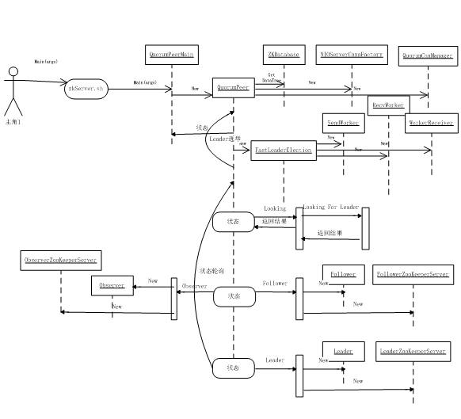
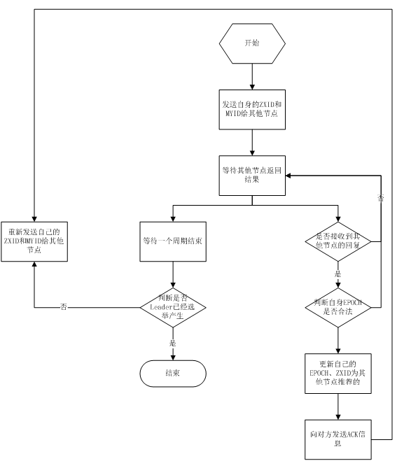

# Apache ZooKeeper 服务启动源码解释
了解 Apache ZooKeeper 服务启动的三种方式

**标签:** 分析

[原文链接](https://developer.ibm.com/zh/articles/os-cn-zookeeper-code/)

周明耀

发布: 2016-05-23

* * *

分布式系统从根本上来说就是不同节点上的进程并发执行，并且相互之间对进程的行为进行协调处理的过程。不同节点上的进程互相协调行为的过程叫做分布式同步。许多分布式系统需要一个进程作为任务的协调者，执行一些其他进程并不执行的特殊的操作，一般情况下哪个进程担当任务的协调者都无所谓，但是必须有一个进程作为协调者，自动选举出一个协调者的过程就是分布式选举。ZooKeeper 正是为了解决这一系列问题而生的，今天讲的是 ZooKeeper 服务启动流程深入分析。

## ZooKeeper 服务启动

ZooKeeper 服务的启动方式分为三种，即单机模式、伪分布式模式、分布式模式。

### 单机模式

采用单机模式，意味着只有一台机器或者一个节点，因此流程较为简单。首先，在 conf 目录下面可以通过自己创建 zoo.cfg 文件的方式完成 ZooKeeper 的配置，如清单 1 所示，ZooKeeper 服务会读取该配置文件。

##### 清单 1\. ZooKeeper 配置文件

```
[root@localhost zookeeper-3.4.7]# cd conf
[root@localhost conf]# ls -rlt
total 12
-rw-rw-r--. 1 1000 1000 922 Nov 10 22:32 zoo_sample.cfg
-rw-rw-r--. 1 1000 1000 2161 Nov 10 22:32 log4j.properties
-rw-rw-r--. 1 1000 1000 535 Nov 10 22:32 configuration.xsl
[root@localhost conf]# cat zoo_sample.cfg
# The number of milliseconds of each tick
tickTime=2000
# The number of ticks that the initial
# synchronization phase can take
initLimit=10
# The number of ticks that can pass between
# sending a request and getting an acknowledgement
syncLimit=5
# the directory where the snapshot is stored.
# do not use /tmp for storage, /tmp here is just
# example sakes.
dataDir=/tmp/zookeeper
# the port at which the clients will connect
clientPort=2181
# the maximum number of client connections.
# increase this if you need to handle more clients
#maxClientCnxns=60
#
# Be sure to read the maintenance section of the
# administrator guide before turning on autopurge.
#
# http://zookeeper.apache.org/doc/current/zookeeperAdmin.html#sc_maintenance
#
# The number of snapshots to retain in dataDir
#autopurge.snapRetainCount=3
# Purge task interval in hours
# Set to "0" to disable auto purge feature
#autopurge.purgeInterval=1

```

Show moreShow more icon

上面是自带的示例配置，与我们相关的三个配置项是 tickTime、dataDir 和 clientPort。

tickTime：这个参数主要是用来针对 ZooKeeper 服务端和客户端的会话控制，包括心跳控制，一般来说，会话超时时间是该值的两倍，它的单位是毫秒，我们设置为 2000 毫秒。

dataDir：这个目录用来存放数据库的镜像和操作数据库的日志。注意，如果这个文件夹不存在，需要手动创建一个并赋予读写权限，我们设置为/tmp/zookeeper，不用手动创建这个文件夹，系统运行后会自动创建或覆盖。

clientPort：ZooKeeper 服务端监听客户端的端口，默认是 2181，这里沿用默认设置。

接下来通过 bin 目录下面的 zkServer.sh 脚本启动 ZooKeeper 服务，如果不清楚具体参数，可以直接调用脚本查看输出，ZooKeeper 采用的是 Bourne Shell，如清单 2 所示。

##### 清单 2\. 调用 zkServer.sh 脚本

```
[root@localhost bin]# ./zkServer.sh
ZooKeeper JMX enabled by default
Using config: /home/zhoumingyao/zookeeper/zookeeper-3.4.7/bin/../conf/zoo.cfg
Usage: ./zkServer.sh {start|start-foreground|stop|restart|status|upgrade|print-cmd}

```

Show moreShow more icon

输出中可以看到有 start 等选项，其他选项还有 start-foreground、print-cmd、stop、upgrade、restart、status 等，从字面上已经可以基本看出代表意义，这里我们使用 start 选项启动 ZooKeeper 服务，如清单 3 所示。

##### 清单 3\. 启动 ZooKeeper

```
[root@localhost bin]# ./zkServer.sh start
ZooKeeper JMX enabled by default
Using config: /home/zhoumingyao/zookeeper/zookeeper-3.4.7/bin/../conf/zoo.cfg
Starting zookeeper ... STARTED

```

Show moreShow more icon

ZooKeeper 服务是否启动成功，可以通过 ps 或者 jps 命令查看，如清单 4 所示。

##### 清单 4\. 查看 ZooKeeper 服务

```
[root@localhost bin]# jps
2737 QuorumPeerMain
2751 Jps
[root@localhost bin]# ps -ef | grep zookeeper | grep -v grep | awk '{print $2}'
2608

```

Show moreShow more icon

这里我们看到的进程号为 2737 的进程 QuorumPeerMain 代表了 ZooKeeper 服务。我们也可以通过 ZooKeeper 启动脚本自带的参数”Status”来查看 ZooKeeper 进程状态，如清单 5 所示。

##### 清单 5\. 查看 ZooKeeper 进程状态

```
[root@localhost bin]# ./zkServer.sh status
ZooKeeper JMX enabled by default
Using config: /home/zhoumingyao/zookeeper/zookeeper-3.4.7/bin/../conf/zoo.cfg
Mode: standalone

```

Show moreShow more icon

ZooKeeper 服务运行以后我们可以通过命令行工具去访问它，默认是 Java 命令行脚本。我们可以通过以下命令方式启动 ZooKeeper 命令行 Shell，运行输出如清单 6 所示。

##### 清单 6\. ZKCli 运行输出

```
[root@localhost bin]# ./zkCli.sh -server localhost:2181
Connecting to localhost:2181
2015-12-20 23:22:10,620 [myid:] - INFO [main:Environment@100] - Client environment:zookeeper.version=3.4.7-1713338, built on 11/09/2015 04:32 GMT
2015-12-20 23:22:10,645 [myid:] - INFO [main:Environment@100] - Client environment:host.name=localhost
2015-12-20 23:22:10,645 [myid:] - INFO [main:Environment@100] - Client environment:java.version=1.8.0_51
2015-12-20 23:22:10,657 [myid:] - INFO [main:Environment@100] - Client environment:java.vendor=Oracle Corporation
2015-12-20 23:22:10,658 [myid:] - INFO [main:Environment@100] - Client environment:java.home=/usr/lib/jdk1.8.0_51/jre
2015-12-20 23:22:10,658 [myid:] - INFO [main:Environment@100] - Client environment:java.class.path=/home/zhoumingyao/zookeeper/zookeeper-3.4.7/bin/../build/classes:/home/zhoumingyao/zookeeper/zookeeper-3.4.7/bin/../build/lib/*.jar:/home/zhoumingyao/zookeeper/zookeeper-3.4.7/bin/../lib/slf4j-log4j12-1.6.1.jar:/home/zhoumingyao/zookeeper/zookeeper-3.4.7/bin/../lib/slf4j-api-1.6.1.jar:/home/zhoumingyao/zookeeper/zookeeper-3.4.7/bin/../lib/netty-3.7.0.Final.jar:/home/zhoumingyao/zookeeper/zookeeper-3.4.7/bin/../lib/log4j-1.2.16.jar:/home/zhoumingyao/zookeeper/zookeeper-3.4.7/bin/../lib/jline-0.9.94.jar:/home/zhoumingyao/zookeeper/zookeeper-3.4.7/bin/../zookeeper-3.4.7.jar:/home/zhoumingyao/zookeeper/zookeeper-3.4.7/bin/../src/java/lib/*.jar:/home/zhoumingyao/zookeeper/zookeeper-3.4.7/bin/../conf:
2015-12-20 23:22:10,660 [myid:] - INFO [main:Environment@100] - Client environment:java.library.path=/usr/java/packages/lib/i386:/lib:/usr/lib
2015-12-20 23:22:10,665 [myid:] - INFO [main:Environment@100] - Client environment:java.io.tmpdir=/tmp
2015-12-20 23:22:10,665 [myid:] - INFO [main:Environment@100] - Client environment:java.compiler=<NA>
2015-12-20 23:22:10,666 [myid:] - INFO [main:Environment@100] - Client environment:os.name=Linux
2015-12-20 23:22:10,666 [myid:] - INFO [main:Environment@100] - Client environment:os.arch=i386
2015-12-20 23:22:10,667 [myid:] - INFO [main:Environment@100] - Client environment:os.version=2.6.32-504.el6.i686
2015-12-20 23:22:10,668 [myid:] - INFO [main:Environment@100] - Client environment:user.name=root
2015-12-20 23:22:10,668 [myid:] - INFO [main:Environment@100] - Client environment:user.home=/root
2015-12-20 23:22:10,668 [myid:] - INFO [main:Environment@100] - Client environment:user.dir=/home/zhoumingyao/zookeeper/zookeeper-3.4.7/bin
2015-12-20 23:22:10,693 [myid:] - INFO [main:ZooKeeper@438] - Initiating client connection, connectString=localhost:2181 sessionTimeout=30000 watcher=org.apache.zookeeper.ZooKeeperMain$MyWatcher@b07fd3
Welcome to ZooKeeper!
2015-12-20 23:22:10,953 [myid:] - INFO [main-SendThread(localhost:2181):ClientCnxn$SendThread@1032] - Opening socket connection to server localhost/0:0:0:0:0:0:0:1:2181. Will not attempt to authenticate using SASL (unknown error)
JLine support is enabled
2015-12-20 23:22:11,342 [myid:] - INFO [main-SendThread(localhost:2181):ClientCnxn$SendThread@876] - Socket connection established to localhost/0:0:0:0:0:0:0:1:2181, initiating session
2015-12-20 23:22:11,672 [myid:] - INFO [main-SendThread(localhost:2181):ClientCnxn$SendThread@1299] - Session establishment complete on server localhost/0:0:0:0:0:0:0:1:2181, sessionid = 0x151c241c15b0000, negotiated timeout = 30000
WATCHER::
WatchedEvent state:SyncConnected type:None path:null
[zk: localhost:2181(CONNECTED) 0]

```

Show moreShow more icon

光标停留在 [zk: localhost:2181(CONNECTED) 0] 这一行，我们可以通过 help 请求来查看所有的支持命令。

### 伪分布式模式

我们可以在一台机器上创建模拟的 ZooKeeper 集群服务，假如我们需要 3 个节点，需要创建 3 个 cfg 文件，分别命名为 zoo1.cfg，zoo2.cfg，zoo3.cfg，此外我们还需要创建 3 个不同的数据文件夹，分别是 zoo1，zoo2 和 zoo3，目录位于/var/lib/zookeeper，清单 7 是其中一个配置清单，其他的两个类似。

##### 清单 7\. 配置文件 zoo1 内容

```
[root@localhost conf]# cat zoo1.cfg
# The number of milliseconds of each tick
tickTime=2000
# The number of ticks that the initial
# synchronization phase can take
initLimit=10
# The number of ticks that can pass between
# sending a request and getting an acknowledgement
syncLimit=5
# the directory where the snapshot is stored.
# do not use /tmp for storage, /tmp here is just
# example sakes.
dataDir=/var/lib/zookeeper/zoo1
# the port at which the clients will connect
clientPort=2181
# the maximum number of client connections.
# increase this if you need to handle more clients
#maxClientCnxns=60
#
# Be sure to read the maintenance section of the
# administrator guide before turning on autopurge.
#
# http://zookeeper.apache.org/doc/current/zookeeperAdmin.html#sc_maintenance
#
# The number of snapshots to retain in dataDir
#autopurge.snapRetainCount=3
# Purge task interval in hours
# Set to "0" to disable auto purge feature
#autopurge.purgeInterval=1
server.1=localhost:2666:3666
server.2=localhost:2667:3667
server.3=localhost:2668:3668

```

Show moreShow more icon

注意，每一个虚拟机器都对应一个自己的 zoo{$}.cfg，其中的 {$} 需要通过清单 8 所示命令来进行设置。

##### 清单 8\. 设置 myid

```
[root@localhost conf]# echo 1 > /var/lib/zookeeper/zoo1/myid
[root@localhost conf]# echo 2 > /var/lib/zookeeper/zoo2/myid
[root@localhost conf]# echo 3 > /var/lib/zookeeper/zoo3/myid

```

Show moreShow more icon

接下来我们开始启动 ZooKeeper 的 3 个实例（虚拟的 3 台机器），需要调用三次 zkServer.sh 的 Start 命令，采用不同的配置文件，如清单 9 所示命令及输出。

##### 清单 9\. 启动伪分布式集群服务

```
[root@localhost bin]# ./zkServer.sh start /home/zhoumingyao/zookeeper/zookeeper-3.4.7/conf/zoo1.cfg
ZooKeeper JMX enabled by default
Using config: /home/zhoumingyao/zookeeper/zookeeper-3.4.7/conf/zoo1.cfg
Starting zookeeper ... STARTED
[root@localhost bin]# ./zkServer.sh start /home/zhoumingyao/zookeeper/zookeeper-3.4.7/conf/zoo2.cfg
ZooKeeper JMX enabled by default
Using config: /home/zhoumingyao/zookeeper/zookeeper-3.4.7/conf/zoo2.cfg
Starting zookeeper ... STARTED
[root@localhost bin]# ./zkServer.sh start /home/zhoumingyao/zookeeper/zookeeper-3.4.7/conf/zoo3.cfg
ZooKeeper JMX enabled by default
Using config: /home/zhoumingyao/zookeeper/zookeeper-3.4.7/conf/zoo3.cfg
Starting zookeeper ... STARTED

```

Show moreShow more icon

##### 清单 10\. 查看服务

```
[root@localhost bin]# jps
5537 QuorumPeerMain
5617 Jps
5585 QuorumPeerMain

```

Show moreShow more icon

确认服务都正常启动，我们就可以通过 zkCli.sh 脚本方式连接到 ZooKeeper 集群，命令为./zkCli.sh -server localhost:2181,localhost:2182,localhost:2183，效果和单机模式一样。

### 分布式模式

由于 ZooKeeper 单机模式不支持单点失败保护，所以不推荐在生产环境下使用。

ZooKeeper 有另外一种支持多台机器的模式，即真正的分布式模式，这多台被包含在一个集群内的所有机器被称为 quorum。机器数量而言，集群内部最小配置为 3 台，最佳配置为 5 台，其中包含 1 台 Leader（领导者）机器，由 5 台机器内部选举产生，另外 4 台机器就立即成为 Follower（跟随者）机器，一旦 Leader 宕机，剩余的 Follower 就会重新选举出 Leader。

从配置文件内部的字段定义上来说，分布式模式的 ZooKeeper 与单机模式的 ZooKeeper 有一些差距，例如下面三个字段：

- initLimit：follower 对于 Leader 的初始化连接 timeout 时间；
- syncLimit：follower 对于 Leader 的同步 timeout 时间；
- timeout 的计算公式是 initLimit _tickTime，syncLimit_ tickTime。

此外，我们需要把组成 quorum 的所有机器也都列在这个配置文件里面。假设我们有两个端口，第一个端口 2889 用于 Follower 和 Leader 之间的通信，通信方式是采用 TCP 方式，第二个端口 3889 是为选举 Leader 用的，用于 quorum 内部的 Leader 选举响应。那么我们配置文件如清单 11 所示。

##### 清单 11\. 分布式模式配置文件

```
server.1=node1:2889:3889
server.2=node2:2889:3889
server.3=node3:2889:3889

```

Show moreShow more icon

注意，分布式模式也需要设置 myid，这个和伪分布式模式基本一样，只需要在每一台机器上实现一个 myid，例如第一台机器是 1，第二台机器上设置为 2，第三台机器上设置为 3，以此类推。

分布式模式的启动方式和单机唯一的差距是每一台机器上都需要启动 ZooKeeper 服务，即运行命令./zkServer.sh start。

ZooKeeper 服务端运行后，我们可以通过在每台机器上运行./zkServer.sh status 来查看选举结果，其中 Follower 节点的运行结果如清单 12 所示，Leader 节点的运行结果如清单 13 所示。

##### 清单 12\. Follower 节点的运行结果

```
[root@node3 bin]# ./zkServer.sh status
JMX enabled by default
Using config: /usr/lib/zookeeper-3.4.6/bin/../conf/zoo.cfg
Mode: follower

```

Show moreShow more icon

##### 清单 13\. Leader 节点的运行结果

```
[root@node2 bin]# ./zkServer.sh status
JMX enabled by default
Using config: /usr/lib/zookeeper-3.4.6/bin/../conf/zoo.cfg
Mode: leader

```

Show moreShow more icon

差距就在于 Mode 这一栏。接下来可以通过 zkCli 命令行访问 ZooKeeper 服务，假如我们访问 node2 节点，如清单 14 所示。

##### 清单 14\. 访问 ZooKeeper 服务及输出

```
[root@localhost bin]# ./zkCli.sh -server node2:2182
Connecting to node2:2182
2016-01-19 16:15:06,702 [myid:] - INFO [main:Environment@100] - Client environment:zookeeper.version=3.4.7-1713338, built on 11/09/2015 04:32 GMT
2016-01-19 16:15:06,710 [myid:] - INFO [main:Environment@100] - Client environment:host.name=node2
2016-01-19 16:15:06,710 [myid:] - INFO [main:Environment@100] - Client environment:java.version=1.7.0_79
2016-01-19 16:15:06,714 [myid:] - INFO [main:Environment@100] - Client environment:java.vendor=Oracle Corporation
2016-01-19 16:15:06,714 [myid:] - INFO [main:Environment@100] - Client environment:java.home=/usr/lib/jdk1.7.0_79/jre
2016-01-19 16:15:06,715 [myid:] - INFO [main:Environment@100] - Client environment:java.class.path=/home/zhoumingyao/zookeeper-3.4.7/bin/../build/classes:/home/zhoumingyao/zookeeper-3.4.7/bin/../build/lib/*.jar:/home/zhoumingyao/zookeeper-3.4.7/bin/../lib/slf4j-log4j12-1.6.1.jar:/home/zhoumingyao/zookeeper-3.4.7/bin/../lib/slf4j-api-1.6.1.jar:/home/zhoumingyao/zookeeper-3.4.7/bin/../lib/netty-3.7.0.Final.jar:/home/zhoumingyao/zookeeper-3.4.7/bin/../lib/log4j-1.2.16.jar:/home/zhoumingyao/zookeeper-3.4.7/bin/../lib/jline-0.9.94.jar:/home/zhoumingyao/zookeeper-3.4.7/bin/../zookeeper-3.4.7.jar:/home/zhoumingyao/zookeeper-3.4.7/bin/../src/java/lib/*.jar:/home/zhoumingyao/zookeeper-3.4.7/bin/../conf:.:/usr/lib/jdk1.7.0_79/lib:/usr/lib/jdk1.7.0_79/jre/lib:
2016-01-19 16:15:06,715 [myid:] - INFO [main:Environment@100] - Client environment:java.library.path=/usr/java/packages/lib/amd64:/usr/lib64:/lib64:/lib:/usr/lib
2016-01-19 16:15:06,715 [myid:] - INFO [main:Environment@100] - Client environment:java.io.tmpdir=/tmp
2016-01-19 16:15:06,715 [myid:] - INFO [main:Environment@100] - Client environment:java.compiler=<NA>
2016-01-19 16:15:06,716 [myid:] - INFO [main:Environment@100] - Client environment:os.name=Linux
2016-01-19 16:15:06,716 [myid:] - INFO [main:Environment@100] - Client environment:os.arch=amd64
2016-01-19 16:15:06,716 [myid:] - INFO [main:Environment@100] - Client environment:os.version=3.10.0-123.el7.x86_64
2016-01-19 16:15:06,716 [myid:] - INFO [main:Environment@100] - Client environment:user.name=root
2016-01-19 16:15:06,717 [myid:] - INFO [main:Environment@100] - Client environment:user.home=/root
2016-01-19 16:15:06,717 [myid:] - INFO [main:Environment@100] - Client environment:user.dir=/home/zhoumingyao/zookeeper-3.4.7/bin
2016-01-19 16:15:06,720 [myid:] - INFO [main:ZooKeeper@438] - Initiating client connection, connectString=node2:2182 sessionTimeout=30000 watcher=org.apache.zookeeper.ZooKeeperMain$MyWatcher@5dc6bb75
Welcome to ZooKeeper!
2016-01-19 16:15:06,774 [myid:] - INFO [main-SendThread(node2:2182):ClientCnxn$SendThread@1032] - Opening socket connection to server node2/172.10.201.56:2182. Will not attempt to authenticate using SASL (unknown error)
2016-01-19 16:15:06,783 [myid:] - INFO [main-SendThread(node2:2182):ClientCnxn$SendThread@876] - Socket connection established to node2/172.10.201.56:2182, initiating session
JLine support is enabled
2016-01-19 16:15:06,820 [myid:] - INFO [main-SendThread(node2:2182):ClientCnxn$SendThread@1299] - Session establishment complete on server node2/172.10.201.56:2182, sessionid = 0x25258f06e1f0000, negotiated timeout = 30000

WATCHER::

WatchedEvent state:SyncConnected type:None path:null
[zk: node2:2182(CONNECTED) 0] help
ZooKeeper -server host:port cmd args
connect host:port
get path [watch]
ls path [watch]
set path data [version]
rmr path
delquota [-n|-b] path
quit
printwatches on|off
create [-s] [-e] path data acl
stat path [watch]
close
ls2 path [watch]
history
listquota path
setAcl path acl
getAcl path
sync path
redo cmdno
addauth scheme auth
delete path [version]
setquota -n|-b val path
[zk: node2:2182(CONNECTED) 1]

```

Show moreShow more icon

以上就证明分布式模式启动成功，这里不多加描述，和伪分布式方式基本一样。

注意，调试过程建议尽量使用分布式模式，单机模式不推荐在生产环境下使用，伪分布式模式实质上是在一个进程内派生多个线程模拟分布式形态，由于操作系统的内部结构设计，容易造成一些问题，建议与其解决问题不如切换到分布式模式。生产环境下建议一定采用分布式模式，如果机器不够，推荐采用虚拟机方式。

## 流程及源代码解释

ZooKeeper 的启动由 zkServer.sh 发起，真正的起源是 Java 类 QuorumPeerMain，然后进行了一系列配置后启动负责 ZooKeeper 服务的线程，具体调用过程如图 1 所示，我会在后续的操作过程中逐一解释。

##### 图 1\. 启动 ZooKeeper 服务时序图



### zkServer.sh

这个脚本用于启动 ZooKeeper 服务，第一个参数有几种选择，包括 start、start-foreground、print-cmd、stop、upgrade、restart、status 等 7 个。

我们主要讲解 start 方法，脚本使用 nohup 命令提交作业，代码如清单 15 所示。

##### 清单 15\. nohup 命令

```
nohup "$JAVA" "-Dzookeeper.log.dir=${ZOO_LOG_DIR}" "-Dzookeeper.root.logger=${ZOO_LOG4J_PROP}" \
-cp "$CLASSPATH" $JVMFLAGS $ZOOMAIN "$ZOOCFG" > "$_ZOO_DAEMON_OUT" 2>&1 < /dev/null &

```

Show moreShow more icon

变量 ZOOMAIN 为类 QuorumPeerMain.java 进行如下设置，这是启动服务的第一个入口类，如清单 16 所示。

##### 清单 16\. ZOOMAIN 变量设置

```
ZOOMAIN="-Dcom.sun.management.jmxremote -Dcom.sun.management.jmxremote.port=$JMXPORT -Dcom.sun.management.jmxremote.authenticate=$JMXAUTH -Dcom.sun.management.jmxremote.ssl=$JMXSSL -Dzookeeper.jmx.log4j.disable=$JMXLOG4J org.apache.zookeeper.server.quorum.QuorumPeerMain"

```

Show moreShow more icon

### QuorumPeerMain

QuorumPeerMain 类的 Main 函数较为简单，直接调用了 initializeAndRun 方法，参数就是 zkServer.sh 转入的参数，这里是”start”。在 initializeAndRun 方法内部，首先启动的是定时清除镜像任务，默认设置为保留 3 份。由于 purgeInterval 这个参数默认设置为 0，所以不会启动镜像定时清除机制，如清单 17 所示。

##### 清单 17\. ZOOMAIN 变量设置

```
if (purgeInterval <= 0) {
LOG.info("Purge task is not scheduled.");
return;
}
//如果间隔大于 0，启动定时任务机制
timer = new Timer("PurgeTask", true);
TimerTask task = new PurgeTask(dataLogDir, snapDir, snapRetainCount);
timer.scheduleAtFixedRate(task, 0, TimeUnit.HOURS.toMillis(purgeInterval));

```

Show moreShow more icon

接下来，如果配置的 ZooKeeper 服务器大于 1 台，调用 runFromConfig 方法进行集群信息配置，并启动 QuorumPeer 线程。

每个 QuorumPeer 线程启动之前都会先启动一个 cnxnFactory 线程，首先初始化 ServerCnxnFactory，这个是用来接收来自客户端的连接的，也就是这里启动的是一个 TCP 服务器。在 ZooKeeper 里提供两种 TCP 服务器的实现，一个是使用 Java 原生 NIO 的方式，另外一个是使用 NETTY。默认是 NIO 的方式，一个典型的 Reactor 模型，如清单 18 所示。

##### 清单 18\. 创建 ServerCnxnFactory 对象

```
//首先根据配置创建对应 factory 的实例:NIOServerCnxnFactory 或者 NettyServerCnxnFactory
static public ServerCnxnFactory createFactory() throws IOException {
String serverCnxnFactoryName =
System.getProperty(ZOOKEEPER_SERVER_CNXN_FACTORY);
if (serverCnxnFactoryName == null) {
serverCnxnFactoryName = NIOServerCnxnFactory.class.getName();
}
try {
return (ServerCnxnFactory) Class.forName(serverCnxnFactoryName)
.newInstance();
} catch (Exception e) {
IOException ioe = new IOException("Couldn't instantiate "
+ serverCnxnFactoryName);
ioe.initCause(e);
throw ioe;
}
}

```

Show moreShow more icon

接下来会开始针对 QuorumPeer 实例进行参数配置，QuorumPeer 类代表了 ZooKeeper 集群内的一个节点，所以每个节点打印的日志会有所区别，这在后面会介绍。QuorumPeer 的参数较多，比较关键的是 setQuorumPeers（设置集群节点信息，如 {1=org.apache.zookeeper.server.quorum.QuorumPeer$QuorumServer@19856a0a, 2=org.apache.zookeeper.server.quorum.QuorumPeer$QuorumServer@5f4c39d, 3=org.apache.zookeeper.server.quorum.QuorumPeer$QuorumServer@8567b79}，这里显示有三个个节点）、setMyid（每一个 ZooKeeper 节点对应有一个 MyId，我们在前面示例中已经手动创建）、setCnxnFactory（TCP 服务）、setZKDatabase（ZooKeeper 自带的内存数据库）、setTickTime（ZooKeeper 服务端和客户端的会话控制）等等，如清单 19 所示。

##### 清单 19\. QuorumPeer 类参数配置

```
quorumPeer = new QuorumPeer();
quorumPeer.setClientPortAddress(config.getClientPortAddress());
quorumPeer.setTxnFactory(new FileTxnSnapLog(
new File(config.getDataLogDir()),
new File(config.getDataDir())));
quorumPeer.setQuorumPeers(config.getServers());

```

Show moreShow more icon

### QuorumPeer

接下来调用同步方法 start，正式进入 QuorumPeer 类。start 方法主要包括四个方法，即读取内存数据库、启动 TCP 服务、选举 ZooKeeper 的 Leader 角色、启动自己线程，如清单 20 所示。

##### 清单 20\. start 方法代码

```
@Override
public synchronized void start() {
loadDataBase();
cnxnFactory.start();
startLeaderElection();
super.start();
}

```

Show moreShow more icon

loadDataBase 方法用于恢复数据，即从磁盘读取数据到内存，调用了 addCommittedProposal 方法，该方法维护了一个提交日志的队列，用于快速同步 follower 角色的节点信息，日志信息默认保存 500 条，所以选用了 LinkedList 队列用于快速删除数据溢出时的第一条信息。

##### 清单 21\. addCommittedProposal 方法代码

```
public void addCommittedProposal(Request request) {
WriteLock wl = logLock.writeLock();
try {
wl.lock();
//采用 LinkedList 作为提交日志的存储单元
if (committedLog.size() > commitLogCount) {//数量限制在 500，如果超过 500，移除第一条
committedLog.removeFirst();
minCommittedLog = committedLog.getFirst().packet.getZxid();
}
if (committedLog.size() == 0) {
minCommittedLog = request.zxid;
maxCommittedLog = request.zxid;
}

ByteArrayOutputStream baos = new ByteArrayOutputStream();
BinaryOutputArchive boa = BinaryOutputArchive.getArchive(baos);
try {
request.hdr.serialize(boa, "hdr");
if (request.txn != null) {
request.txn.serialize(boa, "txn");
}
baos.close();
} catch (IOException e) {
LOG.error("This really should be impossible", e);
}
QuorumPacket pp = new QuorumPacket(Leader.PROPOSAL, request.zxid,
baos.toByteArray(), null);
Proposal p = new Proposal();
p.packet = pp;
p.request = request;
committedLog.add(p);
maxCommittedLog = p.packet.getZxid();
} finally {
wl.unlock();
}
}

```

Show moreShow more icon

为了保证事务的顺序一致性，ZooKeeper 采用了递增的事务 id 号（ZXID）来标识事务。所有的提议（Proposal）都在被提出的时候加上了 ZXID。实现中 ZXID 是一个 64 位的数字，高 32 位是 EPOCH 用来标识 Leader 节点是否改变，每次一个 Leader 被选出来以后它都会有一个新的 EPOCH 值，标识当前属于哪个 Leader 的统治，低 32 位用于递增计数。

##### 清单 22\. 读取 ZXID 值和 EPOCH 值

```
//读取 EPOCH
long lastProcessedZxid = zkDb.getDataTree().lastProcessedZxid;
//从最新的 zxid 恢复 epoch 变量，zxid64 位，前 32 位是 epoch 值，后 32 位是 zxid
long epochOfZxid = ZxidUtils.getEpochFromZxid(lastProcessedZxid);

```

Show moreShow more icon

如果当前保存的 EPOCH 和最新获取的不一样，那就说明 Leader 重新选举过了，用最新的值替换，如清单 23 所示。

##### 清单 23\. EPOCH 值比较逻辑

```
currentEpoch = readLongFromFile(CURRENT_EPOCH_FILENAME);
LOG.info("currentEpoch="+currentEpoch);
if (epochOfZxid > currentEpoch && updating.exists()) {
LOG.info("{} found. The server was terminated after " +
"taking a snapshot but before updating current " +
"epoch. Setting current epoch to {}.",
UPDATING_EPOCH_FILENAME, epochOfZxid);
setCurrentEpoch(epochOfZxid);
if (!updating.delete()) {
throw new IOException("Failed to delete " +
updating.toString());
}
}

```

Show moreShow more icon

接下来进入选举过程，初始所有节点都一样的状态，通过提交自己的申请，然后开始进入投票流程，这个过程中和完成后部分节点（选为 Leader 或 Observer）会发生状态切换，如清单 24 所示。

##### 清单 24\. 角色切换过程日志输出

```
2016-05-10 17:12:40,339 [myid:3] - INFO [QuorumPeer[myid=3]/0:0:0:0:0:0:0:0:2181:QuorumPeer@780] - getPeerState()=LOOKING
2016-05-10 17:12:46,215 [myid:3] - INFO [QuorumPeer[myid=3]/0:0:0:0:0:0:0:0:2181:QuorumPeer@780] - getPeerState()=LEADING
2016-05-10 17:18:37,988 [myid:2] - INFO [QuorumPeer[myid=2]/0:0:0:0:0:0:0:0:2181:QuorumPeer@780] - getPeerState()=LOOKING
2016-05-10 17:18:38,338 [myid:2] - INFO [QuorumPeer[myid=2]/0:0:0:0:0:0:0:0:2181:QuorumPeer@780] - getPeerState()=FOLLOWING

```

Show moreShow more icon

从日志中可以看出，myid 为 3 的这台机器一开始是 LOOKING 状态，6 秒以后被选举为 LEADER，状态改为 LEADING。对应的，myid 为 2 的机器从 LOOKING 状态转变为 FOLLOWING 状态，即作为 Follower 机器。

选举过程较为复杂，我们来看一下调用过程。startLeaderElection 方法调用了 createElectionAlgorithm 方法进行选举，由于参数 electionType 值为 3，所以进入到了清单 25 所示代码。

##### 清单 25\. createElectionAlgorithm 方法代码

```
case 3:
qcm = new QuorumCnxManager(this);
QuorumCnxManager.Listener listener = qcm.listener;
if(listener != null){
listener.start();
le = new FastLeaderElection(this, qcm);
} else {
LOG.error("Null listener when initializing cnx manager");
}
break;

```

Show moreShow more icon

清单 25 里面，首先启动已绑定 3888 端口的选举线程，等待集群其他机器连接，然后调用基于 TCP 的选举算法 FastLeaderElection，这里已经通过 FastLeaderElection 的构造函数启动了 WorkerReceiver 线程，等待后续所有节点上报申请完成。在等待其他节点提交自己申请的过程中，进入了 QuorumPeer 的线程，由于当前获取 getPeerState 返回的状态为”LOOKING”，所以进入 LOOKING 代码块，如清单 26 所示。

##### 清单 26\. LOOKING 方法代码

```
while (running) {
LOG.info("getPeerState()="+getPeerState());
switch (getPeerState()) {
case LOOKING:
LOG.info("LOOKING");

if (Boolean.getBoolean("readonlymode.enabled")) {
LOG.info("Attempting to start ReadOnlyZooKeeperServer");

// Create read-only server but don't start it immediately
final ReadOnlyZooKeeperServer roZk = new ReadOnlyZooKeeperServer(
logFactory, this,
new ZooKeeperServer.BasicDataTreeBuilder(),
this.zkDb);

```

Show moreShow more icon

清单 25 里面启动的线程会一直监听其他两台节点发出的申请，如果接收到则开始投票过程，监听代码如清单 27 所示。

##### 清单 27\. 监听后处理代码

```
while (!shutdown) {
Socket client = ss.accept();
setSockOpts(client);
LOG.info("Received connection request "
+ client.getRemoteSocketAddress());
receiveConnection(client);
numRetries = 0;
}

```

Show moreShow more icon

在选举过程中，每 2 台选举机器之间只会建立一个选举连接，发送线程 SendWorker 启动，开始发送选举消息，其他机器通过 IO 线程 RecvWorker 收到消息，添加到接收队列，后续业务层的接收线程 WorkerReceiver 负责取消息，如清单 28 所示。

##### 清单 28\. RecvWorker 代码

```
while (running && !shutdown && sock != null) {
/**
* Reads the first int to determine the length of the
* message
*/
int length = din.readInt();
if (length <= 0 || length > PACKETMAXSIZE) {
throw new IOException(
"Received packet with invalid packet: "
+ length);
}
/**
* Allocates a new ByteBuffer to receive the message
*/
byte[] msgArray = new byte[length];
din.readFully(msgArray, 0, length);
ByteBuffer message = ByteBuffer.wrap(msgArray);
addToRecvQueue(new Message(message.duplicate(), sid));
}

```

Show moreShow more icon

WorkServer 的选举过程如果节点是 Observer 节点，则返回当前选举结果，如果自己也在 LOOKING，则放入业务接收队列，选举主线程会消费该消息，如果自己不在选举中，而对方服务器在 LOOKING 中，则向其发送当前的选举结果，当有服务器加入一个集群时需要发送给它，告诉选举结果。代码如清单 29 所示。

##### 清单 29\. WorkServer 通信代码

```
Vote current = self.getCurrentVote();
LOG.info("Vote current="+current);
if(ackstate == QuorumPeer.ServerState.LOOKING){
if(LOG.isDebugEnabled()){
LOG.debug("Sending new notification. My id = " +
self.getId() + " recipient=" +
response.sid + " zxid=0x" +
Long.toHexString(current.getZxid()) +
" leader=" + current.getId());
}

ToSend notmsg;
if(n.version > 0x0) {
notmsg = new ToSend(
ToSend.mType.notification,
current.getId(),
current.getZxid(),
current.getElectionEpoch(),
self.getPeerState(),
response.sid,
current.getPeerEpoch());

} else {
Vote bcVote = self.getBCVote();
notmsg = new ToSend(
ToSend.mType.notification,
bcVote.getId(),
bcVote.getZxid(),
bcVote.getElectionEpoch(),
self.getPeerState(),
response.sid,
bcVote.getPeerEpoch());
}
sendqueue.offer(notmsg);
}

```

Show moreShow more icon

采用 Fast Paxos 的选举算法，在选举过程中，某服务器首先向所有 Server 提议自己要成为 Leader，当其它服务器收到提议以后，解决 EPOCH 和 ZXID 的冲突，并接受对方的提议，然后向对方发送接受提议完成的消息，重复这个流程，最后一定能选举出 Leader，这个过程的流程图如图 2 所示。

##### 图 2\. Fast Paxos 算法流程图



## 结束语

本文首先介绍了如何采用 Standalone、伪分布式、分布式三种方式分别启动 ZooKeeper 服务，然后从启动脚本开始解释启动过程，从脚本深入到 QuorumPeerMain 主类，再到 QuorumPeer 线程，接着介绍了启动 SendWorker、RecvWorker、WorkServer 等多个子线程，最后是对 Fast Paxos 算法的介绍。通过全文介绍基本可以了解 ZooKeeper 服务的启动流程。