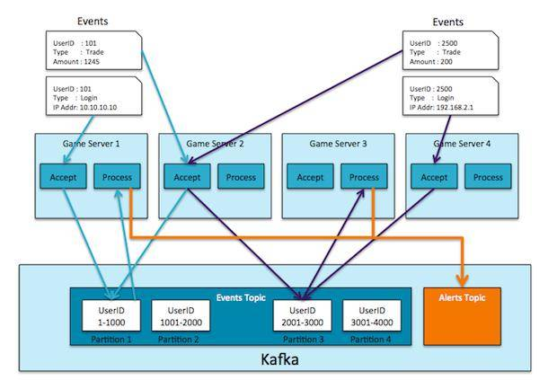

# Apache kafka 工作原理介绍
深入理解 Apache kafka 工作原理

**标签:** Apache Kafka,消息传递,游戏

[原文链接](https://developer.ibm.com/zh/articles/os-cn-kafka/)

周明耀

发布: 2015-06-10

* * *

## 消息队列

消息队列技术是分布式应用间交换信息的一种技术。消息队列可驻留在内存或磁盘上, 队列存储消息直到它们被应用程序读走。通过消息队列，应用程序可独立地执行–它们不需要知道彼此的位置、或在继续执行前不需要等待接收程序接收此消息。在分布式计算环境中，为了集成分布式应用，开发者需要对异构网络环境下的分布式应用提供有效的通信手段。为了管理需要共享的信息，对应用提供公共的信息交换机制是重要的。常用的消息队列技术是 Message Queue。

Message Queue 的通讯模式

1. 点对点通讯：点对点方式是最为传统和常见的通讯方式，它支持一对一、一对多、多对多、多对一等多种配置方式，支持树状、网状等多种拓扑结构。
2. 多点广播：MQ 适用于不同类型的应用。其中重要的，也是正在发展中的是”多点广播”应用，即能够将消息发送到多个目标站点 (Destination List)。可以使用一条 MQ 指令将单一消息发送到多个目标站点，并确保为每一站点可靠地提供信息。MQ 不仅提供了多点广播的功能，而且还拥有智能消息分发功能，在将一条消息发送到同一系统上的多个用户时，MQ 将消息的一个复制版本和该系统上接收者的名单发送到目标 MQ 系统。目标 MQ 系统在本地复制这些消息，并将它们发送到名单上的队列，从而尽可能减少网络的传输量。
3. 发布/订阅 (Publish/Subscribe) 模式：发布/订阅功能使消息的分发可以突破目的队列地理指向的限制，使消息按照特定的主题甚至内容进行分发，用户或应用程序可以根据主题或内容接收到所需要的消息。发布/订阅功能使得发送者和接收者之间的耦合关系变得更为松散，发送者不必关心接收者的目的地址，而接收者也不必关心消息的发送地址，而只是根据消息的主题进行消息的收发。
4. 群集 (Cluster)：为了简化点对点通讯模式中的系统配置，MQ 提供 Cluster(群集) 的解决方案。群集类似于一个域 (Domain)，群集内部的队列管理器之间通讯时，不需要两两之间建立消息通道，而是采用群集 (Cluster) 通道与其它成员通讯，从而大大简化了系统配置。此外，群集中的队列管理器之间能够自动进行负载均衡，当某一队列管理器出现故障时，其它队列管理器可以接管它的工作，从而大大提高系统的高可靠性。

## Apache Kafka 原理

Kafka 是一个消息系统，原本开发自 LinkedIn，用作 LinkedIn 的活动流（Activity Stream）和运营数据处理管道（Pipeline）的基础。现在它已被多家公司作为多种类型的数据管道和消息系统使用。活动流数据是几乎所有站点在对其网站使用情况做报表时都要用到的数据中最常规的部分。活动数据包括页面访问量（Page View）、被查看内容方面的信息以及搜索情况等内容。这种数据通常的处理方式是先把各种活动以日志的形式写入某种文件，然后周期性地对这些文件进行统计分析。运营数据指的是服务器的性能数据（CPU、IO 使用率、请求时间、服务日志等等数据)，总的来说，运营数据的统计方法种类繁多。

### Kafka 专用术语

- Broker：Kafka 集群包含一个或多个服务器，这种服务器被称为 broker。

- Topic：每条发布到 Kafka 集群的消息都有一个类别，这个类别被称为 Topic。（物理上不同 Topic 的消息分开存储，逻辑上一个 Topic 的消息虽然保存于一个或多个 broker 上，但用户只需指定消息的 Topic 即可生产或消费数据而不必关心数据存于何处）。

- Partition：Partition 是物理上的概念，每个 Topic 包含一个或多个 Partition。

- Producer：负责发布消息到 Kafka broker。

- Consumer：消息消费者，向 Kafka broker 读取消息的客户端。

- Consumer Group：每个 Consumer 属于一个特定的 Consumer Group（可为每个 Consumer 指定 group name，若不指定 group name 则属于默认的 group）。

### Kafka 交互流程

Kafka 是一个基于分布式的消息发布-订阅系统，它被设计成快速、可扩展的、持久的。与其他消息发布-订阅系统类似，Kafka 在主题当中保存消息的信息。生产者向主题写入数据，消费者从主题读取数据。由于 Kafka 的特性是支持分布式，同时也是基于分布式的，所以主题也是可以在多个节点上被分区和覆盖的。

信息是一个字节数组，程序员可以在这些字节数组中存储任何对象，支持的数据格式包括 String、JSON、Avro。Kafka 通过给每一个消息绑定一个键值的方式来保证生产者可以把所有的消息发送到指定位置。属于某一个消费者群组的消费者订阅了一个主题，通过该订阅消费者可以跨节点地接收所有与该主题相关的消息，每一个消息只会发送给群组中的一个消费者，所有拥有相同键值的消息都会被确保发给这一个消费者。

Kafka 设计中将每一个主题分区当作一个具有顺序排列的日志。同处于一个分区中的消息都被设置了一个唯一的偏移量。Kafka 只会保持跟踪未读消息，一旦消息被置为已读状态，Kafka 就不会再去管理它了。Kafka 的生产者负责在消息队列中对生产出来的消息保证一定时间的占有，消费者负责追踪每一个主题 (可以理解为一个日志通道) 的消息并及时获取它们。基于这样的设计，Kafka 可以在消息队列中保存大量的开销很小的数据，并且支持大量的消费者订阅。

## 利用 Apache Kafka 系统架构的设计思路

### 示例：网络游戏

假设我们正在开发一个在线网络游戏平台，这个平台需要支持大量的在线用户实时操作，玩家在一个虚拟的世界里通过互相协作的方式一起完成每一个任务。由于游戏当中允许玩家互相交易金币、道具，我们必须确保玩家之间的诚信关系，而为了确保玩家之间的诚信及账户安全，我们需要对玩家的 IP 地址进行追踪，当出现一个长期固定 IP 地址忽然之间出现异动情况，我们要能够预警，同时，如果出现玩家所持有的金币、道具出现重大变更的情况，也要能够及时预警。此外，为了让开发组的数据工程师能够测试新的算法，我们要允许这些玩家数据进入到 Hadoop 集群，即加载这些数据到 Hadoop 集群里面。

对于一个实时游戏，我们必须要做到对存储在服务器内存中的数据进行快速处理，这样可以帮助实时地发出预警等各类动作。我们的系统架设拥有多台服务器，内存中的数据包括了每一个在线玩家近 30 次访问的各类记录，包括道具、交易信息等等，并且这些数据跨服务器存储。

我们的服务器拥有两个角色：首先是接受用户发起的动作，例如交易请求，其次是实时地处理用户发起的交易并根据交易信息发起必要的预警动作。为了保证快速、实时地处理数据，我们需要在每一台机器的内存中保留历史交易信息，这意味着我们必须在服务器之间传递数据，即使接收用户请求的这台机器没有该用户的交易信息。为了保证角色的松耦合，我们使用 Kafka 在服务器之间传递信息 (数据)。

### Kafka 特性

Kafka 的几个特性非常满足我们的需求：可扩展性、数据分区、低延迟、处理大量不同消费者的能力。这个案例我们可以配置在 Kafka 中为登录和交易配置同一个主题。由于 Kafka 支持在单一主题内的排序，而不是跨主题的排序，所以我们为了保证用户在交易前使用实际的 IP 地址登录系统，我们采用了同一个主题来存储登录信息和交易信息。

当用户登录或者发起交易动作后，负责接收的服务器立即发事件给 Kafka。这里我们采用用户 id 作为消息的主键，具体事件作为值。这保证了同一个用户的所有的交易信息和登录信息被发送到 Kafka 分区。每一个事件处理服务被当作一个 Kafka 消费者来运行，所有的消费者被配置到了同一个消费者群组，这样每一台服务器从一些 Kafka 分区读取数据，一个分区的所有数据被送到同一个事件处理服务器 (可以与接收服务器不同)。当事件处理服务器从 Kafka 读取了用户交易信息，它可以把该信息加入到保存在本地内存中的历史信息列表里面，这样可以保证事件处理服务器在本地内存中调用用户的历史信息并做出预警，而不需要额外的网络或磁盘开销。

##### 图 1\. 游戏设计图

> 为了多线程处理，我们为每一个事件处理服务器或者每一个核创建了一个分区。Kafka 已经在拥有 1 万个分区的集群里测试过。

### 切换回 Kafka

上面的例子听起来有点绕口：首先从游戏服务器发送信息到 Kafka，然后另一台游戏服务器的消费者从主题中读取该信息并处理它。然而，这样的设计解耦了两个角色并且允许我们管理每一个角色的各种功能。此外，这种方式不会增加负载到 Kafka。测试结果显示，即使 3 个结点组成的集群也可以处理每秒接近百万级的任务，平均每个任务从注册到消费耗时 3 毫秒。

上面例子当发现一个事件可疑后，发送一个预警标志到一个新的 Kafka 主题，同样的有一个消费者服务会读取它，并将数据存入 Hadoop 集群用于进一步的数据分析。

因为 Kafka 不会追踪消息的处理过程及消费者队列，所以它在消耗极小的前提下可以同时处理数千个消费者。Kafka 甚至可以处理批量级别的消费者，例如每小时唤醒一次一批睡眠的消费者来处理所有的信息。

Kafka 让数据存入 Hadoop 集群变得非常简单。当拥有多个数据来源和多个数据目的地时，为每一个来源和目的地配对地编写一个单独的数据通道会导致混乱发生。Kafka 帮助 LinkedIn 规范了数据通道格式，并且允许每一个系统获取数据和写入数据各一次，这样极大地减少数据通道的复杂性和操作耗时。

LinkedIn 的架构师 Jay Kreps 说：“我最初是在 2008 年完成键值对数据存储方式后开始的，我的项目是尝试运行 Hadoop，将我们的一些处理过程移动到 Hadoop 里面去。我们在这个领域几乎没有经验，花了几个星期尝试把数据导入、导出，另外一些事件花在了尝试各种各样的预测性算法使用上面，然后，我们开始了漫漫长路”。

### 与 Flume 的区别

Kafka 与 Flume 很多功能确实是重复的。以下是评估两个系统的一些建议：

1. Kafka 是一个通用型系统。你可以有许多的生产者和消费者分享多个主题。相反地，Flume 被设计成特定用途的工作，特定地向 HDFS 和 HBase 发送出去。Flume 为了更好地为 HDFS 服务而做了特定的优化，并且与 Hadoop 的安全体系整合在了一起。基于这样的结论，Hadoop 开发商 Cloudera 推荐如果数据需要被多个应用程序消费的话，推荐使用 Kafka，如果数据只是面向 Hadoop 的，可以使用 Flume。
2. Flume 拥有许多配置的来源 (sources) 和存储池 (sinks)。然后，Kafka 拥有的是非常小的生产者和消费者环境体系，Kafka 社区并不是非常支持这样。如果你的数据来源已经确定，不需要额外的编码，那你可以使用 Flume 提供的 sources 和 sinks，反之，如果你需要准备自己的生产者和消费者，那你需要使用 Kafka。
3. Flume 可以在拦截器里面实时处理数据。这个特性对于过滤数据非常有用。Kafka 需要一个外部系统帮助处理数据。
4. 无论是 Kafka 或是 Flume，两个系统都可以保证不丢失数据。然后，Flume 不会复制事件。相应地，即使我们正在使用一个可以信赖的文件通道，如果 Flume agent 所在的这个节点宕机了，你会失去所有的事件访问能力直到你修复这个受损的节点。使用 Kafka 的管道特性不会有这样的问题。
5. Flume 和 Kafka 可以一起工作的。如果你需要把流式数据从 Kafka 转移到 Hadoop，可以使用 Flume 代理 (agent)，将 kafka 当作一个来源 (source)，这样可以从 Kafka 读取数据到 Hadoop。你不需要去开发自己的消费者，你可以使用 Flume 与 Hadoop、HBase 相结合的特性，使用 Cloudera Manager 平台监控消费者，并且通过增加过滤器的方式处理数据。

## 结束语

综上所述，Kafka 的设计可以帮助我们解决很多架构上的问题。但是想要用好 Kafka 的高性能、低耦合、高可靠性、数据不丢失等特性，我们需要非常了解 Kafka，以及我们自身的应用系统使用场景，并不是任何环境 Kafka 都是最佳选择。