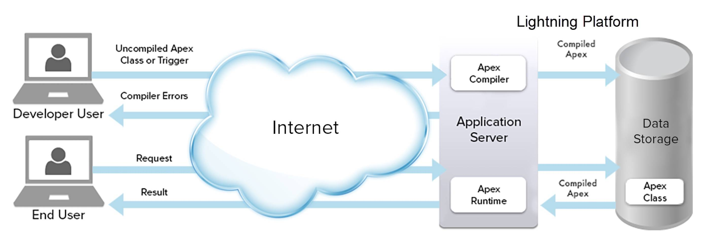
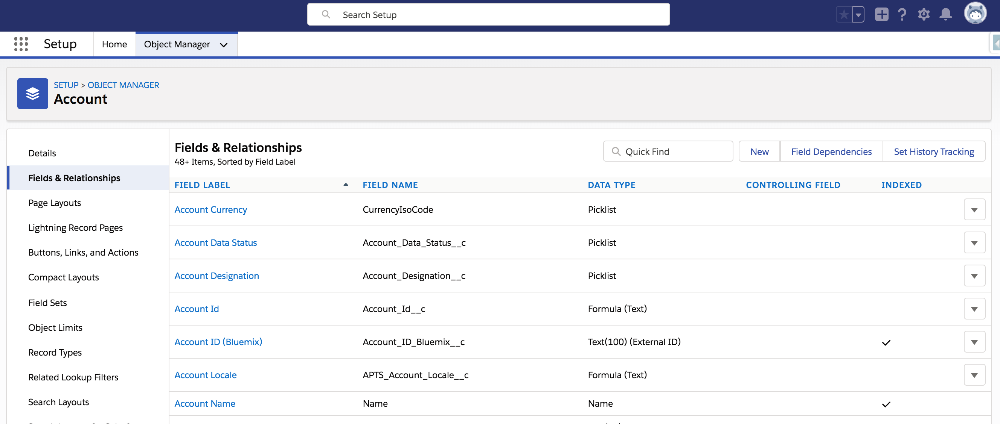
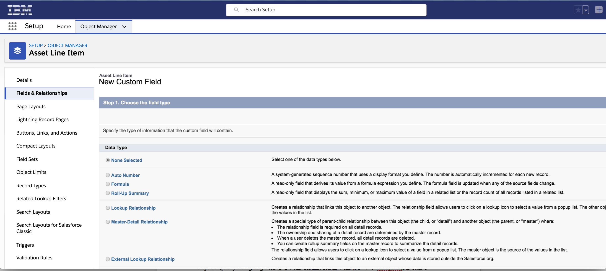

# Apex 基础知识合辑
快速入手 Salesforce Apex

**标签:** DevOps,Web 开发,数据库,软件开发

[原文链接](https://developer.ibm.com/zh/articles/wa-salesforce-development-2-apex/)

朱 晔, 李 宁超, 谢 文龙

发布: 2020-02-26

* * *

## 什么是 Apex

Apex 是一种类似于 Java 的强类型、面向对象编程语言。在 Apex 类中，语法上可定义方法、变量、静态代码块等，变量用于定义对象的属性，比如对象的名称或者类型，而方法用于定义对象的行为；业务上可将逻辑事件绑定到系统事件中，比如按钮的点击、数据的更新以及操作 Visualforce 页面等。定义好的 Apex 类可被其他类调用，或者作为 Web Service 通过 API 调用。

总的来讲，在 Salesforce 中，Apex 主要以两种形式存在：

- **以单独的脚本形式**，按照用户的需求、业务逻辑执行，可以理解为 Java 项目中的 controller 类。
- **以触发器 trigger 的形式**，trigger 作用于具体的 sObject（参考 “ [什么是 sObject](#什么是-sobject)“），当此 sObject 发生数据更变时就会触发作用于此 sObject 上的 trigger。

## Apex 语言特性

Apex 类和 Java 类相似，是创建对象的模版，具有以下语言特性：

- 面向对象，支持类的接口实现与类继承。
- 强类型，Apex 类在编译期会验证对对象的引用。
- 易测试，Apex 类为单元测试的创建，执行以及代码覆盖提供内置支持。
- Apex 的开发、编译以及执行在云中进行。
- 集成数据库，Apex 类可直接访问数据库记录，并且可以直接通过语句来增删改查。
- 触发器（Trigger），直接作用于对象，类似于数据库系统的触发器。
- Apex 支持对数据库的事务访问以及回滚。

## Apex 的工作模式

Apex 的工作模式主要是分为开发人员和用户，当开发人员成功提交并编译代码后，用户提出请求后触发 Apex 代码并返回结果，整个过程有两个操作序列，如图 1 所示：

##### 图 1\. Apex 工作模式



- **开发人员操作**：从图 1 可 以看出，开发人员编写的代码在 Apex Compiler 编译器编译过后，代码以元数据的形式存储在数据库中，等待用户触发执行。对于开发人员而言，编写好的未编译过的代码，首先提交到 Application Server，编译时验证代码是否正确，比如表名、字段名不匹配或者不存在等问题，然后服务器端会把编译结果返回到开发人员终端（Salesforce 的 developer console 或者本地的 IDE），开发人员收到结果后重新审核代码。

    从图 1 还 可以看出，Application Server 上除了编译器之外还有运行期，代码运行期发生的错误是指程序通过了编译没有发生错误，但是程序执行时发生了异常，语法本身没有错，是逻辑上出现了问题。比如代码中需读取配置文件，但是此配置文件丢失了，因为语法上并没有错误，所以通过了编译期，但是代码触发时，却找不到此文件，就会出现运行错误。运行时错误主要会涉及空指针异常、数组下标越界、内存溢出等，这个时候开发人员就需要重新审核业务逻辑后，重新部署代码。

- **用户操作**：当用户提出请求并最终触发 Apex 代码执行时，比如访问 Visualforce 页面后在页面上执行按钮点击事件，平台应用程序服务器从元数据检索编译指令并执行。


## Apex 语法介绍

现在您已经初步了解到 Apex 的基本知识并对于 Apex 的工作模式也有了一定的了解。本章主要是介绍 Apex 的语法，包括基本数据类型、集合与数据流程控制语句以及数据操作三部分内容。总体来看，Apex 与 Java 具有很多相似之处，所以如果已经熟悉 Java 的话，对于学习 Apex 有很大的帮助。

### 常见的数据类型

Apex 的数据类型分为很多种，以下是几种常用的数据类型：

- String：用单引号引起来的一组字符的组合，一般用来存储文本信息，如名称、邮箱等内容。
- Date/DateTime/Time：一般用来表示日期，其中 Date 用来表示只需要显示日期的值，Time 用来表示时间信息的值，DateTime 用来表示需要显示日期和时间信息的值。
- Integer/Long/Double/Decimal：一般都是用来表示数值的类型。
- Enum：一般用来列举一个变量的几个不同的取值。

#### String 类型

String 类型主要用来存储文本信息，它使用单引号将一组字符包围起来。在 Apex 中我们可以创建一个单引号包围的字符串，然后将它赋值给一个 String 类型的变量，如下所示：

```
String testString = 'just for testing string' ;

```

Show moreShow more icon

除了上面这种方式，我们也可以将其他的类型转变为 String 类型，通过执行 String 类自带的静态 `valueOf()` 方法可以将其他类型变为 String 类型：

```
Integer a = 1;
String testVariable = String.valueOf(a);
System.debug(testVariable);

```

Show moreShow more icon

String 类型的数据还支持 `+` 运算符的操作，如下所示，两个字符串通过 `+` 运算符拼接在一起就成为了一个新的字符串 `'you and'`。

```
String a = 'you';
String b = 'and';
System.debug(a + b);

```

Show moreShow more icon

String 类型的数据对于 `==` 和 `!=` 两种运算符是大小写不敏感的，比如下面示例中的结果将会返回 `true`。

```
String a = 'you';
String b = 'YOU';
System.debug( a == b );

```

Show moreShow more icon

String 类型也包括很多实例方法来处理字符串数据，常用的方法如表 1 所示。

##### 表 1\. String 部分实例方法

**方法名称****用法**`length()`判断一个目标字符串的长度。`substring(para1, para2)`系统会对于目标字符串进行截取，产生一个从 para1 位置到 para2 截止的一个新的字符串，其中 `para1` 和 `para2` 的计数是从 `0` 开始。`replaceAll(para1,para2)`全部替换目标字符串中的 `para1` 为 `para2`。`endsWith(para)`对于目标字符串的结尾进行判断，如果与 `para` 一致就返回 `true`，否则返回 `false`。

#### Date/Datetime/Time 类型

Date/Datetime/Time 这三种类型都是与时间有关系的数据类型，其中 Date 类型用来表示只有年、月、日的日期时间，Time 类型用来表示只有时、分、秒、毫秒的时间，Datetime 类型则是对于 Date 与 Time 进行结合展示。Date/Datetime/Time 三种类型都有 `newInstance()` 方法来构造指定的时间，具体如下所示：

```
Date myDate = Date.newinstance(1990, 2, 14);
Time myTime = Time.newInstance(16, 29, 1, 10);

```

Show moreShow more icon

我们也可以获取到当前时间的上述三种类型的信息：

```
Datetime myDateTime = Datetime.now();
Date today = Date.today();

```

Show moreShow more icon

对于 Date 类型的数据可以通过 `time()` 来转化为 Time 类型的时间：

```
Time t = DateTime.now().time();

```

Show moreShow more icon

对于 Date/Time/Datetime 类型具有很多实例方法，比如 Datetime 含有 `addDays()`、`addHours()`、`addMinutes()`、`dayOfYear()`、`timeGMT()` 等方法用来改变时间数据信息，其中 `addDays()` 方法示例如下：

```
Date myToday = Date.today();
Date myNext30 = myToday.addDays(30);

```

Show moreShow more icon

#### Integer/Long/Double/Decimal 类型

如果想要在 Apex 中存储数值变量信息，就需要将变量声明成 Integer/Long/Double/Decimal 类型的数据。

- Integer：表示一个 32 位的不包括小数点的带符号的数值，范围是 -231 ~ 231-1。
- Long：表示一个 64 位的不包括小数点的带符号的数值，范围是 -263 ~ 263-1。
- Double：表示一个 64 位的包括小数点的带符号的数值，范围与 Long 类型一致。
- Decimal：表示一个具有任意精度的带有小数点的并且带符号的数值，当变量需要用到精确的数字信息的时候可以使用 Decimal 类型，它可以在一定范围内不存在数据精度缺失的情况，货币信息会自动默认为 Decimal 类型数据。

这四种类型的具体声明信息如下所示：

```
Integer i = 0;
Long l = 2147483648L;
Double d = 56.89007;
Decimal dec = 24.908;

```

Show moreShow more icon

我们也可以使用 `ValueOf()` 的静态方法来实现 String 类型与数值类型的转换，例如从 String 类型变为 Integer 类型：

```
Integer count = Integer.valueof('30');

```

Show moreShow more icon

Decimal 类中有大量的用于操作数值的实例方法，其中 `Scale` 方法用来表示 Decimal 数据类型的小数位数，`divide()` 方法则用来表示除法操作，并且注意第一个参数为除数，第二个参数为小数点的位数，具体用法如下所示：

```
Decimal decBefore = 20.34;
Decimal decAfter = decBefore.Divide(1000, 4);

```

Show moreShow more icon

#### Enum 类型

枚举可以用来指定一组常量信息，主要构成是 `enum` 关键字以及花括号之间的标识符列表组成。枚举中的每一个值都会具有对应的整型数值，一般从 0 开始，从左到右依次递增，标识符都是大写的。例如定义一个 `direction` 的枚举，这个枚举主要包括东南西北四个方向，具体如下所示：

```
public enum Direction {WEST, NORTH, SOUTH, EAST} ;

```

Show moreShow more icon

其中 `WEST` 代表 0，`NORTH` 代表 1，`SOUTH` 代表 2，`EAST` 代表 3。当我们定义好枚举后就可以将它作为变量的数据类型来使用：

```
Season s = Season.NORTH;
if (s == Season.NORTH) {
     System.debug(s);
}

```

Show moreShow more icon

除了可以创建供自己使用的枚举之外，Apex 还提供了内置枚举，比如 `System.LoggingLevel`，用于指定 `System.debug` 方法的调试输出的日志记录级别。与 Java 的枚举不同，Apex 枚举类型没有构造函数。

### 流程控制与集合

#### List/Set/Map

Apex 的集合主要包括 List/Map/Set，其中 List 是一个具有索引的对象集合，如果存储的是基础类型数据还支持排序的功能例如 Integer、String 等，如果数据想存储在一个可以具有索引的集合则可以使用 List，同时 Apex 的 SOQL 查询（参考 “ [SOQL 和 SOSL 查询](#soql-和-sosl-查询)“）语句返回的结果也是 List 集合。

**List 集合** 的索引从零开始计算，所以在遍历 List 时需要从零开始遍历。创建 List 并且获取 List 集合的长度的方法如下所示：

```
List<Integer> testList = new List<Integer>();
System.debug(testList.size());

```

Show moreShow more icon

List 集合的元素也可以在创建时就初始化：

```
List<String> testList = new List<String> {'you', 'and'};

```

Show moreShow more icon

List 集合添加元素使用 `add()` 方法，获取元素可以使用索引来进行获取某一个特定位置的元素，索引支持 `get(int index)` 方法也支持数组下标的方式，如果想要遍历整个 List 集合还可以通过 for 循环来遍历：

```
List<String> testList = new List<String> {'you', 'and'};
testList.add('i');
String test = testList.get(0);
String test1 = testList[0];
for(String test : testList){
    System.debug(test);
}

```

Show moreShow more icon

**Set 集合** 是一个没有顺序的元素集合，集合内的元素不能重复，Set 集合内元素不支持排序。创建 Set 集合并且添加元素的方法如下所示：

```
Set<String> s = new Set<String>{'a','b','c'}; // 因为 c 已经存在，所以在添加时，集合内元素不会变化
s.add('c');

```

Show moreShow more icon

**Map 集合** 是一个 Key-Value 的键值对，其中 Key 值的类型是基础数据类型，Key 和 Value 是一组相对的值存储在 Map 集合里面，当需要获取 Value 值时则需要通过 Key 值来进行获取。我们可以创建一个班级学生学号与姓名的 Map 结合，学号作为 Key，姓名作为 Value，具体如下所示：

```
Map<Integer,String> stuIdNameMap = new Map<Integer,String>();
stuIdNameMap.put (1, 'alan');
stuIdNameMap.put (2, 'ye');

```

Show moreShow more icon

#### 循环

为了重复执行一段代码，则需要用到循环，在 Apex 中的循环主要包括 while、do-while 和 for 三种循环。

**While(condition) 循环** 只要 condition 永远返回 `true`，则可以一直循环执行 while 循环代码块，具体如下所示：

```
Integer num = 1;
while (num < 10) {
    System.debug(num);
      num++;
}

```

Show moreShow more icon

**Do-while** 循环和 while 循环类似，只要 while(condition) 中的 condition 永远返回 `true`，就可以一直循环执行 `do` 的代码块，具体如下所示：

```
Integer num = 1;
do{
     System.debug(num);
     num++;
}while (num < 10);

```

Show moreShow more icon

其中 while 与 do-while 的最大区别就是无论是否满足 while(condition) 的 condition 是否为 `true`，do-while 都会执行一次 `do` 代码块，但是 while 则一次也不会执行。

**For 循环** 主要分为三种类型:

第一种 for 循环是使用索引来进行数据的遍历：

```
for (Integer i = 1; i <= 10; i++){
       System.debug(i);
}

```

Show moreShow more icon

第二种 for 循环是使用数据类型来进行遍历，主要用于遍历集合数据：

```
List<Integer> testList = new List<Integer>{1,2,3,4,5,7};
for(Integer test : testList){
System.debug(test);
}

```

Show moreShow more icon

第三种 for 循环是使用被查询 sObject 对应的数据类型直接遍历 Apex 对于对应 sObject 的查询语句结果：

```
for (Account acc : [SELECT Id FROM Account]) {
    // 对于单独一条acc记录进行操作
}

```

Show moreShow more icon

#### If-else/Switch

If-else 语句 作为判断语句，主要对于程序的某一个或者几个条件进行综合判断，如果满足则走满足的分支，如果不满足则会走 else 的分支，这样就实现了程序流程的不同分支，具体实现如下所示：

```
Integer i = 0;
if(i = 0){
System.debug(i);
}else{
System.debug('not match');
}

```

Show moreShow more icon

**Switch 语句** 与 If-else 语句类似，都是作为判断语句，主要对于程序的条件进行判断，如下 `switch` 语句的语法所示，`switch` 语句主要是对于 `expression` 进行判断，如果与 value1 匹配则执行代码块 1。

```
switch on expression {
    when value1 {    // when block 1
          // code block 1
        }
    when value2 {    // when block 2
          // code block 2
        }
    when value3 {     // when block 3
          // code block 3
        }
     when else {       // default block, optional
          // code block 4
        }
}

```

Show moreShow more icon

Switch 语句中的 value 值可以是单一的值，也可以是多个值，类型也可以是 sObject 类型，`expression` 的返回类型必须是 Integer、Long、sObject、String、Enum 中的一种，所以 `expression` 可以是变量或是方法，具体实现如下所示：

```
switch on i {
    when 2 {
        System.debug('when block 2');
      }
    when null {
        System.debug('bad integer');
      }
    when else {
        System.debug('default ' + i);
      }
}

```

Show moreShow more icon

### 数据操作

#### 什么是 sObject

Apex 与 Force.com 持久层数据库紧密集成，sObject 是存储在 Force.com 平台数据库中的任意对象，而非 Apex 类实例化的对象。我们可以将 sObject 看作数据库中的表，sObject 中的字段则是表结构中字段。如图 2 所示：

##### 图 2\. Account 字段



#### sObject 关联关系

Salesforce 中对象之间的关联关系，主要有 Lookup 弱关联关系和 Master-Detail 强关联关系。在 Object 上创建字段时，会提醒开发人员选择字段的类型，是否为关系字段。如图 3 所示：

##### 图 3\. 新建字段



- Lookup Relationship 是创建字段将此对象关联到另一个对象上，类似于表结构中的表关联，关联字段允许用户单击，链接跳转到其关联的对象上。查找关联关系可以用创建一对一和一对多的关系。
- Master-Detail Relationship 是主从关联关系，又称父子关系，这种类型的关系紧密地将对象关联在一起。在主从关系中，子对象的权限完全由父对象控制，并且如果删除父对象的记录 ， 其相关联的子对象记录会全部删除，而在 Lookup 关系中则不会存在这种现象。

#### SOQL 和 SOSL 查询

由于 Apex 与数据库集成，因此可以在 Apex 中直接编写查询语句。SOQL 是 Salesforce Object Query Language 的缩写，是对象查询语言，适用于单个 sObject 及其相关 sObject 的数据检索查询 ， 比如：

```
sObject account = [SELECT Id,Name from Account limit 1];
System.debug('account:'+account);

```

Show moreShow more icon

SOSL 是 Salesforce Object Search Language 的缩写，是对象搜索语言，适用于同时搜索多个 sObject。SOSL 查询的结果是对象集合的集合。如下查询，在 `Account` 和 `User` 这两个 sObject 中查询所有字段，查询条件是字段中包含 ‘xie’ ，故返回的数据集中包含一个 `Account` 的集合和一个 `User` 的集合。

```
List<List< SObject>> searchList = [FIND 'xie' IN ALL FIELDS RETURNING
Account (Id, Name),User(name)];
List<Account> accountList = searchList.get(0);
List<User> userList = searchList.get(1);
System.debug('accountList'+accountList);

```

Show moreShow more icon

#### DML 操作

DML 是 Data Manipulation Language 的缩写，是数据操作语言，适用于数据库中插入、更新、删除或还原数据。

- **Insert**：将一个或多个 sObject（如客户、联系人）添加到系统中。 如下代码插入一个新的 Account ：


    ```
    Account newAcct = new Account(name = 'Acme');
    try {
    insert newAcct;
    } catch (DmlException e) {
    // Process exception here
    }

    ```


    Show moreShow more icon

- **Update**：在系统的数据中修改一个或多个现有的 sObject 记录，如用户、客户。如下代码更新一个 `Account`：


    ```
    Account a = new Account(Name='Acme2');
    insert(a);

    Account myAcct = [SELECT Id, Name, BillingCity FROM Account WHERE Id = :a.Id];
    myAcct.BillingCity = 'San Francisco';

    try {
        update myAcct;
    } catch (DmlException e) {
        // Process exception here
    }

    ```


    Show moreShow more icon

- **Upsert**：在系统中创建或者依据某个字段来更新系统内已经存在的数据，如果未指定根据某个字段 upsert，那么系统会默认根据 `Id` 字段进行匹配。对于自定义对象需要指定 External ID 字段作为 upsert 依据；对于系统标准对象可以指定任意带着索引查询的字段为 upsert 依据。


    - 如果根据匹配字段未能匹配到系统存在的记录，执行 insert 操作。
    - 如果根据匹配字段找到唯一匹配的记录存在，执行 update 操作。
    - 如果根据匹配字段找到多条系统中存在的记录，会出现异常，既不 update 数据也不 insert 数据。


    ```
    List<Account> acctList = new List<Account>();
    // Fill the accounts list with some accounts
    try {
    // Upsert using an external ID field
    upsert acctList myExtIDField__c;
    } catch (DmlException e) {
    }

    ```


    Show moreShow more icon

- **Delete**：执行数据库中记录的删除操作。如下所示：


    ```
    Account[] accts = [SELECT Id, Name FROM Account
    WHERE Name = 'Test'];
    try {
    delete accts;
    } catch (DmlException e) {
    // Process exception here
    }

    ```


    Show moreShow more icon

- **Undelete**：用于取消删除已经删除的并存在于回收站中的记录，并此记录具有的关联关系也会被恢复。如下所示：


    ```
    Account[] savedAccts = [SELECT Id, Name FROM Account WHERE Name = 'Test' ALL ROWS];
    try {
    undelete savedAccts;
    } catch (DmlException e) {
    // Process exception here
    }

    ```


    Show moreShow more icon

- **Merge**：将最多三个相同 sObject 类型的记录合并到其中一个记录中，删除其他记录。如下代码将两条 `Account` 记录进行 merge，其中 `masterAcct` 代表需要保留的 `Account` 主记录；`mergeAcct` 表示需要被 merge 的 `Account` 记录，当被执行 merge 操作后，会被删除。


    ```
    List<Account> ls = new List<Account>{new Account(name='Acme Inc.'),new
    Account(name='Acme')};
    insert ls;
    Account masterAcct = [SELECT Id, Name FROM Account WHERE Name = 'Acme Inc.' LIMIT
    1];
    Account mergeAcct = [SELECT Id, Name FROM Account WHERE Name = 'Acme' LIMIT 1];
    try {
    merge masterAcct mergeAcct;
    } catch (DmlException e) {
    // Process exception here
    }

    ```


    Show moreShow more icon


## Apex 代码简单应用

常见的 Apex 类型包含 Trigger、Schedule Job、Batch、REST Service、Test Class、Batch 等，下面对于上述几种 Apex 类型的简单应用进行描述。

### Apex Trigger 应用

Apex Trigger 主要在某一个对象的记录在更改之前或者更改之后自动执行的一些列操作，其中更改操作包括插入、修改和删除等，注意每个 trigger 都必须对应一个对象。

#### Tigger 中封装的变量

Trigger 类中封装了很多的上下文的变量，这些变量在开发中经常用到。

- `isExecuting`：当前 Apex 代码的上下文环境 是否为 trigger 环境，是 返回 `true`，否则返回 `false`。
- `isInsert`：当前操作是否为正在执行添加操作，是 返回 `true`，否则返回 `false`。
- `isUpdate`：当前操作是否为正在执行修改操作，是返回 `true`，否则返回 `false`。
- `isDelete`：当前操作是否为正在执行删除操作，是返回 `true`，否则返回 `false`。
- `isBefore`：当前操作是否为在 save 以前操作，是返回 `true`，否则返回 `false`。
- `isAfter`：当前操作是否为在 save 以后操作，是返回 `true`，否则返回 `false`。
- `isUndelete`：当前操作是否为在回收箱中回复数据以后操作，是返回 `true`，否则返回 `false`。
- `new`：返回 sObject 的记录的最新的数据的列表。
- `newMap`：返回一个 ID 映射到最新的数据列表的 Map 集合。
- `old`：返回 sObject 的记录修改以前的数据的列表。
- `oldMap`：返回一个 ID 映射到修改以前的数据列表的 Map 集合。
- `size`：在触发器中调用的数据总数，包括 `new` 和 `old`。

注意：`new` 只适用于执行 insert 和 update 的 trigger 操作时并且类型为 before 的时候，才可以使用 new 返回列表; `newMap` 只适用于 before update、after insert 以及 after update 的 trigger 操作时，才可以使用 `newMap` 返回 map 集合; `old` 以及 `oldMap` 只适用于 update 和 delete 操作时，才可以使用 `old` 以及 `oldMap`。

#### Trigger 的简单应用

当在系统中创建一个 `Account` 后，自动 insert 一条 `opportunity` 记录与当前 `Account` 进行关联，生成的 opportunity 的关闭日期要求是 `Account` 创建一个月之后。如下所示：

```
trigger AddRelatedRecord on Account(after insert, after update) {
    List<Opportunity> insertOppList = new List<Opportunity>();
    // 获取到所有的处于 Trigger 中的 Account 与所有的 Opportunity 子集合
    Map<Id,Account> acctsWithOpps = new Map<Id,Account>(
        [SELECT Id,(SELECT Id FROM Opportunities) FROM Account WHERE Id IN : Trigger.New]);
    // 给 Account 生成新的 Opportunity 并与之相关联
    for(Account a : Trigger.New) {
        // 检查是否已经存在 Opp
        if (acctsWithOpps.get(a.Id).Opportunities.size() == 0) {
            insertOppList.add(new Opportunity(Name=a.Name + ' Opportunity',
                            CloseDate=System.today().addMonths(1),
                            AccountId=a.Id));
        }
    }
    if (!insertOppList.isEmpty()) {
        insert insertOppList;
    }
}

```

Show moreShow more icon

#### Trigger 的调用

调用上述 trigger 的方式有很多种，可以通过执行在 `Account` 上的 DML（insert，update) 语句来实现，又或者通过 Salesforce 中的图形化界面，填入必填信息后，点击 **保存** 按钮，同样也可以调用 trigger。无论何种方式调用，当一条新的 `Account` 记录保存到数据库中后，一定有一条与当前 `Account` 相关联的 opportunity 同时保存到数据库中。

### Apex Schedule Job 应用

Apex Schedule 可以在指定时间执行。但是因为 Salesforce 服务器资源分配，所以实际执行可能会根据服务可用性而延迟。

#### Apex Schedule 的特点

以下是 Apex Schedule 的一些特点：

- 若要调用 Apex 类以在特定时间运行，首先实现该类的 Schedulable 接口：`global class Demo implements Schedulable {}`。
- 必须包含 `execute` 方法。
- 对于 Schedule Job 来说无论用户是否具有执行类的权限， Salesforce 调度程序都会在系统执行所有类时运行。
- Schedule Job 的 class 必须使用 public 或者 global 修饰符来修饰。
- 一次只能有 100 个预定的 Apex 作业。可以通过查看 Salesforce 中的 Scheduled Jobs 页面创建一个类型过滤器等于 Scheduled Apex 的自定义视图来查看计数；还可以通过编程方式查询 `CronTrigger` 和 `CronJobDetail` 对象，以获取 Apex 调度作业的计数。

#### Schedule Job 的简单应用

每天下午 5 点执行系统中指定代码逻辑，需要创建一个 `DataFactory` Class，然后通过配置 Schedule Job 的执行时间或者通过 System.Schedule 来指在什么时间执行。

```
global class scheduledMerge implements Schedulable
{
    global void execute(SchedulableContext SC)
    {
        // 获取到所有的处于 Trigger 中的 Account 与所有的 Opportunity 子集合
        DataFactory factory = new DataFactory();
        factory.execute();
    }
}

```

Show moreShow more icon

#### Schedule Job 的两种执行方式

- **Apex Scheduled**：配置 Schedule Job 的执行时间，这种方式存在局限性，只能配置在整点执行的 Schedule Job，例如，每天下午 5:35 分执行，通过这种方式是不能配置成功的。
- **System.Schedule**：可以指定 Schedule Job 的执行时间或者间隔多久执行一次，此种方法灵活多变，可以满足复杂的业务场景。Schedule 方法有三个参数：作业的名称、用于表示作业计划运行的时间和日期的表达式以及类名。

#### 执行时间的表达式

```
(Seconds,Minutes,Hours,Day_of_month,Month,Day_of_week,Optional_year)

```

Show moreShow more icon

##### 表 2\. 表达式含义

**名称****取值****特殊符号**`Seconds`0–59None`Minutes`0–59None`Hours`0–23None`Day_of_month`1–31`, - * ? / L W``Month`1-12 或者：JAN，FEB，MAR，APR，MAY，JUN，JUL，AUG，SEP，OCT，NOV，DEC`, - * /``Day_of_week`1-7 或者：SUN，MON，TU ，WED，THU，FRI，SAT`, - * ? / L #``optional_year`null 或者 1970–2099`, - * /`

##### 表 3\. 特殊符号含义解读

**特殊符号****描述**`,`限定多个值。例如：JAN, MAR, APR 而不是仅仅执行某一个月。`-`范围指定。例如：使用 JAN-MAR 指定月份的范围区间。`*`指定所有值。例如：如果将 Month 指定为 `*`，则表示每个月都会执行当前作业。`?`未指定特定值。这仅适用于 `Day_of_month` 和 `Day_of_week`，通常用于为一个值而不是另一个值指定值。`/`指定增量。斜线前的数字指定间隔的开始时间，斜线后的数字是间隔量。例如，如果指定 1/5 作为 `Day_of_month`，则 Apex 类从每月的第一天开始，每五天运行一次。`L`指定范围的结尾（最后一个）。这只适用于 `Day_of_month` 和 `Day_of_week`。当与 Day\_of\_month 一起使用时，L 总是指月的最后一天，例如闰年的 1 月 31 日、2 月 29 日等等。单独使用 `Day_of_week` 时，它始终表示 7 或 SAT。与`Day_of_week` 值一起使用时，它表示该月中该类型的最后一天。例如，如果指定 2L，则指定的是每月的最后一个星期一。`W`指定给定日期中最近的工作日（星期一 – 星期五）。这只适用 `Day_of_month`。例如，如果指定 20W，并且 20 号是星期六，则该类在 19 号运行。如果指定 1W，并且第一个星期六，则该类不会在上个月运行，而是在下个星期一的第三个月运行。`#`指定一个月的第 n 天。

##### 表 4\. 表达式示例说明

**表达式****描述**`0 0 13 * * ?`在每天 1PM 执行 。`0 0 22 ? * 6L`每个月的最后一个星期五 10PM 执行 。`0 0 10 ? * MON-FRI`星期一到星期五上午 10AM 执行 。

### Apex Batch 应用

Batch 用于处理大型作业，例如数千或数百万条记录，其特点是将数据自动分批处理，并且每批次处理的数据量可以通过调用者进行特殊指定。此外，如果一个批处理无法成功处理，则不会回滚所有其他成功的批处理事务。

#### Batch 的三个方法

- Batch 需要实现 Database.Batchable 接口，并且 batch class 需要包含以下三个方法：
    - `start`：进行数据查询，查询出所有需要处理的数据等待处理。
    - `execute`：将数据按照批次进行处理，处理数据的逻辑将在此方法中实现。
    - `finish`： 等到 `start` 方法查询到的所有数据在 execute 方法中全部处理完成后，执行 `finish` 方法，可以在此方法中做一些总结的逻辑。
- 一个 Batch 中可以处理 5000 万的数据量，也就是 `start` 方法中返回的数据量可以达到 5000 万条数据。
- 默认情况下 Batch 执行 `execute` 方法的时候，数据按照 200 的批次重复执行，如果需要改变这个批次（1-200） 。

#### Batch 的简单应用

根据 Account 上的 Billing 数据更新所有的对应的 Contacts，并通过邮件的方式通知多少条数据被成功 update。如下代码：

```
global class UpdateContactAddresses implements Database.Batchable<sObject>, Database.Stateful {
    // instance member to retain state across transactions
    global Integer recordsProcessed = 0;
    global Database.QueryLocator start(Database.BatchableContext bc) {
        return Database.getQueryLocator(
            'SELECT ID, BillingStreet, BillingCity, BillingState, ' +
            'BillingPostalCode, (SELECT ID, MailingStreet, MailingCity, ' +
            'MailingState, MailingPostalCode FROM Contacts) FROM Account ' +
            'Where BillingCountry = \'USA\''
        );
    }
    global void execute(Database.BatchableContext bc, List<Account> scope){
        // process each batch of records
        List<Contact> contacts = new List<Contact>();
        for (Account account : scope) {
            for (Contact contact : account.contacts) {
                contact.MailingStreet = account.BillingStreet;
                contact.MailingCity = account.BillingCity;
                contact.MailingState = account.BillingState;
                contact.MailingPostalCode = account.BillingPostalCode;
                contacts.add(contact);
                // increment the instance member counter
                recordsProcessed = recordsProcessed + 1;
            }
        }
        update contacts;
    }
    global void finish(Database.BatchableContext bc){
        System.debug(recordsProcessed + ' records processed. Shazam!');
        AsyncApexJob job = [SELECT Id, Status, NumberOfErrors,JobItemsProcessed,TotalJobItems, CreatedBy.Email
            FROM AsyncApexJob
            WHERE Id = :bc.getJobId()];
        // call some utility to send email
        EmailUtils.sendMessage(job, recordsProcessed);
    }
}

```

Show moreShow more icon

#### Batch 的执行

- 要调用批处理类，只需将其实例化，然后使用实例调用 `Database.executeBatch`：


    ```
    UpdateContactAddresses myBatch = new UpdateContactAddresses();
    Id batchId = Database.executeBatch(myBatch);

    ```


    Show moreShow more icon

- 如果需要指定 batch 的执行批次，只需要在执行 batch 的时候增加一个参数：


    ```
    UpdateContactAddresses myBatch = new UpdateContactAddresses();
    Id batchId = Database.executeBatch(myBatch,100);

    ```


    Show moreShow more icon


### Apex REST Service 应用

可以通过 REST Service 的方式向外部应用程序暴露接口，来提供服务。

#### 使用注解定义 REST Service

Apex REST Service 通过注解的方式可以快速定义一个 REST Service 服务。注解必须在类级别使用，能够将 Apex 类公开为 REST 资源。 若要使用这些注解, 则必须将 Apex 类使用 global 修饰符进行修饰。

- `@RestResource(urlMapping='/yourUrl')`
- `@HttpDelete`
- `@HttpGet`
- `@HttpPatch`
- `@HttpPost`
- `@HttpPut`

通过 HTTP header 中的 Content-Type 来指定 Body 中的格式（multipart/form-data 目前还不被支持） 。 对于 XML 格式不支持序列化和反序列化操作，但是支持 JSON 格式的序列化和反序列化操作。

#### REST Service – HttpPost 的简单应用

下面主要以 post 请求为例进行代码展示，并且对于 JSON 和 XML 两种请求 body 进行对比。

```
@RestResource(urlMapping='/MyRestResource/*')
global with sharing class MyRestResource {
    @HttpPost
    global static MyUserDefinedClass echoMyType(MyUserDefinedClass ic) {
        return ic;
    }
    global class MyUserDefinedClass {
        global String string1;
        global String string2 { get; set; }
    }
}

```

Show moreShow more icon

**JSON 请求 Body**

```
{
    "ic": {
        "string1": "value for string1",
        "string2": "value for string2"
    }
}

```

Show moreShow more icon

**XML 请求 Body**

```
<request>
    <ic>
        <string1>value for string1</string1>
        <string2>value for string2</string2>
    </ic>
</request>

```

Show moreShow more icon

#### JSON 序列化和反序列化的应用

- 将指定的 JSON 字符串反序列化为指定类型的 Apex 对象：


    ```
    Decimal n = (Decimal)JSON.deserialize('100.1', Decimal.class);
    System.assertEquals(n, 100.1);

    ```


    Show moreShow more icon

- 序列化一个新的 Datetime 值 ：


    ```
    Datetime dt = Datetime.newInstance(Date.newInstance(2011, 3, 22),Time.newInstance(1, 15, 18, 0));
    String str = JSON.serialize(dt);
    System.assertEquals('"2011-03-22T08:15:18.000Z"',str);

    ```


    Show moreShow more icon


### Apex Test Class 应用

测试是成功的关键，也是开发过程的关键组成部分，Apex 测试框架允许在 Salesforce 平台上为 Apex 类和 Trigger 等编写和执行测试。Apex 单元测试确保 Apex 代码的高质量， 并且能够满足部署 Apex 的要求 。

#### Test Class 的特点

- Apex 代码只能在沙箱环境或开发人员组织中编写，不能在生产环境中编写。Apex 代码可以从沙箱部署到生产组织。
- 确保 Apex 类和 Trigger 等按预期结果工作。
- 有一套回归测试，每次测试都可以重新运行，并更新触发器，以确保对应用程序的未来更新不会破坏现有功能。
- 将 Apex 部署到生产环境的代码覆盖率需要满足条件。
- 交付高质量的应用程序，这使得生产用户的生产效率更高。
- 每个测试类中的测试方法应该至少包含一个以上的断言：`System.assert(condition,msg)/System.assertEquals(expected,actual,mag)`。

#### Test Class 的简单应用

Apex Code 覆盖率必须达到 75%，并且 Trigger 一定要被测试类覆盖，否则不能将 Apex Code 部署到生产环境上。两种测试类写法的对比如下：

**示例 1**

```
@isTest
private class MyTestClass {
    @isTest static void myTest() {
        // code_block
    }
}

```

Show moreShow more icon

**示例 2**

```
@isTest
private class MyTestClass {
    static testMethod void myTest() {
        // code_block
    }
}

```

Show moreShow more icon

测试不同的输入以确保代码的质量很重要。虽然不可能验证每个数据点，但是可以测试公共数据点和不同的输入范围。例如，可以传递正数 、负数、边界值和无效参数值 等来验证执行结果。

#### Test Class 的执行

- 使用开发工具运行 Apex Test Class，例如 VSCode，在 Test Class 中单击 **run test button**。这样运行测试类快捷方便，加快开发进程。
- 使用 Developer Console 运行 Apex Test Class，在 Developer Console 上单击 **test** 选项卡，然后单击 **测试\|重新运行**。

当测试类执行完毕后，可以通过 Developer Console 中的 **Test Run** 窗口查看是否通过，以及每个 Apex 的 code coverage。

## 结束语

本文主要从工作模式、语法及数据操作等方面介绍了 Apex 的基础知识，并且对于平台上的一些基础知识及应用场景进行了整合及简要剖析，为初级 Salesforce 开发人员提供可参考的中文文档，能帮助 初级 Salesforce 开发者快速入门并能在项目中实际应用。

在文章的最后，特别感谢我们的同事王芳对本文的前期指导和后期细心的审阅校对。