# Archived | 使用 python 开发 Web Service
python 上手

**标签:** Python,Web 开发

[原文链接](https://developer.ibm.com/zh/articles/os-cn-pythonws/)

刘明, 陈华泉

发布: 2008-02-28

* * *

**本文已归档**

**归档日期：:** 2020-02-14

此内容不再被更新或维护。 内容是按“原样”提供。鉴于技术的快速发展，某些内容，步骤或插图可能已经改变。

## 搭建开发环境

一个基本的 python web service 开发环境由以下这些工具组成：

Python2.4，Eclipse WTP，PyDev plug-in，Python ZSI包。

**安装 python2.4**

Python2.4 可以在 [网站](https://www.python.org/downloads/)，下载安装包，安装过程非常简单，在此不再赘述。

**安装 Eclipse WTP**

Eclipse WTP 可以在 [http://download.eclipse.org/webtools/downloads/](http://download.eclipse.org/webtools/downloads/) 下载。

**安装 pyDev**

在 [http://pydev.sourceforge.net/download.html](http://pydev.sourceforge.net/download.html) 下载 pyDev 插件，解压后将 features 目录和 plugin 目录下的所有文件都拷贝到 Eclipse 的相同目录下就可以了。本文中使用的是 release1.3.9。

**安装 python ZSI**

从 ZSI 的网站上下载最新的安装包，在写这篇文章的时候，最新的 ZSI 版本为 2.0。解压缩后运行如下命令：

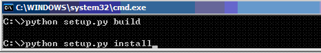

ZSI 还依赖与一些其它的 python 开源包：SOAPpy，pyXML。本文在后面列出了它们的下载地址。必须安装这些 python 包 ZSI2.0 才能正常运行。

## 本文提供的 Web service 描述

在本文中我们将利用 python 提供几个 web service，然后用 Java 客户端调用它们。作为演示，我们仅设计了三个简单的 web service：

getTime()：返回代表当前时间的字符串。没有输入参数。

sayHello(username)：返回一个字符串，内容为”Hello username”，其中 username 为传入参数。

showUser(username)：根据输入的 username 返回一个复杂数据类型 userInfo，描述用户的年龄，性别，联系地址。

## 创建工程

首先创建一个工程。打开 Eclipse，选择 File->New Project。当 pyDev 插件安装好后，会有一个 pyDev project 的选项。选择该选项并创建一个 pyDev 工程。

## 编写 wsdl 文件

Wsdl 是一个 XML 文件，它主要用来描述所提供的网络服务的细节。用户通过 wsdl 文件就可以了解您所提供的网络服务的调用接口的所有细节。

感谢 Eclipse WTP 提供的 WSDL Editor，它使得编写 WSDL 文件变成了一件轻松的事情。WSDL Editor 提供了可视化的编辑界面。利用 WSDL Editor，用户可以完全从服务本身来思考，无需深入了解 WSDL 的细节。

首先要在工程中增加一个 WSDL 文件，点击菜单 File->New 选择 Other，在弹出的对话框中选择WSDL文件。如下图所示：

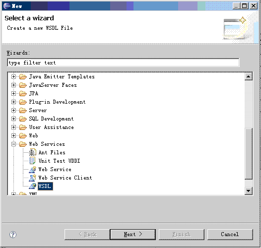

单击 next，给新文件命名为 myServices.wsdl。选择缺省选项并点击 finish 按钮就会生成一个缺省的空 wsdl 文件。此时，将看到如下所示的编辑界面：

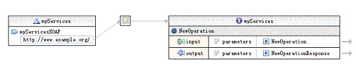

缺省的 WSDL 包含了三个部分 Service，Binding 和 operation。对于一般的应用，只需修改 operation，即上图中最右边的方框。为了提供前面所描述的三个网络服务，我们需要在这个方框中增加三个新的 operation。

第一个网络服务是 getTime。将缺省 wsdl 文件的 operation 方框中的第一个表项修改一下，就可以完成 getTime 的定义了。首先单击标题 NewOperation，将名字高亮选中，如下图所示：

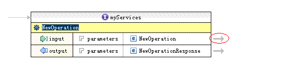

将其重新命名为 getTime。getTime 服务没有入口参数。但有一个返回值，我们定义返回值为一个表示时间的字符串。注意图二中方框外右边的两个箭头，双击它们就可以分别进入定义入口和出口参数的窗口。首先双击 Input 后面的箭头 (上图中用红色圆圈标出)，可以进入如下图所示的参数定义窗口：

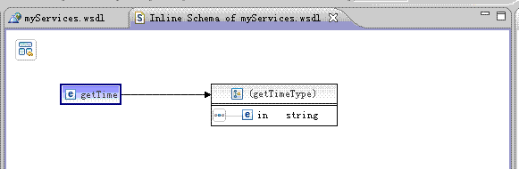

在新打开的 Inline Schema of myServices.wsdl 窗口中，我们可以设置 getTime 的入口参数。getTime 不需要入口参数，因此将缺省的入口参数 in 删除：

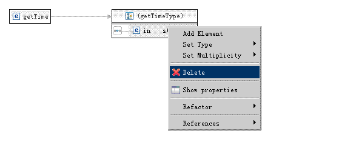

关闭新打开的窗口，回到图一所示的 wsdl 编辑界面。双击 getTime 的 output 后面的箭头，定义返回值。将缺省的返回值名字 out 修改为 timeStr，类型 string，不需要改变：

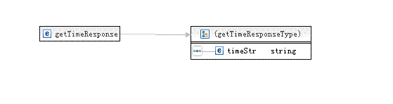

这样 getTime 就设计好了。下面回到主窗口，添加 sayHello 的定义。在 Operation 方框上单击鼠标右键，选择 Add Operation：

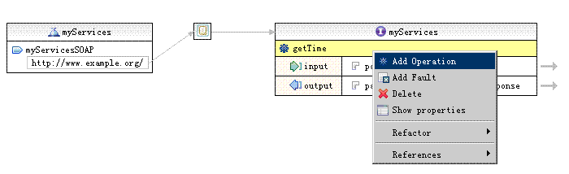

同样，双击方框右边的箭头，分别设置其入口参数和返回值。sayHello 的入口参数为字符型，名字为 username。返回值也是 string 类型。

添加新的 operation，命名为 showUser。这个服务的入口参数也是用户名，类型为 string，但是它的返回值是一个复杂类型。用 WSDL Editor 可以方便地定义复杂类型。进入返回值设计窗口（双击 output 后的箭头），在 element 上单击鼠标右键，弹出菜单中选择 Set Type->New。在弹出对话框中选择 Complex Type，并将新类型命名为 userInfo。

在eclipse的outline 窗口中选中 types->userInfo，定义 userInfo。

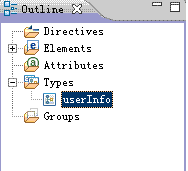

主窗口显示出 userInfo 的设计界面，鼠标右键单击 userInfo，选择弹出菜单的 add element，增加三个 string 类型的元素 name, gender 和 address。如下图所示：


现在可以存盘了，三个服务都已经设计好。下一步，我们将用 python ZSI 提供的脚本处理 WSDL 文件，并生成服务代码框架。

## 编写 web service 服务端代码

ZSI 包提供了两个脚本用来根据 wsdl 文件生成相应的 server 端和 client 端的 python 代码框架。下面的命令生成 server 端代码：

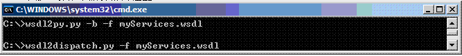

脚本 wsdl2py 的 -b 选项会生成一些辅助代码，后面的描述中将会看到这些辅助代码能简化编程。运行以上两条命令后，会生成三个文件：

myServices\_services.py , myServices\_services\_server.py , myServices\_services\_types.py

这三个 python 文件就是服务端的代码框架。为了提供最终的 web 服务，我们还需要添加一个文件，用来实现每个 web 服务的具体代码。将新文件命名为 serviceImpl.py（完整的源代码可以在文章最后下载）。仅实现 getTime 的 serviceImpl.py 如下：

```
from myServices_services_server import *
from time import time,ctime
from ZSI.ServiceContainer import AsServer
class mySoapServices(myServices):
    def soap_getTime(self,ps):
        try:
            rsp = myServices.soap_getTime(self, ps)
            request = self.request
            rsp.set_element_timeStr(ctime())
        except Exception, e:
            print str(e)
        return rsp

```

Show moreShow more icon

首先导入 myServices\_services\_server，它是由 wsdl2py 脚本生成的 Web 服务框架代码。类 myServices 是 web 服务的基础类，每一个 web 服务都对应其中的一个方法。getTime 对应 myServices 类中的 soap\_getTime 方法。缺省的 soap\_getTime 方法只是一个基本框架，但完成了 soap 解析并且能返回该服务的入口参数对象。

为了实现 getTime，我们需要重载 soap\_getTime 方法。定义新类 mySoapServices，继承自 myServices。在 mySoapServices 类中重载父类的 soap\_getTime() 方法。

getTime 的主要功能是返回一个表示当前时间的字符串。python 系统函数 ctime，就可以得到当前的系统时间。重载 soap\_getTime() 函数中，首先调用父类的 soap\_getTime() 方法，得到返回值对象rsp。

调用返回值对象 rsp 的 set\_element\_xxx() 方法，就可以对返回值对象中的元素进行赋值。这个方法是由 wsdl2py 的 -b 选项生成的。

set\_element\_timeStr(ctime()) 将返回值的 timeStr 元素赋值为代表当前时间的字符串。

sayHello() 的代码与此类似。但是与 getTime 不同，sayHello 服务还需要处理客户端调用时传入的入口参数。sayHello 方法的源代码：

```
def soap_sayHello(self,ps):
        try:
            rsp = myServices.soap_sayHello(self,ps)
            request = self.request
            usrName = request.get_element_userName()
            rsp.set_element_helloStr("Hello "+usrName)
        except Exception, e:
            print str(e)
        return rsp

```

Show moreShow more icon

request 代表入口参数对象。对于 sayHello 服务，入口参数只有一个元素 userName。调用 request 对象的 get\_element\_userName() 方法就可以得到该元素的值。

调用返回值对象 rsp 的 set\_element\_helloStr 将返回字符串赋值给 helloStr 元素。

showUser 服务与前面两个服务的不同在于返回值是一个复杂对象，该复杂对象在 python 中可以用下面这个类来表示：

```
class userInfo:
    def __init__(self,nm,gen,addr):
        self.name = nm
        self.gender = gen
        self.address = addr

```

Show moreShow more icon

showUser 服务根据客户端传入的用户名在数据库中查找该用户的详细信息并填充 userInfo 对象，相应代码如下：

```
def soap_showUser(self,ps):
        try:
            rsp = myServices.soap_showUser(self,ps)
            request = self.request
            uName = request.get_element_userName()
            userDetail = rsp.new_user()
            nm=self.users[uName].name
            userDetail.set_element_name(nm)
            gender=self.users[uName].gender
            userDetail.set_element_gender(gender)
            addr=self.users[uName].address
            userDetail.set_element_address(addr)
            rsp.set_element_user(userDetail)
        except Exception, e:
            print str(e)
        return rsp

```

Show moreShow more icon

调用 request 对象的 get\_element\_userName 方法得到入口参数，并赋值给 uName。然后在数据库中查找用户uName的详细信息，将详细信息填充到 userInfo 类对象中，并返回。作为演示，我们并没有真的到数据库中查询，而是在内存中建立一个字典：

```
u1 = userInfo("u1","M","Shanghai")
        u2 = userInfo("u2","F","Beijing")
        self.users={}
        self.users["u1"]=u1
        self.users["u2"]=u2

```

Show moreShow more icon

该字典中有两个用户：u1 和 u2。演示代码在该字典中查询用户，将查选结果返回用户。

调用 rsp 对象的 new\_element\_user() 方法创建一个新的返回对象，并用 userDetail 保存。

调用 userDetail.set\_element\_gender 将用户性别信息设置到返回值对象的 gender 元素中。同样方法设置用户名和地址。

最后将新建的 userDetail 对象设置到返回值 rsp 中：rsp.set\_elememnt\_user(userDetail)。

## 发布 web service

所有 web 服务代码都已经写好了，需要服务器代码来发布它们。在复杂并且有较高要求的应用环境中，用户可能需要用 apache 等强大的 web server 来发布 web services。限于篇幅，本文不打算介绍如何在 apache 上发布 python web services。本文将使用 ZSI 自带的 SOAP server。

正如下图所示，使用 ZSI soap server 只需要很少的几行代码：

```
from ZSI.ServiceContainer import AsServer
from serviceImpl import mySoapServices
from ZSI import dispatch
if __name__ == "__main__":
    port = 8888
    AsServer(port,(mySoapServices('test'),))

```

Show moreShow more icon

这段代码无需太多解释。port 定义了 web service 发布的端口号。ZSI 包的 AsServer 方法只有两个参数：一个是端口；另外一个是包含了 web 服务实现代码的类，在我们的实验中就是 mySoapServices。字符串 test，表示 web 服务发布时的虚拟路径。当上述代码成功运行之后，就会在 localhost 上开启一个 web server，并在端口 8888 发布 myServices 服务。一切都非常简单，体现了用 python 语言的最吸引人的特点，快速而强大！

我们将在本机访问 myServices，相应的 URL 为 `http://localhost/test?wsdl`。

## 编写 java 客户端

现在我们使用 eclipse 集成环境来开发 web services 的客户端程序，调用前面章节描述的那些 web services。

Eclipse 提供了一个简单的方法来创建 web service 应用程序，即 Web Service Wizard。

首先创建一个 Web Project。

打开 File->New->Other…->Dynamic Web Project，创建一个新的工程。

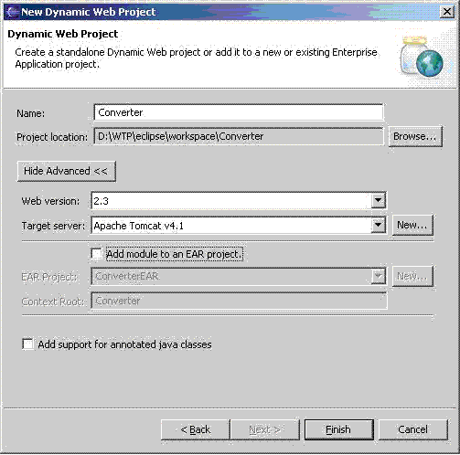

然后就可以创建 java 客户端。选择 File -> New -> Other… -> Web Services -> Web Service Client


选择 Next，在下一个窗口中的 Service Definition 中填写相应的 webservice 的发布地址 URL。在本文中为: `http://localhost:8888/test?wsdl`


选择 Finish 按钮。将自动生成 java 代码。包括以下几个文件： MyService\_PortType.java MyService\_Service.java MyService\_ServiceLocatior.java MyServiceProxy.java MyServiceSOAPStub.java

另外 showUser() 返回一个复杂对象，所以 eclipse 还创建了一个 java 类表示该复杂对象类，文件名为 UserInfo.java

作为测试，我们写了一个 java 小程序，调用 getTime。

```
import org.example.www.myService.MyServiceProxy;
public class HelloClient {
public static void main(String[] args){
try {
      System.out.println("Step1");
      MyServiceProxy hello = new MyServiceProxy();
      System.out.println("Step2");

      java.lang.String str = hello.getTime();
      System.out.println("step over");
      System.out.println(str);
}
catch (Exception ex)
{
      System.out.println(ex.getMessage());
}
}
}

```

Show moreShow more icon

sayHello 和 showUser 的调用代码与上面的示例类似。

## 结束语

用 Eclipse 的 WTP 开发 WSDL 文件，用 python 实现 Web 服务都比较简单而快速。用这两个强大的工具能够迅速地开发 Web 服务应用，适用于原型产品的快速开发。 这样就能抓住先机，比对手更快的推出新的Web应用，从而在市场上立于不败之地。