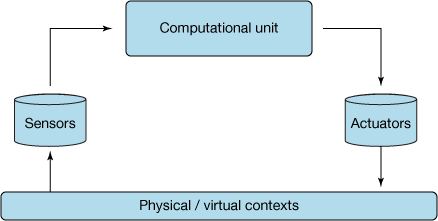
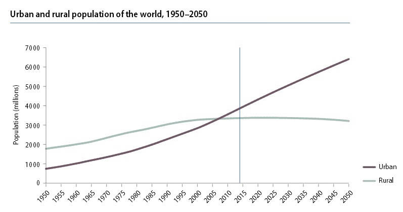
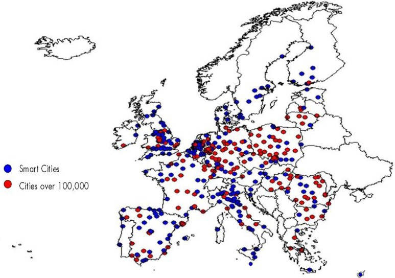

# Archived | 网络物理系统和智慧城市
了解如何使用智能设备、传感器和致动器促进物联网实现

**标签:** IoT

[原文链接](https://developer.ibm.com/zh/articles/ba-cyber-physical-systems-and-smart-cities-iot/)

Alessandro Zanni

发布: 2015-06-08

* * *

**本文已归档**

**归档日期：:** 2020-01-10

此内容不再被更新或维护。 内容是按“原样”提供。鉴于技术的快速发展，某些内容，步骤或插图可能已经改变。

## 网络世界和物理世界的协同作用

智能设备随着功能的增加变得越来越先进，但它们仍然是一项相对低成本的技术。此外，许多智能设备依赖于高速无线网络的盛行，包括 4G 蜂窝网络。借助物联网，每个对象都可以从环境中获取信息，然后与其他设备或用户共同管理和共享这些信息。

物联网是一个动态的分布式环境，由众多智能设备组成，这些设备能够感知其环境，并在这样的环境中采取行动。因为这些设备，人们可以监视外部环境，收集关于真实世界的信息，并创建一种无处不在的计算，让每个设备都能够与来自世界各地的其他设备进行通信。物联网旨在让互联网变得更加普遍，允许设备作为单个传感器或一组传感器进行相互连接和互相协作，这些传感器创建了宏观端点，并能充当整个系统。

计算组件和物理组件的协同作用，特别是网络物理系统（cyber-physical system，CPS）的使用，促进了物联网的实现。CPS 通过整合计算资源，引入了网络空间和物理空间的合作。CPS 通常支持现实生活过程，提供了对物联网对象的操作控制，该控制允许物理设备感知环境并修改它。

物联网 (IoT) 是一个可以向社会和商业环境提供创新和重大改进的革命性创新技术。借助物联网技术，您可以创建适应性和智能应用程序，更好地管理资源，提供更高效的系统。物联网和 CPS 被设计用于支持可以管理大量数据和各种各样的数据环境的应用程序。因此，CPS 可以通过使用信息和通信技术促进智能城市愿景的实现，从而获得更高效、更有效的资源管理。智慧城市主要关注为其公民提供创新的、更好的质量服务，通过改进城市的基础设施实现此目标，同时降低整体成本。

## 网络物理系统

在网络物理系统 (CPS) 中，计算元素与传感器进行协作和通信，传感器将会监测网络指标、物理指标和致动器，修改运行这些传感器的网络环境和物理环境。CPS 通常会以某种方式控制环境。CPS 使用传感器连接环境中的所有分布式智能设备，获得对环境的更深入了解，从而支持更准确的驱动。

在物理环境中，致动器充当和修改用户居住环境。在虚拟环境中，CPS 被用来从用户的虚拟活动中收集数据，比如他们访问社交网络、博客或电子商务网站。然后，CPS 采用某种方式对数据的预测行为或用户需求作出反应。借助软件解决方案，比如 IBM WebSphere Sensor Events，您可以连接到传感器，分析基于传感器的实时数据和事件，并将这些事件集成到智能解决方案中。

##### CPS 架构

网络物理系统的一些实际应用包括：

- 在生产环境中，CPS 可以改进流程，通过在工业机器、制造业供应链、供应商、业务系统和客户之间共享实时信息来实现此改进。同时，CPS 还可以改进这些流程，通过自我监控和控制整个生产流程，然后调整生产来满足客户的偏好。CPS 提供了更高的可见性和对供应链的更多控制，提高了产品的可追溯性和安全性。
- 在医疗环境中，CPS 被用于实时和远程监控病人的身体条件，防止病人住院治疗（例如，患有阿尔茨海默氏症的病人）或改进对残疾和老年病人的治疗。此外，CPS 被用于神经科学领域的研究，以便更好地理解支持脑机接口（brain-machine interface）和治疗机器人的人类功能。
- 在可再生能源环境中，智能网格就是网格物理系统 (CPS)，在该系统中，传感器和其他设备将会监控网格来控制它，并提供更好的可靠性和提高能源效率。
- 在智能建筑环境中，智能设备与 CPS 交互，以减少能源消耗，提高安全性和增加居民舒适度。例如，您可以使用 CPS 来支持能源监测，控制系统使用，这可以帮助您实现零能建筑，或者您可以确定建筑物遭受意外事件后的损害程度，帮助防止结构性失败。
- 在交通环境中，个人车辆和基础架构可以相互通信，共享实时交通信息、位置或问题，防止出现事故或堵塞，提高安全性，并最终节省金钱和时间。
- 在农业环境中，CPS 可用来创建更现代、更精确的农业。CPS 可以收集基本信息：天气、地面和其他数据，以实现更准确的农业管理体系。CPS 可以不断监测不同的资源，比如浇水、湿度、植物健康情况和其他信息，通过传感器保持理想的环境。
- 在计算机网络中，CPS 可以促进网络环境，以便更好地理解系统和用户的行为，帮助提高性能和改进资源管理。例如，可以优化应用程序来分析环境和用户的操作，或监视可用资源。此外，流行的社交网站和电子商务网站可以存储用户的导航信息和用户的 Web 内容，分析这些信息，然后试图预测有趣的东西，向朋友推荐朋友、文章、链接、页面、事件或产品。

## 智慧城市

可以将智慧城市视为一个大型的网络物理系统，它利用传感器来监测网络指标和物理指标，利用致动器以某种方式动态改变复杂的城市环境。政府、组织和技术行都面临日益城市化的挑战，例如，通过提供更高的效率、能源利用率或服务来努力改善城市生活。

根据 [_联合国人口前景，2014 修订版_](http://esa.un.org/unpd/wup/Highlights/WUP2014-Highlights.pdf) 报告，世界城市人口正在迅速增长，而且在持续增加。在 2014 年，54% 的世界人口居住在城市地区，未来几十年，这会进一步给全球人口规模和空间分布带来深刻的变化。在 1950 年，30% 的世界人口居住在城市，到 2050 年，世界上 66% 的人口预计将居住在城市。图 2 是来自 [_联合国人口前景，2014 修订版_](http://esa.un.org/unpd/wup/Highlights/WUP2014-Highlights.pdf) 报告中的图 2。

##### 该图来自《联合国人口前景，2014 年修订版》报告，显示了从 1950 年到 2050 年的世界城市人口和农村人口

城市化和人口老龄化的压力将落在城市的头上，城市地区必须重新思考它们的组织结构和基础设施面临的新挑战。这些挑战包括如何负责任地使用（而不是浪费）关键资源，比如能源、水、食物和其他原材料。如果没有开发必要的基础架构，快速地、无计划地城市增长将会威胁到可持续发展。在这种背景下，提高效率对一个城市的成功而言至关重要。因此，智慧城市（大型 CPS）出现了，比如 Santander、Singapore、Boston 和其他许多网络物理系统。

图 3 中的地图显示了欧盟人口超过十万人的智慧（和非智慧）城市的分布。智慧城市是满足某些特征标准的城市，这些特征包括智能管理、智能生活、智能移动、智慧的人、智能经济和智能环境。 [绘制欧盟智慧城市的地图，2014 年，该图摘自一份报告，此报告显示了拥有超过十万人口的城市的位置，而不是智慧城市和欧洲的智慧城市的位置](#绘制欧盟智慧城市的地图，2014-年，该图摘自一份报告，此报告显示了拥有超过十万人口的城市的位置，而不是智慧城市和欧洲的智慧城市的位置) 来自 [欧盟议会报告，绘制欧盟智慧城市地图](http://www.europarl.europa.eu/RegData/etudes/etudes/join/2014/507480/IPOL-ITRE_ET%282014%29507480_EN.pdf) 中的图 10，该报告发布于 2014 年。

##### 绘制欧盟智慧城市的地图，2014 年，该图摘自一份报告，此报告显示了拥有超过十万人口的城市的位置，而不是智慧城市和欧洲的智慧城市的位置

[SmartSantander](http://www.smartsantander.eu/) 是一个大型研究项目，在西班牙的桑坦德市周围放置了数千个传感器。该项目的目的是创建一个智能解决方案，改善城市生活的各个方面，比如减少交通量，减少能源消耗，提高环境质量，并鼓励公民参与。此外，该项目希望分享环境信息和开发其他有用的应用程序。这项研究还通过测试了解是否有可能缩短智能基础架构的理论设计与真实环境中的实际应用程序采用之间的差距。本次测试的结果有助于促进物联网 (IoT) 和 CPS 在将来的现实场景中的传播。

[新加坡](https://www.smartnation.sg/) 多年来一直被评为世界上最智慧的城市，它成为了实现智能基础架构和提供优质服务的一个领先国家。新加坡是世界上最重要的商业中心之一、最繁忙的港口之一，有着亚洲第五大的机场。新加坡希望创建世界上第一个智慧国家，以刺激经济增长，满足人们需求，成为其他国家的榜样。对该智慧国家的洞察可划分为：

- 提供更好的政策来管理不同的环境
- 开发新颖的商业模式和收入来源，加速经济增长
- 增加积极公民对创建优质服务的参与度，这可以提高社区的日常生活

[波士顿](http://smartercitieschallenge.org/city_Boston_UnitedStates.html) 基于其创新和现有的生态系统，荣获了 IBM Smarter Cities Challenge 2012 Grant。事实上，该地区的许多大学和创业公司都在推动城市向尖端技术研究发展，让城市习惯于经常采用新模型。此外，波士顿在研发和技术创新方面投入了巨资。其公民被认为是世界上最聪明的人。波士顿是第一个利用众包（crowdsourcing）从用户环境中收集数据的城市。波士顿引入了一个试点试验，以促进公民合作，鼓励公民参与实现提高服务质量的目标。

## 未来的挑战

要在网络物理系统和智慧城市方面取得成功，人们需要以不同的方式进行思考和行动，更多地参与城市生活。活跃社区可以聚合每个个体的分散知识，可以采取完全协同的行动来提高城市服务，这一点非常重要。

如今的技术允许采用分布式计算和众包，在用户之间共享信息，建立集体智慧。集体智慧是 CPS 和智慧城市获得成功的一个关键。集体智慧利用众包获得城市环境的协同监视。它还以合作驱动操作为目标，以有效的方式执行人们感兴趣的任务。

从技术角度来看，仍有许多难题必须解决，至少可以采用高效的、适合工业的方式解决它们。一些挑战如下所示：

- **数据异构性** ：数据异构性是一个重要问题，可能会影响通信性能和通信协议的设计。系统需要能够支持许多不同的应用程序和设备。
- **可靠性** ：CPS 适用于关键情况，比如医疗、基础架构、交通和其他许多情况。因为执行机构影响环境的方式，可靠性和安全性已成为了基本要求。事实上，执行机构也有可能产生不可逆的影响，所以必须最大可能地减少异常行为的存在。此外，环境是无法预测，所以 CPS 必须不断在意想不到的情况下工作，让自己适应各种失败情况。
- **数据管理** ：必须存储和分析来自不同的已连接设备的大数据，处理它们，并显示实时结果。可以使用与系统目标相关的离线或在线管理流程处理来管理数据。尤其在使用在线流程时，信息可能经常随实时条件而变化，而且这些信息基于自适应的连续查询。
- **隐私** ：我们的挑战在于如何在隐私与个人数据控制取得平衡，可能需要访问数据来提供更好的服务。因为 CPS 管理着大量的数据，包括敏感的信息，比如健康、性别、宗教和其他许多信息，所以数据隐私成为了重要问题。CPS 需要隐私政策，以便解决隐私问题，因此需要使用数据匿名化管理工具，在系统处理隐私信息之前匿名化这些信息。
- **安全性** ：CPS 必须确保通信期间的安全性，因为设备中的所有操作都是实时协调的。随着 CPS 扩大和增加了物理系统和网络系统之间的相互作用，安全问题会对 CPS 产生更多的影响。传统安全基础架构并不足以解决问题，所以我们必须找到新的解决方案。在收集新数据和存储数据供将来使用时，安全问题至关重要。最后，CPS 基于异构应用程序和无线通讯，这些通常会引起重大的安全问题。
- **实时性** ：CPS 管理着来自传感器的大量数据。计算需要以有效和及时的方式进行，因为物理流程仍然是独立于计算结果的。为了满足这个需求，CPS 必须确保它们拥有所需的带宽或系统容量，以便满足对时间要求严格的函数，因为时间而导致的失败行为可能会造成永久性损害。

## 结束语

我们必须支持物联网的技术进化，尤其是 CPS 中的技术进化，这些进化已经融入了我们每一天的生活。这些技术将提高服务质量，最终给环境带来一些益处，因为它们是在全世界的智慧城市中实现的。

CPS，作为创新的驱动器，涉及到许多不同的学科。整个行业都有机会将 CPS 转变成一个工业适用领域。此外，CPS 需要高度熟练的劳动力，促进工业和大学之间的合作与迭代。最后，CPS 拥有改变和改善人们生活的各个方面的巨大潜力，为我们的社会处理各种至关重要的难题，CPS 在安全性、性能、效率、可靠性、可用性和其他许多方面都超越了当今的分布式系统。

本文翻译自： [Cyber-physical systems and smart cities](https://developer.ibm.com/articles/ba-cyber-physical-systems-and-smart-cities-iot/)（2015-06-08）