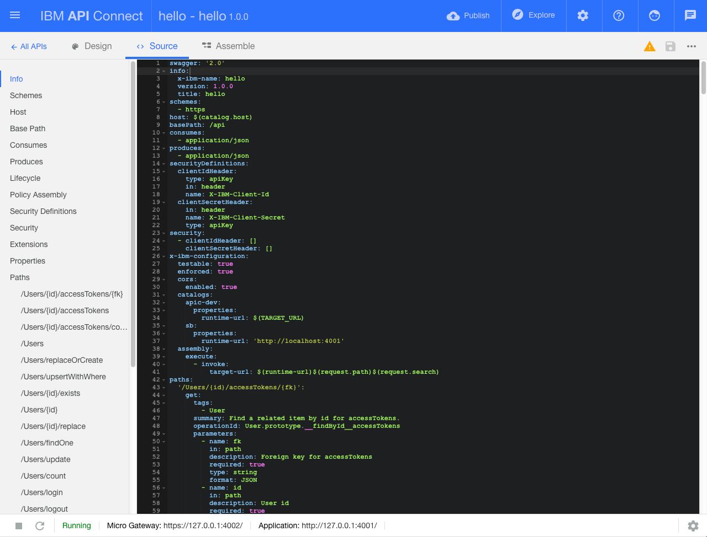
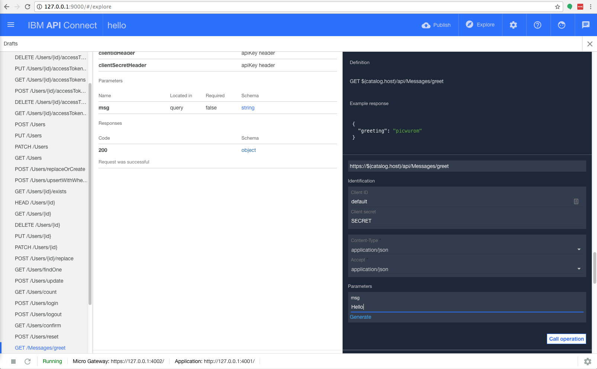

# Archived | 通过 LoopBack 和 API Connect 实现 Hello, World!
LoopBack 和 API Connect 入门

**标签:** API 管理,IBM API Connect,Loopback,Node.js,Web 开发

[原文链接](https://developer.ibm.com/zh/articles/wa-get-started-with-loopback-neward-1/)

Ted Neward

发布: 2017-05-24

* * *

**本文已归档**

**归档日期：:** 2019-08-30

此内容不再被更新或维护。 内容是按“原样”提供。鉴于技术的快速发展，某些内容，步骤或插图可能已经改变。

JavaScript 自上世纪 90 年代中期就已进入开发人员的视野，但直到最近几年才开始被视为一种服务器端平台。Netscape 可能是第一个试验服务器端 JavaScript 的企业，但直到 Google 将 [V8](https://developers.google.com/v8/) 嵌入到一个独立可执行程序（现在称为 Node.js）中，我们才看到无论在何处都可以运行 JavaScript 代码的潜力，而不仅局限于 Web 浏览器。

近期，人们对 JavaScript 的关注导致开发服务器端 JavaScript 的新框架数量激增；研究人员迅速构想出了 Meteor、Backbone.js、KeystoneJS 和 Sails.js，还有更多框架正在构思当中。每种框架都基于某些核心元素而构建，并或多或少以相同的数据存储设备为目标，但每种框架都有自己独有的构建方式 — 对于熟悉该框架风格的开发人员而言，这种特定的应用程序构建方式看起来最明显、最直观且最舒适。

> 作为刚接触 LoopBack 的用户，您面临的第一个挑战是要清楚怎么访问您正在使用的技术。

我最近 [分 4 部分介绍了 Sails.js](https://www.ibm.com/developerworks/cn/web/wa-build-deploy-web-app-sailsjs-1-bluemix/) ，Sails.js 是一个在概念和语义上类似于 Rails 的 JavaScript 框架，而 Rails 是针对 Ruby 语言的流行的 Web 框架。在本系列中，我将介绍 LoopBack，它是一个注重构建 HTTP API 的服务器端 JavaScript 框架。

## LoopBack、StrongLoop 和 API Connect

作为刚接触 LoopBack 的用户，您面临的第一个挑战是要清楚怎么访问您正在使用的技术。在 2015年 IBM® 收购 StrongLoop 公司之前，LoopBack 是该公司的一个独立部门（该公司的付费服务产品也是以此来命名的）。收购以后，LoopBack 团队发布了 3.0 版，而且从这个版本开始，它通过 IBM API Connect™ 将相关术语和名称都整合到了 IBM 旗下。

但是，该框架的许多文档仍在不断完善中，也就是说不能以网络上流传的各种各样关于 LoopBack 的第三方文章和讨论为准。无畏的 LoopBack 开发人员私下里很可能已经尝试用过这 3 个名称不同的版本，对此，我将给他们做出一些解释。

为使阐述更加清楚，下面对在该项目中涉及到的需要了解的 3 个相关概念进行简单介绍：

- **LoopBack** 是一个开源 Node.js 框架，提供了本系列中将探讨的核心功能。它托管在 [http://loopback.io](http://loopback.io) 上，这是所有 LoopBack 相关资源（即与该开源框架本身相关的资源）的集中存放地。
- **StrongLoop** 是为 LoopBack 做出主要贡献的公司的名称。在 2015 年 9 月被 IBM 收购之前，StrongLoop 发布了一些商业化的服务和产品，其中包括基于浏览器的 GUI 设计和管理工具 StrongLoop Arc。除了图形界面之外，Arc 还内置了流程监控、性能分析和其他操作支持功能。尽管 Arc 仍然存在，并可能会继续存在一段时间，但当前项目的明确目的就是将 Arc 的大量功能迁移到相同产品的 IBM 版本，也就是 API Connect。注意：截至 2017 年 4 月，Arc 已经停产并被 API Connect 替代。如果你当前已经是注册用户，你可以继续使用 Arc。
- **IBM API Connect** 是继续完成 StrongLoop Arc 的工作的新兴 IBM 产品，它利用 IBM Cloud 作为 API 生命周期管理平台和安全、可扩展的托管服务。API Connect 既是基于浏览器的 GUI 工具和付费服务的名称，也是一个本地命令行实用程序 (`apic`)，通常可根据其使用时的语境就能很明显将两者区分开。

在过去一年中，LoopBack 团队都在将文档从 [StrongLoop 网站](http://apidocs.strongloop.com) 迁移到 [LoopBack 的网络资产](http://loopback.io) 中，但截至编写本文时，迁移仍未完成，一些文档仍在 StrongLoop 中运行。（LoopBack 团队在其主页上提供了计划任务列表的链接，但文档本身仍托管在 [LoopBack GitHub 文档存储库](https://github.com/strongloop/loopback.io/blob/gh-pages/pages/) 中。对于觉得迁移速度不够快的开发人员 — 可以自由地提交一些拉式请求！）

随着时间的推移，IBM 和 StrongLoop 将继续整合其资产，将该产品线分为两个产品：开源的 LoopBack 框架和 API Connect 商业平台。在此期间，只需稍微兼顾文档与参考实现，我们仍能使用这个功能丰富的框架。

在讨论并解决了这个非常明显但被刻意回避的问题后，我们正式进入主题。

## 安装和设置 LoopBack

像大多数基于 JavaScript 的框架一样，LoopBack 可通过 npm 进行访问，而且它使用了一个全局安装的命令行工具。因此，启动 LoopBack 的第一步是打开一个命令行终端并将 Node.js 放在 PATH 上，使用 npm 对其进行安装： `npm install -g apiconnect` 。

**安装说明：** 仍然可以通过 npm 调用 `strongloop` 来安装 LoopBack，但该版本已被弃用。随后过程中的任何新的开发都将在 `apiconnect` 的名称下进行，所以我们从一开始就使用该名称。

LoopBack 安装完成后，下载所有必要文件并将其安装到本地机器上的全局 Node.js 存储库，您将看到它在您的 PATH 上置入了一个新的命令行工具 (`apic`)。使用下面的命令确保该工具已安装并可供使用： `apic--help` 。输入此命令后，会获得一个非常详细的选项列表。

目前，该命令行工具是您使用 LoopBack 的主要接口，所以您需要使用它创建一个新应用程序。所有人在新环境中创建的第一个应用程序都表达了对这个世界的敬意 — Hello, World! — 所以我们也将从这里开始。

**GUI 与命令行的对比：** 如果不习惯使用命令行，别担心：API Connect 可以派上用场。它提供了一个基于 GUI 的仪表板和建模环境，以及其他一些工具，目的是让整体编码体验变得更容易。尽管本系列将重点介绍命令行，但我们会在第 1 部分花一些时间探讨 API Connect，然后在第 2 部分继续介绍 LoopBack CLI。

### 您好，工作愉快！

首先，输入命令来创建一个新的应用程序： `apic loopback` 。您会看到一系列交互式问题。（如果您使用过 JavaScript 构建工具 [Yeoman](http://yeoman.io/) ，就会认出这个友好的英国人和他的互动风格。）LoopBack 首先会询问您想构建的应用程序的名称，以及您想在哪个目录中进行构建。因为您刚开始学习 LoopBack，所以我们将该应用程序命名为 hello，并在一个 hello 子目录中生成它。

接下来，LoopBack 会询问您想生成的应用程序类型。您有以下选项可供选择：

- **empty-server：** 适合不喜欢 LoopBack 默认设置的用户
- **hello-world：** 普遍的入门应用程序 — 我们暂时使用该选项
- **notes：** 一个功能完整的示例服务器

选择 **hello-world** 后，LoopBack 会生成一些代码并运行 `npm install` ，该命令会拉入您运行项目所需的所有依赖项。

接下来，LoopBack 会提示您运行项目。在此之前，让我们快速浏览一下它生成的文件集。（请注意，我省略了一些配置文件，比如 .gitignore）：

```
Created common
Created common/models
Created common/models/message.js
Created common/models/message.json
Created package.json
Created server
Created server/boot
Created server/boot/root.js
Created server/config.json
Created server/datasources.json
Created server/middleware.json
Created server/middleware.production.json
Created server/model-config.json
Created server/server.js

```

Show moreShow more icon

请注意，server 和 common 目录都装满了文件，但没有 client 子目录。这是因为 LoopBack 不是一个 “全栈” 的解决方案。它是一个仅包含服务器的解决方案，旨在创建可通过 HTTP 访问的 API 端点。然后，前端开发人员可以使用这些端点创建丰富的 Web 或移动客户端，以满足各种各样的应用程序需求。因此，LoopBack 中的所有功能都在服务器上运行，几乎没有客户端存在。

LoopBack 确实也提供了客户端 SDK，但它非常重视服务器端构件，而且 LoopBack 中编写的所有代码都假设将在服务器上执行。这与全栈的环境（比如 Meteor）完全相反，它的目的是最小化客户端开发与服务器之间的冲突。

现在让我们看看 LoopBack 的实际应用。

## 您的第一个 LoopBack API

可以使用 `apic` 启动服务器进程，或者可以让 npm 启动它。转到 hello 目录（client、common 和 server 子目录的父目录），其中包含 package.json 文件。在这里发出 `apic start` 或 `npm start` 命令；每个命令都会触发服务器开始监听传入请求。

很快您就会看到控制台显示消息：您的第一个 LoopBack 应用程序正在运行；但是请检查控制台，查找该应用程序被绑定到哪个端口，因为启动代码的方式不同，绑定到的端口也会不同。

##### LoopBack ‘Hello’

```
    $ npm start

    > hello@1.0.0 start /Users/tedneward/Projects/hello
    > node .

    Web server listening at: http://0.0.0.0:3000
    Browse your REST API at http://0.0.0.0:3000/explorer

```

Show moreShow more icon

根据上面的控制台消息，您只需打开 Web 浏览器并访问 `http://localhost:3000` 来完成练习。您会获得一些信息。

### 根 URL

就欢迎消息而论，LoopBack 显示的消息不太有欢迎的意味。事实上，您看到的并不是实际的问候语，而是应用程序的正常运行时间。这个根 URL 正常运行时间报告是 LoopBack 生成的所有应用程序的标准功能，该功能提供一个作为 ping 目标的端点来确定服务器是否可达。您也可以使用这个端点作为简单的诊断工具，来确定服务器自上次有人查看以来是否发生过宕机。

如果想看到实际的问候语，则需要点击另一个的 URL。要知道点击哪个 URL，您需要自己去发现。一种方法是浏览源代码，找到为应用程序配置的路径，根据可能传递或未传递的所有参数来拼凑出该 URL。或者，可以采用更加图形化的方式浏览该应用程序。

**访问 API Connect：** 尽管 LoopBack 不需要 IBM Cloud 帐户，但您需要注册成为 IBM Cloud 用户才能试用 API Connect。我们将对本系列中的大部分示例使用命令行，所以这里仅简要介绍一下 API Connect，让喜欢 GUI 或需要商业平台所提供的生命周期管理功能和可伸缩性的用户有所了解。立即 [登录到 IBM Cloud](https://cloud.ibm.com/login?cm_sp=ibmdev-_-developer-articles-_-cloudreg) 或 [注册一个免费试用帐户](https://cloud.ibm.com/login?cm_sp=ibmdev-_-developer-articles-_-cloudreg) 来试用 API Connect。

## LoopBack 和 API Connect

如果您已注册并登录到 IBM Cloud，您就拥有访问 API Connect 所需的凭证。根据您启动服务器的方式，现在选择使用 `npm stop` 或 `apic stop` 关闭它。接下来，运行 `apic edit` 。几秒之后，您会获得一条消息，表明 Express 服务器正在 localhost 上监听，并会打开一个指向指定 URL（截至编写本文时，我的 URL 是 `http://localhost:9000`）的浏览器窗口。

登录后，API Connect 仪表板会显示 **hello** 项目，该项目目前被标记为 1.0.0 版。仪表板底部显示了服务器的状态，目前显示为 “Stopped”。状态旁边有一个三角形，表示 “运行”。单击该三角形以重新启动服务器。

单击仪表板中央区域的 **hello** 链接，将跳转到仪表板的 APIs 部分。这里显示了您的应用程序（或产品）公开的各种 API 端点。这是 API 的 Design 视图，它为您的应用程序/产品的 Swagger API 声明提供了一个用户友好的视图。要查看实际的 Swagger 文档，请单击工具栏中的 **Source** 。使用左侧的选项导航到 [Swagger](http://swagger.io/) 文档的不同部分。（参见图 1。）

##### hello 应用程序的 Swagger 文档



**Swagger** 是一种为基于 HTTP 的 Web API 创建文档的社区推动标准。它可以使用 YAML（Yet Another Markup Language，在 Ruby 圈子中很流行）或 JSON 表达。无论采用哪种方式，Swagger 都会自动查找和声明问题中与服务有关的信息（或元数据）。URL 端点、参数、参数类型等  都在 Swagger 规范中进行了说明，而且都不需要依赖于人工维护的文档。进一步了解 [Swagger](https://www.ibm.com/developerworks/library/wa-use-swagger-to-document-and-define-restful-apis/index.html)。

Swagger 文档提供了许多选项，其中大部分选项都超出了我们的介绍范围。所以暂时只需要浏览一下左侧的选项并单击 **Paths** ：Swagger 规范的这部分描述了从服务公开的端点。如您所见，这里定义了这样一条路径，它被表示为 /Messages/greet。但它不是完整路径，因为 Swagger 规范还设置了一个 **基础路径** /api（可在选项列表顶部看到），这意味着完整 URL 为 /api/Messages/greet。

在执行任何其他操作之前，我们可以注意到，像许多面向 REST 的框架一样，LoopBack 是围绕 _资源_ 概念而设计的，LoopBack 将资源描述为 _模型_ 。第 2 部分将对此作出更详细地介绍，不过现在可以简单了解一下该应用程序的模型架构。在 API Connect GUI 中，单击 **All APIs** 。这将跳转回主要仪表板，您应在这里选择 **Models** 。对于这个简单的 hello 应用程序，API Connect 定义了一个名为 Message 的模型类型。目前此模型是空的。我们暂时不需要对它执行任何操作，所以这没有问题。

### 探索 GUI

既然已经知道应用程序 URL，我们可以立即使用 cURL、Postman 或其他某个简单的 HTTP 客户端工具向该端点发送 HTTP 请求，看看会返回什么信息。但即便到那时，您也可能遗忘一个参数。而且如果希望（通过用户身份验证）对 API 实施一定程度的安全保护，需要牢记在每次运行它时输入这些凭证。幸运的是，API Connect 为我们提供了一种更简单的机制，该机制至少适合临时场景。

在 GUI 的右上角，有一个标为 **Explore** 的按钮。单击它，就会跳转到 API Connect 仪表板的交互式部分。在左侧可以看到一个长长的调用列表。右侧的代码示例部分的下方是一组编辑字段，用于接受提供给 API 的参数。选择 **GET /Message/greet** 后，您会在这里找到 _msg_ 参数，可以在该参数中添加问候语：Hello。该参数下方是 **Call operation** 按钮，按下该按钮就会发出一个 HTTP 请求并显示结果。（参见图 2。）

##### API Connect GUI 中的调用和参数



当然，不需要通过 GUI 访问实际端点。要运行 `curl` 请求，可以复制 `curl` 命令行并粘贴到 CLI 中。或者，如果您喜欢的话，可以将 URL 请求复制并粘贴到浏览器的地址栏，这样您就会看到以下信息：

```
{"greeting":"Sender says Hello to receiver"}

```

Show moreShow more icon

这看起来友好多了。

## 结束语

即使是像 Hello, World 这么小的应用程序，LoopBack 也提供了大量功能和工具来处理它。您可以自行决定如何利用每项功能。您可能喜欢在基于 GUI 的环境中工作，比如 API Connect。或者您可能像我一样痴迷于命令行，不太愿意接受通过鼠标或滑动操控的世界。幸运的是，它们在功能上没有任何区别：StrongLoop（以及如今的 IBM）开发人员的出色工作，保证了我们能自由地使用 LoopBack，无论是通过命令行还是 GUI 。

当我们对 LoopBack 的初次体验结束时，您可能注意到您已经编写了一行 JavaScript 代码 — 对于 LoopBack 带来的惊喜，这才刚刚开始。在下一期，您将学习如何定义模型（用 REST 的说法为 _资源_ ），并在 LoopBack 支持的任何数据源上执行实际的 CRUD 操作。剧透一下，您还会发现，针对现有数据源 LoopBack 将定义模型变得出奇的简单。使用了 20 年的关系数据库模式就是一个例子。

本文翻译自： [Hello, World! with LoopBack and API Connect](https://developer.ibm.com/articles/wa-get-started-with-loopback-neward-1/)（2017-03-07）