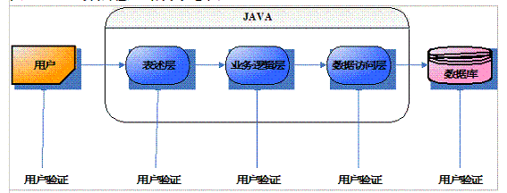
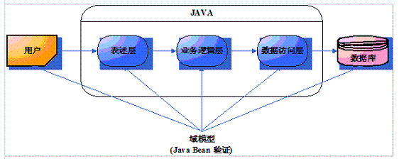
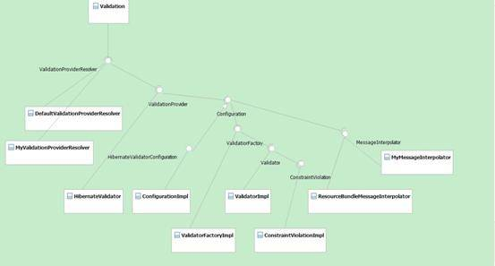

# Bean Validation 技术规范特性概述
系统介绍该规范的各种特性

**标签:** Java

[原文链接](https://developer.ibm.com/zh/articles/j-lo-beanvalid/)

张冠楠, 陈志娴

发布: 2011-03-24

* * *

## 概述 Bean Validation 规范

Bean 是 Java Bean 的缩写，在 Java 分层架构的实际应用中，从表示层到持久化层，每一层都需要对 Java Bean 进行业务符合性验证，如图 1 所示。然而对于同一个 Java Bean 的对象，在每一层都需要实现同样的验证逻辑时，这将是一项耗时且容易诱发错误的做法。Bean Validation 规范的目标就是避免多层验证的重复性。事实上，开发者更倾向于将验证规则直接放到 Java Bean 本身，使用注解的方式进行验证规则的设计。

##### 图 1\. Java 分层验证结构示意图



JSR303 规范（Bean Validation 规范）提供了对 Java EE 和 Java SE 中的 Java Bean 进行验证的方式。该规范主要使用注解的方式来实现对 Java Bean 的验证功能，并且这种方式会覆盖使用 XML 形式的验证描述符，从而使验证逻辑从业务代码中分离出来，如图 2 所示。

##### 图 2\. Java Bean 验证模型示意图



JSR303 规范提供的 API 是 Java Bean 对象模型的一般扩展，它并不局限于某一层或者某一编程模型，在服务器端和客户端都可使用，其最大的特点就是易用而且灵活。

Hibernate Validator 4.0 是 JSR303 规范的参考实现，本文所有示例代码均使用该参考实现。

下面给出一个 Bean Validation 的简单示例（清单 1）：

##### 清单 1：

```
public class Employee {
@NotNull(message = "The id of employee can not be null")
private Integer id;

@NotNull(message = "The name of employee can not be null")
@Size(min = 1,max = 10,message="The size of employee's name must between 1 and 10")
private String name;

public int getId() {
return id;
}
public void setId(int id) {
this.id = id;
}
public String getName() {
return name;
}
public void setName(String name) {
this.name = name;
}
public static void main(String[] args) {
Employee employee = new Employee();
employee.setName("Zhang Guan Nan");
ValidatorFactory vf = Validation.buildDefaultValidatorFactory();
Validator validator = vf.getValidator();
Set<ConstraintViolation<Employee>> set = validator.validate(employee);
for (ConstraintViolation<Employee> constraintViolation : set) {
System.out.println(constraintViolation.getMessage());
}
}
}

```

Show moreShow more icon

运行该示例的输出结果为：

The size of employee’s name must between 1 and 10

The id of employee can not be null

从示例中可以看出，Bean Validation 使用注解（@NotNull 和 @Size）的方式对字段 id 和 name 进行了约束声明，当该 Java Bean 被实际使用时，相关的验证器就会对该类的实例进行验证确保其符合该约束声明。完成 Java Bean 的验证通常可分为如下四个步骤：

1. 约束注解的定义
2. 约束验证规则（约束验证器）
3. 约束注解的声明
4. 约束验证流程

本文第二大部分将详细介绍约束注解的定义和约束验证规则；第三大部分将详细介绍约束注解的声明和约束验证流程；第四大部分将介绍 JSR303 规范提供的 API。

## 约束的定义

### 约束注解

Bean Validation 规范对约束的定义包括两部分，一是约束注解，清单 1 中的 @NotNull 就是约束注解；二是约束验证器，每一个约束注解都存在对应的约束验证器，约束验证器用来验证具体的 Java Bean 是否满足该约束注解声明的条件。

在 Java Bean 中，对某一方法、字段、属性或其组合形式等进行约束的注解，即为约束注解，如清单 2 所示：

##### 清单 2：

```
@NotNull(message = "The id of employee can not be null")
private Integer id;

```

Show moreShow more icon

清单 2 的含义为：对于字段 id，在 Java Bean 的实例中值不能为空。对于每一个约束注解，在实际使用前必须有相关定义。JSR303 规范默认提供了几种约束注解的定义（见表 1），我们也可以扩展规范提供的 API，实现符合自身业务需求的约束注解。

##### 表 1\. Bean Validation 规范内嵌的约束注解定义

**约束注解名称****约束注解说明**@Null验证对象是否为空@NotNull验证对象是否为非空@AssertTrue验证 Boolean 对象是否为 true@AssertFalse验证 Boolean 对象是否为 false@Min验证 Number 和 String 对象是否大等于指定的值@Max验证 Number 和 String 对象是否小等于指定的值@DecimalMin验证 Number 和 String 对象是否大等于指定的值，小数存在精度@DecimalMax验证 Number 和 String 对象是否小等于指定的值，小数存在精度@Size验证对象（Array,Collection,Map,String）长度是否在给定的范围之内@Digits验证 Number 和 String 的构成是否合法@Past验证 Date 和 Calendar 对象是否在当前时间之前@Future验证 Date 和 Calendar 对象是否在当前时间之后@Pattern验证 String 对象是否符合正则表达式的规则

约束注解和普通的注解一样，一个典型的约束注解的定义应该至少包括如下内容（清单 3）：

##### 清单 3：

```
@Target({ })   // 约束注解应用的目标元素类型
@Retention()   // 约束注解应用的时机
@Constraint(validatedBy ={})  // 与约束注解关联的验证器
public @interface ConstraintName{
String message() default " ";   // 约束注解验证时的输出消息
Class<?>[] groups() default { };  // 约束注解在验证时所属的组别
Class<? extends Payload>[] payload() default { }; // 约束注解的有效负载
}

```

Show moreShow more icon

约束注解应用的目标元素类型包括 METHOD, FIELD, TYPE, ANNOTATION\_TYPE, CONSTRUCTOR, PARAMETER。METHOD 约束相关的 getter 方法；FIELD 约束相关的属性；TYPE 约束具体的 Java Bean；ANNOTATION\_TYPE 用在组合约束中；该规范同样也支持对参数（PARAMETER）和构造器（CONSTRUCTOR）的约束。

验证时的组别属性将在本文第三大部分中组与组序列中详细介绍。

有效负载通常用来将一些元数据信息与该约束注解相关联，常用的一种情况是用负载表示验证结果的严重程度。

清单 4 给出一个验证字符串非空的约束注解的定义：

##### 清单 4：

```
@Target({ METHOD, FIELD, ANNOTATION_TYPE, CONSTRUCTOR, PARAMETER })
@Retention(RUNTIME)
@Documented
@Constraint(validatedBy = {NotEmptyValidator.class})
public @interface NotEmpty {
String message() default "this string may be empty";
Class<?>[] groups() default { };
Class<? extends Payload>[] payload() default {};
}

```

Show moreShow more icon

约束注解定义完成后，需要同时实现与该约束注解关联的验证器。约束验证器的实现需要扩展 JSR303 规范提供的接口 javax.validation.ConstraintValidator。清单 5 给出该接口。

##### 清单 5：

```
public interface ConstraintValidator<A extends Annotation, T> {
void initialize(A constraintAnnotation);
boolean isValid(T value, ConstraintValidatorContext context);
}

```

Show moreShow more icon

该接口有两个方法，方法 initialize 对验证器进行实例化，它必须在验证器的实例在使用之前被调用，并保证正确初始化验证器，它的参数是约束注解；方法 isValid 是进行约束验证的主体方法，其中 value 参数代表需要验证的实例，context 参数代表约束执行的上下文环境。

对于清单 4 定义的约束注解，清单 6 给出了与该注解对应的验证器的实现。

##### 清单 6：

```
public class NotEmptyValidator implements ConstraintValidator<NotEmpty, String>{
public void initialize(NotEmpty parameters) {
}
public boolean isValid(String string,
    ConstraintValidatorContext constraintValidatorContext) {
if (string == null) return false;
else if(string.length()<1) return false;
else return true;
}
}

```

Show moreShow more icon

至此，一个可以声明并使用的约束注解已经定义完毕，清单 7 将给出该约束注解在实际程序中的使用。为节省篇幅，这里只给出针对清单 1 的增加和修改内容，未给出全部的示例代码，您可以在本文的附录中获得全部的代码。

##### 清单 7：

```
首先在清单 1 中的类 Employee 中加入字段 company 和相应的 getter 和 setter 方法：
@NotEmpty
private String company;
然后在 main 函数中加入如下代码清单：
String company = new String();
employee.setCompany(company);
再次运行该程序，输出结果为：
The id of employee can not be null
this string may be empty
The size of employee's name must between 1 and 10

```

Show moreShow more icon

### 多值约束

下面介绍 Bean Validation 规范的一个特性，多值约束（Multiple Constraints）：对于同一个目标元素，在进行约束注解声明时可以同时使用不同的属性达到对该目标元素进行多值验证的目的。如清单 8 所示：

##### 清单 8：

```
public @interface ConstraintName{
String message() default " ";
Class<?>[] groups() default { };
Class<? extends Payload>[] payload() default { };
@Target({ METHOD, FIELD, ANNOTATION_TYPE, CONSTRUCTOR, PARAMETER })
@Retention(RUNTIME)
@Documented
@interface List {
ConstraintName[] value();
}
}

```

Show moreShow more icon

实现多值约束只需要在定义约束注解的同时定义一个 List（@interface List{}）。使用该约束注解时，Bean Validation 将 value 数组里面的每一个元素都处理为一个普通的约束注解，并对其进行验证，所有约束条件均符合时才会验证通过。

清单 9 定义了一个约束注解，它用来验证某一字符串是否包含指定的内容。

##### 清单 9：

```
@Target({ METHOD, FIELD, ANNOTATION_TYPE, CONSTRUCTOR, PARAMETER })
@Retention(RUNTIME)
@Documented
@Constraint(validatedBy = PatternOfStringValidator.class)
public @interface PatternOfString {
String mustContainLetter();
String message() default "this pattern may not be right";
Class<?>[] groups() default { };
Class<? extends Payload>[] payload() default {};

@Target({ METHOD, FIELD, ANNOTATION_TYPE})
@Retention(RUNTIME)
@interface List {
PatternOfString[] value();
}
}

```

Show moreShow more icon

该约束注解对应的验证器如清单 10 所示：

##### 清单 10：

```
public class PatternOfStringValidator implements ConstraintValidator
<PatternOfString, String> {
private String letterIn;
public void initialize(PatternOfString parameters) {
this.letterIn=parameters.mustContainLetter();
}
public boolean isValid(String string,
ConstraintValidatorContext constraintValidatorContext) {
if (string.contains(letterIn))
return true;
return false;
}
}

```

Show moreShow more icon

如果想验证某一字符串是否同时包含两个子串，那么多值约束就显得比较重要了，清单 11 将详细给出多值约束的使用。

##### 清单 11：

```
在清单 1 中的类 Employee 中增加如下字段 place 以及相应的 getter 和 setter 方法：
@PatternOfString.List({
@PatternOfString(mustContainLetter = "CH",
message = "It does not belong to China"),
@PatternOfString(mustContainLetter="MainLand",
message="It does not belong to MainLand")})
private String place;
然后在 main 函数中加入如下代码清单：
String place = "C";
employee.setPlace(place);
再次运行该程序，输出结果为：
It does not belong to MainLand
It does not belong to China
this string may be empty
The id of employee can not be null
The size of employee's name must between 1 and 10
如果将 place 赋值为 String place = "CHINA"，则输出结果为：
this string may be empty
The id of employee can not be null
It does not belong to MainLand

```

Show moreShow more icon

The size of employee’s name must between 1 and 10

可见，该约束会对声明的两个约束注解分别进行验证，只要存在不符合约束验证规则的 Java Bean 实例，就将产生相应的验证失败信息。约束注解声明的时候可以根据不同的约束值使用 message 参数给出不同的输出信息。

### 组合约束

下面介绍 Bean Validation 规范中另一个重要的特性：组合约束。Bean Validation 规范允许将不同的约束进行组合来创建级别较高且功能较多的约束，从而避免原子级别约束的重复使用。如清单 4 定义的约束注解 @NotEmpty，是用来判断一个字符串在非空的基础上长度至少为 1，其实际意义等同于 @NotNull 和 @Size（min=1）的组合形式，因此可以将 @NotEmpty 约束定义为组合约束 NotEmpty2，如清单 12 所示：

##### 清单 12：

```
@NotNull
@Size(min = 1)
@Target({ METHOD, FIELD, ANNOTATION_TYPE, CONSTRUCTOR, PARAMETER })
@Retention(RUNTIME)
@Documented
@Constraint(validatedBy = {NotEmptyValidator2.class})
public @interface NotEmpty2 {
String message() default "this string may be empty";
Class<?>[] groups() default { };
Class<? extends Payload>[] payload() default {};

@Target({ METHOD, FIELD, ANNOTATION_TYPE})
@Retention(RUNTIME)
@interface List {
NotEmpty2[] value();
}
}

```

Show moreShow more icon

实际使用中 @NotEmpty2 约束注解可以得到与 @NotEmpty 约束注解同样的验证结果。

## 约束的声明和验证流程

本文第二大部分介绍了如何定义约束注解和验证器，本章主要介绍如何在 Java Bean 中应用存在定义的约束注解，主要包括两部分：一是约束的声明；二是约束的验证流程。

在需要进行约束的目标元素前面用注解的方式即可声明约束，这意味着该目标元素必须满足该约束的验证条件。如清单 13 即在字段 id 上声明了约束 @NotNull：

##### 清单 13：

```
@NotNull(message = "The id of employee can not be null")
private Integer id;

```

Show moreShow more icon

该目标元素在具体实例中被赋值后，Bean Validation 就会调用相关的流程进行验证。具体使用方式可以参见清单 14 所示，其中所涉及的接口将在本文第四大部分详细介绍。

##### 清单 14：

```
ValidatorFactory vf = Validation.buildDefaultValidatorFactory();
Validator validator = vf.getValidator();
Set<ConstraintViolation<Employee>> set = validator.validate(JavaBeanInstance);
for (ConstraintViolation<Employee> constraintViolation : set) {
System.out.println(constraintViolation.getMessage());
}

```

Show moreShow more icon

Bean Validation 规范对 Java Bean 的验证流程如下：在实际使用中调用 Validator.validate( _JavaBeanInstance_) 方法后，Bean Validation 会查找在 _JavaBeanInstance_ 上所有的约束声明，对每一个约束调用对应的约束验证器进行验证，最后的结果由约束验证器的 isValid 方法产生，如果该方法返回 true，则约束验证成功，否则验证失败。验证失败的约束将产生约束违规对象（ConstraintViolation 的实例）并放到约束违规列表中。验证完成后所有的验证失败信息均能在该列表中查找并输出。

### 前提条件

Bean Validation 规范规定在对 Java Bean 进行约束验证前，目标元素必须满足以下条件：

- 如果验证的是属性（getter 方法），那么必须遵从 Java Bean 的命名习惯（JavaBeans 规范）；
- 静态的字段和方法不能进行约束验证；
- 约束适用于接口和基类；
- 约束注解定义的目标元素可以是字段、属性或者类型等；
- 可以在类或者接口上使用约束验证，它将对该类或实现该接口的实例进行状态验证；
- 字段和属性均可以使用约束验证，但是不能将相同的约束重复声明在字段和相关属性（字段的 getter 方法）上。

### Object Graph 验证

除了支持 Java Bean 的实例验证外，Bean Validation 规范同样支持 Object Graph 的验证。Object Graph 即为对象的拓扑结构，如对象之间的引用关系。如果类 A 引用类 B，则在对类 A 的实例进行约束验证时也需要对类 B 的实例进行约束验证，这就是验证的级联性。当对 Java 语言中的集合、数组等类型进行验证时也需要对该类型的每一个元素进行验证。

完成级联验证的方式就是使用 @Valid 注解，如清单 15 所示：

##### 清单 15：

```
public class Person {
@NotEmpty
private String name;

public String getName() {
return name;
}
public void setName(String name) {
this.name = name;
}
}
public class Order {
@Valid
private Person person;

public Person getPerson() {
return person;
}
public void setPerson(Person person) {
this.person = person;
}
}

```

Show moreShow more icon

在对 Order 的实例进行验证时，只有当在 Order 引用的对象 Person 前面声明了注解 @Valid，才对 Person 中 name 字段的 @NotEmpty 注解进行验证，否则将不予验证。

### 组

Bean Validation 规范中一个重要的概念，就是组和组序列。组定义了约束的子集。对于一个给定的 Object Graph 结构，有了组的概念，则无需对该 Object Graph 中所有的约束进行验证，只需要对该组定义的一个子集进行验证即可。完成组别验证需要在约束声明时进行组别的声明，否则使用默认的组 Default.class.

组使用接口的方式进行定义，清单 16 给出了如何定义组并使用组进行约束验证。

##### 清单 16：

```
public interface GroupA {}
public class User {
@NotEmpty (message = "firstname may be empty")
private String firstname;

@NotEmpty(message = "middlename may be empty", groups = Default.class)
private String middlename;

@NotEmpty(message = "lastname may be empty",groups = GroupA.class)
private String lastname;
}
public static void main(String[] args){
User user = new User();
ValidatorFactory vf = Validation.buildDefaultValidatorFactory();
Validator validator = vf.getValidator();
Set<ConstraintViolation<User>> set = validator.validate(user,GroupA.class);
for (ConstraintViolation<User> constraintViolation : set) {
System.out.println(constraintViolation.getMessage());
}
}

```

Show moreShow more icon

在类 User 中需要验证的字段上声明验证时所属的组别属性，如（groups=GroupA.class）, 然后在 main 函数中调用 validator.validate(user,GroupA.class)) 方法，在此必须指定需要验证的组别。如果不显示指明，则是默认的组别。

如清单 16，验证器只会验证类 User 的 lastname 字段，如果使用 validator.validate(user))，则会使用 Default.class 组别，从而验证 firstname 和 middlename 字段。

需要注意的是：组也有继承的属性。对某一组别进行约束验证的时候，也会对其所继承的基类进行验证。

组可以进行隐式定义，其好处是可以不必在约束声明的时候显式声明组别属性，如清单 16 中的（groups=GroupA.class）。清单 17 给出了一个隐式定义的组接口（Animal），其中包含对相应属性（getter 方法）的约束声明。相应的 Java Bean（Dog）实现了该接口。

##### 清单 17：

```
public interface Animal {
@NotEmpty String getName();
@NotEmpty String getOwnerName();
}
public class Dog implements Animal {
private String name;
private String ownername;

private String type;

public void setType(String type) {
this.type = type;
}
public String getName() {
return null;
}
public String getOwnerName() {
return null;
}
@NotEmpty(message = "type of the dog may be empty")
public String getType() {
return type;
}
}

```

Show moreShow more icon

这样在对类 Dog 的实例进行验证的时候，如果使用默认的组别（Default.class），则 name，ownername 和 type 都将进行验证；如果使用 Animal 的组别，如清单 18 所示，则只会对 name 和 ownername 属性进行验证。

##### 清单 18：

```
public static void main(String[] args) {
Dog dog = new Dog();
ValidatorFactory vf = Validation.buildDefaultValidatorFactory();
Validator validator = vf.getValidator();
Set<ConstraintViolation<Dog>> set = validator.validate(dog,Animal.class);
for (ConstraintViolation<Dog> constraintViolation : set) {
System.out.println(constraintViolation.getMessage());
}
}

```

Show moreShow more icon

输出结果为：

this string may be empty

this string may be empty

### 组序列

默认情况下，不同组别的约束验证是无序的，然而在某些情况下，约束验证的顺序却很重要，如下面两个例子：（1）第二个组中的约束验证依赖于一个稳定状态来运行，而这个稳定状态是由第一个组来进行验证的。（2）某个组的验证比较耗时，CPU 和内存的使用率相对比较大，最优的选择是将其放在最后进行验证。因此，在进行组验证的时候尚需提供一种有序的验证方式，这就提出了组序列的概念。

一个组可以定义为其他组的序列，使用它进行验证的时候必须符合该序列规定的顺序。在使用组序列验证的时候，如果序列前边的组验证失败，则后面的组将不再给予验证。

清单 19 声明了组 GroupA.class，GroupB.class 和 Group.class，其中 default，GroupA，GroupB 均为 Group 的序列。

##### 清单 19：

```
public interface GroupA {
}
public interface GroupB {
}
@GroupSequence({Default.class, GroupA.class, GroupB.class})
public interface Group {
}
public class User {
@NotEmpty (message = "firstname may be empty")
private String firstname;

@NotEmpty(message = "middlename may be empty", groups = Default.class)
private String middlename;

@NotEmpty(message = "lastname may be empty",groups = GroupA.class)
private String lastname;

@NotEmpty(message = "country may be empty",groups = GroupB.class)
private String country;
}
public static void main(String[] args){
User user = new User();
ValidatorFactory vf = Validation.buildDefaultValidatorFactory();
Validator validator = vf.getValidator();
Set<ConstraintViolation<User>> set = validator.validate(user,Group.class);
for (ConstraintViolation<User> constraintViolation : set) {
System.out.println(constraintViolation.getMessage());
}
}

```

Show moreShow more icon

清单 19 中 main 函数的输出结果为：

middlename may be empty

firstname may be empty

从输出结果可以看出，该验证将不再为属于 GroupA 和 GroupB 的约束进行验证，因为属于组序列（Group.class）中前面位置的 Default 组验证失败。只有当在 main 函数加入如下代码片段使属于 Default 组别的验证通过后，方可进行后续组别（GroupA，GroupB）的验证。

```
user.setFirstname("firstname");
user.setMiddlename("midlename");

```

Show moreShow more icon

### 穿透验证器（TrversableProperty）

穿透验证器主要适用于 JPA 规范，JPA 规范提供一种惰性连接属性，允许实体对象的某些字段被延迟加载，这些被延迟加载的字段需要 JPA 从底层数据库中获取。Bean Validation 规范通过 TraversableResolver 接口来控制这类字段的存取性。在实际使用中需要先调用该接口中的 isReachable() 方法，如果返回 true，则证明该属性是可存取的，方可进行属性的约束验证。同样，在进行级联验证时，也需要首先确定所引用的字段或者属性的可存取性方可进行约束的级联验证。

## Bean Validation 规范接口及其可扩展的实现

本文前面的章节介绍了如何定义约束注解以及如何使用约束进行 Java Bean 验证。对于第三部分中提到的约束验证流程中的接口，本章将给予详细的介绍。

Bean Validation 规范允许用户定制个性化的约束验证，并给出了 4 大类接口供扩展使用。本章将结合 Bean Validation 规范的参考实现 Hibernate Validator4.0 进行说明。图 3 给出了 Bean

Validation 规范的 API 以及 Hibernate4.0 相关实现之间的关系示意图。

##### 图 3\. Bean Validation 接口以及 Hibernate4.0 接口实现示意图( [查看大图](image007-lg.jpg))



1. Bootstrapping 相关接口

    Bootstrapping 相关接口提供 ValidatorFactory 对象，该对象负责创建 Validator（验证器）实例，该实例即是 Bean Validation 客户端用来进行约束验证的主体类。Bootstrapping 相关接口主要包括 5 类，如表 2 所示：


**表 2\. Bootstrapping 相关接口及其作用**

**接口****作用**javax.validation.validationBean Validation 规范的 API 默认提供该类，是整个 API 的入口，用来产生 Configuraton 对象实例，并启动环境中 ValidationProvider 的具体实现。javax.validation.ValidationProviderResolver返回执行上下文环境中所有的 BeanValidationProviders 的列表，并对每一个 BeanValidationProvider 产生一个对象实例。BeanValidation 规范提供一个默认的实现。javax.validation.spi.ValidationProvider具体的 BeanValidationProvider 实现需要实现该接口。该接口用来生成具体的 Congfiguration 接口的实现。javax.validation.Configuration收集上下文环境中的配置信息，主要用来计算如何给定正确的 ValidationProvider，并将其委派给 ValidatorFactory 对象。javax.validation.ValidatorFactory从一个具体的 BeanValidationProvider 中构建 Validator 的实例。

1. Validator 接口

    该接口（javax.validation.Validator）定义了验证实例的方法，主要包括三种，如表 2 所示：


**表 3\. Validator 接口中的方法及其作用**

上述两类接口完成验证器的初始化工作，下面使用清单 20 解释上述接口，在本文的示例中均使用 Hibernat Validator4.0 作为参考实现，因此上述两类接口的具体实现均是 Hibernat Validator4.0 包中的类。

##### 清单 20：

```
ValidatorFactory vf = Validation.buildDefaultValidatorFactory();
    Validator validator = vf.getValidator();

```

Show moreShow more icon

清单 20 使用默认的方式创建验证工厂（ValidatorFactory），类 Validation 会检索类路径下面所有的 jar 文件，使用 ValidationProviderResolver 接口的默认实现 DefaultValidationProviderResolver（Bean Validation 规范提供该类）查找 META-INF/services/ 目录中的 javax.validation.spi.ValidationProvider 文件 , 在 Hibernate Validator4.0 中该文件中声明 org.hibernate.validator.HibernateValidator 类为 ValidationProvider 的具体实现，因此 Validation 调用 HibernateValidator 类创建 Configuration 接口的实例，在 Hibernate Validator4.0 中，该实例为 ConfigurationImpl。最后由 ConfigurationImpl 类产生 ValidatorFactory 的实例，在 HibernateValidator4.0 中为 ValidatorFactoryImpl 类。

如果类路径中存在着多个该规范的实现，这就要用到 Configuration 接口去显示指定要使用的具体实现，然后再产生 ValidatorFactory 的实例。如清单 21 所示：

##### 清单 21：

```
Configuration<HibernateValidatorConfiguration> config =
    Validation.byProvider(HibernateValidator.class).configure();
    ValidatorFactory vf = config.buildValidatorFactory();
    Validator validator = vf.getValidator();

```

Show moreShow more icon

如果想实现符合自身业务逻辑的 BeanValidationProvider 检索规则，只需要实现接口 ValidationProviderResolver，而不是仅使用规范提供的默认实现。如清单 22 所示：

##### 清单 22：

```
Configuration<?> config=Validation.byDefaultProvider().providerResolver(
    new MyValidationProviderResolver()).configure();
    ValidatorFactory vf = config.buildValidatorFactory();
    Validator validator = vf.getValidator();

```

Show moreShow more icon

清单 22 中 MyValidationProviderResolver 就是自定义的检索规则，负责告诉 BeanValidation 如何在具体环境中进行 BeanValidationProvider 的查找。

1. ConstraintViolation 接口

    该接口（javax.validation.ConstraintViolation）用来描述某一验证的失败信息。对某一个实体对象进行验证的时候，会返回 ConstraintViolation 的集合，如清单 23 所示：


##### 清单 23：

```
Set<ConstraintViolation<Employee>> set = validator.validate(employee);
    for (ConstraintViolation<Employee> constraintViolation : set) {
    System.out.println(constraintViolation.getMessage());
    }

```

Show moreShow more icon

1. MessageInterpolator 接口

    该接口（javax.validation.MessageInterpolator）用来将验证过程中的失败消息以可读的方式传递给客户端使用者。Bean Validation 规范提供一个默认的消息解析接口，用户可自定义符合自身业务需求的消息解析机制，只需实现该接口即可，如清单 24 所示。


##### 清单 24：

```
Configuration<?> config = Validation.byDefaultProvider().configure();
    config.messageInterpolator(new MyMessageInterpolator(config
    .getDefaultMessageInterpolator()));

```

Show moreShow more icon

其中 MyMessageInterpolator 就是自定义的消息解析器，用来完成特定的逻辑。

Bean Validation 规范的输出消息默认从类路径下的 ValidationMessage.properties 文件中读取，用户也可以在约束注解声明的时候使用 message 属性指定消息内容。

## 结束语

Bean Validation 规范使用注解的方式使 Java Bean 的验证机制更加灵活而且高效。本文对该规范进行了简单的介绍，旨在为 Java Bean 中业务逻辑验证机制的程序开发提供一个有益的参考。

## Download

[samplecode.zip](http://www.ibm.com/developerworks/cn/java/j-lo-beanvalid/samplecode.zip): 示例源码

## 相关主题

- [Bean Validation 规范](https://jcp.org/en/jsr/detail?id=303)
- [Hibernate Validator 官方网站](http://hibernate.org/validator/)
- [The Java EE 6 Tutorial](https://docs.oracle.com/javaee/6/tutorial/doc/gircz.html)

**方法名****作用** Set<constraintviolation\> validate(T object, Class<?>… groups)该方法用于验证一个给定的对象Set<constraintviolation\> validateProperty(T object, String propertyName, Class<?>…groups)该方法用于验证给定对象中的字段或者属性 Set<constraintviolation\> validateValue(Class beanType, String propertyName, Object value, Class<?>… groups)该方法用于验证给定对象中的属性的具体值