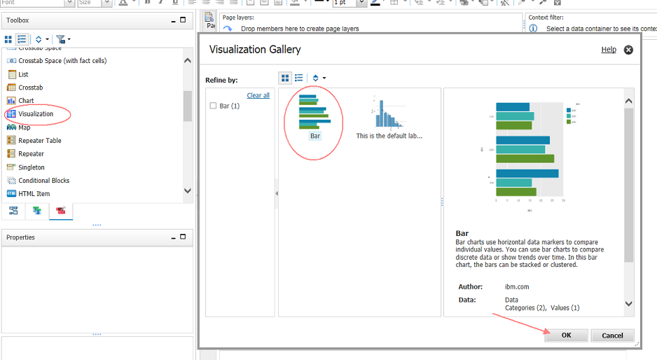
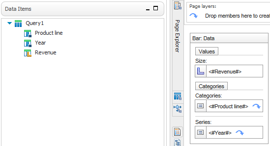
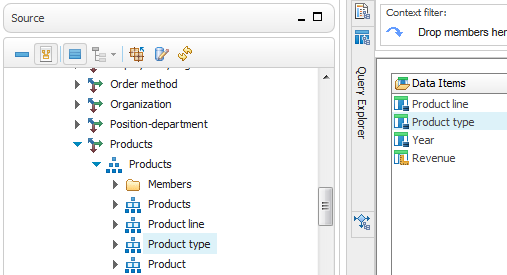
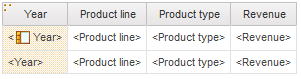
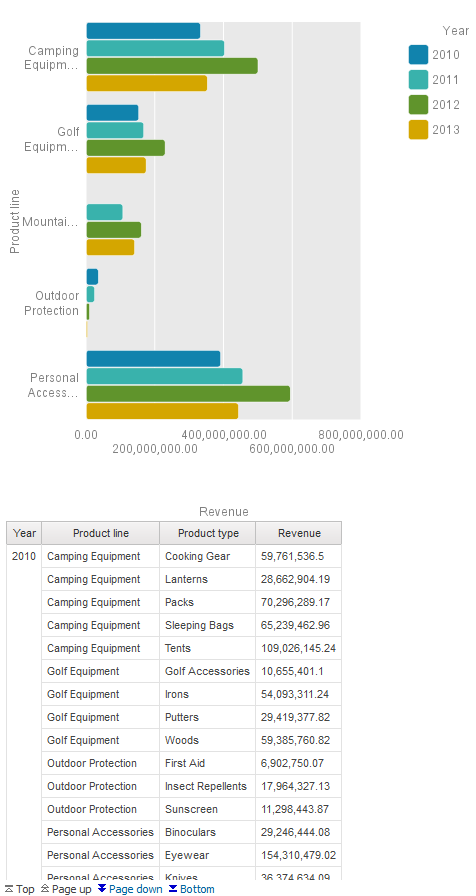
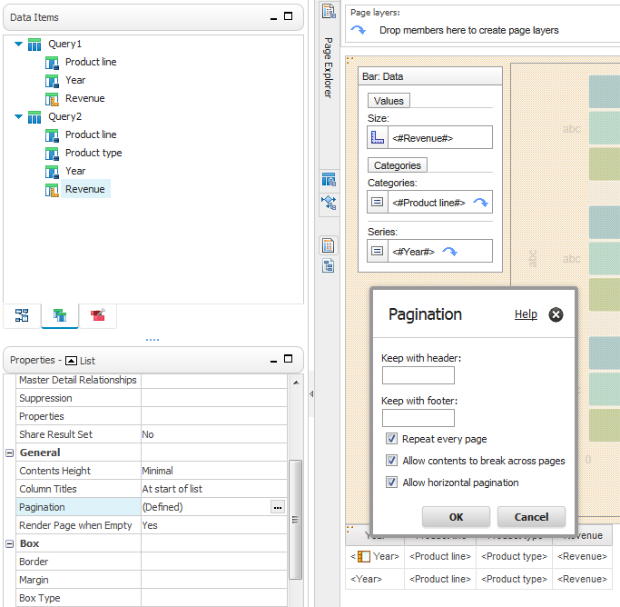

# Business Analytics 最佳实践：对 IBM Cognos Report Studio 中使用的 RAVE 可视化结果进行分页
产品：IBM Cognos Business Inteligence 10.2.2.x；关注领域：报告

**标签:** 分析

[原文链接](https://developer.ibm.com/zh/articles/ba-pp-reporting-advanced-report-design-page704/)

Kalyani Raut

发布: 2017-03-15

* * *

## 简介

### 目的

本文介绍在执行报告时，在 Cognos BI 10.2.2 Report Studio 中为 RAVE 可视化结果提供分页功能的步骤。

### 适用性

IBM Cognos Business Intelligence 10.2.2 及更高版本。

### 前提条件

读者应对 IBM Cognos Report Studio 10.2.2 有很好的了解。

## 设置 Pagination 属性

Pagination 属性可用于所有内置对象，比如列表、图表和交叉表，但对于 RAVE 可视化结果，没有启用已有的属性。因此，当报告数据的剩余部分分散在多个页面上时，仅会在第一页上显示 RAVE 可视化内容，而后续页面上是一片空白。

通过本文，报告作者将了解如何为 Cognos 报告中使用的可视化内容实现分页功能。

在本例中，使用了 GO Data Warehouse (analysis) 包内 Sales and Marketing (analysis) 文件夹下的 Sales 名称空间。

**备注** ：开始之前，必须先将可视化工具导入 Cognos 库中。如果尚未执行此操作，可从 [Analytics Zone 社区](https://www.ibm.com/developerworks/community/groups/service/html/communityview?communityUuid=9685c9a6-3133-4823-85e8-f5f81268267a#fullpageWidgetId=W561990aafebc_4d8b_9af8_7c03c0081265&folder=fa9cc7b3-7307-4a15-abc0-352e43dafb1a) 下载 All\_Visualizations.zip 包。

1. 在浏览器中，登录到 **IBM Cognos BI** 门户。
2. 在 **Launch** 菜单中单击 **Report Studio** 。
3. 在 select a Package 窗口中，选择 **GO Data Warehouse (analysis) package** 。
4. 在启动画面 (splash) 窗口中，单击 **Create New** 并选择 **Blank** 报告。单击 **OK** 。
5. 转到 Toolbox 选项卡，将 Visualization 对象拖到报告页面上。
6. 在弹出 Visualization Gallery 窗口时，从列表中选择 **Bar Visualization** ，然后单击 OK。

##### Visualization Gallery 显示了所选列表中的条形图的可视化效果。



1. 单击 Object and Query Names 窗口中的 **OK** 。
2. 打开 Query Explorer，选择可视化查询 ( **Query 1**)。
3. 将以下项从 Sales and Marketing (analysis) 文件夹 **拖动** 到 Data Items 部分。


    ```
    •    [go_data_warehouse].[Sales and Marketing (analysis)].[Sales].[Products].[Products].[Product line]
    •    [go_data_warehouse].[Sales and Marketing (analysis)].[Sales].[Time].[Time].[Year]
    •    [go_data_warehouse].[Sales and Marketing (analysis)].[Sales].[Sales fact].[Revenue]

    ```


    Show moreShow more icon

4. 在 Page Explorer 中，选择 **Page 1** ，单击 **Data Item 选项卡** ，将数据项放入可视化效果中。

    - 将 **Revenue** 拖到 Size 框
    - 将 **Retailer Name** 拖到 Categories 框
    - 将 **Year** 拖到 Series 框

##### 在报告页上显示条形图，其中填入了容器中的数据项



1. 转到 **Query Explorer** 并单击 **Queries** 。
2. 复制 **Query1** 并将它粘贴回相应部分。这将创建 **Query2** 作为 Query1 的副本。
3. 双击 **Query2** 。
4. 在 Source 选项卡中，单击 **[go\_data\_warehouse].[Sales and Marketing (analysis)].[Sales].[Products].[Products].[Product type]** 并拖到产品线下。

##### 添加了 Product Type 的 Query 2 数据项容器



1. 在 Page Explorer 中，单击 **Page 1** 。
2. 在 Data Items 选项卡中，单击 **Query 2** 并拖到可视化效果下。这将创建一个列表。
3. 将 Year 列移到列表的开头，然后单击 Year 标题和 Group 按钮。

##### 显示在左侧放置 Year 列并对其进行分组的列表



如果现在执行此报告，我们将获得一个条形图和一个列表报告，它们看起来类似下图。

##### 报告输出显示了条形图和列表。



如果单击 Page down 或 Bottom 导航到下一页，我们只会发现列表，而条形图丢失了。要克服此问题，可以执行以下步骤。

1. 在 **Toolbox 选项卡** 中，将一个 **List** 拖到报告页上的可视化效果的左侧，并将 Query2 分配给它。单击 **OK** 。
2. 在 **Data Item 选项卡** 中，将 **Revenue** 从 **Query 2** 拖到新列表。
3. 选择 Year 的 **List Column Body** 属性，将 **Box Type** 属性设置为 **None** ，因为我们不想在报告输出中显示它。
4. 在菜单栏上，单击 **Lock\\Unlock** 按钮解锁报告。
5. 选择该可视化效果，并将它拖到文本项 **Revenue** 右侧的 List。
6. 删除文本项 **Revenue** 。
7. 选择 List，转到 **Pagination** 属性并选中 **Repeat Every Page** 复选框。

##### 已为列表选择了 Pagination 属性并选择了 Repeat every page 选项



现在运行报告，您将看到在浏览页面时，可视化效果会显示在所有页面上。

## Download

[Pagination\_for\_RAVE\_visualizations\_report\_Spec.txt](http://public.dhe.ibm.com/software/dw/dm/cognos/reporting/advanced_report_design/Pagination_for_RAVE_visualizations_report_Spec.zip)