# Ceph 双活数据中心实现与最佳实践
基于 Ceph 12.8 的双活网关与配置建议

**标签:** 容器,对象存储

[原文链接](https://developer.ibm.com/zh/articles/os-ceph-active-active-data-center-and-best-practices/)

魏 新宇

发布: 2019-08-19

* * *

## 前言

存储虚拟化是云计算的重要组成部分。目前在开源社区，应用最广、受关注度最高的存储虚拟化软件是 Ceph。Ceph 内部实现了分布式数据对象存储，对外可以提供文件系统、对象、块设备的访问方式，实现了统一存储平台。Ceph 社区最新版本是 14，而 Ceph 12 是市面用的最广的稳定版本。

目前，Ceph 主要有三种企业级应用场景：

- IOPS 密集型：这种类型的场景通常是支撑在虚拟化/私有云上运行数据库。如在 OpenStack 上运行 Mysql、MariaDB 或 PostgreSQL 等。IOPS 密集型场景对磁盘的性能要求较高，最好使用全闪架构。如果使用混合架构，机械盘转速需要 1.2 万，并使用高速盘存储频繁写操作的日志或元数据。
- 高吞吐量型：这种类型的应用场景主要是大块数据传输，如图像、视频、音频文件等。高吞吐量型磁盘的要求没有 IOPS 密集型高，但需要配置较高的网络。同时也需要配置 SSD 来处理写日志。
- 高容量型：这种场景主要用于存储归档、离线数据。它对磁盘的容量要求高，对性能无过多要求。写日志也可以存储在 HDD 上。

随着 Ceph 的不断成熟、性能的不断提升，越来越多的企业将重要性高的应用迁移到 Ceph 上，这就对数据的保护提出了更高的要求。在单数据中心内，Ceph 可以提供数据多副本，实现数据的冗余性。那么，Ceph 能否像集中存储那样，实现跨数据中心的双活呢？

基于这个出发点，本教程将重点介绍通过 Ceph 网关实现双活，此外，还会介绍 Ceph 的架构、Ceph 安装部署、BuleStore 的性能优势、Ceph 的容量规划，以期对您在 Ceph 的使用中有实际的帮助。本文以 Ceph 社区 12.8 版本进行 Demo 展示。

## Ceph 架构

Ceph 存储集群由三类守护进程组成：OSD、Monitor 和 Manager。

- **OSD** ：OSD 是 Ceph 存储数据的空间，通常一个 HDD 是一个 OSD，并且不建议做 RAID（独立硬盘冗余阵列）。每个 OSD 有一个 OSD 守护进程。Ceph OSD 利用 Ceph 节点的 CPU、内存和网络资源来执行数据复制、纠删码、数据恢复、监控和报告功能。

- **Monitor** ：Monitor 负责维护 Ceph 存储集群，主要是集群中数据的主副本以及存储集群的当前状态。注意，多个 Monitor 的信息需要强一致性，因此要求 Monitor 节点之间的系统时间是一致的，并且网络延时要低。

- **Manager** ：Manager 是 Ceph 12.8 中的新功能，它维护放置组（PG）、进程元数据和主机元数据的详细信息。这部分功能此前由 Monitor 完成（其目的是提高 Ceph 集群的性能）。Manager 可以处理只读 Ceph CLI 查询请求，例如放置组统计信息等。此外，Manager 还提供 RESTful 监控 API。


如果要使用 Ceph 文件系统和对象接口，Ceph 集群还需要如下节点：

- **元数据服务器** （Metadata Server，简称 MDS）：每个 MDS 节点运行 MDS 守护程序（ceph-mds）管理与 Ceph 文件系统（CephFS）上存储的文件相关的元数据。
- **对象网关** ：Ceph 对象网关节点上运行 Ceph RADOS 网关守护程序（ceph-radosgw）。它是一个构建在 librados 之上的对象存储接口，也是一个为应用程序提供 Ceph 存储集群的 RESTful 网关。Ceph 对象网关支持两个接口：S3 和 OpenStack Swift。

## 利用 Ceph 实现双活数据中心

下面我们来看一下如何通过 Ceph 的对象网关在两个数据中心实现双活，包括：Ceph 的安装配置、对象网关的配置以及如何通过配置 S3 来验证双活机制的效果。整个过程大约需要 20 分钟。

### Ceph 的多站点网关

通过 Ceph 的对象网关：RADOS Gateway (简称 RGW)，我们可以实现多站点的配置，最终实现双活数据中心。Ceph 的多站点网关的架构如图 1 所示，我们先了解 4 个概念：

- **Zone** ：定义了由一个或多个 Ceph 对象网关实例组成的逻辑组。
- **Zone Group** ：包含一个或多个 zone。在一个 zone group 中，一个 zone 将会被配置成 master zone。master zone 处理所有 bucket 和 user 的变更。Secondary zone 可以接受 bucket 和 user 操作请求，然后将操作请求重定向到 master zone。如果 master zone 出现故障，secondary zone 将会被提升为 master zone。
- **Realm**: 它代表一个全局唯一的命名空间，包含一个或者多个 zone group。但必须要有一个 master zone group。Realm 使用 period 的概念来管理 zone group 和 zone 的配置状态。每次对 Zone group 或 zone 进行变更，都会对 period 做 update 和 commit 操作。每个 Ceph Cluster Map 都会维护它的历史版本。这些版本被称为 epoch。
- **Period** ：每个 period 包含一个独有的 ID 和 epoch。每次提交操作都会使 epoch 递增。每个 realm 都与一个当前的 period 相关联，它保持 zone group 和存储策略的当前配置状态。

##### 图 1\. Ceph 的多站点网关示意图

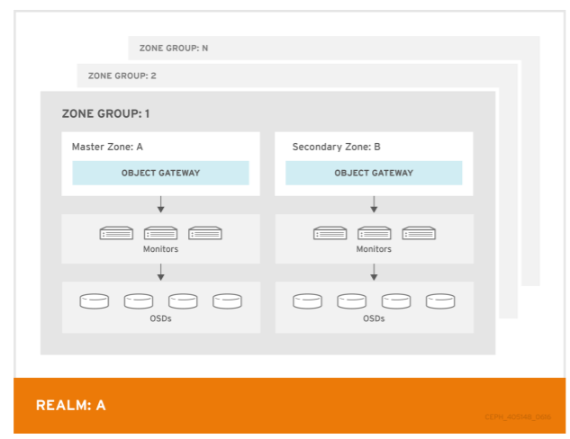

Ceph 的多站点由一个 zone group 组成，zone 之间的复制进程是异步完成的，在第一个 zone 数据写入完成自动开始了。每个 zone 具有一个或多个 ceph-radosgw 实例，多个网关通常指向到 zone 中一个 Ceph 集群。从 Ceph 客户端发起的请求，可以在不同 radosgw 实例之间做负载均衡。

在本文的环境中，我们将会部署两个 Ceph 集群：ceph1 和 ceph-david，分别位于 master zone：dc1 和 secondary zone：dc2。两个 zone 组成名为 production 的 zone group。这个 zone group 组成了名为 DavidWei-Demo 的 REALM，如下图 2 所示。

##### 图 2\. Ceph 双活站点架构图

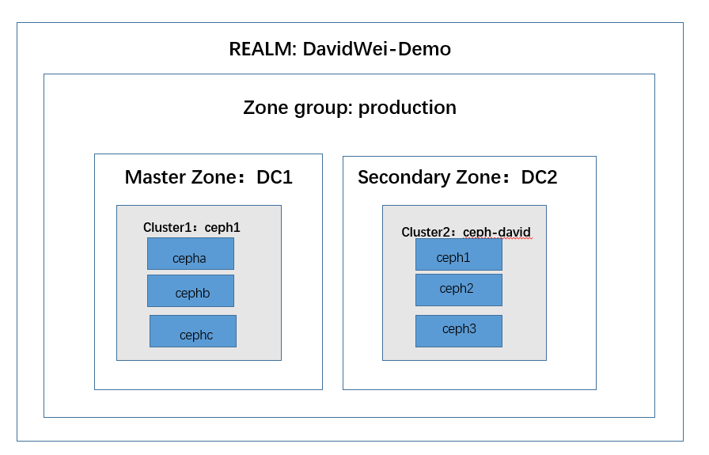

接下来，我们通过 [Ansible](https://www.ibm.com/developerworks/cn/opensource/os-using-ansible-for-data-center-it-automation/index.html) 安装一套 Ceph（ceph-david），然后与已经存在的 Ceph 集群（Ceph1）配置成多站点。

### 安装 Ceph 集群

本节只介绍 ceph-david 集群的安装，ceph1 安装的方式与之相同。由于资源有限，我们使用三个节点（Ceph1、Ceph2、Ceph3）运行所有 Ceph 的守护进程（OSD、Monitor 和 Manager）。如果在生产上，建议将 OSD 和 Monitor 分不同的节点部署，Manager 可以运行在 Monitor 节点上。

在展示过程中，使用 Ceph 集群外的一个堡垒机（bastion）作为 Ceph 安装部署节点。后面的多集群配置也用这个堡垒机完成。

首先在堡垒机上查看 inventory 文件。文件中定义了各个 ceph-david 集群各个角色对应的主机。可以看到几个角色都安装相同的三个 Ceph 节点上：Ceph1、Ceph2、Ceph3，如清单 1 所示：

##### 清单 1\. Inventory 配置文件

```
# cat ~/dc2/ceph-ansible/inventory
[mons]
ceph[1:3]

[mgrs]
ceph[1:3]

[osds]
ceph[1:3]

[clients]
ceph[1:3]
bastion ansible_connection=local

[all:vars]
ansible_user=cloud-user

```

Show moreShow more icon

我们通过 Ansible 命令检查 inventory 中定义的主机都可以正常访问，如清单 2 所示：

##### 清单 2\. 从堡垒机访问 Ceph 节点

```
# ansible -i inventory -m ping all
bastion | SUCCESS => {
    "changed": false,
    "ping": "pong"
}
ceph2 | SUCCESS => {
    "changed": false,
    "ping": "pong"
}
ceph3 | SUCCESS => {
    "changed": false,
    "ping": "pong"
}
ceph1 | SUCCESS => {
    "changed": false,
    "ping": "pong"
}

```

Show moreShow more icon

接下来，我们配置使用 Ansible 部署 Ceph 的变量文件，如清单 3 所示：

##### 清单 3\. 查看 Ceph 的部署文件

```
# ls -l group_vars/ | grep -v sample
total 136
-rw-r--r--. 1 root root  1777 Mar 29 06:37 all.yml
-rw-r--r--. 1 root root  1927 Mar 19 11:35 clients.yml
-rw-r--r--. 1 root root  1558 Mar 19 11:35 mgrs.yml
-rw-r--r--. 1 root root   262 Mar 19 11:35 osds.yml
-rw-r--r--. 1 root root  1019 Apr 16 18:04 rgws.yml

```

Show moreShow more icon

在修改配置文件之前，确认在 Ceph 节点上要使用的磁盘名称。为 `vdc` 和 `vdd` ，如清单 4 所示：

##### 清单 4\. 查看磁盘名称

```
#  ssh cloud-user@ceph1 "lsblk | grep 10G"
Warning: Permanently added 'ceph1' (ECDSA) to the list of known hosts.
vdc                   253:32   0   10G  0 disk
vdd                   253:48   0   10G  0 disk

```

Show moreShow more icon

接下来，修改 osds.yml 文件，在文件中我们定义了 `osd_scenario` 为 `lvm` ；每个 OSD 对应一个磁盘；OSD 使用的磁盘为 `vdc` 和 `vdd` 。如清单 5 所示：

##### 清单 5\. 修改 osd 配置文件

```
# cat osds.yml
### OSD Configuration ###
valid_osd_scenarios:
osd_scenario: lvm

# Number of OSDS per drive that we want to configure
osds_per_device: 1

# Declare devices to be used as OSDs
devices:
  - /dev/vdc
  - /dev/vdd

```

Show moreShow more icon

接下来，我们配置 Ceph 集群主变量配置文件： `all.yml` ，这里只列出关键配置，详细内容请参照 [GitHub](https://github.com/ocp-msa-devops/Ceph/blob/master/all.yml) 。如清单 6 所示：

1. 将集群名称设置为 `ceph-david` 。
2. 集群对象存储类型为 `bluestore` 。
3. 设置 `public_network` 和 `cluster_network` 的网段。
4. 启用容器化部署（containerized\_deployment）。部署完毕后 Ceph 的守护进程以容器方式运行。
5. 网关使用的网口为 `eth0（radosgw_interface）` 。
6. 使用 Ceph 容器镜像： `docker.io/ceph/daemon` 。

##### 清单 6\. all.yml 配置文件

```
# cat all.yml

###Ceph Auth Configuration###
#The 'cluster' variable determines the name of the cluster.
cluster: ceph-david

# We can configure filestore or bluestore as our objecstore
osd_objectstore: bluestore

monitor_interface: eth0
public_network:  172.16.0.0/24
cluster_network: 192.168.1.0/24

###Containerized Configuration###
containerized_deployment: true
ceph_docker_image: "ceph/daemon"
ceph_docker_image_tag: "latest"
ceph_docker_registry: docker.io
docker_pull_retry: 6
docker_pull_timeout: "600s"
upgrade_ceph_packages: False

```

Show moreShow more icon

对于客户端而言，copy\_admin\_key 变量设置为 true 的作用是：将管理密钥复制到 inventory 中定义的了客户端节点，如清单 7 所示。在我们的环境中，Ceph Client 也是 Ceph 的三个节点。

##### 清单 7\. Clients.yml 配置文件

```
[root@bastion-a23a group_vars]# cat Clients.yml
copy_admin_key: true

```

Show moreShow more icon

准备好所有变量后，我们就可以开始部署 Ceph 集群。安装的主 Playbook 是 site-docker.yml。由于篇幅有限，我们把这个文件的内容放置到 [GitHub](https://github.com/ocp-msa-devops/Ceph/blob/master/site-docker.yml) 上。

接下来，我们通过 Ansible 安装 Ceph：

```
#ansible-playbook -i inventory site-docker.yml

```

Show moreShow more icon

然后，查看 ceph-david 集群状态，返回结果如下图 3 所示，集群状态正常。

```
#ceph –cluster ceph-david status

```

Show moreShow more icon

##### 图 3\. 查看 Ceph 集群状态

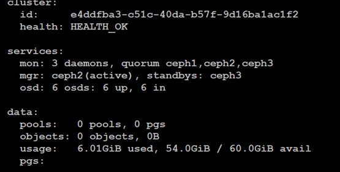

用同样的方式，安装 Ceph 集群 dc1。确保安装后集群的状态正常。

### 在两个 Ceph 集群上配置对象网关

接下来，我们在每个集群的 3 个节点上部署 RGW 服务，使用 `ceph-ansible` 来部署和配置 RGW 服务。在部署之前，修改 Ansible 的主变量配置文件，在 dc1 即 ceph1 集群的 `all.yml` 结尾增加内容如清单 8 所示：

##### 清单 8\. all.yml 配置文件增加内容

```
client.rgw.cepha:
    host: cepha
    keyring: /var/lib/ceph/radosgw/ceph-rgw.cepha/keyring
    log file: /var/log/ceph/ceph-rgw-cepha.log
    rgw frontends: civetweb port=10.0.0.11:8080 num_threads=1024
    rgw_dynamic_resharding: false
    debug_civetweb: "0/1"
    rgw_enable_apis: s3,admin
    rgw_zone: dc1
    rgw_thread_pool_size: 1024
client.rgw.cephb:
    host: cephb
    keyring: /var/lib/ceph/radosgw/ceph-rgw.cephb/keyring
    log file: /var/log/ceph/ceph-rgw-cephb.log
    rgw frontends: civetweb port=10.0.0.12:8080 num_threads=1024
    rgw_dynamic_resharding: false
    debug_civetweb: "0/1"
    rgw_enable_apis: s3,admin
    rgw_zone: dc1
    rgw_thread_pool_size: 1024
client.rgw.cephc:
    host: cephc
    keyring: /var/lib/ceph/radosgw/ceph-rgw.cephc/keyring
    log file: /var/log/ceph/ceph-rgw-cephc.log
    rgw frontends: civetweb port=10.0.0.13:8080 num_threads=1024
    rgw_dynamic_resharding: false
    debug_civetweb: "0/1"
    rgw_enable_apis: s3,admin
    rgw_zone: dc1
rgw_thread_pool_size: 1024

```

Show moreShow more icon

在执行 ansible playbook 之前，确认 inventory 中 `[rgws]` 组中列出了 3 个节点，如清单 9 所示。

##### 清单 9\. inventory 内容

```
# cat  ~/dc1/ceph-ansible/inventory
####Ceph ansible
[mons]
ceph[a:c]

[mgrs]
ceph[a:c]

[osds]
ceph[a:c]

[clients]
ceph[a:c]
bastion ansible_connection=local

[rgws]
ceph[a:c]

[all:vars]
ansible_user=cloud-user

```

Show moreShow more icon

运行 dc1 集群的 `site-docker.yml playbook` 。由于更改只与 RGW 服务完全相关。在这种情况下， `-l` 选项可用于将 playbook 执行限制为 `rgws hostgroup` ，执行结果如下图 4 所示：

```
#ansible-playbook -i inventory site-docker.yml -l rgws

```

Show moreShow more icon

##### 图 4\. 成功安装 RGW

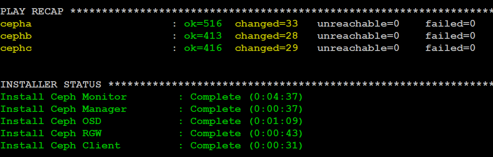

接下来，我们在 ceph-david 集群上执行相同的步骤，在 `all.yml` 增加如下内容：

##### 清单 10\. all.yml 增加内容

```
client.rgw.ceph1:
host: ceph1
keyring: /var/lib/ceph/radosgw/ceph-rgw.ceph1/keyring
log file: /var/log/ceph/ceph-rgw-ceph1.log
rgw frontends: civetweb port=172.16.0.11:8080 num_threads=1024
rgw_dynamic_resharding: false
debug_civetweb: "0/1"
rgw_enable_apis: s3,admin
rgw_zone: dc2
rgw_thread_pool_size: 1024
client.rgw.ceph2:
host: ceph2
keyring: /var/lib/ceph/radosgw/ceph-rgw.ceph2/keyring
log file: /var/log/ceph/ceph-rgw-ceph2.log
rgw frontends: civetweb port=172.16.0.12:8080 num_threads=1024
rgw_dynamic_resharding: false
debug_civetweb: "0/1"
rgw_enable_apis: s3,admin
rgw_zone: dc2
rgw_thread_pool_size: 1024
client.rgw.ceph3:
host: ceph3
keyring: /var/lib/ceph/radosgw/ceph-rgw.ceph3/keyring
log file: /var/log/ceph/ceph-rgw-ceph3.log
rgw frontends: civetweb port=172.16.0.13:8080 num_threads=1024
rgw_dynamic_resharding: false
debug_civetweb: "0/1"
rgw_enable_apis: s3,admin
rgw_zone: dc2
rgw_thread_pool_size: 1024

```

Show moreShow more icon

在执行 ansible playbook 之前，确认 inventory 中[rgws]组中列出了 3 个节点，因此部署成功以后，Ceph 集群将会有三个对象网关实例，如清单 11 所示。

##### 清单 11 inventory 内容

```
[mons]
ceph[1:3]

[mgrs]
ceph[1:3]

[osds]
ceph[1:3]

[clients]
ceph[1:3]
bastion ansible_connection=local

[rgws]
ceph[1:3]

[all:vars]
ansible_user=cloud-user

```

Show moreShow more icon

修改后，运行 `site-docker playbook` ，将 playbook 执行限制为 `rgws hostgroup` ，执行结果类似图 4。

```
# ansible-playbook -i inventory site-docker.yml -l rgws

```

Show moreShow more icon

在 RGW 安装成功以后，Ceph 集群中会自动创建了一个 Storage Pool。在安装 RGW 时 Ceph 自动创建了一个池，Ceph 集群的副本被设置为 3，每次写操作都会被复制两次，因此将有三个对象副本，如清单 12 所示：

##### 清单 12\. 查看集群的 Storage Pool

```
# ceph --cluster dc1 osd pool ls detail
pool 1 '.rgw.root' replicated size 3 min_size 2 crush_rule 0 object_hash rjenkins pg_num 8 pgp_num 8 last_change 51 flags hashpspool stripe_width 0 application rgw

# ceph --cluster ceph-david osd pool ls detail
pool 1 '.rgw.root' replicated size 3 min_size 2 crush_rule 0 object_hash rjenkins pg_num 8 pgp_num 8 last_change 23 flags hashpspool stripe_width 0 application rgw

```

Show moreShow more icon

### 配置 Ceph 双活网关

下面我们来配置一个包含两个 zone 的 zone group。每个 zone 包含 3 个 Ceph RGW 实例，每个 zone 中有一个 Ceph 集群，每个 zone 都处于活动状态，可以接收写入操作。如果其中一个 zone 出现故障，则本 zone group 中的其他 zone 会接管业务访问。

配置之前，停止两个 Ceph 集群上所有 Ceph 节点的 RGW 服务，以 `rgw.cepha.service` 为例：

```
#systemctl stop rgw.cepha.service

```

Show moreShow more icon

接下来，通过定义变量变量，进行多站点的配置。定义 realm、zone group、zones、master zone、secondary zone 以及 ZONE ENDPOINTS 等变量，如清单 13 所示：

##### 清单 13\. 配置环境变量

```
export REALM="DavidWei-Demo"
export ZONEGROUP="production"
export MASTER_ZONE="dc1"
export SECONDARY_ZONE="dc2"
export ENDPOINTS_MASTER_ZONE="http://cepha:8080,http://cephb:8080,http://cephc:8080"
export URL_MASTER_ZONE="http://cepha:8080"
export ENDPOINTS_SECONDARY_ZONE="http://ceph1:8080,http://ceph2:8080,http://ceph3:8080"
export URL_SECONDARY_ZONE="http://ceph1:8080"
export SYNC_USER="sync-user"
export ACCESS_KEY="redhat"
export SECRET_KEY="redhat"

```

Show moreShow more icon

接下来创建 realm，命令执行结果如图 5 所示，DavidWei-Demo REALM 创建成功。

```
# radosgw-admin --cluster dc1 realm create --rgw-realm=${REALM} –default

```

Show moreShow more icon

##### 图 5\. 创建 REALM

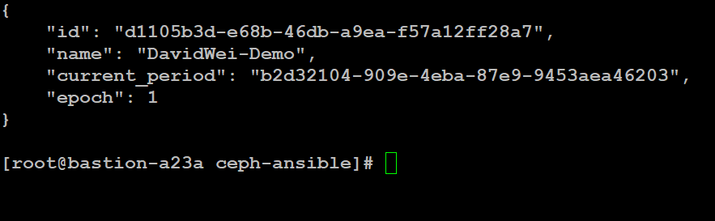

一个 realm 至少需要包含一个 master zone group。接下来我们创建 master zone group（名称为 production）并指定 zone group 的 endpoints 为 Ceph1 集群的节点，执行结果如下图 6 所示：

```
# radosgw-admin --cluster dc1 zonegroup create --rgw-zonegroup=${ZONEGROUP} --endpoints=${ENDPOINTS_MASTER_ZONE} --rgw-realm=${REALM} --master –default

```

Show moreShow more icon

##### 图 6\. 成功创建 Zone Group production

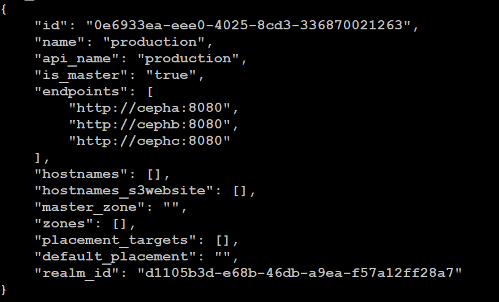

在 zone group 中创建 master zone，指定 endpoints 为 Ceph1 集群的节点：

```
# radosgw-admin --cluster dc1 zone create --rgw-zonegroup=${ZONEGROUP} --rgw-zone=${MASTER_ZONE} --endpoints=${ENDPOINTS_MASTER_ZONE} --master –default

```

Show moreShow more icon

最后，我们确认 endpoint 配置成功，如下图 7 所示：

```
# radosgw-admin --cluster dc1 zonegroup  get production | grep -A 3 endpoints

```

Show moreShow more icon

##### 图 7\. 查看 Endpoint

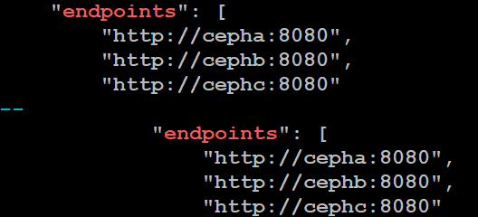

### 启动双活网关

我们在 master zone 中创建同步用户（sync-user），并启动 RGW 服务。

同步用户是系统 RGW 用户，两个集群将使用它们相互连接，以便可以在它们之间同步数据，执行结果如下图 8 所示：

```
#  radosgw-admin --cluster dc1 user create --uid=${SYNC_USER} --display-name="Synchronization User" --access-key=${ACCESS_KEY} --secret=${SECRET_KEY} –system

```

Show moreShow more icon

##### 图 8\. 创建同步用户

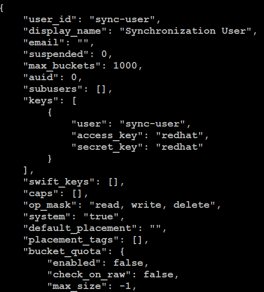

将创建的同步用户分配到 master zone：

```
#radosgw-admin --cluster dc1 zone modify --rgw-zone=${MASTER_ZONE} --access-key=${ACCESS_KEY} --secret=${SECRET_KEY}

```

Show moreShow more icon

更新 period 提交变更：

```
#  radosgw-admin --cluster dc1 period update –commit

```

Show moreShow more icon

接下来，在 DC1（cepha 节点）中启动 RGW 服务：

```
# cd ~/dc1/ceph-ansible/
# for i in a b c; do ansible -b -i inventory -m shell -a "systemctl start ceph-radosgw@rgw.ceph${i}.service" ceph${i}; done

```

Show moreShow more icon

确保 RGW 服务是否在集群的 3 个节点上运行。

使用 curl 命令，确保可以访问每个节点上的 RGW 服务提供的端口 8080，执行结果如图 9 所示：

```
# for NODE in a b c; do echo -e "\n" ; curl http://ceph${NODE}:8080; done

```

Show moreShow more icon

##### 图 9\. Curl 执行结果

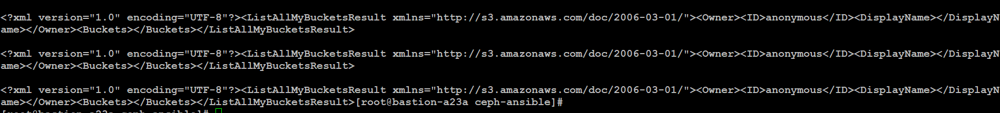

接下来，配置 secondary zone，在 ceph1 的 RGW 节点中执行以下命令，以便从 master zone 中提取 `REALM` 信息：

```
#  radosgw-admin --cluster ceph-david realm pull --url=${URL_MASTER_ZONE} --access-key=${ACCESS_KEY} --secret=${SECRET_KEY} --rgw-realm=${REALM}

```

Show moreShow more icon

将从 master zone 获取的 `REALM` 作为 ceph-david 的默认 realm：

```
# radosgw-admin --cluster ceph-david realm default --rgw-realm=${REALM}

```

Show moreShow more icon

从 master zone 获取 period 信息：

```
# radosgw-admin --cluster ceph-david period pull --url=${URL_MASTER_ZONE} --access-key=${ACCESS_KEY} --secret=${SECRET_KEY}

```

Show moreShow more icon

执行命令结果如下图 10 所示：

##### 图 10\. 获取 period 信息

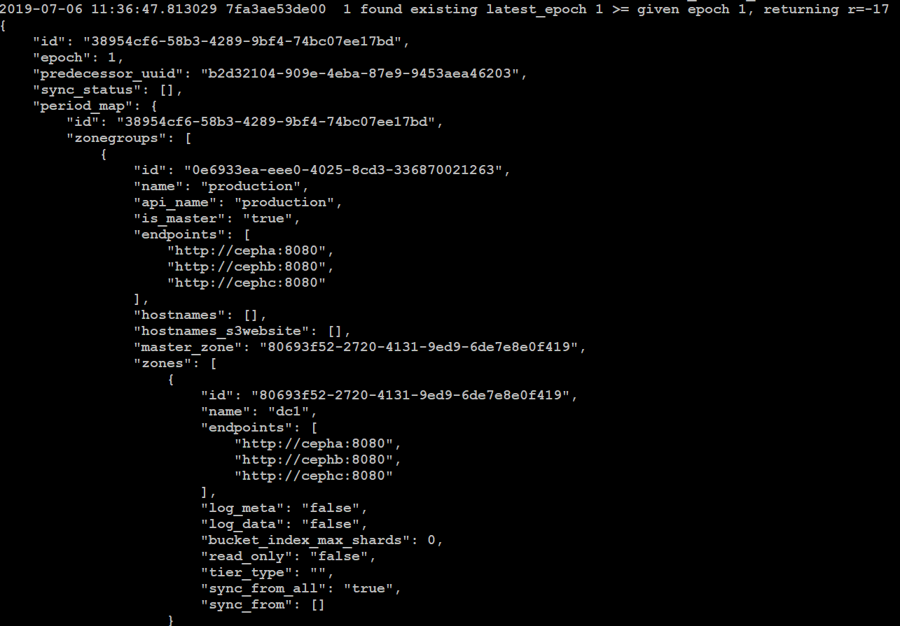

在获取了 period 信息以后，为 ceph-david 创建一个新的 zone：dc2，作为 master zone 的辅助，执行命令结果如下图 11 所示：

```
#  radosgw-admin --cluster ceph-david zone create --rgw-zonegroup=${ZONEGROUP} --rgw-zone=${SECONDARY_ZONE} --endpoints=${ENDPOINTS_SECONDARY_ZONE} --access-key=${ACCESS_KEY} --secret=${SECRET_KEY}

```

Show moreShow more icon

##### 图 11\. 创建 Secondary Zone

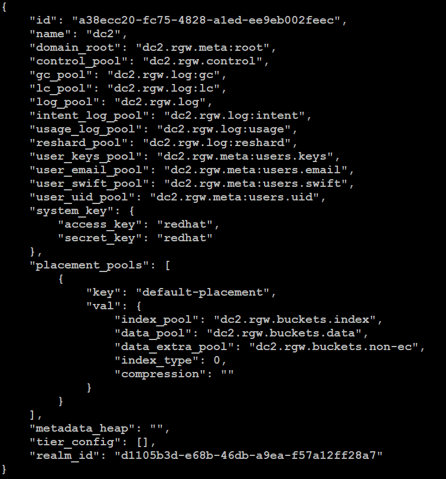

将创建的 secondary zone 的信息更新到 period，更新后 Master zone 会知道 secondary zone 已经被创建：

```
# radosgw-admin --cluster ceph-david period update –commit

```

Show moreShow more icon

在 secondary zone 的节点中启动 RGW 服务：

```
# cd ~/dc2/ceph-ansible/
# for i in 1 2 3 ; do ansible -b -i inventory -m shell -a "systemctl start ceph-radosgw@rgw.ceph${i}.service" ceph${i}; done

```

Show moreShow more icon

用 curl 验证 RGW 服务提供的端口 8080 可被访问：

```
#  for NODE in a b c; do echo -e "\n" ; curl http://ceph${NODE}:8080; done

```

Show moreShow more icon

完成第二个 zone 的配置后，检查 zone DC1 和 DC2 之间的同步状态，如下图 12 所示，正在进行同步：

```
#  radosgw-admin  --cluster dc1 sync status

```

Show moreShow more icon

##### 图 12\. 检查同步状态

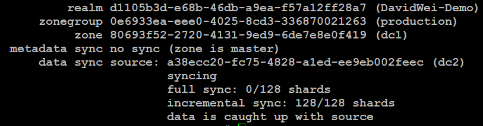

截止到目前，我们已经配置了双活网关。接下来我们配置 S3 客户端上传对象文件，来测试 Ceph 集群工作是否正常。

### 创建用户

首先在 dc1 中创建一个 RGW 用户，保存用户的 access\_key 和 secret\_key，后面会用到：

```
# radosgw-admin --cluster dc1 user create --uid="user1" --display-name="weixinyuuser1"

```

Show moreShow more icon

检查用户 user1 已经在 master zone dc1 中创建成功：

```
#  radosgw-admin --cluster dc1 user list

```

Show moreShow more icon

数据数据同步完成后， RGW 用户 user1 也出现在 zone dc2 中：

```
# radosgw-admin --cluster ceph-david user list

```

Show moreShow more icon

### 启动 Haproxy LoadBalancers

在环境中，每个 zone 都有 1 个负载均衡器（HAproxy）。它负责在每个 zone 中的 3 个 RGW 实例之间分配传入的 S3 客户端请求。两个服务均衡器分别运行在节点 lbdc1 和 lbdc2 上。

检查每个 HAproxy 的配置; 有一个前端 ip binded，它接受 S3 客户端连接的 IP，后端使用 DC

1 中的 3 个 RGW 实例的 IP。

前端 IP 10.0.0.100 解析为 `s3.dc1.lab` ，这我们用于在 DC1 中配置 s3 客户端的名称，如下图 13 所示：

```
# ssh cloud-user@lbdc1 cat /etc/haproxy/haproxy.cfg | tail

```

Show moreShow more icon

##### 图 13\. Haproxy 配置

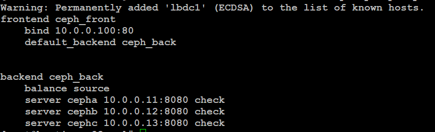

dc2 haproxy 的配置类似，前端 IP 172.16.0.100 解析为 `s3.dc2.lab` 如下图 14 所示：

```
# ssh cloud-user@lbdc2 cat /etc/haproxy/haproxy.cfg | tail

```

Show moreShow more icon

##### 图 14\. Haproxy 配置

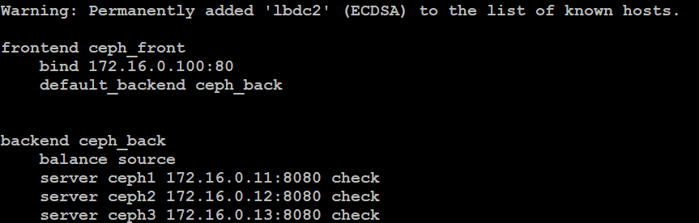

在节点 lbdc1 和 lbdc2 上启动 HAProxy 服务：

```
# ansible -b -a "systemctl restart haproxy"  lbdc*

```

Show moreShow more icon

检查两个 HAProxy 是否正常启动：

```
# ansible -b -a "systemctl status haproxy"  lbdc*

```

Show moreShow more icon

### 配置 S3 客户端

在堡垒机上，使用 s3cmd 的 cli 工具配置 S3 客户端，以便我们可以将对象上传到我们的 RGW 集群：

```
# yum list installed | grep -i s3cmd

```

Show moreShow more icon

通过 s3cmd 配置客户端。使用此前创建用户的信息，如下图 15 所示。

##### 图 15\. 配置 s3 客户端

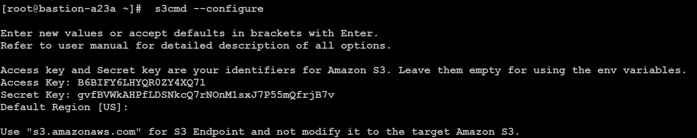

S3 客户端的配置已保存到/root/.s3cfg 中，将配置文件的名称更改为/root/s3-dc1.cfg。

```
#  mv /root/.s3cfg /root/s3-dc1.cfg

```

Show moreShow more icon

### 创建 Bucket

使用 `s3cmd mb` 命令创建第一个 bucket，用-`c~/s3-dc1.cfg` 指定我们 `s3cmd` 配置的位置对于 dc1 集群：

```
# s3cmd -c ~/s3-dc1.cfg mb s3://my-first-bucket
# s3cmd -c ~/s3-dc1.cfg ls

```

Show moreShow more icon

使用 s3cmd RPM 文件上传一个 rpm 文件。

```
# s3cmd -c ~/s3-dc1.cfg put s3cmd-2.0.2-1.el7.noarch.rpm s3://my-first-bucket/

```

Show moreShow more icon

使用 s3cmd la，检查 bucket 中的对象上传成功，如下图 16 所示：

```
#  s3cmd -c ~/s3-dc1.cfg la

```

Show moreShow more icon

##### 图 16\. 查看上传的 rpm 文件


查看 bucket 被同步到了第二个集群：

```
#  radosgw-admin --cluster ceph-david bucket list

```

Show moreShow more icon

用 rados 命令查看 ceph-david 集群中数据池中的对象，如下图 17 所示：

```
#  rados --cluster ceph-david  -p dc2.rgw.buckets.data ls

```

Show moreShow more icon

##### 图 17\. 查看对象文件

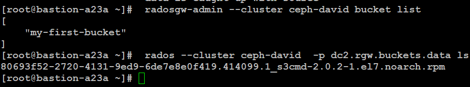

### 检查多站点双向复制

接下来，我们验证上传文件到 ceph-david 集群，看能否自动同步到 ceph1 集群。首先根据 s3-dc1.cfg 创建 s3-dc2.cfg 配置文件，如下图 18 所示：

```
# s3cmd -c ~/s3-dc2.cfg  ls

```

Show moreShow more icon

##### 图 18\. 查看 dc2 中集群的 bucket

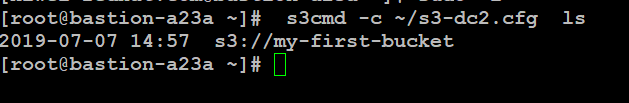

在 dc2 中创建一个 bucket 并存储一个文件，如下图 19 所示：

```
# s3cmd -c ~/s3-dc2.cfg  mb  s3://my-second-bucket
#s3cmd -c ~/s3-dc2.cfg  put /var/log/messages  s3://my-second-bucket

```

Show moreShow more icon

##### 图 19\. 创建并上传文件

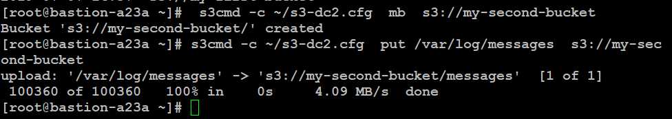

我们验证可以从区域 dc1 访问（使用 s3-dc1.cfg 配置文件访问），说明 Active-Active 多站点群集正常运行，如下图 20 所示。至此，Ceph 双活站点配置完毕。

##### 图 20\. 查看文件


## Ceph 使用的最佳实践

在介绍了通过 Ceph 对象网关实现双活后，接下来我们介绍 Ceph 的最佳实践，其中包括：Ceph 节点服务区配置和 Bluestore 的配置。

### Ceph 节点服务器配置

Ceph 集群 MON 节点数量与集群中的 OSD 数量相关。若 Ceph 集群中，OSD 数量大于 1000，则建议 MON 节点数量为 5，否则为 3。针对不同的企业应用场景 （参考 [前言](#前言) 部分），服务器配置也有所不同。

针 IOPS 密集型场景，服务器配置建议如下：

- OSD：每个 NVMe SSD 上配置四个 OSD（可以使用 lvm）。
- 日志：存放于 NVMe SSD。
- Controller：使用 Native PCIe 总线。
- 网络：每 12 个 OSD 配置一个万兆网口。
- 内存：最小 12G，每增加一个 OSD 增加 2G 内存。
- CPU：每个 NVMe SSD 消耗 10 CPU Cores。

针对高吞吐量型，服务器配置建议如下：

- OSD: 使用 7200 转速的机械盘，每个磁盘为一个 OSD。不需要配置 RAID。
- 日志：如果使用 SATA SSD，日志容量与 OSD 容量的比率为 1:4-5。如果使用 NVMe SSD，则容量比率为 1:12-18。
- 网络：每 12 个 OSD 配置一个万兆网口。
- 内存：最小 12G，每增加一个 OSD 增加 2G 内存。
- CPU：每个 HDD 消耗 0.5 CPU Cores。

针对高容量型，服务器配置建议如下：

- OSDs: 使用 7200 转速的机械盘，每个磁盘为一个 OSD。不需要配置 RAID。
- 日志：使用 HDD 磁盘。
- 网络：每 12 个 OSD 配置一个万兆网口。
- 内存：最小 12G，每增加一个 OSD 增加 2G 内存。
- CPU：每个 HDD 消耗 0.5 CPU Cores。

除此之外，Ceph 的硬件选择也有一些通用的标准，如 Ceph 节点使用相同的：I/O 控制器、磁盘大小、磁盘转速、网络吞吐量和日志配置。

Ceph 集群包含以下两类网络：

- **前端 Public 网络** ：处理客户端发过去的请求并且与 Ceph Monitor 通讯。
- **后端集群网络** ：处理 OSD 心跳、副本复制等。

从性能角度考虑，这两类网络最好使用不同的网卡。在上面的 Ceph 安装中，我们将两个网络进行了分拆。

### Ceph Bluestore DB 和 WAL 分区的配置

BlueStore 是 OSD 守护进程的新后端对象存储。在 BlueStore 之前，Ceph OSD 守护进程的后端对象存储是 FileStore。与 FileStore 相比，BlueSore 有着明显的优势：它将对象数据直接存在于块设备上，而不是像 FileStore 那样那样存放在底层的 XFS 文件系统上。因此 BlueStore 的 I/O 路径要短于 FileStore，如下图 21 所示：

##### 图 21\. FileStore 和 BlueStore 的对比

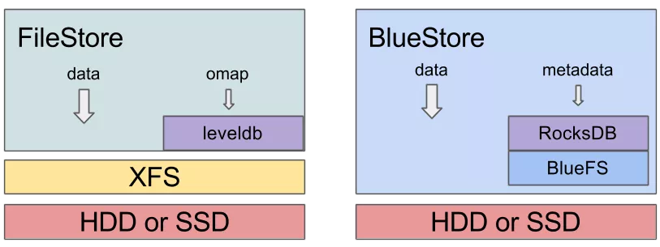

BlueStore 存储引擎的实现，需要存储数据和元数据。目前 Ceph BuleStore 的元数据存储在 RocksDB（K-V 数据库）中。通过为 RocksEnv 提供操作接口，RocksDB 存放在 BlueFS 上。由于 BlueFS 最终通过 RocksDB，承载的是 BlueStore 存储引擎中的元数据，因此它的性能会很大程度上影响整个 Ceph 的性能。

BlueSore 将第一次新写入的数据直接写到块设备上的未分配空间，然后在 RocksDB 中提交也 transaction，以便元数据中记录磁盘中新配的空间。只有当写操作的的数据大小小于配置的法治的时候，数据才会先写到一个预写日志对象（write-ahead journaling scheme），然后再同步到裸磁盘上。这样会造成写两次。FileStore 默认是这样的模式。

BlueFS 支持多种不同类型的设备。按照速率和延迟分为超高速（WAL）、高速（DB）、慢速（Slow）。RocksDB 的日志文件和 BlueFS 自身的日志文件优先使用超高速设备（WAL），BlueFS 中的普通文件优先使用高速设备(DB)。通过这种方式，可以大幅提升了 Ceph 对元数据的操作效率，整个 Ceph 的稳定性和性能都会大幅提升。而 BlueStore 存储的普通数据（非元数据），可由普通大容量机械盘提供，存储在慢速（Slow）设备上。

在不混合驱动器类型时，不需要具有单独的 RocksDB 和 WAL 逻辑卷，BlueStore 将自动管理 RocksDB 的大小。接下来，我们查看使用混合模式下，配置 DB 和 WAL 的方法。根据最佳实践，RocksDB 逻辑卷不小于整个块设备大小的 4％。例如，如果块设备大小为 1TB，则至少创建一个 40GB 的 RocksDB 逻辑卷。

设置 WAL 和 DB 可以在安装 Ceph 时在 Ansible 的配置文件中完成或者在 Ceph 安装后完成。第二种方式更为灵活，比如，我们在系统中有一块 402G 的 SSD， `/dev/sdd` 。我们先对其创建 `vg` ，然后创建 `lv` ，每个 `lv` 大小为 100G。

```
#pvcreate /dev/sdd
#vgcreate cephvg /dev/sdd
#lvcreate -L 100GB -n wal-0 cephvg
#lvcreate -L 100GB -n wal-1 cephvg
#lvcreate -L 100GB -n db-0 cephvg
#lvcreate -L 100GB -n db-1 cephvg

```

Show moreShow more icon

使用 `ceph-volume` 创建 4 个 OSD，用于存放 WAL 和 DB 数据。分别把一组 WAL 和 DB 的 OSD 分配到一个 Storage Pool 中：

```
#ceph-volume lvm create --bluestore --data ceph-pool1/block-0 --block.wal cephvg /wal-0
#ceph-volume lvm create --bluestore --data ceph-pool2/block-0 --block.wal cephvg /wal-1
#ceph-volume lvm create --bluestore --data ceph-pool1/block-1 --block.db cephvg /db-1
#ceph-volume lvm create --bluestore --data ceph-pool2/block-1 --block.db cephvg/db-2

```

Show moreShow more icon

### Ceph Bluestore 的缓存配置

BlueStore Cache 是在内存中开辟的空间。默认情况下，BlueStore 使用 Cache 做读缓存（ `bluestore_default_buffered_write` 默认设置为 false），目的是避免与缓存逐出相关的潜在开销。

如果 `bluestore_default_buffered_write` 选项设置为 true，则首先将数据写入缓冲区，然后将其提交到磁盘、写入确认被发送到客户端。

BlueStore 每个 OSD 消耗的内存量，由 `bluestore_cache_size` 配置选项决定。如果该配置选项未设置，则根据主设备是否使用 HDD 或 SSD（由 `bluestore_cache_size_ssd` 和 `bluestore_cache_size_hdd` 配置选项设置）使用不同的默认值。

在 BlueStore 模式下，我们可以设置如下参数：

- `bluestore_cache_kv_max` ：设置用于键/值数据的最大缓存量（rocksdb 使用）。
- `bluestore_cache_size_ssd` ：由 SSD 支持的默认内存 BlueStore 将用于其缓存

参数的大小，取决于 OSD 的数量、大小和 Ceph 节点内存的大小，需要根据测试结果进行调整。可以确认的是，设置 Cache 可以显著提升读性能。参数调整方法有两种：

#### 在运行时修改

登录任意 OSD 节点：

```
#ceph tell osd.* injectargs --bluestore_cache_kv_max 2147483648

```

Show moreShow more icon

验证是否生效，选取一个 OSD 检查即可：

```
#ceph  --admin-socket /var/run/ceph/***.asok config show | grep bluestore_cache_kv_max

```

Show moreShow more icon

#### 在配置文件中更新

在全部 Ceph 节点的 `/etc/ceph.conf` 中 `[global]` 下添加两行参数配置例：

```
[global]
bluestore_cache_kv_max = 2147483648
bluestore_cache_size_ssd = 10737418240

```

Show moreShow more icon

## 结束语

通过本文，相信您对 Ceph 的架构、Ceph 双活的实现以及最佳实践有了一定的了解，随着 Ceph 的功能不断完善、性能不断提升，相信它的应用场景将会越来越广。