# Cucumber 使用进阶
从实际使用 Cucumber 这一工具的角度出发并以 Cucumber-JVM 实现为基础

**标签:** Java

[原文链接](https://developer.ibm.com/zh/articles/j-lo-cucumber01/)

吕双涛, 刘娟, 柴瑞亚

发布: 2016-04-11

* * *

## Cucumber 是什么

Cucumber 是 BDD 模式下实现可执行规范（Executable Specifications）的开源工具，但是它的使命并不局限于做自动化验收测试，更加重要的在于其能够在团队成员之间构建统一的交流基础（feature 文件）、规范交流用语（Domain Specific Language）、提高各个利益相关方（Business Stakeholders）沟通效率和效果，从而达到提升产品质量、做成客户期望得到的产品这一最终目标。

## 如何使用 Cucumber

Cucumber 有很多种语言的实现版本，例如 Java、Ruby、.NET、JavaScript 等等，并且 Cucumber 可以和主流的测试框架很好地集成，常见的 Selenium、SpringFramework、Ruby on Rails 等，能够方便地引入到您的测试工作中去，几乎没有任何门槛。本文以一个 Java 测试项目为例，介绍如何使用 Cucumber 的 Java 语言实现版本：Cucumber-JVM。

### 将 Cucumber-JVM 依赖加入到项目中

如果您的项目是使用 Maven 管理所依赖的第三方依赖 jar 包，那么引入 Cucumber-JVM 将是一件优雅而且轻松的事情，只需要简单的将如下的 Code Snippet 加入到项目的 pom.xml 的”dependencies”下即可：

##### 清单 1\. pom.xml 中 dependencies 下添加内容

```
<dependency>
<groupId>info.cukes</groupId>
<artifactId>cucumber-java</artifactId>
<version>${cucumber.version}</version>
<scope>test</scope>
</dependency>
<dependency>
<groupId>info.cukes</groupId>
<artifactId>cucumber-junit</artifactId>
<version>${cucumber.version}</version>
<scope>test</scope>
</dependency>
<dependency>
<groupId>junit</groupId>
<artifactId>junit</artifactId>
<version>${junit.version}</version>
<scope>test</scope>
</dependency>

```

Show moreShow more icon

关于 version，请尽量选择适合自己项目的，如果您使用的是 Java 7，没有特殊的要求可以与本文一样采用’1.2.2‘。

### 编写 Executable Specification

Cucumber 之所以受到如此的推崇，与其 Executable Specification 这个特性不无关系。顾名思义，可执行规范给出了至少两个方面的意义：

- 可执行性（Executable）：您可以像执行代码（Java、Ruby…）一样运行这些规范，来验证、验收目标应用。当然，这一点是从技术人员的视角来看的；
- 规范性（Specification）：从非技术人员的视角触发，相比验证本身，他们更加关心系统功能的清晰描述：系统在什么场景下能够做什么样的事情。

这看似简单的两方面似乎关联并不是很大，但是如何能够在同一个基础（feature files）之上做到两者的融合，却是 Cucumber 最大的妙处。从项目管理人员的角度来看，Cucumber 是技术人员和非技术人员交流的桥梁，从更加深的层面来看，Cucumber 能够增加各个利益相关方的沟通，因为只有深入的沟通，在各方都理解了真正期望的功能这一基础之上，才能产出都认可的 Executable Specification！

回归到工具这一层面，Cucumber 是以 feature 文件来组织测试的，相信大家都很清楚这里之所以采用 feature 这个后缀，其实正是为了凸显用户在使用系统中所能够享受到的服务和功能。以 ATM 取钱场景为例子，需要如下的大致步骤：

1. 创建 feature 文件；
2. 生成测试 Step Definitions；
3. 运行测试用例。

下面来具体说明如何在测试工作中使用 Cucumber。

**创建 Feature 文件**

自动柜员机（ATM）大家都非常熟悉，现在假设您在为某一个银行所提供的固定金额取款功能编写测试用例，经过跟利益相关方讨论之后，针对这一功能，你们得出了如下的场景定义，此处以 Feature 文件的形式写出来：

##### 清单 2\. src/main/resources/features/FixedAmountWithdraw.feature

```
# language: zh-CN
功能: 使用 ATM 固定金额方式取款
通常"取款”菜单包含了几个固定金额，使用这些固定金额取款可以避免从键盘输入提取金额，从而可以加速交易，提高取款的效率。

场景大纲: 固定金额取款
假如 我的账户中有余额"<accountBalance>"元
当 我选择固定金额取款方式取出"<withdrawAmount>"元
那么 我应该收到现金"<receivedAmount>"元
而且 我账户的余额应该是"<remainingBalance>"元
例子:
| accountBalance | withdrawAmount | receivedAmount | remainingBalance |
| 1000.00 | 100.00 | 100.00 | 900.00 |
| 500.00 | 500.00 | 500.00 | 0.00 |

```

Show moreShow more icon

上述文件中，需要说明的是：

1. `# language: zh-CN`表明 feature 文件中所使用的描述语言是中文简体，Cucumber 本身支持超过 30 种语言（此处语言是 Spoken Language 而非 Programming Language）

通过`java cucumber.api.cli.Main --i18n help`查看所支持的所有 Spoken Language；

如果您需要像这样的多层次列表项，可以通过项目符号按钮旁边的右箭头按钮（增加缩进量按钮）实现；

- 通过`java cucumber.api.cli.Main --i18n LANG`查看所给定语言支持的所有关键字，比如查看中文简体（zh-CN）支持的所有 Gherkin 关键字，可以通过执行命令`java cucumber.api.cli.Main --i18n zh-CN`查看，其输出类似如下内容：

##### 清单 3\. Cucumber 支持语言输出内容

```
| feature | "功能" |
| background | "背景" |
| scenario | "场景", "剧本" |
| scenario outline | "场景大纲", "剧本大纲" |
| examples | "例子" |
| given | "* ", "假如", "假设", "假定" |
| when | "* ", "当" |
| then | "* ", "那么" |
| and | "* ", "而且", "并且", "同时" |
| but | "* ", "但是" |
| given (code) | "假如", "假设", "假定" |
| when (code) | "当" |
| then (code) | "那么" |
| and (code) | "而且", "并且", "同时" |
| but (code) | "但是" |

```

Show moreShow more icon

1. 采用中文描述 feature 文件，首先得益于 Cucumber 本身的支持，但是另外一个最重要的原因是我期望所描述的功能可以被利益相关方清楚地读懂，使用利益相关方的 Spoken Language 来撰写规范可以使沟通更加方便，是 Cucumber 的又一大优点；

2. 如果不使用`# language: zh-CN`这个 header，默认情况下，Cucumber 会以英语解析 feature 文件寻找场景和 Steps，此时，Gherkin 的关键词必须使用英文。


##### 清单 4\. 英文关键字描述的 Feature 文件

```
Feature: 使用 ATM 固定金额方式取款
通常"取款”菜单包含了几个固定金额，使用这些固定金额取款可以避免从键盘输入提取金额，从而可以加速交易，提高取款的效率。

Scenario Outline: 固定金额取款
Given 我的账户中有余额"<accountBalance>"元
When 我选择固定金额取款方式取出"<withdrawAmount>"元
Then 我应该收到现金"<receivedAmount>"元
And 我账户的余额应该是"<remainingBalance>"元
Examples:
| accountBalance | withdrawAmount | receivedAmount | remainingBalance |
| 1000.00 | 100.00 | 100.00 | 900.00 |
| 500.00 | 500.00 | 500.00 | 0.00 |

```

Show moreShow more icon

1. 使用 Cucumber dry run 命令 `java cucumber.api.cli.Main -d src/main/resources/features/FixedAmountWithdraw.feature` 可以验证对应的 feature 文件内容是否有格式错误，同时，这个命令也会打印出 dummy 的 steps definitions，参考如下的输出内容：

##### 图 1\. Cucumber Dry Run 输出示例

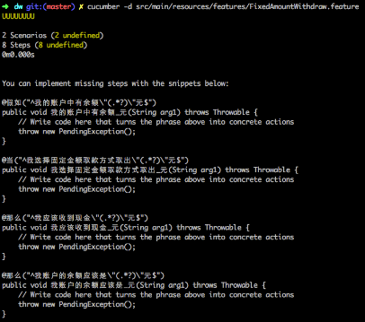

注：命令`java cucumber.api.cli.Main` 事实上要求加入对应的 jar 包到 classpath 中，为了行文方便，此处省略了对应的 classpath。建议读者在使用时，先把对应的 jar 包下载到本地（推荐使用 maven，执行 mvn compile 即可下载对应的 dependency 到本地的.m2 目录下），然后根据所使用的操作系统不同，可以按照：

- 对于 Linux 或者 OSX，可以使用 alias 创建一个 cucumber 命令，参考如下的内容：

_alias cucumber=’java -classpath “.:./target/classes:/home/admin/.m2/repository/info/cukes/cucumber-java/1.2.2/cucumber-java-1.2.2.jar:/home/admin/.m2/repository/info/cukes/cucumber-core/1.2.2/cucumber-core-1.2.2.jar:/home/admin/.m2/repository/info/cukes/cucumber-jvm-deps/1.0.3/cucumber-jvm-deps-1.0.3.jar:/home/admin/.m2/repository/info/cukes/gherkin/2.12.2/gherkin-2.12.2.jar:/home/admin/.m2/repository/info/cukes/cucumber-junit/1.2.2/cucumber-junit-1.2.2.jar:/home/admin/.m2/repository/junit/junit/4.12/junit-4.12.jar:/home/admin/.m2/repository/info/cukes/cucumber-html/0.2.3/cucumber-html-0.2.3.jar” cucumber.api.cli.Main’_

- 对于 Windows，可以在 PATH 指定的任意一个目录（比如 C:\\Windows\\System32\\）下，创建一个 cucumber.bat，其中的内容可以参考如下：

_java -classpath “.;.\\target\\classes;C;\\Users\\admin.m2\\repository\\info\\cukes\\cucumber-java\\1.2.2\\cucumber-java-1.2.2.jar;C;\\Users\\admin.m2\\repository\\info\\cukes\\cucumber-core\\1.2.2\\cucumber-core-1.2.2.jar;C;\\Users\\admin.m2\\repository\\info\\cukes\\cucumber-jvm-deps\\1.0.3\\cucumber-jvm-deps-1.0.3.jar;C;\\Users\\admin.m2\\repository\\info\\cukes\\gherkin\\2.12.2\\gherkin-2.12.2.jar;C;\\Users\\admin.m2\\repository\\info\\cukes\\cucumber-junit\\1.2.2\\cucumber-junit-1.2.2.jar;C;\\Users\\admin.m2\\repository\\junit\\junit\\4.12\\junit-4.12.jar;C;\\Users\\admin.m2\\repository\\info\\cukes\\cucumber-html\\0.2.3\\cucumber-html-0.2.3.jar” cucumber.api.cli.Main %\*_

### 生成 Step definitions

当然，通过上述的 dry run 产生的 dummy steps definitions 可以作为创建对应 Step definitions 的 Skeleton，在没有 IDE 协助您生成 Step definitions 的前提下，我推荐大家使用 dry run 的输出作为基础，创建自己的 Step definitions。此处，本文推荐大家使用集成开发环境所提供的 Step definitions 工具来实现上述操作，其原因是：

- 集成开发工具能够生成较为完善的代码，不仅仅是 steps definitions 本身，而且包含了对应的 Java Class 类；
- 对于刚接触 Cucumber 不久且充满好奇心的使用者而言，能够接触到 Cucumber 的实现代码，更加有利于了解其运行原理，而集成开发环境在这一点上能够提供很大的帮助。

由于 Eclipse 暂时并不支持 Steps definitions 的生成操作，下面本文以 JetBrains 的优秀 Java IDE 环境 Intellij IDEA 阐述如何实现从 feature 生成 Steps definitions。

**在 Intellij IDEA 下生成 Steps definitions**

在编写 feature 文件的过程中，IDEA 会提示目前文件中哪些步骤（steps）是没有对应的 Java step definitions，如下图所示，Intellij IDEA 会以黄色的小灯泡这个提示标志来提醒作者：

##### 图 2\. IDEA 提示 No Step Definition Found 示例

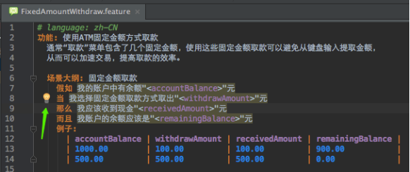

读者只需要按照如下的步骤来生成对应的 Steps definitions 即可：

1. 点击该提示图标，并从弹出的菜单项中选择”Create Step Definition”或者”Create All Steps Definition”；
2. 在弹出的”Create New Step Definition File”模式窗口中填写文件名称、实现语言以及文件位置等信息即可；
3. 重复步骤 1 和 2 直到所有的 step 都生成对应的 Java step definition 即可，参考图 3 所生成的结果示例。

##### 图 3\. IDEA 生成 Steps Definitions 示例

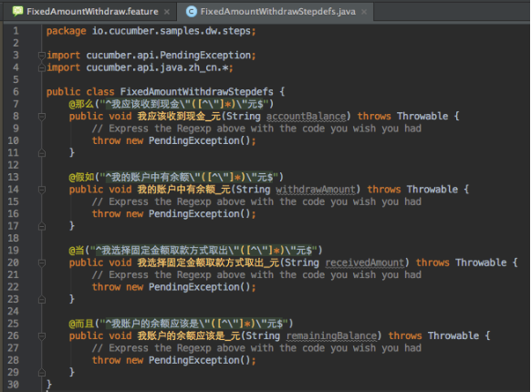

**在 Eclipse 下生成 Steps definitions**

在 Eclipse 中，仍然可以通过 Dry run 的方式来实现部分 steps definitions code 的生成，这一点请参考前文中 Cucumber dry run 命令。

### 调试和运行测试用例

**在 IDEA 中调试运行测试用例**

`Cucumber`测试用例有两种方式可以启动，`debug mode`下，两种方式都可以 对`Steps definitions` 代码进行`debug`：\`

**a. Run with JUnit** \` **方式；**

这种方式要求必须有 JUnit Test 来触发，常规的做法是：

1. 创建一个空白的 JUnit Test：所谓空白就是在 JUnit Test 类中没有任何方法；

2. 按照 Cucumber 所提供的 Options annotation 来引入所需要使用的 feature 文件和 Steps definitions 类；

3. 按照需要设置报告格式等，下面是以 JUnit 方式触发 FixedAmountWithdraw.feature 文件的配置 Sample；


##### 清单 5\. JUnit 方式触发 Cucumber Feature 文件示例

```
package io.cucumber.samples.dw;

import cucumber.api.CucumberOptions;
import cucumber.api.junit.Cucumber;
import org.junit.runner.RunWith;

@RunWith(Cucumber.class)
@CucumberOptions(
format = {"json:target/json-report/dw.json"}
, features = {"classpath:features/FixedAmountWithdraw.feature"}
, glue = {"io.cucumber.samples.dw.steps"}
)
public class AppTest {
}

```

Show moreShow more icon

1. 然后就可以以 JUnit 用例的方式运行或者调试测试用例的实现了，此处不再赘述。Eclipse 和 Intellij IDEA 都支持这样的调试方式。

**b. IDEA 下直接运行 Scenario/Scenario Outline**

1. IDEA 下可以直接选中所需要运行或者调试的 Scenario/Scenario Outline；
2. 然后右键打开弹出菜单选择”Run”或者”Debug”；
3. 并选择对应的 Scenario 名称即可运行或者调试该场景对应的 Steps definitions。

##### 图 4\. IDEA 中 Debug Scenario 示例

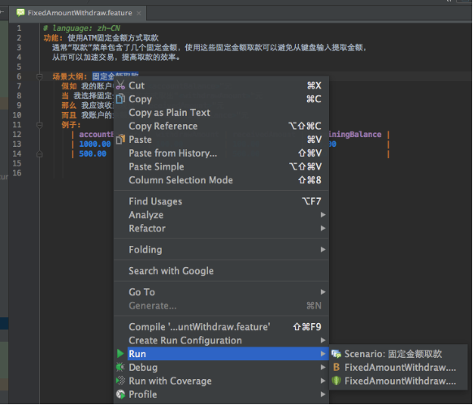

#### 定制化运行 Cucumber 测试用例

Cucumber 是以 feature 文件来组织测试用例的，关于如何 customized 运行 Cucumber 测试用例，首先需要向大家介绍就是如何组织 feature 文件。Feature 文件通常是按照子文件夹来组织的，您可以按照功能归属、类别、Sprint Plan 等等来做，至于哪一种是最好的，通常并没有准确的答案，一个可行的建议是先按照您认为最可行的方式组织起来，尝试一段时间，持续一两个 iteration，后续如果没有发现明显的问题就可以坚持下来。通常您需要尝试几次才能确定哪一种方式最适合自己的 team。子文件夹就像是一本书的目录对应的章节，便于索引。

Cucumber 还支持为 Scenario 指定标签（tag），tag 是以”@”字符开头的一个单词，用来表述被修饰对象（可以是 feature，可以是 scenario，可以是 scenario outline 甚至可以是 scenario outline 下的 examples）所属的类别。Tag 可以是一个，也可以是多个，Cucumber 本身并不限制 tag 的个数。

##### 清单 6\. 带有 Tag 的 Feature 文件示例

```
# language: zh-CN
@withdraw
功能: 使用 ATM 固定金额方式取款
通常"取款”菜单包含了几个固定金额，使用这些固定金额取款可以避免从键盘输入提取金额，
从而可以加速交易，提高取款的效率。

@fixedAmount
场景大纲: 固定金额取款
假如 我的账户中有余额"<accountBalance>"元
当 我选择固定金额取款方式取出"<withdrawAmount>"元
那么 我应该收到现金"<receivedAmount>"元
而且 我账户的余额应该是"<remainingBalance>"元
@positive
例子:
| accountBalance | withdrawAmount | receivedAmount | remainingBalance |
| 1000.00 | 100.00 | 100.00 | 900.00 |
| 500.00 | 500.00 | 500.00 | 0.00 |
@negative
例子:
| accountBalance | withdrawAmount | receivedAmount | remainingBalance |
| 1000.00 | 1100.00 | 0.00 | 1000.00 |
| 500.00 | 600.00 | 0.00 | 500.00 |

```

Show moreShow more icon

其中：

##### 表 1\. Tag 位置解析

Tag 所修饰对象表述的意义Feature该 Feature 文件中的所有 Scenario 和 Scenario Outline 都会继承修饰在 Feature 的 tag，比如上例中的 @withdrawScenario / Scenario Outline表示 tag 适用于 Scenario/Scenario Outline，Scenario Outline 下的 Examples 会继承定义在其上的 tag，比如上例中的 @fixedAmountExamples只对 Scenario Outline 及当前的 Examples 有效，比如上例中的 @positive 和 @negative

如果说子文件夹是目录对应的章节，那么 tag 可以看做是添加到书中的便签，让您迅速找到对应的 scenario。Tag 可以看做是另外一种维度的索引，可以为 Cucumber 测试用例集合添加不同的维度，从而便于检索和过滤，这一点在选择性地运行 Cucumber 测试用例时显得尤其重要！

#### 按照 tag expression 过滤测试用例

纯粹的讲 expression 本身会让读者觉得味同嚼蜡，下面本文以不同的例子为基础，讲述如何适用基础的 tag expressions 来过滤 Cucumber 测试用例。

- 运行指定的单个 tag 对应的测试用例：

命令：`java cucumber.api.cli.Main --tag @focus features`只会运行 features 中那些被标记为”@focus”tag 的场景。仅仅关注某一些或者某一个场景其实在场景调试过程中非常有用，尤其是在您没有可用的 IDE 环境中，比如在没有 Window 环境的 Unix/Linux 机器上调试测试用例时；

- 运行 @focus 或者 @key 对应的测试用例

命令：`java cucumber.api.cli.Main --tag @focus,@key features`可以运行 features 中那些被标记为”@focus”和被标记为”@key”的场景。此处的逗号可以被理解为逻辑上的”OR”关系运算符，因此运行的结果是二者或者多个 tags 的并集。

- 运行被 @fast 标记并且 @bvt 标记的测试用例

命令：`java cucumber.api.cli.Main --tag @fast --tags @bvt features`可以运行 features 中那些既被 @fast 标记又 @bvt 标记的测试用例。命令可以从字面上理解为运行 BVT 测试用例中那些运行速度快的测试用例，假设您在做 code refactor，想快速验证一下所做的改动是否影响到主流程，上述命令会帮您快速运行 BVT 相关的用例，当然，前提是您已经对测试用例做了 tag。

- 不运行被 @slow 标记但是被 @bvt 标记的测试用例

命令：`java cucumber.api.cli.Main --tag ~@slow --tags @bvt features`可以运行 features 中那些被标记为 bvt 但是不被 tag @slow 修饰标记的测试用例。理想情况下，我们期望测试用例运行的足够快，但是现实测试中，通常需要对系统进行登录认证，授权，不乏有运行慢的用例，因此，标记出那些运行速度慢的用例，然后只在适合的时间运行它们，这对于提高测试用例的执行效率也是非常有必要的。此处的”~”表示否定的意思。

如果您担心用例中有同样的标记比如 @focus 也在被别人使用，不希望通过 tag 的方式来标记测试用例，Cucumber 支持以别的方式来实现同样的功能：Filter on lines 和 Filter on names。

**按照行号过滤测试用例**

命令：`java cucumber.api.cli.Main src/main/resources/features/FixedAmountWithdraw.feature:12:17`可以运行 FixedAmountWithdraw.feature 文件中的第 12 和 17 行，如果需要运行更多的行，只需要在 feature 文件名之后加上”:行号”。

**按照场景名称过滤测试用例**

命令：`java cucumber.api.cli.Main --name 固定金额取款 features`可以运行名称为”固定金额取款”的 Scenario 或者 Scenario Outline。对于 debug 单个场景时，这个功能非常有用。

### 指定 Cucumber 运行结果报告

Cucumber 本身支持多种报告格式以适用于不同环境下调用的报告输出：

- pretty ：用于在命令行环境下执行 Cucumber 测试用例所产生的报告，如果您的 console 支持，pretty 形式的报告还可以按照颜色显示不同的运行结果；如下图所示的例子分别显示了用例执行通过和用例没有 Steps definitions 的输出报告：

##### 图 5\. Pretty 格式的 Passed 报告示例

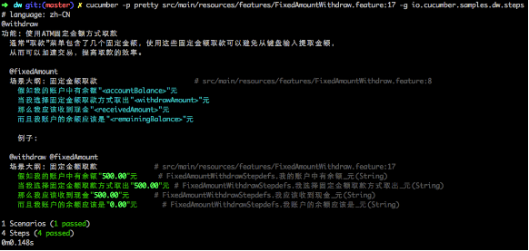

##### 图 6\. Pretty 格式的 Undefined 报告示例

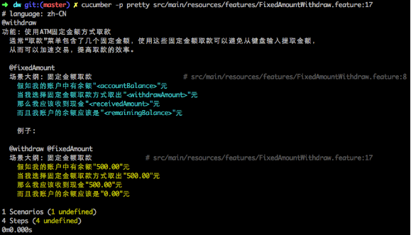

- json ：多用于在持续集成环境下的跨机器生成报告时使用，比如在用例执行的机器 A 上运行 Cucumber 测试用例，而在调度或报告机器 B 上生成用例执行报告，此时只需要把生成的 JSON 报告传输到机器 B 上即可。

##### 图 7\. JSON 格式报告示例

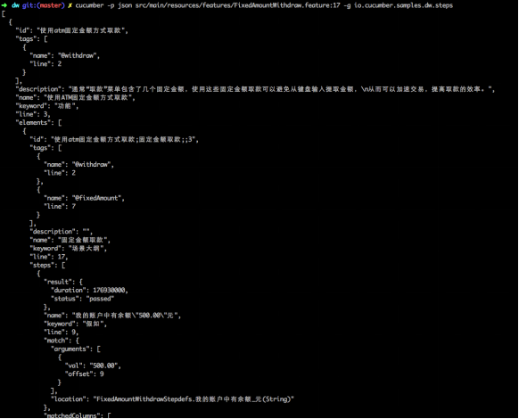

- html ：用于生成简单的 HTML 格式的报告以便查看 Cucumber 测试用例运行的结果

##### 图 8\. 简单的 HTML 格式报告示例

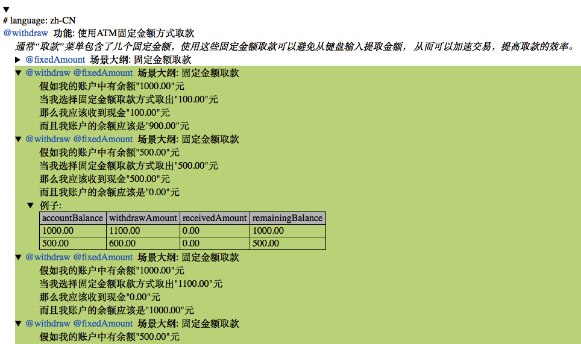

- junit ：用于生成 JUnit 格式的报告：

##### 清单 7\. JUnit 格式报告示例

```
<?xml version="1.0" encoding="UTF-8" standalone="no"?>
<testsuite failures="0" name="cucumber.runtime.formatter.JUnitFormatter"
                            skipped="0" tests="1" time="0.177755">
<testcase classname="使用 ATM 固定金额方式取款" name="固定金额取款" time="0.177755">
<system-out>
<![CDATA[
假如我的账户中有余额"500.00"元.........................................passed
当我选择固定金额取款方式取出"500.00"元..................................passed
那么我应该收到现金"500.00"元..........................................passed
而且我账户的余额应该是"0.00"元.........................................passed
]]>
</system-out>
</testcase>
</testsuite>

```

Show moreShow more icon

## 如何避免 Cucumber 测试用例报告失真

从上面描述的 Cucumber 支持的报告格式和样例，看不出有什么失真啊？错了就错了，对了就对了，很明确的啊！为什么测试报告会失真？

这里说的测试报告失真是以 Maven 调用的方式运行 Cucumber 测试用例时才会出现，但是这种运行方式是大家在持续集成环境中经常会用到的，因此，此处才对这种情况加以处理，以避免在持续集成环境下出现测试报告失真。

一般情况下我们在 Maven 中执行测试用例只需要运行命令`mvn test`即可，下面是一次运行中给出的结果：

##### 图 9\. Maven 给出的失真的测试报告示例

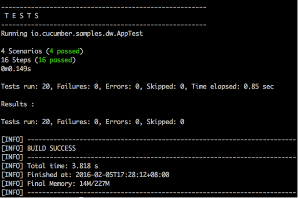

从中可以看出：

- Cucumber 提示运行了 4 个 Scenario 一共 16 个 Step 且全部通过了；
- 可以理解成一共执行了 4 个 JUnit 测试用例，没有失败或编译错误；
- 但是 Maven 给出的报告却提示运行了 20 个 Test，全部通过。

这就造成了运行报告的失真：

1. 事实上没有那么多测试用例，但是 Maven 却给出了数倍于真实的测试用例；
2. 如果有一个失败，其失败率明显会低于真实情况；
3. 如果以此为依据来 refactor 代码，很可能造成过于自信而导致后续工作量无法承受。

鉴于此，必须要避免这样的情况，有什么样的方法可以避免吗？

当然有，不知读者是否还记得 Cucumber report 支持 json 呢？Github 上有很多开源的插件或者 Cucumber 扩展可以帮助从 JSON 格式的报告生成 HTML 格式的报告。本文中推荐大家使用 [Cucumber-reporting](https://github.com/damianszczepanik/cucumber-reporting) 。 [Cucumber-reporting](https://github.com/damianszczepanik/cucumber-reporting) 不仅能够完成从 JSON 格式报告生成 HTML 格式报告，而且可以按照 tag 和 feature 以及 step 查看，不得不提的是生成的 HTML 格式报告的样式非常好看，下面就是以本文中所使用的 feature 文件为例，以 [Cucumber-reporting](https://github.com/damianszczepanik/cucumber-reporting) 来生成的 HTML 报告：

### 按照 Features 方式查看

##### 图 10\. 按照 Features 方式查看报告示例


### 按照 Tags 方式查看

##### 图 11\. 按照 Tags 方式查看报告示例

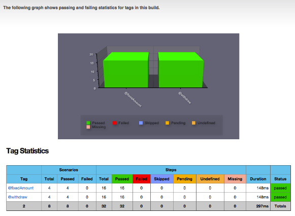

### 按照 Steps 方式查看

##### 图 12\. 按照 Steps 方式查看报告示例

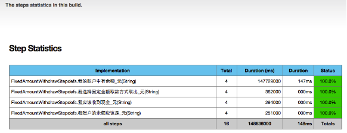

从上述报告中可以看出，Scenario 和 Step 是分别统计的，因此只需要关注 Scenario 失败的信息就能够避免报告失真。

## 如何与持续集成工具集成

主流的持续集成工具有很多，被广泛采用的开源工具当推 Jenkins。Cucumber reporting 功能也可以被 Jenkins 支持，Github 中有开源的 Jenkins Plugin： [Publish pretty cucumber-jvm reports on Jenkins](https://github.com/jenkinsci/cucumber-reports-plugin) 。对于其具体的用法，其 [文档](https://github.com/jenkinsci/cucumber-reports-plugin#use) 中已经有详细介绍，笔者尝试过可以按照其步骤成功集成 Cucumber Reporting 功能到 Jenkins，此处不再赘述。

## 结束语

本文从实际使用 Cucumber 这一工具的角度出发，以 Cucumber-JVM 实现为基础，采用了不同的事例阐述了如何编写 feature 文件，如何从 feature 文件生成对应的 Steps，如何生成不同格式的报告，如何定制化的运行测试用例以及在与其他主流工具结合中如何避免报告失真、如何与主流持续集成工具结合使用等，为大家在日常工作中使用 Cucumber 释疑解惑。回到 Cucumber 作为自动化工具的层面，其在 API 测试中的使用也有很多可圈可点之处，本系列后续文章会对此进行阐述：

- 《活用 Cucumber 测试服务端开放 API》，讲述结合 BDD 风格测试工具 Rest-Assured 验证 API 功能，如何使用 JSON Schema 验证 API 的返回结构等一系列实用的经验分享。

## 下载

[dw\_art1.tar](http://www.ibm.com/developerworks/cn/java/j-lo-cucumber01/dw_art1.tar): 本文相关源代码