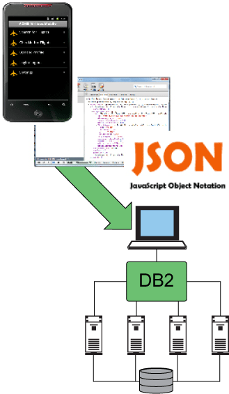
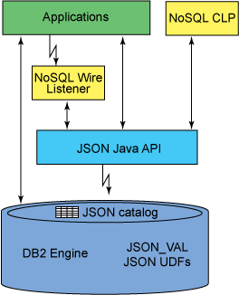

# DB2 NoSQL JSON 介绍
JavaScript Object Notation 是一种轻量级数据交换格式，旨在实现最小、可移植的文本和 JavaScript 的子集

**标签:** 数据库

[原文链接](https://developer.ibm.com/zh/articles/dm-1306nosqlforjson1/)

Bobbie Cochrane, Kathy McKnight

发布: 2013-09-16

* * *

## 简介

### 一个新的应用程序开发时代

现在有一种新的应用程序演化风格，它受到多种揉合在一起的力量的推动。移动和社交应用程序的极速增多和普及激起人们通过电子途径进行更深入地交互。云计算使得计算资源随时可用，大数据技术的出现使得从 Internet、传感器和移动设备收集的海量数据中获取洞察成为可能。用户交互数据的可用性、对计算资源的轻松访问，以及大数据技术中的进步，这些使得企业能够比以往快得多的速度预测客户的行为和需要。所有这些力量相结合，为企业提供了以有意义的方式与其客户打交道的新机会。事实上，使用社交媒体和移动应用程序的用户期望应用程序更富吸引力，而且很容易通过许多规格的设备（具体来讲他们的移动设备）进行访问。

为了把握这些新机会，一个开发新应用程序的时代应运而生。应用程序不再需要 6 到 9 个月或更长时间才能完成从概念到部署的过程。应用程序能够迅速实现，以应对业务问题或机会，而且它们的寿命通常很短。许多不同技术可组合在一起快速实现解决方案，而 JavaScript 和 JSON（JavaScript 的数据表示语言）几乎是通用的。尽管这种开发应用程序的新方式最初出现在创业团队中，但越来越多的人利用它们来解决企业和公共领域的敏捷开发需要。

这些新应用程序最先是为移动设备而设计和提供的，它们推动了社交和移动交互的发展。企业目前希望快速为这些企业系统开辟通道，使它们能参与这些新的移动和社会交互。它们正从基于简单事务的世界转移到基于交互的世界。企业需要能够使用 参与性系统 扩展企业记录系统和为其提供补充，与此同时，需要保持企业功能完整无缺 — 健全性、隐私、安全和高可用性。IBM 在我们的 DB2 平台中实现了一个流行的 JSON API – MongoDB API，用它来促进 JSON 的这种用法。

### 什么是 JSON？

JSON (JavaScript Object Notation) 是 IETF RFC 4627 中指定的一种轻量型数据交换格式。它被设计为极小的、可移植、文本化的 JavaScript 子集，JSON 易于实现、容易阅读且容易使用。它不依赖于语言，因为大多数语言都拥有能与 JSON 轻松对应的特性。JSON 可用于在使用所有现代编程语言编写的程序之间交换数据。另外，由于 JSON 采用了文本格式，所以它容易被人类和机器阅读。

以下是一个 JSON 文档的简单示例：

##### JSON 文档的一个简单示例

```
{"isbn": "123-456-222",
"author":
[
    {
      "firstname": "Doe",
      "lastname": "Jane"
    },
    {
      "firstname": "Doe",
      "lastname": "John"
    }
]
"title": "The Ultimate Database Study Guide",
"abstract": "What you always wanted to know about databases and were afraid to ask",
"price": 28.00,
"sales":
    { qty: 1234,
      amt: 31532.50
    }
"category": ["Non-Fiction", "Technology"]
"ratings": [10, 5, 32, 78, 112]
}

```

Show moreShow more icon

JSON 通过定义很少的一些概念，帮助实现结构化数据的可移植性。JSON 中的主要概念是对象，它是名称/值对的一个无需集合，其中的值可以是任何 JSON 值。JSON 中有 4 个可在大多数编程语言中通用的原子概念：

1. 字符串
2. 数字
3. 布尔值
4. 特殊的 “null” 值

数组引入了有序的值序列，这同样可以是具有前面提到的 4 种 JSON 类型之一的 JSON 值。JSON 对象可以嵌套，但通常不会嵌套很深。

尽管 JSON 是 JavaScript 编程语言 的子集，但它本质上是与语言无关的。大多数语言，无论新旧，都拥有可轻松地与 JSON 概念建立对应关系的特性。例如，哈希图、对象、结构、记录和关联数组都是与 JSON 对象类型相关的数据类型，而数组、矢量和列表类型与 JSON 数组类型相关。

### 为什么选择 JSON？

“我们在互操作方面需要达成一致的意见越少，我们就越容易实现互操作” – Doug Crawford， [JavaScript, The Good Parts](http://www.amazon.com/JavaScript-Good-Parts-Douglas-Crockford/dp/0596517742/ref=sr_1_1?s=books&ie=UTF8&qid=1371094134&sr=1-1&keywords=javascript+the+good+parts) 。

JSON 是应用程序新时代的首选数据交换格式。它的出现和流行有一些推动因素。最重要的因素是 JavaScript 的普遍性。JavaScript 无处不在！它赢得了浏览器战争，它进入了智能电话。最近，随着服务器端 JavaScript 框架的出现，它又在服务器端应用程序中流行起来，比如 node.js。

常常流传的对 JSON 的一种赞美是，它基于文本且不依赖于位置，但 XML 也拥有相同的特性。为什么 JSON 在 API 中大受欢迎，而不是 XML 大受欢迎呢？在 2011 年，Programmable Web 报告 1/5 的新 API 选择使用 JSON 而不是 XML，这一比例到 2012 年 12 月增长到了 1/4（参见 参考资料 一节，获取一个关于选择 JSON 而不是 XML 的博客主题的链接）。而且，许多既有的企业（比如 Box.net 和 YouTube）正在从 XML 转向 JSON。一些因素促成了这一转变。首先，JSON 更简单，它的所有操作都与对象相关。它没有试图成为一种文档标记语言，或者是数据交换语言。这种标记和交换语言的双重用途会使人们更难使用 XML。由于 JSON 的简单性，它更加紧凑，需要存储、流经网络并在移动和嵌入式设备上处理的信息更少。

鉴于此，JSON 成为了 NoSQL 文档存储（比如 MongoDB 和 CouchDB）所利用的主要技术，这不足为奇。通过在数据库层中提供 JSON 支持，我们为新时代应用程序的开发人员带来了敏捷性（通过模式灵活性实现）。此外，JSON 使开发人员能够更容易配合他们选择的编程语言，支持直接本机存储从移动设备流经应用程序层，再流到磁盘的数据。这减少了数据转换和散发的开销。

##### DB2 JSON



## 什么是 DB2 NoSQL JSON？

DB2 NoSQL JSON 是一个基于驱动程序的解决方案，它在一个 RDBMS 的上下文内实现了 JSON 数据表示的灵活性，这个 RDBMS 提供了著名的企业特性和服务质量。借助此产品，用户可以使用一种模仿 MongoDB 数据模型和查询语言的 JSON 编程范式，编写 DB2 中需要的现代应用程序数据，这种编程范式已成为业界最流行且硕果累累的 JSON 数据存储之一。JSON 数据被存储为一种称为 BSON (Binary JSON) 的二进制编码格式。BSON 被设计为轻量型的数据，容易遍历，并且可以非常高效地进行编码和解码。此外，MongoDB 提供了对应用程序开发人员常用的其他数据类型（比如日期）的原生支持。这些扩展也已添加到 DB2 NoSQL JSON 支持中。

使用 DB2 NoSQL JSON，用户可通过许多方式与 JSON 数据进行交互。首先，他们可使用命令行 shell 管理和交互式地查询 JSON 数据。其次，他们可以编程方式存储和查询来自 Java 程序的数据，使用 IBM 提供的用于 JSON 的 Java 驱动程序，使用户能够通过用于 SQL 访问的相同 JDBC 驱动程序连接到他们的 JSON 数据。最后，他们可使用任何实现 MongoDB 协议 的驱动程序。这使他们能够从各种现代语言（包括 node.js、PHP、Python 和 Ruby）以及更传统的语言（比如 C、C++ 和 Perl）访问他们的 DB2 NoSQL JSON 存储。

这些功能的细节将在下面列出的一个配套文章系列中详细介绍：

- 管理和查询 JSON 数据的命令行 shell（ [DB2 NoSQL JSON 功能，第 2 部分：使用命令行处理器](http://www.ibm.com/developerworks/data/library/techarticle/dm-1306nosqlforjson2/index.html) ）
- 用于应用程序开发的 Java API（ [DB2 NoSQL JSON 功能，第 3 部分：使用 JAVA API](http://www.ibm.com/developerworks/views/data/libraryview.jsp?search_by=DB2+NoSQL+JSON+capabilities))
- 一个 Wire Listener（线侦听器）解释了 MongoDB 连接协议，并被用作 DB2 前面的网关。它接受并响应通过网络发送的请求（ [DB2 NoSQL JSON 功能，第 4 部分：使用 Wire Listener](http://www.ibm.com/developerworks/views/data/libraryview.jsp?search_by=DB2+NoSQL+JSON+capabilities) ）。

## DB2 NoSQL JSON 支持概述

下图演示了 JSON API 支持的设置和控制流。

##### DB2 JSON 概述



### DB2 NoSQL JSON 命令行

DB2 NoSQL JSON 命令行是一个命令 shell，用于对 JSON 文档集合执行管理命令，并对 JSON 集合运行查询和更新操作。它非常类似于 DB2 CLP 接口。

有关该命令行的更多信息，请参阅 [DB2 NoSQL JSON 功能，第 2 部分：使用命令行处理器](http://www.ibm.com/developerworks/data/library/techarticle/dm-1306nosqlforjson2/index.html) 。

### DB2 NoSQL JSON JAVA API

DB2 NoSQL JSON Java API 提供了一组方法来存储、检索和操作 JSON 文档。这些方法可由原生 Java 应用程序直接通过 API 调用，以处理数据库中的文档。因为 DB2 是数据存储，所以此组件将方法调用中请求的操作转换为 SQL 语句。

有关 Java API 的更多信息，请参阅 “ [DB2 NoSQL JSON 功能，第 3 部分：使用 JAVA API](http://www.ibm.com/developerworks/views/data/libraryview.jsp?search_by=DB2+NoSQL+JSON+capabilities) ”。

### DB2 for NoSQL JSON Wire Listener

DB2 NoSQL for JSON Wire Listener 是一个服务器应用程序，用于解释 Mongo Wire Protocol。它充当着 MongoDB 应用程序与 DB2 之间的一个中间层网关服务器。它利用 DB2 NoSQL for JSON API 来连接 DB2 作为数据存储。用户可执行使用期望的应用编程语言（JAVA、NodeJS、PHP、Ruby 等）编写的 MongoDB 应用程序，或者可使用 MongoDB CLI 与 DB2进行 通信。有关 Wire Listener 的更多信息，请参阅 “ [DB2 NoSQL JSON 功能，第 4 部分：使用 Wire Listener](http://www.ibm.com/developerworks/views/data/libraryview.jsp?search_by=DB2+NoSQL+JSON+capabilities) ”。

## 结束语

本文概述了 DB2 NoSQL 技术预览，它使开发人员能够使用 MongoDB 创建的一种面向 JSON 的流行查询语言来编写应用程序，以便与 IBM DB2 for Linux, UNIX, and Windows 中存储的数据进行交互。

借助 DB2 JSON 支持，开发人员可获得两个领域的优势：敏捷性与 DB2 值得信赖的基础。用户无需淘汰并更换他们的 DB2 实现，就能够利用 新应用程序时代 中的敏捷范例。DB2 10.5 是第一个在同一个存储引擎中提供了关系、列式 (DB2 BLU)、XML 和 JSON 数据的系统。您现在能够利用 NoSQL JSON 范例和灵活的模式来快速设计新应用程序的原型，通过参与性系统为企业记录系统提供补充，通过 DB2 BLU 列式存储为分析以及著名的关系应用程序提供快速存储。与此同时，您还可以保留传统的 DBMS 功能，并利用现有的技能和工具。

要找到该技术预览的下载图像的链接，请参见 参考资料 一节。

本文翻译自： [Introduction to DB2 JSON](https://developer.ibm.com/articles/dm-1306nosqlforjson1/)（2013-09-16）