# DataView 配置及实例分析
手把手教你入门 DataView

**标签:** 分析

[原文链接](https://developer.ibm.com/zh/articles/ba-lo-dataview-configuration-and-demo-analytics/)

贺 敏, 刘 晓燕, 刘 际洲

发布: 2019-03-27

* * *

## DataView 架构和系统特点

DataView 作为分析平台工具，能够为用户提供最新最优的商业智能解决方案，用于提供查询、图表、分析、下载案例等功能，并且通过个性化设置，使用户从多角度对信息和数据进行查看和分析，进而做出数据决策和应用。该平台可以独立展示各种应用，也可以集成到当下流行的产品里做可视化部分。DataView 是基于以 react 为核心的前端架构，前端只与 Node 中间层进行数据通信。整个系统具有高复用性、模块化、反应速度快、拥有较高性能、代码逻辑简单等特性。

图 1\. DataView 基础架构

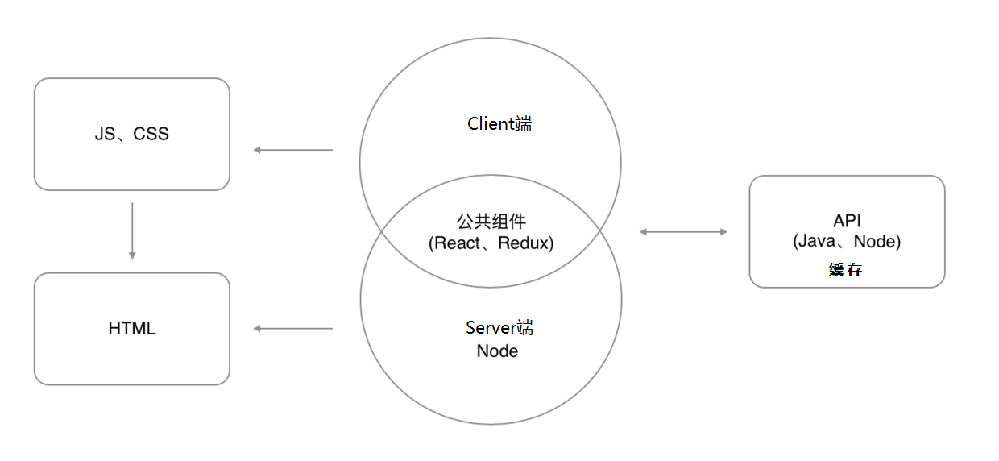

## DataView 基本功能和配置管理

在开始体验 DataView 之前，需要在 server 上安装产品，产品安装前系统需要安装 JDK1.7 或以上版本。安装包解压后执行 nohup ./graph-micro-service>start.log 即可。

DataView 作为数据分析平台，为用户提供了丰富的统计图，如常用的折线图、柱状图、饼图、散点图、箱图等，还有用于地理数据可视化分析的地图、热力图，相关数据可视化的关系图等等。面对这些功能丰富的图表，用户完全不用担心如何选择分析，只需要导入数据后，DataView 会自动帮用户选出可以使用的图表类型。分析完成后，DataView 可以下载当前图表以及图表的属性以供下次分析使用或者参考。

另外，DataView 对数据图表交互还做了细致的优化，可以在坐标系中对图表进行缩放和平移，还能展示细节，同时对不同纬度的数据也做了颜色、透明度等的处理。三维可视化更是吸引眼球，为用户提供了不同层级的画面配置项。针对数据几行配置就能得到艺术化的绚丽画面，如图 2 所示。

图 2\. 3D 渲染图（Surface 类型和 Bar 类型）

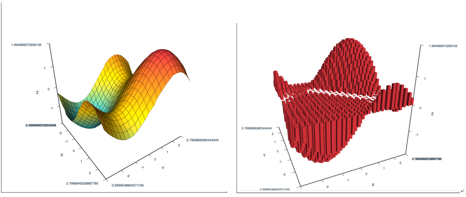

下面我们介绍 DataView 的基本功能和使用方法。首先打开浏览器输入 URL，弹出的界面比较简洁。我们只需要在测试数据集框中选择导入的原始数据，显示模式可以根据需要选择，默认是 all。单击 Request DataView 按钮，主页面随即弹出，接下来就可以开启我们的数据分析之旅了。

主界面分为三大部分，左边是模式选择，图形、图表和数据审计模式可任意切换。Preference 标签页可以定义多语言、UI 样式设置及颜色主题，方便客户根据自己的喜好及数据特点进行设置。

界面的右边又分成上下两部分，我们可以参看 Chart 标签页，如图 3 所示。上半部分是图表类型，根据数据类型能自动匹配可以实现的数据图形，总共囊括了 27 种之多，用户亦可根据不同需求切换图形。下半部分在选择需要分析的数据列之后，可以直接查看不同的图表，所有需要的数据计算值都显示在图表内以供参考。当然，也可以根据用户需求在左边部分进行数据的二次选择和置换，各种参数也可以随时选择并调整。图 3 的图表类型选择的是柱状图，也称质量分布图，是一种常用的统计报告图。图中显示的是 PM2.5 的的分布情况。这种图表可以在质量管理中用来预测并监控产品质量，并对质量波动进行分析。能够一目了然地把这些问题用图表进行处理。它通过对收集到的貌似无序的数据进行处理，来反映产品质量的分布情况，用以判断和预测产品质量及不合格率。

图 3\. DataView 主界面

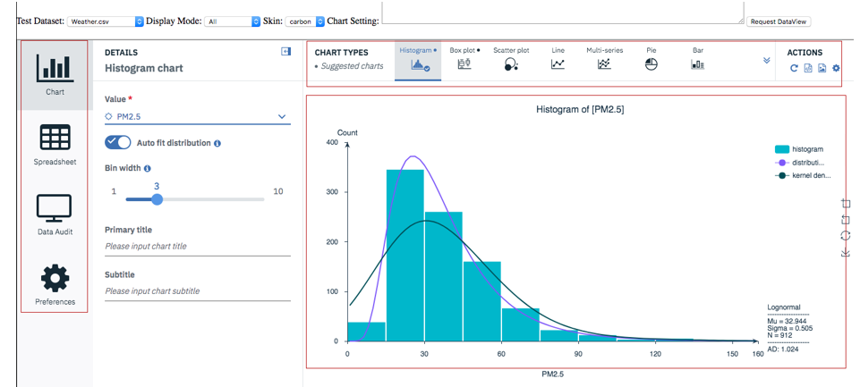

## DataView 数据应用策略和实例说明

上一小节简单介绍了 DataView 的基本功能，这一节我们通过实例来演示和说明它的图形化分析功能。

下图数据来自于中国南部某城市的空气污染指数（2015-1-1 至 2017-6-1），AQI 表示空气质量指数，它将空气污染程度和空气质量状况分级表示，适用于表示城市的短期空气质量状况和变化趋势。

### 序列图分析相关性

首先在 DataView 初始界面，数据集选择 Weather.csv，然后点击 Request DataView 按钮。所有的原始数据会显示在 Spreadsheet 标签页，如下图所示：

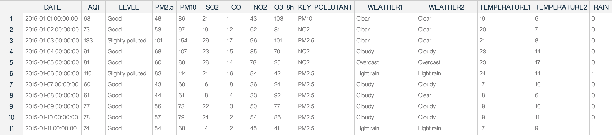

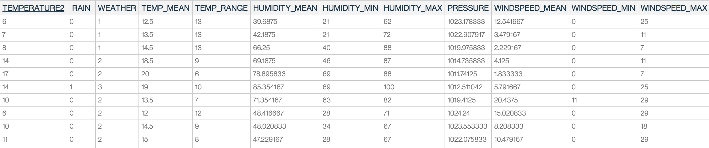

点击左侧图表模式，在右边部分选择列名，从弹出的下拉框中选择需要分析的各列，如 AQI、PM2.5 等，图表类型选择 Muti-series，参数设置如图 4 所示，我们可以看到四个参数的序列图。

图 4\. 多序列图

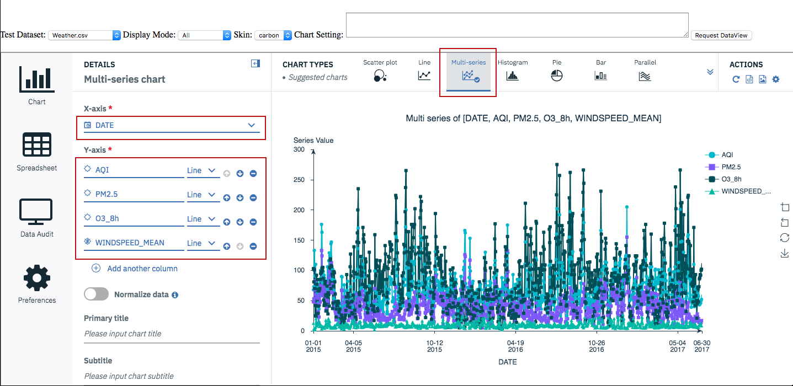

多序列图比较起来并不是那么显而易见，我们可以打开归一化数据按钮，同时删除后两列的数据显示。图 5 我们可以轻松地比较不同时期 AQI 和 PM2.5 的值，并得出结论：冬季相对于夏季来说，两列数据的值拟合度较高。同样，如果选择比较 Q3\_8h 和 AQI，又会出现相反的结论。因此我们可以知道冬天污染指数主要参看 PM2.5 的数值，而夏天主要参看 Q3\_8h 的值。

图 5\. 两序列数据比较

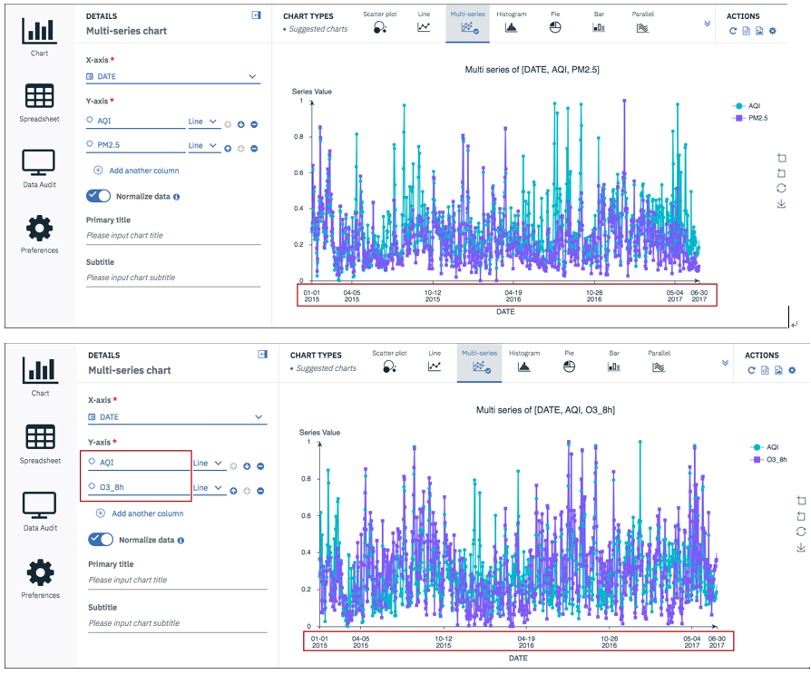

同样的方法还可以比较 WINDSPEED\_MEAN 和 Q3\_8h 序列，我们会发现他们总是负向相关，WINDSPEED\_MEAN 高的时候 Q3\_8h 就会低，同理 WINDSPEED\_MEAN 低的时候 Q3\_8h 就会高。另外，根据图 6 我们也会发现，TEMP\_MEAN 和 PM2.5 也具有相同的负向相关特性。

图 6\. 负向相关特性

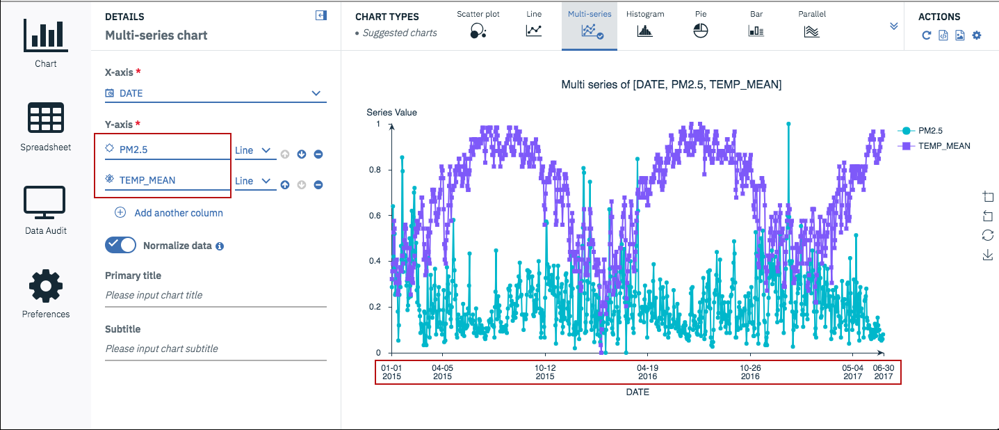

### 平行图分析相关性

使用同样的数据，我们可以在图表类型中选择 Parallet 类型，需要分析的列值选择 PM10、SO2、CO、NO2、O3\_8h 等，同时 Color map 选择 LEVEL,参看图 7 所示。

图 7\. 平行图数据分析

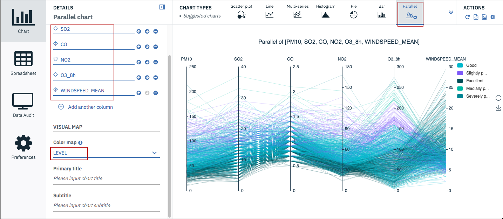

从上图可以看出，当 WINDSPEED\_MEAN 大于 13 且小于 30 时，空气质量基本是良甚至达到优，而对于小于 13 的情况下，空气质量状况都不好。

### 相关性分析及数据审核

下面我们可以做基本的相关性分析。根据数据选择不同的图表，会得出来不同的相关性。首先图表选择 Relationship 类型，左边的设置列添加所有的选项，如图 8 所示。

图 8\. 关联图分析

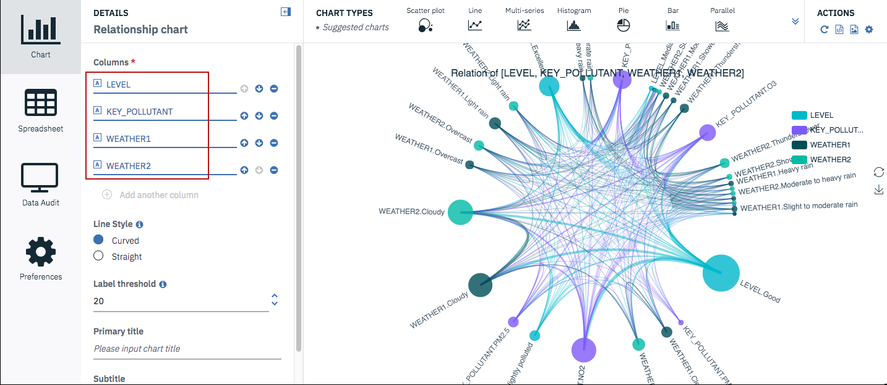

图中最大的点为 LEVEL Good，与它相连的线最粗的一条连接在 KEY\_POLLUTION.NO2，表示空气质量好和 NO2 的值关系较大；与 LEVEL Excellent 相连的线最粗的一条连接在 KEY\_POLLUTION.null ，这说明没有污染空气质量必然优秀。

饼图同样也能分析出各种污染对天气的影响，在图表类型中我们选择饼图。左边的配置如图 9 所示。

图 9\. 饼图分析

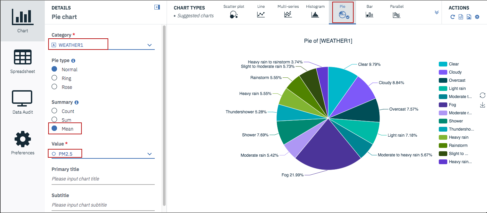

根据图表显示可以看到分布区域最大的是 Fog，此时的 PM2.5 值也最大。将左侧的 Value 值从 PM2.5 改为 O3\_8h，分布最大的区域随之变成了 Clear。

饼图的显示方式也可以变换，方便客户进行数据读取和图形显示。如图 10 所示。

图 10\. 饼状图类型

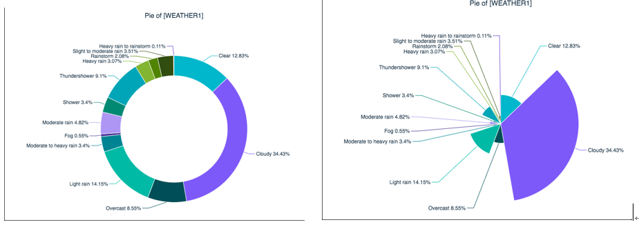

柱状图分析空气质量因素。在图表类型中我们选择柱状图，配置如图 11 所示。

图 11\. 组合柱状图分析

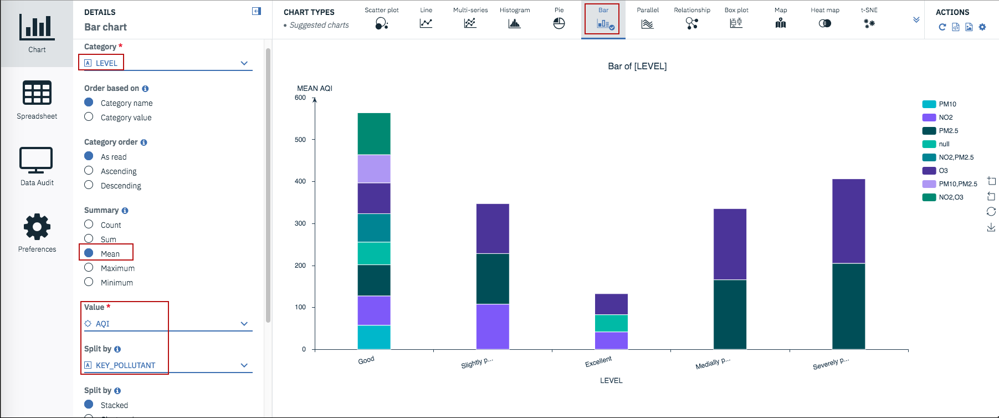

通过组合柱状图分析可以得知，中度和重度空气污染级别主要考察的是 O3 和 PM2.5 数值。

折线图分析空气质量因素。在图表类型中我们选择折线图，配置如图 12 所示，我们可以将默认的显示模式更改为 blue 模式。

图 12\. 折线图分析

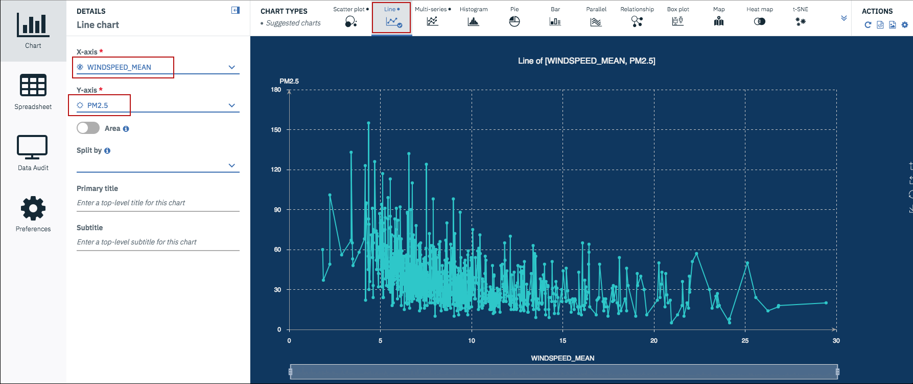

根据图形我们可以得出风速和 PM2.5 的关系，风速大 PM2.5 值会较低，这个结果和文中最初的分析结果是不谋而合的。随着鼠标滚动，我们可以任意缩放图形，放大图查看细节，缩小图查看趋势，同时主页面的右上角亦能随时存储图表和各种属性设置，如图 13 所示。

图 13\. 放大图细节

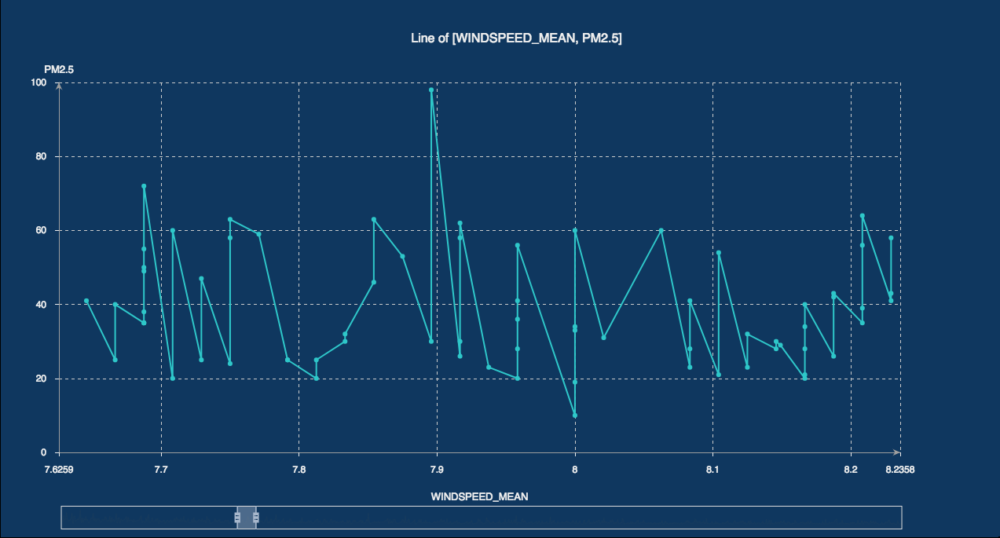

DataView 还可以帮助客户进行 K 线图分析。首先导入一组股票数据，图表类型选择 K 线图，各个参数配置如图 14 所示，可以选择显示开盘价、收盘价、最大最小值以及成交量、五日十日均线等。

图 14\. K 线图配置

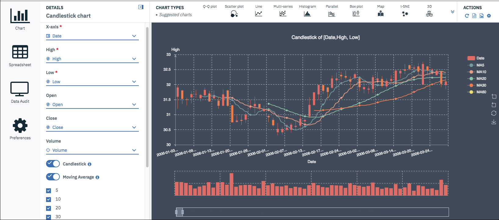

接下来我们看看数据审核标签页的功能。将图表模式切换到数据审核模式。这一页分了四个标签页，Audit 标签页列出了所有数据的分布图、均值、最值、数据类型、分布等数学基本统计量。Quality 标签页显示所有字段的数据类型以及溢出值等等。Statistics 标签页把所有字段的统计值归类，方便用户直接查看需要的统计量，简单直观。最后一个标签页是皮尔逊相关表。举个例子，通过皮尔逊相关表，我们可以查到 PM2.5 和 PM10 的相关值是 0.963，这意味着 PM2.5 高的同时 PM10 的值也会很高，相反 WINDSPEED\_MEAN 和 AQI 的相关值是-0.464，那表示 AQI 大的时候 WINDSPEED\_MEAN 值恰好较小。

下面介绍时间序列的各类图表及特征分析，主要有四种类型：

1. 在坐标系和极坐标系下分解特征。如图 15 所示，单个时间序列可以分解为三个分量（趋势周期、季节性和不规则性），转折点基于趋势周期分量，它表示长时间的变化，异常点基于不规则分量，代表不规则的异常值。

    图 15\. 坐标系和极坐标系特征图

    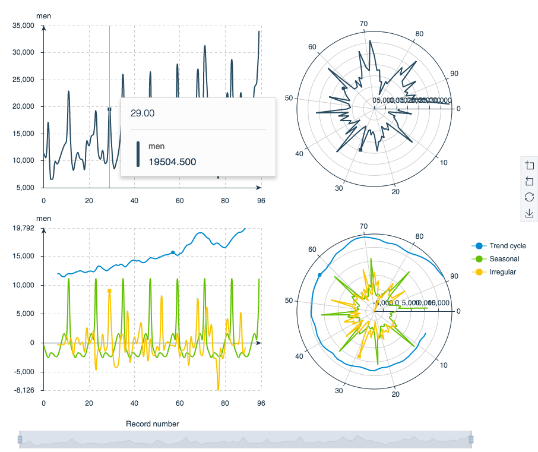

2. 使用 ADF 测试（增强 Dickey-Fuller t-统计检验）知道何时对序列进行差分以使其静止。

    有以下三种测试模型：

    类型 1：没有拦截，没有趋势

    类型 2：拦截

    类型 3：拦截加趋势

    这三个模型的零假设是：序列中有一个单位根，而序列不是静止的。

    如果 p 值低于 0.05，则表示拒绝零假设。 该序列是静止的或其行为可以用对应于静止的差异模型来表示，滞后表示该过程的第 d 个差异是静止的，如图 16 所示。

    图 16\. 序列 ADF 测试

    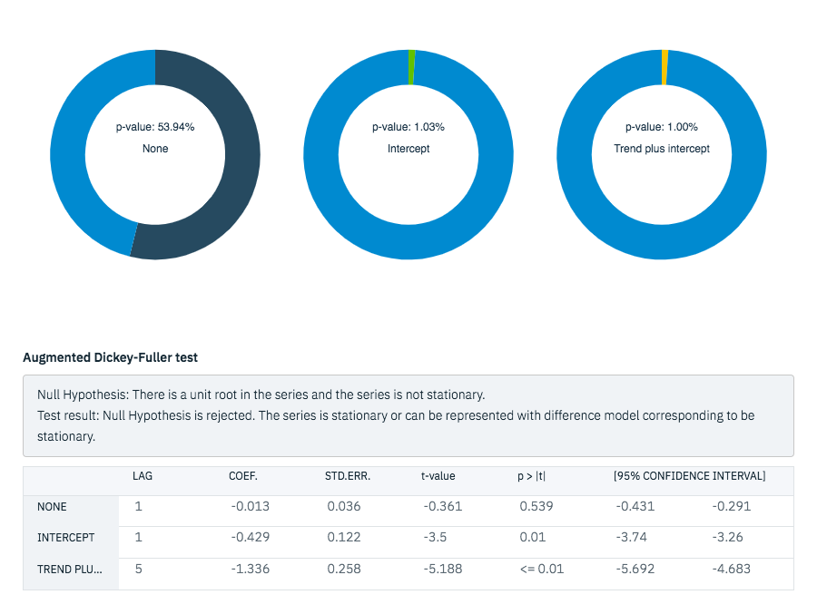

3. ACF（自相关函数）/ PACF（部分自相关函数）

    ACF 移动平均流程会截取滞后，PACF 利用自回归过程的顺序（滞后）。

    图例演示中，ACF 图显示前两个滞后是正向显著，PACF 图显示第一个滞后显着。

    ACF 和 PACF 都表明 Lag 12 和 24 具有显著性，这意味着序列显示”AR（1）签名”通过添加 AR 比添加 MA 更容易解释自相关模式，图 17 展示了 seanonal 模型（周期 12）。

    图 17\. seanonal 模型

    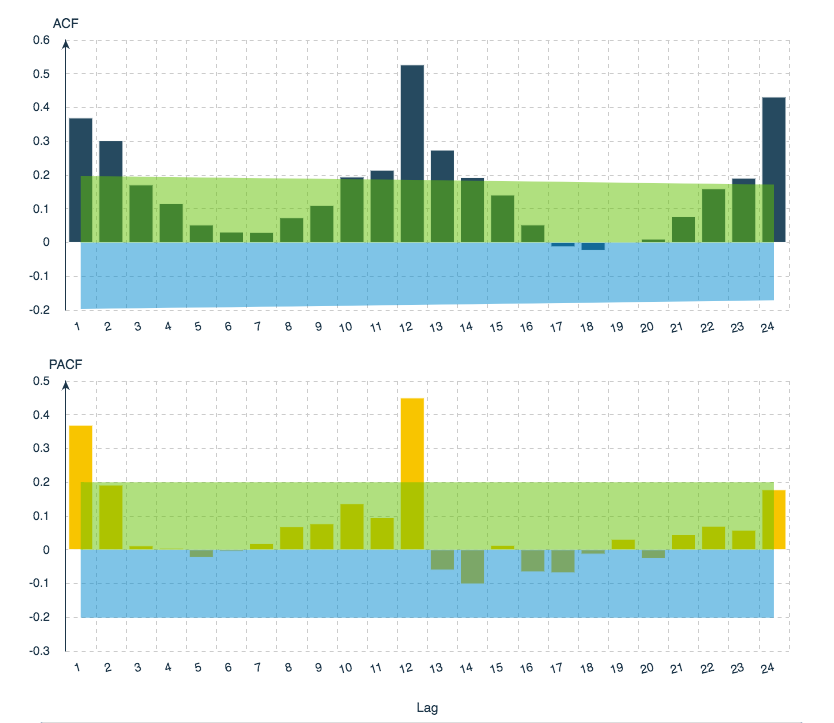

4. 光谱分析用于识别时间序列中的周期性行为

    在此图示中，时间序列中的每个数据点代表一个月，因此年度周期对应于当前数据集中的 12 个周期。因为周期和频率是彼此的倒数，所以 12 的周期对应于 1/12（或 0.083）的频率。因此，年度成分意味着周期图中的峰值为 0.083，这与峰值恰好低于 0.1 的峰值的存在一致。如图 18 所示时间谱分析。

    图 18\. 时间谱分析

    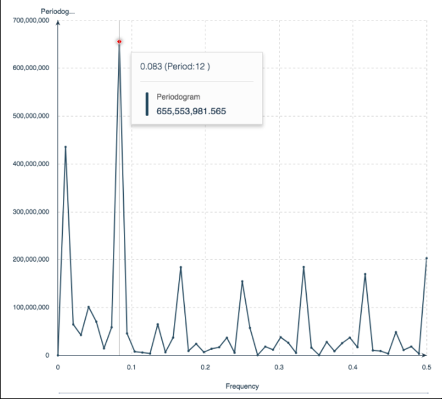

最后再为大家介绍一个方便易用的 SQL 查询功能。首先我们在显示模式里选择 Spreadsheet 模式，单击 Request DataView 按钮，主界面右边会将需要分析的所有数据显示出来，同时最下方会出现 SQL 编辑界面。单击 SQL 编辑，在下方的文本框我们可以输入 SQL 语句，对数据进行查询。例如”SELECT \* FROM ThisTable where AQI>200”，然后单击编辑框右上角的执行按钮，当前需要查询的四条数据会立刻显示在上方的表格里以供分析。

## 结束语

DataView 有丰富的图表库和数理统计计算值，能流畅的运行在各种浏览器上，方便快捷。本文通过对 DataView 的各种配置管理，可以对各类数据集合执行排序、合并和聚合操作，将数据统计分析集合在一起，有助于规范业务流程中数据挖掘的作用，帮助实现数据挖掘任务。通过浏览器对数据进行分析和便捷的可视化操作，使其更容易被企业和市场接受。

## 参考资源

- [让数据说话，echart 玩转图表](https://echarts.baidu.com/echarts2/) 。
- “ [IBM SPSS Modeler 18.0 ApplicationsGuide](http://public.dhe.ibm.com/software/analytics/spss/documentation/modeler/18.2/en/ModelerApplications.pdf) ” 介绍 IBM SPSS Modeler 18 的基本概念和使用方法