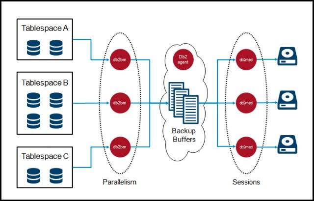
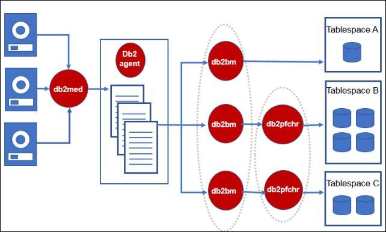

# Db2 备份恢复性能问题诊断与调优
Db2 实用

**标签:** 分析

[原文链接](https://developer.ibm.com/zh/articles/ba-lo-backup-restore-performance-issue-judge-optimize/)

苗庆松

发布: 2018-03-21

* * *

## Db2 备份/恢复线程模型

### Db2 备份线程模型

首先看一下 Db2 backup 操作的线程模型，如图 1 所示（图片来源见参考资料）：

##### 图 1\. Backup 线程模型



它主要包括 db2bm, db2med, db2agent 三类 EDU，以及 db2vend 进程，在参考资料 Maximizing Performance of IBM DB2 Backups 一文中有更详细的解释，这里简单说一下：

- **db2agent EDU** ：负责 backup 开始阶段的工作，包括计算并创建最优数量的 db2bm/db2med EDU、分配最佳大小的 backup buffer、通过向 db2bm 和 db2med 发送控制信息以协调备份工作。
- **db2bm EDU** ：从 empty queue 里获取一个 backup buffer，然后从其对应的表空间里读取数据到 buffer 里，然后把写满的 buffer 放到 full queue 里。简单来讲，就是从磁盘上读数据到内存中。
- **db2med EDU** ：从 full queue 里获取一个 backup buffer，然后写到 backup 设备上。如果 backup 设备是磁盘，那么它直接负责处理 I/O 操作；如果 backup 设备是存储管理器(storage manager)，比如 TSM、NBU，它会把这个 buffer 交给 db2vend 进程。简单来讲，就是把内存中的数据写到磁盘上或者交给存储管理器。
- **db2vend 进程** ：如果使用了存储管理器，db2med 就会另外创建一个独立的 db2vend 进程，它负责从 db2med 接收数据并调用 vendor API 将数据发送给存储管理器。

### restore 线程模型

restore 操作的线程模型如图 2 所示（图片来源见参考资料）：

##### 图 2\. Restore 线程模型



和 backup 线程模型类似，restore 操作同样包括 db2bm, db2med, db2agent 三类 EDU，以及 db2vend 进程：

- **db2agent EDU** ：和 backup 操作中的 db2agent EDU 功能类似，不再赘述。
- **db2med EDU** ：从 empty queue 里获取一个 buffer，从备份镜像里读取数据到 buffer 里，然后将 buffer 放到 full queue 里。简单来讲，就是从磁盘上读取备份数据到内存中。另外，无论备份文件有几个，都只有一个 db2med EDU。
- **db2bm EDU** ：从 full queue 里获取一个 buffer，然后将里面的内容写到对应的表空间容器上，如果表空间有多个容器，I/O 操作会由多个 db2pfchr EDU 并行写入。简单来讲，就是将内存中的数据写到容器上。
- **db2vend 进程** ：如果使用了存储管理器，就会产生一个 db2vend 进程，它负责调用 vendor API 从备份中读取数据，并将读取的数据交给 db2med EDU。

## Db2 backup/restore 命令中影响性能的参数

这一章主要介绍 db2 backup/restore 命令本身影响性能的参数。

### INCREMENTAL

增量备份中只包含上次备份以来修改过的数据，备份出的文件会比较小，但并不意味着需要的时间也很短：如果表空间没有被修改过，那么增量备份的时候就会跳过这个表空间；但只要表空间中的任一页做过修改，增量备份就会扫描这个表空间中的所有页，并通过 page header 中的内容判断该页是否需要备份，这个过程甚至会导致增量备份花的时间比全备还要长。另外需要注意的一点是，如果表空间修改过的页数过少，导致 db2med EDU 长时间拿不到数据，存储管理器可能会认为 db2 已经 hang 住，从而中断与 db2vend 的连接，导致备份失败，对应的解决方案是将存储管理器的 timeout 参数调大。

### COMPRESS/ENCRYPT

如果备份启用了压缩或者加密，Db2 需要花额外的时间运行压缩算法或者加密算法，会造成备份/恢复速度的下降。

### BUFFER

BUFFER 的大小和数量会影响备份/恢复性能，Db2 会自动调优 buffer 的数量和大小，其总大小受限于数据库配置参数 util\_heap\_sz。对于离线备份而言，backup buffer 总大小的理想值为 util\_heap\_sz 的 90%，对于在线备份而言，backup buffer 总大小理想值为 util\_heap\_sz 的 50%。buffer 的数量取决于 db2bm 和 db2med EDU 的数量。如果想人为设定数量和大小，可以在 backup/restore 命令中指定参数：’WITH num-buffers BUFFERS’ 和 ‘BUFFER buffer-size’

### PARALLELISM

开始备份时，每个 db2bm EDU 都会被分配给一个单独的表空间。表空间是按照从大到小顺序备份的，db2bm

份完一个表空间之后，就会检查是否还有未备份的表空间，如果有的话就从里面选择一个最大的进行备份，如果没有的话就会保持空闲直到整个备份结束。db2bm EDU 的数量取决于 CPU 的数量，如果想要人为修改，则可以在 backup/restore 命令中指定 PARALLELISM 参数。

### OPEN SESSIONS

如果是备份到磁盘上，backup 命令的 TO 选项指定了多少个路径，就会有多少个 db2med EDU，每个 db2med 把数据写到自己对应的路径；如果是备份到存储管理器， db2med 的数量取决于参数 ‘OPEN  SESSIONS’。对于恢复操作，只有一个 db2med EDU。

如果设置了 DB2\_BACKUP\_USE\_DIO 为 ON，那么备份的时候，备份文件不会经过操作系统层面的缓存，而是直接写到磁盘上。这个会对备份的性能造成一定影响，具体是提高性能还是降低性能，与具体的场景有关，在实际中需要做测试。

### 在线备份兼容性

如果是在线备份，则很多操作都会与之不兼容，根据表空间类型和操作的不同，在线备份可能会暂挂以等待其他操作完成，也可能失败。因此，在线备份应该尽量辟开这些操作。具体的兼容性列表可以参考附录

### 表空间高水位线以下空闲 extent

备份的时候，正常情况下会读取高水位线以下连续的、已经使用的 extent，直到读满一个 backup buffer，算一次读取操作。如果有 free extent，遇到 free extent 时读取就会中断，那么原本只需要一次读取的操作就会被分为多次，导致备份的速度降低，这一点对在线备份的影响尤其明显。

### 预取

上面已经说过，如果表空间有多个容器，备份的时候不是由 db2bm EDU 直接读取数据，而是由多个预取线程 db2pfchr 来并行读取的，并行 I/O 可以加快读取速度从而减少备份时间。

### 目标设备的个数

如果可能，指定多个目标设置有助于加快备份速度。

## 备份/恢复进度监控

可以使用 `db2 list utilities show detail` 或者 `db2pd -utilities` 命令来查看备份/恢复操作的进度，下面的清单 1 是一个监控备份操作的示例：

##### 清单 1\. 监控备份操作进度

```
$ db2 list utilities show detail

ID                               = 81
Type                             = BACKUP
Database Name                    = SAMPLE
Member Number                    = 0
Description                      = offline db
Start Time                       = 02/28/2018 16:20:08.523339
State                            = Executing
Invocation Type                  = User
Throttling:
Priority                      = Unthrottled
Progress Monitoring:
Estimated Percentage Complete = 28
      Total Work                 = 1187160686 bytes
      Completed Work             = 337194070 bytes
      Start Time                 = 02/28/2018 16:20:08.523349

```

Show moreShow more icon

从示例中可以看到总的工作量估计值大约为 1187160686 bytes，已经完成的工作量为 337194070 bytes， 完成百分比为 28%，可以根据 Start Time 和已经完成百分比预估结束时间。

## 备份/恢复性能问题数据收集

当备份/恢复出现性能问题，或者需要调优的时候，首先需要收集足够的数据来找出性能问题的瓶颈，需要收集的数据主要包括 Db2

份/恢复性能统计信息、Stack 数据、db2 trace 以及操作系统层面的一些数据

### 备份/恢复性能统计信息

自从 Db2 10.1FP2 开始，每次 backup/restore 完成后，db2diag.log 中就会记录一条类似清单 2 中的消息，列出了详细性能统计信息:

##### 清单 2\. 备份/恢复性能统计信息

```
2018-02-28-06.47.20.921681-480 E548681E1520          LEVEL: Info
PID      : 2590                 TID : 140213653333760 PROC : db2sysc 0
INSTANCE: inst105             NODE : 000            DB   : SAMPLE
APPHDL  : 0-152                APPID: *LOCAL.inst105.180228144458
AUTHID  : INST105             HOSTNAME: db2a
EDUID   : 216                  EDUNAME: db2agent (SAMPLE) 0
FUNCTION: DB2 UDB, database utilities, sqluxLogDataStats, probe:395
MESSAGE : Performance statistics
DATA #1 : String, 1016 bytes

Parallelism       = 4
Number of buffers = 4
Buffer size       = 16388096 (4001 4kB pages)

BM#    Total      I/O      MsgQ      WaitQ       Buffers   kBytes
---  --------  --------  --------  --------   --------  --------
000    140.23     11.29      0.02    128.72         10     119264
001    140.22    139.54      0.00      0.18        178     2837632
002    140.22      0.42      0.00    139.79          1      1904
003    140.22      0.38      0.00    139.83          1      1920
---  --------  --------  --------  --------   --------  --------
TOT    560.91    151.65      0.02    408.54         190    2960720

MC#    Total      I/O      MsgQ      WaitQ      Buffers    kBytes
---  --------  --------  --------  --------   --------  --------
000    140.94     11.64    128.58      0.01         191    3024788
---  --------  --------  --------  --------   --------  --------
TOT    140.94     11.64    128.58      0.01         191    3024788

```

Show moreShow more icon

含义如下：

- **BM.** db2bm ID
- **Total.** EDU 存在的时间，单位为秒
- **I/O.** EDU 读写 I/O 的时间，如果此项占比高，说明瓶颈很可能在 I/O
- **MsgQ.** EDU 等待 I/O buffer 的时间，如果 db2bm 的此项占比高，说明 free buffer 少，可以增加备份时的 buffer 的数量。
- **WaitQ.** 等待控制信息的时间，如果 db2bm 这一项比较高，说明 db2bm EDU 比较空闲
- **Buffers.** 处理的 I/O buffers 数量
- **Kbytes.** 处理的数据量
- **MC.** db2med ID
- **Compr.** 压缩操作占用的时间，仅压缩备份中会出现
- **Compr Bytes.** 压缩的数据，仅压缩备份中会出现

### db2pd –stack

stack 是针对性能问题的一项很有用的数据，如果是在线备份并且应用不多，建议收集所有 EDU 的 stack，即 db2pd -stack all 命令。否则，建议至少收集备份/恢复应用的 stack。清单 3 是某次备份作业时 db2pd -edu 命令的输出，以其为例，db2bm EDU name 为 db2bm.17686.x，其中 17686 即为备份作业对应的 EDU ID:

##### 清单3\. 根据db2bm名找到db2agent EDU

```
$ db2pd -edu

Database Member 0 -- Active -- Up 1 days 19:26:08 -- Date 2018-02-28-11.06.04.936264

List of all EDUs for database member 0

db2sysc PID: 12910796
db2wdog PID: 11403362
db2acd  PID: 8585382

EDU ID    TID                  Kernel TID           EDU Name
=============================================================================
19228     19228                128516107            db2med.17686.0 (SAMPLE) 0
18971     18971                16187529             db2bm.17686.4 (SAMPLE) 0
18714     18714                124846105            db2bm.17686.3 (SAMPLE) 0
18457     18457                127795435            db2bm.17686.2 (SAMPLE) 0
18200     18200                121700431            db2bm.17686.1 (SAMPLE) 0
17943     17943                125304835            db2bm.17686.0 (SAMPLE) 0
17686     17686                21233761             db2agent (SAMPLE) 0
...

```

Show moreShow more icon

然后再根据清单 4 中 db2pd -agent 的输出，找到 17686 对应的 Application handle 为 1473：

##### 清单 4\. 根据 db2agent 找到 application handle

```
$ db2pd -agent

Database Member 0 -- Active -- Up 1 days 19:26:09 -- Date 2018-02-28-11.06.05.114288

Address            AppHandl [nod-index] AgentEDUID Priority    Type     State
...
0x078000000334BE80 1473     [000-01473] 17686      0           Coord    Inst-Active

```

Show moreShow more icon

最后针对 application handle 为 1473 的应用收集 stack，命令为 `db2pd -stack apphdl=1473 -rep 60 2 ，` 表示只针对 1473 收集 stack，重复两次，间隔为 60 秒。

### db2 trace

某些性能问题可能还要收集 db2 trace，类似地，可以在收集 db2 trace 的时候指定 apphdl，以上一节的 application handle 为例，可以执行清单 5 中的命令来收集 trace：

##### 清单 5 针对 application 收集 trace

```
$ db2trc on -l 512m -t -apphdl 1473
$ db2trc dmp trcBackup.dmp.1
$ sleep 60
$ db2trc dmp trcBackup.dmp.2
$ sleep 60
$ db2trc dmp trcBackup.dmp.3
$ db2trc off

```

Show moreShow more icon

除了上面提到的 Db2 层面的数据之外，操作系统层面的数据也是必不可少的，例如 vmstat、iostat 等。

## 备份/恢复性能问题实例

这一部分举几个备份/恢复性能问题的具体例子

### 表空间数据分布不均匀导致的备份性能问题

首先来看一个表空间数据分布不均匀导致的备份性能问题，某数据库的备份性能统计信息如清单 6 所示：

##### 清单 6\. 某次备份的性能统计信息

```
2018-02-28-06.47.20.921681-480 E548681E1520          LEVEL: Info
PID     : 2590                 TID : 140213653333760 PROC : db2sysc 0
INSTANCE: inst105              NODE : 000            DB   : SAMPLE
APPHDL  : 0-152                APPID: *LOCAL.inst105.180228144458
AUTHID  : INST105              HOSTNAME: db2a
EDUID   : 216                  EDUNAME: db2agent (SAMPLE) 0
FUNCTION: DB2 UDB, database utilities, sqluxLogDataStats, probe:395
MESSAGE : Performance statistics
DATA #1 : String, 1016 bytes

Parallelism       = 4
Number of buffers = 4
Buffer size       = 16388096 (4001 4kB pages)

BM#    Total      I/O      MsgQ       WaitQ       Buffers   kBytes
---  --------  --------  --------  --------    --------  --------
000    140.23     11.29      0.02    128.72          10     119264
001    140.22    139.54      0.00      0.18         178     2837632
002    140.22      0.42      0.00    139.79           1      1904
003    140.22      0.38      0.00    139.83           1      1920
---  --------  --------  --------  --------    --------  --------
TOT    560.91    151.65      0.02    408.54         190     2960720

MC#    Total      I/O      MsgQ       WaitQ       Buffers   kBytes
---  --------  --------  --------  --------    --------  --------
000    140.94     11.64    128.58      0.01         191     3024788
---  --------  --------  --------  --------    --------  --------
TOT    140.94     11.64    128.58      0.01         191     3024788

```

Show moreShow more icon

可以看到所有 db2bm EDU 花费了 560.91 秒，仅 WaitQ 就占用了 408.54 秒，占比高达 72.8%。说明大部分 db2bm EDU 都在等着做事，比较空闲，只有 db2bm001 比较忙。导致这种现象的原因就是表空间的数据分布不均匀，有一个表空间比较大，其他的都比较小，从 BM#部分最后一列的 KBytes 也能看出来：db2bm001 处理的数据量明显比其他 db2bm EDU 多。

对应的解决方案是使数据尽可能均匀地分布在不同的表空间，使每个 db2bm EDU 的工作量都基本一致，不会有空闲的 db2bm EDU。这样能提高性能的前提是 CPU、内存、I/O 没有瓶颈，否则反而可能降低备份性能，例如如果表空间容器都在同一块磁盘上，则同时备份多个表空间可能会引起 I/O 争用。

### 过多 Free extent 导致的备份性能问题

再来看一个由于表空间高水位以下太多空闲 extent 导致的备份性能问题，具体现象为删除了约一半无用的表，之后备份的数据量大约为原来的 54%，但备份的时间却只降低为原来的 77%。删除表前后的备份性能统计信息分别如清单 7 和清单 8 所示：

##### 清单 7\. 删表之前备份性能统计信息

```
BM#    Total      I/O      MsgQ      WaitQ       Buffers    kBytes
---  --------  --------  --------  --------    --------  --------
000    167.46    166.95      0.00      0.01         319     5178992
001    167.45      0.45      0.03    166.96           1       608
002    167.45      4.61      0.00    162.83           7     112768
---  --------  --------  --------  --------    --------  --------
TOT    502.37    172.02      0.03    329.81         327    5292368

MC#    Total      I/O      MsgQ      WaitQ       Buffers    kBytes
---  --------  --------  --------  --------    --------  --------
000    169.78     14.93    152.52      0.00         328    5342520
---  --------  --------  --------  --------    --------  --------
TOT    169.78     14.93    152.52      0.00         328    5342520

```

Show moreShow more icon

##### 清单 8\. 删表之后备份性能统计信息

```
BM#    Total      I/O      MsgQ      WaitQ      Buffers     kBytes
---  --------  --------  --------  --------    --------  --------
000    129.61      0.22      0.01    129.36           3       608
001    129.60      2.30      0.00    127.28           7     112768
002    129.60    128.72      0.00      0.02         168     2589664
---  --------  --------  --------  --------    --------  --------
TOT    388.81    131.25      0.01    256.67         178     2703040

MC#    Total      I/O      MsgQ      WaitQ        Buffers   kBytes
---  --------  --------  --------  --------    --------  --------
000    131.29      7.44    122.15      0.00         179     2900708
---  --------  --------  --------  --------    --------  --------
TOT    131.29      7.44    122.15      0.00         179     2900708

```

Show moreShow more icon

对比前后的性能统计信息，发现删表之前备份读取速率为大约为 30MB 每秒，计算方法为 BM#的 kBytes 除以 I/O 时间：5292368kBytes/172.02=30MB/S，删表之后备份时读取速率为 2703040kBytes/131.25=20MB/S。联想到删表之后会有一些空闲的 extents，于是使用 db2dart 的 DHWM 选项看了一下对应的表空间高水位状况，如清单 9 所示，可以看到有很多 EMPTY 的 extent：

##### 清单 9\. db2dart /DHWM 检查表空间结果：

```
...<略>...
[15992]     5 0x00    [15993] == EMPTY ==  [15994]     5 0x00   [15995] == EMPTY ==
[15996]     5 0x00    [15997] == EMPTY ==  [15998]     5 0x00   [15999] == EMPTY ==
[16000] 65534 0x0e   [16001]     5 0x00   [16002] == EMPTY ==  [16003]     5 0x00
[16004] == EMPTY ==  [16005]     5 0x00   [16006] == EMPTY ==  [16007]     5 0x00
[16008] == EMPTY ==  [16009]     5 0x00   [16010] == EMPTY ==  [16011]     5 0x00
...<略>...

```

Show moreShow more icon

以上面结果为例，如果没有 EMPTY 的 extent，那么从 15992 到 16011 的这些 extent 都可以在一次读操作读完。有了 EMPTY extent 之后，读操作遇到 EMPTY extent 就会中断，于是 15992、15994、15996、15998 等都需要一次单独的读操作，导致读取的速率降低，从而影响了备份的性能。使用 `db2 list tablespaces show detail` 也可以看到该表空间状况如清单 10 所示：

##### 清单 10\. 表空间使状况

```
Tablespace ID                        = 3
Name                                 = USERSPACE1
Type                                 = Database managed space
Contents                             = All permanent data. Large table space.
State                                = 0x0000
Detailed explanation:
    Normal
Total pages                          = 2621440
Useable pages                        = 2621438
Used pages                           = 647416
Free pages                           = 1974022
High water mark (pages)              = 1294746
Page size (bytes)                    = 4096
Extent size (pages)                  = 2
Prefetch size (pages)                = 2
Number of containers                 = 1
Minimum recovery time                = 2018-03-05-02.47.06.000000

```

Show moreShow more icon

可以从清单 10 中看到高水位为 1294746，但 Used Pages 只有 647416。对应的解决方案是使用 `db2 alter tablespace <tbsname> lower high water mark` 命令降低表空间的高水位，降高水位之后再次测试备份只用了 93.36 秒，降低为最初始 169.78 秒的 55%，达到预期效果。

### Linux 文件系统预分配导致的恢复性能问题

再来看一个恢复时遇到的问题，客户反馈说在做 Db2 恢复测试的时候，通过 `db2pd -uti` 或者 `db2 list utilities show detail` 监控到恢复操作很长时间没有任何进展(HANG 住)，但文件系统可用空间却越来越少。这一现象只在 Linux 上发现，在 AIX 上无此现象。于是收集了一些数据，首先看一下，恢复表现正常时，db2med 和 db2bm 的 stack，如清单 11 所示，可以看到 db2med 在从 FileDevice 读数据，db2bm 在写数据：

##### 清单 11：正常恢复时 db2med 和 db2bm 的 stack

```
db2med:
<StackTrace>
------FUNCTION------
read
sqloread
sqloreadEx
sqluReadFromFileDevice
sqluMCReadFromDevice
sqluMCReadFromDev4Restore
sqluMCContinueRestore
sqluMCProcessRestoreStatesP
sqluMCStartRestoreMediaControllerPcj
...
</StackTrace>

db2bm
<StackTrace>
------FUNCTION------
pwrite
sqloseekwrite64
sqloWriteBlocks
sqlbDMSMapAndWrite
sqlbDMSDirectWrite
sqlbDirectWrite
sqluWriteDMS
sqludBMCont
sqludbufPcj
...
</StackTrace>

```

Show moreShow more icon

再来看一下，”HANG”住的时候，db2med 和 db2bm 的 stack，如清单 12 所示，db2med 并没有在读数据； db2bm 确实在写，但并不是写备份的数据，里面比较关键的函数： RestoreContainers -> DMSAddContainerRequest -> SetFileSize -> sqlowrite，从这几个函数来看，db2bm 正在做的事情是处理添加容器请求(DMSAddContainerRequest)， 设置容器大小(SetFileSize)，之后调用 sqlowrite 实现容器空间的预分配。

##### 清单 12\. HANG 住时 db2med 和 db2bm 的 stack

```
db2med:
<StackTrace>
------FUNCTION------
msgrcv
sqlorqueInternal
sqlorque2
sqluReadBufferFromQueue
sqluMCContinueRestore
sqluMCProcessRestoreStatesP
sqluMCStartRestoreMediaControllerPcj
...
</StackTrace>

db2bm:
<StackTrace>
------FUNCTION------
write
sqlowrite
sqloSetFileSize
sqlbServiceAddDMSContainerRequest
sqlbDMSAddContainerRequest
sqlbDoDMSAddContainerRequests
sqlbASSetPoolContsForDMS
sqlbASDefineContainersForDMS
sqlbRestoreASContainers
sqlbRestoreContainers
sqlbRestorePoolDef
sqludProcessSPCS
sqludBMInit
sqludbufPcj
sqloEDUEntry
...
</StackTrace>

```

Show moreShow more icon

至此，问题比较明确：数据库 restore 操作并非真正 HANG 住，而是 db2 正在进行 DMS 表空间容器的预分配，等容器分配完成之后，才能继续恢复数据。在检查了文件系统之后，发现是 EXT3 格式， EXT3 格式的文件系统不支持 fast-allocation，创建文件的操作会非常慢，创建数据库、 恢复数据库、创建容器等操作都会受到影响。 解决的方案就是使用支持 fast-allocation 的文件系统，比如 GPFS、 JFS2(AIX), 如果是 LINUX 系统，可以考虑将 EXT3 升级成 EXT4。

## 结束语

优化的前提是对背后原理的深入了解，所以本文从 Db2 backup/restore 的线程模型开始讲起，之后详细介绍了影响 backup/restore 性能的内部和外部原因，最后通过几个实例讲解了针对 backup/restore 性能问题的数据收集与分析方法。由于篇幅限制，本文所讲知识点不可能面面俱到，有兴趣的读者可以进一步阅读参考资料中的文档，遇到问题时也可收集数据提交至 IBM 技术中心获取帮助。

## 参考资料

- 文章 [Alter tablespace add container runs slow on Linux using filesystem EXT3](http://www-01.ibm.com/support/docview.wss?uid=swg21657186) 中讲述了 EXT3 格式对表空间扩容的影响。
- 文章 [BACKUP might be affected by fragmentations in table space](http://www-01.ibm.com/support/docview.wss?uid=swg21678274) 讲述了 fragmentations 对 backup 的性能影响。
- 文章 [DB2 Backup performance: how named pipes can help us if compression is the bottleneck?](https://www.ibm.com/developerworks/community/blogs/IMSupport/entry/DB2_Backup_performance_compression_tablespace_imbalance?lang=en) 提供了一种当压缩成为 Backup 的瓶颈时的解决方案。
- 文章 [Debug Slow Online Backup in DB2](https://www.ibm.com/developerworks/community/blogs/DB2PerfTips/entry/slow_backup?lang=en) 提供了一个收集在线备份性能数据的脚本。
- 文章 [Effect of DB2\_USE\_FAST\_PREALLOCATION on a DB2 restore](http://www-01.ibm.com/support/docview.wss?uid=swg21996340) 讲述了快速预分配对 Db2 restore 的性能影响。
- 红皮书 [Maximizing Performance of IBM DB2 Backups](http://www.redbooks.ibm.com/abstracts/tips1344.html?Open) 和 [Understanding IBM Db2 Restore](http://www.redbooks.ibm.com/abstracts/tips1353.html?Open) 讲述了备份和恢复操作的线程模型。
- 信息中心链接 [Optimizing backup performance](https://www.ibm.com/support/knowledgecenter/en/SSEPGG_10.5.0/com.ibm.db2.luw.admin.ha.doc/doc/c0006205.html) 和 [Optimizing restore performance](https://www.ibm.com/support/knowledgecenter/en/SSEPGG_10.5.0/com.ibm.db2.luw.admin.ha.doc/doc/c0011912.html) 讲述了几个调优 backup/restore 相关的参数。
- 文章 [Tune backup performance using registry variable DB2\_BACKUP\_USE\_DIO](http://www-01.ibm.com/support/docview.wss?uid=swg21995705) 讲述了文件系统缓存对备份的性能影响。
- 信息中心链接 [Compatibility of online backup and other utilities](https://www.ibm.com/support/knowledgecenter/en/SSEPGG_10.5.0/com.ibm.db2.luw.admin.ha.doc/doc/c0021554.html) 详细了介绍了在线备份和其他应用的兼容性。