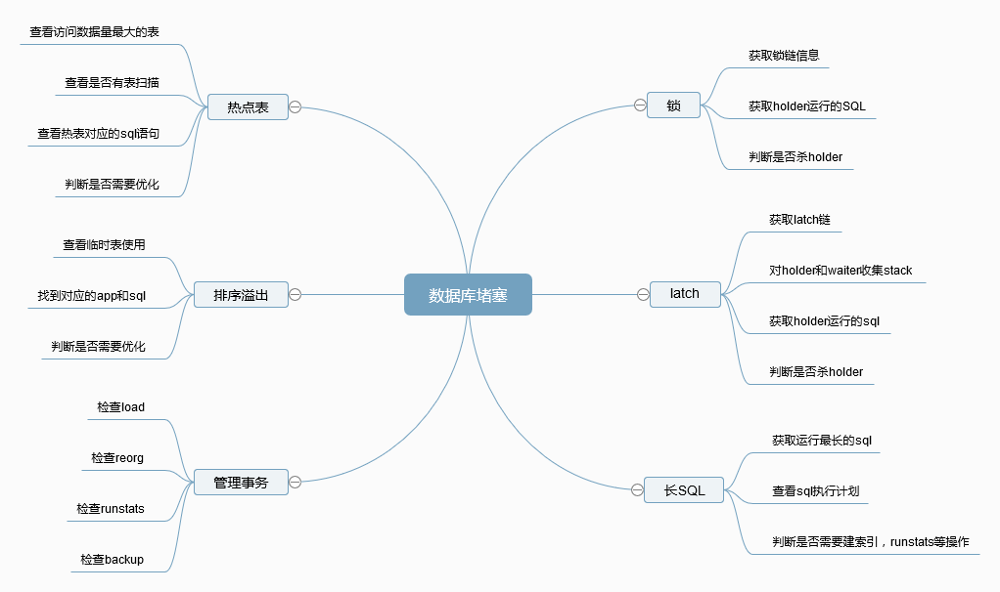

# Db2 数据库常见堵塞问题分析和处理
Db2 堵塞一键检查工具

**标签:** 分析

[原文链接](https://developer.ibm.com/zh/articles/ba-lo-db2-common-blocking-problem-analyze/)

孔再华

发布: 2018-04-20

* * *

## Db2 数据库堵塞怎么办

作为一个数据库管理员，工作中经常会遇到的一个问题：当数据库出现故障的情况下，如何快速定位问题和找到解决方案。尤其是在运维非常重要系统的时候，解决问题恢复服务是分秒必争。Db2 作为广泛使用的商业数据库，内部提供了众多方法论和诊断工具等来协助分析问题。然而当问题真正发生的时候，数据库管理员还是会手忙脚乱，不知道从何处下手。如果着手分析的方向发生了错误，时间更是浪费严重，问题得不到及时解决，甚至有可能采取了错误的措施，导致更严重的后果。

导致数据库堵塞原因有很多，即便是现在总结，也仅仅是总结曾经遇到过的情况。即便是曾经遇到的问题重复发生的时候，快速找到源头并处理也是很大的挑战。这个时候脑子里想着方法论，手上敲着各种诊断工具的命令，从输出的结果再继续分析处理。整个过程即便是非常有经验的数据库管理员也需要很多操作时间。如果可以针对常见的堵塞问题，开发出一个自动分析的工具，直接展示堵塞原因和处理语句，就能够大大加快处理的速度。这也是一直以来数据库管理员亟需的工具。然而因为导致数据库堵塞原因的多样性和未知性，写这样一个工具并不容易，所以市场上并没有这样的成熟工具。

退而求其次，仅仅针对常见的堵塞问题，是可以开发出这样的一键检查处理工具的。所以我开发了一个简单的 python 脚本，帮助分析日常工作中的遇到的数据库问题。后续也需要慢慢加强和改进。最重要的是，写这个文章是为了总结几种 Db2 数据库常见的堵塞问题并提供解决方案。

开发这个工具的时候，我联想到在以前遇到过数据库堵塞问题的时候，数据库甚至都没有办法连接，新请求也会被堵塞住。db2top 等命令完全出不来结果。只有 db2pd 这样的工具能够使用。db2pd 工具是从内存直接获取信息，不需要连接数据库，属于轻量级的诊断工具。所以在数据库发生堵塞，数据库无法连接的情况下，db2pd 是最好的选择。

DB2 数据库堵塞怎么办？首先是快速定位原因，使用 db2pd 将常见的堵塞现象分析一遍。如果定位到是曾经碰到的问题，那就比较好办了，赶紧实行对应的解决方案。如果不是常见的问题，尽量收集足够多的信息，例如 stack 等，然后重启实例恢复数据库，但是这样可能堵塞问题还是会重现，不能根本解决问题。

## Db2 数据库常见堵塞问题

Db2 数据库发生性能缓慢或者堵塞的最常见现象是数据库活动会话激增，数据库相关命令和语句运行缓慢。导致性能缓慢的原因有很多，最常见的可能是出现锁问题。一个长 sql 堵塞其他相关 sql，导致短时间并发 sql 变多，系统变慢。也有可能是出现了大 sql，耗尽系统资源等。如下图所示，我归纳列举了一些常见的堵塞原因，整理了相关问题解决的方法。

##### 图 1\. Db2 常见堵塞问题分析



图中所列的这些问题都可以通过 db2pd 工具获取信息来分析。我也在一键检查分析工具里面包含了这些场景。

## 锁链分析和处理

Db2 的锁机制与其他数据库差异很大，锁问题也是在数据库运维中重点关注的对象。锁是用来控制事务的一致性和并发性的。Db2 的隔离级别和其他数据库差不多，都是解决脏读，幻读，不可重复读等问题。然而不同于其他数据库，Db2 的锁是存放在内存里的。数据库的 locklist 参数控制这个内存的大小。如果出现某个实务需要加的锁特别多，可能会导致这个内存里放不下，触发锁升级。锁升级更容易引起堵塞。

### 发现锁堵塞

一个正常运行的数据库突然出现锁问题通常有两种情况： 一种是运行了不常运行的 SQL 事务，堵塞了正常的交易。一种是正常的交易事务突然性能有问题，例如查询计划改变。不管是哪种情况，最紧要的是将源头找出来。db2top 工具有一个非常好用的功能，就是查看锁链的信息。

#### 清单 1\. db2top 查看锁链

```
[\]16:01:41,refresh=0secs(0.008)        Locks         AIX,member=[4/4],DB2GDPC:CHGMDB
[d=Y,a=N,e=N,p=ALL]                                                          [qp=off]
+---------------------------------------------------------------------------------+
|                                                                                 |
|   Blocker->Blocked Agent Chain                                               |
|   ---------------------------------------------------------------------------   |
|   1546->64481->1309                                                       |
|                                                                                 |
|                                                                                 |
|                                                                                 |
|                                                                                 |
|                                                                                 |
|                                                                                 |
|                                                                                 |
|                                                                                 |
|                                                                                 |
|                                                                                 |
|                                                                                 |
| Press any key to resume...                                                      |
+---------------------------------------------------------------------------------+
Quit: q, Help: h         Lock=49 (Entries=49), L: Lock Chain               db2top 2

```

Show moreShow more icon

在这个输出里面，1546 这个应用是锁的持有者，其他都是等待者。下一步就是分析 1546 在执行什么语句，是否需要杀，是否需要优化。

然而对于已经堵塞的 Db2 数据库，db2top 可能根本打不开。这个时候就需要 db2pd 工具来查看锁等待的信息。

#### 清单 2\. db2pd 查看锁等待

```
AGDPCMB1:/home/db2gdpc$db2pd -d chgmdb -wlocks
ksh: There is not enough space in the file system.

Database Member 0 -- Database CHGMDB -- Active -- Up 19 days 01:18:29 -- Date2018-02-27-
16.52.48.487758

Locks being waited on :
AppHandl [nod-index] TranHdl    Lockname                   Type      Mode Conv Sts
CoorEDU    AppName  AuthID   AppID
1546     [000-01546] 39         00030418000000000000000452 RowLock    ..X       G   176565
db2bp    DB2GDPC *N0.db2gdpc.180430224639
1309     [000-01309] 40         00030418000000000000000452 RowLock    ..X       W   323302
db2bp    DB2GDPC *N0.db2gdpc.180430224640

1546     [000-01546] 39         00030418000000000000000054 TableLock  .IX       G   176565
db2bp    DB2GDPC *N0.db2gdpc.180430224639

1309     [000-01309] 40         00030418000000000000000054 TableLock  .IX       G   323302
db2bp    DB2GDPC *N0.db2gdpc.180430224640
64481    [000-64481] 3          00030418000000000000000054 TableLock  ..S       W   394879
db2bp    DB2GDPC *N0.db2gdpc.180430224637

```

Show moreShow more icon

在这个 db2pd 的输出里面，第八列 Sts 就是持有者（G）和等待者（W）。第四列 lockname 是对应的锁。需要综合这两个信息，才能知道应用的等待关系。这里分析锁等待关系并不是非常直观。所以我在开发的工具里结合 lockname 和锁状态信息组织出锁链关系，然后展示出来。

### 分析锁问题

基于上述信息，找到锁的持有者源头，现在还需要知道持有者在运行什么语句。这个可以通过 db2pd 的 application 选项和 dynamic 选项综合分析出当前正在执行和上次执行的语句。

#### 清单 3\. db2pd 查看 application

```
AGDPCMB1:/home/db2gdpc$db2pd -d chgmdb -application 1546

Database Member 0 -- Database CHGMDB -- Active -- Up 20 days 18:31:55 -- Date 2018-03-01-
10.06.14.595025

Applications:
Address            AppHandl [nod-index] NumAgents  CoorEDUID Status                   C-
AnchID C-StmtUID L-AnchID L-StmtUID Appid
WorkloadID  WorkloadOccID CollectActData          CollectActPartition
CollectSectionActuals
0x0A00020042CA0080 1546     [000-1546]  1          147263     UOW-Waiting              0
0          341      2          *N0.db2gdpc.180504025324
1           37352         N                       C                       N

External Connection Attributes
Address            AppHandl [nod-index] ClientIPAddress
EncryptionLvl SystemAuthID
0x0A00020042CA0080 1546     [000-1546]  n/a                                      None
DB2GDPC

Trusted Connection Attributes
Address            AppHandl [nod-index] TrustedContext
ConnTrustType                RoleInherited
0x0A00020042CA0080 1546 [000-1546]  n/a
non trusted                  n/a

Autonomous Routine Connections
Address            AppHandl [nod-index] Status          Autonomous Routine Handl [nod-
index] Status

Anonymous Block Connections
Address            AppHandl [nod-index] Status          Anonymous Block Handl [nod-index]
Status

```

Show moreShow more icon

在 db2pd 工具的 application 输出里面，C-AnchID 和 C-StmtUID 结合起来指向当前正在运行的语句。L-AnchID 和 L-StmtUID 结合起来指向上一次执行的语句。要获得详细的语句，需要从 dynamic cache 里找到。图中 C-AnchID 和 C-StmtUID 都是 0，也就是当前应用没有执行任何语句。而 L-AnchID 和 L-StmtUID 是 341 和 2，上一次执行的语句是可以获取到的。

#### 清单 4\. db2pd 查看动态语句

```
AGDPCMB1:/home/db2gdpc$db2pd -d chgmdb -dynamic anch=341

Database Member 0 -- Database CHGMDB -- Active -- Up 20 days 19:16:16 -- Date 2018-03-01-
10.50.35.125266

Dynamic Cache:
Current Memory Used           1700359
Total Heap Size               130191196
Cache Overflow Flag           0
Number of References          83506
Number of Statement Inserts   74444
Number of Statement Deletes   74408
Number of Variation Inserts   48
Number of Statements          36

Dynamic SQL Statements:
Address            AnchID StmtUID    NumEnv     NumVar     NumRef     NumExe     Text
0x0A0005024E0EE9A0 341    2          1          1          3          3          select *
from t with rr

Dynamic SQL Environments:
Address            AnchID StmtUID    EnvID      Iso QOpt Blk
0x0A0005024E0EE520 341    2          2          CS  5    B

Dynamic SQL Variations:
Address            AnchID StmtUID    EnvID      VarID      NumRef     Typ Lockname
Val Insert Time                Sect Size  Num Copies
0x0A0005024E0BEE60 341    2          2          1          2          6
000000020000000200012AA0D6 Y   2018-03-01-09.06.10.891027 6056       0

```

Show moreShow more icon

基于 L-AnchID 为 341 去查 dynamic cache，可以看到 StmtUID 为 2 的 sql 语句是”select \* from t with rr”。至此就得到了锁的持有者正在运行的语句或者最后运行的语句是什么。这样就可以和开发一起分析这个问题是什么原因导致的。

### 处理锁问题

通常异常出现锁问题的原因分两种：

- 不常见的 SQL：当前 SQL 不是业务常用 SQL，例如新上线的功能，管理节点发起的维护 SQL，或者个人后台发起的 SQL 等。因为测试不充分，没有评估好对生产业务的影响。这种情况下一般选择先杀掉，并且控制不要再次发起，等优化完再上线。
- 常见 SQL 突然变慢：例如执行计划发生变化，导致 SQL 变慢，从而促发了锁竞争的问题。这种情况仅仅杀 SQL 可能是不管用的，因为 SQL 还会被调用起来。这时需要立刻获取 SQL 的查询计划，抓紧时间调优。例如运行 runstats，创建必要的索引等方式。

我在 Db2 堵塞一键检查工具里面对上述操作进行了自动化分析和处理。

#### 清单 5\. 一键检查工具分析锁问题

```
AGDPCMB1:/home/db2gdpc$python db2_check_hang_105.py chgmdb lock

###############################################################################
#                                Lock  Analyze                                #
###############################################################################

#The lock chains are:
['15412', '15657']
['15412', '19008']
#The root lock holders are: ['15412']
#The stmt for applicaiton 15412 is:
The current stmt is:NULL .
The last stmt is: select * from t with rr .
#You can force the holders by:
db2 "force application (15412) "

```

Show moreShow more icon

工具在分析锁问题的时候，首先展示锁链并排序，然后找到所有锁链中锁持有者执行的 SQL 语句，并将需要快速杀应用的语句打印出来，便于快速决策是否调用。

## latch 链分析和处理

Db2 的 latch 是一个教科书里没有详细阐述也无法详细枚举所有 latch 种类的机制。Latch 简单来说就是线程锁。它和 Db2 的锁不一样但是堵塞时的现象差不多，都是一个线程获取到了 latch，堵塞了其他需要这个 latch 的线程。Latch 促发的问题可能还要严重。Lock 通过杀掉持有者的 apphdl 还可以释放，Latch 的持有者可能并不是应用，可能是 Db2 的其他内部线程，是没有开放接口去杀的。这种情况下只有等待或者重启实例。

latch 问题可能是数据库管理员最头疼的问题。因为通常这种问题牵涉的是 Db2 开发的内部机制，属于未公开的信息。基本上这个时候能做的只是想办法解开 latch，收集信息给 IBM 支持团队分析原因。

### 查看 latch 堵塞

处理这类问题首先是监控是否发生了 latch 等待：

#### 清单 6\. db2pd 查看 latch 等待

```
AGDPCMB1:/home/db2gdpc$db2pd -latches
Database Member 0 -- Active -- Up 30 days 00:11:52 -- Date 2017-12-01-17.11.29.074912

Latches:
Address            Holder     Waiter     Filename             LOC        LatchType
HoldCount
0x0780000004F00478 1553       0          ../include/sqle_workload_disp.h 1391
SQLO_LT_sqeWLDispatcher__m_tunerLatch 1
0x0A00050000069D20 33105      589675     sqlpgResSpace.C      542
SQLO_LT_SQLP_DBCB__add_logspace_sem 1
0x0A00050000069D20 33105      528805     sqlpgResSpace.C      542
SQLO_LT_SQLP_DBCB__add_logspace_sem 1

Latch Waiters With No Holders:
Address            Holder     Waiter     Filename             LOC        LatchType
0x0A0005059594A800 0          529319     /view/db2_v105fp7_aix64_s151221/vbs/engn/include/sqlpt_inlines.h 2186
SQLO_LT_SQLB_BPD__bpdLatch_SX
0x0A00050225DAA938 0          415209     /view/db2_v105fp7_aix64_s151221/vbs/engn/include/sqlpt_inlines.h 2186
SQLO_LT_SQLB_BPD__bpdLatch_SX

```

Show moreShow more icon

图中的输出信息分两个主要部分。第一部分是有持有者的 latch 信息，包含有等待的和没等待的。没有等待者的持有者是不需要关心的。第二部分是找不到持有者但是有等待者的 latch 信息。相对第一部分，这个是因为持有者在内部开发的代码里没有显示给监控，并不是真的没有持有者。解读下这个输出里面的内容：

- Address：latch 地址，唯一定位一个 latch 对象。
- Holder：latch 的持有者。这是个 EDUID。
- Waiter：latch 的等待者。这是个 EDUID。
- Filename：获取这个 latch 的源文件名。
- LOC：源文件里的代码位置。
- LatchType：latch 名称。
- HoldCount：持有数量。

上面这个例子包含三种场景：

1. latch 地址为 0x0780000004F00478 的持有者是 1553，等待者是 0 也就是没有等待者。这是一个正常的现象，不需要去关注。
2. latch 地址为 0x0A00050000069D20 的持有者是 33105，等待者有 589675 和 528805。这是一个典型的堵塞现象。33105 堵塞了 589675 和 528805。这个 latch 的名称是 SQLO\_LT\_SQLP\_DBCB\_\_add\_logspace\_sem。
3. latch 地址为 0x0A0005059594A800 和 0x0A00050225DAA938 没有显示持有者（显示持有者的代价太高，所以 Db2 内部屏蔽了），但是分别有等待者 529319 和 415209。这个 latch 的名称是 SQLO\_LT\_SQLB\_BPD\_\_bpdLatch\_SX。

Latch 的等待信息是瞬间抓取的，如果想要确定是否存在堵塞现象，需要多抓一次 latch 信息来确认。在确认了 latch 堵塞问题的情况下，需要抓取 stack 来获取详细信息给 IBM 的支持开 case。Latch 问题的处理里面 stack 是关键信息。发生竞争的 latch 持有者和等待者都需要抓取 stack。抓取 stack 的语句是：db2pd -stack 。 这里的 eduid 输入就是 latch 选项输出里面的 Holder 和 Waiter。

### 分析 latch 堵塞对象

如果是有持有者的堵塞现象，可以检查持有者是什么 EDU，是否对应到 application，然后确定能否通过解决持有者的方式释放这个堵塞问题。

#### 清单 7\. db2pd 查看 edu 等待

```
AAGDPCMB1:/home/db2gdpc$db2pd -edus

Database Member 0 -- Active -- Up 21 days 00:00:06 -- Date 2018-03-01-15.26.59.059962

List of all EDUs for database member 0

db2sysc PID: 17760262
db2wdog PID: 34930696
db2acd  PID: 45875450

EDU ID    TID                  Kernel TID           EDU Name                               USR (s)         SYS (s)
===================================================================================================================
23561     23561                67373307             db2agnta (XTCUR2) 0                    0.232340        0.039394
577794    577794               130024209            db2agnta (CHGMDB) 0                    0.475758        0.083151
526009    526009               21563441             db2loggr (CMPDB) 0                     28.628607       4.885121
525752    525752               39125599             db2logmgr.0 (CMPDB) 0                  10.656058       6.702469
525495    525495               58590885             db2castructevent SA (CMPDB) 0          0.000232        0.000020
......

```

Show moreShow more icon

通过 db2pd 工具能够查看 EDUID 对应的 EDU Name 是什么。如果 EDU Name 是 db2agent，那么就能对应到一个 application。这个时候查看对应数据库的 applications 输出，就找到 CoorEDUID 对应的 AppHandl 了。

#### 清单 8\. db2pd 查看 application

```
AGDPCMB1:/home/db2gdpc$db2pd -d chgmdb -applications

Database Member 0 -- Database CHGMDB -- Active -- Up 20 days 23:56:31 -- Date 2018-03-01-
15.30.50.066987

Applications:
Address            AppHandl [nod-index] NumAgents  CoorEDUID  Status                  C-
AnchID C-StmtUID  L-AnchID L-StmtUID  Appid
WorkloadID  WorkloadOccID CollectActData          CollectActPartition
CollectSectionActuals
0x0A00020021180080 3842     [000-03842] 1          82548      ConnectCompleted        0
0          0        0          *N0.DB2.180208083025
0           0             N                       C                       N
0x0780000008B00080 3822     [000-03822] 1          72268      ConnectCompleted        0
0          0        0          *N0.DB2.180208083005
0           0             N                       C                       N
......

```

Show moreShow more icon

找到了 AppHandl，就可以查看到对应的 SQL 语句是什么，知道这个应用在做什么。方法分析锁问题的时候找 SQL 一样。最后尝试”db2 force application ()”，运气好的话这个堵塞问题可能就暂时解决了。

### 处理 latch 堵塞问题

获取到 latch 名称后，首先去 IBM 网站查找这个 latch 的关键词，看看有没有已知的问题现象一致，有没有解决办法。最后一定要开 CASE 找 IBM 官方支持，找到真正原因，避免再出现这样的问题。我在一键检查工具里面按照这个思路处理 latch 问题。

#### 清单 9\. 一键检查工具分析 latch 问题

```
AGDPCMB1:/home/db2gdpc$python db2_check_hang_105.py chgmdb latch

###############################################################################
#                                Latch Analyse                                #
###############################################################################

###############    Collect contentions on Address:    ##############
Address: 0x0A00050000069D20
Holder: ['33105']
Waiter: ['589675', '528805']
LatchType: SQLO_LT_SQLP_DBCB__add_logspace_sem
####Start analyse contentions:
####Collect holder information:

#Collect holder info:  33105
The apphdl for tid 33105 is 0
The last stmt is:  No stmt found for 0.
No edu found for eduid:  0

#You can force this holder by:

####Collect Waiter information:

#Collect waiter info:  589675
The apphdl for tid 589675 is 0
The last stmt is:  No stmt found for 0.
No edu found for eduid:  0

#Collect waiter info:  528805
The apphdl for tid 528805 is 0
The last stmt is:  No stmt found for 0.
No edu found for eduid:  0

###############    Collect contentions on Address:    ##############
Address: 0x0A0005059594A800
Holder: ['0']
Waiter: ['529319']
LatchType: SQLO_LT_SQLB_BPD__bpdLatch_SX
####Start analyse contentions:
####No holder on this address, collect stack and sanpshot for waiters:

#Collect waiter info:  529319
The apphdl for tid 529319 is 0
The last stmt is:  No stmt found for 0.
No edu found for eduid:  0

###############    Collect contentions on Address:    ##############
Address: 0x0A00050225DAA938
Holder: ['0']
Waiter: ['415209']
LatchType: SQLO_LT_SQLB_BPD__bpdLatch_SX
####Start analyse contentions:
####No holder on this address, collect stack and sanpshot for waiters:

#Collect waiter info:  415209
The apphdl for tid 415209 is 0
The last stmt is:  No stmt found for 0.
No edu found for eduid:  0

```

Show moreShow more icon

这个工具会对每个出现堵塞的 latch 地址展开 latch 链，然后对相关 eduid 收集 stack，最后尝试找到这些 eduid 对应的 apphandl 和 sql 语句。如果持有者对应到 apphandl，那么也把处理的 force 语句打印出来。

## 查看当前运行时间长的 SQL 语句

Db2 出现运行缓慢如果不是因为锁或者 latch 的等待问题。这时就需要看看当前哪些 SQL 运行的时间比较长。我会挑选 10 条运行时间最长的 SQL 来分析。

#### 清单 10\. 查看 activestatements

```
AGDPCMB1:/home/db2gdpc$db2pd -d chgmdb -activestatements

Database Member 0 -- Database CHGMDB -- Active -- Up 21 days 00:37:29 -- Date 2018-03-01-
16.11.48.180193

Active Statement List:
Address            AppHandl [nod-index] UOW-ID     StmtID     AnchID StmtUID    EffISO
EffLockTOut EffDegree   EntryTime           StartTime           LastRefTime
0x0A0005024E322860 15657    [000-15657] 5          1          548    1          1
3000        0           Thu Mar  1 16:11:38 Thu Mar  1 16:11:38 Thu Mar  1 16:11:38
0x0A0005024DF5CE60 14933    [000-14933] 2          1          317    1          1
3000        0           Thu Mar  1 16:00:33 Thu Mar  1 16:00:33 Thu Mar  1 16:00:33
0x0A0005024E147CC0 19008    [000-19008] 6          1          365    2          1
3000        0           Thu Mar  1 16:11:42 Thu Mar  1 16:11:42 Thu Mar  1 16:11:42

```

Show moreShow more icon

这个输出里面需要关注的是 StartTime，按照这个排序就可以找到运行时间最长的语句了。和分析锁堵塞问题里的方法一样。这里的 AnchID 和 StmtUID 可以在 dynamic cache 里面定位到唯一的 SQL 语句。这个在一键检查工具里面是自动收集展示的。

#### 清单 11\. 一键检查工具查看 TOP SQL

```
AGDPCMB1:/home/db2gdpc$python db2_check_hang_105.py chgmdb stmt

###############################################################################
#                           Show top 10 running stmt                          #
###############################################################################

#Check active statements for:  CHGMDB
The apphdl is:  14933 , started at : Thu Mar  1 16:00:33
     SELECT ID,substr(HOME_HOST,:L0 ,:L1 ) as HOME_HOST,substr(CURRENT_HOST,:L2 ,:L3 ) as
CURRENT_HOST,STATE,ALERT FROM SYSIBMADM.DB2_MEMBER
The apphdl is:  15657 , started at : Thu Mar  1 16:11:38
     update t set c1 =:L0
The apphdl is:  19008 , started at : Thu Mar  1 16:11:42
     delete from t

```

Show moreShow more icon

这个工具基于执行时间排序，只抓取前 10 的 SQL 语句。获得这些信息后就可以分析有没有异常。

## 查看热表和相关 SQL 语句

Db2 运行缓慢不可忽视的诱因之一就是存在热点数据。通常热点数据会伴随锁等待和 latch 等待等现象，但不是完全堵塞的状态。现象就是热点表相关的 SQL 会比正常情况下慢很多，从而导致整个数据库运行缓慢。

### 获取热点表

当数据库出现缓慢的时候，如果想要从热点数据的角度去分析问题，找到对应的表，然后再找到对应的热点语句，就可以分析是否存在问题，是否需要优化。db2top 首页键入 T 可以进入 Tables 的监控界面。在这个界面里能看到 Delta RowsRead 和 Delta RowsWritten 等信息，从而获取当前热点表信息。

#### 清单 12\. db2top 查看热点表

```
[/]15:52:03,refresh=2secs(0.003)     Tables      AIX,member=[4/4],DB2GDPC:CHGMDB
[d=Y,a=N,e=N,p=ALL]                                                     [qp=off]

    Table                                    Delta          Delta
    Name                                     RowsRead/s     RowsWritten/s
    ---------------------------------------- -------------- --------------
    DB2GDPC.TEST                                          0              0
    SYSIBM.SYSCOLUMNS                                     0              0
    SYSIBM.SYSCONTEXTATTRIBUTES                           0              0
    SYSIBM.SYSCONTEXTS                                    0              0
    SYSIBM.SYSDBAUTH                                      0              0
    SYSIBM.SYSEVENTMONITORS                               0              0
    SYSIBM.SYSEVENTTABLES                                 0              0
    SYSIBM.SYSHISTOGRAMTEMPLATEBINS                       0              0
    SYSIBM.SYSHISTOGRAMTEMPLATES                          0              0
    SYSIBM.SYSHISTOGRAMTEMPLATEUSE                        0              0
    SYSIBM.SYSINDEXES                                     0              0
    SYSIBM.SYSNODEGROUPS                                  0              0
    SYSIBM.SYSPLAN                                        0              0
    SYSIBM.SYSROLEAUTH                                    0              0
    SYSIBM.SYSROUTINES                                    0              0
    SYSIBM.SYSSERVICECLASSES                              0              0
    SYSIBM.SYSSTOGROUPS                                   0              0
Quit: q, Help: h         L: top temp storage consumers                db2top 2.

```

Show moreShow more icon

db2top 最强的地方就是能够自动获取两次捕获信息之间的差异并计算出 Delta 值展示出来。其他监控工具只能获取当前累计值，需要手工计算和排序。然而就像之前所担心的那样，db2top 在数据库缓慢的情况下不一定能工作。这个时候只有 db2pd 工具能够正常使用。db2pd 的 tcbstats 选项可以展示表和索引的累计访问信息。

#### 清单 13\. db2pd 查看表信息

```
AGDPCMB1:/home/db2gdpc$db2pd -d chgmdb -tcbstats nocatalog

Database Member 0 -- Database CHGMDB -- Active -- Up 0 days 01:27:49 -- Date 2018-03-07-
15.58.13.184798

TCB Table Information:
Address            TbspaceID TableID PartID MasterTbs MasterTab TableName
SchemaNm ObjClass DataSize   LfSize     LobSize    XMLSize    IxReqRebld
0x0A0005024DDDDAB0 2         -1      n/a    2         -1        INTERNAL           SYSIBM
Perm     1          0          0          0          No
0x0A0005024DCF9430 3         1540    n/a    3         1540      LOCKS              DB2GDPC
Perm     1787       0          64         0          No
0x0A0005024DCF6EB0 3         -1      n/a    3         -1        INTERNAL           SYSIBM
Perm     7          0          0          0          No
0x0A0005024DDDE8B0 2         5       n/a    2         5         TEST               DB2GDPC
Perm     8013       0          0          0          No

TCB Table Stats:
Address            TableName          SchemaNm Scans      UDI        RTSUDI
PgReorgs   NoChgUpdts Reads      FscrUpdates Inserts    Updates    Deletes    OvFlReads
OvFlCrtes  PgDictsCrt CCLogReads StoreBytes BytesSaved
0x0A0005024DDDDAB0 INTERNAL           SYSIBM   0          0          0
0          0          4          0           0          0          0          0          0
0          0          -          -
0x0A0005024DCF9430 LOCKS              DB2GDPC  0          147        147
0          0          0          0           0          0          0          0          0
0          0          -          -
0x0A0005024DCF6EB0 INTERNAL           SYSIBM   0          0          0
0          0          7          0           0          0          0          0          0
0          0          -          -
0x0A0005024DDDE8B0 TEST               DB2GDPC  1          0          0
0          0          592865     0           0          0          0          0          0
0          0          -          -

```

Show moreShow more icon

db2pd 的这个输出里面关注 Scans，Reads，Inserts，Updates 和 Deletes。其中 Scans 表示发生了表扫描的次数。Reads，Inserts，Updates 和 Deletes 分别是读增改删的次数。这些值都是累计值。如果需要当前实际的访问数量，需要通过抓取多次取差值排序才能知道。这个是非常不直观的。我在一键分析工具里面将个思路实现，最终通过计算出 Reads，Inserts，Updates 和 Deletes 的差值总和来排序获取到热点表。

### 获取相关应用和 SQL

获取到热点表之后的下一步就是找到当前访问这个热点表的应用 AppHDL 和对应的 SQL 语句。Db2 的默认隔离级别是 CS。即便是查询语句，也会在表上加共享锁。所以通过查看当前的数据库锁信息，找到在热点表上加了锁的应用就好了。

#### 清单 14\. db2pd 查看表锁信息

```
AGDPCMB1:/home/db2gdpc$db2pd -d chgmdb -lock showlocks|more

Database Member 0 -- Database CHGMDB -- Active -- Up 0 days 02:00:29 -- Date 2018-03-07-
16.30.53.779832

Locks:
Address            TranHdl    Lockname                   Type           Mode Sts Owner
Dur HoldCount  Att        Re
leaseFlg rrIID TableNm            SchemaNm
0x0A0005000761CD00 40         414141414166416415C78BFEC1 PlanLock       ..S  G   40
1   0          0x00000000 0x
40000000 0     N/A                N/A           414141414166416415C78BFEC1 SQLP_PLAN
({41414141 41664164 15C78BFE}, load
ing=0)
0x0A000500075BD600 13         00030604000000000000000054 TableLock      .IX  G   13
1   1          0x00202000 0x
40000000 0     LOCKS              DB2GDPC       00030604000000000000000054 SQLP_TABLE
(obj={3;1540})
0x0A000500075C2F80 14         00030604000000000000000054 TableLock      .IX  G   14
1   1          0x00202000 0x
40000000 0     LOCKS              DB2GDPC       00030604000000000000000054 SQLP_TABLE
(obj={3;1540})
0x0A000500075C6380 15         00030604000000000000000054 TableLock      .IX  G   15
1   1          0x00202000 0x
40000000 0     LOCKS              DB2GDPC       00030604000000000000000054 SQLP_TABLE
(obj={3;1540})
0x0A0005000761D400 40         00020005000000000000000054 TableLock      .IS  G   40
1   0          0x00003000 0x
40000000 0     TEST               DB2GDPC       00020005000000000000000054 SQLP_TABLE
(obj={2;5})

```

Show moreShow more icon

通过 TableNm 和 SchemaNm 匹配到热点表，获取到 TranHdl，然后通过 db2pd 的 transactions 选项找到对应的 AppHandl。例如在这个案例里面 TEST 是一张热点表。从锁信息来看 TranHdl 为 40 的事务占用了锁。下一步通过 TranHdl 找 AppHandl：

#### 清单 15\. db2pd 查看事务信息

```
AGDPCMB1:/home/db2gdpc$db2pd -d chgmdb -transactions 40

Database Member 0 -- Database CHGMDB -- Active -- Up 0 days 02:04:26 -- Date 2018-03-07-
16.34.50.447672

Transactions:
Address            AppHandl [nod-index] TranHdl    Locks      State   Tflag      Tflag2
Firstlsn           Lastlsn            Firstlso             Lastlso              LogSpace
SpaceReserved   TID            AxRegCnt   GXID     ClientUserID
ClientWrkstnName               ClientApplName                 ClientAccntng
0x0A00050001064480 19451    [000-19451] 40         3          READ    0x00000000
0x00000000 0x0000000000000000 0x0000000000000000 0                    0
0               0               0x0000081DB04F 1          0        n/a
n/a                            n/a                            n/a
Total application commits   : 806
Total application rollbacks : 25

```

Show moreShow more icon

最后通过应用的 AppHandl 找到对应的 SQL，过程和前面几个案例一样。

### 一键分析热点表问题

我在一键检查工具里将上述分析过程自动化处理，间隔 10 秒抓取两次表访问数据，计算差值，然后获取到热点表。基于每个热点表的当前加锁信息找到对应的事务和应用，展示出当前正在执行的 SQL。

#### 清单 16\. db2pd 查看事务信息

```
AGDPCMB1:/home/db2gdpc$python db2_check_hang_105.py chgmdb hottable

###############################################################################
#                        Show hot tables and its statements                   #
###############################################################################

#DB2GDPC.TEST is hot.
#Reads: 12266  Inserts: 0  Updates: 0  Deletes: 0  Scans: 0
#The apphdl on this table are:  ['19451', '19452', '19453']
************statements  1 ***********
The current stmt is:NULL .
The last stmt is: select * from test .

************statements  2 ***********
The current stmt is:NULL .
The last stmt is: select * from test .

************statements  3 ***********
The current stmt is:NULL .
The last stmt is: select * from test .

```

Show moreShow more icon

这个输出里面的语句是同一个，执行时间应该都超过了 10 秒，所以 Scans 差值为 0。但事实上这个 SQL 是走的表扫描。通过这个工具可以立刻看到当前的热表，对应的 apphdl 和 SQL。而 apphdl 可以用来杀 SQL。

## 查看占用临时表的 SQL 语句

Db2 数据库的 SQL 排序是在内存里进行的。SHEAPTHRES\_SHR 参数是限制总的排序内存大小。SORTHEAP 参数是限制单个排序能占用的内存大小。当 SQL 排序的时候超出任意一个限制，那么数据需要放到系统临时表里面来排序。相对于内存里排序，这个开销就非常大，SQL 也会变得慢。如果系统临时表对应的磁盘出现瓶颈，那整个数据库也会运行缓慢。

### 谁在占用临时表

系统临时表是存储在系统临时表空间的一种数据库自动创建和删除的临时表。通过查看 db2pd 的 tcbstats 选项能够找到正在使用的临时表。

#### 清单 17\. db2pd 查看临时表

```
AGDPCMB1:/home/db2gdpc$db2pd -d chgmdb -tcbstats nocatalog

Database Member 0 -- Database CHGMDB -- Active -- Up 0 days 19:13:27 -- Date 2018-03-08-
09.43.51.707946

TCB Table Information:
Address            TbspaceID TableID PartID MasterTbs MasterTab TableName
SchemaNm ObjClass DataSize   LfSize     LobSize    XMLSize    IxReqRebld
0x0A0005024DDDDAB0 2         -1      n/a    2         -1        INTERNAL           SYSIBM
Perm     1          0          0          0          No
0x0A0005024DCF9430 3         1540    n/a    3         1540      LOCKS              DB2GDPC
Perm     1787       0          64         0          No
0x0A0005024DCF6EB0 3         -1      n/a    3         -1        INTERNAL           SYSIBM
Perm     7          0          0          0          No
0x0A0005024E1132B0 1         2       n/a    1         2         TEMP (00001,00002)
<54365>< Temp     8045       0          0          0          No
0x0A0005024DDDE8B0 2         5       n/a    2         5         TEST               DB2GDPC
Perm     8013       0          0          0          No

TCB Table Stats:
Address            TableName          SchemaNm Scans      UDI        RTSUDI
PgReorgs   NoChgUpdts Reads      FscrUpdates Inserts    Updates    Deletes    OvFlReads
OvFlCrtes  PgDictsCrt CCLogReads StoreBytes BytesSaved
0x0A0005024DDDDAB0 INTERNAL           SYSIBM   0          0          0
0          0          10         0           0          0          0          0          0
0          0          -          -
0x0A0005024DCF9430 LOCKS              DB2GDPC  0          147        147
0          0          0          0           0          0          0          0          0
0          0          -          -
0x0A0005024DCF6EB0 INTERNAL           SYSIBM   0          0          0
0          0          7          0           0          0          0          0          0
0          0          -          -
0x0A0005024E1132B0 TEMP (00001,00002) <54365>< 0          0          0
0          0          60386      0           592865     0          0          0          0
0          0          126720902  0
0x0A0005024DDDE8B0 TEST               DB2GDPC  5          0          0
0          0          2964325    0           0          0          0          0          0
0          0          -          -

```

Show moreShow more icon

查找表名是 TEMP 的记录，案例里面是”TEMP (00001,00002)”，对应的 SchemaNm 是”<54365>“（案例里的命令加上 full 选项就能看到全部内容：db2pd -d chgmdb -tcbstats nocatalog -full）。这里的 54365 就是应用的链接句柄 AppHdl。DB2GDPC 是连接用户也就是 schema。下面基于 AppHdl 就可以找到正在运行的 SQL 是什么了。

我在一键检查工具里面通过 db2pd 获取到所有占用了临时表的应用链接句柄 AppHDL，然后将 SQL 都展示出来。

#### 清单 18\. 一键检查工具查看临时表

```
AGDPCMB1:/home/db2gdpc$python db2_check_hang_105.py chgmdb temptable

###############################################################################
#                        Show applications using temptable                    #
###############################################################################

************Statements for application:  54365  ***********
The current stmt is:NULL .
The last stmt is: select * from test order by c5 .

```

Show moreShow more icon

获取到了 SQL 就可以分析是否有异常，如果有异常，判断是否基于 apphdl 来杀 SQL。

## 查看当前运行的管理操作

Db2 的一些管理类操作也可能影响数据库的性能。所以当数据库缓慢的时候，我们还需要查看一下当前数据库内有哪些管理性的操作。

### 是否存在统计信息收集

统计信息收集（runstats）的对象是表和索引。Db2 在做 runstats 的时候需要扫描大量数据并计算，因此是一类开销比较大的操作。db2pd 的 runstats 选项可以查看当前正在执行的 runstats。

#### 清单 19\. db2pd 查看 runstats

```
AGDPCMB1:/home/db2gdpc$db2pd -d chgmdb -runstats

Database Member 0 -- Database CHGMDB -- Active -- Up 12 days 20:23:45 -- Date 2017-12-18-
11.02.56.265437

Table Runstats Information:

Retrieval Time: 12/18/2017 11:02:56
TbspaceID: -6       TableID: -32768
Schema: CHGMDB   TableName: SERVICE_LOG
Status: In Progress   Access: Allow write
Sampling: No          Sampling Rate: -
Start Time: 12/18/2017 11:02:43   End Time: -
Total Duration:  -
Cur Count: 61797                  Max Count: 500841

Retrieval Time: 12/18/2017 11:02:56
TbspaceID: 2        TableID: 5
Schema: DB2GDPC  TableName: TEST
Status: Completed     Access: Allow write
Sampling: No          Sampling Rate: -
Start Time: 12/18/2017 11:01:48   End Time: 12/18/2017 11:01:48
Total Duration: 00:00:01
Cur Count: 0                      Max Count: 0

Index Runstats Information:

Retrieval Time: 12/18/2017 11:02:56
TbspaceID: 2        TableID: 5
Schema: DB2GDPC  TableName: TEST
Status: Completed     Access: Allow write
Start Time: 12/18/2017 11:01:48   End Time: 12/18/2017 11:01:49
Total Duration: 00:00:01
Prev Index Duration [1]: 00:00:01
Prev Index Duration [2]:  -
Prev Index Duration [3]:  -
Cur Index Start: 12/18/2017 11:01:48
Cur Index: 2            Max Index: 2            Index ID: 2
Cur Count: 0                      Max Count: 0

```

Show moreShow more icon

其中 End Time 为空的记录就是当前正在做的 runstats。这里能看到具体是表还是索引正在做 runstats。结合当前的热点表，长时间运行的 SQL 等信息一起分析数据库变慢的原因。

### 是否存在表重组

数据库的表和索引重组需要将磁盘上的数据重新整理一遍。这也是一个比较漫长和耗资源的操作。db2pd 的 reorgs 选项能找到当前正在执行的重组操作。

#### 清单 20\. db2pd 查看 reorgs

```
AGDPCMB1:/home/db2gdpc$db2pd -d chgmdb -reorgs
Database Member 0 -- Database CHGMDB -- Active -- Up 21 days 01:26:55 -- Date 2017-12-26-
16.06.06.495099

Table Reorg Information:
Address            TbspaceID TableID PartID MasterTbs MasterTab TableName          Type
IndexID    TempSpaceID
0x0A0006024E14FB00 2         5       n/a    n/a       n/a       TEST               Offline
0          2

Table Reorg Stats:
Address            TableName          Start               End                 PhaseStart
MaxPhase   Phase      CurCount   MaxCount   Status  Completion
0x0A0006024E14FB00 TEST               12/26/2017 16:05:54 n/a                 12/26/2017
16:05:55 3          Build      3007       8012       Started 0

```

Show moreShow more icon

找到了正在重组的表，再结合当前的热点表，长时间运行的 SQL 等信息一起分析数据库变慢的原因。

### 是否存在 load 和 backup

Db2 内部有一个内存块叫做 Utilities heap，用来做一些管理类的操作。这个内存块的大小由数据库参数 UTIL\_HEAP\_SZ 来控制。例如 load 和 backup 这两种操作就需要使用这块内存。这个内存不足会导致 load 和 backup 变慢或者失败。而 load 和 backup 也是开销比较大的操作。db2pd 工具提供了 utilities 选项查看实例级别的此类操作。

#### 清单 21\. db2pd 查看 utilities

```
AGDPCMB1:/home/db2gdpc$db2pd -utilities

Database Member 0 -- Active -- Up 0 days 20:11:37 -- Date 2018-03-08-10.40.23.994613

Utilities:
Address            ID         Type                   State      Invoker    Priority
StartTime           DBName   NumPhases  CurPhase   Description

Progress:
Address            ID         PhaseNum   CompletedWork                TotalWork
StartTime           Description

```

Show moreShow more icon

数据库缓慢的时候第一时间发现是否存在管理类的操作很有必要。这对于分析堵塞问题的方向很有帮助。这类管理性的操作不能随便处理。需要具体分析它的影响。例如 load 操作如果杀掉，会导致当前表不可用，需要 load 重置。可能导致更坏的结果。但是基于表的大小，load 的数据量可以估算还需要多长时间这个操作会完成，期间是否可以有办法加速等。

## 一键检查分析工具介绍

根据上述各种导致数据库堵塞的场景和分析方法，我编写了一个 python 脚本的一键检查分析工具，用来快速定位和分析数据库堵塞问题。这个脚本完全基于 db2pd 命令，可以在数据库堵塞的情况下，避免连接数据库失败，从内存直接获取诊断信息。这个脚本是基于 Db2 10.5 版本编写的，不适用与其他版本。

#### 清单 22\. 一键检查工具使用方法

```
AGDPCMB1:/home/db2gdpc$python db2_check_hang_105.py
usage ./db2_check_hang.py <dbname> <option>
#Valid <options> are:
all      :collect all information, which is default.
lock     : show lock chains and statements of holders, and print killcmd.
latch    : show latch chains and get snapshot, stack for holders. print killcmd.
stmt     : show top 10 running statements and its apolication handler.
hottable : show top tables(siud > 1000 in 10 seconds), get running stmt and apphdl.
util     : show runstats, reorgs, loads, backup.
temptable: show applications using temtable, and show the sql statement.

```

Show moreShow more icon

这是个 python 脚本，需要安装 python 来调用。执行用户为数据库实例用户。dbname 是数据库名。option 选项可以选择案例里的内容。如果不输入 option，默认是 all，收集全部内容。如果输入单项，例如 lock，那么只收集锁等待相关的信息。

## 结束语

导致数据库堵塞的问题根源可能性非常多。处理紧急问题最忌慌乱，找错方向浪费时间，选择错误的处理步骤，还可能导致问题更严重。我经历过一个反面案例：某个分区数据库发生了堵塞问题，管理员分析定位到是一个大事务造成的。这个事务查询了大量数据并在做插入操作。数据库管理员一着急杀掉了这个事务，导致事务回滚。结果这个事务回滚非常慢，整整花了两天才释放。期间业务完全受影响。其实如果当时评估下实际完成的数据量是不是已经很多，是不是快要完成了，然后耐心等待事务完成可能会更快。当然这方面的判断需要依赖数据库管理员的处理经验。

这个文章里面将一些常见的原因做了分析和处理。借助一键检查工具，快速分析问题和找到解决方案。

## 参考资源

- [Db2 for Linux UNIX and Windows](https://www.ibm.com/support/knowledgecenter/SSEPGG) ：获得 DB2 家族产品和特性的描述。