# DevSecOps：打造安全合规的 DevOps 平台
基于 OpenShift 构建 DevSecOps

**标签:** DevOps,云计算

[原文链接](https://developer.ibm.com/zh/articles/cl-lo-devsecops-build-a-devops-platform-for-security-compliance/)

魏新宇

发布: 2020-04-01

* * *

## 前言

2018 和 2019 年，全球爆发了多起由于安全引发的数据泄露，这给企业和个人带来了巨大的损失。目前，安全合规是企业 IT 建设的重点之一。随着 Kubernetes 迅速普及，企业容器平台 OpenShift 为 DevOps 提供了良好的技术实现基础，很多企业客户基于 OpenShift 实现了 DevOps。我们知道，DevOps 能够大幅提升企业应用迭代的速度（通常是传统模式的几倍）。在通过 DevOps 将应用迭代速度提升了数倍后，如果安全管理能力不能同步提升，安全合规将会成为 DevOps 的瓶颈。因此，如何实现 DevOps 时代的安全合规，对企业 IT 建设而言具有重大的意义，本文将就此展开介绍。

## DevSecOps 简介

在本小节中，我们会先介绍 DevSecOps 的架构，再介绍 DevSecOps 常用的安全工具。

### DevSecOps 的概念与架构

针对于 DevOps 领域的安全治理问题，Gartner 提出了 DevSecOps 概念。DevSecOps，顾名思义是针对于 DevOps 的安全治理。DevSecOps 是一种旨在将安全性嵌入 DevOps 链条中的每个部分新方法，它有助于在开发过程早期而不是产品发布后识别安全问题，目标是让每个人对信息安全负责，而不仅仅是安全部门。DevSecOps 架构如下图 1 所示：

##### 图 1\. DevSecOps 架构图

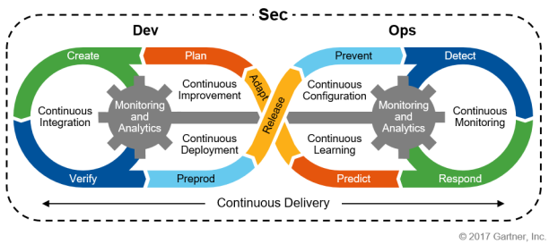

广义上的 DevOps 的建设会包含：人、流程、工具等多方面内容。IT 厂商提供的 DevOps 主要指的是工具层面的落地。本文所讨论的 DevSecOps 也是围绕工具层面的实现。

### DevSecOps 中的安全工具

OpenShift 既可以承载无状态应用，如 Web 类应用；也可以承载有状态应用，如 redis 等。从安全角度看，Web 类应用由于直接对外暴露，显然更容易受到黑客攻击。因此目前在 DevSecOps 引用的安全工具中，大多也是针对于 Web 类应用展开的。

DevSevOps 的 Web 安全工具大体分为静态安全工具和动态应用安全工具。静态安全工具，主要是通过分析或者检查 Web 应用程序源代码的语法、结构、过程、接口等来检查程序的正确性。静态安全工具使我们能在开发阶段（而非应用开发完成后）探测出源码中的安全漏洞，从而大大降低修复安全问题的成本。

相比于静态安全分析工具在开发阶段发现问题，动态应用安全工具则是在 Web 应用运行时模拟黑客攻击，从而无需源代码即可识别安全漏洞，并确定组织的实际风险。

在开源界，静态应用安全工具如 SonaQube，动态应用安全工具如 OWASP（Open Web Application Security Project）都被广泛使用。

在介绍了 DevSecOps 中的静态和动态安全工具后，接下来我们介绍 DevSecOps 在 OpenShift 上的实现。

## DevSecOps 在 OpenShift 上的实现

本小节我们会通过一个基于 OpenShift 的 DevSecOps 模型展示 DevSecOps 实现的方式。

### DevSecOps 在 OpenShift 上实现的模型

OpenShift 通过将安全嵌入到应用开发中来实现 DevSecOps，主要包含以下三部分内容：

CI/CD 的实现：通过 OpenShift Pipeline（OpenShift3 通过 Jenkins 实现，OpenShift4 通过 Teckton 实现）、Source to Image 实现 CI/CD。

内置的安全检查：将安全检查工具部署在 OpenShift 中，并通过 OpenShift Pipeline 串接，安全工具包括：SonarQube、OWASP、OpenSCAP 等。

自动化操作：利用 OpenShift 资深的监控功能，监控并响应不断变化的需求、负载、威胁等。例如当有应用代码提交时，自动触发构建；当应用性能不足时，自动扩展 pod 的实例；当发现安相关的问题时发送告警等。

接下来，我们查看基于 OpenShift 实现 DevSecOps 的模型架构图，如下图 2 所示。

##### 图 2\. DevSecOps 模型架构图

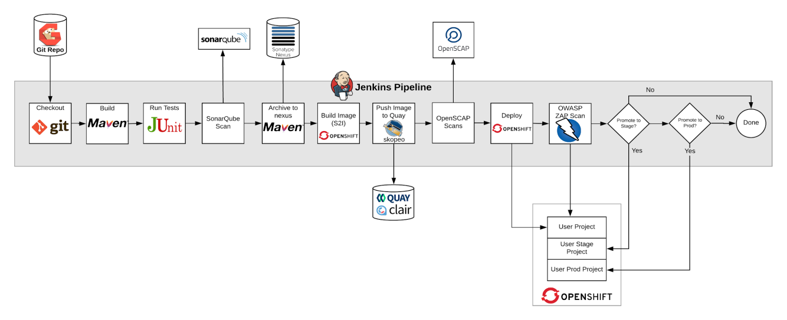

上图所示模型基于 OpenShift 3.11，通过 Jenkins 实现 Pipeline 管理。整个 DevSecOps 包含如下 7 个大的阶段：
1.启动 pipeline 后，首先将从 git 存储库中获取 JavaWeb 应用程序源代码。
2.调用 maven 进行代码构建。
3.调用 JNnit 运行自动化测试。
4.使用 SonarQube 执行静态代码分析扫描，将生成的工件（jar 包）推送到 Nexus 进行存储。
5.通过 OpenShift Source to Image 构建包含应用程序的容器映像，并将其推送到红帽企业级镜像仓库 Quay，以便进行额外的 OpenSCAP 安全扫描。
6.将应用容器镜像部署到 OpenShift，以便 OWASP ZAP 可以扫描该应用程序的 Web 漏洞。
7.根据 OWASP ZAP 扫描的结果，引入人工判断工作流，决定将应用自动部署到 Stage 和 Prod 环境。

在介绍了 DevSecOps 模型的实现架构以后，接下来我们查看 DevSecOps 实现的 OpenShift 环境，并进一步通过实验进行验证。

### OpenShift 实验环境

使用具有集群管理员权限的 admin 用户登录 OpenShift 进行环境确认。这是一套由 4 个节点组成的 OpenShift3.11 集群：包含一个 Master 节点、一个基础架构节点、两个计算节点。

```
[root@bastion 0 ~]# oc get nodes
NAME                       STATUS    ROLES     AGE       VERSION
infranode1.73d6.internal   Ready     infra     17h       v1.11.0+d4cacc0
master1.73d6.internal      Ready     master    17h       v1.11.0+d4cacc0
node1.73d6.internal        Ready     compute   17h       v1.11.0+d4cacc0
node2.73d6.internal        Ready     compute   17h       v1.11.0+d4cacc0

```

Show moreShow more icon

整个 DevSecOps 工具链已经部署到了这套 OpenShift 集群上。ocp-workshop 项目中部署了 gogs、nexus、sonarqube。

```
[root@bastion 0 ~]# oc get pods -n ocp-workshop
NAME                      READY     STATUS             RESTARTS   AGE
gogs-2-4smdz              1/1       Running            5          17h
gogs-postgresql-1-jglw9   1/1       Running            1          17h
nexus-1-d2dnc             1/1       Running            1          11h
postgresql-1-xts2t        1/1       Running            1          16h
sonarqube-1-build         0/1       Completed          0          16h
sonarqube-4-tbjhr         1/1       Running            1          16h

```

Show moreShow more icon

quay-enterprise 项目中部署了企业级镜像仓库 quay 和镜像安全扫描工具 clair。

```
[root@bastion 130 ~]# oc get pods -n quay-enterprise
NAME                                   READY     STATUS    RESTARTS   AGE
clair-postgres-txkl8                   1/1       Running   1          1d
clair-rrfqv                            1/1       Running   0          4h
quay-operator-8c96575c8-bppx8          1/1       Running   1          1d
quayecosystem-quay-b7df7f799-hgmkd     1/1       Running   0          4h
quayecosystem-redis-5db5896699-l6kvm   1/1       Running   1          1d

```

Show moreShow more icon

接下来，我们使用普通用户（user1）登录 OpenShift 集群，模拟一名使用这套基于 OpenShift 的 DevSecOps 环境的技术人员。

使用 user1 登录：

```
[root@bastion 0 ~]# oc whoami
user1

```

Show moreShow more icon

查看 user1 用户所拥有的三个项目：user1-stage 和 user1-prod 两个项目模拟 user1 用户应用的 stage 环境和 prod 环境。初始情况下，这两个项目是空的。

```
[root@bastion 0 ~]# oc projects
You have access to the following projects and can switch between them with 'oc project <projectname>':

* user1
    user1-prod
    user1-stage

Using project "user1" on server "https://master1.73d6.internal:443".

```

Show moreShow more icon

user1 项目中运行了 jenkins pod，用于执行 Pipeline。

```
[root@bastion 0 ~]# oc get pods -n user1
NAME              READY     STATUS    RESTARTS   AGE
jenkins-2-rs9vb   1/1       Running   1          16h

```

Show moreShow more icon

在介绍了 DevSecOps 模型所依赖的 OpenShift 环境后，接下来我们分析 DevSecOps 模型中的核心，即 Jenkins Pipeline。

### DevSecOps Pipeline 分析

登陆 Jenkins，查看名为 user1/user1-ecommerce-pipeline 的 Jenkins Pipeline，如下图 3 所示：

##### 图 3\. Jenkins 查看 Pipeline

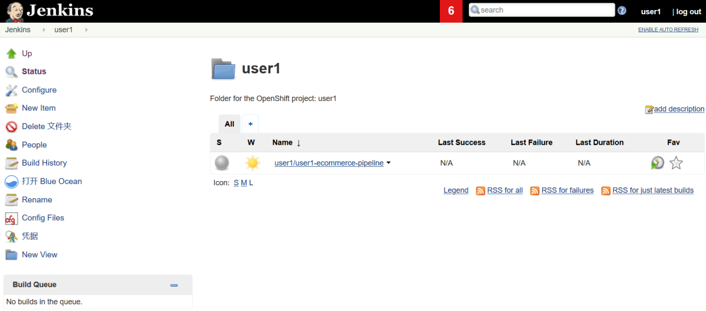

查看 user1/user1-ecommerce-pipeline 的启动参数，指向了在 OpenShift 上部署的 gogs 中的 git，如下图 4 所示：

##### 图 4\. Jenkins Pipeline 启动参数

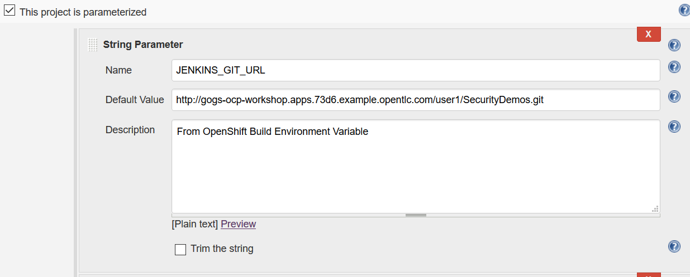

我们访问上图中列的出 gogs 链接，可以看到对应的 git 中包含 Jenkinsfile、Dockerfile 和应用源代码等文件，如下图 5 所示：

##### 图 5\. 查看 gogs 上 git 地址中的内容

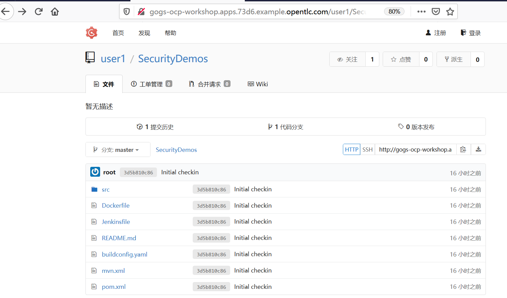

接下来，我们查看 Jenkinsfile 文件的内容，并对 Pipeline 的各个阶段进行分析，一共有 17 个阶段。Jenkinsfile 第一阶段，从 gogs 上的 git 获取内容，如清单 1 所示：

##### 清单 1\. 从 gogs 上获取内容

```
// Jenkinsfile
pipeline {
agent { label 'maven' }

stages {

    stage('Checkout') {
      steps {
       git url: "http://gogs-ocp-workshop.${JENKINS_APP_DOMAIN}/${JENKINS_GOGS_USER}/SecurityDemos.git"
      } // steps
    } // stage

```

Show moreShow more icon

第二阶段，调用 mvn 进行应用源码构建，如清单 2 所示：

##### 清单 2\. 构建应用源码

```
    stage('Build') {
    steps {
         sh "mvn -Dmaven.test.skip=true clean package"
      } // steps
    } // stage

```

Show moreShow more icon

第三阶段，调用 junit 进行单元测试，如清单 3 所示：

##### 清单 3\. 进行单元测试

```
    stage('Run tests') {
    steps {
         sh "mvn test"
         junit 'target/surefire-reports/*.xml'
      } // steps

    } // stage

```

Show moreShow more icon

第四阶段，调用 SonarQube 进行静态代码分析。从下面代码可以看出，是通过 mvn 指向了 sonarqube 在 OpenShift 中的 ServiceName，如清单 4 所示：

##### 清单 4\. SonarQube 进行静态代码分析

```
    stage('SonarQube Scan') {
      steps {
        sh "mvn sonar:sonar -Dsonar.host.url=http://sonarqube.ocp-workshop.svc:9000 -Dsonar.projectkey=${JENKINS_GOGS_USER}-ecommerce -Dsonar.projectName=\"${JENKINS_GOGS_USER} E-Commerce Project\""
      } // steps
    } // stage

```

Show moreShow more icon

第五阶段，将通过了静态分析的 jar 包推送到 nexus 中，如清单 5 所示：

##### 清单 5\. 推送 jar 包推送到 nexus 中

```
    stage('Archive to nexus') {
      steps {
        sh "mvn --settings mvn.xml deploy -Dmaven.test.skip=true"
      } // steps
    } // stage

```

Show moreShow more icon

第六阶段，将 jar 包以 Binary to Image 的方式注入到 docker image 中（openjdk），即生成应用容器镜像，如清单 6 所示：

##### 清单 6\. 生成应用容器镜像

```
    stage('Build Image') {
      steps {
        sh "oc new-build --name ecommerce --strategy=docker --binary || true"
        sh "mkdir deploy || true"
        sh "cp target/spring-boot-angular-ecommerce-0.0.1-SNAPSHOT.jar deploy"
        sh "cp Dockerfile deploy"
        sh "oc start-build ecommerce --from-dir=deploy --follow --wait"
      } // steps
    } // stage

```

Show moreShow more icon

第七阶段，应用容器镜像推送到 quay 中，如清单 7 所示：

##### 清单 7\. 推送应用源码至 quay

```
    stage('Push Image to Quay') {
      agent { label 'image-management' }
      steps {
        sh "oc login -u ${JENKINS_GOGS_USER} -p r3dh4t1! --insecure-skip-tls-verify ${JENKINS_OCP_API_ENDPOINT}"
        sh 'skopeo --debug copy --src-creds="$(oc whoami)":"$(oc whoami -t)" --src-tls-verify=false --dest-tls-verify=false' + " --dest-creds=admin:admin123 docker://${JENKINS_INTERNAL_REGISTRY}/${JENKINS_GOGS_USER}/ecommerce:latest docker://quay-secure-quay-enterprise.${JENKINS_APP_DOMAIN}/admin/ecommerce:${JENKINS_GOGS_USER} || true"
      } // steps
    } //stage

```

Show moreShow more icon

第八阶段，对应用容器镜像进行漏洞扫描，如清单 8 所示：

##### 清单 8\. 对应用容器镜像进行安全扫描

```
    stage('OpenSCAP Scans') {
      agent { label 'master' }
      steps {

      script {
         def remote = [:]
         remote.name = "bastion"
         //remote.host = "bastion.${JENKINS_GUID}.openshiftworkshop.com"
         remote.host = "${JENKINS_BASTION}"
         remote.allowAnyHosts = true
         remote.user="${JENKINS_GOGS_USER}"
         remote.password="${JENKINS_SSH_PASSWORD}"

         sshCommand remote: remote, command: "oc login -u ${JENKINS_GOGS_USER} -p r3dh4t1! --insecure-skip-tls-verify ${JENKINS_OCP_API_ENDPOINT}"
         sshCommand remote: remote, command: "docker login -u ${JENKINS_GOGS_USER} -p " + '"$(oc whoami -t)"' + " ${JENKINS_INTERNAL_REGISTRY}"
         sshCommand remote: remote, command: "docker pull ${JENKINS_INTERNAL_REGISTRY}/${JENKINS_GOGS_USER}/ecommerce:latest"
         sshCommand remote: remote, command: "sudo oscap-docker image ${JENKINS_INTERNAL_REGISTRY}/${JENKINS_GOGS_USER}/ecommerce:latest xccdf eval --profile xccdf_org.ssgproject.content_profile_stig-rhel7-disa --report report.html /usr/share/xml/scap/ssg/content/ssg-rhel7-ds.xml"
         sshCommand remote: remote, command: "sudo oscap-docker image-cve ${JENKINS_INTERNAL_REGISTRY}/${JENKINS_GOGS_USER}/ecommerce:latest --report report-cve.html"
         sshGet remote: remote, from: "/home/${JENKINS_GOGS_USER}/report.html", into: 'openscap-compliance-report.html', override: true
         sshGet remote: remote, from: "/home/${JENKINS_GOGS_USER}/report-cve.html", into: 'openscap-cve-report.html', override: true
         publishHTML([alwaysLinkToLastBuild: false, keepAll: false, reportDir: './', reportFiles: 'openscap-compliance-report.html', reportName: 'OpenSCAP Compliance Report', reportTitles: 'OpenSCAP Compliance Report'])
         publishHTML([alwaysLinkToLastBuild: false, keepAll: false, reportDir: './', reportFiles: 'openscap-cve-report.html', reportName: 'OpenSCAP Vulnerability Report', reportTitles: 'OpenSCAP Vulnerability Report'])
         archiveArtifacts 'openscap-compliance-report.html,openscap-cve-report.html'
        } // script
      } // steps
    } // stage

```

Show moreShow more icon

第九阶段，在 user1 项目中部署应用容器镜像，如清单 9 所示：

##### 清单 9\. 部署应用容器镜像

```
    stage('Deploy') {
      steps {
        sh "oc new-app ecommerce || true"
        sh "oc set env dc/ecommerce JAVA_ARGS=/deployments/root.jar"
        sh "oc expose svc/ecommerce || true"
        sh "oc rollout status dc/ecommerce"
      } // steps
    } // stage

```

Show moreShow more icon

第十阶段，通过 OWASP ZAP 对应用进行动态扫描，访问的是 user1 项目中应用的 ServiceIP，如清单 10 所示：

##### 清单 10\. 对应用进行动态安全扫描

```
    stage('OWASP ZAP Scan') {
      agent { label 'zap' }
      steps {
        script {
          sh "/zap/zap-baseline.py -r owasp-zap-baseline.html -t http://ecommerce.${JENKINS_GOGS_USER}.svc:8080/ -t http://ecommerce.${JENKINS_GOGS_USER}.svc:8080/api/products -t http://ecommerce.${JENKINS_GOGS_USER}.svc:8080/api/orders || true"
          sh "cp /zap/wrk/owasp-zap-baseline.html ."
          publishHTML([alwaysLinkToLastBuild: false, keepAll: false, reportDir: './', reportFiles: 'owasp-zap-baseline.html', reportName: 'OWASP ZAP Baseline Report', reportTitles: ''])
          archiveArtifacts 'owasp-zap-baseline.html'
        } // script
      } // steps
    } // stage

```

Show moreShow more icon

第十一阶段，为应用的 Stage 项目，包括创建 ImageStream、创建 DeploymentConfig、创建应用的路由，但不执行应用部署，如清单 11 所示：

##### 清单 11\. 配置 Stage 项目

```
    stage('Configure Stage Project') {
      steps {
        script {
          sh "set +x ; oc login -u ${JENKINS_GOGS_USER} -p ${JENKINS_SSH_PASSWORD} --insecure-skip-tls-verify https://kubernetes.default.svc"
          sh "oc create is ecommerce -n ${JENKINS_GOGS_USER}-stage || true"
          sh "oc new-app ecommerce --image-stream=ecommerce --allow-missing-images --allow-missing-imagestream-tags -n ${JENKINS_GOGS_USER}-stage || true"
          sh "oc expose dc/ecommerce -n ${JENKINS_GOGS_USER}-stage || true"
          sh "oc expose dc/ecommerce --port 8080 -n ${JENKINS_GOGS_USER}-stage || true"
          sh "oc expose svc/ecommerce -n ${JENKINS_GOGS_USER}-stage || true"
        } // script
      }// steps
    } // stage

```

Show moreShow more icon

第十二阶段，引入审批流，询问是否批准在 Stage 环境中部署应用，如果批准的话，触发 DeploymentConfig 部署应用，如清单 12 所示：

##### 清单 12\. 在 Stage 项目中部署应用

```
    stage('Promote to Stage?') {
      steps {
        timeout(time: 7, unit: 'DAYS') {
          input message: "Do you want to deploy to ${JENKINS_GOGS_USER}-stage?"
        } // timeout
        sh "oc tag ${JENKINS_GOGS_USER}/ecommerce:latest ${JENKINS_GOGS_USER}-stage/ecommerce:latest"
        sh "oc rollout status dc/ecommerce -n ${JENKINS_GOGS_USER}-stage"
      } // steps
} // stage

```

Show moreShow more icon

第十三阶段，为应用的 Prod 项目：创建 ImageStream、创建 DeploymentConfig、创建应用的路由，但不执行应用部署，如清单 13 所示：

##### 清单 13\. 配置 Prod 项目

```
    stage('Configure Prod Project') {
      steps {
        script {
          sh "set +x ; oc login -u ${JENKINS_GOGS_USER} -p ${JENKINS_SSH_PASSWORD} --insecure-skip-tls-verify https://kubernetes.default.svc"
          sh "oc create is ecommerce -n ${JENKINS_GOGS_USER}-prod || true"
          sh "oc new-app ecommerce --image-stream=ecommerce --allow-missing-images --allow-missing-imagestream-tags -n ${JENKINS_GOGS_USER}-prod || true"
          sh "oc expose dc/ecommerce -n ${JENKINS_GOGS_USER}-prod || true"
          sh "oc expose dc/ecommerce --port 8080 -n ${JENKINS_GOGS_USER}-prod || true"
          sh "oc expose svc/ecommerce -n ${JENKINS_GOGS_USER}-prod || true"
        } // script
      }// steps
    } // stage

```

Show moreShow more icon

第十四阶段，引入审批流，询问是否批准在 Prod 环境中部署应用，如果批准的话，触发 DeploymentConfig 部署应用，如清单 14 所示：

##### 清单 14\. 在 Prod 项目中部署应用

```
    stage('Promote to Prod?') {
      steps {
        timeout(time: 7, unit: 'DAYS') {
          input message: "Do you want to deploy to ${JENKINS_GOGS_USER}-prod?"
        } // timeout
        sh "oc tag ${JENKINS_GOGS_USER}-stage/ecommerce:latest ${JENKINS_GOGS_USER}-prod/ecommerce:latest"
        sh "oc rollout status dc/ecommerce -n ${JENKINS_GOGS_USER}-prod"
      } // steps
    } // stage

} // stages

} // pipeline

```

Show moreShow more icon

在分析了 DevSecOps 的 Pipeline 后，接下来我们执行 Pipeline 观察效果。

### 执行 DevSecOps Pipeline

在 Jenkins 界面中启动 Pipeline，如下图 6 所示：

##### 图 6\. 启动 Jenkins Pipeline

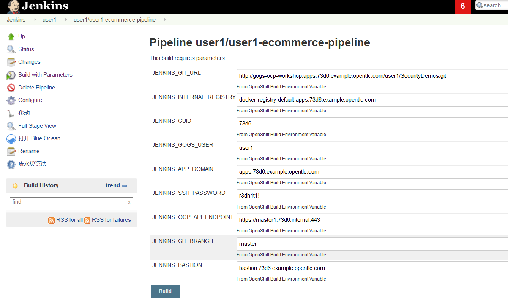

启动 Pipeline 后，然后通过 Jenkins Blue Ocean 界面进行观测，如下图 7 所示：

##### 图 7\. 切换到 Jenkins Blue Ocean 界面

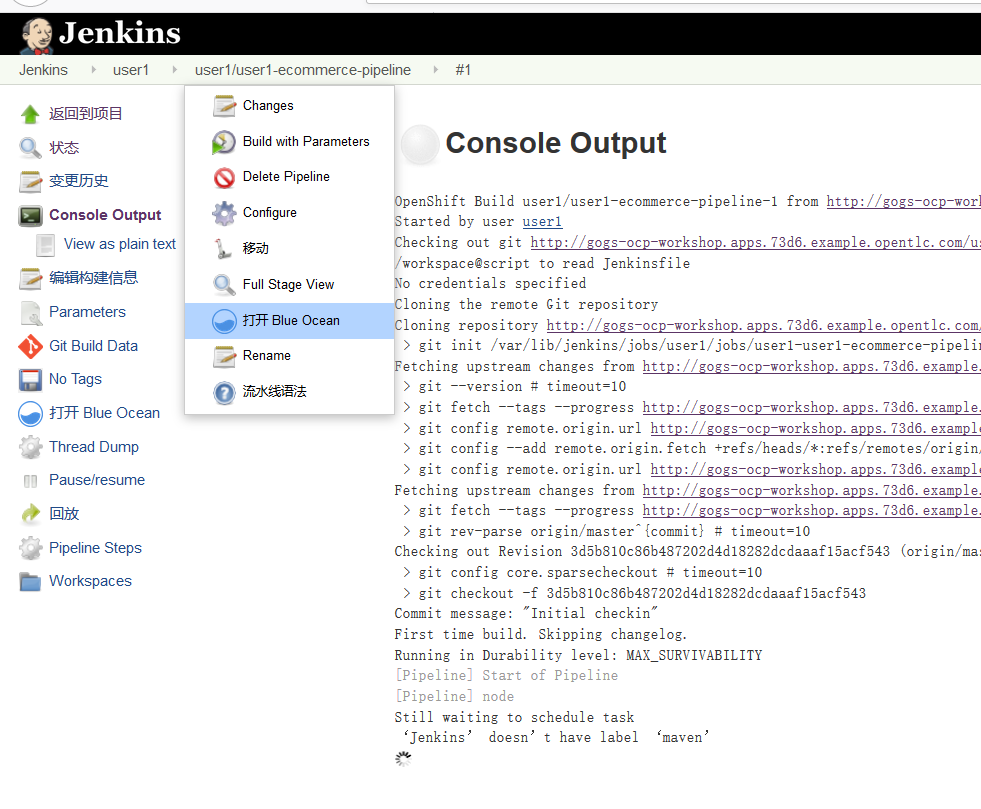

在 Jenkins Blue Ocean 界面观测 Pipeline 的执行。在执行到“Promote to Stage”时，引入人工审批，如下图 8 所示：

##### 图 8\. Pipeline 引入人工审批

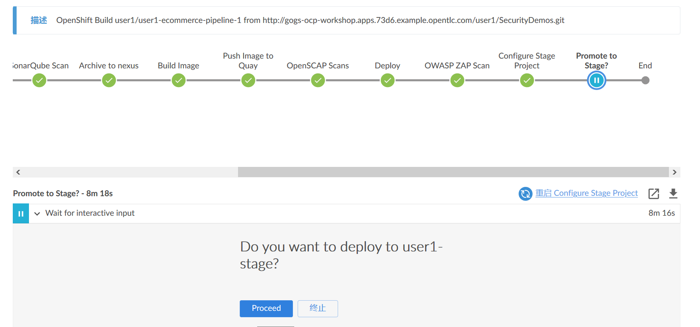

此时，我可以根据动态扫描和静态扫描的报告来做决策。在 Jenkins Blue Ocean 界面点击制品，如图 9 所示，可以看到生成的三个检查报告和 pipeline.log。三个检查结果分别是 OpenSCAP 扫描结果和 OWASP ZAP 动态扫描结果。

##### 图 9\. 查看 Pipeline 执行过程中生成的制品

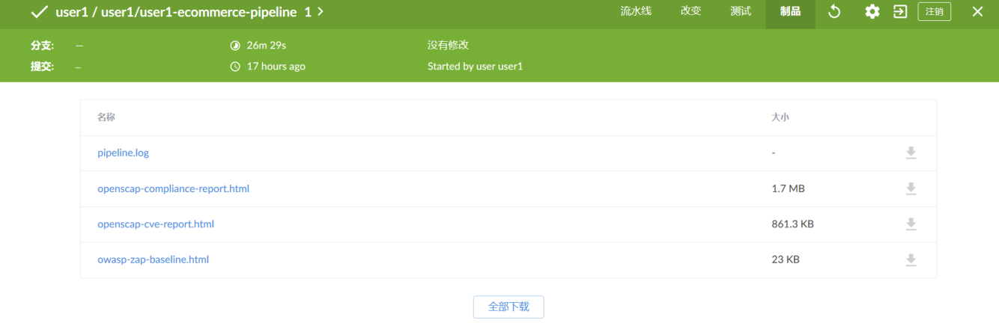

为了判断是否批准 Pipeline 继续执行，我们查看 openscap-compliance-report.html (`https://jenkins-user1.apps.73d6.example.opentlc.com/job/user1/job/user1-user1-ecommerce-pipeline/1/artifact/openscap-compliance-report.html`)，分析应用容器镜像的漏洞扫描结果。从下图中 10 可以看出，检查通过了 34 项、失败了 35 项：

##### 图 10\. 查看 openscap-compliance-report.html

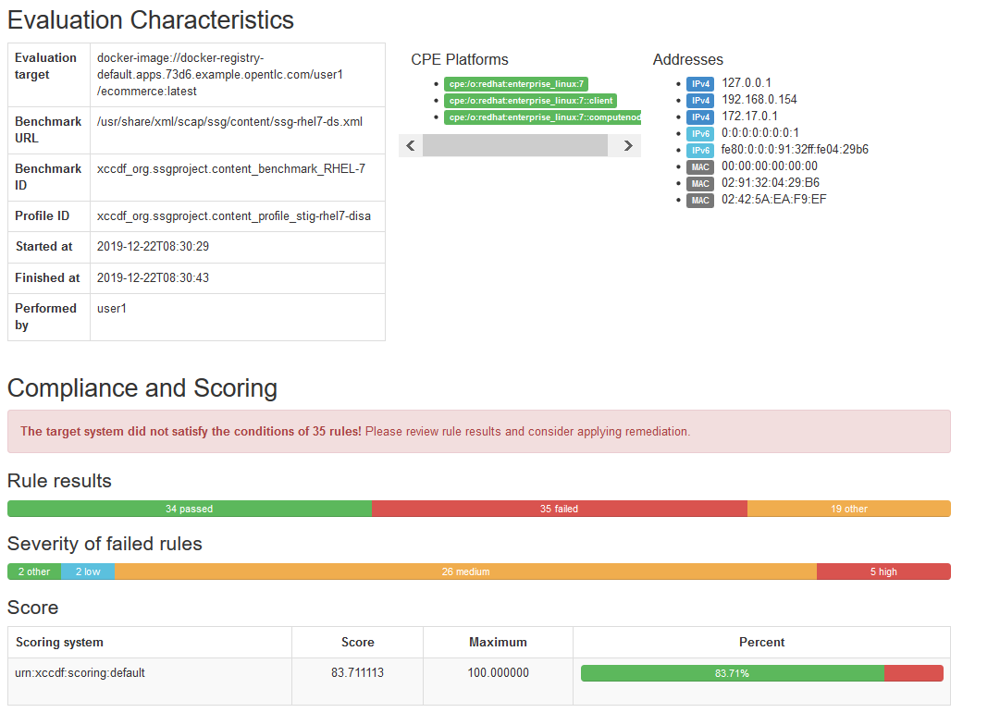

查看 openscap-cve-report.html (`https://jenkins-user1.apps.73d6.example.opentlc.com/job/user1/job/user1-user1-ecommerce-pipeline/1/artifact/openscap-cve-report.html`) 报告中对应用容器镜像的 CVE 扫描结果，如下图 11 所示：

##### 图 11\. 查看 openscap-compliance-report.html

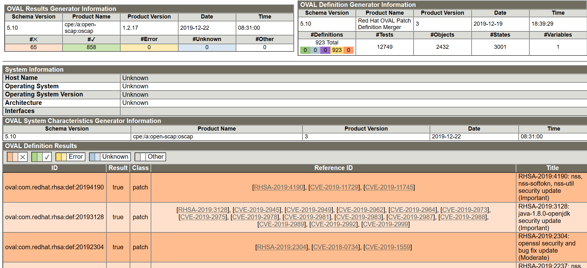

查看 owasp-zap-baseline.html (`https://jenkins-user1.apps.73d6.example.opentlc.com/job/user1/job/user1-user1-ecommerce-pipeline/1/artifact/owasp-zap-baseline.html`) 报告中应用动态安全扫描的结果。我们可以看到不同风险级别对应的数量，中等级别的有两个、低级别的告警有两个，如下图 12 所示：

##### 图 12\. 查看 owasp-zap-baseline.html 报告

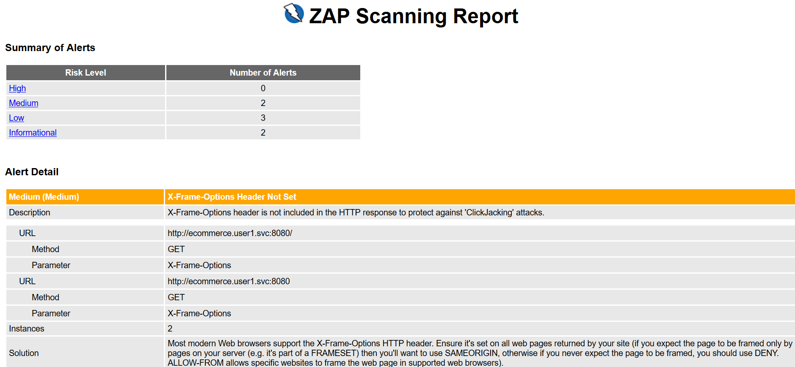

查看 owasp 报告中（`https://jenkins-user1.apps.73d6.example.opentlc.com/job/user1/job/user1-user1-ecommerce-pipeline/1/artifact/owasp-zap-baseline.html`）一个 Medium 级别的问题，如下图 13 所示，这都属于较为常见的 Web 安全问题：

##### 图 13\. 查看一个中等级别的安全漏洞

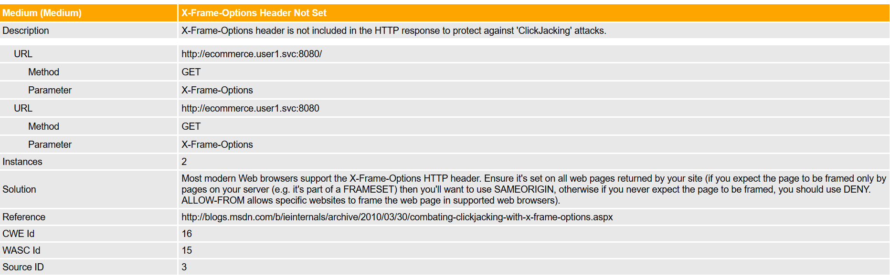

在分析了动态扫描结果和 OpenSCAP 扫描结果后，接下来我们查看静态代码扫描结果。登陆 SonarQube ，我们可以看到应用扫描发现 3 个漏洞、11 个 Code Smells、单元测试代码的覆盖率为 56.9%等信息，如下图 14 所示：

##### 图 14\. 查看代码静态扫描结果

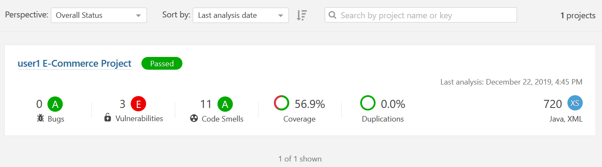

我们检查 3 个漏洞的具体描述，如下图 15 所示：

##### 图 15\. 查看三个漏洞的描述

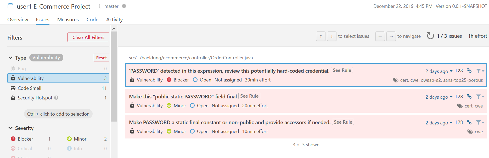

查看扫描结果中 11 个 code smell 的具体内容，如下图 16 所示：

##### 图 16\. 查看 11 个 code smell 的具体内容

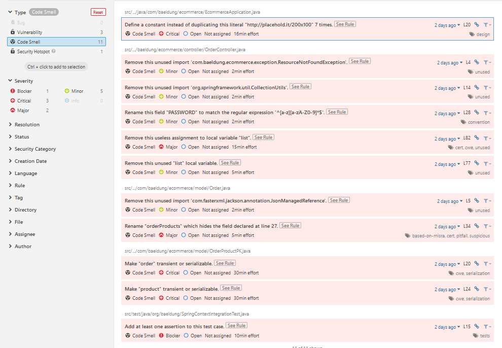

在查看了动态扫描、OpenSCAP 扫描和静态代码扫描后，如果能符合我们的要求，可以分别批准将应用部署到 Stage 和 Prod。

我们批准应用在 Stage 和 Pod 环境部署，然后可以看到 user1-stage 和 user1-prod 项目中会部署应用。

```
[root@bastion 0 ~]# oc get pods -n user1-stage
NAME                  READY     STATUS    RESTARTS   AGE
ecommerce-1-1-l47rq   1/1       Running   0          3m
ecommerce-1-bllkf     1/1       Running   0          3m

[root@bastion 0 ~]# oc get pods -n user1-prod
NAME                  READY     STATUS    RESTARTS   AGE
ecommerce-1-1-b9h9x   1/1       Running   0          3m
ecommerce-1-9w5lf     1/1       Running   0          3m

```

Show moreShow more icon

通过浏览器可以分别访问两个项目中的应用路由，可以正常访问，如下图 17 所示：

##### 图 17\. 浏览器访问部署好的应用

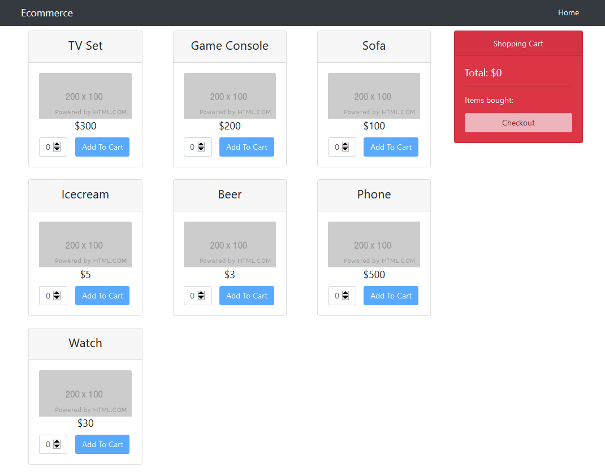

至此，我们完成了 DevSecOps Pipeline 的展示和分析。

## 结束语

通过本文，相信读者对基于 OpenShift 实现 DevSecOps 有了一定的了解。随着 DevOps 的普及，越来越多的客户会将安全治理嵌入到 DevOps 中，通过 DevSecOps 的方式，解决快速创新和安全合规之间的冲突。

## 参考资源

[DevSecOps 工具链](https://github.com/zemmali/DevSecOps-Toolchain/blob/master/DevSecOps-Toolchain.jpeg)