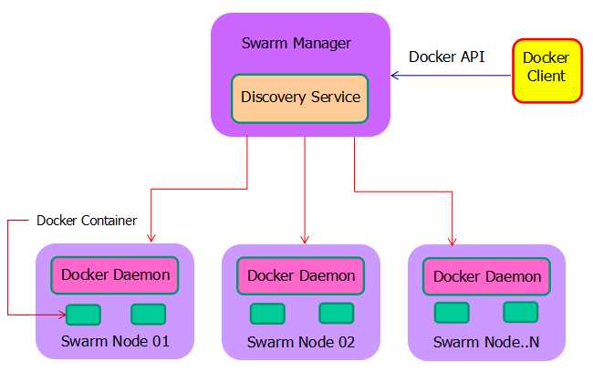
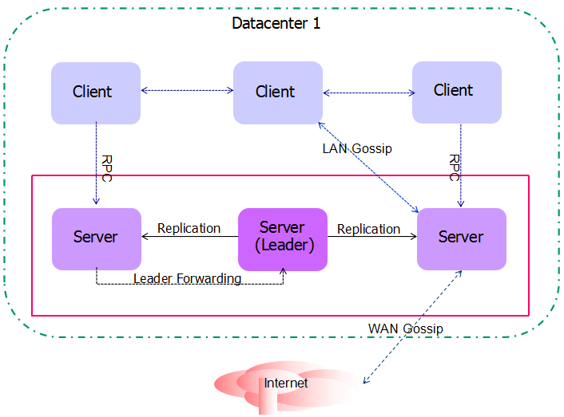
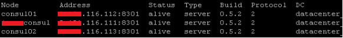
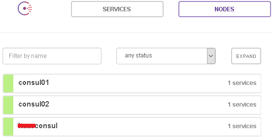
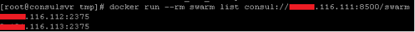
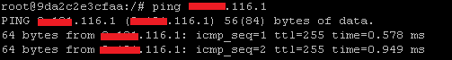
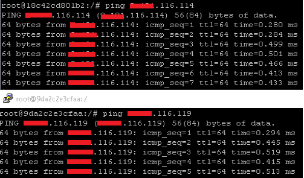

# Docker 集群环境实现的新方式
通过 Docker Swarm 和 Consul 配置集群并实现各主机上 Docker 容器的互通

**标签:** 容器

[原文链接](https://developer.ibm.com/zh/articles/os-cn-docker-swarm/)

谷铁柏

发布: 2016-12-07

* * *

近几年来，Docker 作为一个开源的应用容器引擎，深受广大开发者的欢迎。随着 Docker 生态圈的不断建设，应用领域越来越广。云计算，大数据，移动技术的快速发展，加之企业业务需求的不断变化，紧随技术更新的步伐，导致企业架构要随时更改以适合业务需求。当前，越来越多的公司都已将以 Docker 为代表的容器技术用于企业级业务平台，比如：腾讯，京东，美团，新浪，阿里巴巴等互联网公司。数据的安全、Docker 容器的稳定运行是众多用户关注的，这就要求我们提供一套行之有效的管理大型容器集群的整体解决方案。为努力实现提供完整的容器技术服务栈及 Docker 化应用开发运维平台给用户的目标。在本文样例中，笔者使用 Docker 公司发布的 Docker Swarm 集群管理工具以及相关的第三方工具作为整个应用开发运维的基础架构。

## 引言

本文中介绍的架构，是为了实现多个 CentOS 7 主机上 Docker 集群的部署。该架构使用三个工具，分别是 Docker Swarm, consul 和 pipework。

- 采用 Docker Swarm，主要因为这是 Docker 公司发布的集群管理工具，兼容性和稳定性相比其他公司的 Docker 集群管理工具更出色一些。
- 实现集群内各节点之间服务发现的方式有多种，包括 etcd,consul 和 zookeeper 等。本文的架构采用的是 consul 方式。相比其他工具，consul 提供 web 管理端且其采用的算法更能保证服务的高可用性。
- Docker 容器的 IP 是由 Docker 自带的默认路由通过 DHCP 自动分配，在实现 Docker 容器固定 IP 配置的第三方工具中，开源工具 pipework 简单易用，稳定性优于 weave，更适合当前的网络环境。

接下来，我们分别介绍这三种工具，首先介绍 Docker Swarm 的概念和工作机制。

## Docker Swarm 的基本概念和原理

### Docker Swarm 简介

Swarm 是 Docker 公司在 2014 年 12 月初发布的一套用来管理 Docker 集群的工具，将多个 Docker 宿主机变成一个单一的虚拟的主机。Swarm 使用标准的 Docker API 接口作为其前端访问入口，与 Docker Client 直接通信。

### Docker Swarm 工作原理

Docker 客户端通过 Docker API 向 Swarm 管理端发送请求，Swarm Manager 通过守护进程调用集群中的某个节点来执行任务。因为容器都是运行在节点上，Swarm 作为一个独立的集群管理工具，故并不会因某些原因导致不能正常工作而影响集群内所有节点的正常运行。当服务恢复正常后，Swarm 会读取日志来执行集群的恢复动作。架构图如图 1：

##### 图 1.Docker Swarm 架构图



架构说明：

- Docker Client 是用户端
- Swarm Manager 作为管理程序运行在一台 CentOS 7 管理节点上，这个节点在 Swarm 集群中承担 leader 角色。
- Swarm Node 01，02，N 是 Swarm 集群的其他成员，和 Swarm Manager 管理节点一起组成完整的 Swarm 集群，每一个节点都会运行 Swarm 容器。
- Docker Daemon 是运行于每一个成员内的守护进程，承担着调度器和路由器的功能。
- Discovery service 提供服务发现功能。

通过本章大家了解了什么是 Docker Swarm 及其工作原理，下一章将简要介绍用于提供服务发现功能的工具 consul。

## 服务发现工具 Consul

Consul 是一个分布式，高可用，支持多数据中心的服务发现和配置共享的服务管理软件，能够与 Docker 容器无缝配合。

### Consul 工具的优势

1. 一致性协议采用 Raft 算法，用来保证服务的高可用。

2. 支持 Health Checking 和 http 和 dns 协议接口。健康检查是 Consul 提供的一项主要功能，根据配置定时调用外部程序执行有效性检查，返回状态有三种：正常，告警和失败。Consul 提供两种发现服务的方式，一种是通过 HTTP API 查看存在哪些服务，另外一种是通过 consul agent 内置的 DNS 服务来完成。两者的差别在于后者可以根据服务检查的实时状态动态调整可用的服务节点列表。

3. 支持 Multi DataCenter，每一个数据中心（集群）是由 3-5 个 server 节点和若干 client 节点组成，集群内 Client 和 Server 节点之间是通过 LAN gossip（下一节会有介绍）通信，整个集群内部通信端口必须全部相同，默认是 7000。数据中心（集群）彼此间的通信则是通过 WAN gossip，使用的通信端口和集群内的通信端口不要一致，从而实现了内外网的服务采用不同的端口进行监听，进而可以避免单数据中心的单点故障。

4. 提供 web 管理界面，更加直观。


### Consul 的架构

笔者根据项目实际需求重新绘制了架构图，如图 2：

##### 图 2.Consul 架构



本架构采用单数据中心集群方式，由三个 Server 节点组成。

说明：

1. DataCenter 的所有节点都通过 Gossip 协议(常用于 P2P 的通信协议)，种子节点（当一个节点启动的时候，它会从配置文件中读取配置信息，这样它就知道它属于哪个集群，它需要跟哪个节点通信以获取其他节点信息,这个通信节点称为种子节点。）每秒都会随机向其他节点发送自己所拥有的节点列表，以及需要传播的消息。任何新加入的节点，就在这种传播方式下很快地被全网所知道。实现彼此之间的通信。Client 到 Server 是通过 LAN Gossip，而 DataCenter 之间的通信和服务请求则通过 WAN Gossip 来随机请求另外一个 DataCenter 的 Server 节点，这个节点获取请求后再 forward 到本 DataCenter 的 leader 节点上。

2. Server leader 的选举是通过 Consul 的 Raft 算法实现，Leader 节点需要负责所有请求和处理，并复制给所有其他的 Server 节点。反之，非 Leader 节点接收到 RPC (Remote Procedure Call Protocol)请求的时候也会 forward 到 leader 节点。


本章主要讲述 consul 的特点和工作机制，接下来将通过实例让大家学会使用 consul 工具。

## 如何使用 Consul 实现 Docker Swarm 集群的搭建

本章将详细讲述使用 Consul 实现 Docker Swarm 集群配置的完整过程。整个过程主要包括三个部分，首先要准备必要的资源，其次创建提供服务的 consul 集群，最后创建 Docker swarm 集群。

### 配置搭建环境

1. 准备 3 台 CentOS 7.0 系统
2. 安装 Docker 1.8.1
3. 编辑 /etc/sysconfig/docker 文件添加如下参数值：


    ```
    other_args="-H=unix:///var/run/docker.sock-H=0.0.0.0:2375"
    #(2375 为 docker deamon 的监听端口)

    ```


    Show moreShow more icon

4. 下载 swarm 镜像，consul 安装包和提供 consul UI 界面的 dist 包


为了让大家更直观的了解本环境，特用表格展现所用主机信息及其在集群中扮演的角色和运行模式，表 1 如下所示：

##### 表 1.节点角色定义表格

主机名IP集群角色Agent 模式consulsvr192.168.116.111Server leaderserverconsul01192.168.116.112Serverserverconsul02192.168.116.113Serverserver

### 配置 consul 集群

1. 在表 1 定义的三台主机上分别安装 consul 和 dist


    ```
    #unzip 0.5.2_linux_amd64.zip

    ```


    Show moreShow more icon

    命令解释：解压缩 consul 安装包


    ```
    #cp consul /usr/local/bin

    ```


    Show moreShow more icon

    命令解释：把 consul 执行文件拷贝到/usr/local/bin 下，这个路径已经添加到系统环境变量中，便于用户在任何路径下都可直接执行 consul 文件。


    ```
    #unzip 0.5.2_web_ui.zip

    ```


    Show moreShow more icon

    命令解释：解压缩提供 web 界面的安装包

2. 在表 1 定义的集群角色 Server leader 节点上运行


    ```
    #consul agent -server -bootstrap -data-dir /home/data_consul -client 0.0.0.0 -bind=192.168.116.111 -ui-dir /home/dist -node=consulsvr -dc=datacenter &

    ```


    Show moreShow more icon

    命令解释：定义节点 consulsvr 的 agent 运行在 server 模式；参数”-bootstrap”表示在 datacenter 中只能有一个 server 处于 bootstrap 模式并使自己成为 leader 角色；参数”-data-dir”表示提供一个目录用来存放 agent 的状态；参数”client”表示 consul 绑定在哪个 client 地址上，这个地址提供 HTTP、DNS 等服务，值”0.0.0.0″表示 client 地址不明确，表示的是一个本机的路由表里没有特定条目指明地址的集合；参数”-bind”表示该地址用来在集群内部的通讯，集群内的所有节点到地址都必须是可达的，这里定义的 192.168.116.111 是主机 consulsvr 的 IP 地址；参数”-ui-dir”表示提供存放 web ui 资源的路径，该目录必须是可读的；参数”-node”表示节点在集群中的名称，在一个集群中必须是唯一的，默认是该节点的主机名；参数”-dc”表示 datacenter 的名称。

3. 在表 1 定义的其他 Server 节点上分别运行


    ```
    #consul agent -server -data-dir /home/data_consul -client 0.0.0.0 -bind=192.168.116.112 -ui-dir /home/dist -node=consul01 -dc=datacenter &

    ```


    Show moreShow more icon

    命令解释：用法同上，需要注意的就是不使用参数”-bootstrap”，”-bind”绑定的地址是表 1 定义的节点 consul01 的 IP 地址，参数”-node”定义的节点主机名是 consul01。


    ```
    #consul agent -server -data-dir /home/data_consul -client 0.0.0.0 -bind=192.168.116.113 -ui-dir /home/dist -node=consul02 -dc=datacenter &

    ```


    Show moreShow more icon

4. 添加成员到 consul 集群


    ```
    #consul join 192.168.116.112 192.168.116.113

    ```


    Show moreShow more icon

    命令解释：把表 1 定义的节点主机名 consul01 和 consul02 添加到 consul 集群中。

5. 验证配置 consul 集群是否成功的三种方式

    a. #consul members

    

    结果说明：Status 值为 alive 表明节点健康，三个节点状态都是 alive 表明集群运行正常。

    b. #curl 192.168.116.111:8500/v1/catalog/nodes

    

    结果说明：这条命令的目的是查看当前集群的所有成员，结果表明三个成员都在集群内。

    c. 在浏览器输入 `http://192.168.116.111:8500`

    

    结果说明：通过 web ui 界面查看 consul 集群成员信息，如图所示表 1 定义的三个成员都已列出，图标为绿色表明节点健康，集群正常运行。


### 配置 swarm 集群

1. 在 Consul server leader 节点上运行


    ```
    #docker run -d -p 2377:2375 swarm manage consul://192.168.116.111:8500/swarm

    ```


    Show moreShow more icon

    命令说明：主节点启动 swarm manage；参数”-p 2377:2375″表示将用于监听 docker 守护进程的端口 2375 映射到本机的 2377 端口（请确保 2377 端口未被使用）；”swarm”是本地 Docker swarm 镜像；参数”manage”表示定义当前主机 consulsvr 为集群的主节点；参数”consul://192.168.116.111:8500/swarm”表示 consul 服务的地址。

2. 在其他节点上分别运行


    ```
    #docker run -d swarm join --advertise=192.168.116.112:2375 consul://192.168.116.111:8500/swarm

    ```


    Show moreShow more icon

    命令说明：将表 1 定义的主机 consul01 添加到新创建的 swarm 集群内；参数”-advertise”定义的是主机 consul01 对外的 IP 地址，其他参数说明同上。


    ```
    #docker run -d swarm join --advertise=192.168.116.113:2375 consul://192.168.116.111:8500/swarm

    ```


    Show moreShow more icon

3. 验证配置 swarm 集群是否成功


    ```
    #docker run --rm swarm list consul://192.168.116.111:8500/swarm

    ```


    Show moreShow more icon

    

    结果说明：查看所添加的成员 192.168.116.112 和 192.168.116.113 都集群内，唯一要特殊说明的是参数”rm”表示 Docker 在容器结束时自动清理其所产生的数据。因我们仅仅是为了检查 swarm 集群状态，对于短暂运行的容器可不保存数据。


通过本章，我们初步掌握了 consul 工具的使用方法，使得 Docker Swarm 集群的搭建又多了一个解决方案。那么如何实现不同主机间 Docker 容器的互通呢？第三方工具 pipework 可以帮我们实现这一需求，下一章将首先介绍 pipework 的工作原理。

## pipework 工作原理

pipework 是由 Docker 的工程师开发的一个 Docker 网络配置工具，由 200 多行 shell 实现，方便易用，本章将简要阐述其工作原理。

1. 首先，使用 pipework 检查 Linux 系统是否存在网桥，若不存在，则创建以”br”开头的新网桥。

2. 创建 veth pair 设备，实现 Docker 容器和网桥之间的连接。

3. 使用 docker inspect 找到容器在主机中的 PID，然后通过 PID 创建容器网络命名空间的软连接。

4. 将创建的 veth pair 设备分别加到 Docker 容器和网桥中。在容器中的名称默认为 eth1，可通过 pipework 的-i 参数修改该其名称。

5. 最后配置新网卡 eth1 的 IP 和路由。这样容器通往外网的流量会经由新配置的 eth1 出去，而不是通过 eth0 和 docker0。


在了解了 pipework 如何工作后，我们通过实例来体现 pipework 在 Docker 容器网络配置上的作用。

## 通过实例实现 Docker 容器固定 IP 的分配

本章通过实例演示如何在 CentOS 7 上使用 [pipework](https://github.com/jpetazzo/pipework) 开源工具为 Docker 容器配置固定 IP 地址，从而实现不同主机之间的 Docker 容器互通，也能够满足部分用户通过容器的 IP 地址直接访问容器。

1. 在表 1 定义的主机 consul01 节点上创建网桥


    ```
    #vi /etc/sysconfig/network-scripts/ifcfg-br0

    ```


    Show moreShow more icon

    命令说明：编辑 CentOS 7 的网络配置文件，新网桥名字是”br0″。


    ```
    TYPE="Bridge"
    BOOTPROTO="static"
    IPADDR="192.168.116.111"
    GATEWAY="192.168.116.1"
    PREFIX="24"
    NAME="br0"
    DEVICE="br0"
    ONBOOT="yes"
    DNS1="192.168.148.50"
    DOMAIN="cn.com"

    ```


    Show moreShow more icon

2. 设置原网卡桥接到新创建的网桥


    ```
    #vi /etc/sysconfig/network-scripts/ifcfg-ens32

    ```


    Show moreShow more icon

    命令说明：文件 ifcfg-ens32 是 CentOS 7 的物理网卡配置文件，ens32 是网卡名字。


    ```
    TYPE="Bridge"
    BOOTPROTO="static"
    IPADDR="192.168.116.111"
    GATEWAY="192.168.116.1"
    PREFIX="24"
    NAME="br0"
    DEVICE="br0"
    ONBOOT="yes"
    DNS1="192.168.148.50"
    DOMAIN="cn.com"

    ```


    Show moreShow more icon

3. 安装 pipework


    ```
    #git clone https://github.com/jpetazzo/pipework

    ```


    Show moreShow more icon

    命令说明：从 github 上获取安装包


    ```
    #cp ~/pipework/pipework /usr/local/bin/

    ```


    Show moreShow more icon

    命令说明：把 pipework 执行文件拷贝到/usr/local/bin 下，这个路径已经添加到系统环境变量中，便于用户在任何路径下都可直接执行 pipework 文件。

4. 启动容器


    ```
    #docker run -itd --name ubuntu114 ubuntu /bin/bash

    ```


    Show moreShow more icon

    命令说明：创建一个新的 Docker 容器，名字是 ubuntu114，参数”-it”表示需要同容器进行数据交互，参数”/bin/bash”表示进行交互式操作的 shell 类型。

5. 配置固定 IP 地址为 192.168.116.114


    ```
    #pipework br0 ubuntu114 192.168.116.114/24@192.168.116.1

    ```


    Show moreShow more icon

    命令说明：将主机网卡 ens32 桥接到新网桥 br0 上，并把 ens32 的 IP 地址配置在 br0 上。”192.168.116.114″是 Docker 容器 ubuntu114 的 IP 地址，”192.168.116.1″是网关。

6. 测试能否连通本地路由


    ```
    #docker exec -it 9da2c2e3cfaa bash

    ```


    Show moreShow more icon

    

    结果说明：Docker 容器 ID 为”9da2c2e3cfaa”能够连通本地路由。

7. 在表 1 定义的主机 consul02 节点上重复步骤 1 到 6，使用 192.168.116.119 作为固定 IP 地址

8. 验证两个节点上容器之间的访问

    

    结果说明：主机 consul01 上的 Docker 容器”9da2c2e3cfaa”和主机 consul02 上的 Docker 容器”18c42cd801b2″网络连接是互通的。

    注意事项：需要提醒的就是使用 pipework 工具之前一定要确保网络交换机支持并打开 Promiscuous Mode (混杂模式)。


通过本章介绍，我们掌握了 Docker 容器网络配置工具 pipework 的使用方法，让我们在实现不同主机间的 Docker 容器的网络互连多了一个新的解决方案。

## 结束语

通过在 CentOS 7 上实现 Docker Swarm 集群的搭建，同时使用开源工具 pipework 实现 Docker 容器的固定 IP 分配，满足了用户对 Docker 容器在稳定性、安全性和网络上的需求。集群的部署，验证了此架构能够保障 Docker 容器的正常运行和使用，是值得信赖和推广的。同时我们对开源工具 consul 和 pipework 有了深入的了解。通过此样例，我们实现了 Docker 测试和开发平台的集中管理，建立了可靠的 Docker 生态系统，促进了业务的可持续发展，为今后提供 Docker 多样化的应用开发运维平台的架构模式打下了夯实的基础。