# Dojo 入门简介
由浅入深带领读者走进 Dojo 的世界

**标签:** JavaScript,Web 开发

[原文链接](https://developer.ibm.com/zh/articles/wa-lo-dojointro1/)

谢福生, 牟磊, 蒋贤礼, 董伟

发布: 2008-09-18

* * *

伴随 Web 2.0, Ajax 和 RIA 的热潮，各种 Ajax 开发工具包如雨后春笋般蓬勃发展，Dojo 正是这些工具包中的佼佼者。Dojo 为富互联网应用程序(RIA) 的开发提供了完整的端到端的解决方案，包括核心的 JavaScript 库，简单易用的小部件（Widget）系统和一个测试框架，此外，Dojo 的开源开发社区还在不停地为它提供新的功能。

Dojo 是一个 JavaScript 实现的开源 DHTML 工具包。它是在几个项目捐助基础上建立起来的(nWidgets，f(m)，Burstlib) 。 Dojo 的最初目标是解决开发 DHTML 应用程序遇到的一些长期存在的历史问题，现在，Dojo 已经成为了开发 RIA 应用程序的利器：

- Dojo 让您更容易地为 Web 页面添加动态能力，您也可以在其它支持 JavaScript 的环境中使用 Dojo。
- 利用 Dojo 提供的组件，您可以提升 Web 应用程序的可用性和交互能力。
- Dojo 很大程度上屏蔽了浏览器之间的差异性，因此，您可以不用担心 Web 页面是否在某些浏览器中可用。
- 通过 Dojo 提供的工具，您还可以为代码编写命令行式的单元测试代码。
- Dojo 的打包工具可以帮助您优化 JavaScript 代码，并且只生成部署应用程序所需的最小 Dojo 包集合。

接下来，我们看看 Dojo 是如何组织这些功能组件的。

## Dojo 体系架构

Dojo 的体系架构如图１所示，总体上来看，Dojo 是一个分层的体系架构。最下面的一层是包系统，Dojo API 的结构与 Java 很类似，它把所有的 API 分成不同的包（package），当您要使用某个 API 时，只需导入这个 API 所在的包。包系统上面一层是语言库，这个语言库里包含一些语言工具 API，类似于 Java 的 util 包。再上一层是环境相关包，这个包的功能是处理跨浏览器的问题。

##### 图 1\. Dojo 体系架构图

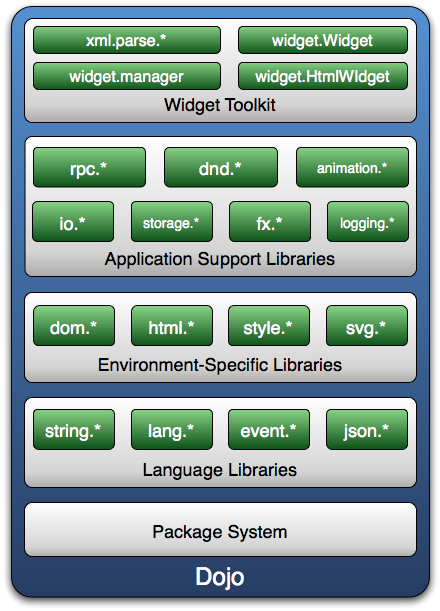

Dojo 大部分代码都位于应用程序支持库，由于太小限制，图 1 中没有列出所有的包。开发人员大部分时候都在调用这个层中的 API，比如，用 IO 包可以进行 Ajax 调用。

最上面的一层是 Dojo 的 Widget 系统，Widget 指的是用户界面中的一个元素，比如按钮、进度条和树等。 Dojo 的 Widget 基于 MVC 结构。它的视图作为一个 Template（模板）来进行存放，在 Template 中放置着 HTML 和 CSS 片段，而控制器来对该 Template 中的元素进行操作。 Widget 不仅支持自定义的样式表，并且能够对内部元素的事件进行处理。用户在页面中只需要加入简单的标签就可以使用。在这一层中，存在数百个功能强大的 Widget 方便用户使用，包括表格、树、菜单等。

## 常用包介绍

Dojo 1.1.1 提供了上百个包，这些包分别放入三个一级命名空间：Dojo，Dijit 和 DojoX 。其中 Dojo 是核心功能包 , Dijit 中存放的是 Dojo 所有的 Widget 组件，而 DojoX 则是一些扩展或试验功能，DojoX 中的试验功能在成熟之后有可能在后续版本中移入到 Dojo 或 Dijit 命名空间中。

由于 Dojo 包种类繁多，下面只列举了最常用的一些包及其功能，以方便读者有个初步了解或供以后查阅。

包名功能dojo.io不同的 IO 传输方式。 script、IFrame 等等；dojo.dnd拖放功能的辅助 API 。dojo.string这个包可以对字符串进行如下的处理：修整、转换为大写、编码、esacpe、填充（pad）等等；dojo.date解析日期格式的有效助手；dojo.event事件驱动的 API，支持 AOP 开发，以及主题 / 队列的功能；dojo.back用来撤销用户操作的栈管理器；dojo.rpc与后端服务（例如理解 JSON 语法的 Web 服务）进行通信；dojo.colors颜色工具包；dojo.dataDojo 的统一数据访问接口，可以方便地读取 XML、JSON 等不同格式的数据文件；dojo.fx基本动画效果库；dojo.regexp正则表达式处理函数库；dijit.forms表单控件相关的 Widget 库；dijit.layout页面布局 Widget 库；dijit.popup这个包用于以弹出窗口方式使用 Widget ；dojox.charting用于在页面上画各种统计图表的工具包；dojox.collections很有用的集合数据结构（List、Query、Set、Stack、Dictionary…）；dojox.encoding实现加密功能的 API（Blowfish、MD5、Rijndael、SHA…）；dojox.math数学函数（曲线、点、矩阵）；dojo.reflect提供反射功能的函数库；dojox.storage将数据保存在本地存储中（例如，在浏览器中利用 Flash 的本地存储来实现）；dojox.xmlXML 解析工具包；

## Dojo 的安装

Dojo 的安装不需要特别的环境和配置，只需要将 Dojo 包下载，解压并将其放在自己喜欢的位置就可以。

第一步，下载 Dojo 包。

##### 图 2\. Dojo 包的下载

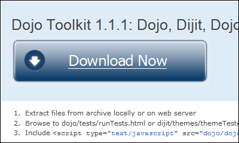

登陆 Dojo 官方网站的下载页面（参见参考资源），点击其上如图 2 中所示的” Download Now ”按钮。也可以选择点击页面右边的”All releases ”，查看当前 Dojo 所有的版本，并尝试下载使用。

第二步，解压下载下来的软件包，并将其放在合适的位置。

在 Windows 环境下，可以使用 WinRAR 将下载下来的 Dojo 包解压。在 Linux 环境下，最好是下载后缀名为 tar.gz 的包，可以使用”`tar -zxvf Dojo 压缩包文件名` ”命令解压 Dojo 包。

如果只是尝试使用 Dojo，不需要牵涉到与服务器端的通信，可以将 Dojo 放在任何方便的位置。但最好这个位置能方便其测试页面引用 Dojo 。比如假设测试页面 test.html 的放置位置为 D:\\test\\test.html，则 Dojo 包最好也放置为 D:\\test\\dojo，以方便 test.html 引用 Dojo 。如果牵涉到 Dojo 在服务器端的放置，则 Dojo 最好放在对应服务器的 Web 根目录下。比如假设目前 Appach 服务器的 Web 访问目录为”/home/web/webapp/ ”, 则 Dojo 包最好直接放置于其下，以避免出现跨域问题和方便服务器上的多个 Web 项目引用 Dojo 。

第三步，测试 Dojo 是否运行正常。

##### 图 3\. 检测 Dojo 是否运行正常

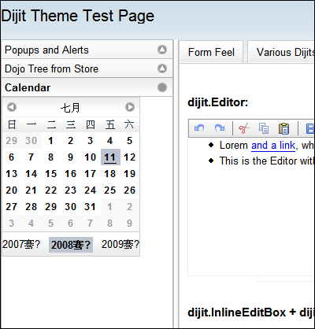

使用浏览器打开 _dojo\_path_ /dijit/themes/themeTester.html，如果页面的运行效果如图 3 所示，则说明 Dojo 运行正常。

需要说明的是 _dojo\_path_ 在本系列文章中有两个不同的代表意义。

- 第一表示 Dojo 包在系统中所处的绝对位置。例如如果 Dojo 包中 dojo.js 文件在系统中的位置为 `D:\test\dojo\dojo\dojo.js`，则此时 _dojo\_path_ 所代表的为 `D:\test\dojo`。
- 第二表示页面与 Dojo 包的相对位置。例如如果页面的位置为 D:\\, 而 Dojo 包的位置为 D:\\test\ 。要在页面中使用 Dojo，首先需要引入 Dojo，其实际引入的语句为 `<script type="text/javascript" src="_dojo_path_ /dojo/dojo.js" djConfig="parseOnLoad:true" ></script>` 。这里的 _dojo\_path_ 表示的是页面与 Doj 包的相对位置，因此其所代表的为 `./test/`。对于本系列后面章节的实例，将会出现很多使用 _dojo\_path_ 的情况，如果要运行这些实例，请将其中的 _dojo\_path_ 替换为真实情况的值。

除了通过下载 Dojo 包来使用 Dojo 以外，Dojo 组织还提供了另外一种方法来引入 Dojo 进行使用。如果不希望下载 Dojo 包而尝试对 Dojo 的使用，可以直接通过引入美国一个在线服务器主机上的 Dojo 来实现。与下载 Dojo 使用的不同点只是 _dojo\_path_ 应替换为 `http://o.aolcdn.com/dojo/1.0.0` 。例如要引入 dojo.js 文件，则其实际引入语句为：

```
<script
    type="text/javascript"
    src="http://o.aolcdn.com/dojo/1.0.0/dojo/dojo.js"
    djConfig="parseOnLoad: true">
</script>

```

Show moreShow more icon

## Dojo 版的 Hello World

前面，我们对 Dojo 的下载和安装进行了介绍。接下来，我们将通过一个 Dojo 版的 Hello World 示例来了解如何初步使用 Dojo 工具包。本节中，将通过一个客户端登陆验证的例子来进行讲述。

##### 清单 1\. 客户端登陆验证示例

```
<html>
<head>
<title>test</title>
<script type="text/javascript"
    src="dojo_path/dojo/dojo.js"
    djConfig="parseOnLoad: true"></script>
<style type="text/css">
    @import "dojo_path/dijit/themes/tundra/tundra.css";
</style>
<script type="text/javascript">
    dojo.require("dojo.parser");
    dojo.require("dijit.form.TextBox");
    dojo.require("dijit.form.Button");
    function init()
    {
      dojo.connect(dijit.byId("mybutton").domNode,"onclick","login");
    }
    function login()
    {
      if( dijit.byId("myname").value=="goodguy" &&
        dijit.byId("mypassword").value=="goodgoodstudy")
        alert("Dojo World welcome you!");
      else
      {
        dijit.byId("myname").setValue("");
        dijit.byId("mypassword").setValue("");
        alert("Dojo does not like you!");
      }
    }
    dojo.addOnLoad(init);
</script>
</head>
<body class="tundra">
UserName:
<input type="text" length="20" id="myname"  dojoType="dijit.form.TextBox">
<br>
PassWord:
<input type="password" length="20" id="mypassword"  dojoType="dijit.form.TextBox">
<br>
<div id="mybutton" dojotype="dijit.form.Button">Submit</div>
</body>
</html>

```

Show moreShow more icon

首先建立一个 test.html 的文件，在将清单 1 中的 dojo\_path 根据自己的实际情况进行修改后，把清单 1 中的代码拷贝到 test.html 中，并双击运行。在输入框中分别输入” goodguy ”和” goodgoodstudy ”，点击 Submit 按钮则会得到一个” Dojo World Welcome you ！”的一个弹出窗口。如果在两个输入框中输入的是其它内容，则点击 Submit 按钮就会得到” Dojo does not like you! ”的一个弹出窗口。

下面是对关键代码的解释：

- `djConfig="parseOnLoad: true"` 表示在页面加载完成以后，启用 Dojo 的解析模块对页面中的 Dojo 标签属性（Dojo 标签属性是指由 Dojo 定义的一些标记，这些标记只有在被处理以后，才能为浏览器识别执行）进行解析。`djConfig` 是使用 Dojo 页面的一个全局配置参数。通过对这个参数不同的赋值，可以控制页面中 Dojo 的解析模块是否运行， Dojo 的调试模块是否工作等。
- `@import "dojo_path/dijit/themes/tundra/tundra.css"` 表示引入 Dojo tundra 风格的层叠样式表。
- `dojo.require("dojo.parser")` 表示引入 Dijit 的解析功能模块。该模块将会把 Dojo 标签属性替换成浏览器可以识别执行的标记。需要与 `djConfig="parseOnLoad:true"` 相区别的是，`djConfig="parseOnLoad:true"` 表示确定在页面加载完成以后执行解析功能，但解析功能模块的引入要靠 `dojo.require("dojo.parser")` 来实现。
- `dojo.require("dijit.form.TextBox")` 和 `dojo.require("dijit.form.Button")` 表示引入 Dojo 风格的文本输入框和按钮的功能模块。
- `dojo.connect(dijit.byId("mybutton").domNode, "onclick", "login")` 表示将按钮的点击事件和 login 函数联系起来，当点击 id 为 mybutton 的按钮时，执行 login 函数。
- `dijit.byId("myname").setValue("")` 表示调用 id 为 myname 的 Dojo 文本框的 `setValue` 函数，将文本框里面的内容清为空。
- `<input type="text" length="20" id="myname" dojoType="dijit.form.TextBox">` 中的 `dojoType="dijit.form.TextBox"` 表示在页面中文本输入框是 Dojo 风格的。需要注意的是，通过声明 `dojoType="dijit.form.TextBox"` 这种方式来实现某些 Dojo 功能的使用，其表现形式上如同声明一个 HTML 标签的属性（如同 width=”10px”），因此在本文中称其为 Dojo 标签属性。在页面加载完成以后，Dojo 的解析模块会将 Dojo 标签属性转化为浏览器能够识别执行的标记。

如果读者希望了解如何写出自己的第一个基于 Dojo 的 Ajax ” Hello World ”，可参阅本系列文章的第二部分。

## Dojo 的调试

就本系列文章写作期间，还没有专门用于支持 Dojo 调试的工具。但考虑到 Dojo 的本质是一套 Javascript 的 Toolkit，因此使用 Javascript 的调试工具也能较好的满足 Dojo 应用调试的需求。

目前较为常见的浏览器有 IE，Firefox 和 Safari 。但这些浏览器在标准上都有一些差异，因此就目前的情况找到一个能在各个浏览器中通用的优秀调试工具显然不大可能。不同的浏览器往往有不同调试工具。因为笔者在实际的工作中最为熟悉的调试工具是 Firefox 下的 Firebug 。本文将以 Firebug 作为最主要的 Dojo 应用调试工具进行讲述。

### 安装 Firebug

第一步，点击 Firefox 浏览器上的”工具”选项，然后点击”附加软件”，在弹出的小窗口中，点击右下角的”获取扩展”选项，如图 4 所示。

##### 图 4\. 获取扩展

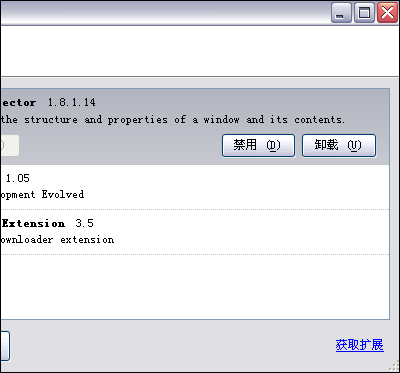

第二步，在点击”获取扩展”选项后，打开的页面中搜索 Firebug，在搜索结果的页面中，下载 Firebug 。需要注意的是，Firebug 的版本要与 Firefox 的版本相兼容。如果要查看自己 Firefox 的版本，可通过点击浏览器”帮助”选项下”关于 Mozilla Firefox ”选项。

第三步，由于目前 Firebug 直接支持的是 Firefox3.0，而本书作者的 Firefox 是 Firefox2.0，因此需要从 Firebug 的老版本中找到合适的 Firebug 版本。 Firebug 的下载网页会判断您的浏览器版本。如果尝试下载安装不合适的 Firebug 版本时，其链接是失效的。与本书作者浏览器版本相对的最佳 Firebug 下载页面如图 5 所示。其余的一些老版本的 Firebug，只要可以下载的，一般来说，也就是可以使用的。

##### 图 5\. 下载合适的 Firebug

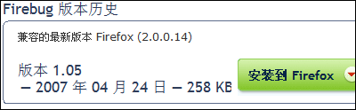

### 了解 Firebug 调试功能

第一步，启动 Firebug 。 Firebug 安装完成以后，有的 Firebug 版本会在浏览器的右下角产生一个特殊的小图标。点击这个小图标，就可以打开 Firebug 的调试窗口。如果浏览器的右下角没有小图标，则可以通过浏览器菜单中的 **“工具”>”Firebug”>”Open Firebug”** 打开 Firebug 的调试窗口。 Firebug 打开以后，会在浏览器的下端出现如图 6 所示的窗口。

##### 图 6\. Firebug 调试窗口

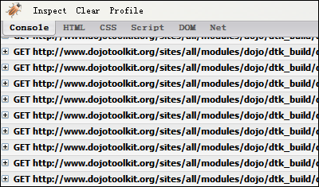

第二步，Console 窗口的使用。 Console 窗口除了显示页面加载的文件以外，还可以直接显示页面中的代码错误和一些输出信息。

如果将清单 1 代码中的 `dojo.require("dijit.form.Button")` 删除，就会在 Console 窗口中出现如图 7 所示的红色错误警告。

##### 图 7\. Console 窗口中显示的代码错误

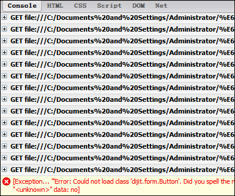

除了看到页面的运行信息以外，还可以直接在 Console 窗口中输出调试信息。 Firebug 支持的调试语句较为常用的是 console.log 。

在清单 1 的 `init` 函数中加入一条语句 `console.log("I am Firebug!")` ，然后刷新页面则可以在 Console 窗口中看到如图 8 所示的输出。 `console.log` 除了可以直接将字符串输出以外，还可以使用如 C 语言的 `printf` 一样的格式控制进行输出。

##### 图 8\. 输出调试信息

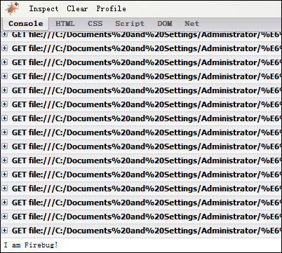

在 [清单 1](#清单-1-客户端登陆验证示例) 的 `init` 函数中加入清单 2 中的代码，然后刷新页面则可以在 Console 窗口中看到如图 9 所示的输出。

##### 清单 ２. 加入代码后输出

```
var num = 222;
console.log("My test num is %d",num);
console.log(num,window,login);

```

Show moreShow more icon

##### 图 9\. 输出调试信息的高级使用方法

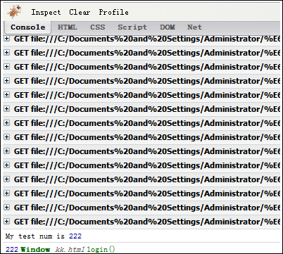

此外，为了方便将不同类别的调试信息输出进行区别（比如错误信息和警告信息），可以使用另外四种调试输出语句。

在清单 1 的 `init` 函数中加入清单 3 中的代码，然后刷新页面则可以在 Console 窗口中看到如图 10 所示的输出。

##### 清单 3\. 加入代码后输出

```
console.debug("I am debug");
console.info("I am info");
console.warn("I am warn");
console.error("I am error");

```

Show moreShow more icon

##### 图 10\. 另外四种调试输出语句

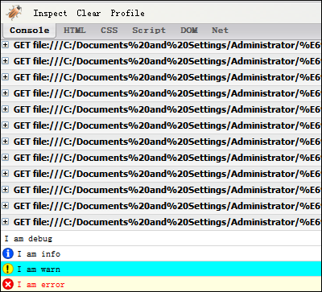

有 Javascript 经验的读者可能会习惯于使用 `alert()` 进行调试信息的输出，但是笔者认为将调试信息在 Console 窗口中输出是一个更优的选择。首先，如果页面有很多 `alert()`, 则点击” OK ”让弹出框消失也是一个非常烦人的事情。其次，如果调试信息的量很大，则是用 `alert()` 的弹出窗口将无法良好的完整展示调试信息。接着， `alert()` 无法查看对象和数组的细节信息。最后，如果在一个循环中使用 `alert()`, 将很容易造成页面”死掉”。

第三步，HTML 窗口的使用。在 HTML 窗口中可以查看到页面的源代码。除了可以查看页面的源代码外，还可以使用 Firebug 的编辑功能直接对页面进行编辑。

##### 图 11\. 使用 Firebug 的编辑页面功能

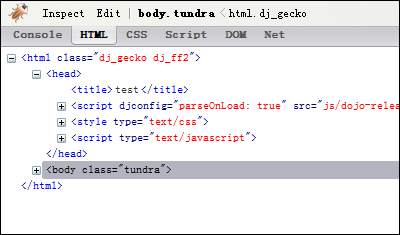

如图 11 所示，在处于 HTML 窗口的模式下，点击 Edit 按钮，将切换查看模式到编辑模式。需要注意的是，在使用 Edit 模式前，最好如图 11 先提前选中页面的 body 代码区块。

##### 图 12\. 使用 Edit 后的页面效果

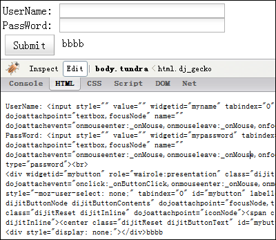

如图 12 所示，在 Edit 模式下，在页面代码的最后加上了字符串” bbbb ”，然后在页面的相应位置也直接显示了字符串” bbbb ”。需要注意的是，在页面新加完代码后，需要点击一下页面的其它任何地方，则其效果才会在页面上加载。

##### 图 13\. HTML 模式下的 Style，Layout，DOM 三窗口

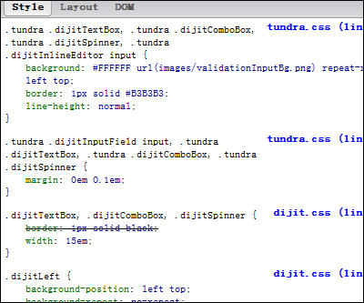

如图 13 所示，在 HTML 窗口模式下，与 HTML 窗口相对应，在其右边有 Style，Layout，DOM 三个用于查看页面对应部分相关属性的窗口。当选中页面中的某个部分时，Style 显示选中部分的 CSS 属性，Layout 显示 CSS 的盒式模型，DOM 显示其选中部分的所有 DOM 对象。结合使用 Inspect 功能可以方便选择页面中所需要关注的部分。

在图 13 中所显示的是在使用了 Inspect 功能选中一个 Dojo 文本框后，其所显示的 Dojo 文本框的 CSS 修饰。这些 CSS 修饰是通过加载 Dojo 的 CSS 文件来实现的。

第四步，Script 窗口的使用。 Script 窗口支持对 Javascript 的断点调试。

在 Script 窗口下，可以选择不同的脚本文件进行调试。在选择好需要调试的脚本文件以后，直接使用鼠标点击代码行的左端可以添加断点，断点的标志是一个圆点。（此外，也可以在代码中直接写入 debugger; 来添加断点）

然后刷新页面，则当脚本执行到断点位置的时候，停止执行。此时，可以选择 Script 窗口右边的几种调试按钮对当前代码进行调试。

在图 14 中，在代码的 18 行添加了断点，且此时脚本单步运行到了第 22 行。

##### 图 14\. Script 窗口的使用


第五步，DOM 窗口和 Net 窗口的使用。 DOM 窗口主要显示的是页面中的所有对象，及其所包含的属性和方法。 Net 窗口主要是显示当前页面中所加载的各个文件的大小和加载各个文件所花费的时间。

除了上述五步中所讲述的功能以外，Firebug 还有一些功能本文没有涉及。如果读者对 Firebug 的使用特别感兴趣，可以在网上搜索相关资料进行了解。

但是在某些情况下，仍然需要在 IE 或 Safari 等其它非 Firefox 浏览器上进行调试。在这个时候，Dojo 可以提供一些帮助。

Dojo 实现了一个跨平台的调试信息输出的功能。如果需要使用这个功能，则只需要将 djConfig 的参数值设置为”isDebug: true ”便可以了。

如图 15 所示，在页面的最下面有一个方型区域，其中有三条输出。这三条输出分别对应的调试语句为 `console.debug("This is console debug information");console.warn("This is console warn information");` 和 `console.error("This is console error information");` 。

##### 图 15\. IE 下使用 Dojo 的跨平台调试信息输出功能

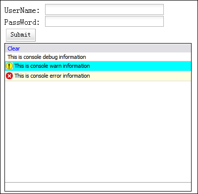

## 结束语

现在您已对 Dojo 的体系结构有了初步的了解，并且已经写了第一下 dojo 应用。另外，相信您现在已经掌握了 Dojo 的调试方法。可以说，您已经开始步进了 Dojo 的大门，下期文章将教您如何使用 Dojo 进行 Ajax 调用。