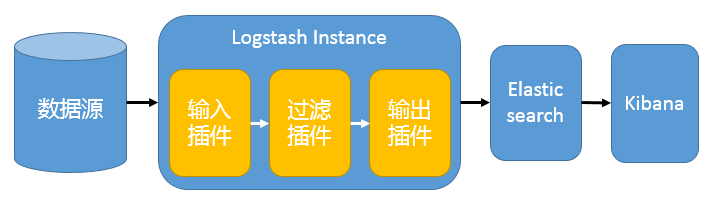
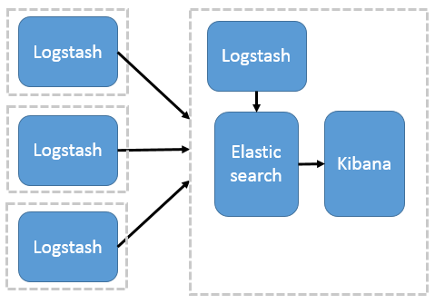
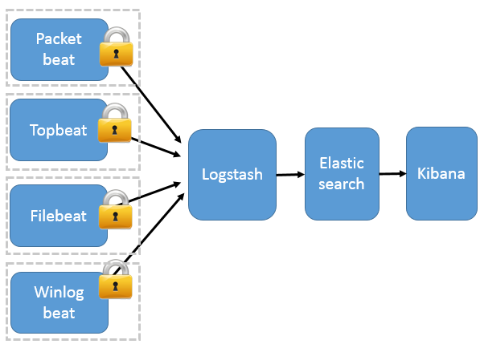
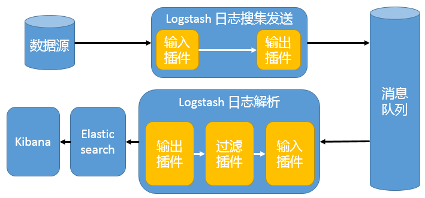
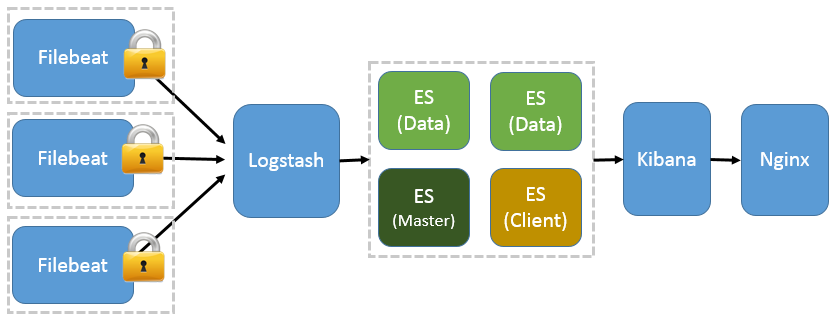
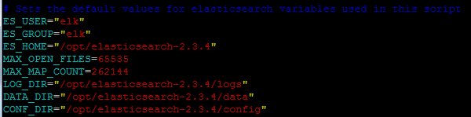
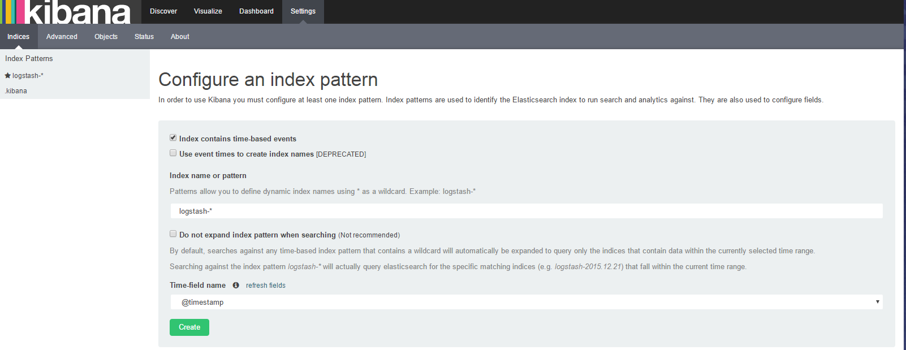
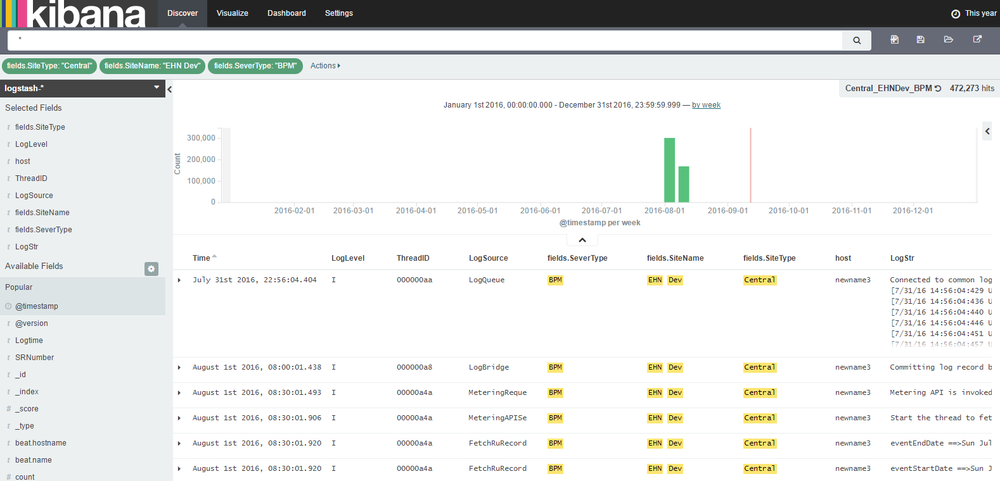

# ELK 架构和 Filebeat 工作原理详解
从日志中获得洞察

**标签:** DevOps,消息传递

[原文链接](https://developer.ibm.com/zh/articles/os-cn-elk-filebeat/)

曹萍

发布: 2016-11-02

* * *

## ELK Stack 简介

ELK 不是一款软件，而是 Elasticsearch、Logstash 和 Kibana 三种软件产品的首字母缩写。这三者都是开源软件，通常配合使用，而且又先后归于 Elastic.co 公司名下，所以被简称为 ELK Stack。根据 Google Trend 的信息显示，ELK Stack 已经成为目前最流行的集中式日志解决方案。

- Elasticsearch：分布式搜索和分析引擎，具有高可伸缩、高可靠和易管理等特点。基于 Apache Lucene 构建，能对大容量的数据进行接近实时的存储、搜索和分析操作。通常被用作某些应用的基础搜索引擎，使其具有复杂的搜索功能；
- Logstash：数据收集引擎。它支持动态的从各种数据源搜集数据，并对数据进行过滤、分析、丰富、统一格式等操作，然后存储到用户指定的位置；
- Kibana：数据分析和可视化平台。通常与 Elasticsearch 配合使用，对其中数据进行搜索、分析和以统计图表的方式展示；
- Filebeat：ELK 协议栈的新成员，一个轻量级开源日志文件数据搜集器，基于 Logstash-Forwarder 源代码开发，是对它的替代。在需要采集日志数据的 server 上安装 Filebeat，并指定日志目录或日志文件后，Filebeat 就能读取数据，迅速发送到 Logstash 进行解析，亦或直接发送到 Elasticsearch 进行集中式存储和分析。

如果您对 ELK Stack 还尚不了解，或是想了解更多，请点击 [集中式日志系统 ELK 协议栈详解](http://www.ibm.com/developerworks/cn/opensource/os-cn-elk/) ，查看具体介绍。

## ELK 常用架构及使用场景介绍

在这个章节中，我们将介绍几种常用架构及使用场景。

### 最简单架构

在这种架构中，只有一个 Logstash、Elasticsearch 和 Kibana 实例。Logstash 通过输入插件从多种数据源（比如日志文件、标准输入 Stdin 等）获取数据，再经过滤插件加工数据，然后经 Elasticsearch 输出插件输出到 Elasticsearch，通过 Kibana 展示。详见图 1。

##### 图 1\. 最简单架构



这种架构非常简单，使用场景也有限。初学者可以搭建这个架构，了解 ELK 如何工作。

### Logstash 作为日志搜集器

这种架构是对上面架构的扩展，把一个 Logstash 数据搜集节点扩展到多个，分布于多台机器，将解析好的数据发送到 Elasticsearch server 进行存储，最后在 Kibana 查询、生成日志报表等。详见图 2。

##### 图 2\. Logstash 作为日志搜索器



这种结构因为需要在各个服务器上部署 Logstash，而它比较消耗 CPU 和内存资源，所以比较适合计算资源丰富的服务器，否则容易造成服务器性能下降，甚至可能导致无法正常工作。

### Beats 作为日志搜集器

这种架构引入 Beats 作为日志搜集器。目前 Beats 包括四种：

- Packetbeat（搜集网络流量数据）；
- Topbeat（搜集系统、进程和文件系统级别的 CPU 和内存使用情况等数据）；
- Filebeat（搜集文件数据）；
- Winlogbeat（搜集 Windows 事件日志数据）。

Beats 将搜集到的数据发送到 Logstash，经 Logstash 解析、过滤后，将其发送到 Elasticsearch 存储，并由 Kibana 呈现给用户。详见图 3。

##### 图 3\. Beats 作为日志搜集器



这种架构解决了 Logstash 在各服务器节点上占用系统资源高的问题。相比 Logstash，Beats 所占系统的 CPU 和内存几乎可以忽略不计。另外，Beats 和 Logstash 之间支持 SSL/TLS 加密传输，客户端和服务器双向认证，保证了通信安全。

因此这种架构适合对数据安全性要求较高，同时各服务器性能比较敏感的场景。

### 引入消息队列机制的架构

到笔者整理本文时，Beats 还不支持输出到消息队列，所以在消息队列前后两端只能是 Logstash 实例。这种架构使用 Logstash 从各个数据源搜集数据，然后经消息队列输出插件输出到消息队列中。目前 Logstash 支持 Kafka、Redis、RabbitMQ 等常见消息队列。然后 Logstash 通过消息队列输入插件从队列中获取数据，分析过滤后经输出插件发送到 Elasticsearch，最后通过 Kibana 展示。详见图 4。

##### 图 4\. 引入消息队列机制的架构



这种架构适合于日志规模比较庞大的情况。但由于 Logstash 日志解析节点和 Elasticsearch 的负荷比较重，可将他们配置为集群模式，以分担负荷。引入消息队列，均衡了网络传输，从而降低了网络闭塞，尤其是丢失数据的可能性，但依然存在 Logstash 占用系统资源过多的问题。

## 基于 Filebeat 架构的配置部署详解

前面提到 Filebeat 已经完全替代了 Logstash-Forwarder 成为新一代的日志采集器，同时鉴于它轻量、安全等特点，越来越多人开始使用它。这个章节将详细讲解如何部署基于 Filebeat 的 ELK 集中式日志解决方案，具体架构见图 5。

##### 图 5\. 基于 Filebeat 的 ELK 集群架构



因为免费的 ELK 没有任何安全机制，所以这里使用了 Nginx 作反向代理，避免用户直接访问 Kibana 服务器。加上配置 Nginx 实现简单的用户认证，一定程度上提高安全性。另外，Nginx 本身具有负载均衡的作用，能够提高系统访问性能。

### 系统信息

#### 平台

笔者试验平台为 RHEL 6.x。注意，目前 ELK（包括 Beats）不支持 AIX。具体对平台的支持请查看 [这里](how_os) 。

#### JDK

JDK 是 IBM Java 8。ELK 需要 Oracle 1.7(或者是 OpenJDK 1.7) 及以上，如果是 IBM Java，则需要 8 及以上的版本。 [具体信息](show_jvm) 。

#### 浏览器

Kibana 4.x 不支持 IE9 及以下；Kibana 3.1 虽然支持 IE9，但是不支持 Safari(iOS)和 Chrome(Android)。具体对浏览器的支持，请看 [这里](show_browsers) 。

#### 软件版本

- Filebeat：1.2.3；
- Logstash：2.3.4；
- Elasticsearch：2.3.4；
- Kibana：4.5.4；
- Nginx：1.8.1。

### Filebeat + ELK 安装

ELK 官网对于每种软件提供了多种格式的安装包（zip/tar/rpm/DEB），以 Linux 系列系统为例，如果直接下载 RPM，可以通过 `rpm -ivh path_of_your_rpm_file` 直接安装成系统 service。以后就可以使用 service 命令启停。比如 `service elasticsearch start/stop/status`。很简单，但缺点也很明显，就是不能自定义安装目录，相关文件放置比较分散。

实际使用中更常用是使用 tar 包安装。每种软件产品的安装过程非常相似，所以下面仅以 Elasticsearch 为例简述安装过程。

- 创建 elk 用户和用户组；


    ```
    groupadd elk          # 添加用户组
    useradd -g elk elk    # 添加用户到指定用户组
    passwd elk            # 为指定用户设置密码

    ```


    Show moreShow more icon

    切换到新创建的 elk 用户做如下操作。

- 下载安装包；

    如果待安装机器能访问外网，可以直接用以下命令下载安装包。


    ```
    wget https://download.elastic.co/elasticsearch/release/org/elasticsearch/distribution/tar/elasticsearch/2.3.4/elasticsearch-2.3.4.tar.gz

    ```


    Show moreShow more icon

    否则下载好后用 ftp 客户端等工具把包传过去。

- 解压到指定目录；


    ```
        tar xzvf elasticsearch-2.3.4.tar.gz -C /opt

    ```


    Show moreShow more icon

    这时就能在/opt 下看到刚才解压出来的 elasticsearch-2.3.4 文件夹。

- 运行；


    ```
        ./Path_of_elasticsearch/bin/elasticsearch

    ```


    Show moreShow more icon

- 验证是否启动；


    ```
    curl 'http://localhost:9200'

    ```


    Show moreShow more icon

    如果看到如下类似信息，就说明 Elasticsearch 正常启动了。


    ```
            {
                  "name" : "node-235",
                  "cluster_name" : "elasticsearch_cms",
                  "version" : {
                        "number" : "2.3.4",
                    "build_hash" : "e455fd0c13dceca8dbbdbb1665d068ae55dabe3f",
                         "build_timestamp" : "2016-06-30T11:24:31Z",
                    "build_snapshot" : false,
                    "lucene_version" : "5.5.0"
                   },
                  "tagline" : "You Know, for Search"
          }

    ```


    Show moreShow more icon

- 配置 Elasticsearch service；

    上面的运行命令是在前台启动 Elasticsearch。实际使用中更多是在后台运行，或者是把 Elasticsearch 配置成 service。

    Github 上有以 service 形式运行 Elasticsearch 的脚本，下载后放到/etc/init.d 目录下，然后用 vim 打开，根据实际情况修改比如用户名、log 路径、数据保存路径等信息。图 6 是笔者试验用的变量值。

    图 6\. Elasticsearch service 脚本中的变量定义 {: #图-6-elasticsearch-service-脚本中的变量定义}

    

- 以 service 形式启/停/查看状态；


    ```
    service elasticsearch start/stop/status

    ```


    Show moreShow more icon


以上就是如何以 service 形式安装 Elasticsearch，对于 Filebeat、Logstash 和 Kibana 还有 Nginx 都能以相同方式安装，这里就不赘述。

### Filebeat + ELK 配置

Filebeat 和 ELK 的安装很简单，比较难的是如何根据需求进行配置。这个章节选取了几个比较典型且重要的配置需求和配置方法。

#### Filebeat 与 Logstash 安全通信

用户可以使用 TLS 双向认证加密 Filebeat 和 Logstash 的连接，保证 Filebeat 只向可信的 Logstash 发送加密的数据。同样的，Logstash 也只接收可信的 Filebeat 发送的数据。

这个功能默认是关闭的。可通过如下步骤在配置文件中打开：

- 生成 Filebeat 自签名证书和 key 文件

    因为试验用，所以这里使用的都是自签名证书。如何使用 openssl 生成自签名证书，网上有很多教程，Elastic github 上也直接提供了 [参考指令](https://github.com/elastic/beats/blob/master/testing/environments/docker/logstash/gencerts.sh) 。


    ```
        openssl req -subj '/CN=hostname/' -x509 -days $((100*365)) -batch -nodes -newkeys rsa:2048 -keyout ./pki/tlk/provate/filebeat.key -out ./pki/tls/certs/filebeat.crt

    ```


    Show moreShow more icon

    这条指令生成自签名证书和 key 文件。读者需要把 hostname 部分改成实际环境的 hostname，或者是 IP 地址。

- 生成 Logstash 自签名证书和 key 文件

    命令类似。

- Filebeat 配置

    首先把 Logstash 的自签名证书传送到 Filebeat 所在服务器。然后，对 logstash output 部分的 tls 配置作如下修改：


    ```
        tls:
             ## logstash server 的自签名证书。
             certificate_authorities: ["/etc/pki/tls/certs/logstash.crt"]
             certificate: "/etc/pki/tls/certs/filebeat.crt"
             certificate_key: "/etc/pki/tls/private/filebeat.key"

    ```


    Show moreShow more icon

    其中：

    - certificate\_authorities：CA 证书，即用来签署证书的证书。这里表示配置 Filebeat 使其信任所有由该 CA 证书发行的证书。因为自签名证书的发行者和证书主体相同，所以这里直接使用 Logstash 证书使 Filebeat 信任使用该证书的 Logstash server；
    - certificate & certificate\_key：Filebeat 证书和 key 文件。Filebeat 将使用它们向 Logstash server 证明自己的可信身份。
- Logstash 配置

    同 Filebeat 配置类似，首先把 Filebeat client 上的证书复制到 Logstash server 上，然后作如下修改。


    ```
        input {
          beats {
            port => 5044
            ssl => true
            ssl_certificate_authorities => ["/etc/pki/tls/certs/filebeat.crt"]
            ssl_certificate => "/etc/pki/tls/certs/logstash.crt"
            ssl_key => "/etc/pki/tls/private/logstash.key"
            ssl_verify_mode => "force_peer"
          }
        }

    ```


    Show moreShow more icon

    其中：

    - ssl：true 表示开启 Logstash 的 SSL/TLS 安全通信功能；
    - ssl\_certificate\_authorities：配置 Logstash 使其信任所有由该 CA 证书发行的证书；
    - ssl\_certificate & ssl\_key：Logstash server 证书和 key 文件。Logstash 使用它们向 Filebeat client 证明自己的可信身份；
    - ssl\_verify\_mode：表明 Logstash server 是否验证 Filebeat client 证书。有效值有 peer 或 force\_peer。如果是 force\_peer，表示如果 Filebeat 没有提供证书，Logstash server 就会关闭连接。

#### Filebeat 实现 log rotation

通俗的说，log rotation 是指当日志文件达到指定大小后，把随后的日志写到新的日志文件中，原来的日志文件重命名，加上日志的起止时间，以实现日志归档的目的。

Filebeat 默认支持 log rotation，但需要注意的是，Filebeat 不支持使用 NAS 或挂载磁盘保存日志的情况。因为在 Linux 系列的操作系统中，Filebeat 使用文件的 inode 信息判断当前文件是新文件还是旧文件。如果是 NAS 或挂载盘，同一个文件的 inode 信息会变化，导致 Filebeat 无法完整读取 log。

虽然 Filebeat 默认支持 log rotation，但是有三个参数的设置需要留意。

- registry\_file：这个文件记录了当前打开的所有 log 文件，以及每个文件的 inode、当前读取位置等信息。当 Filebeat 拿到一个 log 文件，首先查找 registry\_file，如果是旧文件，就从记录的当前读取位置处开始读取；如果是新文件，则从开始位置读取；
- close\_older：如果某个日志文件经过 close\_older 时间后没有修改操作，Filebeat 就关闭该文件的 handler。如果该值过长，则随着时间推移，Filebeat 打开的文件数量很多，耗费系统内存；
- scan\_frequency：Filebeat 每隔 scan\_frequency 时间读取一次文件内容。对于关闭的文件，如果后续有更新，则经过 scan\_frequency 时间后，Filebeat 将重新打开该文件，读取新增加的内容。

#### Elasticsearch 集群

Elasticsearch 启动时会根据配置文件中设置的集群名字（cluster.name）自动查找并加入集群。Elasctisearch 节点默认使用 9300 端口寻找集群，所以必须开启这个端口。

一个 Elasticsearch 集群中一般拥有三种角色的节点，master、data 和 client。

- master：master 节点负责一些轻量级的集群操作，比如创建、删除数据索引、跟踪记录集群中节点的状态、决定数据分片（shards）在 data 节点之间的分布；
- data：data 节点上保存了数据分片。它负责数据相关操作，比如分片的 CRUD，以及搜索和整合操作。这些操作都比较消耗 CPU、内存和 I/O 资源；
- client：client 节点起到路由请求的作用，实际上可以看做负载均衡器。

配置文件中有两个与集群相关的配置：

- node.master：默认 true。True 表示该节点是 master 节点；
- node.data：默认 true。True 表示该节点时 data 节点。如果两个值都为 false，表示是 client 节点。

一个集群中不一定有 client 节点，但是肯定有 master 和 data 节点。默认第一个启动的节点是 master。Master 节点也能起到路由请求和搜索结果整合的作用，所以在小规模的集群中，无需 client 节点。但是如果集群规模很大，则有必要设置专门的 client。

#### Logstash 使用 grok 过滤

日志数据一般都是非结构化数据，而且包含很多不必要的信息，所以需要在 Logstash 中添加过滤插件对 Filebeat 发送的数据进行结构化处理。

使用 grok 正则匹配把那些看似毫无意义、非结构化的日志数据解析成可查询的结构化数据，是目前 Logstash 解析过滤的最好方式。

Grok 的用户不需要从头开始写正则。ELK github 上已经写好了很多有用的模式，比如日期、邮箱地址、IP4/6、URL 等。具体查看 [这里](https://github.com/logstash-plugins/logstash-patterns-core/blob/master/patterns/grok-patterns) 。除此之外，还有 grok 正则表达式的 [debug 工具](http://grokdebug.herokuapp.com/) ，能方便快速检验所写表达式是否正确。

下面是一个 grok 的配置实例，读者可以适当修改满足你的需求。

```
filter {
grok {
    match => {
      "message" => [
                "\[(?<Logtime>(%{MONTHNUM}/%{MONTHDAY}/%{YEAR})\s+%{TIME}\s+%{WORD})\]\s+%{BASE16NUM}\s+(?<LogSource>([\w|\S]+))\s+%{WORD:LogLevel}\s+(?<LogStr>[\w|\W]*)",
                "\[(?<Logtime>(%{MONTHNUM}/%{MONTHDAY}/%{YEAR})\s+%{TIME}\s+%{WORD})\]\s+%{BASE16NUM}\s+%{WORD:LogLevel}\s+(?<LogStr>[\w|\W]*(\\n)+)"
            ]
      }
    remove_field => ["message"]
}
if "_grokparsefailure" in [tags] {
    grok {
        match => ["message", "(?<LogStr>[\w|\W]+)"]
        remove_field => ["message"]
        remove_tag => ["_grokparsefailure"]
        add_field => {
            LogSource => "-"
            LogLevel => "-"
            LogTime => "-"
        }
    }
}
}

```

Show moreShow more icon

第一个 grok 列了两种正则表达式，如果第一种不匹配，则自动使用第二种。如果第二种也没有匹配，则匹配失败，log 数据中添加一个 `"_grokparsefailure"` 域，表明 grok 匹配失败了。读者可根据实际需求决定如何处理匹配失败的数据。这里，对于匹配失败的，将再匹配一次，并给没有匹配上的域赋予默认值 `"-"`，这样使得日志数据格式统一，都含有 4 个域：Logtime、LogSource、LogLevel、LogTime，便于后续数据搜索和展示。

#### 配置 Nginx 实现用户认证

关于这部分配置的教程很多，这里就不赘述了。

## 遇到的典型问题

### 问题：Filebeat 如何读取多个日志目录？

如果 Filebeat 所在 server 上运行有多个 application servers，各自有不同的日志目录，那 Filebeat 如何同时读取多个目录，这是一个非常典型的问题。

解决方案：通过配置多个 prospector 就能达到要求。在配置文件的 prospectors 下，每个”-“表示一个 prospector，每个 prospector 包含一些配置项，指明这个 prospector 所要读取的日志信息。如下所示：

```
    prospectors:
        -
          paths:
             - /home/WLPLog/*.log
          # 其他配置项，具体参考 Elastic 官网
        -
          paths:
             - /home/ApacheLog/*.log
          # 其他配置项，具体参考 Elastic 官网

```

Show moreShow more icon

### 问题：Filebeat 如何区分不同日志来源？

还是上题中提到的场景，Filebeat 虽然能读取不同的日志目录，但是在 Logstash 这边，或者是 Elasticsearch 这边，怎么区分不同 application server 的日志数据呢？

解决方案：Filebeat 的配置项 fields 可以实现不同日志来源的区分。用法如下：

```
prospectors:
    -
       paths:
          - /home/WLPLog/*.log
       fields:
         log_source: WLP
    -
       paths:
          - /home/ApacheLog/*.log
       fields:
         log_source: Apache

```

Show moreShow more icon

在 fields 配置项中，用户可以自定义域来标识不同的 log。比如上例中的”log\_source”就是笔者自定义的。如此，从 Filebeat 输出的 log 就有一个叫做 log\_source 的域表明该 log 的实际来源。

### 问题：如何配置 Logstash 与 Elasticsearch 集群通信？

我们知道 Logstash 使用 Elasticsearch 输出插件就能把数据发送到 Elasticsearch 进行存储和搜索。Elasticsearch 插件中有个 hosts 配置项说明 Elasticsearch 信息。但是假如是一个 Elasticsearch 集群，应该怎么配置 hosts？

解决方案：最简单的做法是把集群中所有的 Elasticsearch 节点的 IP 或者是 hostname 信息都在 hosts 中配上（它支持数组）。但是如果集群比较大，或者是集群节点变动频繁的话，还需要维护这个 hosts 值，不太方便。比较推荐的做法是只配集群中某个节点的信息，可以是 client 节点，也可以是 master 节点或者是 data 节点。因为不管是哪个节点，都知道该它所在集群的信息（集群规模，各节点角色）。这样，Logstash 与任意节点通信时都会先拿到集群信息，然后再决定应该给哪个节点发送数据输出请求。

### 问题：如何在 Kibana 显示日志数据？

解决方案：当数据存储在 Elasticsearch 端之后就可以在 Kibana 上清楚的展示了。首先在浏览器上打开 Kibana 页面。如果使用了 Nginx，就使用 Nginx 配置的 URL；否则就是 `http://yourhostname:5601`。

创建日志索引。Logstash 发送的数据，默认使用 logstash 前缀作为数据索引。见图 7。

##### 图 7\. Kibana 创建索引页面



点击 Create，再选择 Discover 页面就能看见 Logstash 发送的数据了,如图 8 所示。

##### 图 8\. 数据展示页面



Kibana 具体的使用，比如如何创建日志 visualization，如何将 visualization 添加到 dashboard，如何在 Kibana 上搜索日志，这些可以参考官网。

## 结束语

本文首先简要介绍了 ELK 协议栈的几种典型的架构及其使用场景，然后针对 Filebeat 的架构，详细说明了如何安装和配置。限于篇幅，同时由于某些基本配置，官网有详尽的说明，所以本文只是选取了几个比较重要，同时官网上说得不是很明确的地方作说明，希望对大家有帮助。

ELK 论坛上有不少内部人士热心帮忙解答用户的问题。如果读者在使用过程中有不懂的，搜索了很久也找不到答案的问题，可以在 ELK 论坛寻求帮助。