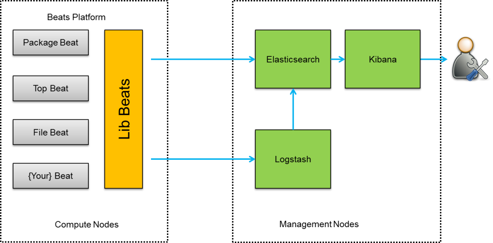

# ELK 组件对 Power Linux Server 和 IBM JAVA 的支持
将 ELK 集成到 Power linux server 和 IBM JAVA 环境中遇到的主要问题和解决思路

**标签:** Java,Linux

[原文链接](https://developer.ibm.com/zh/articles/j-cn-elk-power-linux-server/)

李峰, 张帅, 何金池

发布: 2017-07-19

* * *

随着大数据和云计算平台的日渐成熟，ELK（Elastic）作为开源的分布式日志查询分析系统, 也已经逐步占据了领先地位。ELK 在各个平台上的支持也就更加广泛了，从而牵扯到了在 Power Linux Server 和 IBM JAVA 平台上的集成。作者在较早之前（ELK 在当时发布的版本是 elasticsearch1.4.4 和 logstash1.4.2 的时候）就已经开始了将 ELK 集成于 IBM Power Linux Server 和 IBM JAVA 之上, 一直到今天 ELK 版本迭代更新至 5.x，期间遇到过很多问题，但也逐个击破并且相对比较稳定的一直运行着。本文将 ELK 集成到 Power linux server 和 IBM JAVA 环境中遇到的主要问题和解决思路进行了汇总和记录，在文档中摘录下来进行表述。

## 一、引子

ELK 作为一套分布式日志查询系统是由三大核心组件组成： Elasticsearch， Logstash, Kibana。 它们都属于开源的 Apache 2.0 License。也就是说大家可以免费使用这些组件，并可以应用到自己的项目中去。但 Elastic 官方也开发一系列商业软件，作为 plugin 销售，本文不涉及这些商业软件的使用和描述。

随着性能需求等方面原因，ELK 的其它开源组件作为整体解决方案不可或缺的组件也被开发了出来，如 Logstash-forwarder，Beats family: Filebeat， Packetbeat，Topbeat，Winlogbeat。 其中 Topbeat 被随后的 Metricbeat 所替代。业界也有人在 ELK 系统中使用了 Redis 或 Kafka, 本文在这里不做过多的针对 Redis 和 Kafka 的发散性描述。



目前，ELK 系统已经发展到了 5.3 版本，相对来说，性能更加稳定，功能更加的齐全。但是在集成各个公司的产品上，还具有很多挑战。为了更好的将 ELK 应用到各个产品中，尚需解决诸多问题，作出适当的调整。比如，笔者将 ELK 系统应用到 IBM POWER 系统上和 IBM JAVA 集成的时候，就遇到了一些问题。本文会对一些主要问题逐一阐述，并提供有效的解决方案。

既然提到 IBM POWER 系统，那么，什么是 POWER 系统呢？

Power 系统 是 RISC 处理器架构的一种，由 IBM 设计，POWER 是 Performance Optimization With Enhanced RISC 的缩写，翻译过来是“增强 RISC 性能优化”。Linux 市场快速发展的势头已经持续了二十多年。Linux 平台不仅成为越来越多企业运行关键性业务的新选择，还为企业大数据、云计算等新兴工作负载注入了强大生命力。然而，传统 x86 架构在安全性、稳定性及大规模处理等方面的不足，使得企业亟需一个更为领先的基础架构选择，以最大限度地挖掘开源应用的潜力。关键业务 POWER 平台选择开源 Linux 就成为一个理想选择。这一发展模式成功的关键是能否铸就一个开放的创新生态，激活合作伙伴的力量。毫无疑问，这一生态的诞生是历史发展的产物。这一生态的核心是 POWER 平台和 Linux 系统。POWER 微处理器应用在不少 IBM 服务器，超级电脑，小型电脑及工作站中，广泛作为主 CPU 使用。为了加速 POWER 的快速发展，IBM 发起了 OpenPOWER 基金会，基金会成员可以围绕 POWER 各个层面来展开合作和共同开发。目前已经吸纳了 24 个国家 200 多家成员，市场中主流产品有 Power7 和 Power8 系列服务器。

本文针对 Power Linux Server 包含有 IBM Power Linux Server 和 Open Power Server，从 Architecture 角度又分为 ppc64 和 ppc64le 平台，在 Server 上运行”uname -m”可以查询出相对应平台。其中 ppc64le 是 ppc64-little-endian 的缩写，即纯小端模式，试图使基于 x86 的 Linux 软件的移植工作以最小的工作量模式工作，POWER8 是 ppc64le 的首要应用代表。


如上图，这是 elastic 官网所描述的 JVM 兼容矩阵。这是由于 Elasticsearch 和 logstash 均 是通过 JVM 启动的，在 ELK 官方中，是以 Oracle jdk 为测试平台的，我们可以看到，在早期版本的官方文档里，并不支持 IBM JAVA，即使在后期的版本中，也仅仅的支持了部分 IBM JAVA 的版本。当作者将 ELK 系统和 IBM JAVA 集成过程中，也确实遇到了一些问题，所以本文将此类问题集合起来一并说明。希望对大家相关方面的工作有一些帮助。

## 二、ELK 在 Power Linux Server 上运行时遇到的问题和解决方案

ELK 在 Power Linux Server 上运行中遇到过很多问题，一些比较严重的问题比如软件根本无法在 Power Linux Server 上运行，启动报错等。本章节对这些主要问题和解决方案记录并描述下来，供大家参阅，讨论。

虽然 ELK 在 Power Linux Server 上有很多问题，但是 Elasticsearch 对 Power Linux Server 的支持还是很不错的，作者将 elasticsearch 和 Power Linux 集成和测试过程中，并未发现 Elasticsearch 在 ppc64 和 ppc64le 上有任何严重问题，大家应该可以放心使用。

### Kibana 对 Power Linux Server 的支持

#### 问题一：Kibana 在 Power Linux Server 上无法运行

Elastic 官方并未发布针对 Power Linux Server 的 Kibana 产品，用户下载的 kibana-4.3.1-x86\_64 在 Power Linux server (不管是 ppc64 或者是 ppc64le)上是无法启动的，其运行结果如下：

```
#./bin/kibana./bin/kibana: line 20:/install/pcm-addons/elk-1.0/kibana/kibana-4.0.1-linux-x64/bin/../node/bin/node:cannot execute binary file

```

Show moreShow more icon

#### 解决方案：重新构建 Kibana

这是由于 Kibana 从 4.0 版本之后是基于 node.js 框架开发的，而 node.js 是跨平台编译，所以针对此问题的解决方案是重新打包 Kibana 对应 ppc64 和 ppc64le 平台的 node.js 二进制文件，打包步骤经作者验证记录如下：

- 在 ppc64 平台 Server 上:

    1. 下载 IBM SDK Node.js：`http://www.ibm.com/developerworks/web/nodesdk/`

    2. 在 ppc64 Server 上安装 IBM SDK. e.g: ./ibm-1.2.0.6-node-v0.12.7-linux-ppc64.bin

    3. 解压 Kibana 发布的压缩包 “tar -xzvf kibana-4.3.1-linux-x64.tar.gz”

    4. 更换文件 kibana-4.3.1-linux-x64/node/bin/node 替换为 IBM SDK node 文件/root/ibm/node(default install dir).

    5. 重新压缩 Kibana 安装包：”tar -cvf kibana-4.3.1.tar.gz kibana-4.3.1″
- 在 ppc64le 平台 Server 上:

    1. 下载 IBM SDK Node.js：`http://www.ibm.com/developerworks/web/nodesdk/`

    2. 在 ppc64le Server 上安装 IBM SDK. e.g: ./ibm-1.2.0.6-node-v0.12.7-linux-ppc64.bin

    3. 解压 Kibana 发布的产品 “tar -xzvf kibana-4.3.1-linux-x64.tar.gz”

    4. 更换文件 kibana-4.3.1-linux-x64/node/bin/node 替换为 IBM SDK node 文件/root/ibm/node(default install dir).

    5. 重新压缩 Kibana 安装包：”tar -cvf kibana-4.3.1.tar.gz kibana-4.3.1″

### Logstash-forwarder 在 Power Linux Server 上遇到的问题和解决方案

#### 问题一:官方未发布 Logstash-forwarder 在 ppc 平台对应版本

同 Kibana 一样, Logstash-forwarder 也未发布针对 Power Linux Server 发布产品，故如果大家想将其运行在 Power Linux 上，则需要从 github 上下载源码并手动构建产品。 构建详细步骤经作者验证记录如下描述。

#### 解决方案：手动构建 Logstash-forwarder

在 ppc64 和 pcc64le 平台 Server 上分别运行如下步骤 。

运行步骤：

1. 从 github 上下载 logstash-forwarder 对应版本 source code
2. Run “cd logstash-forwarder”, and “make all” command.
3. logstash-forwarder 对应的运行文件将生成并存放于目录”logstash-forwarder/logstash-frowarder”下

#### 问题二：Logstash-forwarder 和 Logstash 无法通信

另外，logstash-forwarder 在 ppc64 平台有和 Logstash 在激活 TLS 通信情况下无法连接的问题，从 logstash-forwarder 的打印输出来看，报错如下：

#### 解决方案：忽略 ppc64 平台上对 CA 域名的校验

这是由于 logstash-forwarder 和 logstash 通信时候使用了通用 CA, 由于产品安装之前无法确认 Logstash 所启动 Server 的正确域名，所以使用了这个通用 CA。这个通用 CA 在 shipper.conf 里面指定了, 即 lumberjack.crt，在 ppc64 平台上，logstash-forwarder 通过解析 lumberjack.crt 无法匹配域名为 _._.\*，所以报错如上。对于此问题，作者对 logstash-forwarder 源码进行如下改动，让其忽略了 ppc64 平台上对 CA 域名的校验：

但这个方法仅仅是绕过这个错误的输出，强行让 logstash-forwarder 忽略域名校验而继续能够通过 TLS 和 Logstash 进行通信，要彻底修复这个问题，则应该修改 CA 为正确域名进行匹配。

### Beats 在 Power Linux Server 上遇到的问题和解决方案

#### 问题一：官方未发布 Beats 在 ppc 平台对应版本。

同 Logstash-forwarder 一样，Beats 官方也是没有发布针对 Power Linux Server 平台所对应产品的，所以我们仍然需要从源码手动构建针对 Power Linux Server 对应产品。

#### 解决方案：手动构建 Beats

以 filebeat 为例，记录构建 Beats for Power 的安装包步骤如下：

预置条件：

1. 构建环境可选择任意平台 Linux Server 即可， 如 x86\_64 平台。
2. GoLang 1.5 或以上版本已经被安装在构建环境上。

构建步骤：

1. 安装 go-dep:


    ````
    export GOROOT="/usr/local/go"
    export PATH=$PATH:$GOROOT/bin
    mkdir "/usr/local/gopath"
    export GOPATH="/usr/local/gopath"
    export PATH=$PATH:$GOPATH/bin
    go get ```github.com/tools/godep

    ````


    Show moreShow more icon

    godep save
    “\`

2. 下载 filebeat 源码:


    ```
    #下载 filebeat 是为了用到里面的 crosscompile.bass Script.大家也可以只下载此脚本即可。
    git clone git://github.com/elastic/filebeat
    #下载 beats 源码
    git clone git://github.com/elastic/beats
    cd beats
    git checkout v1.1.1
    mkdir /usr/local/go/src/github.com/elastic/beats -p
    cp -fr ../filebeat/Godeps filebeat/
    rsync -az ../beats/ /usr/local/go/src/github.com/elastic/beats/

    ```


    Show moreShow more icon

3. 构建 filebeat:


    ```
    source ../filebeat/scripts/crosscompile.bash
    cd filebeat/
    mkdir -p ppc64le_build ; mkdir -p ppc64_build
    go-linux-ppc64 build -o ppc64_build/filebeat
    go-linux-ppc64le build -o ppc64le_build/filebeat

    ```


    Show moreShow more icon


### Logstash 在 Power Linux Server 上遇到的问题和解决方案

#### 问题一：Logstash 无法启动。

Logstash 之前的版本（1.5 之前）并不支持在 Power Linux server 上运行，在启动 Logstash service 时候会报错如下所示：

#### 解决方案：替代 jruby 版本 > 1.7.20

这个问题已经被 Logstash 官方解决了，也就是说最新版本的 Logstash 不应该出现这个问题了。但考虑到可能会有使用旧版本的用户，或有替代 jruby 从源码构建 Logstash 的需求。本文将解决方法也记载下来，如果大家遇到这个问题又不想更新 Logstash 版本的话，可以采用下面方法简单解决，其实这个步骤也是 Logstash 从源码的构建步骤，不同的是这里指定了依赖包 jruby 版本为 1.7.20：

## 三、ELK 和 IBM JAVA 的集成中

ELK 的各个组件中，其中 Elasticsearch 和 Logstash 的运行是要依赖于 JAVA 的运行环境的。也就是说部署 ELK 平台之前，JAVA 是先要安装好的，在这里，我将 ELK 和 IBM JAVA 集成遇到的问题和解决方法也总结并罗列出来如下：

### 1\. Elasticsearch 和 IBM JAVA 的集成

Elasticsearch 2.1.1 之前版本和 IBM J9 JDK 的集成有好多 bug, 大家可以在 elasticsearch 官网上很容易查出，Elasticsearch 甚至在 code 里面限制了 J9 JDK 的运行环境。但经过 IBM JAVA 和 Elasticsearch 的工程师们的努力，这些 bug 基本已被清除。elasticsearch 2.1.1 和 IBM J9 JDK 1.8.0 之后版本还是相对比较稳定的，另外在 elasticsearch 之前版本，如 1.7.1， 需要在启动 elasticsearch 时候加参数 -Des.bypass.vm.check=true。才可以在 IBM J9 JDK 环境里成功启动起来。

### 2\. Logstash 和 IBM JAVA 的集成

经作者验证， Logstash 在 IBM JAVA 1.7.0 上运行仍有很多问题。但是经 IBM JAVA 和 Elastic 团队的努力，解决掉了不少问题，目前 Logstash 主流版本在 IBM JAVA 8 以上的支持还是很令人满意的。

## 四、结束语

随着 ELK 版本的不断更新，ELK 对 IBM Power Linux 和 IBM JAVA 的集成也越来越紧密，在此作者尽可能将所遇到的集成问题在本文中汇总分析并提供解决方案，旨在希望大家在使用 ELK 时候遇到同类问题可以参阅并快速解决。除此之外，作者所在 IBM Spectrum 团队也将 ELK 集成到了 IBM Spectrum Conductor with Spark 和 IBM Spectrum Cluster Foundation 等产品中。有效提高了 ELK 的分布式部署和和对集群日志的管理效率。