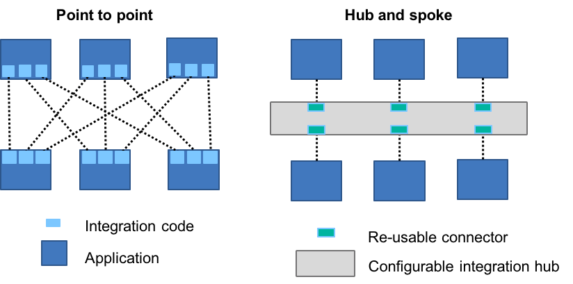
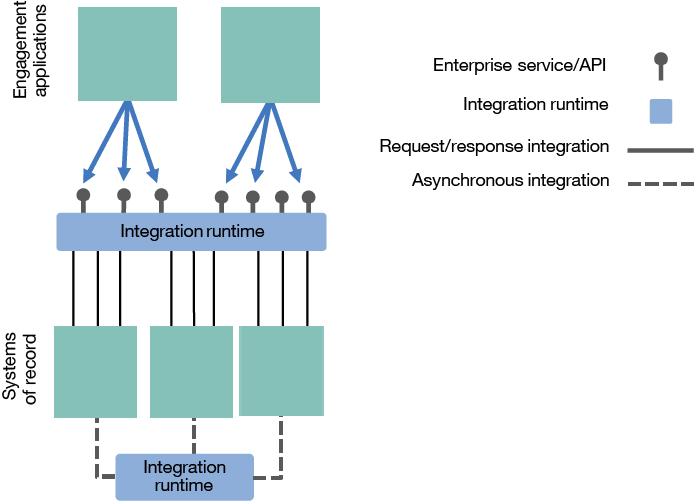
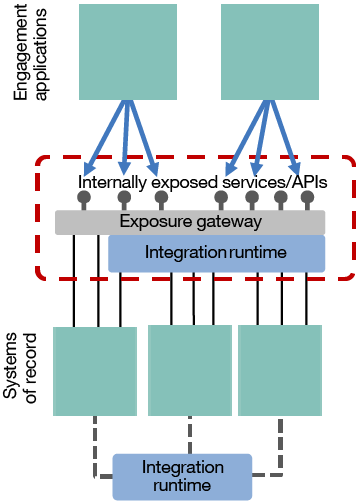
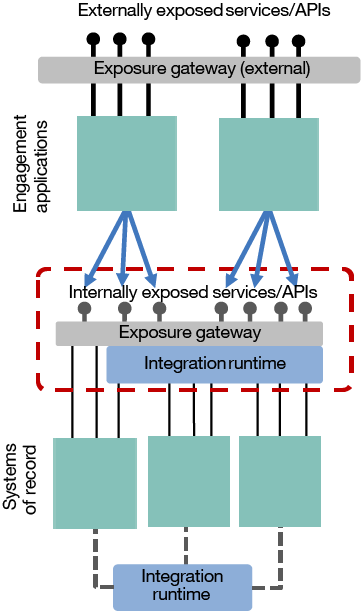
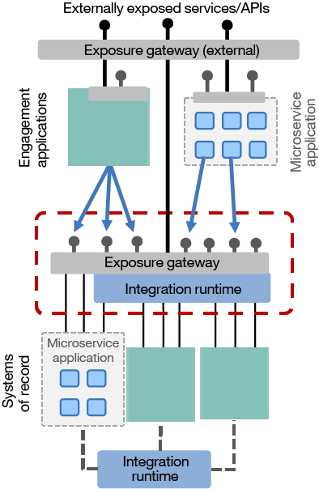
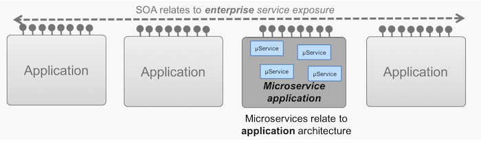

# ESB 的命运
从它在 SOA 时代的起源到促使人们寻找更好方法的挑战

**标签:** API 管理,云计算,容器,微服务

[原文链接](https://developer.ibm.com/zh/articles/cl-lightweight-integration-1/)

Kim Clark

更新: 2018-05-08 \| 发布: 2018-03-28

* * *

在这个包含两部分的系列中，将探索现代集成架构采用何种方法来确保它们能够像相互连接的应用程序一样敏捷。中心化企业服务总线 (ESB) 的模式有其自己的用途，而且在市场上仍有一席之地，但许多企业正在探索更加容器化和去中心化的集成架构方法。

第 1 部分将探索 ESB 的命运。我们不仅会简要分析中心化 ESB 模式如何和为什么会在面向服务架构 (SOA) 时代出现，还会分析它带来的挑战。我们还将考虑在这种情况下能够在何处应用 API，以及所有这一切与微服务架构有何关系。如果不能清楚地了解这段历史，我们就无法充满信心地声明如何在未来做得更好。

> SOA 适用于企业范围，而且着眼于如何在应用程序之间执行集成。微服务架构适用于应用程序范围，而且它会处理如何构建应用程序的内部结构。

[第 2 部分](https://www.ibm.com/developerworks/cn/cloud/library/cl-lightweight-integration-2/index.html) 将介绍更加轻量级和敏捷的集成，分析集成架构如何从微服务背后的技术和原则中获益，从而确保新应用程序能以现代创新的速度和规模来执行它们所需的集成。我们还将探索集成如何从根本上变得更加去中心化，以便为各种业务提供更高的自主性和生产力。

我们首先通过一幅图清楚地描绘中心化 ESB 的结构和起源。

## 区分 ESB 模式与它之前的模式

术语 ESB 常常被非常宽泛地用于描述集成运行时，但无论是从历史上讲还是从架构上讲，这都非常不准确。

如果回顾在千禧年（公元 2000 年）之前，就会发现集成几乎是完全异步的，而且会使用文件和消息在记录系统之间进行集成。如果在每个系统内或周围为每一个点对点集成都编写代码，不但成本高昂，而且会产生一个复杂的交互网络。

##### 点对点模式与中心辐射型模式

采用中心辐射型模式的不可避免的结果是，在所有系统之间引入了一个集成中心，并提供工具来简化连接，支持在一定程度上重用所执行的集成工作。

非常值得注意的是，这种基本异步的中心辐射型架构的出现时间比 ESB 模式早得多。那时还没有公开任何服务。基于事件的中心辐射型交互模式如今仍然很常见，而且您稍后将会看到，由于现代应用程序愈加偏爱通过事件来接收数据，所以这种模式或许正在复兴。所以，明确地讲：即使可以使用相同的集成运行时来有效地实现中心辐射型模式，中心辐射型模式仍然不同于 ESB 模式。

**免费试用 IBM Cloud**

通过 [IBM Cloud Lite](https://cloud.ibm.com/?cm_sp=ibmdev-_-developer-articles-_-cloudreg) 快速轻松地构建您的下一个应用程序。您的免费帐户永不过期，而且您会获得 256 MB 的 Cloud Foundry 运行时内存，以及包含 Kubernetes 集群的 2 GB 存储空间。

## ESB 模式的形成

随着我们进入千禧年，我们看到针对接口的第一个真正的跨平台协议开始崭露头角。互联网及其 HTTP 变得无处不在，XML 的艰难发展使其落后于 HTML，而用于公开同步 Web 服务接口的 SOAP 协议才刚刚成形。这些标准获得了相对广泛的接受，这暗示着一个更加光明的未来，届时任何系统都能发现其他任何系统，并通过实时同步远程过程调用来进行通信，而不像过去一样需要大量集成代码。

经过这一系列事件，面向服务架构 (SOA) 应运而生。SOA 的核心用途是通过格式良好、使用简单的同步接口（比如 Web 服务）公开埋藏在记录系统中的数据和功能。显然，SOA 的目标不仅仅是公开这些服务，往往还涉及一些重大的再设计，以便后端系统能与业务需求保持一致，但最终目标是获得一套可重用的服务。这使得在实现新应用程序时没有了每次都执行深度集成的负担，因为一旦首次完成集成并公开为服务，下一个应用程序就可以重用它。

但是，这种简单集成是一种单边方程。我们或许能够标准化公开协议和数据格式，但后端记录系统本身通常不仅非常老旧，而且它们为其当前接口提供的协议和数据格式也已经过时。我们需要某种工具在旧的系统与新的跨平台协议之间进行调解。

##### 同步公开模式

我们引入了企业服务总线 (ESB) 术语来解释这种通过 Web 服务执行的 _同步_ 公开模式。它的含义不言而喻 — 一个能在整个“企业”中公开 Web “服务”的中心化“总线”。我们已经有集成运行时技术连接至来自中心辐射型模式的后端系统。可以简单地教导这些集成运行时通过 SOAP/HTTP 来同步公开集成，而且我们拥有自己的 ESB。

围绕术语 ESB 的困惑的一种常见来源是，在这一阶段，只有一个实现该模式的组件 — 集成运行时。因此，这个集成运行时通常被简称为 ESB。尽管集成运行时事实上执行了两种不同的模式（中心辐射和服务公开），但它们在架构图上看起来非常相似，以至于被合并到一起。从那时起，术语 ESB 被随意用于称呼集成运行时本身，而不管它执行的是何种模式。

## 中心化 ESB 模式出了什么问题？

事实证明，SOA 比 ESB 的实现更加复杂，这有许多原因 — 其中最重要的问题是谁会为这样一个企业级计划提供资助。事实证明实现 ESB 模式本身也不是一个轻松任务。

ESB 模式往往注重 ESB 中的“E”，为整个企业实现单个 ESB 基础架构，或者至少为企业的每个重要部分实现一个基础架构。一个生产服务器集群上可能安装了数十甚至数百个集成，如果扩展开来，它们会存在于该集群内的每个克隆版本上。尽管 ESB 模式本身不需要如此密集的中心化，但它几乎总是存在于最终的拓扑结构中。至少在最初，此结果有一些合理的理由：硬件和软件成本是共享的，只需要执行一次服务器配置，而且由于软件的相对复杂性，只需要培训一个专门的集成专家团队来执行开发工作。

如果来自某个项目的接口可以重用于下一个项目（这是 SOA 的核心优势计划），中心化的 ESB 模型就能够显著降低集成成本。但是，协调这样一个跨企业的计划并确保它获得持续的资助 — 而且资金仅应用于可充分重用来控制创建成本的服务 — 被证明确实非常困难。在实现 ESB 模式的同时，标准和工具也在不断变成熟，所以公开一个服务的实现成本和时间高得不切实际。

通常，期望加快其新应用创新速度的业务线团队对 SOA 越来越失望，这种失望进而延伸到 ESB 模式。

中心化 ESB 模式的一些挑战包括：

- 向接口部署更改可能会让其他不相关接口变得不稳定，所以通常需要在大量的接口之间执行复杂的回归测试。
- 由于包含大量集成，所以运行时规模庞大，启动和停止它们都非常不合算。它们需要保持运行并尽可能地实时修补。这使得跟踪服务器配置变得很困难，所以很难复制测试和诊断环境，导致对添加变更产生巨大的抗拒。
- 为这些大型服务器创建具有高可用性和灾难恢复功能的拓扑结构需要很高的成本。扩展需要提前规划，增添服务器需要很高的成本。
- 应用新版本中引入的最新中间件补丁和特性是有风险的，因为这可能会影响现有集成，所以服务器通常回退多个版本。这要求集成开发人员为较新版本中不可用的特性创建变通方案。
- 集成专家团队了解集成工具，但往往不理解他们尝试公开的应用程序，这为实现周期增加了更多的前期准备时间。
- 集成仍是一个复杂领域。很少有系统公开优秀的接口，所以深层次技能必不可少。只有少数集成专家在创建、维护和管理集成方面是值得信任的。为了整合这些专家资源，专家们常常组建不同的“SOA”团队，采用瀑布式接收工作的严格规程，向任何应用程序开发项目引入一个单独的依赖项。
- 在那时，人们发现服务还不成熟。集成了服务注册表与运行时组件的选项少之又少。这导致了以下某种结果：要么文档被单独存储并很快过时，要么文档完全不存储，每次重用都需要进行人际互动，这损害了重用在市场投放时间上的承诺。

结果，这个 SOA 专家团队的服务创建过程没有成为预期的推动力量，反而成了项目的瓶颈。随之而来的是，这通常给中心化 ESB 模式造成不良影响。

通常，如我们所描述的，ESB 是一种涉及到公开服务的架构模式。但是，前面已经提到，该术语常常被过度简化，并应用于用来实现该模式的集成引擎。这错误地将静态和老化的中心化 ESB 模式与在此期间快速变化的集成引擎联系起来。

如今的集成引擎更加轻量化，更容易安装和使用，而且能通过在 ESB 模式诞生时无法想象的方式进行部署。让我们看看这些现代运行时如何实现更加轻量型的、去中心化的、完全不同的架构模式。

## 通过一个正式公开网关为 ESB 模式提供补充

公开基于请求/响应的服务，这是 ESB 模式与在它之前更加受事件驱动的中心辐射型模式之间的关键区别。SOAP 风格的 RPC 接口被证明很难理解和使用，使用 JSON/HTTP 公开的更简单、更一致的 RESTful 服务成为了一种流行的公开机制。但是最终目的是相同的：通过标准化的接口来提供功能和数据，以便能基于它们更快地构建新应用程序。

随着这些服务接口在企业内外得到更广泛的使用，更加正式的公开机制也被需求。很快就能清楚看到，通过 Web 服务接口公开一些服务，或者接下来将一些服务公开为 RESTful JSON/HTTP API，这些都只是故事的一部分。服务需要被潜在用户轻松发现，这些用户需要一条阻力最小的路径来访问服务和学习如何使用它。此外，服务或 API 的提供者需要能控制它们的使用，比如流量控制和合适的安全模型。

##### 通过一个单独的服务公开网关来增强 ESB 模式

一些功能可以引入到集成运行时中，但是由于中心化 ESB 模式的重量型和复杂特性，这势必会给本已不堪重负的 ESB 团队添加更多责任。一种常见的替代方法是将服务/API 公开的角色分离到一个单独的网关中。

这些公开功能已演变为目前人们所熟知的 API 管理，实现了对服务/API 公开的简单管理。网关也可以专门负责特定于 API 管理的功能，比如流量管理（速率/吞吐量限制）、加密/解密、编辑，以及安全模式。也可以通过描述可用 API 的门户为网关提供补充，启用自助订购来使用 API，并为 API 的用户和提供者配备分析功能。

更加现代的记录系统已提供了一个基于 HTTP 的接口，这个接口仅需要使用公开网关进行受控公开。仅在执行更复杂的集成（比如更少见的协议、数据格式、多个请求的组合）时，或者在可能需要事务性时，才需要集成运行时。

API 管理层的引入带来了明显的问题：ESB 现在怎么样了？许多人将集成运行时和 ESB 模式视为同一个概念。但事实上，如果 ESB 模式致力于公开服务和 API，那么该模式的边界实际上同时包含集成运行时和公开网关，而在某些情况下，仅包含网关。但是，由于 ESB 与集成运行时的错误关联，我们必须承认，这不是术语 ESB 的典型用法。

## API 扩展到企业边界外

一旦有效公开 API 的机制发展成熟，我们就可以清楚地看到，它们也可以向企业外部公开。最初，这样做是为了创建 _前端的后端 (BFF)_ 模式，这种模式在现代应用程序和单页 Web 应用程序中仍然非常盛行。在这种模式中，API 是专门为前端应用程序而创建的，而且通过合理化的数据模型、理想的操作精细度、专业的安全模型等，能够完美地满足前端应用程序的需求。人们很快认识到，API 可以更广泛地公开，使任何合作伙伴都能编写应用程序，提供一些全新的协作机会。

##### 外部服务/API 网关和 API 经济的开端

这里很难确定准确的历史顺序，因为不同企业的历史各有不同。一些企业的 API 管理概念 _始于_ 对外公开，后来引入内部只是为了给 ESB 模式提供补充。无论顺序如何，外部 API 都已成为许多公司的在线形象的必要部分，而且至少与公司的网站和移动应用程序一样重要。

从逻辑上讲，向企业外部公开 API 只是 ESB 模式的一种扩展，这种扩展更加关注网关和安全性、发现、自助管理等方面。我在 [之前的一篇文章](https://www.ibm.com/developerworks/cn/websphere/library/techarticles/1503_clark/1305_clark.html) 中深入探讨了 API 与 SOA 服务之间的技术区别。例如，人们立刻意识到，从地理和网络角度讲，API 正被可能位于任何地方的用户和设备使用。因此，必须采用不同方式来设计 API，以便将可用带宽和用户使用的设备的功能考虑在内。但是，非技术方面也存在一些差异。您不应低估公开的 API 在业务目标上的差异。与 SOA 中的内部服务一样，对外公开 API 在重用方面的关注更少一些，将更多的关注放在为新业务的特定潜在用户创建服务上。API 让企业有机会大幅扩充其可以合作的创新合作伙伴的数量（实现新概念的众包），而且他们在目前普遍存在的行业颠覆中发挥着重要作用。这种认知导致了我们现在所称的 API 经济，该经济本身就是一个 [值得好好介绍](https://developer.ibm.com/apiconnect/category/api-economy/) 的主题。

这里的主要结论是，这一发展加剧了老旧的传统 _记录系统_ 与称为 _互动参与体系_ 的系统之间越来越大的分歧。记录系统仍执行着所有对业务最重要的事务，而在互动参与体系中，创新正快速涌现，人们探索着与外部用户交互的新方法。这导致了 **双模 IT**，其中新的去中心化、快速发展的 IT 领域在开发上需要更高的敏捷性，并促使人们发明了使用微服务架构构建应用程序的新方法。

## 微服务的出现

之前，我介绍了高度中心化的集成运行时的挑战 — 很难安全快速地执行变更而不影响其他集成，昂贵而又复杂的扩展，等等。听起来很熟悉？确实如此。这些正是应用程序开发团队在此期间遇到的挑战：臃肿、复杂的应用服务器包含太多相互关联、相互依赖的代码，采用了很难复制或扩展的、脆弱、繁琐的拓扑结构。最终，正是这种常见的范例导致微服务架构原则的出现。随着诸如 IBM WAS Liberty 之类的轻量型应用服务器（在几秒内启动且占用资源极少的服务器）的引入，在小型虚拟机上运行这些服务器变得更容易，最终导致可在 Docker 等容器技术中运行它们。

为了满足 IT 对改善敏捷性和可扩展性的无休止的需求，应用程序开发中的下一个逻辑步骤是将应用程序分解为更小的部分，并以彼此完全独立地方式运行它们。最终，这些部分变得足够小，以至于它们值得拥有一个名称，这个名称最终被确定为 **微服务**。或许 **微服务组件** 是个更好的名称，因为这个术语常常导致混淆（正如以前的 [文章](https://www.ibm.com/developerworks/cn/websphere/library/techarticles/1601_clark-trs/1601_clark.html) 和 [视频](https://www.youtube.com/watch?v=YTdTKsm9n14) 中所介绍的那样，尤其是在集成领域中），但现在，“微服务”已变得无处不在。

如果仔细看看微服务概念，就会看到它的目标不仅仅是简单地将应用程序分解为更小的部分。微服务在架构、流程、组织等方面也有意义 — 完全专注于使组织能更有效地利用云原生技术进步来加快其创新步伐。

但是，让我们再次回到核心技术区别这个主题，这些小型的独立微服务组件可以独立更改来实现更高的敏捷性，可以独立扩展来更有效地利用云原生基础架构，还可以更严格地管理（参见我的文章“ [牛不是宠物](http://ibm.biz/CattlePetsIIB)”）来提供 24/7 在线的应用程序所需的灾备能力。

##### 微服务架构：一种构建应用程序的新方法

在理论上，这些原则可以用在任何地方。我们最常看到它们的地方是互动参与体系层，更高的敏捷性在其中必不可少。但是，也可以使用它们来改进记录系统的敏捷性、可扩展性和灾备能力 — 或者您稍后将会看到，它们可以用来改进架构中的其他任何地方。

毫无疑问，在恰当的环境中，微服务原则可以提供大量优势。但是，选择使用这些技术的恰当时机至关重要，而且正确设计高度分布式的组件也意义重大。您只需阅读 [Martin Fowler 对此的看法](https://martinfowler.com/articles/distributed-objects-microservices.html)，就可以了解所显现的困境。在一天结束时，决定微服务组件的形状和大小只是故事的一部分；对于您解耦它们的程度，也有一组同样关键的设计选择，而且您需要不断平衡实际现状与对微服务相关收益的期望。尽管解耦是微服务的基础，但这不意味着完全解耦始终是好的微服务设计。良好的设计始终是一种妥协。简言之， _您的设计有多好，方法有多成熟，您基于微服务的应用程序的敏捷性和可扩展性就有多高。_

## 比较 SOA 与微服务架构

人们很容易将微服务架构与 SOA 进行比较，尤其是因为它们具有许多共同的术语。但是，您会看到，这种比较只会产生误导，因为这些术语适用于两个完全不同的范围。

##### SOA 是企业范围的，微服务架构是应用程序范围的

面向服务架构是一种创建可重用、同步可用服务和 API 的 _企业级_ 计划，因此可通过合并来自其他系统的数据来更快地创建新应用程序。

另一方面，微服务架构是您选择如何编写 _各个应用程序_ 的一个选项，它使应用程序具有更高的敏捷性、可扩展性和灾备能力。

认识到范围上的这种差异至关重要，因为如果应用在相同的范围上，每种方法的一些核心原则可能完全不兼容。例如：

- **重用：** 在 SOA 中，集成的重用是主要目标，而在企业级别上，努力实现一定程度的重用是必不可少的。在微服务架构中，如果创建可在整个应用程序运行时中重用的微服务组件，则会产生降低敏捷性和灾备能力的依赖影响。微服务组件一般指的是通过副本来重用代码，并接受数据副本来改进组件之间的解耦程度（您稍后将会看到）。
- **同步调用：** 可以使用 RESTful API 等主要同步协议在整个企业中公开 SOA 中的可重用服务。但是，在微服务应用程序 _内_，同步调用会引入实时依赖关系，导致灾备能力受损，还会导致影响性能的延迟。在微服务应用程序 _内_，基于异步通信的交互模式是首选的，比如在事件溯源过程中，可以使用一种发布订阅模型让一个微服务组件时刻更新另一个组件中对数据执行的更改。
- **数据复制：** 在 SOA 中，公开服务的一个明确目标是让所有应用程序直接从主要来源获得数据并执行更改，这减少了维护复杂的数据同步模式的需求。在微服务应用程序中，每个微服务在理想情况下都可以在本地访问它需要的所有数据，以确保它与其他微服务独立，而且还与其他应用程序独立 — 即使这意味着在某种程度上会复制其他系统中的数据。当然，这种复制增加了复杂性，所以需要在它和敏捷性及性能提升之间进行平衡，但这已被公认为一种微服务设计现状。由于微服务中的数据复制如此流行，所以还需要对每种类型的数据的事实来源达成一致。

因此，综上所述，SOA 适用于 _企业_ 范围，并在研究如何在应用程序之间执行集成。微服务架构适用于 _应用程序_ 范围，处理如何构建应用程序的内部结构。这是对一种更复杂的争议的相对快捷的解释（一篇 [单独文章](https://www.ibm.com/developerworks/cn/websphere/library/techarticles/1601_clark-trs/1601_clark.html) 中全面探讨了这一争议），但它提供了我们这里所需的关键概念。

## 在集成中使用微服务原则

所以如果以更精细的方式构建应用程序是有意义的，为什么不将这一概念也应用到集成中呢？您可以将企业级的中心化 ESB 组件分解为更小、更容易管理、更专用的组件。或许您可以为您公开的每个接口提供一个集成运行时。

这种模式通常称为 **敏捷集成架构** ，以便与完整的微服务应用程序架构区分开来，也与 ESB 术语区分开来。ESB 术语与更麻烦的中心化集成架构紧密相关。

在 [第 2 部分](https://www.ibm.com/developerworks/cn/cloud/library/cl-lightweight-integration-2/index.html?ca=drs-)，我将更详细地介绍敏捷集成架构，看看集成架构如何从微服务背后的技术和原则中获益。这可以确保新的应用程序能够以现代创新的速度和规模来执行它们所需的集成。

## 致谢

感谢以下人员为本文的材料提供建议和评审：Andy Garratt、Nick Glowacki、Rob Nicholson、Brian Petrini 和 Claudio Tagliabue。

本文翻译自： [The fate of the ESB](https://developer.ibm.com/articles/cl-lightweight-integration-1/)（2018-05-01）