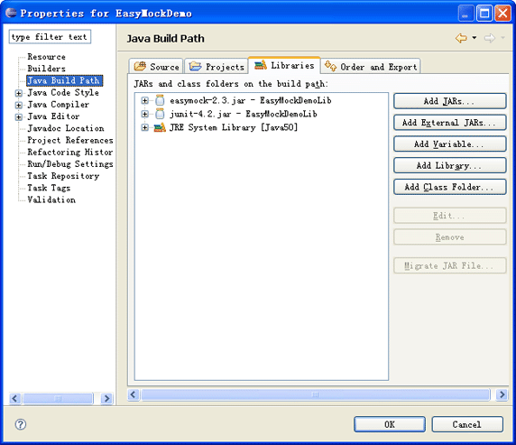
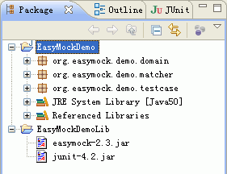
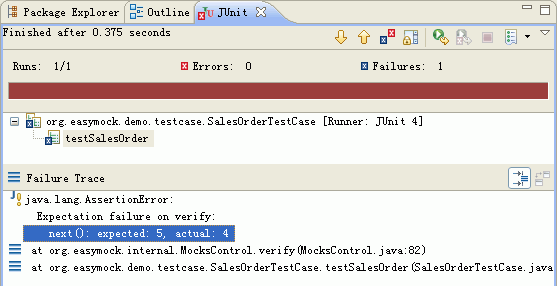
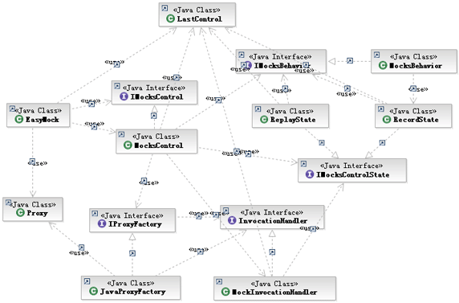
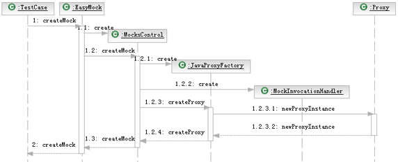
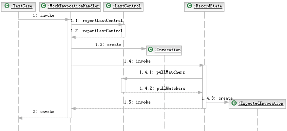
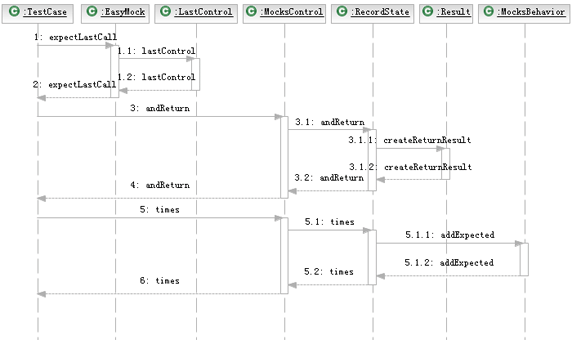
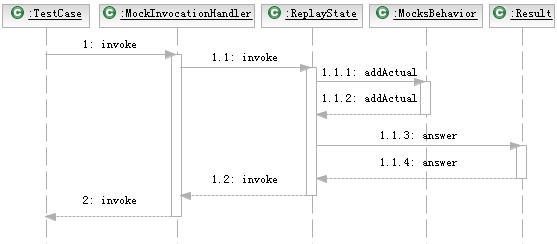

# EasyMock 使用方法与原理剖析
帮助你掌握 EasyMock

**标签:** DevOps

[原文链接](https://developer.ibm.com/zh/articles/os-cn-easymock/)

郑闽睿, 黄湘平

发布: 2007-10-25

* * *

Mock 方法是单元测试中常见的一种技术，它的主要作用是模拟一些在应用中不容易构造或者比较复杂的对象，从而把测试与测试边界以外的对象隔离开。

编写自定义的 Mock 对象需要额外的编码工作，同时也可能引入错误。EasyMock 提供了根据指定接口动态构建 Mock 对象的方法，避免了手工编写 Mock 对象。本文将向您展示如何使用 EasyMock 进行单元测试，并对 EasyMock 的原理进行分析。

## Mock 对象与 EasyMock 简介

### 单元测试与 Mock 方法

单元测试是对应用中的某一个模块的功能进行验证。在单元测试中，我们常遇到的问题是应用中其它的协同模块尚未开发完成，或者被测试模块需要和一些不容易构造、比较复杂的对象进行交互。另外，由于不能肯定其它模块的正确性，我们也无法确定测试中发现的问题是由哪个模块引起的。

Mock 对象能够模拟其它协同模块的行为，被测试模块通过与 Mock 对象协作，可以获得一个孤立的测试环境。此外，使用 Mock 对象还可以模拟在应用中不容易构造（如 HttpServletRequest 必须在 Servlet 容器中才能构造出来）和比较复杂的对象（如 JDBC 中的 ResultSet 对象），从而使测试顺利进行。

### EasyMock 简介

手动的构造 Mock 对象会给开发人员带来额外的编码量，而且这些为创建 Mock 对象而编写的代码很有可能引入错误。目前，有许多开源项目对动态构建 Mock 对象提供了支持，这些项目能够根据现有的接口或类动态生成，这样不仅能避免额外的编码工作，同时也降低了引入错误的可能。

EasyMock 是一套用于通过简单的方法对于给定的接口生成 Mock 对象的类库。它提供对接口的模拟，能够通过录制、回放、检查三步来完成大体的测试过程，可以验证方法的调用种类、次数、顺序，可以令 Mock 对象返回指定的值或抛出指定异常。通过 EasyMock，我们可以方便的构造 Mock 对象从而使单元测试顺利进行。

### 安装 EasyMock

EasyMock 是采用 MIT license 的一个开源项目，您可以在 Sourceforge 上下载到相关的 zip 文件。目前您可以下载的 EasyMock 最新版本是2.3，它需要运行在 Java 5.0 平台上。如果您的应用运行在 Java 1.3 或 1.4 平台上，您可以选择 EasyMock1.2。在解压缩 zip 包后，您可以找到 easymock.jar 这个文件。如果您使用 Eclipse 作为 IDE，把 easymock.jar 添加到项目的 Libraries 里就可以使用了（如下图所示）。此外，由于我们的测试用例运行在 JUnit 环境中，因此您还需要 JUnit.jar（版本3.8.1以上）。

##### 图 1\. Eclipse 项目中的 Libraries



## 使用 EasyMock 进行单元测试

通过 EasyMock，我们可以为指定的接口动态的创建 Mock 对象，并利用 Mock 对象来模拟协同模块或是领域对象，从而使单元测试顺利进行。这个过程大致可以划分为以下几个步骤：

- 使用 EasyMock 生成 Mock 对象；
- 设定 Mock 对象的预期行为和输出；
- 将 Mock 对象切换到 Replay 状态；
- 调用 Mock 对象方法进行单元测试；
- 对 Mock 对象的行为进行验证。

接下来，我们将对以上的几个步骤逐一进行说明。除了以上的基本步骤外，EasyMock 还对特殊的 Mock 对象类型、特定的参数匹配方式等功能提供了支持，我们将在之后的章节中进行说明。

### 使用 EasyMock 生成 Mock 对象

根据指定的接口或类，EasyMock 能够动态的创建 Mock 对象（EasyMock 默认只支持为接口生成 Mock 对象，如果需要为类生成 Mock 对象，在 EasyMock 的主页上有扩展包可以实现此功能），我们以 `ResultSet` 接口为例说明EasyMock的功能。 `java.sql.ResultSet` 是每一个 Java 开发人员都非常熟悉的接口：

##### 清单 1\. ResultSet 接口

```
public interface java.sql.ResultSet {
......
public abstract java.lang.String getString(int arg0) throws java.sql.SQLException;
public abstract double getDouble(int arg0) throws java.sql.SQLException;
......
}

```

Show moreShow more icon

通常，构建一个真实的 `RecordSet` 对象需要经过一个复杂的过程：在开发过程中，开发人员通常会编写一个 `DBUtility` 类来获取数据库连接 `Connection` ，并利用 `Connection` 创建一个 `Statement` 。执行一个 `Statement` 可以获取到一个或多个 `ResultSet` 对象。这样的构造过程复杂并且依赖于数据库的正确运行。数据库或是数据库交互模块出现问题，都会影响单元测试的结果。

我们可以使用 EasyMock 动态构建 `ResultSet` 接口的 Mock 对象来解决这个问题。一些简单的测试用例只需要一个 Mock 对象，这时，我们可以用以下的方法来创建 Mock 对象：

```
ResultSet mockResultSet = createMock(ResultSet.class);

```

Show moreShow more icon

其中 `createMock` 是 `org.easymock.EasyMock` 类所提供的静态方法，你可以通过 static import 将其引入（注：static import 是 java 5.0 所提供的新特性）。

如果需要在相对复杂的测试用例中使用多个 Mock 对象，EasyMock 提供了另外一种生成和管理 Mock 对象的机制：

```
IMocksControl control = EasyMock.createControl();
java.sql.Connection mockConnection = control.createMock(Connection.class);
java.sql.Statement mockStatement = control.createMock(Statement.class);
java.sql.ResultSet mockResultSet = control.createMock(ResultSet.class);

```

Show moreShow more icon

`EasyMock` 类的 `createControl` 方法能创建一个接口 `IMocksControl` 的对象，该对象能创建并管理多个 Mock 对象。如果需要在测试中使用多个 Mock 对象，我们推荐您使用这一机制，因为它在多个 Mock 对象的管理上提供了相对便捷的方法。

如果您要模拟的是一个具体类而非接口，那么您需要下载扩展包 EasyMock Class Extension 2.2.2。在对具体类进行模拟时，您只要用 `org.easymock.classextension.EasyMock` 类中的静态方法代替 `org.easymock.EasyMock` 类中的静态方法即可。

### 设定 Mock 对象的预期行为和输出

在一个完整的测试过程中，一个 Mock 对象将会经历两个状态：Record 状态和 Replay 状态。Mock 对象一经创建，它的状态就被置为 Record。在 Record 状态，用户可以设定 Mock 对象的预期行为和输出，这些对象行为被录制下来，保存在 Mock 对象中。

添加 Mock 对象行为的过程通常可以分为以下3步：

- 对 Mock 对象的特定方法作出调用；
- 通过 `org.easymock.EasyMock` 提供的静态方法 `expectLastCall` 获取上一次方法调用所对应的 IExpectationSetters 实例；
- 通过 `IExpectationSetters` 实例设定 Mock 对象的预期输出。

#### 设定预期返回值

Mock 对象的行为可以简单的理解为 Mock 对象方法的调用和方法调用所产生的输出。在 EasyMock 2.3 中，对 Mock 对象行为的添加和设置是通过接口 `IExpectationSetters` 来实现的。Mock 对象方法的调用可能产生两种类型的输出：（1）产生返回值；（2）抛出异常。接口 `IExpectationSetters` 提供了多种设定预期输出的方法，其中和设定返回值相对应的是 andReturn 方法：

```
IExpectationSetters<T> andReturn(T value);

```

Show moreShow more icon

我们仍然用 `ResultSet` 接口的 Mock 对象为例，如果希望方法 `mockResult.getString(1)` 的返回值为 “My return value”，那么你可以使用以下的语句：

```
mockResultSet.getString(1);
expectLastCall().andReturn("My return value");

```

Show moreShow more icon

以上的语句表示 `mockResultSet` 的 `getString` 方法被调用一次，这次调用的返回值是 “My return value”。有时，我们希望某个方法的调用总是返回一个相同的值，为了避免每次调用都为 Mock 对象的行为进行一次设定，我们可以用设置默认返回值的方法：

```
void andStubReturn(Object value);

```

Show moreShow more icon

假设我们创建了 `Statement` 和 `ResultSet` 接口的 Mock 对象 mockStatement 和 mockResultSet，在测试过程中，我们希望 mockStatement 对象的 `executeQuery` 方法总是返回 mockResultSet，我们可以使用如下的语句

```
mockStatement.executeQuery("SELECT * FROM sales_order_table");
expectLastCall().andStubReturn(mockResultSet);

```

Show moreShow more icon

EasyMock 在对参数值进行匹配时，默认采用 `Object.equals()` 方法。因此，如果我们以 `"select * from sales_order_table"` 作为参数，预期方法将不会被调用。如果您希望上例中的 SQL 语句能不区分大小写，可以用特殊的参数匹配器来解决这个问题，我们将在 “在 EasyMock 中使用参数匹配器” 一章对此进行说明。

#### 设定预期异常抛出

对象行为的预期输出除了可能是返回值外，还有可能是抛出异常。 `IExpectationSetters` 提供了设定预期抛出异常的方法：

```
IExpectationSetters<T> andThrow(Throwable throwable);

```

Show moreShow more icon

和设定默认返回值类似， `IExpectationSetters` 接口也提供了设定抛出默认异常的函数：

```
void andStubThrow(Throwable throwable);

```

Show moreShow more icon

#### 设定预期方法调用次数

通过以上的函数，您可以对 Mock 对象特定行为的预期输出进行设定。除了对预期输出进行设定， `IExpectationSetters` 接口还允许用户对方法的调用次数作出限制。在 `IExpectationSetters` 所提供的这一类方法中，常用的一种是 `times` 方法：

```
IExpectationSetters<T>times(int count);

```

Show moreShow more icon

该方法可以 Mock 对象方法的调用次数进行确切的设定。假设我们希望 mockResultSet 的 `getString` 方法在测试过程中被调用3次，期间的返回值都是 “My return value”，我们可以用如下语句：

```
mockResultSet.getString(1);
expectLastCall().andReturn("My return value").times(3);

```

Show moreShow more icon

注意到 `andReturn` 和 `andThrow` 方法的返回值依然是一个 `IExpectationSetters` 实例，因此我们可以在此基础上继续调用 `times` 方法。

除了设定确定的调用次数， `IExpectationSetters` 还提供了另外几种设定非准确调用次数的方法：

`times(int minTimes, int maxTimes)` ：该方法最少被调用 minTimes 次，最多被调用 maxTimes 次。

`atLeastOnce()` ：该方法至少被调用一次。

`anyTimes()` ：该方法可以被调用任意次。

某些方法的返回值类型是 void，对于这一类方法，我们无需设定返回值，只要设置调用次数就可以了。以 `ResultSet` 接口的 `close` 方法为例，假设在测试过程中，该方法被调用3至5次：

```
mockResultSet.close();
expectLastCall().times(3, 5);

```

Show moreShow more icon

为了简化书写，EasyMock 还提供了另一种设定 Mock 对象行为的语句模式。对于上例，您还可以将它写成：

```
expect(mockResult.close()).times(3, 5);

```

Show moreShow more icon

这个语句和上例中的语句功能是完全相同的。

### 将 Mock 对象切换到 Replay 状态

在生成 Mock 对象和设定 Mock 对象行为两个阶段，Mock 对象的状态都是 Record 。在这个阶段，Mock 对象会记录用户对预期行为和输出的设定。

在使用 Mock 对象进行实际的测试前，我们需要将 Mock 对象的状态切换为 Replay。在 Replay 状态，Mock 对象能够根据设定对特定的方法调用作出预期的响应。将 Mock 对象切换成 Replay 状态有两种方式，您需要根据 Mock 对象的生成方式进行选择。如果 Mock 对象是通过 `org.easymock.EasyMock` 类提供的静态方法 createMock 生成的（第1节中介绍的第一种 Mock 对象生成方法），那么 `EasyMock` 类提供了相应的 replay 方法用于将 Mock 对象切换为 Replay 状态：

```
replay(mockResultSet);

```

Show moreShow more icon

如果 Mock 对象是通过 `IMocksControl` 接口提供的 `createMock` 方法生成的（第1节中介绍的第二种Mock对象生成方法），那么您依旧可以通过 `IMocksControl` 接口对它所创建的所有 Mock 对象进行切换：

```
control.replay();

```

Show moreShow more icon

以上的语句能将在第1节中生成的 mockConnection、mockStatement 和 mockResultSet 等3个 Mock 对象都切换成 Replay 状态。

### 调用 Mock 对象方法进行单元测试

为了更好的说明 EasyMock 的功能，我们引入 src.zip 中的示例来解释 Mock 对象在实际测试阶段的作用。其中所有的示例代码都可以在 src.zip 中找到。如果您使用的 IDE 是 Eclipse，在导入 src.zip 之后您可以看到 Workspace 中增加的 project（如下图所示）。

##### 图 2\. 导入 src.zip 后的 Workspace



下面是示例代码中的一个接口 `SalesOrder` ，它的实现类 `SalesOrderImpl` 的主要功能是从数据库中读取一个 Sales Order 的 Region 和 Total Price，并根据读取的数据计算该 Sales Order 的 Price Level（完整的实现代码都可以在 src.zip 中找到）：

##### 清单 2\. SalesOrder 接口

```
public interface SalesOrder
{
......
public void loadDataFromDB(ResultSet resultSet) throws SQLException;
public String getPriceLevel();
}

```

Show moreShow more icon

其实现类 `SalesOrderImpl` 中对 `loadDataFromDB` 的实现如下：

##### 清单 3\. SalesOrderImpl 实现

```
public class SalesOrderImpl implements SalesOrder
{
......
public void loadDataFromDB(ResultSet resultSet) throws SQLException
{
    orderNumber = resultSet.getString(1);
    region = resultSet.getString(2);
    totalPrice = resultSet.getDouble(3);
}
......
}

```

Show moreShow more icon

方法 `loadDataFromDB` 读取了 `ResultSet` 对象包含的数据。当我们将之前定义的 Mock 对象调整为 Replay 状态，并将该对象作为参数传入，那么 Mock 对象的方法将会返回预先定义的预期返回值。完整的 TestCase 如下：

##### 清单 4\. 完整的TestCase

```
public class SalesOrderTestCase extends TestCase {
public void testSalesOrder() {
    IMocksControl control = EasyMock.createControl();
    ......
    ResultSet mockResultSet = control.createMock(ResultSet.class);
    try {
      ......
      mockResultSet.next();
      expectLastCall().andReturn(true).times(3);
      expectLastCall().andReturn(false).times(1);
      mockResultSet.getString(1);
      expectLastCall().andReturn("DEMO_ORDER_001").times(1);
      expectLastCall().andReturn("DEMO_ORDER_002").times(1);
      expectLastCall().andReturn("DEMO_ORDER_003").times(1);
      mockResultSet.getString(2);
      expectLastCall().andReturn("Asia Pacific").times(1);
      expectLastCall().andReturn("Europe").times(1);
      expectLastCall().andReturn("America").times(1);
      mockResultSet.getDouble(3);
      expectLastCall().andReturn(350.0).times(1);
      expectLastCall().andReturn(1350.0).times(1);
      expectLastCall().andReturn(5350.0).times(1);
      control.replay();
      ......
      int i = 0;
      String[] priceLevels = { "Level_A", "Level_C", "Level_E" };
      while (mockResultSet.next()) {
        SalesOrder order = new SalesOrderImpl();
        order.loadDataFromDB(mockResultSet);
        assertEquals(order.getPriceLevel(), priceLevels[i]);
        i++;
      }
      control.verify();
    } catch (Exception e) {
      e.printStackTrace();
    }
}
}

```

Show moreShow more icon

在这个示例中，我们首先创建了 `ResultSet` 的 Mock 对象 moResultSet，并记录该 Mock 对象的预期行为。之后我们调用了 `control.replay()` ，将 Mock 对象的状态置为 Replay 状态。 在实际的测试阶段，Sales Order 对象的 `loadDataFromDB` 方法调用了 mockResultSet 对象的 `getString` 和 `getDouble` 方法读取 mockResultSet 中的数据。Sales Order 对象根据读取的数据计算出 Price Level，并和预期输出进行比较。

### 对 Mock 对象的行为进行验证

在利用 Mock 对象进行实际的测试过程之后，我们还有一件事情没有做：对 Mock 对象的方法调用的次数进行验证。

为了验证指定的方法调用真的完成了，我们需要调用 `verify` 方法进行验证。和 `replay` 方法类似，您需要根据 Mock 对象的生成方式来选用不同的验证方式。如果 Mock 对象是由 `org.easymock.EasyMock` 类提供的 `createMock` 静态方法生成的，那么我们同样采用 `EasyMock` 类的静态方法 `verify` 进行验证：

```
verify(mockResultSet);

```

Show moreShow more icon

如果Mock对象是有 `IMocksControl` 接口所提供的 `createMock` 方法生成的，那么采用该接口提供的 `verify` 方法，例如第1节中的 `IMocksControl` 实例 control：

```
control.verify();

```

Show moreShow more icon

将对 control 实例所生成的 Mock 对象 mockConnection、mockStatement 和 mockResultSet 等进行验证。如果将上例中 `expectLastCall().andReturn(false).times(1)` 的预期次数修改为2，在 Eclipse 中将可以看到：

##### 图 3\. Mock对象验证失败



### Mock 对象的重用

为了避免生成过多的 Mock 对象，EasyMock 允许对原有 Mock 对象进行重用。要对 Mock 对象重新初始化，我们可以采用 reset 方法。和 replay 和 verify 方法类似，EasyMock 提供了两种 reset 方式：（1）如果 Mock 对象是由 `org.easymock.EasyMock` 类中的静态方法 `createMock` 生成的，那么该 Mock 对象的可以用 `EasyMock` 类的静态方法 `reset` 重新初始化；（2）如果 Mock 方法是由 `IMocksControl` 实例的 `createMock` 方法生成的，那么该 `IMocksControl` 实例方法 `reset` 的调用将会把所有该实例创建的 Mock 对象重新初始化。

在重新初始化之后，Mock 对象的状态将被置为 Record 状态。

## 在 EasyMock 中使用参数匹配器

### EasyMock 预定义的参数匹配器

在使用 Mock 对象进行实际的测试过程中，EasyMock 会根据方法名和参数来匹配一个预期方法的调用。EasyMock 对参数的匹配默认使用 `equals()` 方法进行比较。这可能会引起一些问题。例如在上一章节中创建的mockStatement对象：

```
mockStatement.executeQuery("SELECT * FROM sales_order_table");
expectLastCall().andStubReturn(mockResultSet);

```

Show moreShow more icon

在实际的调用中，我们可能会遇到 SQL 语句中某些关键字大小写的问题，例如将 SELECT 写成 Select，这时在实际的测试中，EasyMock 所采用的默认匹配器将认为这两个参数不匹配，从而造成 Mock 对象的预期方法不被调用。EasyMock 提供了灵活的参数匹配方式来解决这个问题。如果您对 mockStatement 具体执行的语句并不关注，并希望所有输入的字符串都能匹配这一方法调用，您可以用 `org.easymock.EasyMock` 类所提供的 `anyObject` 方法来代替参数中的 SQL 语句：

```
mockStatement.executeQuery( anyObject() );
expectLastCall().andStubReturn(mockResultSet);

```

Show moreShow more icon

`anyObject` 方法表示任意输入值都与预期值相匹配。除了 `anyObject` 以外，EasyMock还提供了多个预先定义的参数匹配器，其中比较常用的一些有：

- `aryEq(X value)` ：通过 `Arrays.equals()` 进行匹配，适用于数组对象；
- `isNull()` ：当输入值为Null时匹配；
- `notNull()` ：当输入值不为Null时匹配；
- `same(X value)` ：当输入值和预期值是同一个对象时匹配；
- `lt(X value), leq(X value), geq(X value), gt(X value)` ：当输入值小于、小等于、大等于、大于预期值时匹配，适用于数值类型；
- `startsWith(String prefix), contains(String substring), endsWith(String suffix)` ：当输入值以预期值开头、包含预期值、以预期值结尾时匹配，适用于String类型；
- `matches(String regex)` ：当输入值与正则表达式匹配时匹配，适用于String类型。

### 自定义参数匹配器

预定义的参数匹配器可能无法满足一些复杂的情况，这时你需要定义自己的参数匹配器。在上一节中，我们希望能有一个匹配器对 SQL 中关键字的大小写不敏感，使用 `anyObject` 其实并不是一个好的选择。对此，我们可以定义自己的参数匹配器 SQLEquals。

要定义新的参数匹配器，需要实现 `org.easymock.IArgumentMatcher` 接口。其中， `matches(Object actual)` 方法应当实现输入值和预期值的匹配逻辑，而在 `appendTo(StringBuffer buffer)` 方法中，你可以添加当匹配失败时需要显示的信息。以下是 SQLEquals 实现的部分代码（完整的代码可以在 src.zip 中找到）：

##### 清单 5\. 自定义参数匹配器SQLEquals

```
public class SQLEquals implements IArgumentMatcher {
private String expectedSQL = null;
public SQLEquals(String expectedSQL) {
    this.expectedSQL = expectedSQL;
}
......
public boolean matches(Object actualSQL) {
    if (actualSQL == null && expectedSQL == null)
      return true;
    else if (actualSQL instanceof String)
      return expectedSQL.equalsIgnoreCase((String) actualSQL);
    else
      return false;
}
}

```

Show moreShow more icon

在实现了 `IArgumentMatcher` 接口之后，我们需要写一个静态方法将它包装一下。这个静态方法的实现需要将 SQLEquals 的一个对象通过 `reportMatcher` 方法报告给EasyMock：

##### 清单 6\. 自定义参数匹配器 SQLEquals 静态方法

```
public static String sqlEquals(String in) {
reportMatcher(new SQLEquals(in));
return in;
}

```

Show moreShow more icon

这样，我们自定义的 sqlEquals 匹配器就可以使用了。我们可以将上例中的 `executeQuery` 方法设定修改如下：

```
mockStatement.executeQuery(sqlEquals("SELECT * FROM sales_order_table"));
expectLastCall().andStubReturn(mockResultSet);

```

Show moreShow more icon

在使用 `executeQuery("select * from sales_order_table")` 进行方法调用时，该预期行为将被匹配。

## 特殊的 Mock 对象类型

到目前为止，我们所创建的 Mock 对象都属于 EasyMock 默认的 Mock 对象类型，它对预期方法的调用次序不敏感，对非预期的方法调用抛出 AssertionError。除了这种默认的 Mock 类型以外，EasyMock 还提供了一些特殊的 Mock 类型用于支持不同的需求。

### Strick Mock 对象

如果 Mock 对象是通过 `EasyMock.createMock()` 或是 `IMocksControl.createMock()` 所创建的，那么在进行 verify 验证时，方法的调用顺序是不进行检查的。如果要创建方法调用的先后次序敏感的 Mock 对象（Strick Mock），应该使用 `EasyMock.createStrickMock()` 来创建，例如：

```
ResultSet strickMockResultSet = createStrickMock(ResultSet.class);

```

Show moreShow more icon

类似于 createMock，我们同样可以用 `IMocksControl` 实例来创建一个 Strick Mock 对象：

```
IMocksControl control = EasyMock.createStrictControl();
ResultSet strickMockResultSet = control.createMock(ResultSet.class);

```

Show moreShow more icon

### Nice Mock 对象

使用 `createMock()` 创建的 Mock 对象对非预期的方法调用默认的行为是抛出 AssertionError，如果需要一个默认返回0，null 或 false 等”无效值”的 “Nice Mock” 对象，可以通过 `EasyMock` 类提供的 `createNiceMock()` 方法创建。类似的，你也可以用 `IMocksControl` 实例来创建一个 Nice Mock 对象。

## EasyMock 的工作原理

EasyMock 是如何为一个特定的接口动态创建 Mock 对象，并记录 Mock 对象预期行为的呢？其实，EasyMock 后台处理的主要原理是利用 `java.lang.reflect.Proxy` 为指定的接口创建一个动态代理，这个动态代理，就是我们在编码中用到的 Mock 对象。EasyMock 还为这个动态代理提供了一个 `InvocationHandler` 接口的实现，这个实现类的主要功能就是将动态代理的预期行为记录在某个映射表中和在实际调用时从这个映射表中取出预期输出。下图是 EasyMock 中主要的功能类：

##### 图 4\. EasyMock主要功能类



和开发人员联系最紧密的是 `EasyMock` 类，这个类提供了 `createMock、replay、verify` 等方法以及所有预定义的参数匹配器。

我们知道 Mock 对象有两种创建方式：一种是通过 `EasyMock` 类提供的 `createMock` 方法创建，另一种是通过 `EasyMock` 类的 `createControl` 方法得到一个 `IMocksControl` 实例，再由这个 `IMocksControl` 实例创建 Mock 对象。其实，无论通过哪种方法获得 Mock 对象，EasyMock 都会生成一个 `IMocksControl` 的实例，只不过第一种方式中的 `IMocksControl` 的实例对开发人员不可见而已。这个 `IMocksControl` 的实例，其实就是 `MocksControl` 类的一个对象。 `MocksControl` 类提供了 `andReturn、andThrow、times、createMock` 等方法。

`MocksControl` 类中包含了两个重要的成员变量，分别是接口 `IMocksBehavior` 和 `IMocksControlState` 的实例。其中， `IMocksBehavior` 的实现类 `MocksBehavior` 是 EasyMock 的核心类，它保存着一个 `ExpectedInvocationAndResult` 对象的一个列表，而 `ExpectedInvocationAndResult` 对象中包含着 Mock 对象方法调用和预期结果的映射。 `MocksBehavior` 类提供了 `addExpected` 和 `addActual` 方法用于添加预期行为和实际调用。

`MocksControl` 类中包含的另一个成员变量是 `IMocksControlState` 实例。 `IMocksControlState` 拥有两个不同的实现类： `RecordState` 和 `ReplayState` 。顾名思义， `RecordState` 是 Mock 对象在 Record 状态时的支持类，它提供了 `invoke` 方法在 Record 状态下的实现。此外，它还提供了 `andReturn、andThrow、times` 等方法的实现。 `ReplayState` 是 Mock 对象在 Replay 状态下的支持类，它提供了 `invoke` 方法在 Replay 状态下的实现。在 ReplayState 中， `andReturn、andThrow、times` 等方法的实现都是抛出IllegalStateException，因为在 Replay 阶段，开发人员不应该再调用这些方法。

当我们调用 `MocksControl` 的 `createMock` 方法时，该方法首先会生成一个 `JavaProxyFactory` 类的对象。 `JavaProxyFactory` 是接口 `IProxyFactory` 的实现类，它的主要功能就是通过 `java.lang.reflect.Proxy` 对指定的接口创建动态代理实例，也就是开发人员在外部看到的 Mock 对象。

在创建动态代理的同时，应当提供 `InvocationHandler` 的实现类。 `MockInvocationHandler` 实现了这个接口，它的 `invoke` 方法主要的功能是根据 Mock 对象状态的不同而分别调用 `RecordState` 的 `invoke` 实现或是 `ReplayState` 的 `invoke` 实现。

### 创建 Mock 对象

下图是创建 Mock 对象的时序图：

##### 图 5\. 创建 Mock 对象时序图



当 `EasyMock` 类的 `createMock` 方法被调用时，它首先创建一个 `MocksControl` 对象，并调用该对象的 `createMock` 方法创建一个 `JavaProxyFactory` 对象和一个 `MockInvocationHandler` 对象。 `JavaProxyFactory` 对象将 `MockInvocationHandler` 对象作为参数，通过 `java.lang.reflect.Proxy` 类的 `newProxyInstance` 静态方法创建一个动态代理。

### 记录 Mock 对象预期行为

记录 Mock 的预期行为可以分为两个阶段：预期方法的调用和预期输出的设定。在外部程序中获得的 Mock 对象，其实就是由 `JavaProxyFactory` 创建的指定接口的动态代理，所有外部程序对接口方法的调用，都会指向 `InvocationHandler` 实现类的 `invoke` 方法。在 EasyMock 中，这个实现类是 `MockInvocationHandler` 。下图是调用预期方法的时序图：

##### 图 6\. 调用预期方法时序图



当 `MockInvocationHandler` 的 `invoke` 方法被调用时，它首先通过 `reportLastControl` 静态方法将 Mock 对象对应的 `MocksControl` 对象报告给 `LastControl` 类， `LastControl` 类将该对象保存在一个 ThreadLocal 变量中。接着， `MockInvocationHandler` 将创建一个 Invocation 对象，这个对象将保存预期调用的 Mock 对象、方法和预期参数。

在记录 Mock 对象预期行为时，Mock 对象的状态是 Record 状态，因此 `RecordState` 对象的 `invoke` 方法将被调用。这个方法首先调用 `LastControl` 的 `pullMatchers` 方法获取参数匹配器。如果您还记得自定义参数匹配器的过程，应该能想起参数匹配器被调用时会将实现类的实例报告给 EasyMock，而这个实例最终保存在 `LastControl` 中。如果没有指定参数匹配器，默认的匹配器将会返回给 `RecordState` 。

根据 `Invocation` 对象和参数匹配器， `RecordState` 将创建一个 `ExpectedInvocation` 对象并保存下来。

在对预期方法进行调用之后，我们可以对该方法的预期输出进行设定。我们以

```
expectLastCall().andReturn(X value).times(int times)

```

Show moreShow more icon

为例说明。如果 `times` 方法未被显式的调用，EasyMock 会默认作为 `times(1)` 处理。下图是设定预期输出的时序图：

##### 图 7\. 设定预期输出时序图



在预期方法被调用时，Mock 对象对应的 `MocksControl` 对象引用已经记录在 `LastControl` 中， `expectLastCall` 方法通过调用 `LastControl` 的 `lastControl` 方法可以获得这个引用。 `MocksControl` 对象的 `andReturn` 方法在 Mock 对象 Record 状态下会调用 `RecordState` 的 `andReturn` 方法，将设定的预期输出以 `Result` 对象的形式记录下来，保存在 `RecordState` 的 lastResult 变量中。

当 `MocksControl` 的 `times` 方法被调用时，它会检查 `RecordState` 的 lastResult 变量是否为空。如果不为空，则将 lastResult 和预期方法被调用时创建的 `ExpectedInvocation` 对象一起，作为参数传递给 `MocksBehavior` 的 `addExpected` 方法。 `MocksBehavior` 的 `addExpected` 方法将这些信息保存在数据列表中。

### 在 Replay 状态下调用 Mock 对象方法

`EasyMock` 类的 `replay` 方法可以将 Mock 对象切换到 Replay 状态。在 Replay 状态下，Mock 对象将根据之前的设定返回预期输出。下图是 Replay 状态下 Mock 对象方法调用的时序图：

##### 图 8\. 调用 Mock 对象方法时序图



在 Replay 状态下， `MockInvocationHandler` 会调用 `ReplayState` 的 `invoke` 方法。该方法会把 Mock 对象通过 `MocksBehavior` 的 `addActual` 方法添加到实际调用列表中，该列表在 `verify` 方法被调用时将被用到。同时， `addActual` 方法会根据实际方法调用与预期方法调用进行匹配，返回对应的 `Result` 对象。调用 `Result` 对象的 `answer` 方法就可以获取该方法调用的输出。

## 使用 EasyMock 进行单元测试小结

如果您需要在单元测试中构建 Mock 对象来模拟协同模块或一些复杂对象，EasyMock 是一个可以选用的优秀框架。EasyMock 提供了简便的方法创建 Mock 对象：通过定义 Mock 对象的预期行为和输出，你可以设定该 Mock 对象在实际测试中被调用方法的返回值、异常抛出和被调用次数。通过创建一个可以替代现有对象的 Mock 对象，EasyMock 使得开发人员在测试时无需编写自定义的 Mock 对象，从而避免了额外的编码工作和因此引入错误的机会。

## 下载示例代码

[src.zip](http://www.ibm.com/developerworks/cn/opensource/os-cn-easymock/src.zip)