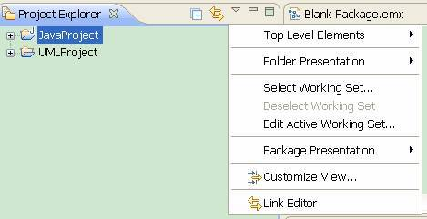
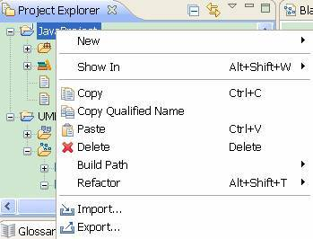
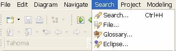

# Eclipse 插件开发 — 深入理解菜单（Menu）功能及其扩展点
理解 Eclipse 插件开发

**标签:** Java

[原文链接](https://developer.ibm.com/zh/articles/os-cn-ecl-menuext/)

敖建旺

发布: 2010-04-08

* * *

## 引言

Eclipse 具有丰富的菜单功能，给开发人员提供了很好的用户体验。总体而言，Eclipse 菜单种类包括视图/编辑器菜单，主菜单（Main Menu），视图/编辑器菜单（ViewPart/EditorPart Menu）和上下文菜单（Context Menu）。插件开发人员通过灵活应用这些菜单，可以给用户提供很好的体验。由于视图和编辑器菜单功能类似，因此本文重点讲述视图菜单（视图下拉菜单及其工具栏菜单），除此之外，还将讲述主菜单和上下文菜单。

如图 1 所示为 Project Explorer 视图的菜单，包括视图下拉菜单和工具栏菜单（折叠树节点）。通常而言，出现在视图工具栏的菜单都会出现在视图的下拉菜单，也就是说，比较常用的视图菜单放在视图的工具栏。

##### 图 1\. Project Explorer 视图的菜单



如图 2 所示为 Project Explorer 视图中的上下文菜单，只有当我们右键点击时才会出现。通常而言，出现频率较高的菜单项才会出现在菜单中。上下文菜单具有很强的灵活项，它可以随着我们点击的对象不同，弹出的菜单也会有相应的变化。

##### 图 2\. Project Explorer 视图中的上下文菜单



如图 3 所示为 Eclipse 的主菜单，包括最上面的主菜单项（不可移动）及其下面的工具栏菜单（可以移动，并且 Eclipse 提供了显示 / 不显示这些菜单的功能），Eclipse 并不建议我们为每一个插件都添加新的主菜单，这样容易造成冗余，而且不方便用户操作。通常，我们可以把菜单项添加到 Eclipse 已有的菜单，如插件的查找功能可以添加一个查找菜单项到 Eclipse 的 Search 主菜单上。

##### 图 3\. Eclipse 的主菜单



前面讲到 Eclipse 的各种菜单，那么，如何在开发插件或 RCP 应用程序的时候添加这些菜单？本文下面的篇幅将详细介绍如何扩展 Eclipse 的菜单功能，使读者深入了解 Eclipse 的菜单功能，并能够开发具有这些菜单的应用程序。因此，必须掌握三方面的内容：菜单种类，菜单的扩展点，菜单控制（显示 / 隐藏或启用 / 禁用菜单项）。下面从概念上介绍这三方面内容，下一小节将会进行详细介绍。

- **菜单种类**

    正如前面所讲到的，Eclipse 的菜单包括视图菜单，主菜单及上下文菜单三个种类。

- **菜单项的扩展点**

    Eclipse 提供了两种扩展点供用户添加菜单项到相应的位置。这两种扩展点为 org.eclipse.ui.commands（本文简称为 Commands 方式）和 org.eclipse.ui.actionSets（本文简称为 Actions 方式）。Actions 方式为界面上不同区域的表现方式提供了相应的扩展点，并且没有分离其界面表现和内在实现。恰恰相反，Commands 方式通过三步有效的达到界面表现和内部实现的分离：首先，通过 org.eclipse.ui.commands 扩展点创建命令和类别（Category），并且可以把某些命令放在一个类别（Category）中；然后，通过 org.eclipse.ui.menus 指定命令出现在界面的哪个区域（视图菜单 / 主菜单 / 上下文菜单）；最后通过 org.eclipse.ui.handlers 指定命令的实现。因此，Eclipse 推荐新开发的插件使用 Commands 来创建您的界面菜单。当然，由于 Actions 在现有的插件中用得比较多，如果我们需要扩展或基于之前的插件开发，也需要对其进行了解。除此之外，针对上下文菜单，虽然 Commands 和 Actions 方式均可以创建上下文菜单，但是 Eclipse 还提供了另外一种创建上下文菜单的扩展点 org.eclipse.ui.popupMenus（本文简称为 popupMenus 方式），本文将就这三种扩展点做详细的介绍。

- **菜单控制**

    菜单控制是一个非常常见的功能，例如，随着选定的内容或当前窗口的不同，菜单中的菜单项会有相应的变化（显示 / 隐藏或启用 / 禁用菜单项），因此，如何控制菜单是插件开发人员必须掌握的知识。Eclipse 为菜单控制提供了两种方法，一种是通过扩展点；另一种是通过 API 的方式编写程序控制。


## Eclipse 菜单功能及其扩展点

至此，我们对 Eclipse 菜单有了感观的认识。由上一节我们可知，要深入理解 Eclipse 菜单功能，我们需要从三个方面去掌握：菜单种类，菜单的扩展点和菜单控制。下面将进行详细讲述。

### 菜单种类

针对各种菜单，Eclipse 提供了相应的扩展点，因此，开发人员可以通过这些扩展点把菜单放到界面的不同区域，详细内容请参考 2.2 小节。

### 菜单的扩展点

#### 视图菜单的扩展点

采用 Commands 方式创建视图菜单，需要引入 org.eclipse.ui.menus 扩展点；而 Actions 方式需要引入 org.eclipse.ui.actionSets.

1. 视图菜单（Commands 方式）：

    MenuContribution locationURI = “[Scheme]:[id]?[argument-list]”

    其中，Scheme 为该菜单项出现的区域，menu 为视图的下拉菜单，toolbar 为视图的工具栏菜单；id 为菜单区域 ID；argument-list 为该菜单项出现在指定菜单的位置。

    例如：在 ProbelmView 的下拉菜单加一个菜单项，其 MenuContribution 的 locationURI 应为：menu:org.eclipse.ui.views.ProblemView?after=additions；在 ProblemView 的工具栏菜单中加入一个菜单项，其 locationURI 应为：toolbar:org.eclipse.ui.views.ProblemView?after=additions。

2. 视图菜单（Actions 方式）：

    采用 Actions 方式创建菜单，需要引入 org.eclipse.ui.actionSets 扩展点，并通过设定 action 的 menubarPath 指定下拉菜单 / 菜单项出现的位置；通过设定 action 的 toolbarPath 设定工具栏菜单 / 菜单项出现的位置。

    例如，添加一个下拉菜单项到 Problems 视图中，其 menubarPath 应为：

    org.eclipse.ui.views.ProblemView/additions


#### 主菜单的扩展点

1. 主菜单（Commands 方式）

    通过 Commands 方式把菜单项添加到主菜单及其工具栏上，和视图菜单一样，也是通过扩展点 org.eclipse.ui.menus 实现，需要设定其 menuContribution 的 locationURI。

    例如，添加一个菜单（菜单可以包含若干个菜单项）到主菜单一栏中，其 locationURI 为：

    menu:org.eclipse.ui.main.menu?after=additions

    添加一个菜单到工具栏之中，其 locationURI 为：

    toolbar:org.eclipse.ui.main.toolbar?after=additions

    当然，我们也可以把菜单项添加到已经存在的菜单当中，例如添加一个菜单项到 Eclipse 的 Search 主菜单当中，其 locationURI 为：

    menu:org.eclipse.search.menu?dialogGroup

2. 主菜单（Actions 方式）

    通过 Actions 方式把菜单项添加到主菜单及其工具栏上，和视图菜单一样，也是通过扩展点 org.eclipse.ui.actionSets 实现，需要设定 action 的 menubarPath 和 toolbarPath 实现。

    例如，添加一个菜单项到 Eclipse 的 Search 主菜单中，其 menubarPath 应为：

    org.eclipse.search.menu/dialogGroup

    注意：如果采用上述方式添加一个菜单项到 Search 主菜单，当我们运行时并没有出现添加的菜单项，这时候需要换一个 workspace，其原因是 Eclipse 缓存了与其相关的某些信息在 workspace 当中。


#### 上下文菜单的扩展点

上下文菜单除了通过 Commands 和 Actions 方式添加，还可以使用扩展点 org.eclipse.ui.popupMenus 方式添加，下面分别进行介绍。

1. 上下文菜单（Commands 方式）

    Commands 方式与添加视图菜单和主菜单的方式一样，通过设定其 menuContribution 的 locationURI 来实现。

    例如，添加一个上下文菜单到 Problems 视图中，其 locationURI 为：

    popup:org.eclipse.ui.views.ProblemView?after=additions。

    如果我们想让某个上下文菜单项出现在任何区域，则可以使用下面的 locationURI：

    popup:org.eclipse.ui.popup.any?after=additions

2. 上下文菜单（Actions 方式）

    Actions 方式没有直接提供扩展点添加上下文菜单，但是我们可以通过编程的方式实现，如下代码清单 1 为 TreeViewer 添加上下文菜单，通过 IMenuManager 的 add 方法添加 actions。


    ##### 清单 1\. 通过 Actions 方式编程实现添加上下文菜单


    ```
    private void hookContextMenu() {
        IMenuManager fMenuMgr = new MenuManager("#PopupMenu”);
        fMenuMgr.setRemoveAllWhenShown(true);
        // 添加 Actions
        fMenuMgr.add(action... )
        fMenuMgr.createContextMenu(treeViewer.getControl());
        treeViewer.getControl().setMenu(fMenu);
        getSite().registerContextMenu(fMenuMgr, treeViewer);
    }

    ```


    Show moreShow more icon

3. 上下文菜单（popupMenus 方式）

    通过 popupMenus 扩展点实现上下文菜单，需要设定 objectContribution 的 objectClass 属性把上下文菜单添加到相应的区域。

    例如，如果我们想当用户点击 Eclipse 中的资源时，弹出的上下文菜单包括某个菜单项，我们可以设定 objectClass 属性为：

    org.eclipse.core.resources.IResource


#### 通过 Commands 方式创建菜单项

通过 Commands 方式创建菜单项，首先需要创建 Command，通过扩展点 org.eclipse.ui.commands，然后我们可以把这个 Command 放到任何区域，上一小节已经讲到，通过 org.eclipse.ui.menus 扩展点确定菜单创建的区域，最后通过扩展点 org.eclipse.ui.handlers 定义这个 command 的具体行为。

在创建 Command 时，我们可以先创建一个 Category，并把相关的一些命令放到这个 Category 中，这样有利于管理。代码清单 2 创建一个 Command(“Show in Glossary Explorer”)，并放到一个 Category 中，然后把该 Command 放到 BGSearchResultView 视图的上下文菜单中，最后通过扩展 org.eclipse.ui.handlers 定义该 Command 的实现类。

##### 清单 2\. 通过 Commands 方式添加菜单项

```
<!-- 添加 command -->
<extension
      point="org.eclipse.ui.commands">
<category
      description="Business Glossary"
      id="com.ibm.bg.ui.commands.category"
      name="%category.BusinessGlossary.name">
</category>
<command
      categoryId="com.ibm.bg.ui.commands.category"
      description="Show in Glossary Explorer"
      id="com.ibm.bg.ui.commands.BGShowInBrowser"
      name="%command.ShowInGE.name">
    </command>
</extension>
<!-- 把 Command 放到界面的对应区域 -->
<extension
       point="org.eclipse.ui.menus">
<menuContribution locationURI=
"popup:com.ibm.bg.internal.ui.search.BGSearchResultView?after=additions">
      <command
            commandId="com.ibm.bg.ui.commands.BGShowInBrowser"
            style="push"
            tooltip="%command.ShowInGE.tooltip">
      </command>
</menuContribution>
</extension>
<!-- 定义 command 的实现类 -->
<extension
      point="org.eclipse.ui.handlers">
<handler
         class="com.ibm.bg.internal.ui.handlers.BGShowInBrowser"
         commandId="com.ibm.bg.ui.commands.BGShowInBrowser">
</handler>
</extension>

```

Show moreShow more icon

#### 通过 Actions 方式创建菜单项

正如前面讲到，Actions 方式没有分离界面的表现和内部实现，因此，所有这些均通过 action 来完成。如下代码清单 3 为添加一个 Search 菜单项到 Eclipse 的 Search 主菜单（通过 action 的 menubarPath 指定）中，其中 class 对应的值为该 Action 的实现类，该类需要实现接口 IWorkbenchWindowActionDelegate。

##### 清单 3\. 通过 Actions 方式添加菜单项

```
<extension
      point="org.eclipse.ui.actionSets">
<actionSet
         id="com.ibm.bg.ui.workbenchActionSet"
         label="%category.name.0"
         visible="true">
      <action
            class="com.ibm.bg.internal.ui.handlers.BGSearchHandler"
            definitionId="com.ibm.bg.ui.commands.BGSearch"
            icon="icons/search.png"
            id="com.ibm.bg.ui.commands.BGSearch"
            label="%action.searchGlossayInMainMenu.label"
            menubarPath="org.eclipse.search.menu/dialogGroup"
            style="push">
      </action>
</actionSet>
</extension>

```

Show moreShow more icon

#### 通过 popupMenus 方式创建菜单项

popupMenus 方式创建上下文菜单项也是通过 action 来实现，下面例子为添加一个菜单项到用户右击 IGraphicalEditPart 对象时弹出的上下文菜单，通过 menubarPath 指定该 Action 出现的区域，通过 class 指定该 action 的实现类，该类需要实现接口 IObjectActionDelegate。

##### 清单 4\. 通过 popupMenus 方式添加菜单项

```
<extension
      point="org.eclipse.ui.popupMenus">
<objectContribution
         adaptable="false"
         id="com.ibm.bg.uml.objectContributions.BGAssignToGlossary"
         objectClass="org.eclipse.gmf.runtime.diagram.ui.editparts.IGraphicalEditPart">
      <action
            class="com.ibm.bg.internal.uml.actions.BGAssignToGlossary"
            enablesFor="+"
            icon="icons/assign.png"
            id="com.ibm.bg.internal.uml.actions.BGAssignToGlossary"
            label="%BGAssignToGlossary.item"
            menubarPath="com.ibm.bg.uml.popupMenuGroup">
      </action>
</objectContribution>
</extension>

```

Show moreShow more icon

### 菜单控制

视图菜单的控制主要包括启用 / 禁用，显示 / 隐藏菜单。

通过 Command 方式创建的菜单，可以通过 org.eclipse.ui.commands 的 visibleWhen 属性控制菜单的隐藏和显示，通过 org.eclipse.ui.handlers 的 activewhen 或 enabledWhen 控制菜单的启用或禁用。

通过 Actions 方式创建的菜单，可以通过 action 的 enablement 属性控制菜单的启用 / 禁用。

通过 popupMenus 方式创建的菜单，可以通过 objectContribution 的 visibility 和 enablement 来设置该 objectContribution 下的 action 的显示 / 隐藏和启用 / 禁用，我们也可以设置 action 的 enablement 来控制该菜单的启用 / 禁用。

这里不详细讲述 enablement，visibleWhen 和 enabledWhen 的参数及如何设置，读者可以参考第三节的例子和本文的参考文献。

## 编程实践

本文将结合前两节讲到的知识，以例子的形式说明如何创建并且控制菜单。首先创建一个视图（Menu Example），然后分别通过 Commands，Actions 和 popupMenus 方式创建若干个菜单，并添加相应的菜单控制点。

### 创建 Menu Example 视图

扩展 org.eclipse.views 创建”Menu Example”视图，如下代码清单 5 为创建视图的 xml 代码。

##### 清单 5\. 扩展 org.eclipse.ui.views 创建视图

```
<extension
      point="org.eclipse.ui.views">
<category
         id="com.free.menu.category"
         name="Menu Example View">
</category>
<view
         category="com.free.menu.category"
         class="com.free.menu.view.MenuExplorer"
         id="com.free.menu.view.MenuExplorer"
         name="Menu Explorer"
         restorable="true">
</view>
</extension>

```

Show moreShow more icon

### 创建 Commands

采用 Command 方式创建”Menu Example”主菜单（包含 AngryCommand 和 JokeCommand 两个菜单项），并且基于这两个菜单项创建了 Menu Example 视图的下拉菜单和工具栏菜单，及其 TreeViewer 的上下文菜单。

如下代码清单 6 为扩展 org.eclipse.ui.commands 创建 Menu Example 命令和类别，并且包含两个命令：Joke Command 和 Angry Command。

##### 清单 6\. 扩展 org.eclipse.ui.commands 创建命令

```
<extension
      point="org.eclipse.ui.commands">
<category
         id="com.free.menu.category"
         name="Menu Example">
</category>
<command
         categoryId="com.free.menu.category"
         id="com.free.menu.commands.jokeCommand"
         name="Joke Command">
</command>
<command
         categoryId="com.free.menu.category"
         id="com.free.menu.commands.angryCommand"
         name="Angry Command">
</command>
</extension>

```

Show moreShow more icon

### 关联 Commands 到主菜单

如下代码清单 7 为扩展 org.eclipse.ui.menus，并基于前面创建的 Comands，添加一个主菜单 Menu Example，并且包含 Joke Command 和 Angry Command 菜单项。

##### 清单 7\. 创建 Menu Example 主菜单

```
<menuContribution
      locationURI="menu:org.eclipse.ui.main.menu?after=additions">
<menu
     id="com.free.menu.MenuExample"
          label="Menu Example">
      <command
            commandId="com.free.menu.commands.jokeCommand"
            style="push">
      </command>
      <command
            commandId="com.free.menu.commands.angryCommand"
            style="push">
      </command>
</menu>
</menuContribution>

```

Show moreShow more icon

### 关联 Commands 到视图菜单

如下代码清单 8 为扩展 org.eclipse.ui.menus，并基于 Commands 方式创建 Menu Example 视图的下拉菜单，工具栏菜单和上下文菜单，通过 locationURI 来设定。Joke Command 即为下拉菜单也是工具栏菜单，只有当我们选择了 TreeViewer 中的节点时该菜单项才是可见的，参考下面的 visibleWhen->with->iterate->or->instanceof。

##### 清单 8\. 通过 Commands 方式创建视图菜单

```
<extension
       point="org.eclipse.ui.menus">
    <menuContribution
          locationURI="menu:com.free.menu.view.MenuExplorer?after=additions">
       <command
             commandId="com.free.menu.commands.jokeCommand"
             icon="icons/searchres.gif"
             style="push">
             <visibleWhen
                   checkEnabled="false">
                <with
                     variable="selection">
                   <iterate
                        ifEmpty="true"
                        operator="or">
                    <or>
                        <instanceof
                                value="com.free.menu.model.Person">
                        </instanceof>
                    </or>
                  </iterate>
                  </with>
               </visibleWhen>
         </command>
      </menuContribution>
      <menuContribution
            locationURI="toolbar:com.free.menu.view.MenuExplorer?after=additions">
         <command
               commandId="com.free.menu.commands.jokeCommand"
               icon="icons/searchres.gif"
               style="push">
               <visibleWhen
                     checkEnabled="false">
                  <with
                        variable="selection">
                     <iterate
                           ifEmpty="true"
                           operator="or">
                        <or>
                              <instanceof
                                    value="com.free.menu.model.Person">
                              </instanceof>
                        </or>
                     </iterate>
                  </with>
               </visibleWhen>
         </command>
      </menuContribution>
      <menuContribution
            locationURI="popup:com.free.menu.view.MenuExplorer?after=additions">
         <command
               commandId="com.free.menu.commands.jokeCommand"
               icon="icons/searchres.gif"
               style="push">
         </command>
         <command
               commandId="com.free.menu.commands.angryCommand"
               style="push">
         </command>
      </menuContribution>
</extension>

```

Show moreShow more icon

### Commands 的实现类

如下代码清单 9 所示扩展 org.eclipse.ui.handlers 为 Joke Command 和 Angry Command 创建事件处理类，其中 Joke Command 通过 enabledWhen 属性控制该菜单项是否启用，当我们同时选择了两个对象时 Joke Command 处于启用状态，否则为禁用。

##### 清单 9\. 扩展 org.eclipse.ui.handlers 为 Commands 创建实现类

```
<extension
      point="org.eclipse.ui.handlers">
<handler
         class="com.free.menu.actions.JokeCommand"
         commandId="com.free.menu.commands.jokeCommand">
      <enabledWhen>
         <count
               value="2">
         </count>
      </enabledWhen>
</handler>
<handler
         class="com.free.menu.actions.AngryCommand"
         commandId="com.free.menu.commands.angryCommand">
</handler>
</extension>

```

Show moreShow more icon

### 创建 Action 并关联到 Eclipse 的 Search 主菜单

采用 Actions 方式在 Eclipse 的主菜单 Search 中添加创建菜单项 SmileAction。扩展 org.eclipse.ui.actionSets 在 Eclipse 的主菜单 Search 中添加一个菜单项 Smile Action。如下代码清单 10 所示创建该 action 并添加到 search 主菜单，只有当我们选择至少一个对象时（设置 enablesFor 属性为”+”），该菜单项才处于启用状态。

##### 清单 10\. 通过 Actions 方式创建菜单项

```
<extension
      point="org.eclipse.ui.actionSets">
<actionSet
         id="com.free.menu.actionSet.MenuExample"
         label="Menu Example"
         visible="true">
      <action
            class="com.free.menu.actions.SmileAction"
            enablesFor="+"
            icon="icons/searchres.gif"
            id="com.free.menu.actions.smileAction"
            label="Smile Action"
            menubarPath="org.eclipse.search.menu/dialogGroup"
            style="push">
      </action>
</actionSet>
</extension>

```

Show moreShow more icon

### pupupMenus 方式创建 Action 并关联到 IResource 资源的上下文菜单

扩展 org.eclipse.ui.popupMenus 创建菜单”Menu Example”，该菜单包含一个菜单项 HelloAction。当我们在 Eclipse 任何区域右击 org.eclipse.core.resources.IResource 资源时弹出的上下文菜单中会出现”Menu Example”菜单。如下代码清单 11 为创建该上下文菜单的 xml 代码。

##### 清单 11\. popupMenus 方式创建上下文菜单

```
<extension
      point="org.eclipse.ui.popupMenus">
<objectContribution
         adaptable="true"
         id="com.free.menu.popupMenu"
         objectClass="org.eclipse.core.resources.IResource">
      <menu
            label="Menu Example"
            path="additions"
            id="com.free.menu.popupSubMenu">
         <separator
               name="additions">
         </separator>
      </menu>
      <action
            label="Hello Action"
            class="com.free.menu.popup.actions.HelloAction"
            menubarPath="com.free.menu.popupSubMenu/additions"
            enablesFor="1"
            id="com.free.menu.newAction">
      </action>
</objectContribution>
</extension>

```

Show moreShow more icon

### pupupMenus 方式创建 Action 并关联到 IResource 资源的上下文菜单

扩展 org.eclipse.ui.popupMenus 创建菜单项 GreetAction 和 CryAction，当我们右击 Menu Example 视图中的 TreeViewer 节点时弹出。如下代码清单 12 所示扩展 org.eclipse.ui.popupMenus 为 Menu Example 视图创建 GreetAction 和 CryAction 上下文菜单项。使用 visiblity 的 objectState 属性控制菜单项的可见状态，使用该属性要求其选择的对象实现了 org.eclipse.ui.IActionFilter 接口，具体可参见 Person 类的实现。

##### 清单 12\. 扩展 org.eclipse.ui.popupMenus 创建菜单

```
<extension
      point="org.eclipse.ui.popupMenus">
<objectContribution
         adaptable="false"
         id="com.free.menu.views.popupMenu"
         objectClass="com.free.menu.model.Person">
      <action
            class="com.free.menu.actions.GreetAction"
            enablesFor="+"
            id="com.free.menu.actions.greetAction"
            label="Greet Action"
            menubarPath="additions">
      </action>
      <visibility>
         <objectState
               name="firstName"
               value="Dan">
         </objectState>
      </visibility>
</objectContribution>
</extension>
<extension
      point="org.eclipse.ui.popupMenus">
<objectContribution
         adaptable="false"
         id="com.free.menu.views.popupMenu2"
         objectClass="com.free.menu.model.Person">
      <action
            class="com.free.menu.actions.CryAction"
            enablesFor="+"
            id="com.free.menu.actions.cryAction"
            label="Cry Action"
            menubarPath="additions">
         <enablement>
            <objectState
                  name="firstName"
                  value="David">
            </objectState>
         </enablement>
      </action>
      <visibility>
         <objectState
               name="lastName"
               value="Rubel">
        </objectState>
      </visibility>
</objectContribution>
</extension>

```

Show moreShow more icon

### Menu Example 视图的代码实现类

如下代码清单 13 所示为 Menu Example 视图的代码，该视图中有一个 TreeViewer，并通过函数 hookContextMenu 把上下文菜单关联到 TreeViewer。其中函数 viewMenuAction 用于更新菜单的状态，它首先获取视图菜单，然后调用 IMenuManager 的 update 方法更新对应菜单项的状态，从而达到控制菜单的目的。

##### 清单 13\. Menu Example 视图代码

```
public class MenuExplorer extends ViewPart {
    private TreeViewer treeViewer;
    private MenuManager fMenuMgr;
    private Menu fMenu;
    private static MenuExplorer fInstance = null;
    public MenuExplorer() {
        fInstance = this;
    }
    public static MenuExplorer getInstance(){
        return fInstance;
    }
    public void createPartControl(Composite parent) {
        treeViewer = new TreeViewer (parent, SWT.MULTI);
        treeViewer.setLabelProvider(new PersonListLabelProvider());
        treeViewer.setContentProvider(new PersonTreeContentProvider());
        treeViewer.setInput(Person.example());
        this.getSite().setSelectionProvider(treeViewer);
        hookContextMenu();
        fInstance = this;

    }
    public void setViewMenuActionState(boolean state){
        JokeCommand.setState(state);
        viewMenuAction();
    }
    private  void viewMenuAction() {
        IActionBars bars= getViewSite().getActionBars();
        final IMenuManager menu= bars.getMenuManager();

        UIOperation.asyncExecCommand(new Runnable(){
            public void run() {
                menu.update("com.free.menu.commands.jokeAction");
            }
        });
    }
    private void hookContextMenu() {
        fMenuMgr = new MenuManager("#PopupMenu");
        fMenuMgr.setRemoveAllWhenShown(true);
        fMenuMgr.addMenuListener(new IMenuListener() {
            public void menuAboutToShow(IMenuManager manager) {
            }
        });
        fMenu = fMenuMgr.createContextMenu(treeViewer.getControl());

        treeViewer.getControl().setMenu(fMenu);
        getSite().registerContextMenu(fMenuMgr, treeViewer);
    }
    public void setFocus() {
        treeViewer.getTree().setFocus();

    }
}

```

Show moreShow more icon

### Person 类的实现

如下代码清单 14 为 Person 类的实现，用于表示 MenuExample 视图中 TreeViewer 的一个节点，它实现了 IActionFilter 接口，通过 testAttribute 来确定是否显示 / 隐藏菜单（其中 target 表示用户选择的对象，name/value 对应于 plugin.xml 文件中 objectState 的 name/value）.

##### 清单 14\. Person 类实现

```
public class Person implements IActionFilter {

    private String firstName = "John";
    private String lastName = "Doe";
    protected int age = 37;
    public Person[] children = new Person[0];
    public Person parent = null;
    public Person(String firstName, String lastName, int age) {
        this.firstName = firstName;
        this.lastName = lastName;
        this.age = age;
    }
    public Person(String firstName, String lastName, int age, Person[] children) {
        this(firstName, lastName, age);
        this.children = children;
        for (int i = 0; i < children.length; i++) {
            children[i].parent = this;
        }
    }
    public String getFirstName() {
        return this.firstName;
    }
    public String getLastName() {
        return this.lastName;
    }
    public static Person[] example() {
        return new Person[] {
                new Person("Dan", "Rubel", 38, new Person[] {
                        new Person("Beth", "Rubel", 8),
                        new Person("David", "Rubel", 3) }),
                new Person("Eric", "Clayberg", 39, new Person[] {
                        new Person("Lauren", "Clayberg", 6),
                        new Person("Lee", "Clayberg", 4) }),
                new Person("Mike", "Taylor", 52) };
    }
    public String toString() {
        return firstName + " " + lastName;
    }
    public boolean testAttribute(Object target, String name, String value) {

        if (target instanceof Person) {
            Person person = (Person) target;
            if (name.equals("firstName") && value.equals(person.getFirstName())) {
                return true;
            }

            if (name.equals("lastName") && value.equals(person.getLastName())) {
                return true;
            }
        }
        return false;
    }
}

```

Show moreShow more icon

## 总结

至此为止，已经把 Eclipse 菜单功能及其扩展点涉及到的类 / 接口 /API 进行了详细的说明，相信读者已经有清晰的认识了。对于前面提到 popupMenus 方式创建上下文菜单，要求选择的对象实现 IActionFilter 接口，但是，如果开发人员正在使用 gmf 进行开发，那么我们可以不必要求选择的对象实现 IActionFilter，我们可以通过扩展 org.eclipse.gmf.runtime.common.ui.services.action.actionFilterProviders 对菜单项进行控制，如下代码清单 15 为扩展该 extension point 的 xml 代码，我们可以定义多个属性（… </Attribute），其中 Attribute 的 name 和 value 对应于 visibility 的 objectState 中的 name 和 value。

##### 清单 15\. 通过 actionFilterProviders 扩展点实现对菜单的控制

```
<extension
point="org.eclipse.gmf.runtime.common.ui.services.action.actionFilterProviders">
     <ActionFilterProvider
           class="com.free.menu.PopupActionFilterProvider">
        <Priority
              name="Medium">
        </Priority>
        <Attribute
              name="com.ibm.bg.uml.search.isSupportedType"
              value="supported">
        </Attribute>
     </ActionFilterProvider>
</extension>

```

Show moreShow more icon

如下代码清单 16 所示 PopupActionFilterProvider 的实现，它继承 AbstractActionFilterProvider，只需要实现其中的 testAttribute 和 provides 方法，当 testAttribute 返回 true 时，那么该菜单项被启用，否则禁用。其中 target 对应于我们选择的对象，name 和 value 参数对应于 visiblity 中 objectState 的 name 和 value 的指定值 ( 与前面提到的 Person 类中的 testAttribute 方法类似 )。

##### 清单 16\. actionFilterProviders 扩展点实现类

```
public class PopupActionFilterProvider extends AbstractActionFilterProvider {

    public PopupActionFilterProvider() {
    }

    public boolean testAttribute(Object target, String name, String value) {

    }

    public boolean provides(IOperation operation) {
        return false;
    }

}

```

Show moreShow more icon