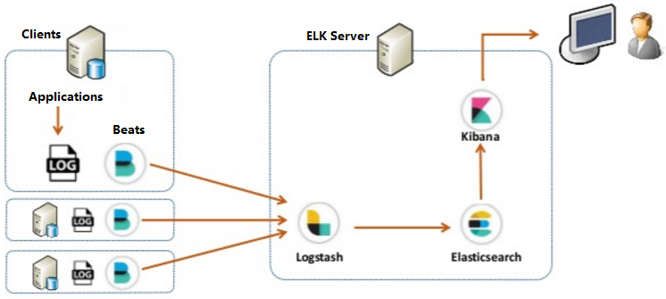
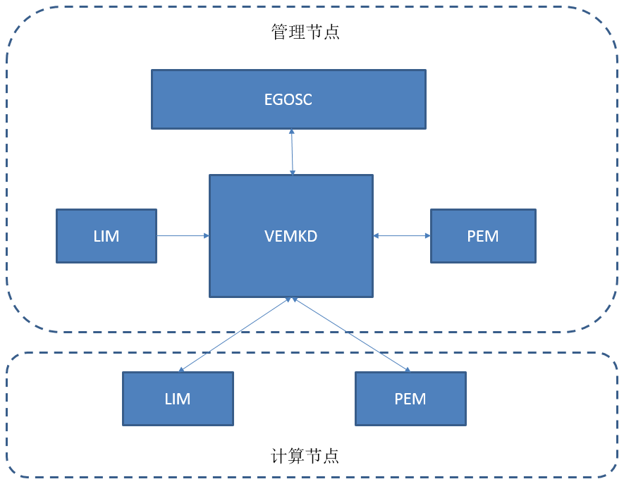
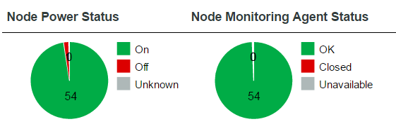
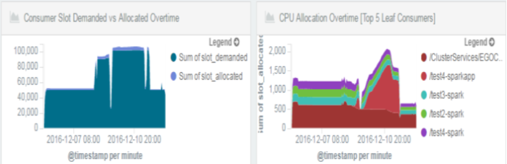

# Elastic Stack 和 IBM Platform EGO 的集成与实战
敏捷开发之路

**标签:** 分析

[原文链接](https://developer.ibm.com/zh/articles/ba-cn-elastic-stack-platform-ego/)

何金池, 李峰

发布: 2017-03-01

* * *

目前，大数据和云计算可谓是如火如荼，大部分 IT 技术和方案都朝着这两个方向积极靠拢，随着大数据和云计算平台的功能越来越强大，其结构也越来越复杂，一个基本的大数据平台，仅组件就多达数十种，这还不包括用户的上层应用和广泛的物联网的系统组件。这么庞大的系统整合在一起，对于运维来说，是十分头疼的事情。如此复杂的系统，”不得病”是不可能的。那么，一旦”得病”，如何快速准确的找到”病因”，并有效的对症下药，则显得极为重要。如何为大数据和云计算平台”治病”呢？在这种背景和需求下，日志处理分析系统和监控模块应运而生。

目前，日志分析工具多达数十种，其中应用较多的有 Splunk、Elastic、AWStats、Graphite、LogAnalyzer、Rsyslog、Log watch、Open Web Analytics 等等，其中，Splunk 是一款顶级的日志分析软件，从收集、处理、展现一条线服务，基本的日志分析监控都支持，其属于商业运营产品。AWStats 是在 [Sourceforge](http://baike.baidu.com/view/1091461.htm) 上发展很快的一个基于 Perl的WEB 日志分析工具。Graphite 是一个用于采集网站实时信息并进行统计的开源项目，可用于采集多种网站服务运行状态信息。LogAnalyzer 是一个 Web 前端工具，提供简单易用的日志浏览、搜索和基本分析以及图表显示。Rsyslog 可以理解为 syslogd 工具的多线程增强版。Open Web Analytics 是一个开源的网站流量统计系统。Logwatch，顾名思义，是一款专门监测 Linux log 文件（日志文件）的软件。这些工具（除了 Splunk 外），在功能上都有些欠缺，或者上，在特定的场合，可以大展身手，但并不能适用于所有的场合。而 Elastic Stack 方案则不同，功能相对来说比较完善，性能比较稳定。由于其开源性，使得 Elastic Stack 在最近两年迅速崛起，成为机器数据分析和实时日志处理领域的第一选择。

最开始，将 Elastic Stack 称之为 ELK，ELK 是 Elasticsearch, Logstash, Kibana 的简称，各取这三个核心套件的首字母。这三个软件均是开源的。本文着重讨论 Elastic Stack 方案，并详细阐述 Elastic Stack 和 Platform EGO 来深度集成.从功能上来说，二者可以相辅相成，让 Platform EGO（Enterprise Grid Orchestrator）来为 Elastic 分配运行的资源和服务管理，与此同时，用 Elastic 来监控 Platform EGO 的运行情况。

## 一、Elastic Stack 结构体系

Elastic Stack 的体系结构如图1 所示。从下图可以看出，在 Elastic Stack 中，除了我们上文中提到的 Elasticsearch, Logstash, Kibana “三大金刚” 之外，还有一个主要的部分: Beats。

Beats 是一个轻量级的工具，主要功能是在客户端收集日志和数据（比如网络数据，机器性能数据等。其轻量性，是相对于 Elasticsearch 和 logstash 来说，占用的 CPU 和内存资源较少，基本不会影响到用户的上层应用的正常运行。目前官方已经有好几种 Beats, 比如最常用的 Filebeat, Metricbeat, Packetbeat，Winlogbeat 等。Beats 支持用户自己开发，而且在开源社区里，我们可以找到更多的 Beats。

Logstash 负责接收从 Beats 发送过来的数据，并实时分析和处理，并实时转发给Elasticsearch，Logstash 本身不具有存储功能，只是一个管道而已。Logstash 主要有三个部分，也可以说是三种 Plugin: Input，Filter 和 Output。Input 部分配置的是数据源，可以是文件，也可以是 Beats 等输入源。Filter 对日志经过过滤和处理。Output 配置的是输出的目的地，可以是一个文件，也可以是 Elasticsearch（本文中的示例）。

ElasticSearch 在 Elastic Stack 中最为复杂、最主要的一个组件，具有全文搜索和分析引擎，提供搜集，分析，存储数据三大功能。

Kibana 是一个基于 Web 的图形界面，用于搜索、分析和可视化存储在 Elasticsearch 中的日志和数据。

在此，值得一提的是，Logstash 也有 Filebeat 的功能，其 Input plugin 的功能非常强大，有数十个之多，但是笔者不建议将 Logstash 直接部署到客户端来收集数据，因为 Logstash 会占用部分系统资源，可能会影响到上层应用的正常，得不偿失。Logstash 可以部署到管理节点上来收集数据，一来很多数据和日志都在管理节点上（只需要配置 Input plugin ），二来一般情况下，管理节点比较强大，可以很好的支持 Logstash 的满负荷运行。

##### 图1 Elastic的体系结构



从此体系结构图中，我们可以看出，Elastic Stack 工作的主要流程为：各种 Beats 部署在客户端，用来收集、解析、转换数据。如图所示，我们将 Elasticsearch、Logstash、Kibana 部署在集群的管理节点上，或者专门部署一个（在高可用环境下，可能有数台）服务器上。Beats 收集到数据之后，可以直接发给 Elasticsearch ,但一般情况下，先发送给 Logstash 来进行日志的处理和优化。其实， Beats 本身也有处理日志的功能，但相对于 Logstash 来说，较为简单，不能满足大部分处理需求，另外一个原因是，尽可能的降低 Beats 端的负载，有利于集群性能的提升。日志经过 Logstash 这个管道之后，再插入到 Elasticsearch 中存储和检索，最后由 Kibana 展示出来。

目前 Elastic 官方已经推出了 5.0 版本。Logstash 支持了 Cluster 模式，也就是说 Logstash 本身具有的负载均衡和高可用性等特点，并且在资源利用率上，也作出了很大的优化，使得性能和处理日志的速度都有了很大程度的提高。

## 二、Platform EGO 资源管理简介

Platform EGO（Enterprise Grid Orchestrator）是一种资源管理和调度、监控、用户管理、服务管理等功能于一身的工具。相信大家熟知资源管理领域的 Mesos 或者 Yarn 等，Platform EGO 可以提供与之相似的功能。

下图为 Platform EGO 的主要模块架构图，在 Platform EGO 中，重要的成员和功能如下：

- VEMKD

VEMKD 是 VEM 内核后台程序，运行在管理节点上，VEMKD 对客户端的分配请求做出响应。

- EGOSC

EGOSC (EGO Service Controller) 属于 EGO 服务控制器，负责向 VEMKD 申请相应资源并控制服务实例。

- PEM

PEM（Process execution manager）负责 VEMKD 中的启用、控制以及监控活动，同时收集并发送运行时资源的使用情况。

- LIM

LIM (Load Information Manager) 进程 负责收集各个节点的资源使用信息。

##### 图2 Platform EGO 的构架图



除了上面的几个主要的组件外，在 Platform EGO 中 , 还有几个主要的概念：

- Consumer

Consumer 是指从 VEMKD中 申请资源的一个实体，可以是业务性质的服务、或者是业务流程、或者是单一用户或者一整条业务线。 查看 Consumer的 EGO 命令是：


- EGO 服务

EGO 服务可以理解为一种持续运行的进程，能够接收一条或多条请求并相应的做出响应。EGO 服务能够在多台主机上运行多个并发服务实例。按照是否自动启动（安装后或者 EGOSC 重启之后），分为两种，一个是默认自动启动，另外一种是手动启动，需要在定义 Service 文件的时候，指定此属性。查看EGO 服务的命令为：

```
# egosh service list

```

Show moreShow more icon

查看具体某一个 Service 的详细信息的命令为：

```
# egosh service view Service_Name

```

Show moreShow more icon

- EGO 用户账户

一个用户账户代表一个 IBM Platform 系统用户，该用户可以被分配为任意 Consumer 角色。用户账户当中包含可选联系信息、名称以及密码。同样，查看当前拥有的用户的命令为：

```
#egosh user list

```

Show moreShow more icon

## 三、Elastic Stack 与 Platform EGO 的集成实战

### 1.Elastic stack 服务的注册

所谓服务注册，是指将预先定义好的 service 的 XML 配置文件，放到指定的文件夹下，当 EGOSC 重启的时候，自动读取。这个文件夹一般为 $EGO\_TOP/eservice/esc/conf/services，其中 $EGO\_TOP 为环境变量，指示 EGO 的安装目录。在此集成实例中，为 Elastic Stack 定义了四个文件，分别对应的是 Elasticsearch,Kibana,Logstash 和 Filebeat。其中elk\_indexer.xml 对应于 Logstash，elk\_shipper.xml 对应于 filebeat。如下所示：

```
# ls $EGO_TOP/eservice/esc/conf/services
elk_elasticsearch.xml
elk_kibana.xml
elk_indexer.xml
elk_shipper.xml

```

Show moreShow more icon

如果需要安装完毕或者重启 EGOSC 之后，自动启动这些 service，就需要在 service 中配置启动类型为AUTOMATIC ， 如下所示。

AUTOMATIC

### 2.依赖的注入与配置

所谓依赖是指，这些 Service 启动和正常运行期间，需要依赖于其他 Service，如果被依赖的 Service 停止工作，或者出现异常，就需要同样停掉依赖此 Service 的所有服务。

举例来说，在此集成模型中，如果 Elasticsearch 出了问题，那么 Logstash 就不能往 Elasticsearch 中写数据，Logstash 也就没有存活的必要了，同理，Logstash 如果因为某种原因停止了，Filebeat 发送的数据，Logstash 就收不到了，Filebeat 就没有继续运行的必要了。所以，Filebeat 依赖 Logstash, Logstash 又依赖 Elasticsearch。我们就需要在 Service 的定义文件中，配置这种关系。

下面是在 elk\_indexer.xml 中对 Elasticsearch 依赖关系的定义：

elk-elasticsearch

在此，我们对此定义做一简单说明，”satisfy”参数指的是启动 Logstash 时候，Elasticsearch 服务的状态，也就是说，只有在 Elasticsearch 服务的状态为 STARTED 的时候，Logstash 才开始启动。”keep”参数是 Logstash 保持运行所必需的 Elasticsearch 服务的状态，当 Elasticsearch 服务状态为 TENTATIVEH 或者 STARTED 的时候，Logstash 保持正常运行，否则，Logstash 将被暂停。当 Elasticsearch 状态恢复之后，Logstash 服务便会自动恢复运行。

### 3.服务的监控和 Job Monitor

在上面的依赖的配置里，我们多次提到了服务的状态，那么如何判断这个服务运行正常与否呢？这个工作就需要 Job Monitor 来完成，每个服务都可以配置 Job Monitor 功能。需要说明的是，EGO Job Monitor 自由度很大，具体监控什么，如何监控，就需要自己通过脚本来完成。比如监控端口号是否正常，在 Elasticsearch Cluster 的健康状况、Logstash 的处理速率等，来判断这个 Service 是否正常运行。如果发现 Service 已经不满足于某个条件，Job Monitor 变修改 Service 的状态到 TENTATIVE，或者 ERROR，此时，依赖与这个 Service 的其他服务也相继改变。

同样，Job Monitor 也有启动检测的功能，比如说，已经检测到某个服务已经完全启动就绪，能接受客户端请求的时候，便将这个 Service 的状态由 TENTATIVE 变为 STARTED。依赖与此服务的 Service 才会相继启动。

在此集成实例中，我们对每个 service 都配置了 Job Monitor 功能。Elasticsearch 的 Job Monitor 中检测 Elasticsearch 的进程、端口、Cluster 的状态等。Logstash 的 Job Monitor 监控 Elasticseach Service 状态和自身的端口等。

### 4.日志 Rotate 机制

我们发现，由于大数据平台的日志量比较大的情况下，Elastic Stack 负荷量很大，在这种情况下，如果一旦出错， Elastic Stack 自身的日志量也比较大，有可能在几分钟之内，便会产生上百 MB 的日志，这对于一般的大数据平台来说，持续性产生的日志，会对磁盘存储造成一定的影响。在这种情况下，就需要日志 Rotate 机制。所谓日志 Rotate 机制，通过轮转的方式来删除时间比较久的日志，仅仅保留最近一段时间之内（可配置）的日志和数据。

在此集成实例中，此功能的实现，主要借助了Linux自带的 logrotate 工具完成的。用户只需要配置 logrotate 的 conf 文件即可。每 10M 做一个轮换，最多保留 5 个日志文件。并且重定向了 Elasticsearch 的日志。

### 5.Troubleshooting 的方法

在 Elastic Stack 和 EGO 集成过程中，在某些情况下，会出现 Service 启动失败或者 Service 进入 TENTATIVE 的状态，或者 Service 启动正常，但是 Elasticsearch 无数据写入的情况等。如果是 Service 进入 TENTATIVE 状态，而不变成 STARTED 状态，一般是由于启动过程某个检测条件未满足，或者启动出错。Elasticsearch 无数据的情况就相对来说比较复杂，原因可能会出现在 Elastic Stack 各个环节和数据链。对于此类问题，最行之有效的 Troubleshooting 办法是查看 Elastic Stack 的日志，集成后的日志在此目录下： $EGO\_TOP/integration/elk/log ，此文件下的 LOG 包括了 Elastic Stack 本身打印出的日志和 Elastic 在 EGO 中的 services 打印出的日志，如下所示：

```
# ls $EGO_TOP/integration/elk/log

elasticsearch es-out.log.cnv31m1 indexer-out.log.cnv31m1 shipper-err.log.cnv31m1 es-err.log.cnv31m1 indexer-err.log.cnv31m1 install.log shipper-out.log.cnv31m1

```

Show moreShow more icon

其次，可以查看 EGOSC 的 log 来定位 Service 不能启动成功的原因，此 LOG 一般在 EGOSC 的安装目录下。如果 LOG 还不能解决问题，可以在 elk.conf 配置 DEBUG=1 来启动 DEBUG 模式，进一步的锁定问题。最后，可以尝试暂时脱离 EGO，来手动在 Debug 模式下，启动 Elastic Stac k锁定问题。

## 四、Elastic Stack 对 Platform EGO 的监控

我们知道，Elastic Stack 的主要功能之一是监控，当然也可能监控 EGO 的运行情况、资源分配情况等。此章节中，我们仅展示部分监控功能。Elastic Stack 收集的大致流程为 Filebeat 从 EGO 日志中读取数据（部分数据是从数据库中直接加载得到），发送给 Logstash，经过Logstash Filter GROK 插件的格式化处理和优化之后，再发送给 Elasticsearch 存储和检索，由 Kibana 展示出来。图3 为节点是否开机的状态和 EGO 是否在节点上运行正常，其中 Monitoring Agent 指的是 EGO Client 的状态。

##### 图3 Elastic Stack监控集群节点



图4 为 EGO 资源分配的情况，EGO 中资源以 Slot 为单位的，从下图中我们可以看出 Slot 的使用情况和为每个 Consumer 的分配的 CPU 情况。从此图中，我们可以一目了然的看出，有多少剩余的资源。

##### 图4 Elastic Stack 监控 EGO 资源使用情况



## 五、结束语

Elastic Stack 在近两年迅速崛起，在实时的日志处理领域发挥着主要的作用，并且 Elastic Stack 很容易上手，处理方式灵活，性能稳定，前端采用的技术比较先进。在 Beats 端和 Logstash 端，只需要进行配置， Kibana 端甚至只需要用鼠标点击，即可画出绚丽的图形。Elastic Stack 的社区也日渐活跃，参与使用和研究的企业或个人成指数型增长。Platform EGO 是所有 IBM Platform 产品资源管理和配置的工具，应用比较广泛。本文以 Elastic Stack 和 Platform EGO 的集成，展示了如何管理和更好的使用 Elastic 产品。当然了，Elastic Stack 不是万能的，可能还需要我们在集成的过程中，添加一些定制化的功能，例如辅助收集日志和数据的脚本等，才能完全满足需求。在 Elastic Stack 集成的过程中，也相继解决了许多和 IBM Java 和 POWER 平台的集成问题。