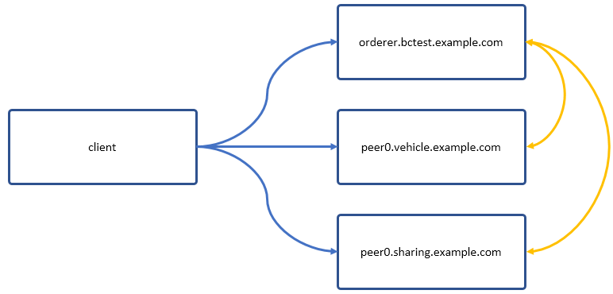
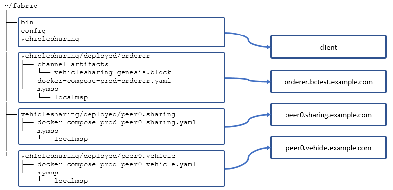
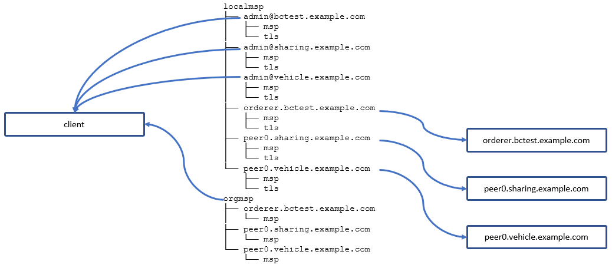
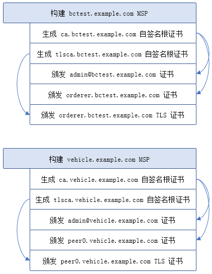

# Fabric 区块链的多节点部署
部署一个多节点的 Fabric 区块链网络

**标签:** 云计算

[原文链接](https://developer.ibm.com/zh/articles/cl-lo-hyperledger-fabric-practice-analysis3/)

徐 春雷

发布: 2019-03-13

* * *

## 前言

在本系列前两个部分《 [分步详解 Fabric 区块链网络的部署](https://www.ibm.com/developerworks/cn/cloud/library/cl-lo-hyperledger-fabric-practice-analysis/index.html) 》与《 [Fabric 区块链智能合约 Chaincode 与客户端程序开发全新实例教程](https://www.ibm.com/developerworks/cn/cloud/library/cl-lo-hyperledger-fabric-practice-analysis2/index.html?ca=drs-) 》中，我们讲解了如何在单主机上部署一个示例的 Fabric 区块链网络；并进一步讲解了如何开发、部署 Fabric Chaincode（智能合约）、Client Application（客户端应用）。

在本文中，我们将关注 Fabric 实际应用中的部署问题，尤其是生产环境中的多节点部署问题。

区块链技术仍可视为一项比较”新”的信息科技技术，所涉及的分布式账本、对等网络、不对称加密、数字签名、零知识证明等技术，以及这些技术的组合应用，往往并不易于理解；而且相应的文档、工具比较少且变化快，还处于迅速发展阶段。鉴于此，为了将对 Fabric 的研究与学习尽量与实际相结合，也为了能更好的理解 Fabric 的设计与功能，我认为有必要从实际出发，进行以生产环境为目标的、多节点部署的实践与分析。

## 业务场景

我们设想了一个应用区块链技术的业务场景：共享汽车租赁服务。这是一个有权限管理的区块链网络，有若干组织机构会参与其中，并提供各自的节点与服务。本文所述的试验性的”生产环境”即以此为中心展开。我们将尽量脱离 Fabric 提供的示例，而通过自定义内容完成这个”生产环境”的部署。

### 参与组织与用户

在我们所设想的试验”生产环境”中，有以下组织和用户参与：

1. 一个区块链网络服务公司 A Blockchain Testing Company，它的域名是： **bctest.example.com**。这个公司将为这这个网络提供技术支持、构建初始化资源、定义第一个 Channel；并提供一个 Orderer 节点。
2. 一个汽车制造公司 A Vehicle Company，它的域名是： **vehicle.example.com**。这个公司将为这个业务提供汽车以供租赁，并为这个网络提供一个 Endorsing Peer。
3. 一个汽车租赁公司 A Sharing Company，它的域名是： **sharing.example.com**。这个公司将为这个业务提供租赁相关服务（会员、结算），并为这个网络提供一个 Endorsing Peer。
4. 若干最终用户。这些用户将使用这个网络租赁汽车，并完成结算。

### 网络环境

我们至少需要 4 台主机，以模拟不同的的来源与操作。本文示例中，会将一些相同 Service 设置为使用相同端口，所以，它们不能再像 first-network 一样运行在一台主机上。

##### 表 1\. 主机列表

**公司、组织****主机名、域名 \*****主机 IP 地址 \*****操作系统**Client \***client**192.168.1.2Ubuntu 16.04A Blockchain Testing Company**orderer. bctest**.example.com192.168.1.3Ubuntu 16.04A Vehicle Company**peer0. vehicle**.example.com192.168.1.4Ubuntu 16.04A Sharing Company**peer0. sharing**.example.com192.168.1.5Ubuntu 16.04

- 部署完成后，在每个主机上，会启动相应 Docker Container。
- 主机 IP 地址可以设定为其他值，但需要保证解析记录一致，并保证主机之间可以通过主机名、域名互相访问。
- 如果仅修改 IP 地址，则本文中的配置文件不需要修改。
- 如果需要修改主机名、域名，则需要修改本文中的相关配置文件。（粗体部分为简称）
- 建议 Client 为一独立主机，如果条件受限，也可以将此部分操作在其他主机上执行，但请注意区分文件与路径。

这些主机所形成的网络示意如下：

##### 图 1\. 主机网络示意图



### 技术需求

Fabric 部署实践将分为以下三个阶段：

1. 简易部署：使用已有的文件进行简化的多节点部署。
2. 自定义部署：手动生成 MSP、Channel 配置；添加新用户、新组织。
3. 性能优化与安全：更多配置、安全措施。

本文将讨论前两个阶段，第三个阶段会在后续文章中以专题形式讨论。

虽然我们尽量使这个环境与真实场景一致，但限于条件，仍然有一些方面属于特别指定或假设：

1. 本文中所引用的主机域名不是正式的互联网域名，需要自行将解析记录加到每个主机的/etc/hosts 文件里。例如：


    ```
    192.168.1.3    orderer.bctest.example.com
    192.168.1.4    peer0.vehicle.example.com
    192.168.1.5    peer0.sharing.example.com

    ```


    Show moreShow more icon

2. 在下文 [简易部署步骤](#简易部署步骤) 中，Client 在执行 Genesis Block、Channel、Chaincode 相关操作时，会切换多种身份（Identity）执行操作，而这种情况在实际场景中一般不会出现，因为这意味着必须将所有相关私钥都存储在 Client 端。本文中这样做，只是为了方便展示；同时，这些不同身份的操作从逻辑上来说仍然是独立并可以分开的，我们仍然可以使用各自的 Credential 并在不同主机上执行。
3. 我们将使用 Fabric 1.4 中提供的 Docker Images 进行部署。当然，在实际应用中，也可以自己编译 Fabric 代码并生成 Docker Images。
4. 本文叙述了基本、必要的多节点部署过程，对于更细节的安全、性能配置没有更多深入，留待以后再作探讨。
5. 本文将使用 CouchDB（Fabric CoucuDB Image）作为 State Database。但暂不设置用户名、密码。

## 简易部署步骤

为配合简易部署示例，我们在 Github VehicleSharing Repository 中提供了一系列文件，不需要任何修改，我们就可以利用它们在多节点上部署这个网络。

下文的步骤中，有些需要在所有主机上执行，有时只在指定主机上执行，请注意步骤前所指定的适用主机。

### 配置主机与网络（适用：所有主机）

1. 检查 [表 1\. 主机列表](#表-1-主机列表) 中建议的主机，并确认它们可以通过之前设定的域名互相访问。
2. 确认每个主机都安装了 Docker，Docker Compose，Go 语言，Node JS，Python2.7 等运行 Fabric 所必需的依赖软件。详情请参考本系列 [第一篇文章](https://www.ibm.com/developerworks/cn/cloud/library/cl-lo-hyperledger-fabric-practice-analysis/index.html) 。
3. 移除 ~/fabric 目录下的其他文件，或删除并新建 ~/fabric 目录。之后操作均位于此目录下。

### 下载资源文件

下载 Fabric 可执行文件、Docker 镜像、本文示例程序（适用：所有主机）：

```
cd ~/fabric
curl -sSL https://bit.ly/2ysbOFE | bash -s 1.4.0 -s
git clone -b pub_1.4_2.3 https://github.com/tomxucnxa/vehiclesharing.git

```

Show moreShow more icon

下载成功后，将在当前目录下得到 bin，config，vehiclesharing 三个目录，以及 Fabric 1.4 中发布的 Docker Images。主要目录结构如下：

```
~/fabric
├── bin
├── config
├── vehiclesharing
│   ├── deployed
│   │   ├── client
│   │   ├── orderer
│   │   ├── peer0.sharing
│   │   └── peer0.vehicle

```

Show moreShow more icon

**注意：**

- deployed 目录还有 peer0.onlinepay 目录以及 onlinepay 其他相关内容，这是作为添加 Organization 到 Channel 的示例用的，后文中会再讲到，请先暂时忽略。
- 对于除了 Client 之外的主机，其实只需要 ~/fabric/vehiclesharing/deployed 中对应的目录及文件。我们为了简化部署过程，这里下载了所有文件。如果需要，可以试着删除不需要的文件。主机与所必需的文件目录关系如下：

    主机 orderer：

    `~/fabric/vehiclesharing/deployed/orderer`

    主机 peer0.sharing：

    `~/fabric/vehiclesharing/deployed/peer0.sharing`

    主机 peer0.vehicle：

    `~/fabric/vehiclesharing/deployed/peer0.vehicle`

    主机 client：

    `~/fabric/bin`

    `~/fabric/config`

    `~/fabric/vehiclesharing`


或如图所示：

##### 图 2\. 主机与所需文件目录关系



在 client 主机上，需要将 ~/fabric/bin 目录加入到 PATH 环境变量：

`export PATH=$PATH:~/fabric/bin`

### 启动 VehicleSharing 区块链网络

**注意：**

请按本文所述在不同主机上启动这个区块链网络，不要尝试在一个主机上启动，否则，会因端口冲突而导致失败。

### 启动 orderer（适用：orderer.bctest）

```
cd ~/fabric/vehiclesharing/deployed/orderer
docker-compose -f docker-compose-prod-orderer.yaml up -d 2>&1

```

Show moreShow more icon

### 启动 peer0.sharing（适用：peer0.sharing）

```
cd ~/fabric/vehiclesharing/deployed/peer0.sharing
docker-compose -f docker-compose-prod-peer0-sharing.yaml up -d 2>&1

```

Show moreShow more icon

### 启动 peer0.vehicle（适用：peer0.vehicle）

```
cd ~/fabric/vehiclesharing/deployed/peer0.vehicle
docker-compose -f docker-compose-prod-peer0-vehicle.yaml up -d 2>&1

```

Show moreShow more icon

### 启动 client Container 并登录（适用：client）

```
cd ~/fabric/vehiclesharing/deployed/client
docker-compose -f docker-compose-prod-client.yaml up -d 2>&1
docker exec -it client bash

```

Show moreShow more icon

**注意：**

以下操作（清单 1、清单 2）于 client Container 中执行。

##### 清单 1\. 将节点 peer0.vehicle 加入 Channel 并安装 Chaincode（适用：client Container）

```
source ./scripts/setparas.sh adminVehicle
export DEFAULT_POLICY="AND ('VehicleMSP.peer','SharingMSP.peer')"

peer channel create -o "$ORDERER_ADDRESS" -c "$CHANNEL_NAME" -f ./channel-artifacts/vehiclesharing_channel.tx --tls --cafile "$ORDERER_CA"
peer channel join -b "$CHANNEL_NAME.block"

export CC_SRC_PATH="github.com/chaincode/vehiclesharing"
export VERSION="1.0"
export CC_NAME="vehiclesharing"
export LANGUAGE="golang"

peer chaincode install -n "$CC_NAME" -v "$VERSION" -l $LANGUAGE -p "$CC_SRC_PATH"

```

Show moreShow more icon

##### 清单 2\. 继续：将节点 peer0.sharing 加入 Channel 并安装 Chaincode（适用：client Container）

```
source ./scripts/setparas.sh adminSharing
peer channel join -b "$CHANNEL_NAME.block"
peer chaincode install -n "$CC_NAME" -v "$VERSION" -l $LANGUAGE -p "$CC_SRC_PATH"

```

Show moreShow more icon

清单 3\. 继续：实例化、执行 Chaincode

```
export PEER_CONN_PARMS="--peerAddresses peer0.vehicle.example.com:7051"
export PEER_CONN_PARMS="${PEER_CONN_PARMS} --tlsRootCertFiles "${CRYPTO_PATH}/orgmsp/peer0.vehicle.example.com/msp/tlscacerts/tlsca.vehicle.example.com.pem""
export PEER_CONN_PARMS="${PEER_CONN_PARMS} --peerAddresses peer0.sharing.example.com:7051"
export PEER_CONN_PARMS="${PEER_CONN_PARMS} --tlsRootCertFiles "${CRYPTO_PATH}/orgmsp/peer0.sharing.example.com/msp/tlscacerts/tlsca.sharing.example.com.pem""

peer chaincode instantiate -o "$ORDERER_ADDRESS" --tls --cafile "$ORDERER_CA" -C "$CHANNEL_NAME" -n "$CC_NAME" -l $LANGUAGE -v "$VERSION" -c '{"Args":[""]}' -P "$DEFAULT_POLICY"

sleep 3
peer chaincode invoke -o "$ORDERER_ADDRESS" --tls --cafile "$ORDERER_CA" -C "$CHANNEL_NAME" -n "$CC_NAME" $PEER_CONN_PARMS -c '{"Args":["createVehicle", "C123", "FBC"]}'

sleep 3
peer chaincode query -C "$CHANNEL_NAME" -n "$CC_NAME" -c '{"Args":["findVehicle","C123"]}'

```

Show moreShow more icon

最后一个 peer chaincode query 命令执行成功后，将返回如下内容：

```
{"brand":"FBC","createTime":0,"id":"C123","objectType":"VEHICLE","ownerId":"","price":0,"status":0,"userId":""}

```

Show moreShow more icon

#### 部署成功

至此，我们成功部署了一个多主机节点的 Fabric 区块链网络以及 VehicleSharing Channel。这是一个试验性部署，可以基于此进行更多实验与更新、升级。

通过 docker ps 命令查看 Peer 主机上运行的 Docker Container，结果类似如下：

```
d69ad3bac426        dev-peer0.vehicle.example.com-vehiclesharing-1.0
cb00ed470d61        peer0.vehicle.example.com
135d8fe5b795        couchdb_peer0_vehicle

```

Show moreShow more icon

我们也可以通过 [http://peer0.vehicle.example.com:5984/\_utils/](http://peer0.vehicle.example.com:5984/_utils/) 查看、操作 CouchDB State Database。

#### 清理 Docker Container、Image（适用：所有主机）

因重新部署或更正错误，有时我们需要清理相关 Docker Container、Volume，可在各主机上执行以下命令停止、删除 YAML 文件中定义的 Container，并删除其使用的 Docker Volumes。

主机 orderer：

```
cd ~/fabric/vehiclesharing/deployed/orderer
docker-compose -f docker-compose-prod-orderer.yaml down --volumes

```

Show moreShow more icon

主机 peer0.sharing：

```
cd ~/fabric/vehiclesharing/deployed/peer0.sharing
docker-compose -f docker-compose-prod-peer0-sharing.yaml down --volumes

```

Show moreShow more icon

主机 peer0.vehicle：

```
cd ~/fabric/vehiclesharing/deployed/peer0.vehicle
docker-compose -f docker-compose-prod-peer0-vehicle.yaml down --volumes

```

Show moreShow more icon

主机 client：

```
cd ~/fabric/vehiclesharing/deployed/client
docker-compose -f docker-compose-prod-client.yaml down --volumes

```

Show moreShow more icon

在 Peer 主机上，如果需要，可以执行以下命令删除所有 Chaincode（vehiclesharing） Container、Image，或单独删除指定 Container、Image：

```
docker rm -f $(docker ps -a | awk '($2 ~ /dev.*vehiclesharing.*/) {print $1}')
docker rmi -f $(docker images | awk '($1 ~ /dev.*vehiclesharing.*/) {print $3}')

```

Show moreShow more icon

#### 停止与重启服务（适用：所有主机）

可以通过以下命令停止 Fabric 相关 Container 及服务（以 peer0.sharing 为例）：

`docker-compose -f docker-compose-prod-peer0-sharing.yaml stop`

如果之前已经部署成功，且 Container、服务被正常停止，可以通过以下命令重启 Fabric 相关 Container 及服务（以 peer0.sharing 为例）：

`docker-compose -f docker-compose-prod-peer0-sharing.yaml up -d 2>&1`

或者：

`docker-compose -f docker-compose-prod-peer0-sharing.yaml start`

#### Troubleshoot

1. 在启动 CouchDB Container 过程中，有可能遇到类似 “chttpd\_auth\_cache changes listener died database\_does\_not\_exist…” 的错误。解决方法：

    `curl -X PUT http://127.0.0.1:5984/_users`

2. 大部分的错误是由于签名验证错误引起的，请保证证书、私钥文件一致性。
3. 将 docker-compose-prod\*.yaml 文件中的 LOG 属性设置为：FABRIC\_LOGGING\_SPEC=DEBUG，可以获得更详细的信息。

## 自定义部署

上面的 [简易部署步骤](#简易部署步骤) 利用现有文件完成了部署，但我们往往希望能自定义这个网络的组织、成员、Policy、网络结构等。其中最主要的就是 MSP 与 Channel 配置。

为方便起见，我们在 client 主机上完成大部分操作。

### 构建 Local MSP

此部分操作目的是通过 OpenSSL 手动构建 Fabric Local MSP（Membership Service Provider）。其主要过程是对于每个 Organization，生成一个自签名 CA 根证书，并颁发一系列组织、个人在这个网络中使用的证书（Certificate）。其实还有另外三种途径完成这个过程：

1. 使用 [Fabric CA](https://hyperledger-fabric-ca.readthedocs.io/en/latest/users-guide.html) 生成一系列证书。
2. 使用 Fabric Binaries 中提供的 [cryptogen](https://hyperledger-fabric.readthedocs.io/en/latest/commands/cryptogen.html) 工具。
3. 使用第三方 CA 根证书、颁发的（中间）证书。（限于条件，本文未验证此方法）

但不管用哪种方法，都需要将这些证书、私钥等相关资源组成一个符合 Fabric 要求的文件系统，并通过配置文件提供给 Fabric Peer、Orderer、Client 等部分。

- 本文中，我们将通过 OpenSSL 手动完成 MSP 的组建，这样可以更符合本文要求的场景，也可以借此再次熟悉、理解 MSP 机制。
- Fabric MSP 目前暂不支持 RSA 算法，我们将使用 ecdsa-with-SHA256 签名算法。
- 本文提供了 [mymsputil.sh](https://github.com/tomxucnxa/vehiclesharing/blob/pub_1.4_2.3/utils/mymsputils.sh) 工具脚本，可以帮助生成自签名根证书与其他证书，并构建 MSP 文件系统。并提供了更直接、方便的 [prodmsp.sh](https://github.com/tomxucnxa/vehiclesharing/blob/pub_1.4_2.3/prodmsp.sh) 工具脚本，可以一次性生成本次部署所需要的所有 MSP 资源（对应于主机列表）。
- **对于自定义操作，一般来说只需要修改 prodmsp.sh 文件。如有需要，请先修改这个文件。**

#### 生成自定义 MSP 资源（适用：client）

```
cd ~/fabric/vehiclesharing
./prodmsp.sh

```

Show moreShow more icon

- 这个操作将在 mymsp 目录下生成 localmsp（包括私钥）与 orgmsp（不包括私钥）两个目录。
- 查看 prodmsp.sh 中的详细内容，可以看到分别为不同部分建立 MSP 资源的操作，这些操作从逻辑上来说是分离的，可以被分解至不同主机上完成，以适应不同组织、部门的安全要求。例如：对于 peer0.vehicle.example.com 与 admin@vehicle.example.com 证书的操作，应由 Vehicle Company 管理员在其系统内部完成，但本文将这些操作与其他证书的操作放在一起完成，这只是为了示例的方便。
- 证书 Subject 中的 OU 字段起角色标识作用，需要与 MSP config.yaml 及 Channel configtx.yaml 中的配置保持一致。

prodmsp.sh 工具所生成 MSP 资源主要如下：

```
localmsp
├── admin@bctest.example.com
│   ├── msp
│   └── tls
├── admin@sharing.example.com
│   ├── msp
│   └── tls
├── admin@vehicle.example.com
│   ├── msp
│   └── tls
├── orderer.bctest.example.com
│   ├── msp
│   └── tls
├── peer0.sharing.example.com
│   ├── msp
│   └── tls
└── peer0.vehicle.example.com
    ├── msp
    └── tls
orgmsp
├── orderer.bctest.example.com
│   └── msp
├── peer0.sharing.example.com
│   └── msp
└── peer0.vehicle.example.com
    └── msp

```

Show moreShow more icon

其中，每个 localmsp/\*/msp 目录都包括 5 个子目录，以 peer0.sharing.example.com 为例，如下：

```
localmsp/peer0.sharing.example.com/msp
├── admincerts
│   └── admin@sharing.example.com.pem    （管理员 admin 证书）
├── cacerts
│   └── ca.sharing.example.com.pem       （ca.sharing.example.com 根证书）
├── config.yaml                              （Identity Classification 配置文件）
├── keystore
│   └── peer0.sharing.example.com.key    （peer0.sharing.example.com 私钥）
├── signcerts
│   └── peer0.sharing.example.com.pem    （peer0.sharing.example.com 证书）
└── tlscacerts
    └── tlsca.sharing.example.com.pem     （tlsca.sharing.example.com TLS 根证书）

```

Show moreShow more icon

- 这 5 个子目录是 Fabric MSP 所要求的必需内容。
- 其中 config.yaml 是 Identity Classification 配置文件。MSP 通过证书中的 OU 字段区别 Client 或 Peer，并通过 config.yaml 获取对应关系。
- 可以查看 [https://hyperledger-fabric.readthedocs.io/en/latest/msp.html](https://hyperledger-fabric.readthedocs.io/en/latest/msp.html) 以了解更多细节。

其中，每个 localmsp/\*/tls 目录下包括 3 个文件，如下：

```
localmsp/peer0.sharing.example.com/tls
├── tlsca.sharing.example.com.pem        （tlsca.sharing.example.com TLS 根证书）
├── tls-peer0.sharing.example.com.key    （peer0.sharing.example.com TLS 私钥）
└── tls-peer0.sharing.example.com.pem    （peer0.sharing.example.com TLS 证书）

```

Show moreShow more icon

其中，每个 orgmsp/\*/msp 目录都包括 3 个子目录，如下：

```
orgmsp/peer0.sharing.example.com/msp
├── admincerts
│   └── admin@sharing.example.com.pem
├── cacerts
│   └── ca.sharing.example.com.pem
├── config.yaml
└── tlscacerts
    └── tlsca.sharing.example.com.pem

```

Show moreShow more icon

#### MSP 资源文件分发

我们在 prodcli 主机上一起生成了 MSP 所有内容，在实际部署时需要将内容分发给相应的主机。如果是在不同主机上生成了其专有的 MSP 内容，则需要将部分内容（如 orgmsp）集中到 Orderer、Client 主机，以供使用。

下图描述了各 MSP 资源对于各主机的应用关系。

##### 图 3\. MSP 资源与主机对应关系



- 读者可以自行将生成的 MSP 文件按对应关系分发至各主机，请注意保持目录结构。
- 也可以使用新生成的 MSP 文件更新 deployed 对应目录，再按”简易部署步骤”分发至各主机。
- **注意** ：这里我们向 client 主机共享了两个 admin 用户的私钥，这仅是为了简化当前的部署过程，并不是真实生产环境下的做法，我们会在下文中再作讲解。

#### prodmsp.sh 部分内容（仅作讲解，不需要执行）

```
# 生成自签名根证书：ca.vehicle.example.com
./utils/mymsputils.sh selfsign -n ca.vehicle.example.com \
-s "/C=CN/ST=Shaan Xi/L=Xi An/O=A Vehicle Company/CN=ca.vehicle.example.com"\
-o ./mymsp/ca.vehicle.example.com/

# 生成自签名根证书（for TLS）：tlsca.vehicle.example.com
./utils/mymsputils.sh selfsign -n tlsca.vehicle.example.com \
-s "/C=CN/ST=Shaan Xi/L=Xi An/O=A Vehicle Company/CN=tlsca.vehicle.example.com"\
-o ./mymsp/tlsca.vehicle.example.com/

# 生成管理员证书 admin@vehicle.example.com
./utils/mymsputils.sh msp -n admin@vehicle.example.com -s "/C=CN/ST=Shaan Xi/L=Xi An/O=A
Vehicle Company/OU=client/CN=admin@vehicle.example.com"\
-o ./mymsp/ -c ./mymsp/ca.vehicle.example.com/ca.vehicle.example.com.pem -
k ./mymsp/ca.vehicle.example.com/ca.vehicle.example.com.key \
-C ./mymsp/tlsca.vehicle.example.com/tlsca.vehicle.example.com.pem -
K ./mymsp/tlsca.vehicle.example.com/tlsca.vehicle.example.com.key

# 生成背书节点证书 peer0.vehicle.example.com
./utils/mymsputils.sh msp -n peer0.vehicle.example.com -s "/C=CN/ST=Shaan Xi/L=Xi An/O=A
Vehicle Company/OU=peer/CN=peer0.vehicle.example.com"\
-o ./mymsp/ -c ./mymsp/ca.vehicle.example.com/ca.vehicle.example.com.pem -
k ./mymsp/ca.vehicle.example.com/ca.vehicle.example.com.key \
-C ./mymsp/tlsca.vehicle.example.com/tlsca.vehicle.example.com.pem -
K ./mymsp/tlsca.vehicle.example.com/tlsca.vehicle.example.com.key \
-a ./mymsp/localmsp/admin@vehicle.example.com/msp/admincerts/admin@vehicle.example.com.pem -
M -g

```

Show moreShow more icon

整个 prodmsp.sh 所执行的操作如下所示（以 bctets.example.com 与 vehicle.example.com 为例）：

##### 图 4\. prodmsp.sh 所执行的操作



### 生成 Channel 配置文件

我们可以根据需要定义 Fabric 网络及 Channel 的相关参数、配置。

请参考 ~/fabric/vehiclesharing/configtx.yaml 并进行相应修改。

注意：

这里的修改可能会导致相关配置、命令的修改。

#### 生成 Genesis Block 和 Channel 文件（适用：client）

```
cd ~/fabric/vehiclesharing
./prodchannel.sh

```

Show moreShow more icon

执行成功后，将在当前目录下生成 channel-artifacts 目录，内容如下：

```
channel-artifacts/
├── vehiclesharing_channel.tx
└── vehiclesharing_genesis.block

```

Show moreShow more icon

#### Channel 配置文件分发

上述生成的 vehiclesharing\_genesis.block 将被 Orderer 使用；vehiclesharing\_channel.tx 将被 Client 使用。

- 读者可以自行将生成的 Channel 配置文件按对应关系分发至各主机，请注意保持目录结构。
- 也可以使用新生成的 Channel 配置文件更新 deployed 对应目录，再按”简易部署步骤”分发至各主机。

#### prodchannel.sh 详细内容（仅作讲解，不需要执行）

```
export FABRIC_CFG_PATH=${PWD}
configtxgen -profile VehicleSharingOrdererGenesis -outputBlock ./channel-artifacts/vehiclesharing_genesis.block -channelID vsgenesis
configtxgen -profile VehicleSharingChannel -outputCreateChannelTx ./channel-artifacts/vehiclesharing_channel.tx -channelID vschannel

```

Show moreShow more icon

注意：

- 我们定义的 Channel ID 是 “vschannel”。
- 创世区块 Genesis Block 中的 Channel ID 与 “vschannel” 不同。

### Docker Compose 配置文件

我们将通过 Docker Compose 启动 Fabric Image。针对 Orderer、Client 及两个 Peer，都有相应的配置文件，请查看 ~/fabric/vehiclesharing 目录下 docker-compose-prod-\*.yaml 一系列文件、或 deployed 目录下相应各主机上的文件。

如果需要，请修改后将这些文件分发到相应主机上。

也可以把这些文件更新到 ~/fabric/vehiclesharing/deployed 目录里，再分发到各个主机上。

也可以在各主机上直接修改这些文件。

### 再次启动 VehicleSharing 区块链网络

在生成、分发、更新了所有需要更新的 MSP、Channel 配置、Docker-Compose 文件后，我们可以按”简易部署步骤”再次启动 VehicleSharing 区块链网络、Channel。

注意：

请先执行 [清理 Docker Container、Image（适用：所有主机）](#清理-docker-container、image（适用：所有主机）) 章节内容，以确保不会受旧实例影响。

## 添加新用户

假设有一个新用户 Alice，需要查询、租用汽车，可以通过汽车租赁公司 A Sharing Company 获取相关证书，并连接 Endorsing Peer 与区块链网络 VehicleSharing Channel 进行交互。

##### 清单 3\. 生成用户 Alice 所需要的 MSP 资源（适用：client）

```
cd ~/fabric/vehiclesharing

./utils/mymsputils.sh msp -n alice@sharing.example.com -s "/C=CN/ST=Shaan Xi/L=Xi An/O=A Sharing Company/OU=client/CN=alice@sharing.example.com" \
-o ./mymsp/ -c ./mymsp/ca.sharing.example.com/ca.sharing.example.com.pem -k ./mymsp/ca.sharing.example.com/ca.sharing.example.com.key \
-C ./mymsp/tlsca.sharing.example.com/tlsca.sharing.example.com.pem -K ./mymsp/tlsca.sharing.example.com/tlsca.sharing.example.com.key

```

Show moreShow more icon

以上命令将在 ./mymsp/localmsp 下生成 alice@sharing.example.com 目录，将此目录复制到 ~/fabric/vehiclesharing/deployed/client/mymsp/localmsp 目录下，登录 client Container。

##### 清单 4\. 以 Alice 用户身份查询（适用：client Container）

```
export CRYPTO_PATH="/etc/hyperledger/fabric"
export CORE_PEER_LOCALMSPID="SharingMSP"
export CORE_PEER_TLS_ROOTCERT_FILE="${CRYPTO_PATH}/orgmsp/peer0.sharing.example.com/msp/tlscacerts/tlsca.sharing.example.com.pem"
export CORE_PEER_MSPCONFIGPATH=${CRYPTO_PATH}/localmsp/alice@sharing.example.com/msp
export CORE_PEER_ADDRESS="peer0.sharing.example.com:7051"
export CHANNEL_NAME="vschannel"
export CC_NAME="vehiclesharing"

peer chaincode query -C "$CHANNEL_NAME" -n "$CC_NAME" -c '{"Args":["findVehicle","C123"]}'

```

Show moreShow more icon

## 添加新的组织（Organization）

### 业务场景

之前设定的业务场景中有两个组织：Vehicle Company 与 Sharing Company。随着业务的发展，我们现在需要添加一个新的组织：OnlinePay Company，以提供在线支付与清算服务。这个组织将运行一个 Peer，并加入这个 Channel。之后的 Transaction 需要这三个组织的 Endorsing Peer 同时背书。

### 网络环境

新建一个主机如下：

**公司、组织****主机名、域名 \*****主机 IP 地址 \*****操作系统**An OnlinePay Company**peer0. onlinepay**.example.com192.168.1.6Ubuntu 16.04

将这个域名解析记录添加到其他所有主机，并将其他主机的域名解析记录添加到这台主机，以保证所有主机可以通过域名通讯。

### 下载资源文件（适用：peer0.onlinepay）

```
cd ~/fabric
curl -sSL https://bit.ly/2ysbOFE | bash -s 1.4.0 -s
git clone -b pub_1.4_2.3 https://github.com/tomxucnxa/vehiclesharing.git

```

Show moreShow more icon

### 新组织 onlinepay 部署

#### 生成 MSP 文件与组织定义文件（适用：client）

请注意目录 ~/fabric/vehiclesharing/deployed/peer0.onlinepay，这是新节点所需要的所有文件。 **一般情况下可以直接使用，不需要重新生成。**

**如果** 需要重新定义所需要的组织，请执行以下步骤：

- MSP 资源已经准备好位于 ~/fabric/vehiclesharing/deployed/peer0.onlinepay/mymsp 目录下，如需要重新生成 MSP 资源，请在 **client** 主机执行：

`./prodmsp_onlinepay.sh`

并将生成的文件（orgmsp/peer0.onlinepay.example.com，localmsp/admin@onlinepay.example.com）复制到 deployed/peer0.onlinepay/mymsp 目录下对应位置，再分发到 peer0.onlinepay 主机；复制到 deployed/client/mymsp 目录下对应位置，再分发到 client 主机。

**如果您重新生成了 MSP 文件，则必须重新生成 o nlinepayorg.jso n 文件。步骤如下：**

- 这个新的组织的定义文件位于 ~/fabric/vehiclesharing/configtx\_onlinepay 目录下。与之对应的 JOSN 格式文件已经存在：~/fabric/vehiclesharing/deployed/client/channel-artifacts/onlinepayorg.json。如果需要重新生成，请在 **client** 主机执行：

configtxgen -configPath ./configtx\_onlinepay -printOrg OnlinePayOrg > ./channel-artifacts/onlinepayorg.json

并将生成的文件（onlinepayorg.json）复制到 deployed/client/channel-artifacts 目录下，再分发到 client 主机。

##### 清单 5\. 更新 Channel，加入新组织（适用：client Container）

```
# Login the client containter: docker exec -it client bash
# Make sure that the jq has already been installed
apt-get -y update && apt-get -y install jq
# Set identity
source ./scripts/setparas.sh adminBctest
# Fetch config block
peer channel fetch config config_block.pb -o "$ORDERER_ADDRESS" -c "$CHANNEL_NAME" --tls --cafile "$ORDERER_CA"

# Add the new org into the config json
configtxlator proto_decode --input config_block.pb --type common.Block | jq .data.data[0].payload.data.config > config.json

jq -s '.[0] * {"channel_group":{"groups":{"Application":{"groups": {"OnlinePayOrg":.[1]}}}}}' config.json ./channel-artifacts/onlinepayorg.json > modified_config.json

# Update configuration into onlinepayorg_update_in_envelope.pb
configtxlator proto_encode --input config.json --type common.Config > original_config.pb
configtxlator proto_encode --input modified_config.json --type common.Config > modified_config.pb
configtxlator compute_update --channel_id "$CHANNEL_NAME" --original original_config.pb --updated modified_config.pb > config_update.pb
configtxlator proto_decode --input config_update.pb --type common.ConfigUpdate > config_update.json
echo '{"payload":{"header":{"channel_header":{"channel_id":"'$CHANNEL_NAME'", "type":2}},"data":{"config_update":'$(cat config_update.json)'}}}' | jq . > config_update_in_envelope.json
configtxlator proto_encode --input config_update_in_envelope.json --type common.Envelope > onlinepayorg_update_in_envelope.pb

# Sign the config transaction by admin@sharing.example.com
source ./scripts/setparas.sh adminSharing
peer channel signconfigtx -f onlinepayorg_update_in_envelope.pb

# Submitting transaction from peer0.vehicle which also signs it
source ./scripts/setparas.sh adminVehicle
peer channel update -f onlinepayorg_update_in_envelope.pb -c "$CHANNEL_NAME" -o "$ORDERER_ADDRESS" --tls --cafile "$ORDERER_CA"

```

Show moreShow more icon

#### 启动 peer0.onlinepay（适用：peer0.onlinepay）

```
cd ~/fabric/vehiclesharing/deployed/peer0.onlinepay
docker-compose -f docker-compose-prod-peer0-onlinepay.yaml up -d 2>&1

```

Show moreShow more icon

##### 清单 6\. peer0.onlinepay 加入 Channel（适用：client Container）

```
# Fetch the channel block by admin@onlinepay.example.com
source ./scripts/setparas.sh adminOnlinePay
peer channel fetch 0 "${CHANNEL_NAME}_onlinepay.block" -o "$ORDERER_ADDRESS" -c "$CHANNEL_NAME" --tls --cafile "$ORDERER_CA"

# Join the channel
peer channel join -b "${CHANNEL_NAME}_onlinepay.block"

# Set the common environment variables for chaincode
# Upgrade the VESION to 1.1 against the existing vehiclesharing chaincode
# Please feel free set your preferred version number
export CC_SRC_PATH="github.com/chaincode/vehiclesharing"
export VERSION="1.1"
export CC_NAME="vehiclesharing"
export LANGUAGE="golang"

# Install chaincode on peer0.onlinepay
peer chaincode install -n "$CC_NAME" -v "$VERSION" -l $LANGUAGE -p "$CC_SRC_PATH"

# Install and upgrade chaincode on peer0.sharing
source ./scripts/setparas.sh adminSharing
peer chaincode install -n "$CC_NAME" -v "$VERSION" -l $LANGUAGE -p "$CC_SRC_PATH"

# Install and upgrade chaincode on peer0.vehicle
source ./scripts/setparas.sh adminVehicle
peer chaincode install -n "$CC_NAME" -v "$VERSION" -l $LANGUAGE -p "$CC_SRC_PATH"

# Upgrade chaincode and update the policy
export DEFAULT_POLICY="AND ('VehicleMSP.peer','SharingMSP.peer','OnlinePayMSP.peer')"
peer chaincode upgrade -o "$ORDERER_ADDRESS" --tls --cafile "$ORDERER_CA" -C "$CHANNEL_NAME" -n "$CC_NAME" -v "$VERSION" -c '{"Args":[""]}' -P "$DEFAULT_POLICY"

# Use the new org onlinepay
source ./scripts/setparas.sh adminOnlinePay

# Try to query the ledger via peer0.onlinepay
peer chaincode query -C "$CHANNEL_NAME" -n "$CC_NAME" -c '{"Args":["findVehicle","C123"]}'

# Invoke the chaincode, add a new vehicle asset
# The transaction should be endorsed by 3 orgs per the policy
export PEER_CONN_PARMS="--peerAddresses peer0.vehicle.example.com:7051"
export PEER_CONN_PARMS="${PEER_CONN_PARMS} --tlsRootCertFiles "${CRYPTO_PATH}/orgmsp/peer0.vehicle.example.com/msp/tlscacerts/tlsca.vehicle.example.com.pem""
export PEER_CONN_PARMS="${PEER_CONN_PARMS} --peerAddresses peer0.sharing.example.com:7051"
export PEER_CONN_PARMS="${PEER_CONN_PARMS} --tlsRootCertFiles "${CRYPTO_PATH}/orgmsp/peer0.sharing.example.com/msp/tlscacerts/tlsca.sharing.example.com.pem""
export PEER_CONN_PARMS="${PEER_CONN_PARMS} --peerAddresses peer0.onlinepay.example.com:7051"
export PEER_CONN_PARMS="${PEER_CONN_PARMS} --tlsRootCertFiles "${CRYPTO_PATH}/orgmsp/peer0.onlinepay.example.com/msp/tlscacerts/tlsca.onlinepay.example.com.pem""

peer chaincode invoke -o "$ORDERER_ADDRESS" --tls --cafile "$ORDERER_CA" -C "$CHANNEL_NAME" -n "$CC_NAME" $PEER_CONN_PARMS -c '{"Args":["createVehicle", "C12345", "FBC"]}'

peer chaincode query -C "$CHANNEL_NAME" -n "$CC_NAME" -c '{"Args":["findVehicle","C12345"]}'

```

Show moreShow more icon

## 客户端程序

对应这个新的区块链网络，我们也更新了基于 Fabric SDK for Node 的客户端程序，位于 application/vstest4.js。同时，我们将使用新的 npm module fabric-network 1.4。

#### 安装 node.js 程序依赖库：

```
cd ~/fabric/vehiclesharing/application
npm install

```

Show moreShow more icon

#### 使用新的客户端程序：

```
node vstest4.js query C123
node vstest4.js add

```

Show moreShow more icon

关于 connprofile.json 与 vstest4.js，这里不再详细讲解，请参考本系列 [上一篇文章](http://www.ibm.com/developerworks/cn/cloud/library/cl-lo-hyperledger-fabric-practice-analysis2/index.html?ca=drs-) 。

## 结束语

通过本文的实践，我们手工部署了一个全新的区块链网络，以及一个 Channel – vehiclesharing；使用了自定义的 MSP 文件、Channel 配置文件，自己生成了各组织、用户的证书，并将网络部署在了 4 个主机上。

我们接着又新增加了一个新的组织与节点，将之部署在了第 5 个主机上。

此过程实践、研究了这个试验性”生产环境”下的多节点部署过程，及其中可能遇到的一些问题，希望能给读者在区块链的研究与应用提供一些参考。

当然，这个部署与真正的生产环境还是有差距的，对于权限设置、证书管理、性能优化方面，还有更细节的处理过程，留待以后再行研究。

本系列的三篇文章到此就结束了，相信通过这个系列，我们可以建立起对 Fabric 区块链网络技术的更多印象，及进行一些实践与试验。

以后，我们会学习研究 Fabric 源码，从更深层次理解它、应用它；并进行一些专题（如权限、证书、性能）形式的讨论。

谢谢！

## 参考资源

- 参考 [IBM Blockchain Dev Center](https://developer.ibm.com/cn/blockchain/) ，查看 IBM 在区块链领域的最新信息。
- 参考 [Hyperledger Fabric Documentation](http://hyperledger-fabric.readthedocs.io/en/latest/index.html) ，了解开源项目 Fabric 的主要内容。
- 参考 [Fabric on GitHub](https://github.com/hyperledger/fabric) ，了解 Fabric 源代码。
- 参考 [Fabric SDK for Node.js](https://fabric-sdk-node.github.io/master/index.html) ，了解 Fabric SDK API。
- 参考 [Fabric SDK on GitHub](https://github.com/hyperledger/fabric-sdk-node) ，了解 Fabric SDK 源代码。
- 参考 [Vehicle Sharing（共享汽车）](https://github.com/tomxucnxa/vehiclesharing/tree/pub_1.4_2.3) ，这是本文的示例代码。