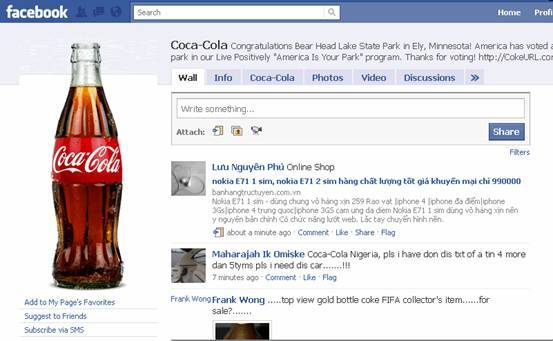
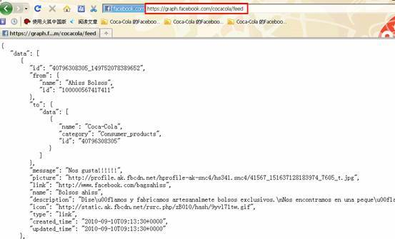
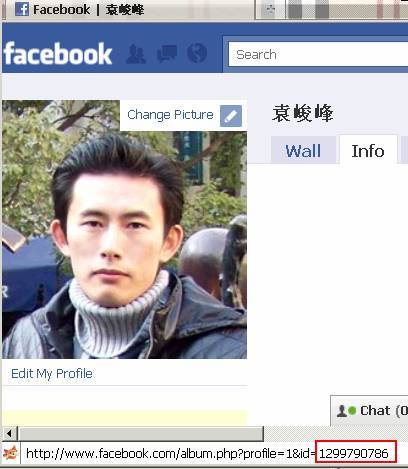
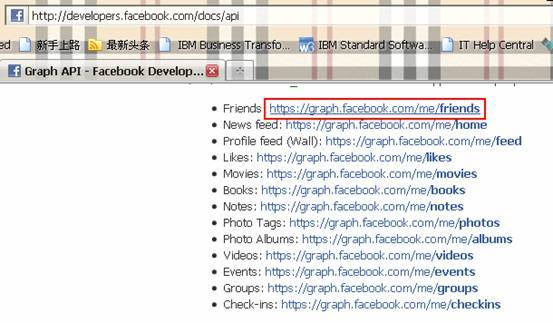
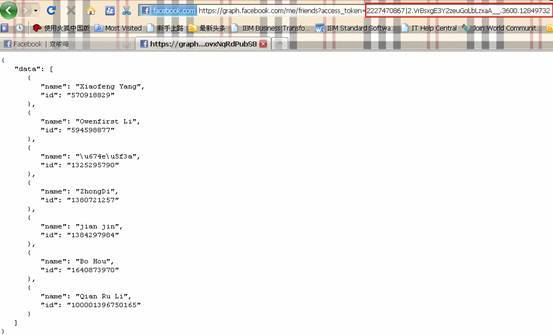
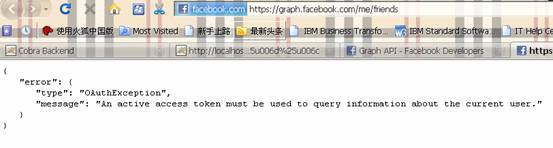
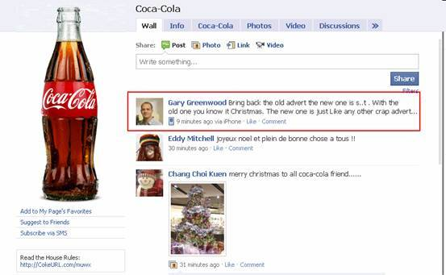
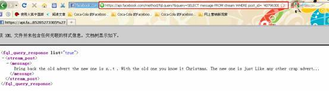

# Facebook API 入门
Facebook 信息抓取

**标签:** API 管理

[原文链接](https://developer.ibm.com/zh/articles/os-cn-facebookapi/)

袁 俊峰, 李 倩如, 刘 涛

发布: 2010-12-29

* * *

## Facebook 商业价值简介

Facebook 是一个社交网络服务网站，于 2004 年 2 月 4 日上线，到 2010 年 2 月 2 日， Facebook 正赶超雅虎将成为全球第三大网站，与微软谷歌领衔前三。Facebook 一个月内增加的新用户量相当于雅虎一年所增加的用户量，当前的注册用户为 3.5 亿，这些用户中有一半的人每天都会访问网站。面对如此庞大和活跃的的用户群体，企业已经看到了它所蕴含的巨大商机。许多品牌都在 Facebook 上创建了企业账户，收集用户对产品的的评论反馈信息，及时对自己的产品和品牌做出调整，抢占市场先机。目前市场上有很多优秀的舆情智能分析工具，可以海量分析网络上各种媒体介质的信息，通过数据挖掘技术分析出用户的喜好和潜在的购买行为。

## Facebook API 简介

获取 Facebook 的数据最常用的途径是通过 web 页面，以 Coca-Cola 为例，用户可以登陆 [http://www.facebook.com/cocacola](http://www.facebook.com/cocacola) 从页面上获得各种数据，包括用户对该产品的评论、产品相册等。Facebook 前端界面做得非常友好，采用了很多最新的 UI 技术，可以带来比较好的用户体验。类似的前端展示技术服务的对象是人，而程序在处理非结构化数据的时候有很多困难，随着前端页面布局的不断更新，仅仅使用网络爬虫的手段很难保证抓取信息的准确性。

##### 图 1\. facebook



Facebook 为了解决第三方程序访问数据的问题推出了一套 Facebook API 平台，叫做 Graph API。它让普通用户可以读写在 Facebook Social Graph 的各种对象，这套 API 设计得非常简单，开发人员不需要花大量时间阅读文档，在最短的时间内就可以上手。读者可以访问 [http://developers.facebook.com/docs/api](http://developers.facebook.com/docs/api) 获得更多信息。

## Facebook API 开发入门

### RESTful 方法获取数据

以 Coca-Cola 的 Facebook 为例，如果我们想获得其它用户在其涂鸦墙 (Wall) 上的评论，我们要做的仅仅是在浏览器中输入 : [https://graph.facebook.com/cocacola/feed](https://graph.facebook.com/cocacola/feed), 系统将会以 JSON 数组格式返回结果。JSON(JavaScript Object Notation) 是一种轻量级的数据交换格式，易于人阅读和编写，同时也易于机器解析和生成。

##### 图 2\. 获得其它用户在其涂鸦墙 (Wall) 上的评论



数据中包含了消息的 ID、消息内容、作者、作者 ID、发布时间等各种消息。不仅涂鸦墙 (Wall)，所有的 Facebook 对象都可以用如下的 URL 结构访问： `https://graph.facebook.com/ID/CONNECTION_TYPE`， 下表列出了一些常用的对象。

**Facebook 对象****访问方式**好友列表 (Friends)`https://graph.facebook.com/{ID}/friends`新闻 (News feed)`https://graph.facebook.com/{ID}/home`用户喜好 (Likes)`https://graph.facebook.com/{ID}/likes`电影 (Movies)`https://](https://graph.facebook.com/%7BID%7D/movies`书籍 (Books)`https://graph.facebook.com/{ID}/books`相册 (Photo Albums)`https://graph.facebook.com/{ID}/albums`上传视频 (Video Uploads)`https://graph.facebook.com/{ID}/videos/uploaded`组 (Groups)`https://graph.facebook.com/{ID}/groups`)

只有该对象是 public 的状态下才能直接通过以上方法访问，如果是 private 的，需要提供 access token 访问，文章的下面部分有对应的章节介绍。

### JSON 解析框架处理数据

如果用 Java 语言开发系统，拿到 JSON 对象后我们还需要做一个 JSON 对象到 Java 对象的转换工作。当前有比较多的 JSON 解析框架。在 [www.json.org](http://www.json.org/) 上公布了很多 Java 下的 JSON 解析工具，其中 org.json 和 json-lib 比较简单，两者的使用几乎是相同的，但是 org.json 比 json-lib 要轻量很多，前者没有任何依赖，而后者要依赖其它组件。利用 org.json 处理 JSON 非常简单，下面是一段获取 Coca-Cola 涂鸦墙 (Wall) 信息的代码片段。

```
/*
* Extract message from JSON format
* @param sb
*           JSON content
*/
privatestaticvoidgetMessages(String sb) throwsJSONException{
     JSONObject jsonObj=newJSONObject(sb);
     JSONArray array=newJSONArray(jsonObj.getString("data"));
     for(inti=0;i<array.length();i++){
       jsonObj=array.getJSONObject(i);
       if(jsonObj.has("message"))
       System.out.println("Facebook message: "+jsonObj.getString("message"));
     }
}

```

Show moreShow more icon

除了自己处理 JSON 到 Java 的转换外，我们也有很多优秀的开源框架可供选择，比如 RestFB。它不仅可以完成数据的转换，还对 Graph API 进行了更好的封装，让用户不用过多了解 Graph API 的技术细节。

## Facebook API 开发进阶

### 使用 access token 访问涂鸦墙

在上面的例子中，我们访问的 Coca-Cola 公司涂鸦墙 (Wall) 是 Public 的属性，所有人都可以查看上面的内容，不需要任何的鉴权。但是大多数个人账户的涂鸦墙的属性都是 private，需要提供正确的 token 才能访问。

Facebook Graph API 使用 OAuth 2.0 作为权限控制，它是一个简化版的 OAuth, 利用 SSL 协议作为 API 的通信，而不是复杂的 URL 签名和 token 交换。使用 access token 的方法特别简单，如果你想查看自己的朋友列表，URL 的的形式如下所示：`https://graph.facebook.com/me/friends?access_token=XXXX`

me 是参数中的关键字，代表自己的 ID，如果想访问别人的涂鸦墙，就应该用 ID 来唯一确定一个用户。Access token 参数后面是一个系统随机的字符串。

### 获得 ID 和 Access token

前面概述了怎样使用 access token 访问 private 的涂鸦墙，下面将介绍一种获得 ID 和 access token 的方法。

首先登陆自己的 Facebook 账户后，将鼠标移到头像位置，在浏览器的下面的 URL 就包含该账户对应的唯一 ID。

##### 图 3\. 获得 ID 和 access token 的方法



在浏览器里面打开一个新的页，访问如下网址 : [http://developers.facebook.com/docs/api](http://developers.facebook.com/docs/api), 点击该页中的一个链接，如下所示：

##### 图 4\. 访问如下网址



我们在浏览器的地址栏就可以看到访问自己账户的 access token 了，从图中可以看到朋友列表也是以 JSON 格式返回，包含了 name 和 id 属性。

##### 图 5\. 返回信息



为了验证 access token 的有效性，可在浏览器中输入空的 access token 或者错误的 access token，比如 : [https://graph.facebook.com/me/friends](https://graph.facebook.com/me/friends) ，服务器将返回异常提示用户输入 token。这种鉴权机制不仅十分有效的利用了 RESTful 技术的简单易用的优点，又很好地保护了用户的隐私数据。

##### 图 6\. 验证 access token 的有效性



### 使用 FQL 访问 Facebook 数据

FQL(Facebook Query Language) 是 Facebook 提供给应用开发者使用的一种类似 SQL 的数据库查询语言，FQL 相对其它的 API 有如下优势：

1. FQL 提高网络利用效率。如果使用 Graph API 来获取数据，你将获得记录的所有属性，包括你不需要的部分属性。而通过 FQL 的 select 语句，可以只取出需要的数据，在大数据量的情况下可以减少网络资源消耗。

2. FQL 提高执行效率。对于复杂的请求，FQL 能有效减少对服务器的请求次数。实际上，Graph API 调用是经过底层的 FQL 进行包装过的，如果直接使用 FQL 能得到性能上的提升。

3. FQL 与语言无关，Facebook 的 API 有几个版本，比如 : php、java 等，如果工作在多语言编程环境，FQL 无疑是种很好的选择。


如果你以前用过 SQL，就会发现 FQL 语法和 SQL 几乎一致，只是在 SQL 的基础上做了一些小的限制，比如：从效率考虑，FQL 不支持 select \* 这样一次取出所有属性。

可以使用 [https://api.facebook.com/method/fql.query?query=QUERY](https://api.facebook.com/method/fql.query?query=QUERY) 的方式执行 SQL，查询条件的结构类型：SELECT [fields] FROM [table] WHERE [conditions] ，我们还是通过获取 Coca-Cola 涂鸦墙的数据示例 FQL 的用法，在这个示例中将取出第一条用户的评论：

##### 图 7\. 取出第一条用户的评论



只需要在浏览器中输入 `https://api.facebook.com/method/fql.query?&query=SELECT message FROM stream WHERE post_id= '40796308305_485285273305'` 就可以 XML 形式返回用户的评论。

##### 图 8\. 以 XML 形式返回用户的评论



在使用 FQL 的时候需要用户了解查询对应的表结构的定义，详细的资料可以参考： [http://developers.facebook.com/docs/reference/fql/](http://developers.facebook.com/docs/reference/fql/)

## 结束语

提供可扩展的 API 是 Facebook 成功的因素之一，现在 Facebook 的开发社区已经有了相当数量的应用程序，极大增强了 Facebook 的功能和易用性。Facebook 提供的 API 不仅仅是读取涂鸦墙和朋友列表那么简单，用户可以在它的开发社区找到许多非常有创意和实用的应用。