# Git 分支简介、Git 和 GitHub 日常操作
更好地理解 Git 的操作

**标签:** DevOps

[原文链接](https://developer.ibm.com/zh/articles/os-cn-git-and-github-3/)

曹 志, 杨 翔宇, 贾 志鹏

发布: 2018-12-24

* * *

## 前言

在本系列的前两篇文章讲解了 Git 的 [基础特性](https://developer.ibm.com/zh/articles/os-cn-git-and-github-1/) 和 [基础配置](https://developer.ibm.com/zh/articles/os-cn-git-and-github-2/) 。从本篇文章开始，我将结合实验和实际的场景详细讲解如何在日常工作中使用 Git 和 GitHub。Git 有六大特性， [第一篇](https://developer.ibm.com/zh/articles/os-cn-git-and-github-3/) 中介绍了前五个特性，本文将介绍 Git 的最后一个特性：三种状态和三个工作区，然后介绍 Git 的核心功能：Git 分支，最后介绍 Git 的一些日常操作，例如如何进行一次完整的代码提交以及其它常用操作 log、status 等。

2018 年初，我所在的项目组考虑到之前使用的 Perforce 代码管理系统太多笨重且将其集成进 DevOps 工具栈具有诸多不便，经讨论之后，决定将代码库从 Perforce 迁移到 GitHub 上。本人负责整理调研和领导 GitHub 迁移工作。目前已成功将项目代码库迁移并且将其集成进了日常构建。在迁移过程中，我积累诸多宝贵经验，故此借此机会编写一个系列技术文章，来介绍 Git 和 GitHub 基础知识、使用技巧和到最后如何实施的迁移。

本系列将会围绕 Git 和 GitHub 全面涵盖并介绍 Git 原理、Git 和 GitHub 使用、分支管理策略、权限控制策略、代码评审和 pull request、将 GitHub 集成进持续集成，最后会集中介绍代码迁移的整个过程，向有兴趣的读者分享这一过程中所遇到的各种问题和解决办法。

—— 曹志

## Git 的三种状态和三个工作区域

一个文件在 Git 中被管理时有三种状态以及对应所处的三种工作区域，理解这一特性将有助于我们更好的理解 Git 的常用命令的原理。在随后的 Git 操作介绍中，也会经常提到文件的各种状态变化和所处的工作区域。

### 三种状态

- 已修改（Modified）：表示代码被修改了，但还没有被保存到代码库中被管理起来。
- 已暂存（Staged）：表示将修改保存到暂存区（Staging Area）。对应于 `add/rm/mv` 命令（添加/删除/移动）。 `git add/rm/mv` 可将对应的修改保存到暂存区。
- 已提交（Committed）：表示已经将修改提交至代码库中被管理起来。对应于 commit 命令。 `git commit` 命令可将已暂存的修改提交到代码库中。

### 三个工作区域

Git 中有三个工作区域与上述三种状态相对应，如下图 1 所示：

##### 图 1\. 三个工作区域和三种状态

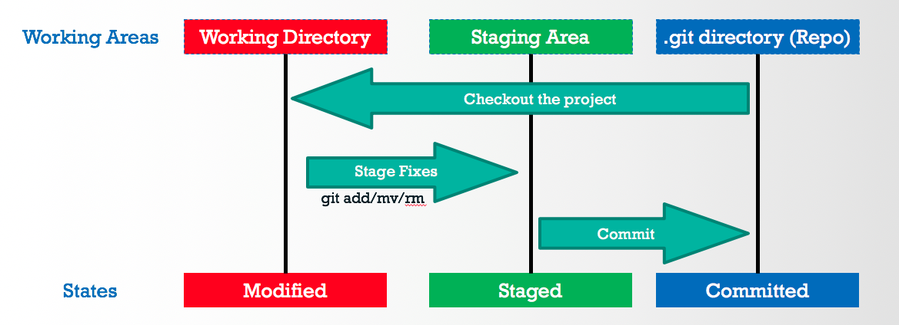

- 工作目录（Working Directory）：工作目录是我们常用的使用或修改代码的目录，它可以从 Git 仓库目录中 checkout 出特定的分支或者版本来使用。在工作目录的修改如果未添加到暂存区，那么该修改仍处在已修改状态。
- 暂存区域（Staging Area）：当我们在工作目录中修改了文件，我们需要先将修改添加到暂存区。暂存区的修改就是已暂存状态。
- Git 仓库目录（.git directory）：Git 仓库目录就是真正存储和管理代码库的目录。提交修改到代码库本质上就是将暂存区的修改提交（commit）到代码库中。处在 Git 仓库目录中的修改就是已提交状态。

总结下来，一次完整的提交包含以下操作:

1. 修改文件。
2. 将修改的文件保存到暂存区（`git add/rm/mv`）。
3. 将暂存区的文件提交（`git commit`）到代码库中。

当然如果需要将本地代码库的修改同步到远程代码库中（例如 GitHub），还需要将本地修改 push 到远程。

### 为什么要有暂存区？

暂存区是 Git 另一个区别于传统版本控制系统的概念之一。传统的版本控制系统例如 SVN、Perforce，提交代码时直接将修改提交到了代码库中。暂存区相当于在工作目录和代码仓库之间建立了一个缓冲区，在真正 commit 之前，我们可以做任意的修改，先将修改保存到暂存区，待所有修改完成之后就可以将其完整的 commit 进代码库，这样可以保证提交的历史是干净清晰的；保存到暂存区的修改也可以被撤销，而不会影响到现有的版本库和提交历史。暂存区另一个作用是在进行多分支工作时，我们常常在某一分支上进行了修改，但又不想提交到代码库中，这时候我们可以使用 `git stash` 命令将暂存的和未暂存的修改保存到一个缓冲栈里，使得当前工作分支恢复到干净的状态；待我们想再次恢复工作时，只需要将缓冲栈的修改恢复到暂存区即可。

## Git 分支

理解了 Git 的工作区和几个状态之后，我们来看一下 Git 另一重要概念：分支。Git 的分支技术是 Git 的核武器，理解并合理的使用 Git 分支，将大大的提升我们的工作效率。本章将会通过一系列实验来讲解 Git 的分支技术。

### 理解 Git 分支

在 Git 中，分支本质上是指向提交对象的可变指针。首先我们可以使用 `git branch` 或者 `git branch -a` 命令列出本地所有的分支。如图 2 所示，git branch 列出了本地已经被 check out 分支，其中带星号的绿色标注的分支是当前的 check out 出来的工作分支。而 `git branch -a` 除了列出本地已经被 check out 分支，还列出了所有本地仓库中与远端相对应的分支，即图中的红色标注的分支。

##### 图 2\. 查看分支

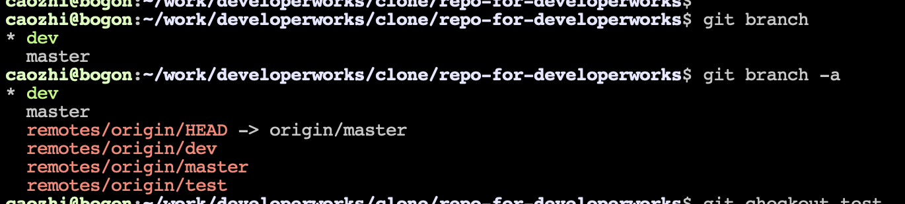

注意：

- 不像其它的 SCM 创建的分支是物理复制出额外的文件夹来创建分支，Git 的所有分支都在同一个目录之下，我们一般只需要将正在进行开发的分支 check out 出来并切换成当前工作分支即可，如上图中的 dev 分支。
- 虽然上图显示出来红色的分支是 remote 分支，但它们本质上还是存储于本地的分支，只是这些分支是指向对应的远端分支。后面会再详细说明该类分支。

接下来使用 git log 命令可以查看每个分支所指向的提交。如图 3 所示，可以看到绿色标注的两个本地分支 dev 和 master 分别指向的 commit。

##### 图 3\. 查看分支对应的 commit

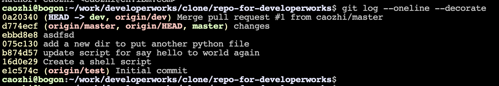

### 理解 origin

从上图 3 可以看到，有些红色标注的分支名称前带有 origin 的前缀。origin 实际上是 git 默认生成的一个仓库名称，在每次 clone 的时候 git 会生成一个 origin 仓库，该仓库是一个本地仓库，它指向其对应的远程仓库。前面提到的 remote 分支 `remotes/origin/*` ，实际上就是储存于 origin 仓库的本地分支，它只是与对应的远端分支具有映射关系。通过 `git remote -v` 命令可以查看本地所有的仓库所指向的远程仓库。如图 4 所示：

##### 图 4\. 查看本地仓库指向的远端仓库

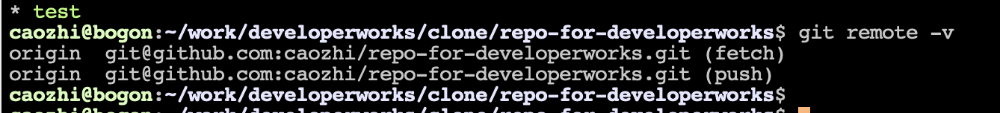

基于此机制，我们也可以 clone 其它的仓库到同一个本地目录。如图 5 所示，执行 `git remote add remote-sample git@github.com:caozhi/sample-project.git` 命令添加一个本地仓库 remote-sample 向我的另一个远端仓库 `git@github.com:caozhi/sample-project.git` ，再通过 `git remote -v` 命令我们可以看到新建的本地仓库 remote-sample 向以及指向的远端仓库。

##### 图 5\. 添加本地仓库

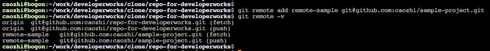

注意，在本地代码库中建立多个 remote 仓库的映射对于大多数开发者来说，不是一个最佳实践，因为这样会使得本地开发环境比较混乱。一般只有在做持续集成时，为了方便在同一个代码目录下编译打包项目，才推荐在本地建立多个远端仓库的映射。

### 理解 HEAD 指针

HEAD 针是指向当前工作分支中的最新的分支或者 commit。Git 通过 HEAD 知道当前工作分支指向的哪条 commit 上。HEAD 针存在的意义在于我们可以通过设定 HEAD 针指向的 commit 来灵活地设定我们当前的工作分支，由于 HEAD 针并不仅仅指向实际存在的分支，也可以指向任意一条 commit，因此我们可以任意地设定当前工作分支指向任一历史 commit。

首先我们通过 checkout 操作切换当前工作分支来查看 HEAD 针的变化，如图 6 所示，我们当前的分支是 dev 分支，HEAD 针就指向了 dev 分支，我们再 checkout master 分支，当前工作分支变为了 master 分支，而 HEAD 针就指向了 master 分支对应的 commit。

##### 图 6\. 切换HEAD指针指向的分支

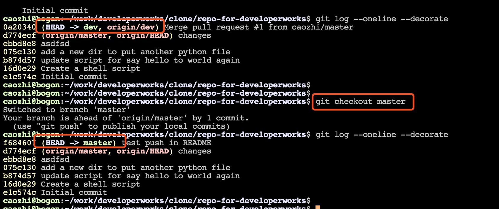

我们再执行 `git checkout 075c130` 尝试 checkout 一个历史 commit，如图 7 所示，此时可以看到 Git 会为我们创建一个 detached 的分支，该分支并不指向一个实际存在的分支。执行 `git log` 命令也能看到，HEAD 针指向了 `075c130` 这个 commit，而非一个分支。

##### 图 7\. 切换HEAD指针指向任意 commit

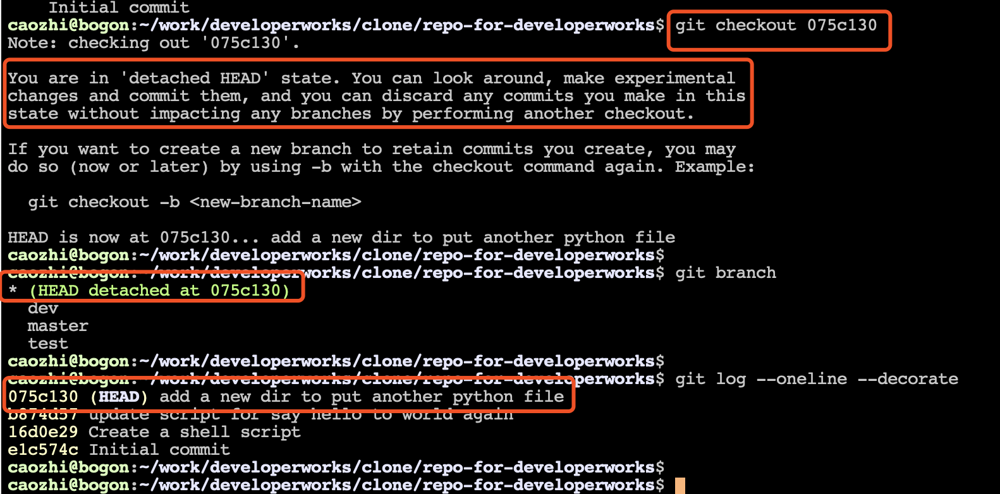

### 理解 push

当我们完成了本地的代码提交，需要将本地的 commit 提交到远端，我们会使用 `git push` 命令。Push 操作实际上是先提交代码到本地的 `remote/**` 分支中，再将 `remote/**` 分支中的代码上传至对应的远端仓库。

当远端仓库的提交历史要超前于本地的 `remote/**` 提交历史，说明本地的 remote 分支并不是远端最新的分支，因此这种情况下 push 代码，Git 会提交失败并提示 `fetch first` 要求我们先进行同步，下图 8 所示：

##### 图 8\. push 失败

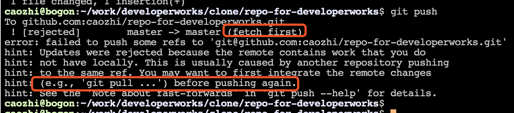

### 理解 fetch, pull

fetch 和 pull 操作都可以用来同步远端代码到本地。在多数开发者的实践中，可能更习惯使用 `git pull` 去同步远端代码到本地, 但是 git fetch 也可以用于同步远端代码到本地，那二者的区别是什么呢？

- fetch 操作是将远端代码同步到本地仓库中的对应的 remote 分支，即我们执行 `git fetch` 操作时，它只会将远端代码同步到本地的 `remote/**` 分支中，而本地已经 checkout 的分支是不会被同步的。
- pull 操作本质上是一条命令执行了两步操作， `git fetch` 和 `git merge` 。执行一条 `git pull` 命令，首先它会先执行 fetch 操作将远端代码同步到本地的 remote 分支，然后它会执行 `git merge` 操作将本地的 remote 分支的 commits 合并到本地对应的已经 check out 的分支。这也是为什么在 pull 时常常会出现 merge 的冲突，这是在执行 merge 操作时，git 无法自动的完成 merge 操作而提示冲突。另一种经常出现的情况是，pull 会自动产生一条 merge 的 commit，这是因为本地工作分支出现了未提交的 commit，而在 pull 时 Git 能够自动完成合并，因此合并之后会生成一条 merge 的 commit。

让 Git 自动为我们去生成这样的 merge commit 可能会打乱我们的提交历史，因此比较好的实践方式是先 `git fetch` 同步代码到本地 remote 分支再自己执行 `git merge` 来合并代码到本地工作分支，通过这种方式来代替 `git pull` 命令去同步代码。

## Git 的日常操作

通过前文介绍，相信您对 Git 工作区和 Git 分支技术已经有了更深入的了解，下面我再介绍一些日常使用的 Git 和 GitHub 操作。

### Git 分支操作

- 查看本地分支： `git branch [-av]`

`git branch` 可以用于查看本地分支。 `-a` 选项会列出包括本地未 checkout 的远端分支。 `-v` 选项会额外列出各分支所对应的 commit，如下图 9 所示：

##### 图 9\. 查看分支

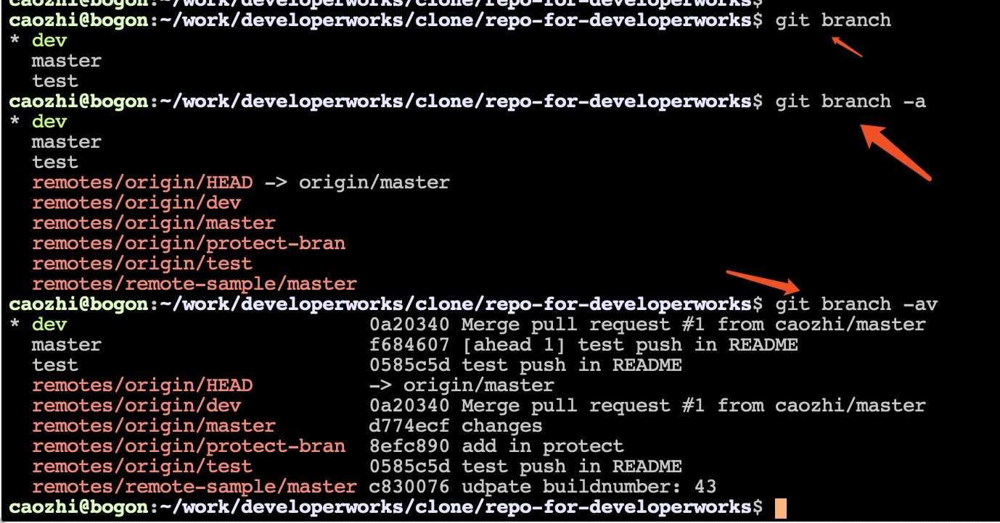

- 创建本地分支： `git branch branchname` ，如图 10 所示。创建本地分支时时会基于当前的分支去创建，因此需要注意当前工作分支是什么分支。

#### 图 10\. 创建本地分支

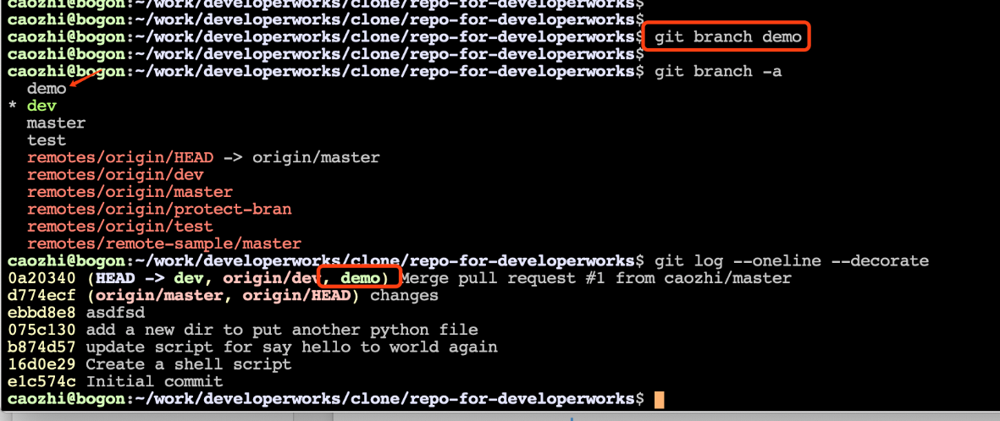

- 推送本地分支到远端： `git push origin branchname:remote_branchname` ，如图 11 和 图 12 所示。技术上本地分支 `branchname` 和远端分支 `remote_branchname` 必是相同的名字，但实践中为了方便记忆，最好使用相同的名字。

##### 图 11\. 推送本地分支到远端

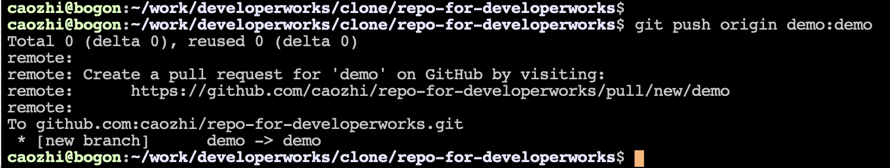

##### 图 12\. 在 GitHub 上查看推送的分支

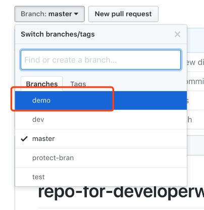

- 切换工作分支： `git checkout branchname` ，如图 13 所示：

##### 图 13\. 切换工作分支

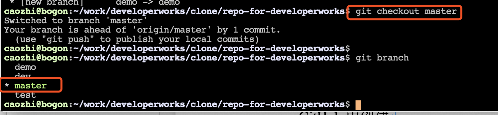

- 删除本地分支：git branch -d branchname，如图 14 所示：

##### 图 14\. 删除本地分支

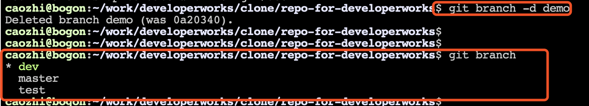

- 删除远端分支：git push :remote\_branchname，如图 15 和图 16 所示：

##### 图 15\. 删除远端分支

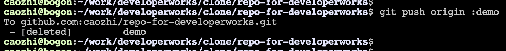

##### 图 16\. 在 GitHub 上查看被删除的分支

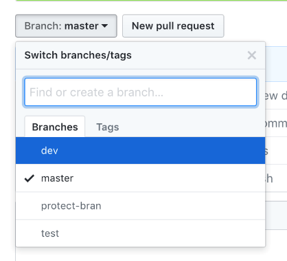

### GitHub 分支操作

除了本地创建，然后推送到远端的方式之外，我们也可以直接在 GitHub 上创建远程分支，本地只需要 fetch 下来即可。如图 17 和图 18 所示：

##### 图 17\. GitHub 中创建分支

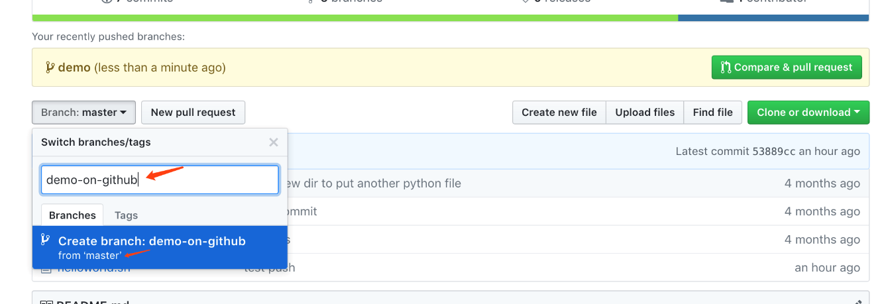

##### 图 18\. 查看创建的分支

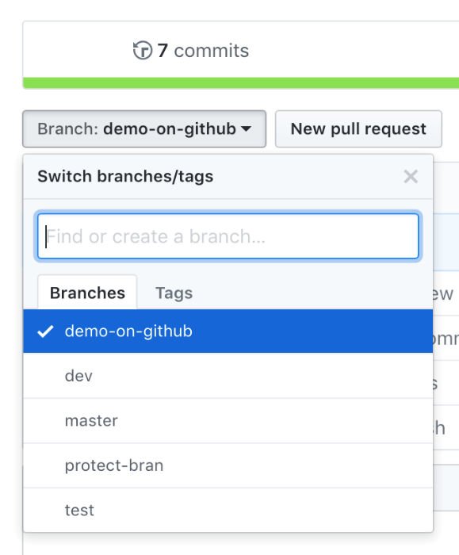

在 GitHub 上我们也可以直接删除分支。首先我们进入代码库的 **branches** 页面，该页面列出了我们所有的分支, 如图 19 和图 20 所示:

##### 图 19\. 进入 branches 页面

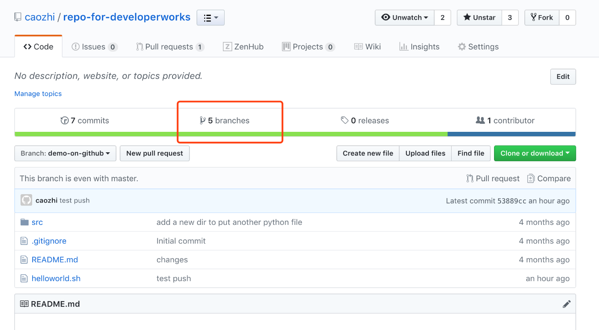

在 **branches** 页面，我们找到想要删除的分支，点击分支条目后方的垃圾箱按钮，即可删除该分支，如图 20、图 21 和 图 22 所示:

##### 图 20\. 在 GitHub 上删除分支

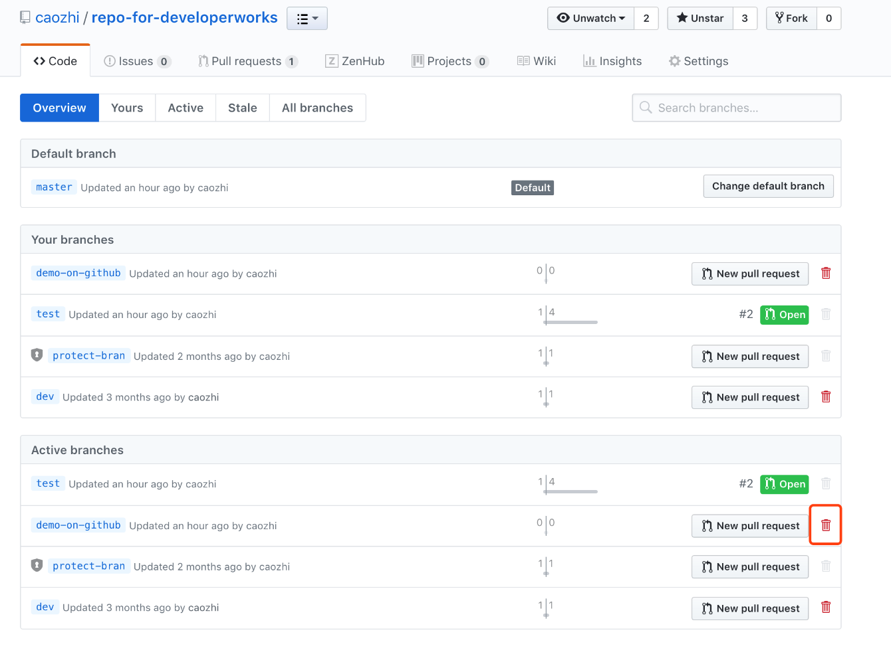

##### 图 21\. 删除分支后

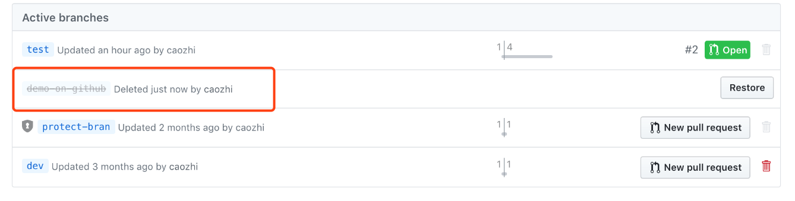

##### 图 22\. 代码库主界面再次查看该分支

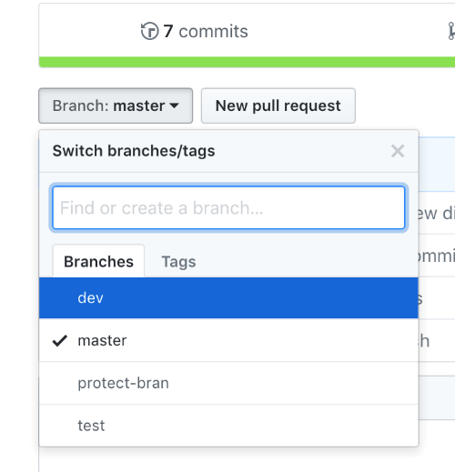

分支的其它进阶操作，如合并分支、比较分支差异等我们将在下一篇进行介绍。

### 从远端同步代码

在前面章节 Git 分支的介绍时已经讲解了 pull 和 fetch 区别。二者都可以用来从远端同步代码到本地。本处不再赘述。

### 一次完整的提交

下面列出了一次完成的提交流程：

1. 总是先同步远端代码到本地：一个 Git 的最佳实践是，在每次正式提交代码前都先将远端最新代码同步到本地。同步代码使用 `git pull` 或者 `git fetch` & `git merge` 。
2. 将本地修改提交到暂存区：使用 `git add/rm/mv` 命令将本地修改提交到暂存区中。此处需要注意，为了使 Git 能够完整的跟踪文件的历史，使用对应的 git rm/mv 命令去操作文件的删除、移动和复制，而不要使用操作系统本身的删除、移动和复制操作之后再进行 `git add` 。
3. 将暂存区的修改提交到本地仓库：使用 `git commit` 命令将暂存区中的修改提交到本地代码库中。
4. 使用 `git push` 命令提交本地 commit 到远端。

## Git 其它常用操作

### Log 操作

Log 命令用于查看代码库的提交历史。结合 log 命令提供的各种选项，可以帮助我们查看提交历史中有用的提交信息。

- `--oneline` 选项：不显示详细信息，只列出 commit 的 id 和标题， 如图 23 所示：

##### 图 23\. log 的 –oneline 选项

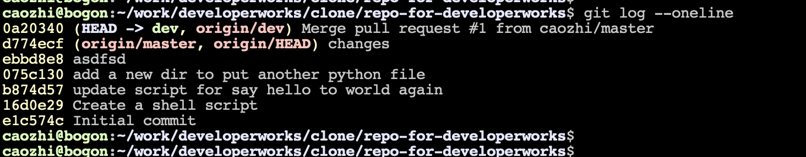

- `-p` 选项：列出 commit 里的文件差异，如图 24 所示：

##### 图 24\. log 的 -p 选项

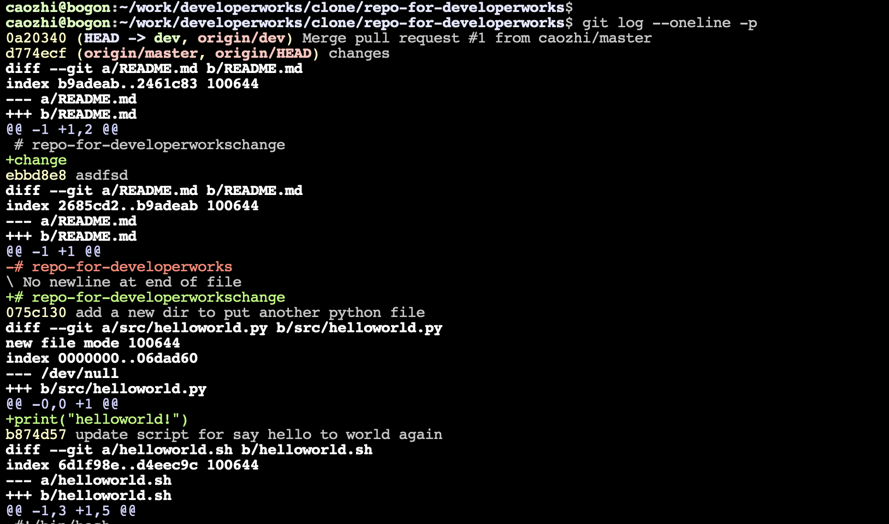

- `-number` 选项：只列出 number 数的 commit 历史，如图 25 所示：

##### 图 25\. log 的-number 选项

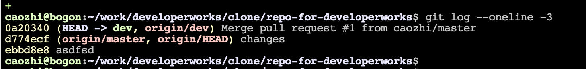

- `--name-only` 选项：列出每条 commit 所修改的文件名。此选项只列出修改的文件名，不列出修改类型，如图 26 所示：

##### 图 26\. log 的 –name-only 选项

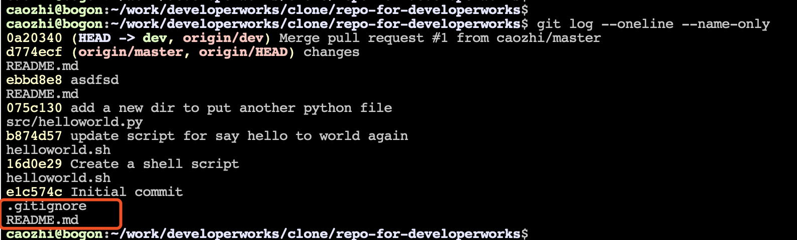

- `--name-status` 选项：列出每条 commit 所修改的文件名和对应的修改类型，如图 27 所示：

##### 图 27\. log 的 –name-status 选项

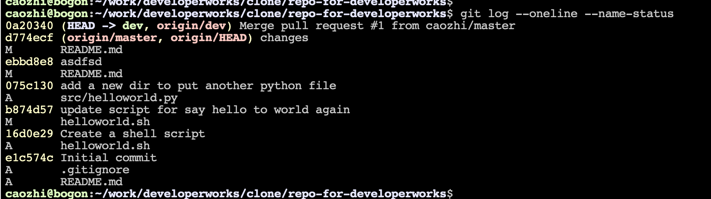

- `--stat` 选项：列出每条 commit 所修改的统计信息，如图 28 所示：

##### 图 28\. log 的 –stat 选项

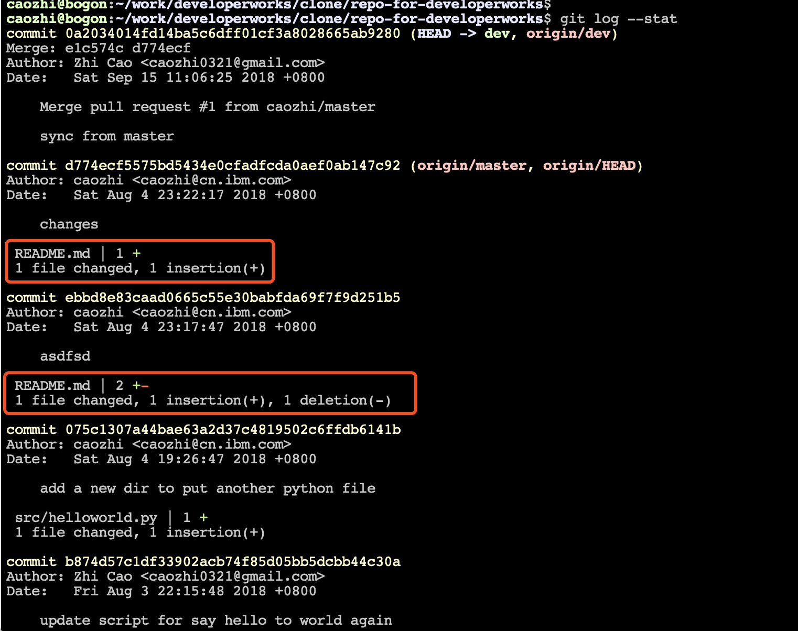

### Blame 操作

Blame 命令是一个非常实用但是鲜为人知的命令，它可以用来查看单个文件中每行代码所对应的最新的提交历史。为了展现更多的提交历史，本操作是在我的另一个代码库 [devops-all-in-one](https://github.com/caozhi/devops-all-in-one) 中进行的实验。如图 29 所示，可以看到每行代码都列出了对应的最新的 commit、文件名、提交者、时间等信息。

##### 图 29\. git blame 操作

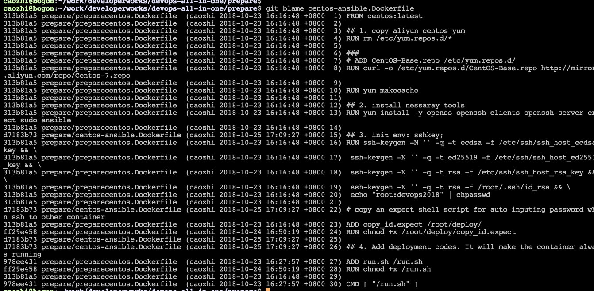

我们也可以添加 `-L` 选项控制只显示我们所关心的行。如清单 1 所示：

##### 清单 1\. Blame 命令的 -L 选项

```
git blame -L 10,20 filename
git blame -L 10,+10 filename
git blame -L 20,-5 filename

```

Show moreShow more icon

`10,20` 即显示第 10 行到第 20 行代码的信息； `10,+10` 即显示第 10 行开始往后 10 行代码的信息； `10,-5` 即显示第 10 行开始往前 5 行代码的信息。如图 30 所示：

##### 图 30\. 执行 git blame -L

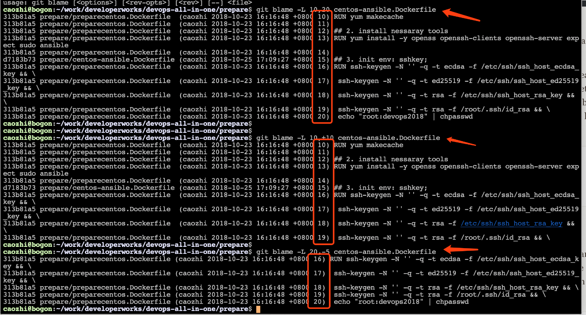

### Status 操作

`git status` 是另一个常用的命令，用于查看当前分支的修改状态。当前分支没有任何修改时，执行 `git status` 命令会显示 `working tree clean` ，如图 31 所示：

##### 图 31\. 无修改时执行 git status 操作

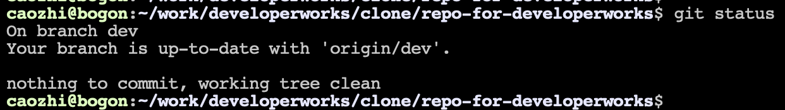

当我们对当前分支进行了更改时， `git status` 会根据被修改文件的状态显示不同的信息，如图 32 所示：

- 红色框的修改表明这些修改已经提交到了暂存区。
- 蓝色框的修改表示它们还在工作区未被提交到暂存区。
- 绿色框的修改表示是新文件，这些文件没有被代码库所跟踪。

##### 图 32\. 有修改时执行 git status

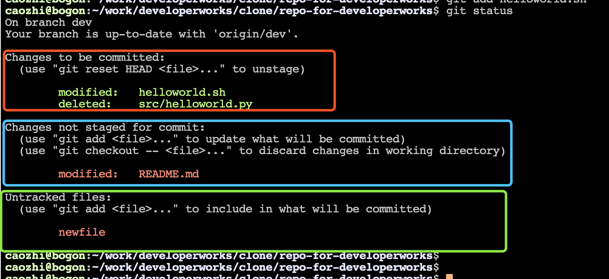

### Diff 操作

Diff 操作用于查看比较两个 commit 或者两个不同代码区域的文件异同。

- `git diff` ：默认比较工作区和暂存区，如图 33 所示：

##### 图 33\. 比较工作区和暂存区

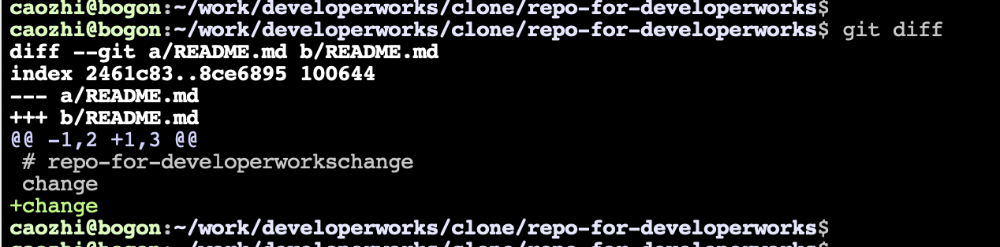

- `--cached` 选项：比较暂存区和代码库的差异，例如图 34 所示：

##### 图 34\. 比较暂存区和本地代码库

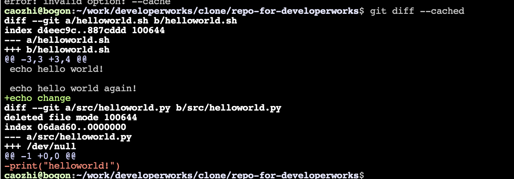

- 在命令后面指定特定的文件名，也可以比较特定文件的差异，如图 35 所示：

##### 图 35\. 比较工作区和暂存区

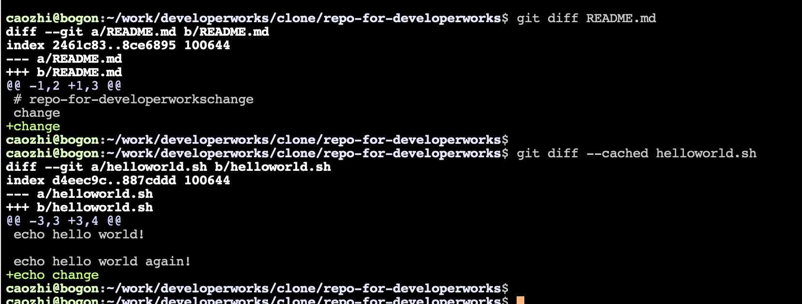

## 结束语

本文重点介绍了 Git 的分支，讲解了一些不容易理解的概念如 HEAD 指针、origin 仓库等，并通过实验介绍了分支的常用操作：创建、删除、切换等。同时，本文还介绍了 Git 的日常常用操作。相信您在阅读完本文之后将有能力使用 Git 和 GitHub 进行日常开发。在下一篇文章中将会通过一系列实验和实际应用场景讲解一些我们在日常工作中经常遇到的 Git 进阶操作，例如撤销、回滚、分支比较等。