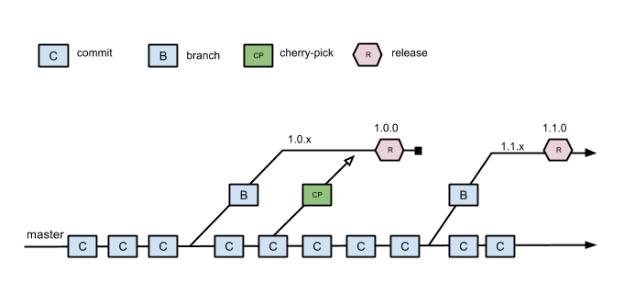
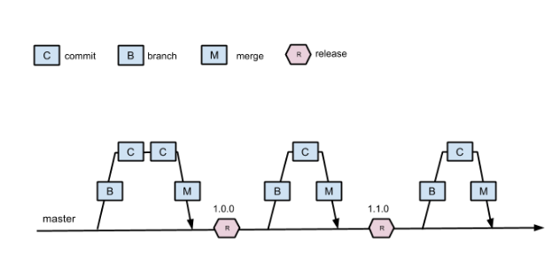

# Git 分支管理最佳实践
几种主流的 Git 分支管理实践

**标签:** Java

[原文链接](https://developer.ibm.com/zh/articles/j-lo-git-mange/)

成富

发布: 2016-06-20

* * *

Git 是目前最流行的源代码管理工具。大量的软件项目由 GitHub、Bitbucket 和 GitLab 这样的云服务平台或是私有的 Git 仓库来管理。在使用 Git 时通常会遇到的一个问题是采用何种分支管理实践，即如何管理仓库中作用不同的各类分支。和软件开发中的其他实践一样，Git 分支管理并没有普遍适用的最佳做法，而只有对每个团队和项目而言最适合的做法。简单来说，在项目开发中使用多个分支会带来额外的管理和维护开销，但是多个分支对于项目的团队合作、新功能开发和发布管理都是有一定好处的。不同的团队可以根据团队人员组成和意愿、项目的发布周期等因素选择最适合的策略，找到最适合团队的管理方式。本文将介绍三种常见的 Git 分支管理方式。

## 单主干

单主干的分支实践（Trunk-based development，TBD）在 SVN 中比较流行。 [Google](http://paulhammant.com/2013/05/06/googles-scaled-trunk-based-development/) 和 [Facebook](http://paulhammant.com/2013/03/13/facebook-tbd-take-2/) 都使用这种方式。trunk 是 SVN 中主干分支的名称，对应到 Git 中则是 master 分支。TBD 的特点是所有团队成员都在单个主干分支上进行开发。当需要发布时，先考虑使用标签（tag），即 tag 某个 commit 来作为发布的版本。如果仅靠 tag 不能满足要求，则从主干分支创建发布分支。bug 修复在主干分支中进行，再 cherry-pick 到发布分支。图 1 是 TBD 中分支流程的示意图。

##### 图 1\. TBD 中的分支流程的示意图



由于所有开发人员都在同一个分支上工作，团队需要合理的分工和充分的沟通来保证不同开发人员的代码尽可能少的发生冲突。持续集成和自动化测试是必要的，用来及时发现主干分支中的 bug。因为主干分支是所有开发人员公用的，一个开发人员引入的 bug 可能对其他很多人造成影响。不过好处是由于分支所带来的额外开销非常小。开发人员不需要频繁在不同的分支之间切换。

## GitHub flow

[GitHub flow](http://scottchacon.com/2011/08/31/github-flow.html) 是 GitHub 所使用的一种简单的流程。该流程只使用两类分支，并依托于 GitHub 的 pull request 功能。在 GitHub flow 中，master 分支中包含稳定的代码。该分支已经或即将被部署到生产环境。master 分支的作用是提供一个稳定可靠的代码基础。任何开发人员都不允许把未测试或未审查的代码直接提交到 master 分支。

对代码的任何修改，包括 bug 修复、hotfix、新功能开发等都在单独的分支中进行。不管是一行代码的小改动，还是需要几个星期开发的新功能，都采用同样的方式来管理。当需要进行修改时，从 master 分支创建一个新的分支。新分支的名称应该简单清晰地描述该分支的作用。所有相关的代码修改都在新分支中进行。开发人员可以自由地提交代码和 push 到远程仓库。

当新分支中的代码全部完成之后，通过 GitHub 提交一个新的 pull request。团队中的其他人员会对代码进行审查，提出相关的修改意见。由持续集成服务器（如 Jenkins）对新分支进行自动化测试。当代码通过自动化测试和代码审查之后，该分支的代码被合并到 master 分支。再从 master 分支部署到生产环境。图 2 是 GitHub flow 分支流程的示意图。

##### 图 2\. Github flow 中的分支流程的示意图



GitHub flow 的好处在于非常简单实用。开发人员需要注意的事项非常少，很容易形成习惯。当需要进行任何修改时，总是从 master 分支创建新分支。完成之后通过 pull request 和相关的代码审查来合并回 master 分支。GitHub flow 要求项目有完善的自动化测试、持续集成和部署等相关的基础设施。每个新分支都需要测试和部署，如果这些不能自动化进行，会增加开发人员的工作量，导致无法有效地实施该流程。这种分支实践也要求团队有代码审查的相应流程。

## git-flow

[git-flow](http://nvie.com/posts/a-successful-git-branching-model/) 应该是目前流传最广的 Git 分支管理实践。git-flow 围绕的核心概念是版本发布（release）。因此 git-flow 适用于有较长版本发布周期的项目。虽然目前推崇的做法是持续集成和随时发布。有的项目甚至可以一天发布很多次。随时发布对于 SaaS 服务类的项目来说是很适合的。不过仍然有很大数量的项目的发布周期是几个星期甚至几个月。较长的发布周期可能是由于非技术相关的因素造成的，比如人员限制、管理层决策和市场营销策略等。

git-flow 流程中包含 5 类分支，分别是 master、develop、新功能分支（feature）、发布分支（release）和 hotfix。这些分支的作用和生命周期各不相同。master 分支中包含的是可以部署到生产环境中的代码，这一点和 GitHub flow 是相同的。develop 分支中包含的是下个版本需要发布的内容。从某种意义上来说，develop 是一个进行代码集成的分支。当 develop 分支集成了足够的新功能和 bug 修复代码之后，通过一个发布流程来完成新版本的发布。发布完成之后，develop 分支的代码会被合并到 master 分支中。

其余三类分支的描述如 [表 1\. git-flow 分支类型](#表-1-git-flow-分支类型) 所示。这三类分支只在需要时从 develop 或 master 分支创建。在完成之后合并到 develop 或 master 分支。合并完成之后该分支被删除。这几类分支的名称应该遵循一定的命名规范，以方便开发人员识别。

##### 表 1\. git-flow 分支类型

分支类型命名规范创建自合并到说明featurefeature/\*developdevelop新功能releaserelease/\*developdevelop 和 master一次新版本的发布hotfixhotfix/\*masterdevelop 和 master生产环境中发现的紧急 bug 的修复

对于开发过程中的不同任务，需要在对应的分支上进行工作并正确地进行合并。每个任务开始前需要按照指定的步骤完成分支的创建。例如当需要开发一个新的功能时，基本的流程如下：

- 从 develop 分支创建一个新的 feature 分支，如 feature/my-awesome-feature。
- 在该 feature 分支上进行开发，提交代码，push 到远端仓库。
- 当代码完成之后，合并到 develop 分支并删除当前 feature 分支。

在进行版本发布和 hotfix 时也有类似的流程。当需要发布新版本时，采用的是如下的流程：

- 从 develop 分支创建一个新的 release 分支，如 release/1.4。
- 把 release 分支部署到持续集成服务器上进行测试。测试包括自动化集成测试和手动的用户接受测试。
- 对于测试中发现的问题，直接在 release 分支上提交修改。完成修改之后再次部署和测试。
- 当 release 分支中的代码通过测试之后，把 release 分支合并到 develop 和 master 分支，并在 master 分支上添加相应的 tag。

因为 git-flow 相关的流程比较繁琐和难以记忆，在实践中一般使用 [辅助脚本](https://github.com/nvie/gitflow) 来完成相关的工作。比如同样的开发新功能的任务，可以使用 git flow feature start my-awesome-feature 来完成新分支的创建，使用 git flow feature finish my-awesome-feature 来结束 feature 分支。辅助脚本会完成正确的分支创建、切换和合并等工作。

### Maven JGit-Flow

对于使用 Apache Maven 的项目来说，Atlassian 的 [JGit-Flow](http://jgitflow.bitbucket.org/index.html) 是一个更好的 git-flow 实现。JGit-Flow 是一个基于 [JGit](http://eclipse.org/jgit/) 的纯 Java 实现的 git-flow，并不需要安装额外的脚本，只需要作为 Maven 的插件添加到 Maven 项目中即可。JGit-Flow 同时可以替代 [Maven release 插件](http://maven.apache.org/maven-release/maven-release-plugin/) 来进行发布管理。JGit-Flow 会负责正确的设置不同分支中的 Maven 项目的 POM 文件中的版本，这对于 Maven 项目的构建和发布是很重要的。

在 Maven 项目的 pom.xml 文件中添加 [清单 1\. JGit-Flow 的 Maven 设置](#清单-1-jgit-flow-的-maven-设置) [清单 1\. JGit-Flow 的 Maven 设置](#清单-1-jgit-flow-的-maven-设置) 中的插件声明就可以使用 JGit-Flow。中包含的是 JGit-Flow 不同任务的配置。

##### 清单 1\. JGit-Flow 的 Maven 设置

```
<build>
<plugins>
<plugin>
<groupId>external.atlassian.jgitflow</groupId>
<artifactId>jgitflow-maven-plugin</artifactId>
<version>1.0-m5.1</version>
<configuration>
<flowInitContext>
<versionTagPrefix>release-</versionTagPrefix>
</flowInitContext>
<releaseBranchVersionSuffix>RC</releaseBranchVersionSuffix>
<noDeploy>true</noDeploy>
<allowSnapshots>true</allowSnapshots>
<allowUntracked>true</allowUntracked>
</configuration>
</plugin>
</plugins>
</build>

```

Show moreShow more icon

JGit-Flow 提供了很多配置选项，可以在 POM 文件中声明。这些配置项可以对不同的任务生效。常用的配置项如 [表 2\. JGit-Flow 的配置项](#表-2-jgit-flow-的配置项) [表 2\. JGit-Flow 的配置项](#表-2-jgit-flow-的配置项) 所示。

##### 表 2\. JGit-Flow 的配置项

名称描述适用任务flowInitContext配置不同类型的分支的名称全局allowSnapshots是否允许存在 SNAPSHOT 类型的依赖allowUntracked是否允许本地 Git 中存在未提交的内容scmCommentPrefix 和 scmCommentSuffixJGit-Flow 会进行代码合并工作。通过这两个配置项来设置 JGit-Flow 进行代码提交时的消息的前缀和后缀全局username 和 password进行 Git 认证时的用户名和密码，适用于 HTTPS 仓库全局releaseBranchVersionSuffixrelease 分支中项目的 POM 文件版本号的后缀developmentVersion下一个开发版本的版本号releaseVersion发布版本的版本号pushReleases是否把 release 分支 push 到远程仓库goals当部署发布版本到 Maven 仓库时执行的目标release-finish，hotfix-finishkeepBranch当发布完成之后是否保留相应的分支release-finish，hotfix-finishnoDeploy是否启用部署到 Maven 仓库的功能release-finish，hotfix-finishnoReleaseBuild在完成发布时是否禁用 Maven 构建release-finishnoReleaseMerge在完成发布时是否把 release 分支合并回 develop 和 master 分支release-finishnoTag在完成发布时是否添加标签release-finish，hotfix-finishsquash在进行分支合并时，是否把多个 commit 合并成一个release-finish，hotfix-finishfeatureName新特性分支的名称feature-start，feature-finish，feature-deploypushFeatures是否把特性分支 push 到远程仓库feature-start，feature-finishnoFeatureBuild在完成特性时是否禁用 Maven 构建feature-finishnoFeatureMerge在完成特性时是否把特性分支合并回 developfeature-finishpushHotfixes在完成 hotfix 时是否把分支合并回 masterhotfix-finishnoHotfixBuild在完成 hotfix 时是否禁用 Maven 构建hotfix-finish

其余的配置项可以参考插件不同任务的 [文档](https://bitbucket.org/atlassian/jgit-flow/wiki/goals.wiki) 。

在启用了 JGit-Flow 之后，可以通过 mvn 运行 jgitflow:feature-start 和 jgitflow:feature-finish 来开始和结束新特性的开发。与版本发布和 hotfix 相关的命令分别是 jgitflow:release-start 和 jgitflow:release-finish 以及 jgitflow:hotfix-start 和 jgitflow:hotfix-finish。在运行命令之后，JGit-Flow 会完成相关的 Git 分支创建、合并、删除、添加 tag 等操作，不需要开发人员手动完成。

每个分支的 pom.xml 中的版本号的格式并不相同。如 master 分支的版本号是标准的发布版本号，如 1.2.3；develop 分支中则是 SNAPSHOT 版本，比 master 分支的版本号要高，如 1.2.4-SNAPSHOT；release 分支可以通过配置来指定版本号的后缀，如 1.2.3-RC-SNAPSHOT；feature 分支可以通过配置来把 feature 分支名称作为后缀添加到版本号中，如 1.2.3-my-awesome-feature-SNAPSHOT；hotfix 分支的版本号基于 master 分支的版本号，如 1.2.3.1 是对于 1.2.3 版本的第一个 hotfix。当使用 jgitflow:release-finish 完成一个 release 分支时，develop 分支的版本号会被自动更新成下一个小版本，如从 1.2.3 到 1.2.4。当需要手动修改版本号时，可以使用 [Versions 插件](https://www.mojohaus.org/plugins.html) ，如 mvn versions:set -DnewVersion=2.0.0-SNAPSHOT。

**持续集成**

由于 JGit-Flow 是纯 Java 的 Maven 插件实现，可以很容易的与常用的持续集成服务器进行集成。不过在与 Atlassian 的 Bamboo 集成时，有几个细节需要注意。首先是 Bamboo 在进行构建的时候，使用的是一个虚拟的 Git 仓库，其仓库地址是一个不存在的文件系统路径。因此需要在 JGit-Flow 的配置中手动设置 Git 仓库的地址，保证 Git 操作可以正确执行，如 [清单 2\. 手动设置 JGit-Flow 的 Git 仓库地址](#清单-2-手动设置-jgit-flow-的-git-仓库地址) [清单 2\. 手动设置 JGit-Flow 的 Git 仓库地址](#清单-2-手动设置-jgit-flow-的-git-仓库地址) 所示。

##### 清单 2\. 手动设置 JGit-Flow 的 Git 仓库地址

```
<configuration>
<defaultOriginUrl>[Git url]</defaultOriginUrl>
<alwaysUpdateOrigin>true</alwaysUpdateOrigin>
</configuration>

```

Show moreShow more icon

另外在开始新的 release 之前，需要确保前一个发布分支已经被删除。JGit-Flow 在默认情况下会自动在发布完成之后，删除对应的 Git 分支。但是可能本地仓库中还保留有之前的发布分支，这会导致新的 release-start 任务执行失败。一种解决方式是每次都重新 checkout 新的仓库，这样可以保证不会出现已经在远程被删除的分支。不过可能会增加构建的时间。另外一种解决方式是通过 Git 命令来删除本地分支，如 [清单 3\. 删除 Git 本地分支](#清单-3-删除-git-本地分支) [清单 3\. 删除 Git 本地分支](#清单-3-删除-git-本地分支) 所示。

##### 清单 3\. 删除 Git 本地分支

```
${bamboo.capability.system.git.executable} fetch --prune --verbose

${bamboo.capability.system.git.executable} branch -vv | awk '/: gone]/{print $1}' |
                      xargs ${bamboo.capability.system.git.executable} branch -d 2> /dev/null

echo 'stale branches deleted'

Git 分支合并冲突处理

```

Show moreShow more icon

当把发布分支合并到 develop 时，可能会出现冲突。因为在发布分支中有与 bug fix 相关的改动，在 develop 分支中有可能修改相同的文件。当有冲突时，直接运行 JGit-Flow 的 release-finish 任务会出错。这个时候需要开发人员手动把发布分支合并到 develop 分支，并解决相应的冲突。然后再次运行 release-finish 任务即可。

## 选择合适的实践

每个开发团队都应该根据团队自身和项目的特点来选择最适合的分支实践。首先是项目的版本发布周期。如果发布周期较长，则 git-flow 是最好的选择。git-flow 可以很好地解决新功能开发、版本发布、生产系统维护等问题；如果发布周期较短，则 TBD 和 GitHub flow 都是不错的选择。GitHub flow 的特色在于集成了 pull request 和代码审查。如果项目已经使用 GitHub，则 GitHub flow 是最佳的选择。GitHub flow 和 TBD 对持续集成和自动化测试等基础设施有比较高的要求。如果相关的基础设施不完善，则不建议使用。

## 小结

Git 作为目前最流行的源代码管理工具，已经被很多开发人员所熟悉和使用。在基于 Git 的团队开发中，Git 分支的作用非常重要，可以让团队的不同成员同时在多个相对独立的特性上工作。本文对目前流行的 3 种 Git 分支管理实践做了介绍，并着重介绍了 git-flow 以及与之相关的 Maven JGit-Flow 插件。