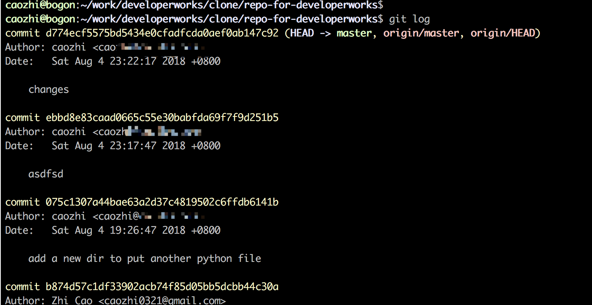
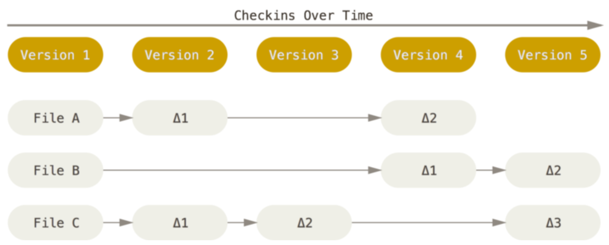
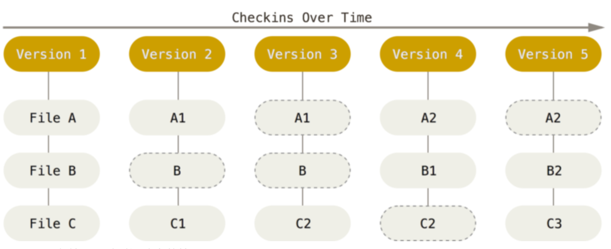
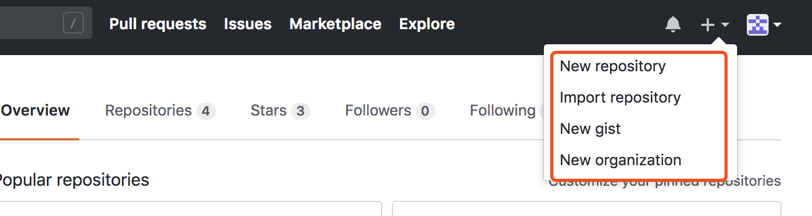
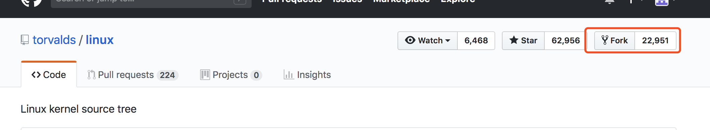

# Git 和 GitHub 基础简介
Git 和 GitHub 入门知识

**标签:** DevOps

[原文链接](https://developer.ibm.com/zh/articles/os-cn-git-and-github-1/)

曹 志, 杨 翔宇, 贾 志鹏

发布: 2018-10-09

* * *

## 前言

Git 是目前业界最流行的版本控制系统（Version Control System），而 GitHub 是开源代码托管平台的翘楚。越来越多的从业者、从业团队以及开源贡献者首选二者用于管理项目代码。本文首先从概念的角度介绍版本控制系统、Git 和 GitHub，并着重通过一些实验来演示 Git 的基础特性，使您能够对 Git 和 GitHub 有更清晰的认识。

2018 年初，我所在的项目组考虑到之前使用的 Perforce 代码管理系统太多笨重且将其集成进 DevOps 工具栈具有诸多不便，经讨论之后，决定将代码库从 Perforce 迁移到 GitHub 上。本人负责整理调研和领导 GitHub 迁移工作。目前已成功将项目代码库迁移并且将其集成进了日常构建。在迁移过程中，我积累诸多宝贵经验，故此借此机会编写一个系列技术文章，来介绍 Git 和 GitHub 基础知识、使用技巧和到最后如何实施的迁移。

本系列将会围绕 Git 和 GitHub 全面涵盖并介绍 Git 原理、Git 和 GitHub 使用、分支管理策略、权限控制策略、代码评审和 pull request、将 GitHub 集成进持续集成，最后会集中介绍代码迁移的整个过程，向有兴趣的读者分享这一过程中所遇到的各种问题和解决办法。

—— 曹志

## Git 和 GitHub 区别和联系

一些初次接触 Git 和 GitHub 的从业者常常将 Git 和 GitHub 二者混淆而谈。二者虽然联系甚紧，但从本质上是两个不同的概念。

Git 是一个开源的分布式版本控制系统。而 GitHub 本质上是一个代码托管平台，它提供的是基于 Git 的代码托管服务。对于一个团队来说，即使不使用 GitHub，他们也可以通过自己搭建和管理 Git 服务器来进行代码库的管理，甚至还有一些其它的代码托管商可供选择，如 GitLab，BitBucket 等。值得一提的是 Git 作为一个开源项目，其代码本身就被托管在 GitHub 上，如果您感兴趣，可以上去一观其真容。Git 项目地址： [https://github.com/git](https://github.com/git)

## 版本控制系统简介

在现代软件项目中，版本控制系统是项目配置管理不可或缺的一部分，甚至是其核心工具。版本控制最主要的任务是追踪文件的变更，无论是应用系统源代码、项目配置文件，还是项目过程的开发文档，甚至是网站界面图片、Logo，都可以且应该被版本控制系统所管理起来，以方便我们在项目的生命各周期能够追踪、查看到软件系统的变更和演进。版本控制系统另一个重要的作用是方便开发者进行协同开发，使得项目中各开发者能够在本地完成开发而最终通过版本控制系统将各开发者的工作合并在一起进行管理。

### 集中式版本控制系统

早期的版本控制系统大多是集中式（Centralized）版本控制系统。所谓集中式，即是此类系统都有一个单一的集中管理的服务器。在该服务器上保存着项目所有文件以及文件的历史版本，而各开发者可以通过连接到该服务器读取并下载到文件的最新版本，也可以检索文件的历史版本。开发者常常可以只需要下载他们所需要的文件。通过连接集中式服务器来获取文件和文件更新是集中式版本控制系统的标准做法。业界主流的集中式版本控制系统包括 CVS、SVN、Perforce 等。

集中式版本控制很大程度上解决了版本控制和协同开发的问题，但是它也有重大的缺点。如果中央服务器出现宕机，那么开发者将无法提交代码，也无法进行协同工作，更无法查看文件历史。如果服务器出现更严重的磁盘损坏，又没有进行恰当的备份，那么很大可能将丢失掉项目文件以及项目的变更历史。而各协同开发者在自己本地因为也只有当前版本的文件，或者只有部分文件，很难根据各开发者的本地库对项目的历史记录进行恢复。

### 分布式版本控制系统

相比较集中式的版本控制，目前业界最流行的版本控制系统是分布式（Distributed）版本控制系统，其最大的特点是各开发者本地所复制的不仅仅是当前最新版本的文件，而是把代码仓库完整地从服务器上克隆了下来。各开发者本地拥有代码仓库所有的文件以及文件历史和变更信息。这样即使服务器出现宕机，也不影响开发者本地开发，开发者也可以随时查看文件的各历史版本。甚至服务器出现故障导致数据丢失时，项目组也很容易根据开发者的本地代码库恢复出所有文件和文件的历史变更记录。

Git 是业界目前最为流行的分布式版本控制系统，除此之外还有 Mercurial、BitKeeper 等。Git 其实就是 Linus Torvalds 根据 BitKeeper 的设计理念而重新设计并主导开发而成的。在随后的章节中会以 Git 为例进一步介绍分布式版本控制系统的机制。如果您感兴趣可以去查阅一下 Linus Torvalds、BitKeeper 和 Git 之间的趣事。

## 理解 Git 的分布式版本控制

早期我在接触 Git 时，常常为其所谓的分布式感到困惑。大部分人心目中的分布式的概念可能更多来自于分布式计算。分布式计算使得程序可以通过某种机制分布地运行在多台计算机上从而最大化地利用多台计算机的计算能力、存储能力。分布式计算是将计算任务分割成多个可以独立运行的子任务，然后将子任务分布在多台计算机独立并行运行，最后通过某种合并机制将所有计算机的计算结果最终合并起来。因此单独来看这多台计算机中其中某一台，它并没有拥有程序的所有数据和所需资源。从表面看这似乎和分布式版本控制系统中的分布式概念截然相反。毕竟分布式版本控制系统”号称”克隆一次代码库本地就拥有了一个完整的代码库副本，这听起来有些骇人听闻。

其实我们可以尝试从以下两个方面来理解：

- 其一，在分布式版本控制系统中，克隆了代码库的各本地开发者拥有了服务器分发过来（Distributed）的完整的代码库副本，使得开发者们可以独立于主服务器之外进行开发任务，这和分布式计算概念中，各计算机独立进行计算任务的理念不谋而合。同时也符合分布式存储的理念：一个文件多份副本。
- 其二，各开发者在完成开发任务后又需要将自己本地修改后的代码库合并（Merge）到主服务器上。这也与分布式计算概念中最终需要将各计算机的计算结果合并起来的概念是相符的。

因此这也就不难理解分布式版本控制中的分布式概念了。

下面通过 Git 的一个实验来尝试理解什么是 **克隆了完整的代码库副本** 。

首先我在 GitHub 上建立了一个用于实验的公开代码库。代码库中目前只包含有少量的源文件和提交记录，如清单 1 所示。实验仓库地址： [https://github.com/caozhi/repo-for-developerworks](https://github.com/caozhi/repo-for-developerworks)

##### 清单 1\. 查看本地代码库中所拥有的文件

```
caozhi @ repo-for-developerworks$ ls -al
total 24
drwxr-xr-x   7 caozhi  staff  224  8  4 23:43 .
drwxr-xr-x   3 caozhi  staff   96  8  4 23:43 ..
drwxr-xr-x  13 caozhi  staff  416  8  4 23:43 .git
-rw-r--r--   1 caozhi  staff  278  8  4 23:43 .gitignore
-rw-r--r--   1 caozhi  staff   39  8  4 23:43 README.md
-rw-r--r--   1 caozhi  staff   56  8  4 23:43 helloworld.sh
drwxr-xr-x   3 caozhi  staff   96  8  4 23:43 src

```

Show moreShow more icon

注意代码库中 `.git` 目录中包含了代码库所有的存储对象和记录。如果想要备份或复制一个代码库，则只需要将这个目录拷贝下来即可。

因此该代码库中只有 `.gitignore` 、 `README.md` 、 `helloworld.sh` 以及 `src` 目录是代码库所管理的源文件。我们将除 `.git` 目录之外的所有文件全部删除，如清单 2 所示：

##### 清单 2\. 删除除 `.git` 目录之外的全部源文件

```
caozhi@ repo-for-developerworks$ rm -rf .gitignore README.md helloworld.sh src

```

Show moreShow more icon

接下来我们断掉电脑的网络连接使得本地代码库无法与服务器进行交互，以验证是否所有的文件可以只从本地就进行恢复。断网之后执行 `git pull` 尝试与服务器进行同步，命令结果提示： `Network is down` ，如清单 3 所示：

##### 清单 3\. 断网之后尝试 `git pull` 同步代码

```
caozhi@ repo-for-developerworks$ git pull
ssh: connect to host github.com port 22: Network is down
fatal: Could not read from remote repository.

Please make sure you have the correct access rights
and the repository exists.

```

Show moreShow more icon

不用担心代码库被破坏，如前所述， `.git` 目录中包含有代码库所有的文件对象和记录，因此我们可以很容易的通过命令将其进行恢复。

首先，虽然文件被删除且网络无法连接，我们依然可以查询到历史提交记录，如图 1 所示：

##### 图 1\. 查看提交历史



然后我们可以通过 `git reset --hard commit_id` 命令恢复当前代码库到目标 commit 的状态，如清单 4 所示：

##### 清单 4\. 执行 `git reset --hard` 命令

```
caozhi@ repo-for-developerworks$ git reset --hard d774ecf5575bd5434e0cfadfcda0aef0ab147c92
HEAD is now at d774ecf changes
caozhi@ repo-for-developerworks$ ll -a
total 24
drwxr-xr-x   7 caozhi  staff  224  8  5 10:48 .
drwxr-xr-x   3 caozhi  staff   96  8  4 23:43 ..
drwxr-xr-x  15 caozhi  staff  480  8  5 10:48 .git
-rw-r--r--   1 caozhi  staff  278  8  5 10:48 .gitignore
-rw-r--r--   1 caozhi  staff   39  8  5 10:48 README.md
-rw-r--r--   1 caozhi  staff   56  8  5 10:48 helloworld.sh
drwxr-xr-x   3 caozhi  staff   96  8  5 10:48 src

```

Show moreShow more icon

从运行结果我们可以看出，代码库中被删除的文件已经被恢复回来，而且是在无任何网络连接、没有和服务器进行交互的情况下进行的恢复！

通过这个实验相信您对 Git 克隆了完整的代码库副本有更加直观的理解。如有兴趣，您也可尝试通过 `git reset` 命令将代码库恢复到任意目标 commit 的状态。本文就不再赘述。

## Git 基础特性

本章将会介绍 Git 作为版本控制系统的几大基础特性并会借助一些实验来帮助理解这些特性。注意：本章节介绍的基础特性其内容总结自 ProGit 这本书，如有兴趣您也可自行查阅原文。

### 克隆一次即获得代码库的完整副本

这个特性是所有分布式版本控制系统的特性之一。Git 也不例外。本文在上一个章节中已经对该特性进行了详细的描述和分析，在此就不再赘述。

### 直接记录快照而非差异比较

版本控制系统中采取何种策略来管理文件的历史版本是系统的核心技术之一。目前很多传统的版本控制系统如 SVN、Perforce 等采用基于增量的方式来记录每次变更。每次变更产生即生成一个差异对象，最终最新版本的文件可以由最初的基础文件和这个文件所累积的差异来组成。如图 2 所示（截取自 ProGit 一书）：

##### 图 2\. 增量方式



而 Git 采用的是类似于快照流（Streams of Snapshot）的方式来存储数据。Git 在一个文件发生修改时会生成一个新的完整的文件对象，当然旧的文件对象也会保留下来作为历史版本。对于未发生更改的文件，Git 在新版本的代码库中只是保留了一个链接指向之前存储的文件。例如图 3 （截取自 ProGit 一书）所示版本 2 中，对 A 文件和 C 文件都进行了修改，Git 生成了两个新的完整的文件对象 A1 和 C1，而 B 文件未发生更改，那么版本 2 中就只记录了一个指向 B 文件的链接。基于文件对象 A1 和 C1 以及连接 B，Git 就生成了一个版本 2 的快照。

##### 图 3\. 快照方式



代码库的存储和复制并非版本控制系统的瓶颈所在，分析文件的差异、查看代码库的各历史版本常常是真正的瓶颈所在。基于这种快照流的设计，Git 可以快速地获取到某一时刻的代码库所有文件，同时也可以快速地进行文件各个历史版本的差异比对，甚至是各历史版本或者各分支的代码库整体差异比对。想像一下如果是传统的增量存储方式，一个代码库经过长期的开发，假设代码库已经有 10 万个文件，每个文件平均经历了 100 次修改，那么要检索最新的代码库和原始的代码库的差异，就需要检索出 1000 万个增量才能最终成功比对，这需要难以想象的时间成本。而 Git 就不存在这个问题，Git 只需要检索出最新的代码库快照和原始代码库快照直接进行比对即可，再依托于 Git 的 diff 算法（Myers 算法），Git 可以高效快速地检索出二者的差异来。

### 近乎所有操作都是本地执行

Git 另一个十分高效的原因是它几乎所有的操作都是在本地执行，除了几个极少的需要跟服务器同步代码的操作（push、pull、fetch）。这种本地执行的能力正是来自于克隆一次即获得代码库的完整副本这一特性。在本文前面的章节中对 Git 的本地操作也进行了实验，所以在此亦不进行赘述。

诚然，类似 SVN 和 Perforce 一类的集中式分布系统，当没有网络连接时我们依然可以对本地代码进行修改，但却无法提交代码，更不用说查询提交历史，比对版本差异。在日常的开发工作中，修改代码只是工作的一部分，还有很大部分工作需要不断与代码库各历史版本进行交互。在集中式分布系统中，当发生网络异常时，这类工作就几乎无法进行从而很可能导致开发中断。即使是网络正常的情况下，集中式分布系统的工作效率也远低于 Git 的本地化执行。

### 使用 SHA-1 哈希值保证完整性

Git 中所有数据对象（详见下文）在存储前都会计算 SHA-1 校验和，生成一个 40 位的十六进制的哈希值字符串。基于此校验和，就不可能在 Git 不知情的情况下更改任何文件内容。Git 中很多地方会使用到这种哈希值，如前面实验中我们实际上就用到了 commit 的哈希值 id 来还原代码库。

接下来我们用另一系列小实验来演示并验证 Git 的部分基础特性：

- 记录的快照和各历史的完整内容，而非记录差异比较
- 哈希值在 Git 中的重要作用

本节仍然以 repo-for-developerworks 为例子。

前文提到，代码库中.git 目录存储了代码库的所有文件和信息。我们可以查看 `.git` 目录结构，如清单 5 所示：

##### 清单 5\. 查看 Git 目录结构

```
caozhi@.git$ tree -L 1
.
├── FETCH_HEAD
├── HEAD
├── ORIG_HEAD
├── branches
├── config
├── description
├── hooks
├── index
├── info
├── logs
├── objects
├── packed-refs
└── refs

```

Show moreShow more icon

在本系列的随后文章中会对该目录每个子项进行深入介绍，您现在只需关注 `objects` 目录。 `objects` 目录存储了本地仓库的所有数据对象，Git 存储的数据对象一共有以下四种：

- Tree：类似 Unix 文件系统的文件组织方式，Tree 对象中记录了多个 Blob 对象或者其它子 Tree 对象哈希值、文件名目录名等元数据。通过 Tree 对象可以还原出代码库的目录结构。
- Commit：记录一个 commit 的所有信息。
- Blob：记录了代码库源文件的内容，不记录源文件的如文件名一类的元数据。
- Tag：为某一个时刻的代码库打一个 Tag，方便检索特定的版本。Tag 在 Git 中也是以一种数据对象的方式进行存储。

`objects` 目录下存放了多个以 2 位字符命名的目录，在这些目录下又存放了 38 位字符命名的文件，2 位的前缀和 38 位的文件名就组成了 Git 中的一个数据对象的哈希值，如清单 6 所示：

##### 清单 6\. 查看 `objects` 目录结构

```
caozhi@ objects $ tree -L 2
.
├── 06
│   └── dad60f87d28d220216f5891dddfdfe4af5f1a0
├── 07
│   └── 5c1307a44bae63a2d37c4819502c6ffdb6141b
├── 16
│   └── d0e292c43ca35d4ab36da6b3e1913288477076
├── 22
│   └── 783d07955986cab0d2195eb131d8e0047acb59
├── 40
│   └── 6714df7708534f67d9373821de5948ab3f5d9a
├── 6d
│   └── 1f98e1a9bede453ab16d6ba90428a994ebf147
├── ae
│   └── e311888e5572cc3d7d8b00e8f400216d26d320
├── b3
│   └── adac68e8b6a22f88003c226fc4746a5269a496
├── b8
│   └── 74d57c1df33902acb74f85d05bb5dcbb44c30a
├── d4
│   └── eec9c19502086dd0f42f8bb7f26feb77377d5c
├── d6
│   └── 96feb980566a3c03fd0f22c4b806e34a312de6
├── info   ## can be ignored right now
└── pack   ## can be ignored right now
    ├── pack-eff5463c4b0c56c3ea5e5c381941541d76d8e143.idx
    └── pack-eff5463c4b0c56c3ea5e5c381941541d76d8e143.pack

8 directories, 8 files

```

Show moreShow more icon

清单 7 的脚本核心使用了 `git cat-file -t` 命令来查看对象文件的类型。由此可以看出，在 Git 内部使用哈希值作为文件名来存储所有的数据对象。

##### 清单 7\. 执行脚本列出对象文件及其对应的类型

```
caozhi@ objects$ find . -type f | grep -v pack | \
while read line; \
do \
var=${line//"."/""}; \
var=${var////""}; \
echo $line `git cat-file -t $var`; \
done

./b3/adac68e8b6a22f88003c226fc4746a5269a496 tree
./d6/96feb980566a3c03fd0f22c4b806e34a312de6 tree
./ae/e311888e5572cc3d7d8b00e8f400216d26d320 tree
./16/d0e292c43ca35d4ab36da6b3e1913288477076 commit
./07/5c1307a44bae63a2d37c4819502c6ffdb6141b commit
./6d/1f98e1a9bede453ab16d6ba90428a994ebf147 blob
./06/dad60f87d28d220216f5891dddfdfe4af5f1a0 blob
./d4/eec9c19502086dd0f42f8bb7f26feb77377d5c blob
./b8/74d57c1df33902acb74f85d05bb5dcbb44c30a commit
./40/6714df7708534f67d9373821de5948ab3f5d9a tree
./22/783d07955986cab0d2195eb131d8e0047acb59 tag

```

Show moreShow more icon

另外可以看到 `16d0e292...` 这个对象表示其是一个 commit。结合提交历史记录可以看到，这个哈希值确实对应于一个 commit id，如清单 8 所示：

##### 清单 8\. 查看提交历史

```
caozhi@ repo-for-developerworks/.git/objects$ git log
commit d774ecf5575bd5434e0cfadfcda0aef0ab147c92
              (HEAD -> master, origin/master, origin/HEAD)
Author: caozhi <caozhi0321@gmail.com>
Date:   Sat Aug 4 23:22:17 2018 +0800

    changes

... ## Ignored some useless history
commit 16d0e292c43ca35d4ab36da6b3e1913288477076
Author: Zhi Cao  <caozhi0321@gmail.com>
Date:   Fri Aug 3 22:15:02 2018 +0800

    Create a shell script
... ## Ignored some useless history

```

Show moreShow more icon

在清单 9 中可以看到 `6d1f98e1...` 这个对象是一个 blob 对象：

##### 清单 9\. 查看 blob 对象的类型和内容

```
caozhi@ objects$ git cat-file -t 6d1f98e1a9bede453ab16d6ba90428a994ebf147
blob
caozhi@ objects$ git cat-file -p 6d1f98e1a9bede453ab16d6ba90428a994ebf147
#!/bin/bash

echo hello world!

caozhi@ objects$ git cat-file -t d4eec9c19502086dd0f42f8bb7f26feb77377d5c
blob
caozhi@ objects$ git cat-file -p d4eec9c19502086dd0f42f8bb7f26feb77377d5c
#!/bin/bash

echo hello world!

echo hello world again!

```

Show moreShow more icon

查看该文件内容，可以看到 `6d1f98e1...` 其实是 `helloworld.sh` 这个源代码的内容，但对象 `6d1f98e1...` 是 `helloworld.sh` 的上一个版本，而在随后查看的 `d4eec9c1...` 才是其最新版本。从这里也能看到 Git 在存储文件不同版本时，确实是存储了各历史版本全量的文件而非其增量。

注意：实际操作中也可以使用哈希值的前八位缩写，如： `git cat-file -t 6d1f98e1` 。如有兴趣，您可以尝试一下。

至此，我们看到 SHA1 哈希值在 Git 底层的巨大作用，所有对象都以哈希值来命名并存储，所有对象也可以通过哈希值来进行检索。同时我们也从 Git 底层再次验证了 Git 在本地存储了文件的所有全量历史版本。

### Git 一般只添加数据

这个特性指的是正常情况下我们执行的 Git 操作，几乎只往 Git 里增加数据。因此很难让 Git 执行任何不可逆的操作，或者让它以任何方式清除数据。同其它版本控制系统一样，没有提交的更新有可能出现丢失的情况，但是一旦我们将更改提交到 Git 中之后，就很难再丢失数据。

这个特性使得我们可以放心且愉悦地使用 Git，我们可以尽情地做任何尝试。即使误操作出现数据丢失，我们也可以通过各种手段将其进行快速恢复。

在 ProGit 一书中还提到了 Git 的另一个特性”三种状态”，该特性是指 Git 中的文件一般有三种状态：已提交（committed）、已修改（modified）和已暂存（staged）。在随后的系列文章中将会结合 Git 的日常使用来着重介绍以帮助您理解这三种状态，还会对 Git 目录以及 Git 的对象存储模型进行详细地分析和讲解。

## GitHub 简介

GitHub 是全球最大的开源代码托管平台，在开源界有着不可撼动的定位，也深受开源爱好者的喜爱。GitHub 平台本身十分直观易用，其使用方法在此就不进行详述。本章简单列举一下我认为的 GitHub 一些很有意思或者很有用的功能：

- 如果只使用免费版，那么无法创建私人仓库（Repository），只能创建开放仓库；开放仓库可被任何人克隆或 Fork。
- 可以作为独立开发者建立自己的代码仓库，团队协作的话也可以通过建立组织（Organization）来管理组织下的仓库、团队、成员、权限等。如图 4 所示：

##### 图 4\. 添加仓库或组织



- 如果是开源项目，可以很容易 Fork 其它开源项目的代码库到自己的账号下；也可以向别人发起 Pull Request 请求，请求作者将 Fork 下来之后的代码修改合并到原代码库中。如图 5 和图 6 所示，我们可以将 Linux 的源码库 Fork 到自己的账户或组织下。

##### 图 5\. Fork Linux 代码库



##### 图 6\. 选择 Fork 的目标


- Pull Request 提供了强大的代码评审、代码合并的机制。通过创建 Pull Request 向开源项目的作者或者管理者发起合并自己代码的请求，我们可以轻松地向开源项目贡献代码。代码评审和 Pull Request 将在随后的系列文章中详细介绍。
- 使用 Gist 可以管理一些自己常用的代码片段、常用的命令，也可以分享给其他开发者。
- GitHub 上也可以管理钩子（Hook），可用于自动构建过程，例如引入 Jenkins 的 WebHook，使得 Jenkins 可以在每次发现代码提交后立即触发一次项目构建。
- GitHub 也提供了很多可选的集成服务（Integration & Service）使用，例如集成 ZenHub 插件，可以进行敏捷式项目管理。

本章简单罗列了部分 GitHub 的特点，在随后的系列文章中，我将会对 GitHub 不同的主题进行详细的介绍，例如权限控制、Pull Request 等。

## 结束语

Git 和 GitHub 都是现在业界最流行的代码管理工具。Git 提供了强大的版本控制功能，而 GitHub 作为最大的开源代码代码托管平台，提供了强大的托管能力、协同合作能力。GitHub 的蓬勃发展与开源项目的蓬勃发展息息相关，GitHub 拥抱开源的开放态度使其成为了开发者心目中最为喜爱的代码托管平台。希望您在读完本文之后对 Git 和 GitHub 能有清晰的理解，同时在今后的工作中享受到 Git 和 GitHub 带来的乐趣。