# Git 和 GitHub 基础配置
完成本地 Git 环境的基础配置，为 Git 日常使用做基础

**标签:** DevOps

[原文链接](https://developer.ibm.com/zh/articles/os-cn-git-and-github-2/)

曹 志, 杨 翔宇, 贾 志鹏

发布: 2018-12-24

* * *

## 前言

在本系列的 [第一篇](https://www.ibm.com/developerworks/cn/opensource/os-cn-git-and-github-1/index.html) 文章中着重介绍了 Git 的基础特性。本文作为本系列的第二篇文章将介绍 Git 和 GitHub 的基础配置，包括 Git 安装、使用 Git 克隆 GitHub 上的代码库、使用 Git 克隆远端代码仓库、Git 的基本配置和设置忽略提交规则。您在阅读完本文将有能力完成本地 Git 环境的基础配置，为接下来的 Git 日常使用做基础。

2018 年初，我所在的项目组考虑到之前使用的 Perforce 代码管理系统太多笨重且将其集成进 DevOps 工具栈具有诸多不便，经讨论之后，决定将代码库从 Perforce 迁移到 GitHub 上。本人负责整理调研和领导 GitHub 迁移工作。目前已成功将项目代码库迁移并且将其集成进了日常构建。在迁移过程中，我积累诸多宝贵经验，故此借此机会编写一个系列技术文章，来介绍 Git 和 GitHub 基础知识、使用技巧和到最后如何实施的迁移。

本系列将会围绕 Git 和 GitHub 全面涵盖并介绍 Git 原理、Git 和 GitHub 使用、分支管理策略、权限控制策略、代码评审和 pull request、将 GitHub 集成进持续集成，最后会集中介绍代码迁移的整个过程，向有兴趣的读者分享这一过程中所遇到的各种问题和解决办法。

—— 曹志

GitHub 是一个代码托管平台，如果开发者想要在本地进行开发工作，那么就需要使用到 Git 的客户端工具来连接到 GitHub，再克隆代码到本地。如果您是重度的 GUI 使用者，那么有很多 GUI 客户端可以选择，在 Git 的官网就专门有个页面列出了业内的 [GUI 客户端](https://git-scm.com/downloads/guis/) 。

但遗憾的是往往 GUI 客户端只能提供 Git 部分的功能，如果想要享受到 Git 自底向上强大的功能，使用命令行的方式来操作 Git 是不二之选。建议无论您是否擅长使用命令行工作，都可以尝试使用命令行方式来操作 Git。本文将只介绍如何从命令行来连接到 GitHub。

## 安装 Git

使用命令行方式操作 Git 工具，需要本地安装 Git。注意，这里没有使用 “Git 客户端” 一词，因为 Git 作为一个开源版本控制系统，本身既可以作为客户端工具，也可以用于建立服务器端代码库，所以本质上 Git 作为工具来讲没有客户端和服务器端之分。

本地安装 Git 十分简单。

对于 Windows 用户，可以下载 [Git For Windows](https://gitforwindows.org/) 工具。下载安装成功之后，我们可以得到一个 Git Bash 工具，它是一个类 Linux Bash 工具。在该工具中我们可以直接执行 Git 相关命令。如图 1 所示：

##### 图 1\. Git Bash

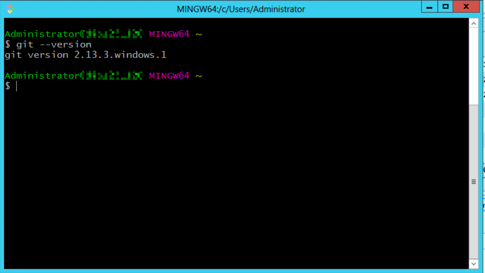

对于 Mac 和 Linux 用户，只需通过对应的包管理工具安装即可，如清单 1 所示：

##### 清单 1\. Mac 和 Linux 下安装 Git

```
$ brew install git         # For Mac
$ apt-get install git      # For Ubuntu
# yum install git          # For RedHat EL, CentOS

```

Show moreShow more icon

## 使用 Git 克隆 GitHub 代码库

安装 Git 成功之后，我们就可以使用 Git 克隆 GitHub 上的代码库，本节仍然以我的代码库 [repo-for-developerworks](https://github.com/caozhi/repo-for-developerworks) 为例。

GitHub 提供了两种克隆方式：HTTPS 和 SSH。我们可以点击仓库页面上的 **Clone or download** 按钮来查看用于克隆的链接，同时可以点击浮动框右上角的 **Use SSH/Use HTTPS** 换我们想要克隆的 link，如图 2 和 图 3 所示。注意，这里只是切换查看不同的链接，而不是设置代码库不同的链接方式。

##### 图 2\. 查看 HTTPS 克隆链接

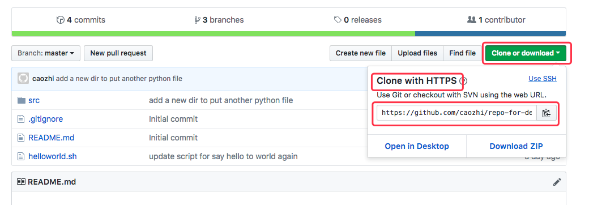

##### 图 3\. 查看 SSH 克隆链接

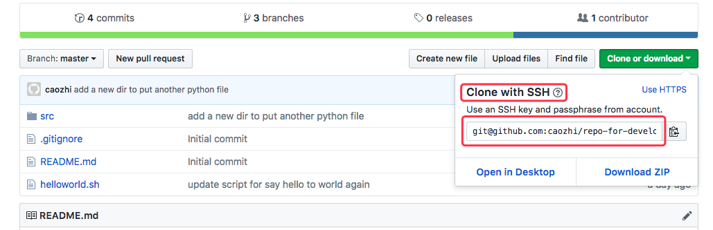

由此我们可以获得两个 URL：

- HTTPS 链接： `https://github.com/caozhi/repo-for-developerworks.git`
- SSH 链接： `git@github.com:caozhi/repo-for-developerworks.git`

### 使用 HTTPS 进行克隆

由于代码库是开放的，因此使用 HTTPS 方式克隆时，无需 GitHub 用户名密码，如清单 2 所示：

##### 清单 2\. 使用 HTTPS 进行克隆

```
caozhi@ clone$ git clone https://github.com/caozhi/repo-for-developerworks.git
Cloning into 'repo-for-developerworks'...
remote: Counting objects: 14, done.
remote: Compressing objects: 100% (9/9), done.
remote: Total 14 (delta 3), reused 5 (delta 1), pack-reused 0
Unpacking objects: 100% (14/14), done.

```

Show moreShow more icon

顺便提一下，进行 pull 和 fetch 操作时也无需用户名密码认证。因为 GitHub 的机制允许随意免费下载任何公开的代码库，如若要 push 代码需经过认证或者经过作者同意才可。当要进行 push 时，会出现提示要求输入用户名密码，如清单 3 所示：

##### 清单 3\. HTTPS 方式下 push 代码

```
caozhi@ repo-for-developerworks$ echo change >> README.md   ## make some modification
caozhi@ repo-for-developerworks$ git add .
caozhi@ repo-for-developerworks$ git commit -m "changes"
[master d774ecf] changes
1 file changed, 1 insertion(+)
caozhi@ repo-for-developerworks$ git push
Username for 'https://github.com': caozhi0321@gmail.com    ## Enter GitHub account name
Password for 'https://caozhi0321@gmail.com@github.com':   ## Enter Password
Counting objects: 6, done.
Delta compression using up to 8 threads.
Compressing objects: 100% (4/4), done.
Writing objects: 100% (6/6), 528 bytes | 528.00 KiB/s, done.
Total 6 (delta 2), reused 0 (delta 0)
remote: Resolving deltas: 100% (2/2), completed with 1 local object.
To https://github.com/caozhi/repo-for-developerworks.git
075c130..d774ecf  master -> master

```

Show moreShow more icon

### 使用 SSH 进行克隆

使用 SSH 方式进行克隆，需要一步额外的配置 SSH-KEY 的操作。首先需要本地生成一个 SSH Key。我们可以借助 ssh-keygen 工具生成一对 RSA 的秘钥：私钥 `id_rsa` 和公钥 `id_rsa.pub` 。生成的秘钥文件会默认放在 home 目录下的 `.ssh` 目录下，如图 4 所示：

##### 图 4\. 使用 ssh-keygen 生成 RSA 秘钥

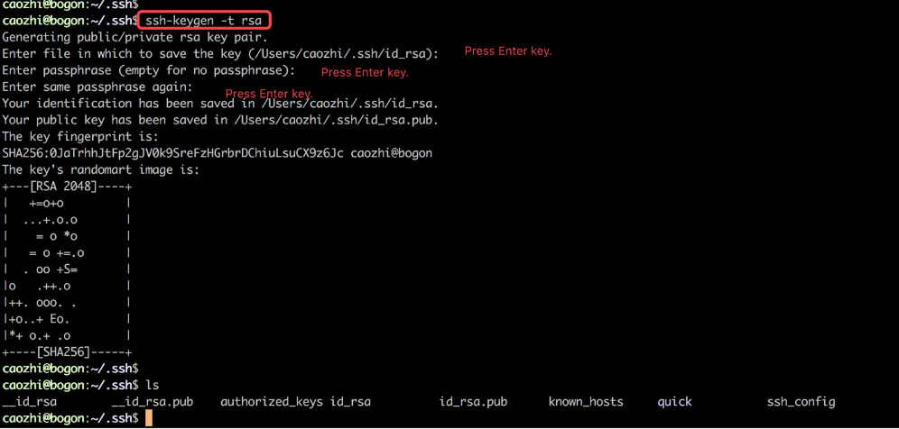

先将 `id_rsa.pub` 公钥文件的内容复制到剪贴板，如图 5 所示，使用 `cat id_rsa.pub` 命令可以查看公钥内容，随后将该公钥导入到 GitHub 里的账户之下。

##### 图 5\. 查看 id\_rsa.pub 公钥文件

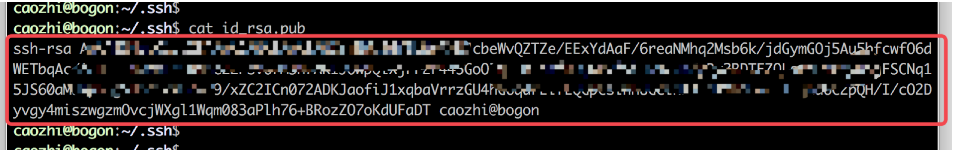

在 GitHub 页面右上角的头像里点击展开一个下拉菜单，点击 **Settings** 可以打开个设置页面，如图 6 所示：

##### 图 6\. 打开 GitHub 设置

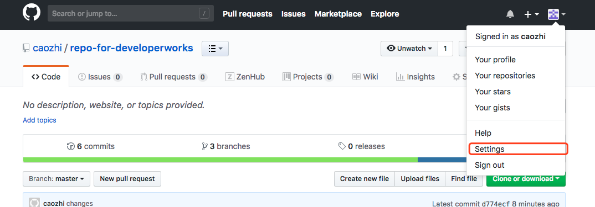

打开 **SSH and GPG keys** 的配置页面，点击右上角的 **New SSH key** 按钮，如图 7 所示：

##### 图 7\. 打开 SSH and GPG keys 的配置页面

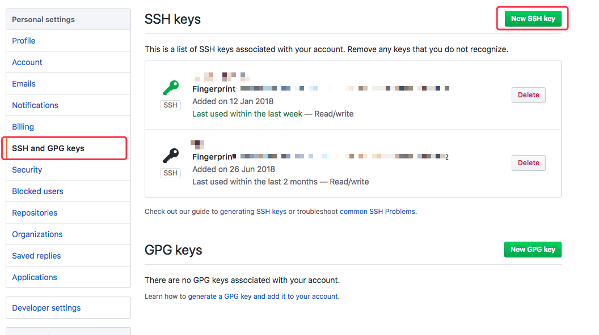

在打开的页面中先设置一个您想导入的公钥的名称，再将前面复制的公钥内容粘贴到大文本框中，点击 **Add SSH key** 即可，如图 8 所示：

##### 图 8\. 输入 Key 的名称及其内容

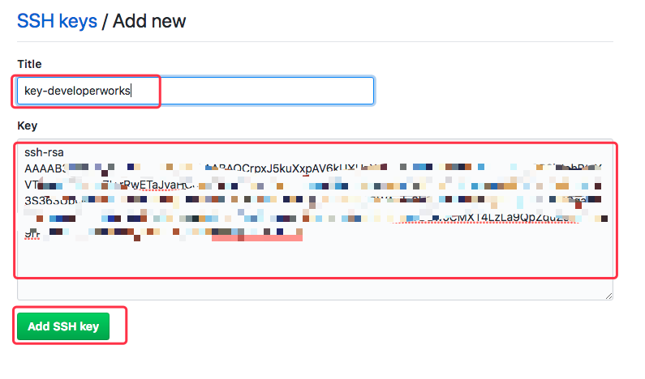

页面自动跳转回 **SSH and GPG keys** 设置页面，您可以看到在我的账号下成功新增了一个 SSH Key，如图 9 所示：

##### 图 9\. 查看已经添加的 Key

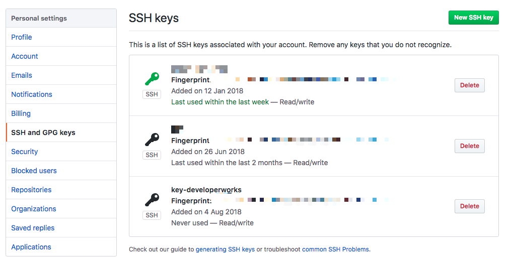

此时我们可以使用 SSH 的方式进行代码克隆，还可以使用 `ssh -T` 命令检测是否配置成功, 如清单 4 和 5 所示：

##### 清单 4\. 使用 SSH 方式克隆

```
caozhi@ $ git clone git@github.com:caozhi/repo-for-developerworks.git
Cloning into 'repo-for-developerworks'...
remote: Counting objects: 20, done.
remote: Compressing objects: 100% (12/12), done.
remote: Total 20 (delta 5), reused 10 (delta 2), pack-reused 0
Receiving objects: 100% (20/20), done.
Resolving deltas: 100% (5/5), done.

```

Show moreShow more icon

##### 清单 5\. 检测 SSH 是否配置成功

```
caozhi@bogon:~$ ssh -T git@github.com
Hi caozhi! You've successfully authenticated, but GitHub does not provide shell access.

```

Show moreShow more icon

使用 SSH 的方式进行克隆，将使得我们本地与 GitHub 之间建立了信任连接，也就意味着之后所有需要进行用户认证的地方都不再需要显式地用户名密码认证。例如 `git push` 会直接通过 SSH 进行认证。经验表明，使用 SSH 的另一个好处是在网络环境较差的情况下，其稳定性要高于 HTTPS 连接。

至此，我们成功地使用 Git 命令行方式克隆了代码库，之后就可以进行正常的日常开发。

## 使用 Git 克隆远程仓库

当一个开发者刚进入某一项目，一般来说他所要做的第一件事是克隆远程仓库到本地，以进行本地开发工作。远程仓库可以是来自于 GitHub 或者 GitLab 等代码托管服务，也可以是项目组自己所搭设的 Git 服务器。无论是哪种远程仓库，都可以使用 `git clone` 命令 `git clone <repository> [local_path]` 将其从远端克隆到本地。命令中间的 `<repository>` 根据远端仓库提供的连接方式不同，其形式可能不同，例如：

- GitHub 的 HTTPS 连接：

    `https://github.com/caozhi/repo-for-developerworks.git`

- GitHub 的 SSH 连接：

    `git@github.com:caozhi/repo-for-developerworks.git`

- 自建仓库的 SSH 连接：

    `git_user@192.168.0.1:/usr/local/repo-for-developerworks.git`


其中前两种 GitHub 的连接方式，其仓库的连接字符串可以在 GitHub 的对应仓库页面中找到，如前 [图 2](#图-2-查看-https-克隆链接) 和 [图 3](#图-3-查看-ssh-克隆链接) 所示。

第三种自建仓库的 URL 一般需要提供远端服务器上的账号、host 和路径。以上面例子中的连接字符串 `git_user@192.168.0.1:/usr/local/repo-for-developerworks.git` 为例：

- `git_user` 是服务器上对代码库目录有访问权限的账号。
- `192.168.0.1` 是远端服务器的 IP，也可以是主机名或者 URL。
- `/usr/local/repo-for-developerworks.git` 是服务器上代码库的根目录。

`git clone` 命令中的 `local_path` 指定了本地想要存放代码库的地址。该参数是可选参数，如果不指定该参数就会在本地新建一个以远程仓库名为命名的目录，然后以该目录为代码库根目录。图 10 展示了在空目录 `clone_demo` 中执行不带 `local_path` 参数的 clone 命令：

##### 图 10\. local\_path 为空

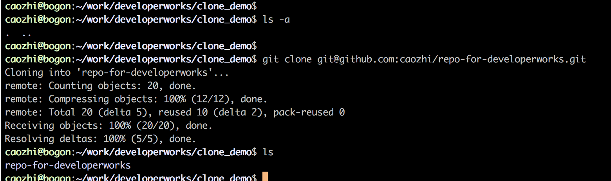

从截图可以看到， `git clone` 命令在 `clone_demo` 目录中创建了一个 `repo-for-developerworks` 的代码库目录。

图 11 展示了在目录 `clone_demo` 中执行带 `local_path` 参数的 clone 命令：

##### 图 11\. local\_path 参数为指定路径

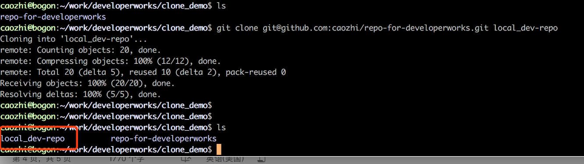

从截图可以看到， `git clone` 命令在 `clone_demo` 目录中新建了一个我们指定的 `local_dev-repo` 目录，并将其作为本地代码库的根目录。

图 12 展示了在空目录 `clone_demo2` 中执行 `local_path` 为当前目录的 clone 命令：

##### 图 12\. local\_path 参数为当前目录


我们知道一般操作系统将一个英文句点表示当前目录，因此从截图可以看出，当 `local_path` 指定为当前目录时， `git clone` 命令会直接将当前目录作为本地代码库的根目录。

当然 Git 还提供其它的连接方式如 File、FTP。感兴趣的读者可以自己使用 Git 搭一个 Git 服务器尝试使用 File 和 FTP 方式进行连接。

默认情况下， `git clone` 会将远端代码库全部克隆到本地。Git 还支持只克隆特定分支到本地。我们可以使用 `git clone -b **branchname**--single-branch git@URL local_path` 命令, 如图 13 所示：

##### 图 13\. 克隆特定分支

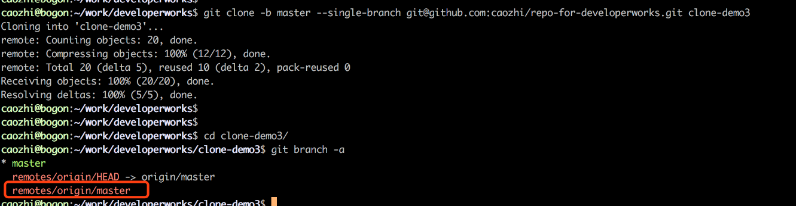

## Git 的基本配置

在克隆了代码库之后，我们一般仍需要对 Git 做一些基本的配置才能使用 Git 进行日常工作。Git 配置的作用域主要有三种：System、Global 和 Local，分别对应的配置文件地址为：

- System： `/etc/gitconfig` 。系统级别有效。
- Global：home 目录下的 `~/.gitconfig` 文件。用户级别有效。
- Local：代码库目录的 `.git/config` 文件。代码库级别有效。

另外我们也可以使用 `git config --system -l`，`git config --global -l`，`git config --local -l` 命令分别列出三个作用域下的配置。跟 Linux 操作系统的环境变量配置类似，Git 在执行命令中会首先查看 local 配置，如果没有找到所需配置会再查看 global 配置，最后再查看 system 配置。

在使用 `git config` 命令进行配置的时候，也可以使用 `git config --system`，`git config --global`，`git config --local` 三种不同的选项来修改不同作用域的配置。

下面介绍一些重要或有用的 Git 配置。

### 配置 user 信息

配置 user 信息在 Git 中是十分重要的一个步骤， username 和 email 不能为空，它们将会被记录在每一条该 user 的 commit 信息中，如图 14 所示:

##### 图 14\. 查看 commit 的 user 信息

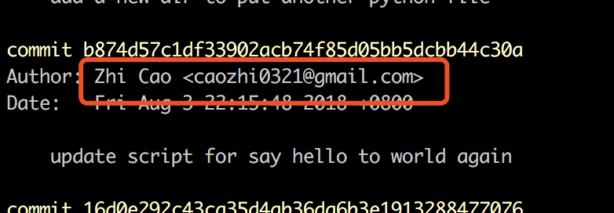

我们可以配置 `user.name` 和 `user.email` 的值来配置 user 信息，如清单 6 所示:

##### 清单 6\. 配置 user.name 和 user.email

```
git config --global user.name "caozhi"
git config --global user.email "caozhi0321@gmail.com"

```

Show moreShow more icon

也可以将上述命令中的 –global 改成 –local 来修改只对代码库作用域有效的配置。

### 配置命令的别名

Git 提供了很多有用的命令，我们可以将一些比较常用的命令设置上别名，提高工作效率。例如我们可以将 `git log --abbrev-commit` 设置一个别名 `lg` ，使得查看 log 时只需要显示 commit id 的短名称，如: `git config --global alias.lg "log --abbrev-commit"`。

设置成功后就可以使用 `git lg` 来查看 commit 日志，如图 15 所示:

##### 图 15\. 短名称的日志

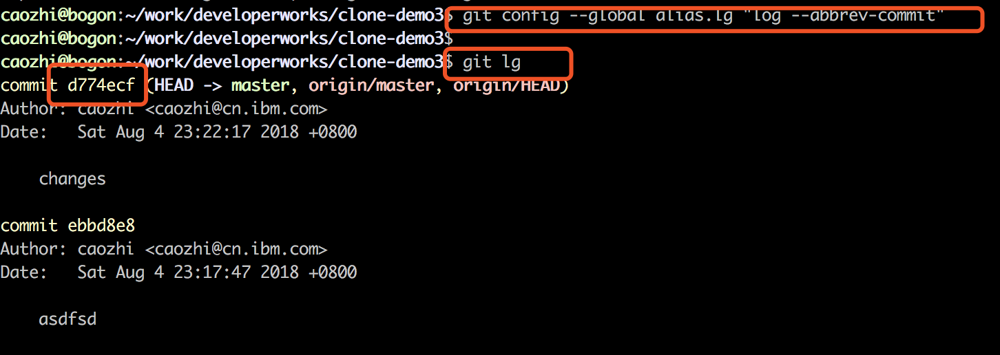

当然还可以设置一些其它的别名，如清单 7 所示:

##### 清单 7\. 配置 st 和 cm 别

```
git config --global alias.st "status"
git config --global alias.cm "commit"

```

Show moreShow more icon

别名可以根据自己的喜好和习惯去设置。将常用的命令设为短别名将大大提高工作效率。

### 查看配置

配置成功后可以使用 `git config --global -l` 命令查看配置，如图 16 所示：

##### 图 16\. 查看配置

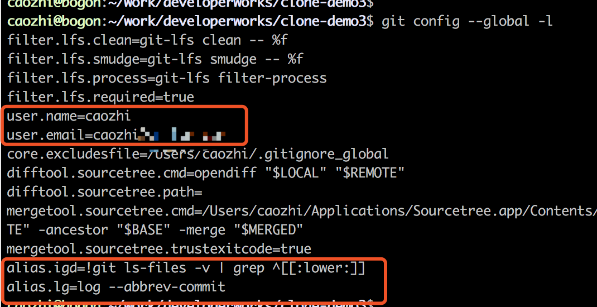

### 使用 Config 文件进行配置

除了使用命令之外，也可以直接编辑 config 文件进行相关配置，如图 17 所示:

##### 图 17\. ~/.gitconfig 文件里的配置

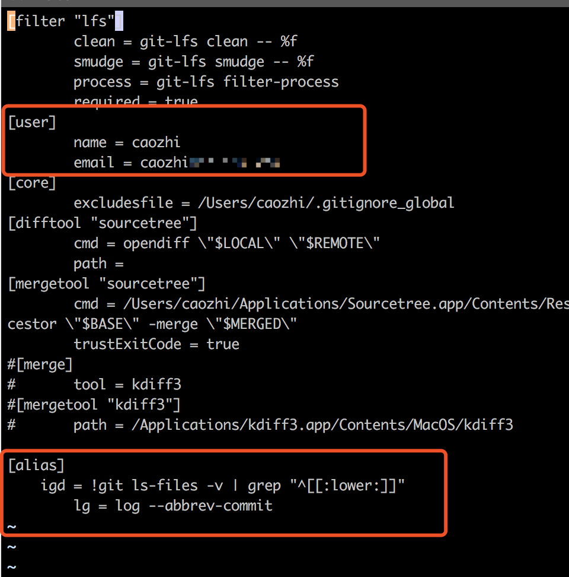

## 设置 Git 忽略提交规则

在进行完代码库克隆和简单的配置之后，接下来我们可以根据项目需要配置一些文件忽略规则。跟大多数的代码库管理工具一样，Git 也可以对不需要被代码库所管理的文件或文件类型进行配置，使得提交代码时，这些文件不会被提交到代码库中。Git 是通过忽略清单 `.gitignore` 文件进行配置的。

通常我们会考虑将如下类型的文件添加到忽略清单中:

- 编译过程的中间文件，例如 `*.class` 文件、 `*.o` 文件、 `*.obj` 文件等。
- 外部依赖的包或者工程编译的包，例如 jar 包、lib 包、dll 包或 war 包等。在有的项目实践中，可能会将这类依赖包也放到代码库中进行管理，通常这不是一个很好的策略，因为这样会显著地增加代码库的大小，降低开发者的工作效率。比较合理的方式是通过构建工具的依赖管理功能来管理这些依赖包，例如 Maven、Gradle 等。
- 编译过程中，通过某种机制自动生成的代码。某些项目中，可能会使用脚本或者 `xsd schema` 文件来生成代码；这类代码只需要将用于自动生成的脚本或者 schema 文件管理起来即可。
- 项目的配置文件。同一项目组的不同开发者可能有不同的项目配置，或者配置中包含敏感信息，例如账号密码等，这类配置文件也应该放到 ignore 清单里。
- 某些 IDE 的工程配置文件，例如 Eclipse 的 `setting` 和 `project` 文件、Idea 的 `.idea` 目录等。
- 一些自动生成的系统文件，例如 Windows 的 `Thumbs.db` 或者 MacOS 的 `.DS_Store` 文件等。
- 项目或者 IDE 的日志文件。

`.gitignore` 文件每行表示一个匹配模式（ `#` 开头的行或者空行除外， `#` 用于注释）。它使用 glob 模式来进行匹配，glob 模式是一种简化的正则表达式，常用于来进行路径的模式匹配。我们可以在代码库的根目录或者任意子目录添加 `.gitignore` 文件，特定目录下的 `.gitignore` 文件使得忽略规则只在该目录及其子目录下有效。表 1 列出了常用的一些匹配模式的写法：

##### 表 1\. 常用匹配模式

**模式****含义****示例**完整路径忽略完整路径所定义的文件`dev/dev.conf``/path`以 / 开头，只匹配当前目录下路径为 path 的文件`/a.java /a.cpp``path`不以 / 开头，匹配当前目录及其子目录下所有文件`*.o web.xml``path/`以 / 结尾，用以只匹配目录；`path` 目录及其子目录和文件会被忽略；如果 path 是个文件，则不会被忽略`.settings/`带 `*` 号的模式置于文件中，用于匹配所有满足规则的文件`*.zip *.jar`带 `**` 的模式置于路径中，用于匹配满足 `**` 前后的所有路径`Dev/**/dev.conf **/*.jar`!path在 ignore 文件中如果前面已经定义了某个模式，但是又有一些特殊文件我们不想被忽略，我们可以用 ! 来匹配`*.jar ##` 忽略所有 jar 包 `!server.jar ##` 希望 `server.jar` 仍被跟踪

注意：

- 当某个文件已经被提交到代码库中被 Git 所管理起来之后，将该文件再添加进 `.gitignore` 文件是无效的，对该文件进行修改时，执行 `git status` 操作之后仍然会提示该文件已被修改。针对已经提交代码库的文件我们又想忽略其修改的场景，将会在本系列第四篇文章中介绍。
- 每个目录下都可以放单独的 `.gitignore` 文件以控制子目录的忽略规则。
- 即使已经在忽略列表里，当我们确实想要提交一些符合忽略规则的文件时，仍可以使用 `git -f add` 加具体的文件路径的方式将这些文件提交到库中。如图 18 所示：

##### 图 18\. 强制添加被忽略的文件

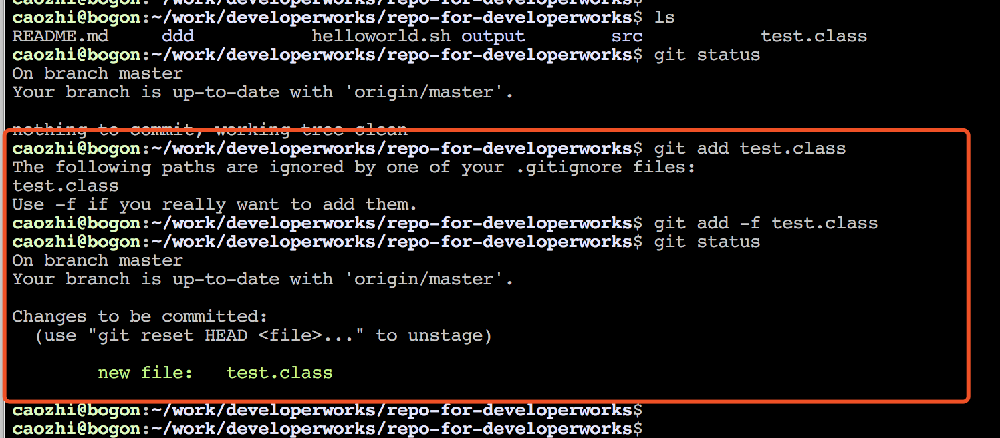

- GitHub 有一个十分详细的针对数十种项目及语言的 `.gitignore` 文件列表模板，可以在 [https://github.com/github/gitignore](https://github.com/github/gitignore) 找到它。

## 结束语

为使用 Git 和 GitHub 进行日常开发做准备，本文详细通过一些列演示向读者讲解了如何采用 SSH 和 HTTPS 两种方式从 GitHub 克隆代码库，如何进行本地 Git 开发环境的基础配置，如何配置 `.gitignore` 文件等。相信您在阅读完本文之后将有能力自己初始化一套本地的 Git 环境。