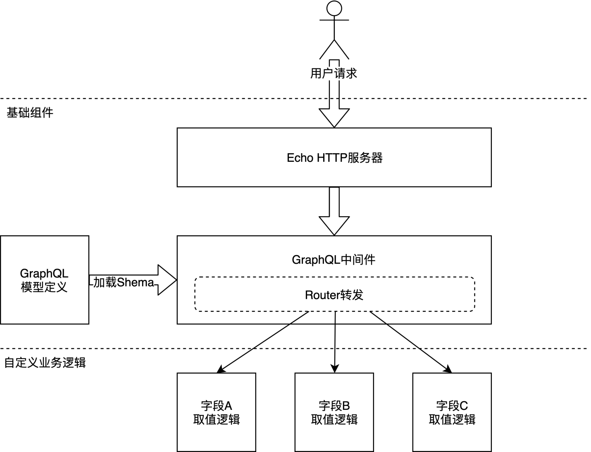
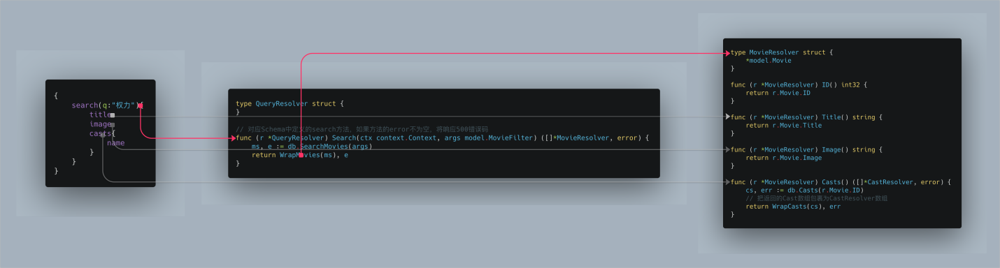

# Golang 实战：开发基于 GraphQL 的接口服务
使用 Echo 和 graphql-go 框架开发基于 Golang 的 GraphQL 接口服务

**标签:** API 管理,Docker,Web 开发,前端开发

[原文链接](https://developer.ibm.com/zh/articles/develop-graphql-services-using-golang/)

吴浩麟

发布: 2020-08-18

* * *

Golang 以其高效、稳定、简单的优势吸引了大量开发者使用，越来越多公司和云计算平台开始选择 Golang 作为后端服务开发语言。Golang 对比目前主流的后端开发语言 Java 具有以下优势：

- 性能好：编译为机器码的静态类型语言，能以更少的资源提供同样量级的访问量，节省云服务开支。
- 上手快：语法更简洁，标准库完善设计优秀，自带垃圾回收，开发效率高。
- 并发友好：语言层面支持并发，可以充分利用多核，轻松应对高并发服务。

本文将以打造一个能查询电影和演员的电影网站后端服务为例，一步步教您如何用 Golang 开发 GraphQL 服务，内容涵盖：

- 流行 Golang HTTP 框架对比与 Echo 框架介绍
- 流行 Golang GraphQL 框架对比与 graphql-go 框架介绍
- 使用 Docker 部署 Golang 应用
- 接入 GitHub Actions 实现开发流程自动化

以下是我搭建出的服务整体架构图：



在阅读本文前您需要有一定的 Golang 基础，您可以 [阅读免费电子书入门](http://go.wuhaolin.cn/)。

## HTTP 框架

Golang 标准库内置的 [net/http](https://golang.org/pkg/net/http/) 包能快速实现一个 HTTP 服务器：

```
import (
    "fmt"
    "net/http"
)

func main() {
    http.HandleFunc("/hello", func(writer http.ResponseWriter, request *http.Request) {
        fmt.Fprintf(writer, "Hello, World!")
    })
    http.ListenAndServe(":8080", nil) // HTTP 服务监听在 8080 端口
}

```

Show moreShow more icon

但其功能太基础，要用在实际项目中还需要自己补充大量常用基础功能，例如：

- 路由参数：从 `URL /movie/:id` 中提取 id 参数。
- 静态资源托管：暴露 `/static` 目录下的所有文件。
- 响应格式：返回 HTML、JSON、XML 等格式响应，需要设置对应 HTTP 响应头。
- 日志：记录请求和响应日志。
- CORS：支持跨域请求。
- HTTPS：配置 HTTPS 证书。

好在 Golang 社区中已有多款成熟完善的 HTTP 框架，例如 [Gin](https://github.com/gin-gonic/gin)、 [Echo](https://echo.labstack.com/) 等。 Gin 和 Echo 功能相似，但 Echo 文档更齐全性能更好，因此本文选择 Echo 作为 HTTP 框架，接下来详细介绍 Echo 的用法。

## Echo 介绍

Echo 封装的简约但不失灵活，只需以下代码就能快速实现一个高性能 HTTP 服务：

```
import (
    "net/http"

    "github.com/labstack/echo/v4"
)

func main() {
    e := echo.New()
    e.GET("/hello", func(context echo.Context) error {
        return c.String(http.StatusOK, "Hello, World!")
    })
    e.Start(":8080") // HTTP 服务监听在 8080 端口
}

```

Show moreShow more icon

要实现需要响应 JSON 也非常简单：

```
    // 响应 map 类型 JSON
    e.GET("/map", func(context echo.Context) error {
        return context.JSON(http.StatusOK, map[string]interface{}{"Hello": "World"})
    })

    // 响应数组类型 JSON
    e.GET("/array", func(context echo.Context) error {
        return context.JSON(http.StatusOK, []string{"Hello", "World"})
    })

    // 响应结构体类型 JSON
    type Hi struct {
        Hello string `json:"Hello"`
    }
    e.GET("/struct", func(context echo.Context) error {
        return context.JSON(http.StatusOK, Hi{
            Hello: "World",
        })
    })

```

Show moreShow more icon

### Echo 获取请求参数

如果请求中带有参数，Echo 能方便地帮您解析出来：

```
    e.GET("/params/:operationName", func(context echo.Context) error {
        email := c.QueryParam("email") // 从 URL params?email=abc 中提取 email 字段的值
        operationName := c.Param("operationName") // 从 URL params/:abc 中提取 operationName 字段的值
        variables := c.FormValue("variables") // 从 POST Form 请求的 body 中提取 variables 字段的值
    })

```

Show moreShow more icon

Echo 还提供更强大的 Bind 功能，能根据请求自动的提取结构化的参数，同时还能校验参数是否合法：

```
    // 定义参数的结构
    type Params struct {
        Email         string                 `validate:"required,email"` // 改字段必填，并且是 email 格式
        // 从 JSON 和 Form 请求中提取的字段名称是 operationName，从 URL 中提取的字段名称是 operation_name
        OperationName string                 `json:"operationName" form:"operationName" query:"operation_name"`
        Variables     map[string]interface{}
    }
    e.GET("/structParams", func(context echo.Context) (err error) {
        params:= Params{}
        // Bind 将自动根据请求类型，从 URL、Body 中提取参数转换为 Params struct 中定义的结构
        err = context.Bind(&params)
        // 如果校验失败，err 将非空表示校验失败信息
        if err != nil {
            retuen
        }
    })

```

Show moreShow more icon

### Echo 错误处理

在获取响应给客户端的数据时可能会发生异常，这时候需要 HTTP 服务作出响应，Echo 的错误处理设计的很优雅：

```
    e.GET("/movie", func(context echo.Context) (err error) {
        // 获取电影数据，可能发生错误
        movie, err := getMovie()
        // 如果获取电影失败，直接返回错误
        if err != nil {
            // 客户端将收到 HTTP 500 响应码，内容为：{"message": "err.Error()对应的字符串"}
            retuen
        }
        return context.JSON(http.StatusOK, movie)
    })

```

Show moreShow more icon

如果您不想返回默认的 `500` 错误，例如没有权限，可以自定义错误码：

```
    e.GET("/movie", func(context echo.Context) (err error) {
        movie, err := getMovie()
        if err != nil {
            // 客户端将收到 HTTP 401 响应码，内容为：{"message": "err.Error()对应的字符串"}
            retuen echo.NewHTTPError(http.StatusUnauthorized, err.Error())
        }
    })

```

Show moreShow more icon

如果您不想在出错时响应 JSON，例如需要响应 HTTP，可以自定义错误渲染逻辑：

```
e.HTTPErrorHandler = func(err error, context echo.Context) {
    return context.HTML(http.StatusUnauthorized, err.Error())
}

```

Show moreShow more icon

### Echo 常用中间件

Echo 内置了大量实用的中间件，例如：

```
import (
    "github.com/labstack/echo/middleware"
)

// 采用 Gzip 压缩响应后能传输更少的字节，如果的 HTTP 服务没有在 Nginx 背后建议开启
e.Use(middleware.Gzip())

// 支持接口跨域请求
e.Use(middleware.CORS())

// 记录请求日志
e.Use(middleware.Logger())

```

Show moreShow more icon

## 用 Golang 实现 GraphQL

GraphQL 作为一种全新的 API 设计思想，把前端所需要的 API 用类似图数据结构的方式结构清晰地展现出来，让前端很方便地获取所需要的数据。GraphQL 可用来取代目前用的最多的 RESTful 规范，相比于 RESTful，GraphQL 有如下优势：

- 数据的关联性和结构化更好：适合关系性强的图数据查询，例如电影能指向多个演员、演员能指向多部电影；接口即文档，节省手动维护接口文档的精力。
- 更健壮的接口：静态类型 Schema 约束，不仅能校验前端发送的参数是否符合格式，还能自动生成 TypeScript 和 C 等语言中的类型定义。
- [易于前端缓存数据](https://graphql.org/learn/caching/)：借助结构化，社区中很多 GraphQL 客户端内置了缓存功能。
- 按需选择：前端根据自己的场景选择部分字段返回，节省计算和网络传输。

自从 FaceBook 在 2012 年公布了 GraphQL 规范后，引起了很多大公司和社区关注，逐渐有公司开始使用 GraphQL 作为 API 规范。在 Golang 社区中也涌现了多个 GraphQL 服务端框架，例如：

1. [graphql](https://github.com/graphql-go/graphql)：目前用户最多，但缺点是完全通过 Golang 代码描述字段、结构、取数据逻辑，代码臃肿。
2. [gqlgen](https://github.com/99designs/gqlgen)：需要先定义 GraphQL Schema，然后通过工具生成大量模版代码，再用 Golang 代码填充取数据逻辑。
3. [graphql-go](https://github.com/graph-gophers/graphql-go)：需要先定义 GraphQL Schema，再加 Golang 代码描述取数据逻辑，代码简约。

接下来本文将选择第三个 graphql-go 作为 GraphQL 服务端框架来介绍如何使用它。

### 定义 GraphQL Schema

假设我们需要实现一个搜索电影的服务，我们需要先定义接口暴露的 Schema。

```
schema {
    query: Query
}

type Query {
    search(offset: Int,size: Int,q: String): [Movie!] # 通过关键字搜索电影
}

type Movie {
    id: Int!
    title: String!
    casts: [Cast!]! # 一个电影有多个演员
    image: String!
}

type Cast {
    id: Int!
    name: String!
    image: String!
}

```

Show moreShow more icon

客户端在调用接口时只需要发送以下请求：

```
{
    search(q:"您好"){
        title
        image
        casts{
            name
        }
    }
}

```

Show moreShow more icon

### 定义取值逻辑

实现根 query 的取值逻辑：

```
import (
    "net/http"

    "github.com/gwuhaolin/echo_graphql"
    "github.com/labstack/echo"
    "github.com/graph-gophers/graphql-go"
)

// 定义筛选参数结构，对应 Schema 中定义的 search 方法的参数
type MovieFilter struct {
    Offset   *int32
    Size     *int32
    Q        *string
}

type QueryResolver struct {
}

// 对应 Schema 中定义的 search 方法，如果方法的 error 不为空，将响应 500 错误码
func (r *QueryResolver) Search(ctx context.Context, args model.MovieFilter) ([]*MovieResolver, error) {
    ms, e := db.SearchMovies(args)
    return WrapMovies(ms), e
}

```

Show moreShow more icon

实现获取电影信息的取值逻辑：

```
type MovieResolver struct {
    *model.Movie
}

func (r *MovieResolver) ID() int32 {
    return r.Movie.ID
}

func (r *MovieResolver) Title() string {
    return r.Movie.Title
}

func (r *MovieResolver) Image() string {
    return r.Movie.Image
}

func (r *MovieResolver) Casts() ([]*CastResolver, error) {
    cs, err := db.Casts(r.Movie.ID)
    // 把返回的 Cast 数组包裹为 CastResolver 数组
    return WrapCasts(cs), err
}

// 把返回的 Movie 数组包裹为 MovieResolver 数组
func WrapMovies(movies []*model.Movie) []*MovieResolver {
    msr := make([]*MovieResolver, 0)
    for i := range movies {
        msr = append(msr, &MovieResolver{movies[i]})
    }
    return msr
}

```

Show moreShow more icon

定义的 Schema 和 Golang 代码之间有一个很清晰的映射，包括下钻的嵌套字段，如下图：



演员信息的取值实现逻辑和电影的非常相似就不再复述。

## 打通 Echo 和 graphql-go

graphql-go 暴露了一个 Exec 函数用于执行 GraphQL 语句，该函数入参为 HTTP 请求上下文与 body 中的参数，用法如下：

```
schema := graphql.MustParseSchema(`上面定义的 Schema`, QueryResolver{}, graphql.UseFieldResolvers())
data := schema.Exec(context.Request().Context(), params.Query, params.OperationName, params.Variables)

```

Show moreShow more icon

其中 Exec 的入参都可以通过 Echo 拿到：

```
// graphql 请求体的标准格式
type Params struct {
    Query         string                 `json:"query"`
    OperationName string                 `json:"operationName"`
    Variables     map[string]interface{} `json:"variables"`
}

// 在 Echo 中注册 graphql 路由
e.Any("/graphql", func(context echo.Context) (err error) {
    params := Params{}
    err = context.Bind(&params)
    if err != nil {
        return
    }
    data := schema.Exec(context.Request().Context(), params.Query, params.OperationName, params.Variables)
    return context.JSON(http.StatusOK, data)
})

```

Show moreShow more icon

至此，我们就开发了一个基于 Golang 的 GraphQL 服务。

## 使用 Docker 部署 GraphQL 服务

使用 Docker 部署服务能抹去大量繁琐易错的手工操作。第一步需要把我们上面开发完的 GraphQL 服务构建成一个镜像， 为此需要写一个 Dockerfile：

```
FROM golang:latest as builder
WORKDIR /app
COPY . .
RUN go mod download
RUN CGO_ENABLED=0 GOOS=linux go build -a -installsuffix cgo -o main ./http

FROM alpine:latest
COPY --from=builder /app/main .
EXPOSE 80
EXPOSE 443
CMD ["./main"]

```

Show moreShow more icon

同时您可以定义一个 GitHub Action 来自动构建和发布镜像，新增 Action 配置文件：`.github/workflows/docker.yml` 如下：

```
name: release
on: [push]
jobs:
dy-server:
    runs-on: ubuntu-latest
    steps:
      - uses: actions/checkout@v1
      - name: Docker dy-server release
        uses: elgohr/Publish-Docker-Github-Action@master
        with:
          name: gwuhaolin/projectname/http-server
          username: gwuhaolin
          password: ${{ github.token }}
          registry: docker.pkg.github.com
          dockerfile: http/Dockerfile
          workdir: ./

```

Show moreShow more icon

每次您向 GitHub 推送代码后都会自动触发构建生产最新的 GraphQL 服务镜像，有了镜像您可以直接通过 Docker 运行服务：

shell script docker run -d –name http-server -p 80:80 -p 443:443 docker.pkg.github.com/gwuhaolin/projectname/http-server:latest

## 结束语

自从 2009 年发布以来，Golang 社区已发展的非常成熟，您可以在开源社区找到几乎所有的现成框架。 使用 Golang 开发出的 GraphQL 服务不仅能支撑高并发量，编译出的产物也非常小，由于不依赖虚拟机，搭配上 Docker 带来的自动化部署给开发者节省成本的同时又带来稳定和便利。

虽然 Golang 能开发出小巧高效的 GraphQL 服务，但可以看出在实现 GraphQL 取数逻辑那块有大量繁琐重复的工作， 这归咎于 Golang 语法太过死板无法给框架开发者发挥空间来实现使用更便利的框架，希望后续 Golang2 能提供更灵活的语法来优化这些不足。