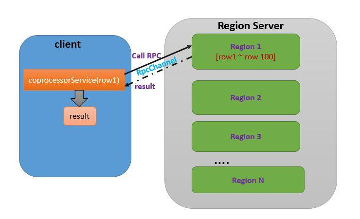
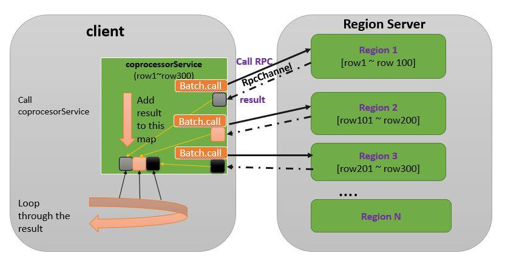
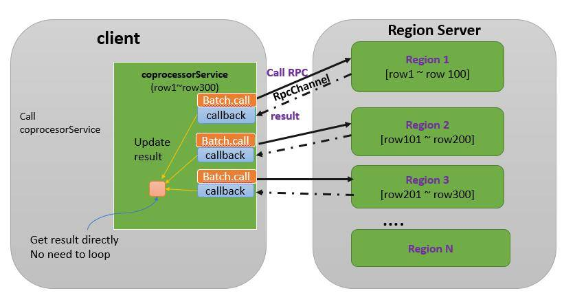
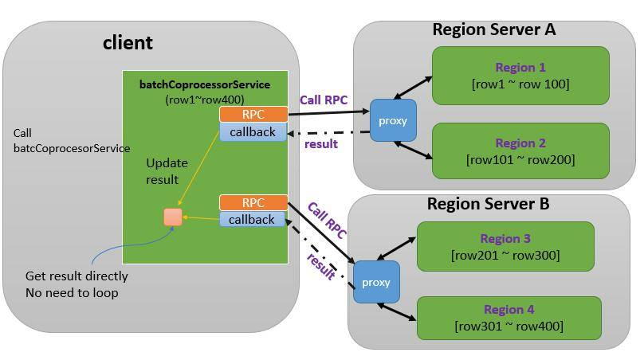

# HBase 协处理器编程详解，第 2 部分：客户端代码编写
深入理解 HBase

**标签:** Java

[原文链接](https://developer.ibm.com/zh/articles/os-cn-hbase-coprocessor2/)

刘 明

发布: 2015-06-03

* * *

## 实现 Client 端代码

HBase 提供了客户端 Java 包 org.apache.hadoop.hbase.client.coprocessor。它提供以下三种方法来调用协处理器提供的服务：

- Table.coprocessorService(byte[])
- Table.coprocessorService(Class, byte[], byte[],Batch.Call),
- Table.coprocessorService(Class, byte[], byte[], Batch.Call, Batch.Callback)

Endpoing 协处理器在 Region 上下文中运行，一个 HBase 表可能有多个 Region。因此客户端可以指定调用某一个单个 Region 上的协处理器，在单个 Region 上进行处理并返回一定结果；也可以调用一定范围内的若干 Region 上的协处理器并发执行，并对结果进行汇总处理。针对不同的需要，可以选择以上三种方法，让我们来一一举例说明。

### 调用单个 Region 上的协处理器 RPC

第一个方法使用 API coprocessorService(byte[])，这个函数只调用单个 Region 上的协处理器。

该方法采用 RowKey 指定 Region。这是因为 HBase 的客户端很少会直接操作 Region，一般不需要知道 Region 的名字；况且在 HBase 中，Region 名会随时改变，所以用 rowkey 来指定 Region 是最合理的方式。使用 rowkey 可以指定唯一的一个 Region，如果给定的 rowkey 并不存在，只要在某个 Region 的 rowkey 范围内，依然可以用来指定该 Region。比如 Region 1 处理 [row1, row100] 这个区间内的数据，则 rowkey=row1 就由 Region 1 来负责处理，换句话说，我们可以用 row1 来指定 Region 1，无论 rowkey 等于 “row1” 的记录是否存在。

##### 图 1\. 调用单个 Region 上的协处理器



coprocessorService 方法返回类型为 CoprocessorRpcChannel 的对象，该 RPC 通道连接到由 rowkey 指定的 Region 上，通过这个通道，就可以调用该 Region 上部署的协处理器 RPC。

在本系列的第一部分，我们已经通过 Protobuf 定义了 RPC Service。调用 Service 的 newBlockingStub() 方法，将 CoprocessorRpcChannel 作为输入参数，就可以得到 RPC 调用的 stub 对象，进而调用远端的 RPC。这个过程是标准的 HBase RPC 调用，读者可以参考讲解 HBase RPC 的相关文章进一步学习。

##### 清单 1\. 获取单个 Region 的 rowcount

```
long singleRegionCount(String tableName, String rowkey,boolean reCount)
{
long rowcount = 0;
try{
Configuration config = new Configuration();
HConnection conn = HConnectionManager.createConnection(config);
HTableInterface tbl = conn.getTable(tableName);
//获取 Channel
CoprocessorRpcChannel channel = tbl.coprocessorService(rowkey.getBytes());
org.ibm.developerworks.getRowCount.ibmDeveloperWorksService.BlockingInterface service =
org.ibm.developerworks.getRowCount.ibmDeveloperWorksService.newBlockingStub(channel);

//设置 RPC 入口参数
org.ibm.developerworks.getRowCount.getRowCountRequest.Builder request =
org.ibm.developerworks.getRowCount.getRowCountRequest.newBuilder();
request.setReCount(reCount);

//调用 RPC
org.ibm.developerworks.getRowCount.getRowCountResponse ret =
service.getRowCount(null, request.build());

//解析结果
rowcount = ret.getRowCount();
}
catch(Exception e) {e.printStackTrace();}
return rowcount;
}

```

Show moreShow more icon

### 调用多个 Region 上的协处理器 RPC，不使用 callback

有时候客户端需要调用多个 Region 上的同一个协处理器，比如需要统计整个 table 的 rowcount，在这种情况下，需要所有的 Region 都参与进来，分别统计自己 Region 内部的 rowcount 并返回客户端，最终客户端将所有 Region 的返回结果汇总，就可以得到整张表的 rowcount。

这意味着该客户端同时和多个 Region 进行批处理交互。一个可行的方法是，收集每个 Region 的 startkey，然后循环调用第一种 coprocessorService 方法：用每一个 Region 的 startkey 作为入口参数，获得 RPC 通道，创建 stub 对象，进而逐一调用每个 Region 上的协处理器 RPC。这种做法需要写很多的代码，为此 HBase 提供了两种更加简单的 coprocessorService 方法来处理多个 Region 的协处理器调用。先来看第一种方法 coprocessorService(Class, byte[],byte[],Batch.Call)，

该方法有 4 个入口参数。第一个参数是实现 RPC 的 Service 类，即前文中的 `ibmDeveloperWorksService` 类。通过它，HBase 就可以找到相应的部署在 Region 上的协处理器，一个 Region 上可以部署多个协处理器，客户端必须通过指定 Service 类来区分究竟需要调用哪个协处理器提供的服务。

要调用哪些 Region 上的服务则由 startkey 和 endkey 来确定，通过 rowkey 范围即可确定多个 Region。为此，coprocessorService 方法的第二个和第三个参数分别是 startkey 和 endkey，凡是落在 [startkey，endkey] 区间内的 Region 都会参与本次调用。

第四个参数是接口类 Batch.Call。它定义了如何调用协处理器，用户通过重载该接口的 call() 方法来实现客户端的逻辑。在 call() 方法内，可以调用 RPC，并对返回值进行任意处理。即前文代码清单 1 中所做的事情。coprocessorService 将负责对每个 Region 调用这个 call 方法。

coprocessorService 方法的返回值是一个 map 类型的集合。该集合的 key 是 Region 名字，value 是 Batch.Call.call 方法的返回值。该集合可以看作是所有 Region 的协处理器 RPC 返回的结果集。客户端代码可以遍历该集合对所有的结果进行汇总处理。

这种 coprocessorService 方法的大体工作流程如下。首先它分析 startkey 和 endkey，找到该区间内的所有 Region，假设存放在 regionList 中。然后，遍历 regionList，为每一个 Region 调用 Batch.Call，在该接口内，用户定义了具体的 RPC 调用逻辑。最后 coprocessorService 将所有 Batch.Call.call() 的返回值加入结果集合并返回。如下图所示：

##### 图 2\. 调用多个 Region 上的协处理器–不使用 callback



下面，我们将利用这个方法对指定 table 进行 rowcount 统计。基本思路是对指定 table 的所有 Region 调用 getRowCount RPC 方法。最后将结果集进行累加求得最终结果。

因此为了指定调用 getRowCount RPC，第一个参数就是 ibmDeveloperWorksService.class。第二个参数和第三个参数都为 null，这样 coprocessorService 就会对指定 table 的所有 Region 进行处理。比较复杂的是第四个参数。

Batch.Call 是一个接口类，只提供了一个方法叫做 call ()，coprocessorService 会为每一个 Region 调用 Batch.Call 接口定义的 call 方法，因此调用 RPC 的逻辑即在重载 call() 方法中实现。

call 方法的入口参数是 coprocessorService 的第一个参数的一个实例，通过它即可调用 RPC。本例中，我们在 call 方法内需要调用 Endpoint 协处理器提供的 getRowCount 方法，然后直接将该 RPC 的返回值返回即可。coprocessorService 会将 call 方法的返回值加入最终的结果集合中。

##### 清单 2\. Batch.Call 接口实现

```
Batch.Call<ibmDeveloperWorksService, getRowCountResponse> callable =
new Batch.Call<ibmDeveloperWorksService, getRowCountResponse>() {
ServerRpcController controller = new ServerRpcController();
BlockingRpcCallback<getRowCountResponse> rpcCallback =
new BlockingRpcCallback<getRowCountResponse>();
//下面重载 call 方法
@Override
public getRowCountResponse call(ibmDeveloperWorksService instance) throws IOException {
//初始化 RPC 的入口参数，设置 reCount 为 true
//Server 端会进行慢速的遍历 region 的方法进行统计
org.ibm.developerworks.getRowCount.getRowCountRequest.Builder builder =
                            getRowCountRequest.newBuilder();
builder.setreCount(true);
//RPC 调用
instance.getRowCount(controller, builder.build(), rpcCallback);
//直接返回结果，即该 Region 的 rowCount
return rpcCallback.get();
}
};

```

Show moreShow more icon

写好这个最复杂的 Batch.Call 接口类之后，在客户端代码里面只需要直接调用 coprocessorService 函数，然后对结果集合进行统计即可。下面的代码演示了基本完整的客户端代码。首先获得 table 的实例，然后调用 table 的 coprocessorService 方法，最后对结果进行汇总。HBase1.0 版本开始的 client 代码有所改变，但大家可以看到，这些改变实际上并不影响 Coprocessor 的调用方法，而仅仅是在 HBase 的连接初始化部分有所不同。在本文代码清单中笔者分别列举了 HBase1.0 的代码和 HBase0.98 的示例代码。而附件中的代码则都使用 0.98 版本的 API。

##### 清单 3\. 获取全表行数的代码

```
long getTableRowCountSlow(string tableName) {
//创建 Table 实例, HBase 1.0
Connection connection = ConnectionFactory.createConnection(conf);
Table table = connection.getTable(tableName);
//创建 HTable 实例，HBase 0.98
HConnection connection = HConnectionManager.createConnection(config);
HTable table = connection.getTable(tableName);

Batch.Call<ibmDeveloperWorksService, getRowCountResponse> callable =
... 省略代码，参考代码清单 2
results = table.coprocessorService(ibmDeveloperWorksService.class, null, null,
callable);
long totalRowCount = 0;
for( r : results)
{
totalRowCount += r.value();
}
return totalRowCount;
}

```

Show moreShow more icon

### 调用多个 Region 上的协处理器 RPC–使用 callback

coprocessorService 的第三种方法比第二个方法多了一个参数 callback。coprocessorService 第二个方法内部使用 HBase 自带的缺省 callback，该缺省 callback 将每个 Region 的返回结果都添加到一个 map 类型的结果集中，并将该集合作为 coprocessorService 方法的返回值。

这个结果集合的 key 是 Region 名字，value 是 call 方法的返回值。采用这种方法，客户端代码需要将 RPC 执行结果先保存在一个集合中，再进入一个循环，遍历结果集合进一步处理。

有些情况下这种使用集合的开销是不必要的。对每个 Region 的返回结果直接进行处理可以省去这些开销。具体过程如下图所示：

##### 图 3\. 调用多个 Region 上的协处理器–使用 callback



HBase 提供第三种 coprocessorService 方法允许用户定义 callback 行为，coprocessorService 会为每一个 RPC 返回结果调用该 callback，用户可以在 callback 中执行需要的逻辑，比如执行 sum 累加。用第二种方法的情况下，每个 Region 协处理器 RPC 的返回结果先放入一个列表，所有的 Region 都返回后，用户代码再从该列表中取出每一个结果进行累加；用第三种方法，直接在 callback 中进行累加，省掉了创建结果集合和遍历该集合的开销，效率会更高一些。

因此我们只需要额外定义一个 callback 即可，callback 是一个 Batch.Callback 接口类，用户需要重载其 update 方法。

##### 清单 4\. Batch.Callback 接口实现

```
//定义总的 rowCount 变量
final AtomicLong totalRowCount = new AtomicLong();
//定义 callback
Batch.Callback< Long > callback =
new Batch.Callback<Long>() {
@Override
public void update(byte[] region, byte[] row, getRowCountResponse result) {
//直接将 Batch.Call 的结果，即单个 region 的 rowCount 累加到 totalRowCount
totalRowCount.getAndAdd(result.getRowCount());
}
};

```

Show moreShow more icon

在使用第三种 coprocessorService 的例子代码中，我们将调用 Endpoint 协处理器 RPC getRowCount 的快速方法，即直接读取由 Endpoint 协处理和 Observer 协处理器共同维护的 rowCount 变量，而无需 scan 整个 region。因此这是一种快速方法。

为此我们在调用 RPC 的时候将 getRowCountRequest.reCount 设置为 false，其他代码和代码清单 3 一致。

##### 清单 5\. getTableRowCountFast 实现

```
long getTableRowCountFast(string tableName) {
//创建 Table 实例, HBase 1.0
Connection connection = ConnectionFactory.createConnection(conf);
TableName TABLE = TableName.valueOf(tableName);
Table table = connection.getTable(TABLE);
//创建 HTable 实例，HBase 0.98
HConnection connection = HConnectionManager.createConnection(config);
HTable table = connection.getTable(tableName);

Batch.Call<ibmDeveloperWorksService, getRowCountResponse> callable =
new Batch.Call<ibmDeveloperWorksService, getRowCountResponse>() {
ServerRpcController controller = new ServerRpcController();
BlockingRpcCallback<getRowCountResponse> rpcCallback =
new BlockingRpcCallback<getRowCountResponse>();
//下面重载 call 方法
@Override
public getRowCountResponse call(ibmDeveloperWorksService instance)
throws IOException {
//初始化 RPC 的入口参数，设置 reCount 为 false
//Server 端会进行慢速的遍历 region 的方法进行统计
org.ibm.developerworks.getRowCount.getRowCountRequest.Builder builder =
getRowCountRequest.newBuilder();
builder.setreCount(false);
//RPC 调用
instance.getRowCount(controller, builder.build(), rpcCallback);
//直接返回结果，即该 Region 的 rowCount
return rpcCallback.get();
}
};

//定义总的 rowCount 变量
AtomicLong totalRowCount = new AtomicLong();
//定义 callback
Batch.Callback< Long > callback =
new Batch.Callback<Long>() {
@Override
public void update(byte[] region, byte[] row, Long result) {
//直接将 Batch.Call 的结果，即单个 region 的 rowCount 累加到 totalRowCount
totalRowCount.getAndAdd(result);
}
};

table.coprocessorService( ibmDeveloperWorksService.class, null, null,
callable, callback);
return totalRowCount;
}

```

Show moreShow more icon

### 批处理 coprocessorService

除了以上三种直接调用 coprocessorService 的方法之外，HBase 还提供另外两个更加高效的客户端调用方法，能够对 coprocessorService 进行批处理，进一步提高调用效率：

- void batchCoprocessorService(MethodDescriptor methodDescriptor,

com.google.protobuf.Message request,

byte[] startKey,

byte[] endKey,

R responsePrototype,

Batch.Callback callback)

- Map<byte[],r> batchCoprocessorService(MethodDescriptor methodDescriptor,

com.google.protobuf.Message request,

byte[] startKey,

byte[] endKey,

R responsePrototype)

在之前的例子中，每次调用一个 RPC，客户端都将和 Region Server 进行一次网络交互。比如一个 table 有 10 个 Region，均匀分布在 2 个 Region Server 上，即每个 Region Server 上有 5 个 Region。采用前面的方法，需要 10 次 RPC 过程。采用 BatchCoprocessorService，则 HBase 会自动将属于同一个 Region Server 的多个 RPC 打包在一个 RPC 调用过程中，对于前面的例子，2 个 Region Server 上分布 10 个 Region，采用这两个方法就可以只发起 2 次网络交互，一次将 5 个 RPC 调用发给 Region Server A；另一次将剩下 5 个 RPC 调用批处理发给 Region Server B。这样就节约了网络交互的开销，更加高效。

##### 图 4\. 调用 batchCoprocessorService



由于一般情况下，调用协处理器的频率并不会很高，对于调用效率的苛求比较少见。所以很少见到使用这两种 API 的例子，不推荐使用。同时还存在一些问题，本文稍后会有所描述。

代码清单 6 给出使用 batchCoprocessorService 的例子代码，笔者测试可以正确运行，读者可以在本文附件中获得完整代码。

##### 清单 6\. batchCoprocessorService 的调用方法

```
long getTableRowCountBatch(String tableName) {
try{
//连接 Hbase
Configuration config = new Configuration();
HConnection connection = HConnectionManager.createConnection(config);
HTableInterface table = connection.getTable(tableName);

//设置 request 参数
org.ibm.developerworks.getRowCount.getRowCountRequest.Builder builder =
getRowCountRequest.newBuilder();
builder.setReCount(false);

//开始和结束 rowkey
byte[] s= Bytes.toBytes("r1");
byte[] e= Bytes.toBytes("t1");
//调用 batchCoprocessorService
results = table.batchCoprocessorService(
ibmDeveloperWorksService.getDescriptor().findMethodByName("getRowCount"),
builder.build(),s, e,
getRowCountResponse.getDefaultInstance());
}
Collection<getRowCountResponse> resultsc = results.values();
for( getRowCountResponse r : resultsc)
{
totalRowCount += r.getRowCount();
}

return totalRowCount;
}

```

Show moreShow more icon

我们在前文定义了 Protobuf，其中 ibmDeveloperWOrksService 是我们定义的 Service，通过其 getDescriptor() 方法可以找到 Service 的描述符。RPC 方法在 Service 中定义，因此可以用 Service 描述符的 findMethodByName 方法找到具体的方法描述符，该描述符作为 batchCoprocessorService 的第一个参数，以便该方法可以知道调用哪个 RPC。关于 HBase 如何使用 Protobuf 实现 RPC 是一个大的话题，本文无法展开说明，感兴趣的读者可以进一步自行研究。

接下来需要给出 RPC 的入口参数和返回参数类型。和前面直接使用 coprocessorService 一样，还需要指定开始和结束的 rowkey，以便该方法找到正确的 Region 列表。直到 1.0 版本，HBase 在这里还有一些 bug，即 startkey 和 endkey 不能指定为 null。虽然 javadoc 中指明如果为 null，表示全表。但笔者在 0.98.11 版本中无法使用 null 参数，会执行出错。读者可以关注 HBASE-13417，看看什么时候可以正常使用 null 作为参数。

如上所述，一般情况下，使用 Endpoint 协处理器的频率不会太高。HBase 是一个存储数据的系统，最常用的应该是 get 和 put，如果频繁使用协处理器，也许说明您应该考虑其他的数据库系统。因此实践中，笔者尚未曾见过调用 batchCorpcoessorService 的例子。也可以理解为什么这个方法还存在如此低级的 bug。所以笔者不推荐读者使用该方法。

至此主要的客户端代码都已经实现，接下来我们需要编译并部署和执行。

我们将客户端代码也加在同一个 Maven 工程中，最终生成一个 jar 文件，包括了测试程序和协处理器代码。您也可以为客户端代码另外创建一个 Maven 工程。读者随意。

在本文中，最终的 jar 包为 rowCount.jar。

## 部署和运行

部署协处理器有三种方法。在 [HBase 博客上的文章 coprocessor\_introduction](https://blogs.apache.org/hbase/entry/coprocessor_introduction) 中介绍了其中两种，即修改 hbase-site.xml 文件和通过 `HBase Shell` 命令的方法。本文就不再重复。

第三种方法是通过 HBase API，用编程的方法为指定 table 部署协处理器。相应的 API 为 HTableDescriptor.addCoprocessor(String className)。本文将介绍这种方法。

代码清单 7 演示了如何创建测试用表的过程，通过调用 HTableDescriptor 的 addCoprocessor 方法为相应的 HBase 表部署了我们前文开发的两个协处理器。这段代码作为客户端代码的初始化部分，读者可以下载本文的附件获得完整代码。

##### 清单 7\. 利用 Java 代码实现协处理器部署

```
boolean createTable(string tableName) {
//HBase 1.0 创建 Table
Configuration config = new Configuration();
Table table = null;
TableName TABLE = TableName.valueOf(tableName);
Admin admin= new Admin(config);
HTableDescriptor tableDesc = new HTableDescriptor(TABLE);

//HBase 0.98 创建 Table
Configuration config = new Configuration();
HBaseAdmin admin = new HBaseAdmin(config);
HTableDescriptor tableDesc = new HTableDescriptor(tableName);
//添加 coprocessor
tableDesc.addCoprocessor("org.ibm.developerworks.coprocessor.getRowCountEndpoint”);
tableDesc.addCoprocessor("org.ibm.developerworks.coprocessor.rowCountObserver”);

//省去其他的 HTableDescriptor 操作代码
...
//创建表
admin.createTable(tableDesc);

}

```

Show moreShow more icon

采用 Java 编程的方法部署协处理器，不需要对已经运行的 HBase 实例做任何修改，但是为了 HBase 能够加载协处理器的 jar 包，我们必须将其拷贝到 HBase 实例的 CLASSPATH 所指定的目录下。由于本文使用的是 HBase 的 standalone 模式，最简单的方法是将 jar 包放到$HBASE\_HOME/lib 目录下。在真实的分布式环境下，需要将 jar 包拷贝到每台集群节点的$HBASE\_HOME/lib 中，也有些公司将 jar 包上传到 HDFS 的指定目录，这样每台 RegionServer 都可以通过 HDFS 读取。具体的协处理器部署方法在 HBase0.96 之后和之前的版本都没有区别，读者可以参考前文提及的经典协处理器文章进一步了解。

### 本文的测试程序用法

本文附件中提供了一个完整的测试程序，用来演示本文中所有的代码功能。该测试程序创建用户输入的表，并自动采用 API 方法部署协处理器。然后，测试程序将首先向测试表插入 1000 条数据。然后根据用户输入，执行 N 条 delete 命令，保证最终表内的行数为用户指定的数字。

准备好数据之后，测试代码将分别使用本文介绍的三种客户端方法调用协处理器，并分析和输出结果。

在命令行直接运行例子程序：

```
java hbaseCoprocessorDemo test 1 666 rowkey

```

Show moreShow more icon

测试程序执行，创建 HBase 表 “test”，第二个参数 1 的意思是采用 slow 方法获取 rowcount；如果第二个参数为 0，则例子代码会采用快速方法获取 rowcount；第三个参数即最终期望的 rowcount 个数；第四个参数表示是否进行全表扫描，如果用户将该参数省略，则进行全表 rowcount 统计，否则该参数表示 rowkey，程序就会去统计该 rowkey 所在 Region 上的 rowcount。

关于例子程序的运行细节本文就不再详述，读者可以下载附件查看更多细节，例子程序非常粗糙，仅为了演示基本的 Coprocessor 编程技术。读者可以自行优化和修改。

为了读者实验方便，附件代码包还提供了两个脚本：deploy.sh 进行代码编译和部署；test.sh 进行程序调用。读者可以直接使用这两个脚本进行测试。

## 调试

至此本系列告一段落，通过详细介绍开发协处理器的各种细节，希望能够对大家有所帮助。不过每个程序员都知道，多数情况下，编写代码本身并不会花费太多精力，最耗费时间的就是调试。然而对协处理器代码的调试是比较困难的。笔者也没有好的经验推荐给大家，唯一的调试手段就是通过日志打印，然后分析日志信息。

HBase 本身采用 log4j 进行日志打印，因此可以在 Coprocessor 中使用同样的日志方法，将信息打印到 HBase 的 Region Server 日志文件中，然后通过查看日志文件进而了解协处理器的运行情况。

使用 log4j 的方法非常简单，在类定义中加入 LOG 对象，并初始化。

```
private static final Log LOG = LogFactory.getLog(RowCountObserver.class);

```

Show moreShow more icon

此后，就可以在需要的地方进行打印了，即调用 LOG.info(“”) 即可。非常简单，读者可以参考附件中的代码，在此就不再赘述了。

## 结束语

HBase 的协处理器用途广泛，但是 HBase 的文档中对协处理器编程的细节却缺乏实用性的编程方法描述，希望本文能够为广大 HBase 用户提供一个较为详细的入门介绍。由于作者水平有限，文中可能有错误和不妥的地方，还希望读者不吝赐教。

## 下载示例代码

[sampleCode.zip](http://www.ibm.com/developerWorks/cn/opensource/os-cn-hbase-coprocessor1/sampleCode.zip)