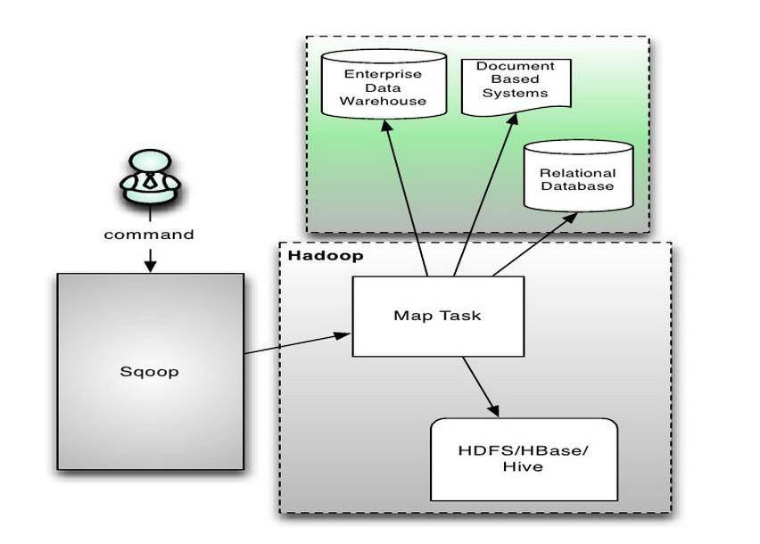

# HBase 数据导入功能实现方式解释
了解 HBase

**标签:** 数据库

[原文链接](https://developer.ibm.com/zh/articles/os-cn-data-import/)

周明耀

发布: 2015-09-21

* * *

## 预备知识：启动 HBase

##### 清单 1\. 修改 hosts 文件

```
[root@node1:2 hbase-0.96.1.1-cdh5.0.1]# cat /etc/hosts
10.17.139.186 node1
10.17.139.185 scheduler2

```

Show moreShow more icon

##### 清单 2\. 启动 HBase 服务

```
[root@node1:2 bin]# ./start-hbase.sh
starting master, logging to /home/zhoumingyao/hbase-0.96.1.1-cdh5.0.1/bin/../logs/hbase-root-master-node1.out
[root@node1:2 bin]# jps
2981 SchedulerServer
46776 Jps
29242 org.eclipse.equinox.launcher_1.1.0.v20100507.jar
2686 IvmsSchedulerDog
46430 HMaster
[root@node1:2 bin]# ps -ef | grep hbase
root 46415 1 0 09:34 pts/2 00:00:00 bash /home/zhoumingyao/hbase-0.96.1.1-cdh5.0.1/bin/hbase-daemon.sh --config /home/zhoumingyao/hbase-0.96.1.1-cdh5.0.1/bin/../conf internal_start master
root 46430 46415 91 09:34 pts/2 00:00:19 /usr/share/jdk1.8.0_45/bin/java -Dproc_master -XX:OnOutOfMemoryError=kill -9 %p -Xmx1000m -XX:+UseConcMarkSweepGC -Dhbase.log.dir=/home/zhoumingyao/hbase-0.96.1.1-cdh5.0.1/bin/../logs -Dhbase.log.file=hbase-root-master-node1.log -Dhbase.home.dir=/home/zhoumingyao/hbase-0.96.1.1-cdh5.0.1/bin/.. -Dhbase.id.str=root -Dhbase.root.logger=INFO,RFA -Dhbase.security.logger=INFO,RFAS org.apache.hadoop.hbase.master.HMaster start
root 47464 1078 0 09:34 pts/2 00:00:00 grep hbase

```

Show moreShow more icon

##### 清单 3\. 插入若干数据

```
hbase(main):002:0> put 'test', 'row1', 'cf:a', 'value1'
0 row(s) in 0.1180 seconds
=> ["test"]
hbase(main):004:0> scan 'test'
ROW COLUMN+CELL
row1 column=cf:a, timestamp=1439861879625, value=value1
1row(s) in 0.0380 seconds
hbase(main):005:0> put 'test', 'row2', 'cf:b', 'value2'
0 row(s) in 0.0170 seconds
hbase(main):006:0> put 'test', 'row3', 'cf:c', 'value3'
0 row(s) in 0.0130 seconds
hbase(main):007:0> scan 'test'
ROW COLUMN+CELL
row1 column=cf:a, timestamp=1439861879625, value=value1
row2 column=cf:b, timestamp=1439861962080, value=value2
row3 column=cf:c, timestamp=1439861968096, value=value3
3 row(s) in 0.0270 seconds
hbase(main):008:0> put 'test', 'row2', 'cf:b', 'value2'
0 row(s) in 0.0080 seconds
hbase(main):009:0> scan 'test'
ROW COLUMN+CELL
row1 column=cf:a, timestamp=1439861879625, value=value1
row2 column=cf:b, timestamp=1439861984176, value=value2
row3 column=cf:c, timestamp=1439861968096, value=value3
3 row(s) in 0.0230 seconds

hbase(main):013:0> put 'test','row1','cf:a','value2'
0 row(s) in 0.0150 seconds
hbase(main):014:0> scan 'test'
ROW COLUMN+CELL
row1 column=cf:1, timestamp=1439862083677, value=value1
row1 column=cf:a, timestamp=1439862100401, value=value2
row2 column=cf:b, timestamp=1439861984176, value=value2
row3 column=cf:c, timestamp=1439861968096, value=value3

```

Show moreShow more icon

## 向 HBase 导入数据

注意：本文代码基于 HBase0.94 版本。

数据导入到 HBase，我们必须考虑分布式环境下的数据合并问题，而数据合并问题一直是 HBase 的难题，因为数据合并需要频繁执行写操作任务，解决方案是我们可以通过生成 HBase 的内部数据文件，这样可以做到直接把数据文件加载到 HBase 数据库对应的数据表。这样的做法写入 HBase 的速度确实很快，但是如果合并过程中 HBase 的配置不是很正确，可能会造成写操作阻塞。目前我们常用的数据导入方法有 HBase Client 调用方式、MapReduce 任务方式、Bulk Load 工具方式、Sqoop 工具方式这四种。下面的文章内容会逐一展开讲解。

下面的几种方式都可以通过 HFile 的帮助做到快速数据导入，我们首先在这里先给出生成 HFile 的 Java 代码，后面各个方法内部再按照各自方式插入 HFile 文件到 HBase 数据库。代码如清单 4 所示。

##### 清单 4\. 生成 HFile 代码

```
import org.apache.hadoop.conf.Configuration;
......
public class generateHFile {
public static class generateHFileMapper extends Mapper<LongWritable,
                Text, ImmutableBytesWritable, KeyValue> {
@Override
protected void map(LongWritable key, Text value, Context context)
throws IOException, InterruptedException {
String line = value.toString();
String[] items = line.split(",", -1);
ImmutableBytesWritable rowkey = new ImmutableBytesWritable(items[0].getBytes());
KeyValue kvProtocol = new KeyValue(items[0].getBytes(), "colfam1".getBytes(),
                         "colfam1".getBytes(), items[0].getBytes());
if (null != kvProtocol) {
context.write(rowkey, kvProtocol);
}
}
}

public static void main(String[] args) throws IOException,
                      InterruptedException, ClassNotFoundException {
Configuration conf = HBaseConfiguration.create();
System.out.println("conf="+conf);
HTable table = new HTable(conf, "testtable1");
System.out.println("table="+table);
Job job = new Job(conf, "generateHFile");
job.setJarByClass(generateHFile.class);
job.setOutputKeyClass(ImmutableBytesWritable.class);
job.setOutputValueClass(KeyValue.class);
job.setMapperClass(generateHFileMapper.class);
job.setReducerClass(KeyValueSortReducer.class);
job.setOutputFormatClass(HFileOutputFormat.class);//组织成 HFile 文件
//自动对 job 进行配置，SimpleTotalOrderPartitioner 是需要先对 key 进行整体排序，
//然后划分到每个 reduce 中，保证每一个 reducer 中的的 key 最小最大值区间范围，是不会有交集的。
HFileOutputFormat.configureIncrementalLoad(job, table);
FileInputFormat.addInputPath(job, new Path(args[0]));
FileOutputFormat.setOutputPath(job, new Path(args[1]));
System.exit(job.waitForCompletion(true) ? 0 : 1);
}
}

```

Show moreShow more icon

运行代码后生成的 HFile 文件放着后面要用。

## Client API 方法

使用 HBase 的 API 中的 Put 方法是最直接的数据导入方式，如清单 3 我们就是采用 HBase 自带的 Shell 工具，调用 put 命令插入了几条数据作为演示。该方式的缺点是当需要将海量数据在规定时间内导入 HBase 中时，需要消耗较大的 CPU 和网络资源，所以这个方式适用于数据量较小的应用环境。

使用 Put 方法将数据插入 HBase 中的方式，由于所有的操作均是在一个单独的客户端执行，所以不会使用到 MapReduce 的 job 概念，即没有任务的概念，所有的操作都是逐条插入到数据库中的。大致的流程可以分解为 HBase Client—>HTable—->Hmastermanager/ZK(获取-root-,–meta–)——>HregionServer—–>Hregion——>Hlog/Hmemstore—–>HFile。即 HBase Client 调用 HTable 类访问到 HMaster 的原数据保存地点，然后通过找到相应的 Region Server，并分配具体的 Region，最后操作到 HFile 这一层级。当连接上 HRegionServer 后，首先获得锁，然后调用 HRegion 类对应的 put 命令开始执行数据导入操作，数据插入后还要写时间戳、写 Hlog，WAL(Write Ahead Log)、Hmemstore。具体实现代码如清单 5 所示，在代码中我们尝试插入了 10 万条数据，打印出插入过程消耗的时间。

##### 清单 5\. 采用 HBase Client 方式代码

```
import org.apache.hadoop.conf.Configuration;
import org.apache.hadoop.hbase.HBaseConfiguration;
import org.apache.hadoop.hbase.client.HTable;
import org.apache.hadoop.hbase.client.Put;
import org.apache.hadoop.hbase.util.Bytes;

import java.io.IOException;

public class PutDemo {

public static void main(String[] args) throws IOException {
//创建 HBase 上下文环境
Configuration conf = HBaseConfiguration.create();
System.out.println("conf="+conf);
int count=0;

HBaseHelper helper = HBaseHelper.getHelper(conf);
System.out.println("helper="+helper);
helper.dropTable("testtable1");
helper.createTable("testtable1", "colfam1");

HTable table = new HTable(conf, "testtable1");
long start = System.currentTimeMillis();
for(int i=1;i<100000;i++){
//设置 rowkey 的值
Put put = new Put(Bytes.toBytes("row"+i));
// 设置 family:qualifier:value
put.add(Bytes.toBytes("colfam1"), Bytes.toBytes("qual1"),
Bytes.toBytes("val1"));
put.add(Bytes.toBytes("colfam1"), Bytes.toBytes("qual2"),
Bytes.toBytes("val2"));
//调用 put 方法，插入数据导 HBase 数据表 testtable1 里
table.put(put);
count++;
if(count%10000==0){
System.out.println("Completed 10000 rows insetion");
}
}

System.out.println(System.currentTimeMillis() - start);
}
}

```

Show moreShow more icon

##### 清单 6\. 采用 HBase Client 方式代码运行输出

```
conf=Configuration: core-default.xml, core-site.xml, hbase-default.xml, hbase-site.xml
2015-08-20 18:58:18,184 WARN [main] util.NativeCodeLoader (NativeCodeLoader.java:<clinit>(62)) - Unable to load native-hadoop library for your platform... using builtin-java classes where applicable
2015-08-20 18:58:18,272 INFO [main] zookeeper.ZooKeeper (Environment.java:logEnv(100)) - Client environment:zookeeper.version=3.4.5-cdh4.6.0--1, built on 02/26/2014 09:15 GMT
2015-08-20 18:58:18,273 INFO [main] zookeeper.ZooKeeper (Environment.java:logEnv(100)) - Client environment:host.name=node3
2015-08-20 18:58:18,273 INFO [main] zookeeper.ZooKeeper (Environment.java:logEnv(100)) - Client environment:java.version=1.7.0_79
2015-08-20 18:58:18,273 INFO [main] zookeeper.ZooKeeper (Environment.java:logEnv(100)) - Client environment:java.vendor=Oracle Corporation
2015-08-20 18:58:18,273 INFO [main] zookeeper.ZooKeeper (Environment.java:logEnv(100)) - Client environment:java.home=/usr/lib/jdk1.7.0_79/jre
2015-08-20 18:58:18,273 INFO [main] zookeeper.ZooKeeper (Environment.java:logEnv(100)) - Client environment:java.class.path=./zz.jar
2015-08-20 18:58:18,273 INFO [main] zookeeper.ZooKeeper (Environment.java:logEnv(100)) - Client environment:java.library.path=/usr/java/packages/lib/amd64:/usr/lib64:/lib64:/lib:/usr/lib
2015-08-20 18:58:18,273 INFO [main] zookeeper.ZooKeeper (Environment.java:logEnv(100)) - Client environment:java.io.tmpdir=/tmp
2015-08-20 18:58:18,274 INFO [main] zookeeper.ZooKeeper (Environment.java:logEnv(100)) - Client environment:java.compiler=<NA>
2015-08-20 18:58:18,274 INFO [main] zookeeper.ZooKeeper (Environment.java:logEnv(100)) - Client environment:os.name=Linux
2015-08-20 18:58:18,274 INFO [main] zookeeper.ZooKeeper (Environment.java:logEnv(100)) - Client environment:os.arch=amd64
2015-08-20 18:58:18,274 INFO [main] zookeeper.ZooKeeper (Environment.java:logEnv(100)) - Client environment:os.version=2.6.32-220.el6.x86_64
2015-08-20 18:58:18,274 INFO [main] zookeeper.ZooKeeper (Environment.java:logEnv(100)) - Client environment:user.name=root
2015-08-20 18:58:18,274 INFO [main] zookeeper.ZooKeeper (Environment.java:logEnv(100)) - Client environment:user.home=/root
2015-08-20 18:58:18,274 INFO [main] zookeeper.ZooKeeper (Environment.java:logEnv(100)) - Client environment:user.dir=/home/zhoumingyao
2015-08-20 18:58:18,277 INFO [main] zookeeper.ZooKeeper (ZooKeeper.java:<init>(438)) - Initiating client connection, connectString=localhost:2181 sessionTimeout=180000 watcher=hconnection
2015-08-20 18:58:18,294 INFO [main] zookeeper.RecoverableZooKeeper (RecoverableZooKeeper.java:<init>(104)) - The identifier of this process is 32390@node3
2015-08-20 18:58:18,300 INFO [main-SendThread(localhost:2181)] zookeeper.ClientCnxn (ClientCnxn.java:logStartConnect(973)) - Opening socket connection to server localhost/127.0.0.1:2181. Will not attempt to authenticate using SASL (unknown error)
2015-08-20 18:58:18,308 INFO [main-SendThread(localhost:2181)] zookeeper.ClientCnxn (ClientCnxn.java:primeConnection(852)) - Socket connection established to localhost/127.0.0.1:2181, initiating session
2015-08-20 18:58:18,317 INFO [main-SendThread(localhost:2181)] zookeeper.ClientCnxn (ClientCnxn.java:onConnected(1214)) - Session establishment complete on server localhost/127.0.0.1:2181, sessionid = 0x24f2624839f0023, negotiated timeout = 180000
2015-08-20 18:58:18,394 WARN [main] conf.Configuration (Configuration.java:warnOnceIfDeprecated(981)) - hadoop.native.lib is deprecated. Instead, use io.native.lib.available
helper=HBaseHelper@5d48e5d6
2015-08-20 18:58:18,570 INFO [main] zookeeper.ZooKeeper (ZooKeeper.java:<init>(438)) - Initiating client connection, connectString=localhost:2181 sessionTimeout=180000 watcher=catalogtracker-on-org.apache.hadoop.hbase.client.HConnectionManager$HConnectionImplementation@6c521576
2015-08-20 18:58:18,571 INFO [main] zookeeper.RecoverableZooKeeper (RecoverableZooKeeper.java:<init>(104)) - The identifier of this process is 32390@node3
2015-08-20 18:58:18,572 INFO [main-SendThread(localhost:2181)] zookeeper.ClientCnxn (ClientCnxn.java:logStartConnect(973)) - Opening socket connection to server localhost/0:0:0:0:0:0:0:1:2181. Will not attempt to authenticate using SASL (unknown error)
2015-08-20 18:58:18,572 INFO [main-SendThread(localhost:2181)] zookeeper.ClientCnxn (ClientCnxn.java:primeConnection(852)) - Socket connection established to localhost/0:0:0:0:0:0:0:1:2181, initiating session
2015-08-20 18:58:18,575 INFO [main-SendThread(localhost:2181)] zookeeper.ClientCnxn (ClientCnxn.java:onConnected(1214)) - Session establishment complete on server localhost/0:0:0:0:0:0:0:1:2181, sessionid = 0x24f2624839f0024, negotiated timeout = 180000
2015-08-20 18:58:18,647 INFO [main] zookeeper.ZooKeeper (ZooKeeper.java:close(684)) - Session: 0x24f2624839f0024 closed
2015-08-20 18:58:18,647 INFO [main-EventThread] zookeeper.ClientCnxn (ClientCnxn.java:run(512)) - EventThread shut down
2015-08-20 18:58:18,672 INFO [main] client.HBaseAdmin (HBaseAdmin.java:disableTableAsync(858)) - Started disable of testtable1
2015-08-20 18:58:18,676 INFO [main] zookeeper.ZooKeeper (ZooKeeper.java:<init>(438)) - Initiating client connection, connectString=localhost:2181 sessionTimeout=180000 watcher=catalogtracker-on-org.apache.hadoop.hbase.client.HConnectionManager$HConnectionImplementation@6c521576
2015-08-20 18:58:18,678 INFO [main] zookeeper.RecoverableZooKeeper (RecoverableZooKeeper.java:<init>(104)) - The identifier of this process is 32390@node3
2015-08-20 18:58:18,679 INFO [main-SendThread(localhost:2181)] zookeeper.ClientCnxn (ClientCnxn.java:logStartConnect(973)) - Opening socket connection to server localhost/127.0.0.1:2181. Will not attempt to authenticate using SASL (unknown error)
2015-08-20 18:58:18,680 INFO [main-SendThread(localhost:2181)] zookeeper.ClientCnxn (ClientCnxn.java:primeConnection(852)) - Socket connection established to localhost/127.0.0.1:2181, initiating session
2015-08-20 18:58:18,683 INFO [main-SendThread(localhost:2181)] zookeeper.ClientCnxn (ClientCnxn.java:onConnected(1214)) - Session establishment complete on server localhost/127.0.0.1:2181, sessionid = 0x24f2624839f0025, negotiated timeout = 180000
2015-08-20 18:58:18,705 INFO [main] zookeeper.ZooKeeper (ZooKeeper.java:close(684)) - Session: 0x24f2624839f0025 closed
2015-08-20 18:58:18,705 INFO [main-EventThread] zookeeper.ClientCnxn (ClientCnxn.java:run(512)) - EventThread shut down
2015-08-20 18:58:19,713 INFO [main] zookeeper.ZooKeeper (ZooKeeper.java:<init>(438)) - Initiating client connection, connectString=localhost:2181 sessionTimeout=180000 watcher=catalogtracker-on-org.apache.hadoop.hbase.client.HConnectionManager$HConnectionImplementation@6c521576
2015-08-20 18:58:19,714 INFO [main] zookeeper.RecoverableZooKeeper (RecoverableZooKeeper.java:<init>(104)) - The identifier of this process is 32390@node3
2015-08-20 18:58:19,715 INFO [main-SendThread(localhost:2181)] zookeeper.ClientCnxn (ClientCnxn.java:logStartConnect(973)) - Opening socket connection to server localhost/0:0:0:0:0:0:0:1:2181. Will not attempt to authenticate using SASL (unknown error)
2015-08-20 18:58:19,716 INFO [main-SendThread(localhost:2181)] zookeeper.ClientCnxn (ClientCnxn.java:primeConnection(852)) - Socket connection established to localhost/0:0:0:0:0:0:0:1:2181, initiating session
2015-08-20 18:58:19,720 INFO [main-SendThread(localhost:2181)] zookeeper.ClientCnxn (ClientCnxn.java:onConnected(1214)) - Session establishment complete on server localhost/0:0:0:0:0:0:0:1:2181, sessionid = 0x24f2624839f0026, negotiated timeout = 180000
2015-08-20 18:58:19,733 INFO [main] zookeeper.ZooKeeper (ZooKeeper.java:close(684)) - Session: 0x24f2624839f0026 closed
2015-08-20 18:58:19,733 INFO [main-EventThread] zookeeper.ClientCnxn (ClientCnxn.java:run(512)) - EventThread shut down
2015-08-20 18:58:19,735 INFO [main] client.HBaseAdmin (HBaseAdmin.java:disableTable(905)) - Disabled testtable1
2015-08-20 18:58:20,763 INFO [main] client.HBaseAdmin (HBaseAdmin.java:deleteTable(656)) - Deleted testtable1
table=testtable1
2015-08-20 18:58:21,809 INFO [main] zookeeper.ZooKeeper (ZooKeeper.java:<init>(438)) - Initiating client connection, connectString=localhost:2181 sessionTimeout=180000 watcher=catalogtracker-on-org.apache.hadoop.hbase.client.HConnectionManager$HConnectionImplementation@6c521576
2015-08-20 18:58:21,810 INFO [main] zookeeper.RecoverableZooKeeper (RecoverableZooKeeper.java:<init>(104)) - The identifier of this process is 32390@node3
2015-08-20 18:58:21,811 INFO [main-SendThread(localhost:2181)] zookeeper.ClientCnxn (ClientCnxn.java:logStartConnect(973)) - Opening socket connection to server localhost/127.0.0.1:2181. Will not attempt to authenticate using SASL (unknown error)
2015-08-20 18:58:21,812 INFO [main-SendThread(localhost:2181)] zookeeper.ClientCnxn (ClientCnxn.java:primeConnection(852)) - Socket connection established to localhost/127.0.0.1:2181, initiating session
2015-08-20 18:58:21,816 INFO [main-SendThread(localhost:2181)] zookeeper.ClientCnxn (ClientCnxn.java:onConnected(1214)) - Session establishment complete on server localhost/127.0.0.1:2181, sessionid = 0x24f2624839f0027, negotiated timeout = 180000
2015-08-20 18:58:21,828 INFO [main] zookeeper.ZooKeeper (ZooKeeper.java:close(684)) - Session: 0x24f2624839f0027 closed
2015-08-20 18:58:21,828 INFO [main-EventThread] zookeeper.ClientCnxn (ClientCnxn.java:run(512)) - EventThread shut down
Completed 10000 rows insetion
Completed 10000 rows insetion
Completed 10000 rows insetion
Completed 10000 rows insetion
Completed 10000 rows insetion
Completed 10000 rows insetion
Completed 10000 rows insetion
Completed 10000 rows insetion
Completed 10000 rows insetion
127073ms

```

Show moreShow more icon

整个插入 10 万条数据的耗时达到了 127 秒，即 2 分钟。清单 7 所示是清单 5 代码中用到的类源代码。

##### 清单 7.HBaseHelper 类代码部分相关代码

```
import org.apache.hadoop.conf.Configuration;
......

/**
* Used by the book examples to generate tables and fill them with test data.
*/
public class HBaseHelper {
//在 Java 代码中，为了连接到 HBase，我们首先创建一个配置（Configuration）对象，使用该对象创建一个 HTable 实例。
//这个 HTable 对象用于处理所有的客户端 API 调用。
private Configuration conf = null;
private HBaseAdmin admin = null;

protected HBaseHelper(Configuration conf) throws IOException {
this.conf = conf;
this.admin = new HBaseAdmin(conf);
}

public static HBaseHelper getHelper(Configuration conf) throws IOException {
return new HBaseHelper(conf);
}
public void put(String table, String row, String fam, String qual, long ts,
String val) throws IOException {
HTable tbl = new HTable(conf, table);
Put put = new Put(Bytes.toBytes(row));
put.add(Bytes.toBytes(fam), Bytes.toBytes(qual), ts,
Bytes.toBytes(val));
tbl.put(put);
tbl.close();
}

public void put(String table, String[] rows, String[] fams, String[] quals,
long[] ts, String[] vals) throws IOException {
HTable tbl = new HTable(conf, table);
for (String row : rows) {
Put put = new Put(Bytes.toBytes(row));
for (String fam : fams) {
int v = 0;
for (String qual : quals) {
String val = vals[v < vals.length ? v : vals.length];
long t = ts[v < ts.length ? v : ts.length - 1];
put.add(Bytes.toBytes(fam), Bytes.toBytes(qual), t,
Bytes.toBytes(val));
v++;
}
}
tbl.put(put);
}
tbl.close();
}

public void dump(String table, String[] rows, String[] fams, String[] quals)
throws IOException {
HTable tbl = new HTable(conf, table);
List<Get> gets = new ArrayList<Get>();
for (String row : rows) {
Get get = new Get(Bytes.toBytes(row));
get.setMaxVersions();
if (fams != null) {
for (String fam : fams) {
for (String qual : quals) {
get.addColumn(Bytes.toBytes(fam), Bytes.toBytes(qual));
}
}
}
gets.add(get);
}
Result[] results = tbl.get(gets);
for (Result result : results) {
for (KeyValue kv : result.raw()) {
System.out.println("KV: " + kv +
", Value: " + Bytes.toString(kv.getValue()));
}
}
}

}

public void dropTable(String table) throws IOException {
if (existsTable(table)) {
disableTable(table);
admin.deleteTable(table);
}
}

public void put(String table, String row, String fam, String qual, long ts,
String val) throws IOException {
HTable tbl = new HTable(conf, table);
Put put = new Put(Bytes.toBytes(row));
put.add(Bytes.toBytes(fam), Bytes.toBytes(qual), ts,
Bytes.toBytes(val));
tbl.put(put);
tbl.close();
}

```

Show moreShow more icon

**MapReduce 方法**

如果需要通过编程来生成数据，那么用 importtsv 工具不是很方便，这时候可以使用 MapReduce 向 HBase 导入数据，但海量的数据集会让 MapReduce Job 变得很繁重，若处理不当，则可能使得 MapReduce 的 job 运行时的吞吐量很小。由于 MapReduce 在写 HBase 是采用的是 TableOutputFormat 方式，这样在写入数据库的时候容易对写入块进行频繁的刷新、分割、合并操作，这些操作都是较为耗费磁盘 I/O 的操作，最终导致 HBase 节点的不稳定性。

前面介绍过生成 HFile 的代码，生成 HFile 后，我们可以采用 MapReduce 方式把数据导入到 HBase 数据表里，具体代码如清单 8 所示。

##### 清单 8.MapReduce 方式导入 HFile 到 HBase 数据表

```
import java.io.IOException;
......
public class HBaseImportByMapReduce extends Configured implements Tool {
static final Log LOG = LogFactory.getLog(HBaseImportByMapReduce.class);
public static final String JOBNAME = "MapReduceImport";
public static class Map extends Mapper<LongWritable ,
                      Text, NullWritable, NullWritable>{
Configuration configuration = null;
HTable xTable = null;
static long count = 0;

@Override
protected void cleanup(Context context) throws IOException,InterruptedException {
// TODO Auto-generated method stub
super.cleanup(context);
xTable.flushCommits();
xTable.close();
}

@Override
protected void map(LongWritable key, Text value, Context context)
                              throws IOException, InterruptedException {
String all[] = value.toString().split("/t");
Put put = new Put(Bytes.toBytes(all[0]));
put.add(Bytes.toBytes("colfam1"),Bytes.toBytes("value1"), null);
xTable.put(put);
if ((++count % 100)==0) {
context.setStatus(count +" DOCUMENTS done!");
context.progress();
System.out.println(count +" DOCUMENTS done!");
}
}

@Override
protected void setup(Context context) throws IOException,InterruptedException {
// TODO Auto-generated method stub
super.setup(context);
configuration = context.getConfiguration();
xTable = new HTable(configuration,"testtable2");
xTable.setAutoFlush(false);
xTable.setWriteBufferSize(12*1024*1024);
}

}

@Override
public int run(String[] args) throws Exception {
String input = args[0];
Configuration conf = HBaseConfiguration.create(getConf());
conf.set("hbase.master", "node1:60000");
Job job = new Job(conf,JOBNAME);
job.setJarByClass(HBaseImportByMapReduce.class);
job.setMapperClass(Map.class);
job.setNumReduceTasks(0);
job.setInputFormatClass(TextInputFormat.class);
TextInputFormat.setInputPaths(job, input);
job.setOutputFormatClass(NullOutputFormat.class);
return job.waitForCompletion(true)?0:1;
}

public static void main(String[] args) throws IOException {
Configuration conf = new Configuration();
String[] otherArgs = new GenericOptionsParser(conf, args).getRemainingArgs();
int res = 1;
try {
res = ToolRunner.run(conf, new HBaseImportByMapReduce(), otherArgs);
} catch (Exception e) {
e.printStackTrace();
}
System.exit(res);
}
}

```

Show moreShow more icon

清单 8 所示的 MapReduce 方式，启动任务需要一些时间，如果数据量较大，整个 Map 过程也会消耗较多时间。

其实一般来说 MapReduce 方式和后面要介绍的 Bulk Load 方式是配合使用的，MapReduce 负责生成 HFile 文件，Bulk Load 负责导入 HBase。

**Bulk Load 方式**

总的来说，使用 Bulk Load 方式由于利用了 HBase 的数据信息是按照特定格式存储在 HDFS 里的这一特性，直接在 HDFS 中生成持久化的 HFile 数据格式文件，然后完成巨量数据快速入库的操作，配合 MapReduce 完成这样的操作，不占用 Region 资源，不会产生巨量的写入 I/O，所以需要较少的 CPU 和网络资源。Bulk Load 的实现原理是通过一个 MapReduce Job 来实现的，通过 Job 直接生成一个 HBase 的内部 HFile 格式文件，用来形成一个特殊的 HBase 数据表，然后直接将数据文件加载到运行的集群中。使用 Bulk Load 功能最简单的方式就是使用 [ImportTsv](https://hbase.apache.org/apidocs/org/apache/hadoop/hbase/mapreduce/ImportTsv.html) 工具， ImportTsv 是 HBase 的一个内置工具，目的是从 TSV 文件直接加载内容至 HBase。它通过运行一个 MapReduce Job, 将数据从 TSV 文件中直接写入 HBase 的表或者写入一个 HBase 的自有格式数据文件。

ImportTsv 本身是一个在 HBase 的 JAR 文件中的 Java 类，使用 ImportTsv 工具，首先创建一个数据文件，如清单 9 所示，我们创建了一个 data.tsv 文件，包含 4 条数据。

##### 清单 9.data.tsv

```
[root@node3 zhoumingyao]# vi data.tsv
1001 name1 17 00000000001
1002 name2 16 00000000002
1003 name3 16 00000000003
1004 name4 16 00000000004

```

Show moreShow more icon

由于 ImportTsv 工具只支持从 HDFS 中读取数据，所以一开始我们需要将 TSV 文件从本地文件系统拷贝到 HDFS 中，接下来我们在 HDFS 里新建文件夹后上传 data.tsv 文件到该文件夹，由于读和写的操作是在多台服务器上并行执行，所以相比从单台节点读取速度快很多。需要指定输出 (-Dimporttsv.bulk.output), 否则默认会采用 HBase API 方式插入数据。代码如清单 10 所示。

##### 清单 10\. 调用 ImportTsv

```
$HADOOP_HOME/bin/hadoop fs -mkdir /user/test
创建数据表
create 'student', {NAME => 'info'}
调用 importtsv 命令导入数据，
$HADOOP_HOME/bin/hadoop jar /usr/lib/cdh/hbase/hbase-0.94.15-hdh4.6.0.jar
          importtsv -Dimporttsv.columns=HBASE_ROW_KEY,info:name,info:age,info:phone
                      -Dimporttsv.bulk.output=/user/test/output/ student /user/test/data.tsv

```

Show moreShow more icon

记住需要启动 YARN，否则会报错，如清单 11 所示。

##### 清单 11\. 错误提示

```
15/08/21 13:41:27 INFO ipc.Client: Retrying connect to
              server: node1/172.10.201.62:18040. Already tried 0 time(s);
    retry policy is RetryUpToMaximumCountWithFixedSleep(maxRetries=10, sleepTime=1 SECONDS)

```

Show moreShow more icon

ImportTsv 工具默认使用了 HBase 的 Put API 来将数据插入 HBase 表中，在 Map 阶段使用的是 TableOutputFormat。但是当-Dimporttsv.bulk. 输入选项被指定时，会使用 HFileOutputFormat 来代替在 HDFS 中生成 HBase 的自有格式文件（HFile）。而后我们能够使用 completebulkload 来加载生成的文件到一个运行的集群中。根据清单 12 可以使用 bulk 输出以及加载工具。

##### 清单 12\. 调用 completebulkload

```
创建生成文件的文件夹：
$HADOOP_HOME/bin/hadoop fs -mkdir /user/hac/output
开始导入数据：
$HADOOP_HOME/bin/hadoop jar /usr/lib/cdh/hbase/hbase-0.94.15-hdh4.6.0.jar
importtsv -Dimporttsv.bulk.output=/user/hac/output/2-1 -Dimporttsv.columns=
            HBASE_ROW_KEY,info:name,info:age,info:phone student /user/hac/input/2-1
完成 bulk load 导入
$HADOOP_HOME/bin/hadoop jar /usr/lib/cdh/hbase/hbase-0.94.15-hdh4.6.0.jar
              completebulkload /user/hac/output/2-1 student

```

Show moreShow more icon

Completebulkload 工具读取生成的文件，判断它们归属的 Resgion Server 族群，然后访问适当的族群服务器。族群服务器会将 HFile 文件转移进自身存储目录中，并且为客户端建立在线数据。

HBase 说明文档里面记载，Bulk Load 方法分为两个主要步骤：

1. 使用 HFileOutputFormat 类通过一个 MapReduce 任务方式生成 HBase 的数据文件，就是英文称为”StoreFiles”的数据文件。由于输出的时候按照 HBase 内部的存储格式来输出数据，所以后面读入 HBase 集群的时候就非常高效了。为了保证高效性，HFileOutputFormat 借助 configureIncrementalLoad 函数，基于当前 Table 的各 Region 边界自动匹配 MapReduce 的分区类 TotalOrderPartitioner，这样每一个输出的 HFile 都会是在一个单独的 Region 里面的。

    为了实现这样的设计，所有任务的输出都需要使用 Hadoop 的 TotalOrderPartitioner 类去对输出进行分区，按照 Regions 的主键范围进行分区。HFileOutputFormat 类包含了一个快捷方法，即 configureIncrementalLoad()，它自动基于数据表的当前 region 间隔生成一个 TotalOrderPartitioner。

2. 完成数据载入到 HBase。当所有的数据都被用 HFileOutputFormat 方式准备好以后，我们可以使用 completebulkload 读入到集群。这个命令行工具迭代循环数据文件，对于每一个数据文件迅速找到属于它的 region，然后 Region 服务器会读入这些 HFile。如果在生成文件的过程当中 region 被修改了，那 completebulkload 工具会自动切分数据文件到新的区域，这个过程需要花费一些时间。如果数据表 (此处是 mytable) 不存在，工具会自动创建该数据表。


如清单 13 所示，我们也调用方法直接载入 HFile 文件到 HBase，采用 Bulk Load 方式完成这个实验。

##### 清单 13.Bulk Load 方式载入 HFile

```
import org.apache.hadoop.conf.Configuration;
import org.apache.hadoop.fs.Path;
import org.apache.hadoop.hbase.HBaseConfiguration;
import org.apache.hadoop.hbase.client.HTable;
import org.apache.hadoop.hbase.mapreduce.LoadIncrementalHFiles;

public class loadIncrementalHFileToHBase {

public static void main(String[] args) throws Exception {
Configuration conf = HBaseConfiguration.create();
HBaseHelper helper = HBaseHelper.getHelper(conf);
helper.dropTable("testtable2");
helper.createTable("testtable2", "colfam1");
HTable table = new HTable("testtable2");
LoadIncrementalHFiles loader = new LoadIncrementalHFiles(conf);
loader.doBulkLoad(new Path(args[0]), table);
}

}

```

Show moreShow more icon

特别提醒：

1. 一定记得建 HBase 数据表时做 Region 的预切分，HFileOutputFormat.configureIncrementalLoad 方法会根据 Region 的数量来决定 Reduce 的数量以及每个 Reduce 覆盖的 RowKey 范围，否则单个 Reduce 过大，容易造成任务处理不均衡。造成这个的原因是，创建 HBase 表的时候, 默认只有一个 Region, 只有等到这个 Region 的大小超过一定的阈值之后, 才会进行 split，所以为了利用完全分布式加快生成 HFile 和导入 HBase 中以及数据负载均衡, 我们需要在创建表的时候预先进行分区, 而进行分区时要利用 startKey 与 endKey 进行 rowKey 区间划分 (因为导入 HBase 中, 需要 rowKey 整体有序)。解决方法是在数据导入之前, 自己先写一个 MapReduce 的 Job 求最小与最大的 rowKey，即 startKey 与 endKey。

2. 单个 RowKey 下的子列不要过多，否则在 reduce 阶段排序的时候会造成内存溢出异常，有一种办法是通过二次排序来避免 reduce 阶段的排序，这个解决方案需要视具体应用而定。


**Sqoop 方法**

Sqoop 是 Apache 顶级项目，主要用于在 Hadoop(Hive) 与传统的数据库 (mysql、postgresql 等等) 之间进行数据的传递，可以将一个关系型数据库，例如 MySQL，Oracle，Postgres 等中的数据导入到 Hadoop 的 HDFS 中，也可以将 HDFS 的数据导进到关系型数据库中。Sqoop 支持多种导入方式，包括指定列导入，指定格式导入，支持增量导入（有更新才导入）等等。Sqoop 的一个特点就是可以通过 Hadoop 的 MapReduce 把数据从关系型数据库中导入数据到 HDFS。

Sqoop 的架构较为简单，通过整合 Hive，实现 SQL 方式的操作，通过整合 HBase，可以向 HBase 写入数据，通过整合 Oozie，拥有了任务流的概念。而 Sqoop 本身是通过 MapReduce 机制来保证传输数据，从而提供并发特性和容错机制，系统架构图如图 1 所示，来源 Apache 官方网站。

##### 图 1.Sqoop 系统架构图



在使用上，Sqoop 对外提供了一组操作命令，只需要简单配置就可以进行数据的转移。

首先配置 Sqoop，如清单 14 所示，对/etc/profile 文件添加两行，然后执行命令。

##### 清单 14\. 配置 Sqoop

```
export SQOOP_HOME=/home/zhoumingyao/sqoop2-1.99.3-cdh5.0.1
export PATH = $SQOOP_HOME/bin:$PATH
source /etc/profile

```

Show moreShow more icon

我们这次做的实验使用了 Sqoop 的 import 功能，用于将 Oracle 中的人员信息导入到 HBase。在 Hadoop 和 HBase 正常运行的环境里，我们首先需要配置好 Sqoop，然后调用如下的命令即可将 Oracle 中的表导入到 HBase 中，代码如清单 15 所示。

##### 清单 15.Sqoop 导入 Oracle 数据到 HBase

```
sqoop import
 --connect jdbc:oracle:thin:@172.7.27.225:1521:testzmy //JDBC URL
 --username SYSTEM //Oracle username（必须大写）
 --password hik123456 //Oracle password
 --query 'SELECT RYID, HZCZRK_JBXXB.ZPID, HZCZRK_JBXXB.GMSFHM, HZCZRK_JBXXB.XM, HZCZRK_JBXXB.XB,
HZCZRK_JBXXB.CSRQ, HZCZRK_ZPXXB.ZP AS ZP FROM HZCZRK_JBXXB
JOIN HZCZRK_ZPXXB USING(RYID) WHERE $CONDITIONS'
// Oracle 数据，Sqoop 支持多表 query
 --split-by RYID //指定并行处理切分任务的列名，通常为主键
--map-column-java ZP=String //ZP 为 LONG RAW 类型，sqoop 不支持，需要映射成 String
 --hbase-table TESTHZ //HBase 中的 Table
 --column-family INFO //HBase 中的 column-family

```

Show moreShow more icon

清单 15 所示代码从两张数据表 HZCZRK\_JBXXB 和 HZCZRK\_ZPXXB 读取数据并写入到 HBase 数据表 TESTHZ，该数据表有一个列祖 INFO。我们在 VMWare CentOS5.6 单节点伪分布式环境下进行了测试。测试结果显示，单表 HZCZRK\_ZPXXB 导入 90962 条数据耗时约 27 分钟，两表 HZCZRK\_JBXXB 和 HZCZRK\_ZPXXB JOIN 导入 90962 条数据耗时约 50 分钟。

该实验显示 Sqoop 使用过程中的局限性：

1. Import 中进行多表 query 的方式效率会受到影响；

2. 不支持从数据库的视图导出数据；

3. 不支持 BLOB、RAW 等大数据块类型直接导入到 HBase，需要通过–map-column-java 将对应的列映射成 Java 的基本类型 String 来处理；

4. 每次 import 只能导入到 HBase 的一个 column family。


总的来说，Sqoop 类似于其他 ETL 工具，使用元数据模型来判断数据类型并在数据从数据源转移到 Hadoop 时确保类型安全的数据处理。Sqoop 专为大数据批量传输设计，能够分割数据集并创建 Hadoop 任务来处理每个区块。

除了上面介绍的 4 种方法的实现，我这里还想多提一些关于数据分布、合并的注意事项。HBase 数据库不适用于经常更新的应用场景，写操作很频繁的任务可能引起的另一个问题是将数据写入了单一的族群服务器 (Region Server)，这种情况经常出现在将海量数据导入到一个新建的 HBase 数据库中时。一旦数据集中在相同的服务器上，整个集群就变得不平衡，并且写速度会显著的降低。

## 结束语

数据导入环节属于大数据应用的数据清洗部分，需要尝试多种方式将数据导入进去，没有哪一种方法是唯一的选择，我们首先要根据用户的实际环境选择正确的方式。总的来说，Bulk Load 方式是最快速的，我们可以优先选择它。