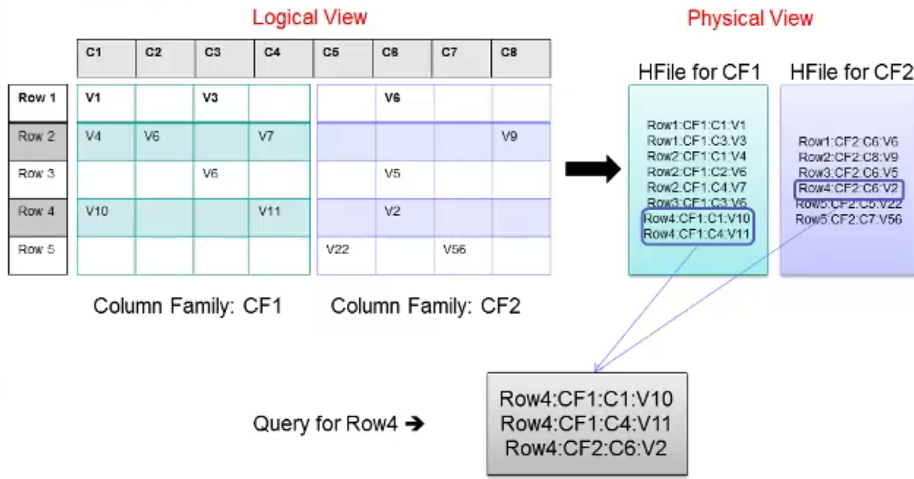
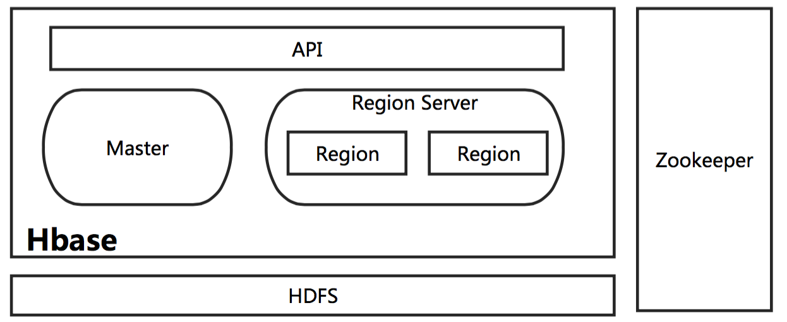
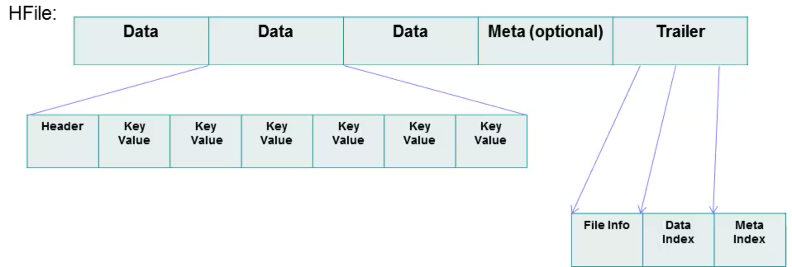
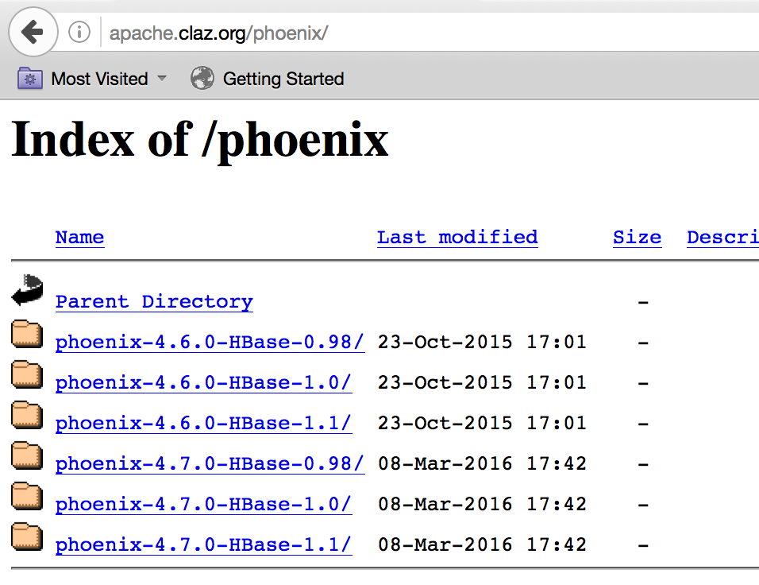
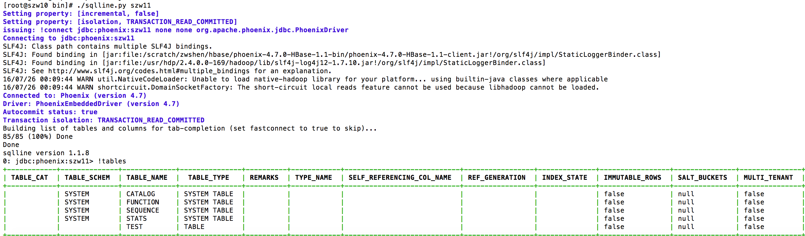
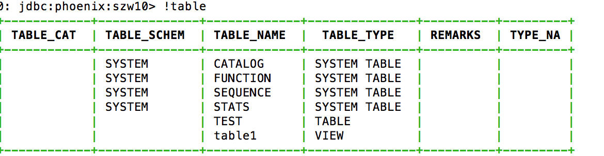
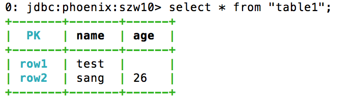
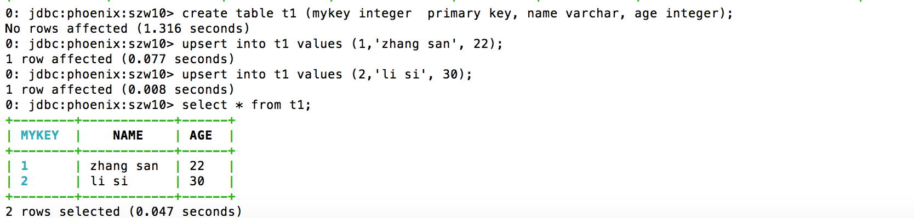

# HBase 深入浅出
了解 HBase

**标签:** 分析

[原文链接](https://developer.ibm.com/zh/articles/ba-cn-bigdata-hbase/)

沈钊伟

发布: 2016-11-16

* * *

## HBase 在大数据生态圈中的位置

提到大数据的存储，大多数人首先联想到的是 Hadoop 和 Hadoop 中的 HDFS 模块。大家熟知的 Spark、以及 Hadoop 的 MapReduce，可以理解为一种计算框架。而 HDFS，我们可以认为是为计算框架服务的存储层。因此不管是 Spark 还是 MapReduce，都需要使用 HDFS 作为默认的持久化存储层。那么 HBase 又是什么，可以用在哪里，解决什么样的问题？简单地，我们可以认为 HBase 是一种类似于数据库的存储层，也就是说 HBase 适用于结构化的存储。并且 HBase 是一种列式的分布式数据库，是由当年的 Google 公布的 BigTable 的论文而生。不过这里也要注意 HBase 底层依旧依赖 HDFS 来作为其物理存储，这点类似于 Hive。

可能有的读者会好奇 HBase 于 Hive 的区别，我们简单的梳理一下 Hive 和 HBase 的应用场景：

Hive 适合用来对一段时间内的数据进行分析查询，例如，用来计算趋势或者网站的日志。Hive 不应该用来进行实时的查询（Hive 的设计目的，也不是支持实时的查询）。因为它需要很长时间才可以返回结果；HBase 则非常适合用来进行大数据的实时查询，例如 Facebook 用 HBase 进行消息和实时的分析。对于 Hive 和 HBase 的部署来说，也有一些区别，Hive 一般只要有 Hadoop 便可以工作。而 HBase 则还需要 Zookeeper 的帮助（Zookeeper，是一个用来进行分布式协调的服务，这些服务包括配置服务，维护元信息和命名空间服务）。再而，HBase 本身只提供了 Java 的 API 接口，并不直接支持 SQL 的语句查询，而 Hive 则可以直接使用 HQL（一种类 SQL 语言）。如果想要在 HBase 上使用 SQL，则需要联合使用 Apache Phonenix，或者联合使用 Hive 和 HBase。但是和上面提到的一样，如果集成使用 Hive 查询 HBase 的数据，则无法绕过 MapReduce，那么实时性还是有一定的损失。Phoenix 加 HBase 的组合则不经过 MapReduce 的框架，因此当使用 Phoneix 加 HBase 的组成，实时性上会优于 Hive 加 HBase 的组合，我们后续也会示例性介绍如何使用两者。最后我们再提下 Hive 和 HBase 所使用的存储层，默认情况下 Hive 和 HBase 的存储层都是 HDFS。但是 HBase 在一些特殊的情况下也可以直接使用本机的文件系统。例如 Ambari 中的 AMS 服务直接在本地文件系统上运行 HBase。

## HBase 与传统关系数据库的区别

首先让我们了解下什么是 ACID。ACID 是指数据库事务正确执行的四个基本要素的缩写，其包含：原子性（Atomicity）、一致性（Consistency）、隔离性（Isolation）以及持久性（Durability）。对于一个支持事务（Transaction）的数据库系统，必需要具有这四种 [特性](http://baike.baidu.com/view/884393.htm) ，否则在事务过程（Transaction Processing）当中无法保证数据的正确性，交易过程极可能达不到交易方的要求。下面，我们就简单的介绍下这 4 个特性的含义。

- 原子性(Atomicity)是指一个事务要么全部执行,要么全部不执行。换句话说，一个事务不可能只执行了一半就停止了。比如一个事情分为两步完成才可以完成，那么这两步必须同时完成，要么一步也不执行，绝不会停留在某一个中间状态。如果事物执行过程中，发生错误，系统会将事物的状态回滚到最开始的状态。

- 一致性(Consistency)是指事务的运行并不改变数据库中数据的一致性。也就是说，无论并发事务有多少个，但是必须保证数据从一个一致性的状态转换到另一个一致性的状态。例如有 a、b 两个账户，分别都是 10。当 a 增加 5 时，b 也会随着改变，总值 20 是不会改变的。

- 隔离性（Isolation）是指两个以上的事务不会出现交错执行的状态。因为这样可能会导致数据不一致。如果有多个事务，运行在相同的时间内，执行相同的功能，事务的隔离性将确保每一事务在系统中认为只有该事务在使用系统。这种属性有时称为 [串行](http://baike.baidu.com/view/196479.htm) 化，为了防止事务操作间的混淆，必须串行化或序列化请求，使得在同一时间仅有一个请求用于同一数据。

- 持久性(Durability)指事务执行成功以后,该事务对数据库所作的更改便是持久的保存在数据库之中，不会无缘无故的回滚。


在具体的介绍 HBase 之前，我们先简单对比下 HBase 与传统关系数据库的（RDBMS，全称为 Relational Database Management System）区别。如表 1 所示。

##### 表 1\. HBase 与 RDBMS 的区别

HBaseRDBMS硬件架构类似于 Hadoop 的分布式集群，硬件成本低廉传统的多核系统，硬件成本昂贵容错性由软件架构实现，由于由多个节点组成，所以不担心一点或几点宕机一般需要额外硬件设备实现 HA 机制数据库大小PBGB、TB数据排布方式稀疏的、分布的多维的 Map以行和列组织数据类型Bytes丰富的数据类型事物支持ACID 只支持单个 Row 级别全面的 ACID 支持，对 Row 和表查询语言只支持 Java API （除非与其他框架一起使用，如 Phoenix、Hive）SQL索引只支持 Row-key，除非与其他技术一起应用，如 Phoenix、Hive支持吞吐量百万查询/每秒数千查询/每秒

理解了上面的表格之后，我们在看看数据是如何在 HBase 以及 RDBMS 中排布的。首先，数据在 RDBMS 的排布大致如表 2。

##### 表 2\. 数据在 RDBMS 中的排布示例

ID姓名密码时间戳1张三111201607192李四22220160720

那么数据在 HBase 中的排布会是什么样子呢？如表 3 所示（这只是逻辑上的排布）。

##### 表 3\. 数据在 HBase 中的排布（逻辑上）

Row-KeyValue（CF、Qualifier、Version）1info{‘姓’: ‘张’，’名’:’三’} pwd{‘密码’: ‘111’}2Info{‘姓’: ‘李’，’名’:’四’} pwd{‘密码’: ‘222’}

从上面示例表中，我们可以看出，在 HBase 中首先会有 Column Family 的概念，简称为 CF。CF 一般用于将相关的列（Column）组合起来。在物理上 HBase 其实是按 CF 存储的，只是按照 Row-key 将相关 CF 中的列关联起来。物理上的数据排布大致可以如表 4 所示。

##### 表 4\. 数据在 HBase 中的排布

Row-KeyCF:Column-Key时间戳Cell Value1info:fn123456789三1info:ln123456789张2info:fn123456789四2info:ln123456789李

我们已经提到 HBase 是按照 CF 来存储数据的。在表 3 中，我们看到了两个 CF，分别是 info 和 pwd。info 存储着姓名相关列的数据，而 pwd 则是密码相关的数据。上表便是 info 这个 CF 存储在 Hbase 中的数据排布。Pwd 的数据排布是类似的。上表中的 fn 和 ln 称之为 Column-key 或者 Qulifimer。在 Hbase 中，Row-key 加上 CF 加上 Qulifier 再加上一个时间戳才可以定位到一个单元格数据（Hbase 中每个单元格默认有 3 个时间戳的版本数据）。初学者，在一开始接触这些概念是很容易混淆。其实不管是 CF 还是 Qulifier 都是客户定义出来的。也就是说在 HBase 中创建表格时，就需要指定表格的 CF、Row-key 以及 Qulifier。我们会在后续的介绍中，尝试指定这些相关的概念，以便加深理解。这里我们先通过下图理解下 HBase 中，逻辑上的数据排布与物理上的数据排布之间的关系。

##### 图 1\. Hbase 中逻辑上数据的排布与物理上排布的关联



从上图我们看到 Row1 到 Row5 的数据分布在两个 CF 中，并且每个 CF 对应一个 HFile。并且逻辑上每一行中的一个单元格数据，对应于 HFile 中的一行，然后当用户按照 Row-key 查询数据的时候，HBase 会遍历两个 HFile，通过相同的 Row-Key 标识，将相关的单元格组织成行返回，这样便有了逻辑上的行数据。讲解到这，我们就大致了解 HBase 中的数据排布格式，以及与 RDBMS 的一些区别。

对于 RDBMS 来说，一般都是以 SQL 作为为主要的访问方式。而 HBase 是一种”NoSQL”数据库。”NoSQL”是一个通用词表示该数据库并

是 RDBMS 。现在的市面上有许多种 NoSQL 数据库，如 BerkeleyDB 是本地 NoSQL 数据库的例子, HBase 则为大型分布式 NoSql 数据库。从技术上来说，Hbase 更像是”数据存储”而非”数据库”（HBase 和 HDFS 都属于大数据的存储层）。因此，HBase 缺少很多 RDBMS 特性，如列类型，二级索引，触发器和高级查询语言等。然而, HBase 也具有许多其他特征同时支持线性化和模块化扩充。最明显的方式，我们可以通过增加 Region Server 的数量扩展 HBase。并且 HBase 可以放在普通的服务器中，例如将集群从 5 个扩充到 10 个 Region Server 时，存储空间和处理容量都可以同时翻倍。当然 RDBMS 也能很好的扩充，但仅对一个点，尤其是对一个单独数据库服务器而言，为了更好的性能，往往需要特殊的硬件和存储设备（往往价格也非常昂贵）。

## HBase 相关的模块以及 HBase 表格的特性

在这里，让我们了解下 HBase 都有哪些模块，以及大致的工作流程。前面我们提到过 HBase 也是构建于 HDFS 之上，这是正确的，但也不是完全正确。HBase 其实也支持直接在本地文件系统之上运行，不过这样的 HBase 只能运行在一台机器上，那么对于分布式大数据的环境是没有意义的（这也是所谓的 HBase 的单机模式）。一般只用于测试或者验证某一个 HBase 的功能，后面我们在详细的介绍 HBase 的几种运行模式。这里我们只要记得在分布式的生产环境中，HBase 需要运行在 HDFS 之上，以 HDFS 作为其基础的存储设施。HBase 上层提供了访问的数据的 Java API 层，供应用访问存储在 HBase 的数据。在 HBase 的集群中主要由 Master 和 Region Server 组成，以及 Zookeeper，具体模块如下图所示。

##### 图 2\. HBase 的相关模块



接下来，我们简单的一一介绍下 HBase 中相关模块的作用。

- **Master**

    HBase Master 用于协调多个 Region Server，侦测各个 Region Server 之间的状态，并平衡 Region Server 之间的负载。HBase Master 还有一个职责就是负责分配 Region 给 Region Server。HBase 允许多个 Master 节点共存，但是这需要 Zookeeper 的帮助。不过当多个 Master 节点共存时，只有一个 Master 是提供服务的，其他的 Master 节点处于待命的状态。当正在工作的 Master 节点宕机时，其他的 Master 则会接管 HBase 的集群。

- **Region Server**

    对于一个 Region Server 而言，其包括了多个 Region。Region Server 的作用只是管理表格，以及实现读写操作。Client 直接连接 Region Server，并通信获取 HBase 中的数据。对于 Region 而言，则是真实存放 HBase 数据的地方，也就说 Region 是 HBase 可用性和分布式的基本单位。如果当一个表格很大，并由多个 CF 组成时，那么表的数据将存放在多个 Region 之间，并且在每个 Region 中会关联多个存储的单元（Store）。

- **Zookeeper**

    对于 HBase 而言，Zookeeper 的作用是至关重要的。首先 Zookeeper 是作为 HBase Master 的 HA 解决方案。也就是说，是 Zookeeper 保证了至少有一个 HBase Master 处于运行状态。并且 Zookeeper 负责 Region 和 Region Server 的注册。其实 Zookeeper 发展到目前为止，已经成为了分布式大数据框架中容错性的标准框架。不光是 HBase，几乎所有的分布式大数据相关的开源框架，都依赖于 Zookeeper 实现 HA。


一个完整分布式的 HBase 的工作原理示意图如下：

##### 图 3\. HBase 的工作原理


在上面的图中，我们需要注意几个我们之前没有提到的概念：Store、MemStore、StoreFile 以及 HFile。带着这几个新的概念，我们完整的梳理下整个 HBase 的工作流程。

首先我们需要知道 HBase 的集群是通过 Zookeeper 来进行机器之前的协调，也就是说 HBase Master 与 Region Server 之间的关系是依赖 Zookeeper 来维护。当一个 Client 需要访问 HBase 集群时，Client 需要先和 Zookeeper 来通信，然后才会找到对应的 Region Server。每一个 Region Server 管理着很多个 Region。对于 HBase 来说，Region 是 HBase 并行化的基本单元。因此，数据也都存储在 Region 中。这里我们需要特别注意，每一个 Region 都只存储一个 Column Family 的数据，并且是该 CF 中的一段（按 Row 的区间分成多个 Region）。Region 所能存储的数据大小是有上限的，当达到该上限时（Threshold），Region 会进行分裂，数据也会分裂到多个 Region 中，这样便可以提高数据的并行化，以及提高数据的容量。每个 Region 包含着多个 Store 对象。每个 Store 包含一个 MemStore，和一个或多个 HFile。MemStore 便是数据在内存中的实体，并且一般都是有序的。当数据向 Region 写入的时候，会先写入 MemStore。当 MemStore 中的数据需要向底层文件系统倾倒（Dump）时（例如 MemStore 中的数据体积到达 MemStore 配置的最大值），Store 便会创建 StoreFile，而 StoreFile 就是对 HFile 一层封装。所以 MemStore 中的数据会最终写入到 HFile 中，也就是磁盘 IO。由于 HBase 底层依靠 HDFS，因此 HFile 都存储在 HDFS 之中。这便是整个 HBase 工作的原理简述。

我们了解了 HBase 大致的工作原理，那么在 HBase 的工作过程中，如何保证数据的可靠性呢？带着这个问题，我们理解下 HLog 的作用。HBase 中的 HLog 机制是 WAL 的一种实现，而 WAL（一般翻译为预写日志）是事务机制中常见的一致性的实现方式。每个 Region Server 中都会有一个 HLog 的实例，Region Server 会将更新操作（如 Put，Delete）先记录到 WAL（也就是 HLog）中，然后将其写入到 Store 的 MemStore，最终 MemStore 会将数据写入到持久化的 HFile 中（MemStore 到达配置的内存阀值）。这样就保证了 HBase 的写的可靠性。如果没有 WAL，当 Region Server 宕掉的时候，MemStore 还没有写入到 HFile，或者 StoreFile 还没有保存，数据就会丢失。或许有的读者会担心 HFile 本身会不会丢失，这是由 HDFS 来保证的。在 HDFS 中的数据默认会有 3 份。因此这里并不考虑 HFile 本身的可靠性。

前面，我们很多次提到了 HFile，也就是 HBase 持久化的存储文件。也许有的读者还不能完全理解 HFile，这里我们便详细的看看 HFile 的结构，如下图。

##### 图 4\. HFile 的结构



从图中我们可以看到 HFile 由很多个数据块（Block）组成，并且有一个固定的结尾块。其中的数据块是由一个 Header 和多个 Key-Value 的键值对组成。在结尾的数据块中包含了数据相关的索引信息，系统也是通过结尾的索引信息找到 HFile 中的数据。HFile 中的数据块大小默认为 64KB。如果访问 HBase 数据库的场景多为有序的访问，那么建议将该值设置的大一些。如果场景多为随机访问，那么建议将该值设置的小一些。一般情况下，通过调整该值可以提高 HBase 的性能。

如果要用很短的一句话总结 HBase，我们可以认为 HBase 就是一个有序的多维 Map，其中每一个 Row-key 映射了许多数据，这些数据存储在 CF 中的 Column。我们可以用下图来表示这句话。

##### 图 5\. HBase 的数据映射关系


## HBase 的使用建议

之前我介绍了很多 HBase 与 RDBMS 的区别，以及一些优势的地方。那么什么时候最需要 HBase，或者说 HBase 是否可以替代原有的 RDBMS？对于这个问题，我们必须时刻谨记——HBase 并不适合所有问题，其设计目标并不是替代 RDBMS，而是对 RDBMS 的一个重要补充，尤其是对大数据的场景。当需要考量 HBase 作为一个备选项时，我们需要进行如下的调研工作。

首先，要确信有足够多数据，如果有上亿或上千亿行数据，HBase 才会是一个很好的备选。其次，需要确信业务上可以不依赖 RDBMS 的额外特性，例如，列数据类型, 二级索引，SQL 查询语言等。再而，需要确保有足够硬件。且不说 HBase，一般情况下当 HDFS 的集群小于 5 个数据节点时，也干不好什么事情 (HDFS 默认会将每一个 Block 数据备份 3 分)，还要加上一个 NameNode。

以下我给了一些使用 HBase 时候对表格设计的一些建议，读者也可以理解背后的含义。不过我并不希望这些建议成为使用 HBase 的教条，毕竟也有不尽合理的地方。首先，一个 HBase 数据库是否高效，很大程度会和 Row-Key 的设计有关。因此，如何设计 Row-key 是使用 HBase 时，一个非常重要的话题。随着数据访问方式的不同，Row-Key 的设计也会有所不同。不过概括起来的宗旨只有一个，那就是尽可能选择一个 Row-Key，可以使你的数据均匀的分布在集群中。这也很容易理解，因为 HBase 是一个分布式环境，Client 会访问不同 Region Server 获取数据。如果数据排布均匀在不同的多个节点，那么在批量的 Client 便可以从不同的 Region Server 上获取数据，而不是瓶颈在某一个节点，性能自然会有所提升。对于具体的建议我们一般有几条：

1. 当客户端需要频繁的写一张表，随机的 RowKey 会获得更好的性能。
2. 当客户端需要频繁的读一张表，有序的 RowKey 则会获得更好的性能。
3. 对于时间连续的数据（例如 log），有序的 RowKey 会很方便查询一段时间的数据（Scan 操作）。

上面我们谈及了对 Row-Key 的设计，接着我们需要想想是否 Column Family 也会在不同的场景需要不同的设计方案呢。答案是肯定的，不过 CF 跟 Row-key 比较的话，确实也简单一些，但这并不意味着 CF 的设计就是一个琐碎的话题。在 RDBMS（传统关系数据库）系统中，我们知道如果当用户的信息分散在不同的表中，便需要根据一个 Key 进行 Join 操作。而在 HBase 中，我们需要设计 CF 来聚合用户所有相关信息。简单来说，就是需要将数据按类别（或者一个特性）聚合在一个或多个 CF 中。这样，便可以根据 CF 获取这类信息。上面，我们讲解过一个 Region 对应于一个 CF。那么设想，如果在一个表中定义了多个 CF 时，就必然会有多个 Region。当 Client 查询数据时，就不得不查询多个 Region。这样性能自然会有所下降，尤其当 Region 夸机器的时候。因此在大多数的情况下，一个表格不会超过 2 到 3 个 CF，而且很多情况下都是 1 个 CF 就足够了。

## Phoenix 的使用

当一个新业务需要使用 HBase 时，是完全可以使用 Java API 开发 HBase 的应用，从而实现具体的业务逻辑。但是如果对于习惯使用 RDBMS 的 SQL，或者想要将原来使用 JDBC 的应用直接迁移到 HBase，这就是不可能的。由于这种缅怀过去的情怀，便催生了 Phoenix 的诞生。那么 Phoenix 都能提供哪些功能呢？简单来说 Phoenix 在 HBase 之上提供了 OLTP 相关的功能，例如完全的 ACID 支持、SQL、二级索引等，此外 Phoenix 还提供了标准的 JDBC 的 API。在 Phoenix 的帮助下，RDBMS 的用户可以很容易的使用 HBase，并且迁移原有的业务到 HBase 之中。下来就让我们简单了解一下，如何在 HBase 之上使用 Phoenix。

首先我们需要在 Phoenix 的网站下载与 HBase 版本对应的 Phoenix 安装包。我环境的 HBase 是通过 Ambari HDP2.4 部署的，其中的 HBase 是 1.1 的版本，因此我下载的是下图中的 phoenix-4.7.0-HBase-1.1。

##### 图 6\. Phoenix 的下载页面



下载之后需要解压 Phoenix 的 tar 包，并将所有的 jar 文件拷贝到每台 Region Server 机器的 $HBASE\_HOME/lib 下面，并重启所有的 Region Server。对于 Ambari 部署的 HBase，其 HBASE\_HOME 目录便是/usr/hdp/2.4.0.0-169/hbase/lib/,添加 Jar 包到该目录之后，可以直接在 Ambari 的 WEB 中，重启整个 HBase。重启之后，我们便尽可以进入到刚才解压的 Phoenix 目录，进入其子目录 bin。在这个目录中 Phoenix 提供了 sqlline.py 脚本。我们可以通过该脚本连接 HBase，并测试相关的 SQL 语句。我们可以在 bin 目录中看到文件 hbase-site.xml，如果需要对 Phoenix 设置相关参数，就需要更改该文件，并将该文件同步给 HBase 中。Sqlline.py 最简单的使用方法，就是直接以 Zookeeper 机器名为参数即可，如下图：

##### 图 7\. Sqlline.py 使用示意图



上图中，我们还使用了 sqlline.py 支持的 table 命令，该命令可以列出 HBase 中所有的表。这里需要注意 Phoenix 不支持直接显示 HBase Shell（HBase 自带一个 CLI 访问工具，后续文章在介绍）中创建的表格。原因很简单，当在 Phoenix 创建一张表时，Phoenix 是将表进行了重组装。而对 HBase Shell 创建的表 Phoenix 并未进行加工，所以无法直接显示。如果需要将 HBase Shell 中创建的表格关联到 Phoenix 中查看，就需要在 Phoenix 中创建一个视图（View）做关联。例如，我们现在 HBase Shell 中创建了一张表”table1″，并插入了几行数据，如下。

```
hbase(main):022:0> scan 'table1'
ROW              COLUMN+CELL
row1           column=cf1:name, timestamp=1469498246529, value=test
row2           column=cf1:age, timestamp=1469497088506, value=26
row2           column=cf1:name, timestamp=1469497072735, value=sang

```

Show moreShow more icon

然后我们在 Sqlline.py 的终端中执行”!table”命令，我们发现并没有 table1 这张表。接下来我们执行如下的命令：

```
create view "table1" (pk VARCHAR PRIMARY KEY, "cf1"."name" VARCHAR, "cf1"."age" VARCHAR);

```

Show moreShow more icon

然后再使用!table 命令，这时候结果如下：

##### 图 8\. Phoenix 执行表查询结果



我们可以看到结果中多了一个 table1 的视图，这样 Phoenix 就将 table1 表的内容关联到了 Phoenix 的视图当中。我们可以使用 select 等语句访问其中的内容，如下：

##### 图 9\. Phoenix 执行查询结果



最后我们再回头解释下刚才创建视图的命令。在创建关联的视图时，我们需要确保视图和列的名称与原表的名称完全一致。Phoenix 默认使用大写字母，因此，当 HBase Shell 中使用的是小写，我们便需要使用双引号引用相关的名称。如果原名称是大写，就可以省去双引号。Pk 是我们定义的一个主键名（可以随便定义），这是由于在 HBase Shell 中并没有主键的概念，所以 Row-key 是没有一个名称的。cf1 和 name 加起来用于指向 HBase 中的一个单元格（Cell），示例的命令中我关联了两个单元格（如果你愿意，可以只关联一个）。在安装了 Phoenix 之后，我们应尽量避免直接使用 HBase Shell 来创建表，取而代之的便是直接使用 Phoenix。例如下图中，我使用 Phoenix 创建了一张表 t1，包含了 name 和 age 两个列，并插入了两行数据。具体的命令如下图：

##### 图 10\. 如何在 Phoenix 中创建表



看到这些命令之后，熟悉 SQL 的读者肯定不会觉得陌生。这便是 Phoenix 提供的最重要的功能之一——SQL 的支持。我们可以看到在 Phoenix 中，我们使用了丰富的数据类型，如 INTEGER 和 VARCHAR。这些都是无法直接在 HBase 中使用的。有兴趣的读者可以在 sqlline.py 中尝试更多的 SQL 语句。当需要从 sqlline.py 退出时，可以执行!quit 命令（可以通过使用!help 查看更多的命令）。退出 sqlline.py 之后，让我们在 HBase Shell 中看看 Phoenix 创建的表会是什么样子。如下：

```
hbase(main):002:0> scan 'T1'
ROW                                        COLUMN+CELL
\x80\x00\x00\x01           column=0:AGE, timestamp=1469539501199, value=\x80\x00\x00\x16
\x80\x00\x00\x01           column=0:NAME, timestamp=1469539501199, value=zhang san
\x80\x00\x00\x01           column=0:_0, timestamp=1469539501199, value=x
\x80\x00\x00\x02           column=0:AGE, timestamp=1469539516700, value=\x80\x00\x00\x1E
\x80\x00\x00\x02           column=0:NAME, timestamp=1469539516700, value=li si
\x80\x00\x00\x02           column=0:_0, timestamp=1469539516700, value=x

```

Show moreShow more icon

我们可以明显的看到，Phoenix 将如上的数据进行了重组，才形成了图 10 中所展示的样子。到这里，我们就简单的介绍了 Phoenix 简单的用法。需要强调的是，本章所展示的只是 Phoenix 所提供特性的很小一部分。Phoenix 作为一个标准 JDBC API 的支持者，原有建立在 JDBC 之上应用程序可以直接通过 Phoenix 访问 HBase，例如 Squirrel 这样图形化的 SQL 客户端。当然也可以直接在 Java 代码中通过 JDBC 访问 HBase 数据库，而不用使用 HBase 的 Java API 重新开发。想要了解更多 Phoenix 特性的读者，可以从 Apache Phoenix 官方的文档中查看，例如二级索引等。

## 结束语

对于 HBase 还有很多内容需要介绍，例如使用 Java API 开发应用，快速部署使用（涉及 Ambari 以及 HBase 部署模式）、HBase Shell 以及如何集成 Hive 和 HBase 等。目前 HBase 的应用场景很多，尤其是互联网公司的后台信息存储中，例如淘宝等都在使用 HBase。我相信了解 HBase 之后，可以更好的架构使用大数据解决方案，这里篇幅有限，后续再介绍更多内容。

## 参考资源

[Apache Tachyon](http://tachyon-project.org/) [Apache Hadoop](https://hadoop.apache.org/) [Apache Phoneix](http://phoenix.apache.org/) [Apache HBase](http://hbase.apache.org/)