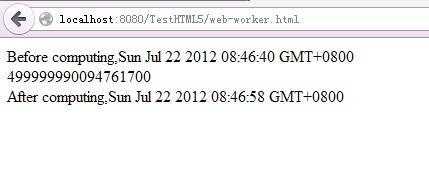
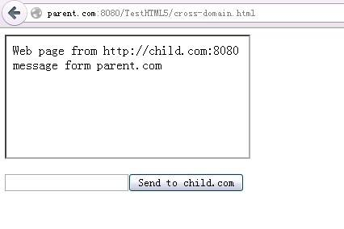
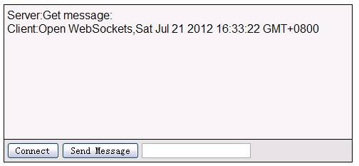
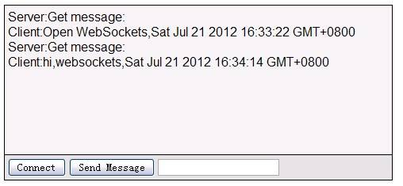
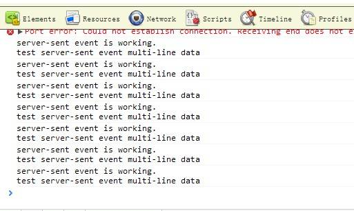

# HTML5 postMessage 和 onmessage API 详细应用
postMessage 和 onmessage API 在客户端的应用情况

**标签:** Web 开发

[原文链接](https://developer.ibm.com/zh/articles/1301-jiangjj-html5message/)

姜俊杰

发布: 2013-01-10

* * *

## Web Workers

### Web Workers 简介

至 2008 年 W3C 制定出第一个 HTML5 草案开始，HTML5 承载了越来越多崭新的特性和功能。它不但强化了 Web 系统或网页的表现性能，而且还增加了对本地数据库等 Web 应用功能的支持。其中，最重要的一个便是对多线程的支持。在 HTML5 中提出了工作线程（Web Workers）的概念，并且规范出 Web Workers 的三大主要特征：能够长时间运行（响应），理想的启动性能以及理想的内存消耗。Web Workers 允许开发人员编写能够长时间运行而不被用户所中断的后台程序，去执行事务或者逻辑，并同时保证页面对用户的及时响应。

Web Workers 为 Web 前端网页上的脚本提供了一种能在后台进程中运行的方法。一旦它被创建，Web Workers 就可以通过 postMessage 向任务池发送任务请求，执行完之后再通过 postMessage 返回消息给创建者指定的事件处理程序 ( 通过 onmessage 进行捕获 )。Web Workers 进程能够在不影响用户界面的情况下处理任务，并且，它还可以使用 XMLHttpRequest 来处理 I/O，但通常，后台进程（包括 Web Workers 进程）不能对 DOM 进行操作。如果希望后台程序处理的结果能够改变 DOM，只能通过返回消息给创建者的回调函数进行处理。

浏览器对 HTML5 支持情况可以参考网站 [When can I use…](http://caniuse.com)

### 在 Web Workers 中使用 postMessage 和 onmessage

首先，需要在客户端页面的 JavaScript 代码中 new 一个 Worker 实例出来，参数是需要在另一个线程中运行的 JavaScript 文件名称。然后在这个实例上监听 onmessage 事件。最后另一个线程中的 JavaScript 就可以通过调用 postMessage 方法在这两个线程间传递数据了。

##### 清单 1\. 主线程中创建 Worker 实例，并监听 onmessage 事件

```
<html>
<head>
<meta http-equiv="Content-Type" content="text/html; charset=iso-8859-1">
<title>Test Web worker</title>
<script type="text/JavaScript">
     function init(){
         var worker = new Worker('compute.js');
         //event 参数中有 data 属性，就是子线程中返回的结果数据
         worker.onmessage= function (event) {
             // 把子线程返回的结果添加到 div 上
             document.getElementById("result").innerHTML +=
                event.data+"<br/>";
         };
     }
</script>
</head>
<body onload="init()">
<div id="result"></div>
</body>
</html>

```

Show moreShow more icon

在客户端的 compute.js 中，只是简单的重复多次加和操作，最后通过 postMessage 方法把结果返回给主线程，目的就是等待一段时间。而在这段时间内，主线程不应该被阻塞，用户可以通过拖拽浏览器，变大缩小浏览器窗口等操作测试这一现象。这个非阻塞主线程的结果就是 Web Workers 想达到的目的。

##### 清单 2\. compute.js 中调用 postMessage 方法返回计算结果

```
var i=0;

function timedCount(){
     for(var j=0,sum=0;j<100;j++){
         for(var i=0;i<100000000;i++){
             sum+=i;
         }
     }
     // 调用 postMessage 向主线程发送消息
     postMessage(sum);
}

postMessage("Before computing,"+new Date());
timedCount();
postMessage("After computing,"+new Date());

```

Show moreShow more icon

##### 图 1\. 浏览器中运行结果



## Cross-document messaging

### Cross-document messaging 简介

由于同源策略的限制，JavaScript 跨域的问题，一直是一个颇为棘手的问题。HTML5 提供了在网页文档之间互相接收与发送信息的功能。使用这个功能，只要获取到网页所在窗口对象的实例，不仅同源（域 + 端口号）的 Web 网页之间可以互相通信，甚至可以实现跨域通信。 要想接收从其他窗口发送来的信息，必须对窗口对象的 onmessage 事件进行监听，其它窗口可以通过 postMessage 方法来传递数据。该方法使用两个参数：第一个参数为所发送的消息文本，但也可以是任何 JavaScript 对象（通过 JSON 转换对象为文本），第二个参数为接收消息的对象窗口的 URL 地址，可以在 URL 地址字符串中使用通配符’\*’指定全部地。

### 在 Cross-document messaging 中使用 postMessage 和 onmessage

为了实现不同域之间的通信，需要在操作系统的 hosts 文件添加两个域名，进行模拟。

##### 清单 3\. hosts 文件中添加两个不同的域名

```
127.0.0.1      parent.com
127.0.0.1      child.com

```

Show moreShow more icon

在父网页中通过 iframe 嵌入子页面，并在 JavaScript 代码中调用 postMessage 方法发送数据到子窗口。

##### 清单 4\. 父页面中嵌入子页面，调用 postMessage 方法发送数据

```
<html>
<head>
<meta http-equiv="Content-Type" content="text/html; charset=UTF-8">
<title>Test Cross-domain communication using HTML5</title>
<script type="text/JavaScript">
     function sendIt(){
         // 通过 postMessage 向子窗口发送数据
         document.getElementById("otherPage").contentWindow
             .postMessage(
                 document.getElementById("message").value,
                "http://child.com:8080"
             );
     }
</script>
</head>
<body>
     <!-- 通过 iframe 嵌入子页面 -->
     <iframe src="http://child.com:8080/TestHTML5/other-domain.html"
                 id="otherPage"></iframe>
     <br/><br/>
     <input type="text" id="message"><input type="button"
             value="Send to child.com" onclick="sendIt()" />
</body>
</html>

```

Show moreShow more icon

在子窗口中监听 onmessage 事件，并用 JavaScript 实现显示父窗口发送过来的数据。

##### 清单 5\. 子窗口中监听 onmessage 事件，显示父窗口发送来的数据

```
<html>
<head>
<meta http-equiv="Content-Type" content="text/html; charset=UTF-8">
<title>Web page from child.com</title>
<script type="text/JavaScript">
     //event 参数中有 data 属性，就是父窗口发送过来的数据
     window.addEventListener("message", function( event ) {
         // 把父窗口发送过来的数据显示在子窗口中
       document.getElementById("content").innerHTML+=event.data+"<br/>";
     }, false );

</script>
</head>
<body>
     Web page from http://child.com:8080
     <div id="content"></div>
</body>
</html>

```

Show moreShow more icon

##### 图 2\. 父窗口嵌入子窗口


##### 图 3\. 父窗口发送数据到子窗口



## WebSockets

### WebSockets 简介

在 Web 应用中，HTTP 协议决定了客户端和服务端连接是短连接，即客户端 Request，服务端 Response，连接断开。要想实现客户端和服务端实时通信，只能通过客户端轮询来实现。服务端推送数据也并不是字面上意思上的直接推，其实还是客户端自己取。WebSockets 是 HTML5 规范新引入的功能，用于解决浏览器与后台服务器双向通讯的问题，使用 WebSockets 技术，后台可以随时向前端推送消息，以保证前后台状态统一。

### 在 WebSockets 中使用 send 和 onmessage

由于文本主要介绍 postMessage(send) 和 onmessage 客户端 API 的应用，而 WebSockets 涉及到服务器端代码的实现，所以本文将选取最简单的服务器端框架来编写服务器代码。WebSockets 服务器端有 jetty 提供的基于 Java 的实现，有 WebSocket-Node 基于 node.js 的实现，在 .Net 4.5 中也直接提供了 WebSockets 的支持。本文将使用 WebSocket-Node 提供的示例代码，稍作修改作为 WebSockets 的服务器端。关于 node.js 的介绍以及使用请参考 node.js 官方网站 [node.js](http://nodejs.org/) ，关于 WebSocket-Node 的使用请参考 [WebSocket-Node](https://github.com/Worlize/WebSocket-Node) 。

首先，需要在客户端通过 JavaScript 代码 new 一个 WebSocket 实例出来，参数是实现 WebSocket 服务器端 URL 地址。然后在这个实例上监听 onmessage 事件接收服务器端发送过来的数据。当然，客户端也可以调用 send 方法，发送数据到服务器端。

##### 清单 6\. 创建 WebSocket 对象，并监听 onmessage 事件

```
connect : function() {
    var location ="ws://localhost:8000/";
     // 创建 WebSockets 并传入 WebSockets server 地址
    this._ws =new WebSocket(location);
    this._ws.onmessage=this._onmessage;
//WebSockets 还提供了 onopen 以及 onclose 事件
    this._ws.onopen =this._onopen;
    this._ws.onclose =this._onclose;
}

```

Show moreShow more icon

在 `_onmessage` 方法中，接收数据，并显示在页面上

##### 清单 7\. `_onmessage` 方法

```
_onmessage : function(event) {
     //event 参数中有 data 属性，就是服务器发送过来的数据
     if (event.data) {
         var messageBox = document.getElementById('messageBox');
         var spanText = document.createElement('span');
         spanText.className ='text';
         // 把服务器发送过来的数据显示在窗口中
         spanText.innerHTML = event.data;
         var lineBreak = document.createElement('br');
         messageBox.appendChild(spanText);
         messageBox.appendChild(lineBreak);
         messageBox.scrollTop = messageBox.scrollHeight
                 - messageBox.clientHeight;
     }
},

```

Show moreShow more icon

在 \_onopen 方法中，调用 \_send 方法发送一条消息到服务器端，告之连接已经建立。在 \_onclose 方法中，把 WebSocket 的实例设置成 null，释放资源。

##### 清单 8\. `_onopen`，`_onclose` 以及 `send` 方法

```
_onopen : function() {
     server._send("Client:Open WebSockets,"+new Date());
},
//message 参数就是客户端向服务器端发送的数据
_send : function(message) {
     if (this._ws)
         this._ws.send(message);
},
// 此方法提供外部代码调用
send : function(text) {
     if (text !=null&& text.length >0)
         server._send(text);
},

_onclose : function(m) {
     this._ws =null;
}

```

Show moreShow more icon

把这些方法封装在一个 server 对象中，方便提供外部调用。用户只需要先调用 server 的 connect 方法建立连接，然后调用 send 方法发送数据。

##### 清单 9\. 封装客户端实现

```
var server = {
     // 对外主要提供 connect 和 send 方法
    connect : function() {...},
    _onopen : function() {...},
    _send : function(message) {...},
    send : function(text) {...},
    _onmessage : function(event) {...},
    _onclose : function(m) {...}
};

```

Show moreShow more icon

在服务器端，通过 JavaScript 语言简单修改 WebSocket-Node 中提供的 echo-server.js 示例即可。这里只展示关键代码部分，其它代码请参见 WebSocket-Node 示例。

##### 清单 10\. WebSockets 服务器端简单实现

```
// 监听客户端的连接请求
wsServer.on('connect', function(connection) {
    function sendCallback(err) {
        if (err) console.error("send() error: " + err);
    }
     // 监听客户端发送数据的请求
    connection.on('message', function(message) {
        if (message.type === 'utf8') {// 区别客户端发过来的数据是文本还是二进制类型
            connection.sendUTF(
                "Server:Get message:<br/>"+message.utf8Data, sendCallback
             );
        }
        else if (message.type === 'binary') {
            connection.sendBytes(message.binaryData, sendCallback);
        }
    });
    connection.on('close', function(reasonCode, description) {
    });
});

```

Show moreShow more icon

##### 图 4\. 点击 Connect 按钮



##### 图 5\. 输入内容，单击 Send Message 按钮



## Server-Sent Events

### Server-Sent Events 简介

HTML5 Server-Sent 事件模型允许您从服务器 push 实时数据到浏览器。本文我们将介绍利用 Eventsource 对象处理与页面间的接收和发送数据。在客户端，我们使用 HTML5+JavaScript，服务端使用 Java。在现存的 Ajax 模式中，web 页面会持续不断地请求服务器传输新数据，由客户端负责请求数据。而在服务端发送模式下，无需在客户端代码中执行连续的数据请求，而是由服务端 push 推送更新。一旦您在页面中初始化了 Server-Sent 事件，服务端脚本将持续地发送更新。客户端 JavaScript 代码一旦接收到更新就将新的数据写入页面中展示出来。

### 在 Server-Sent Events 中使用 onmessage

Server-Sent Events 和 WebSockets 有相同之处，WebSockets 实现了服务器端以及客户端的双向通信功能，而 Server-Sent Events 则仅是指服务器端到客户端的单向通信，而且 Server-Sent Events 同样需要服务器端的实现，本文将使用基于 Java 的 Servlet 技术实现服务器端。关于服务器端向客户端写数据的格式，可以参考 W3C 关于 Server-Sent Events 的规范文档 [Server-Sent Events](http://www.w3.org/TR/eventsource/) 。由于是服务器端到客户端的单向通信，所以在 Server-Sent Events 中没有 postMessage 方法。

首先，在客户端通过 JavaScript 代码 new 一个 EventSource 实例出来，参数是实现 EventSource 服务器端 URL 地址。然后在这个实例上监听 onmessage 事件接收服务器端发送过来的数据。

##### 清单 11\. 创建 EventSource 对象，并监听 onmessage 事件

```
if (!!window.EventSource) {
// 创建 EventSource 实例，传入 server 地址
      var source = new EventSource('/TestHTML5/ServerSentEvent');
     } else {
      console.log("Your browser doesn't support server-sent event");
}
// 监听 message 事件，等待接收服务器端发送过来的数据
source.addEventListener('message', function(event) {
         //event 参数中有 data 属性，就是服务器发送过来的数据
      console.log(event.data);
}, false);

//EventSource 还提供了 onopen 以及 onerror 事件
source.addEventListener('open', function(event) {
}, false);

source.addEventListener('error', function(event) {
     if (event.readyState == EventSource.CLOSED) {
      }
}, false);

```

Show moreShow more icon

服务器端，在 Java 语言实现的 Servlet doGet 方法中使用 response 对象向客户端写数据

##### 清单 12\. 服务器端简单实现

```
// 这里必须设置 Content-Type 为 text/event-stream
response.setHeader("Content-Type", "text/event-stream");
response.setHeader("Cache-Control", "no-cache");
response.setCharacterEncoding ("UTF-8");

String id = new Date().toString();
response.getWriter().println("id:"+id);
// 向客户端写两行数据
response.getWriter().println("data:server-sent event is working.");
response.getWriter().println("data:test server-sent event multi-line data");
response.getWriter().println();
response.getWriter().flush();

```

Show moreShow more icon

##### 图 6\. Server-Sent Events 运行结果



## 结束语

本文详细介绍了 postMessage（send）和 onmessage API 在客户端的应用情况，可以看到在不同的场景中这两个方法的应用模式都是类似的。postMessage 的作用就是传递数据，而 onmessage 的作用就是接收数据。掌握此组 API 对以后开发 HTML 5 应用程序将会有所帮助。本文 Web Workers，Cross-document messaging，WebSockets 的代码在 Firefox 14 下通过测试，Server-Sent Events 的代码在 Chrome 16 下通过测试。

## 下载示例代码

[TestHTML5.zip](http://www.ibm.com/developerworks/cn/web/1301_jiangjj_html5message/TestHTML5.zip)